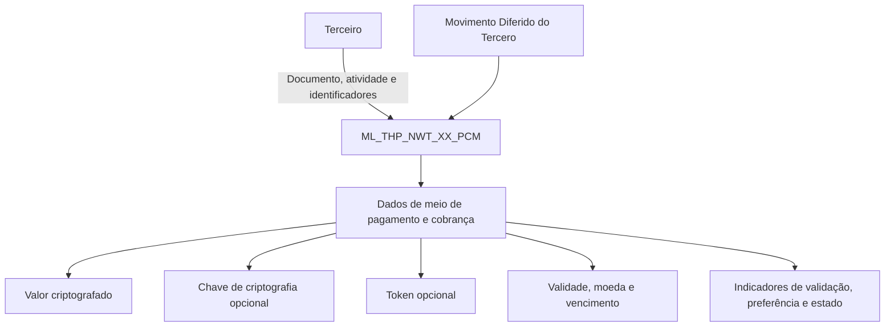

# Detalhamento dos Meios de Cobro e Pago no Movimento Diferido do Tercero — Visão Técnica

## 1. Metadados do Documento
- **Arquivo de Origem:** Não informado
- **Tipo de Documento:** Especificação Técnica
- **Domínio / Sistema:** Reef / Mapfre — Movimento Diferido do Tercero
- **Público-Alvo:** Desenvolvedores, Arquitetos, Analistas Funcionais e Operação
- **Data/Versão Identificada:** Não identificada

---

## 2. Resumo Executivo & Contexto de Negócio

O documento descreve, sob uma visão técnica, os dados de meios de pagamento e cobrança associados ao movimento diferido de terceiros. O escopo informado concentra-se no modelo de dados utilizado nessa operação.

A estrutura central identificada é a tabela `ML_THP_NWT_XX_PCM`, descrita como o “BUZÓN MEDIOS DE PAGO Y COBRO”. O conteúdo relaciona campos de identificação do terceiro, dados do instrumento de pagamento/cobrança, tokenização, criptografia, validade, preferências e metadados operacionais.

A especificação também informa a obrigatoriedade de cada coluna. A maior parte dos atributos é obrigatória, incluindo identificadores, companhia, documento e atividade do terceiro, sequencial do meio, dados de validade, classificações e indicadores de estado. Alguns atributos são explicitamente não obrigatórios, como chave de criptografia, token, mês e ano de vencimento, dados de processamento, erro, observações, identificador do terceiro, entidade bancária e dados criptografados.

**Nota de Análise:** o documento não detalha operações CRUD, métodos HTTP, contratos JSON, fluxos de integração, regras de criptografia, domínios permitidos para os campos ou significado operacional do valor `S` apresentado na coluna “CAMBIA VALOR”.

---

## 3. Arquitetura, Componentes & Tecnologias Envolvidas

Os elementos explicitamente identificados no documento são:

| Componente / Elemento | Papel descrito |
| :--- | :--- |
| Reef | Contexto de documentação citado como “DOCUMENTACIÓN Reef”. |
| Mapfre | Contexto corporativo associado ao documento. |
| Movimento Diferido do Tercero | Operação funcional à qual os meios de pagamento e cobrança pertencem. |
| `ML_THP_NWT_XX_PCM` | Tabela de dados denominada “BUZÓN MEDIOS DE PAGO Y COBRO”. |
| Terceiro | Entidade associada a documento, atividade e identificador. |
| Meio de pagamento e cobrança | Informação armazenada, validada, potencialmente criptografada e tokenizada. |



**Nota de Análise:** o diagrama representa exclusivamente relações inferíveis pelos nomes e descrições dos campos. O documento não descreve serviços, APIs, aplicações consumidoras, bancos de dados físicos, protocolos nem mecanismos de integração.

---

## 4. Regras de Negócio, Especificações Funcionais & Processos

### 4.1 Estrutura principal envolvida

A tabela que intervém na operação é:

- **Tabela:** `ML_THP_NWT_XX_PCM`
- **Descrição:** `BUZÓN MEDIOS DE PAGO Y COBRO`

### 4.2 Regras de obrigatoriedade

1. Os campos marcados como **SI** na coluna **OBLIGATORIA** são obrigatórios.
2. Os campos marcados como **NO** na coluna **OBLIGATORIA** não são obrigatórios.
3. O documento apresenta o valor `S` na coluna “CAMBIA VALOR” para todas as colunas listadas.
4. A coluna “MOTIVO/VALOR” apresenta `N.A.` para todos os campos documentados.
5. O meio de pagamento e cobrança possui:
   - valor criptografado obrigatório (`PCM_VAL`);
   - chave de criptografia não obrigatória (`PCM_KEY_VAL`);
   - dados criptografados não obrigatórios (`ECR_DAA`);
   - tipo de token obrigatório (`TKN_TYP_VAL`);
   - token do meio de cobrança e pagamento não obrigatório (`TKN_VAL`).
6. O meio de pagamento e cobrança deve possuir indicadores obrigatórios relativos a:
   - validação (`PCM_CCK`);
   - condição de meio padrão (`DFL_PCM`);
   - condição de meio preferido (`PCM_FAV`);
   - desabilitação da linha (`DSB_ROW`).
7. A validade do meio de pagamento e cobrança é representada por data obrigatória (`VLD_DAT`), enquanto mês e ano de vencimento são não obrigatórios (`EXP_MNH` e `EXP_YER`).
8. Os atributos de processo, situação, origem, erro e observações são não obrigatórios:
   - `PRC_THD_VAL`;
   - `PRC_STS_VAL`;
   - `ACN_ORG_VAL`;
   - `ERR_IDN_VAL`;
   - `OBS_VAL`.

**Nota de Análise:** o documento não explica quais condições determinam os valores de validação, preferência, padrão, desabilitação, situação de processo ou ação de origem.

---

## 5. Tabelas de Parâmetros, Ambientes e Estruturas de Dados

### 5.1 Estrutura de dados da tabela `ML_THP_NWT_XX_PCM`

| Item / Parâmetro | Descrição / Função | Tipo / Valores / Formato | Ambiente / Observações |
| :--- | :--- | :--- | :--- |
| `BTC_IDN_VAL` | Identificador | Não informado | Obrigatório: SI. Cambia valor: S. Motivo/valor: N.A. |
| `SQN_VAL` | Sequência | Não informado | Obrigatório: SI. Cambia valor: S. Motivo/valor: N.A. |
| `CMP_VAL` | Companhia | Não informado | Obrigatório: SI. Cambia valor: S. Motivo/valor: N.A. |
| `THP_DCM_TYP_VAL` | Tipo do documento do terceiro | Não informado | Obrigatório: SI. Cambia valor: S. Motivo/valor: N.A. |
| `THP_DCM_VAL` | Documento do terceiro | Não informado | Obrigatório: SI. Cambia valor: S. Motivo/valor: N.A. |
| `THP_ACV_VAL` | Atividade do terceiro | Não informado | Obrigatório: SI. Cambia valor: S. Motivo/valor: N.A. |
| `PCM_SQN_VAL` | Sequencial do meio de pagamento e cobrança | Não informado | Obrigatório: SI. Cambia valor: S. Motivo/valor: N.A. |
| `VLD_DAT` | Data de validade | Não informado | Obrigatório: SI. Cambia valor: S. Motivo/valor: N.A. |
| `PCM_TYP_VAL` | Tipo de meio de pagamento e cobrança | Não informado | Obrigatório: SI. Cambia valor: S. Motivo/valor: N.A. |
| `PCM_CSS_VAL` | Classe do meio de pagamento e cobrança | Não informado | Obrigatório: SI. Cambia valor: S. Motivo/valor: N.A. |
| `ENT_TYP_VAL` | Tipo de entidade | Não informado | Obrigatório: SI. Cambia valor: S. Motivo/valor: N.A. |
| `CNY_VAL` | Zona geográfica um | Não informado | Obrigatório: SI. Cambia valor: S. Motivo/valor: N.A. |
| `HLR_NAM` | Titular | Não informado | Obrigatório: SI. Cambia valor: S. Motivo/valor: N.A. |
| `PCM_VAL` | Valor criptografado do meio de pagamento e cobrança | Não informado | Obrigatório: SI. Cambia valor: S. Motivo/valor: N.A. |
| `PCM_KEY_VAL` | Chave de criptografia do meio de pagamento e cobrança | Não informado | Obrigatório: NO. Cambia valor: S. Motivo/valor: N.A. |
| `TKN_TYP_VAL` | Tipo de token | Não informado | Obrigatório: SI. Cambia valor: S. Motivo/valor: N.A. |
| `TKN_VAL` | Token do meio de cobrança e pagamento | Não informado | Obrigatório: NO. Cambia valor: S. Motivo/valor: N.A. |
| `MVM_PCM_TYP_VAL` | Tipo de movimento | Não informado | Obrigatório: SI. Cambia valor: S. Motivo/valor: N.A. |
| `MVM_PCM_USE_TYP_VAL` | Tipo de uso do movimento de meio de pagamento e cobrança | Não informado | Obrigatório: SI. Cambia valor: S. Motivo/valor: N.A. |
| `CRN_VAL` | Moeda | Não informado | Obrigatório: SI. Cambia valor: S. Motivo/valor: N.A. |
| `EXP_MNH` | Mês de vencimento | Não informado | Obrigatório: NO. Cambia valor: S. Motivo/valor: N.A. |
| `EXP_YER` | Ano de vencimento | Não informado | Obrigatório: NO. Cambia valor: S. Motivo/valor: N.A. |
| `PCM_CCK` | Meio de pagamento e cobrança validado | Não informado | Obrigatório: SI. Cambia valor: S. Motivo/valor: N.A. |
| `DFL_PCM` | Meio de pagamento e cobrança padrão | Não informado | Obrigatório: SI. Cambia valor: S. Motivo/valor: N.A. |
| `PCM_FAV` | Meio de pagamento e cobrança preferido | Não informado | Obrigatório: SI. Cambia valor: S. Motivo/valor: N.A. |
| `DSB_ROW` | Linha desabilitada | Não informado | Obrigatório: SI. Cambia valor: S. Motivo/valor: N.A. |
| `USR_VAL` | Usuário que atualizou a linha | Não informado | Obrigatório: SI. Cambia valor: S. Motivo/valor: N.A. |
| `MDF_DAT` | Data de modificação | Não informado | Obrigatório: SI. Cambia valor: S. Motivo/valor: N.A. |
| `PRC_THD_VAL` | Thread / hilo | Não informado | Obrigatório: NO. Cambia valor: S. Motivo/valor: N.A. |
| `PRC_STS_VAL` | Situação do processo | Não informado | Obrigatório: NO. Cambia valor: S. Motivo/valor: N.A. |
| `ACN_ORG_VAL` | Ação de origem | Não informado | Obrigatório: NO. Cambia valor: S. Motivo/valor: N.A. |
| `ERR_IDN_VAL` | Identificador interno do erro | Não informado | Obrigatório: NO. Cambia valor: S. Motivo/valor: N.A. |
| `OBS_VAL` | Observações | Não informado | Obrigatório: NO. Cambia valor: S. Motivo/valor: N.A. |
| `IDN_THP_VAL` | Identificador do terceiro | Não informado | Obrigatório: NO. Cambia valor: S. Motivo/valor: N.A. |
| `BNE_VAL` | Entidade bancária | Não informado | Obrigatório: NO. Cambia valor: S. Motivo/valor: N.A. |
| `ECR_DAA` | Dados criptografados | Não informado | Obrigatório: NO. Cambia valor: S. Motivo/valor: N.A. |

### 5.2 Ambientes, URLs, logs e servidores

| Item / Parâmetro | Descrição / Função | Tipo / Valores / Formato | Ambiente / Observações |
| :--- | :--- | :--- | :--- |
| Ambientes | Não detalhados | Não informado | O documento não apresenta ambientes. |
| URLs | Não detalhadas | Não informado | O documento não apresenta URLs. |
| Rotas de log | Não detalhadas | Não informado | O documento não apresenta caminhos ou variáveis de log. |
| Servidores | Não detalhados | Não informado | O documento não apresenta servidores. |

---

## 6. Bateria de Perguntas & Respostas para RAG (FAQ Sintético)

### P1: Qual é a tabela envolvida na operação de meios de pagamento e cobrança do movimento diferido do terceiro?
**R:** A tabela envolvida é `ML_THP_NWT_XX_PCM`, descrita no documento como `BUZÓN MEDIOS DE PAGO Y COBRO`.

### P2: Quais campos identificam o terceiro na tabela `ML_THP_NWT_XX_PCM`?
**R:** O documento identifica os campos `THP_DCM_TYP_VAL` como tipo do documento do terceiro, `THP_DCM_VAL` como documento do terceiro, `THP_ACV_VAL` como atividade do terceiro e `IDN_THP_VAL` como identificador do terceiro. Os três primeiros são obrigatórios; `IDN_THP_VAL` não é obrigatório.

### P3: Onde é armazenado o valor criptografado do meio de pagamento e cobrança?
**R:** O valor criptografado do meio de pagamento e cobrança é armazenado no campo `PCM_VAL`, que é obrigatório.

### P4: A chave de criptografia do meio de pagamento é obrigatória?
**R:** Não. O campo `PCM_KEY_VAL`, descrito como chave de criptografia do meio de pagamento e cobrança, está marcado como não obrigatório.

### P5: Quais são os campos de tokenização do meio de pagamento e cobrança?
**R:** Os campos de tokenização são `TKN_TYP_VAL`, que representa o tipo de token e é obrigatório, e `TKN_VAL`, que representa o token do meio de cobrança e pagamento e não é obrigatório.

### P6: Como o documento representa a validade e o vencimento do meio de pagamento?
**R:** A data de validade é representada pelo campo obrigatório `VLD_DAT`. O mês de vencimento (`EXP_MNH`) e o ano de vencimento (`EXP_YER`) são campos não obrigatórios.

### P7: Quais indicadores obrigatórios representam o estado funcional do meio de pagamento e cobrança?
**R:** O documento lista como obrigatórios `PCM_CCK` para meio validado, `DFL_PCM` para meio padrão, `PCM_FAV` para meio preferido e `DSB_ROW` para linha desabilitada.

### P8: Quais campos suportam rastreabilidade de atualização da linha?
**R:** A rastreabilidade de atualização é suportada pelos campos obrigatórios `USR_VAL`, que identifica o usuário que atualizou a linha, e `MDF_DAT`, que registra a data de modificação.

### P9: Quais dados de processo e erro são opcionais?
**R:** Os campos não obrigatórios relacionados a processamento e erro são `PRC_THD_VAL` (hilo/thread), `PRC_STS_VAL` (situação do processo), `ACN_ORG_VAL` (ação de origem), `ERR_IDN_VAL` (identificador interno do erro) e `OBS_VAL` (observações).

### P10: O documento define os tipos de dados, tamanhos ou valores permitidos para os campos?
**R:** Não. O documento apresenta nomes de colunas, descrições, obrigatoriedade e o valor `S` na coluna “CAMBIA VALOR”, mas não define tipos físicos, tamanhos, domínios permitidos, chaves, índices ou restrições de integridade.

---

## 7. Glossário de Termos, Siglas & Conceitos-Chave

- **Reef:** contexto de documentação citado no material como “DOCUMENTACIÓN Reef”.
- **Mapfre:** organização ou contexto corporativo mencionado no documento.
- **Tercero:** terceiro associado a documento, atividade e identificador.
- **PCM:** sigla presente nos nomes de campos referentes a meio de pagamento e cobrança; o documento não expande formalmente a sigla.
- **Token:** dado identificado pelos campos `TKN_TYP_VAL` e `TKN_VAL`.
- **Valor criptografado:** valor do meio de pagamento e cobrança armazenado em `PCM_VAL`.
- **Chave de criptografia:** chave associada ao meio de pagamento e cobrança, armazenada em `PCM_KEY_VAL`.
- **Movimento Diferido:** contexto operacional mencionado no título do documento.
- **BUZÓN MEDIOS DE PAGO Y COBRO:** descrição atribuída à tabela `ML_THP_NWT_XX_PCM`.

---

## 8. Notas Críticas, Riscos & Limitações

- O documento não informa tipos de dados, tamanhos, precisão, formatos de data, valores válidos ou regras de domínio para nenhuma coluna.
- O significado funcional do valor `S` em “CAMBIA VALOR” não é explicado.
- Não há definição de chave primária, chave estrangeira, índices, relacionamento entre tabelas ou regras de integridade.
- O material não descreve APIs, contratos de integração, eventos, filas, microsserviços, autenticação ou autorização.
- A presença de dados criptografados, valor criptografado, chave de criptografia e token indica tratamento de informação potencialmente sensível; contudo, o documento não detalha algoritmo, gestão de chaves, mascaramento, rotação, armazenamento seguro ou controles de acesso.
- Não há ambientes, URLs, servidores, portas, caminhos de log ou procedimentos de operação.
- Não são apresentados critérios de validação para `PCM_CCK`, `DFL_PCM`, `PCM_FAV`, `DSB_ROW` ou `PRC_STS_VAL`.

---

## 9. Conteúdo Bruto Estruturado (Referência Fiel)

```text
--- [PÁGINA 1 DE 3] ---

DETALLAR Información de los Medios de Cobro y Pago en el
Movimiento Diferido del Tercero (Visión Técnica)
Modelo de datos involucrado
La tabla que interviene en esta operación es:
TABLA DESCRIPCIÓN
ML_THP_NWT_XX_PCM BUZÓN MEDIOS DE PAGO Y COBRO
COLUMNA CAMBIA
VALOR
MOTIVO/VALOR OBLIGATORIA COMENTARIO
BTC_IDN_VAL S N.A. SI IDENTIFICADOR
SQN_VAL S N.A. SI SECUENCIA
CMP_VAL S N.A. SI COMPAÑÍA
THP_DCM_TYP_VAL S N.A. SI TIPO DEL DOCUMENTO DEL TERCERO
THP_DCM_VAL S N.A. SI DOCUMENTO DEL TERCERO
THP_ACV_VAL S N.A. SI ACTIVIDAD TERCERO
PCM_SQN_VAL S N.A. SI SECUENCIAL MEDIO DE PAGO Y COBRO
VLD_DAT S N.A. SI FECHA VALIDEZ
PCM_TYP_VAL S N.A. SI TIPO MEDIO DE PAGO Y COBRO
PCM_CSS_VAL S N.A. SI CLASE MEDIO DE PAGO Y COBRO
ENT_TYP_VAL S N.A. SI TIPO ENTIDAD
Documentation / DOCUMENTACIÓN Reef
DOCUMENTACIÓN Reef
Mapfredocument
DOCUMENTACIÓN Reef
Owner
user:agonzalez_mapfre.com
Lifecycle
Approved Source
 / 
 VL
Buscar Inicio Soluciones Arquitecturas APIs Componentes Cloud Documentación Zeus Reef Ayuda
ES

--- [PÁGINA 2 DE 3] ---

COLUMNA CAMBIA
VALOR
MOTIVO/VALOR OBLIGATORIA COMENTARIO
CNY_VAL S N.A. SI ZONA UNO GEOGRÁFICA
HLR_NAM S N.A. SI TITULAR
PCM_VAL S N.A. SI VALOR ENCRIPTADO DEL MEDIO DE PAGO
Y COBRO
PCM_KEY_VAL S N.A. NO CLAVE ENCRIPTADO DEL MEDIO DE PAGO
Y COBRO
TKN_TYP_VAL S N.A. SI TIPO DE TOKEN
TKN_VAL S N.A. NO TOKEN MEDIO COBRO PAGO Y COBRO
MVM_PCM_TYP_VAL S N.A. SI TIPO MOVIMIENTO
MVM_PCM_USE_TYP_VAL S N.A. SI TIPO DE USO DEL MOVIMIENTO DE MEDIO
DE PAGO Y COBRO
CRN_VAL S N.A. SI MONEDA
EXP_MNH S N.A. NO MES VENCIMIENTO
EXP_YER S N.A. NO AÑO VENCIMIENTO
PCM_CCK S N.A. SI MEDIO DE PAGO Y COBRO VALIDADO
DFL_PCM S N.A. SI MEDIO DE PAGO Y COBRO DEFECTO
PCM_FAV S N.A. SI MEDIO DE PAGO Y COBRO PREFERIDO
DSB_ROW S N.A. SI FILA DESHABILITADA
USR_VAL S N.A. SI USUARIO QUE ACTUALIZO LA FILA
MDF_DAT S N.A. SI FECHA MODIFICACIÓN
PRC_THD_VAL S N.A. NO HILO
PRC_STS_VAL S N.A. NO SITUACIÓN DEL PROCESO
ACN_ORG_VAL S N.A. NO ACCIÓN ORIGEN
ERR_IDN_VAL S N.A. NO IDENTIFICADOR INTERNO DEL ERROR
OBS_VAL S N.A. NO OBSERVACIONES
IDN_THP_VAL S N.A. NO IDENTIFICADOR TERCERO
BNE_VAL S N.A. NO ENTIDAD BANCARIA

--- [PÁGINA 3 DE 3] ---

COLUMNA CAMBIA
VALOR
MOTIVO/VALOR OBLIGATORIA COMENTARIO
ECR_DAA S N.A. NO DATOS ENCRIPTADOS
```
