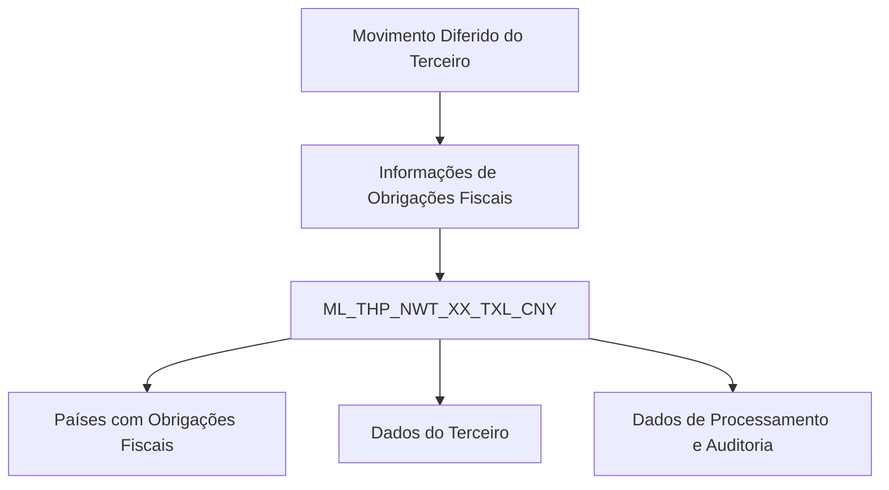

# Detalhamento de Obrigações Fiscais no Movimento Diferido do Terceiro — Visão Técnica

## 1. Metadados do Documento
- **Arquivo de Origem:** Não identificado
- **Tipo de Documento:** Especificação Técnica
- **Domínio / Sistema:** Reef / Mapfre
- **Público-Alvo:** Desenvolvedores, Arquitetos, Operação
- **Data/Versão Identificada:** Não identificada

---

## 2. Resumo Executivo & Contexto de Negócio

O documento apresenta uma visão técnica para detalhar informações de obrigações fiscais associadas ao movimento diferido de terceiros. O escopo explicitamente documentado concentra-se no modelo de dados envolvido na operação.

A operação utiliza a tabela `ML_THP_NWT_XX_TXL_CNY`, descrita como uma “tabela buzón países con obligaciones fiscales”. A estrutura registra identificação, sequência, companhia, dados documentais do terceiro, país adicional com obrigação fiscal, identificação fiscal associada e dados de auditoria.

A tabela também contém atributos relacionados ao processamento, à situação do processo, à origem da ação e a possíveis erros internos. Alguns atributos são obrigatórios, enquanto outros são identificados como não obrigatórios no conteúdo-fonte.

O material está identificado como documentação Reef e apresenta o ciclo de vida `Approved`, com proprietário indicado como `user:agonzalez_mapfre.com`. Não há detalhamento adicional sobre operações de leitura, gravação, contratos de API, métodos HTTP, regras de cálculo ou integração com outros componentes.

---

## 3. Arquitetura, Componentes & Tecnologias Envolvidas

Os componentes e referências explicitamente citados são:

- **Reef:** contexto de documentação apresentado no material.
- **Mapfre:** referência corporativa exibida na documentação.
- **ML_THP_NWT_XX_TXL_CNY:** tabela envolvida na operação de obrigações fiscais.
- **Movimento Diferido do Terceiro:** processo de negócio/técnico ao qual a tabela está associada.
- **Documentação Reef:** área documental indicada como fonte do conteúdo.
- **Lifecycle `Approved`:** estado de ciclo de vida exibido para o documento.



> **Nota de Análise:** O documento identifica a tabela `ML_THP_NWT_XX_TXL_CNY`, mas não descreve tecnologias de banco de dados, chaves primárias, chaves estrangeiras, índices, interfaces, APIs, métodos HTTP, contratos JSON ou fluxos de integração entre sistemas.

---

## 4. Regras de Negócio, Especificações Funcionais & Processos

### 4.1 Escopo funcional identificado

A documentação associa a tabela `ML_THP_NWT_XX_TXL_CNY` ao tratamento de países com obrigações fiscais no contexto do movimento diferido do terceiro.

### 4.2 Regras de obrigatoriedade documentadas

Os seguintes campos são indicados como obrigatórios:

1. `BTC_IDN_VAL`: identificador.
2. `SQN_VAL`: sequência.
3. `CMP_VAL`: companhia.
4. `THP_DCM_TYP_VAL`: tipo do documento do terceiro.
5. `THP_DCM_VAL`: documento do terceiro.
6. `ADT_CNY_TXL_VAL`: país adicional com obrigação fiscal.
7. `IDN_TXP_ADT_CNY_TXL`: identificador do contribuinte no país adicional.
8. `RGS_DAT`: data de inclusão/registro.
9. `DSB_ROW`: indicador de linha desabilitada.
10. `USR_VAL`: usuário que atualizou a linha.
11. `MDF_DAT`: data de modificação.

### 4.3 Dados de processo e erro

Os seguintes campos são apresentados como não obrigatórios:

1. `PRC_THD_VAL`: hilo, isto é, referência a thread/processamento conforme a descrição original.
2. `PRC_STS_VAL`: situação do processo.
3. `ACN_ORG_VAL`: ação de origem.
4. `ERR_IDN_VAL`: identificador interno do erro.

> **Nota de Análise:** O documento informa os atributos obrigatórios e não obrigatórios, mas não especifica regras de preenchimento condicional, valores permitidos, domínios de dados, validações de formato, comportamento em caso de erro ou transições da situação do processo.

---

## 5. Tabelas de Parâmetros, Ambientes e Estruturas de Dados

### 5.1 Tabela principal

| Item / Parâmetro | Descrição / Função | Tipo / Valores / Formato | Ambiente / Observações |
| :--- | :--- | :--- | :--- |
| `ML_THP_NWT_XX_TXL_CNY` | Tabela buzón de países com obrigações fiscais | Não especificado | Tabela que intervém na operação documentada |
| Movimento Diferido do Terceiro | Contexto da operação que requer o detalhamento de obrigações fiscais | Não especificado | Associado ao terceiro e às obrigações fiscais |

### 5.2 Estrutura de campos da tabela `ML_THP_NWT_XX_TXL_CNY`

| Item / Parâmetro | Descrição / Função | Tipo / Valores / Formato | Ambiente / Observações |
| :--- | :--- | :--- | :--- |
| `BTC_IDN_VAL` | Identificador | Obrigatório: Sim | O conteúdo indica `CAMBIA VALOR: S` e motivo/valor `N.A.` |
| `SQN_VAL` | Sequência | Obrigatório: Sim | O conteúdo indica `CAMBIA VALOR: S` e motivo/valor `N.A.` |
| `CMP_VAL` | Companhia | Obrigatório: Sim | O conteúdo indica `CAMBIA VALOR: S` e motivo/valor `N.A.` |
| `THP_DCM_TYP_VAL` | Tipo do documento do terceiro | Obrigatório: Sim | O conteúdo indica `CAMBIA VALOR: S` e motivo/valor `N.A.` |
| `THP_DCM_VAL` | Documento do terceiro | Obrigatório: Sim | O conteúdo indica `CAMBIA VALOR: S` e motivo/valor `N.A.` |
| `ADT_CNY_TXL_VAL` | País adicional com obrigação fiscal | Obrigatório: Sim | O conteúdo indica `CAMBIA VALOR: S` e motivo/valor `N.A.` |
| `IDN_TXP_ADT_CNY_TXL` | Identificador do contribuinte no país adicional | Obrigatório: Sim | O conteúdo indica `CAMBIA VALOR: S` e motivo/valor `N.A.` |
| `RGS_DAT` | Data de inclusão | Obrigatório: Sim | O conteúdo indica `CAMBIA VALOR: S` e motivo/valor `N.A.` |
| `DSB_ROW` | Linha desabilitada | Obrigatório: Sim | O conteúdo indica `CAMBIA VALOR: S` e motivo/valor `N.A.` |
| `PRC_THD_VAL` | Hilo | Obrigatório: Não | O conteúdo indica `CAMBIA VALOR: S` e motivo/valor `N.A.` |
| `PRC_STS_VAL` | Situação do processo | Obrigatório: Não | O conteúdo indica `CAMBIA VALOR: S` e motivo/valor `N.A.` |
| `ACN_ORG_VAL` | Ação de origem | Obrigatório: Não | O conteúdo indica `CAMBIA VALOR: S` e motivo/valor `N.A.` |
| `ERR_IDN_VAL` | Identificador interno do erro | Obrigatório: Não | O conteúdo indica `CAMBIA VALOR: S` e motivo/valor `N.A.` |
| `USR_VAL` | Usuário que atualizou a linha | Obrigatório: Sim | O conteúdo indica `CAMBIA VALOR: S` e motivo/valor `N.A.` |
| `MDF_DAT` | Data de modificação | Obrigatório: Sim | O conteúdo indica `CAMBIA VALOR: S` e motivo/valor `N.A.` |

### 5.3 Informações de governança documental

| Item / Parâmetro | Descrição / Função | Tipo / Valores / Formato | Ambiente / Observações |
| :--- | :--- | :--- | :--- |
| Documentação | Área documental | `DOCUMENTACIÓN Reef` | Referência exibida no conteúdo |
| Proprietário | Responsável indicado no documento | `user:agonzalez_mapfre.com` | Valor literal extraído |
| Lifecycle | Estado do ciclo de vida | `Approved` | Valor literal extraído |
| Source | Origem indicada | `VL` | Exibido como `Source / VL` |

---

## 6. Bateria de Perguntas & Respostas para RAG (FAQ Sintético)

### P1: Qual tabela armazena informações de países com obrigações fiscais no movimento diferido do terceiro?
**R:** A tabela identificada no documento é `ML_THP_NWT_XX_TXL_CNY`, descrita como a tabela buzón de países com obrigações fiscais. Essa tabela é indicada como participante da operação de detalhamento de obrigações fiscais no movimento diferido do terceiro.

### P2: Quais campos identificam o terceiro na tabela `ML_THP_NWT_XX_TXL_CNY`?
**R:** Os campos relacionados à identificação documental do terceiro são `THP_DCM_TYP_VAL`, que representa o tipo do documento do terceiro, e `THP_DCM_VAL`, que representa o documento do terceiro. Ambos são obrigatórios segundo o documento.

### P3: Como o país adicional com obrigação fiscal é registrado?
**R:** O país adicional com obrigação fiscal é registrado no campo `ADT_CNY_TXL_VAL`. O documento classifica esse campo como obrigatório.

### P4: Qual atributo contém o identificador do contribuinte no país adicional?
**R:** O atributo `IDN_TXP_ADT_CNY_TXL` contém o identificador do contribuinte no país adicional. O campo é obrigatório na estrutura documentada.

### P5: Quais são os campos obrigatórios de auditoria e manutenção da linha?
**R:** Os campos obrigatórios relacionados à manutenção e auditoria são `RGS_DAT`, descrito como data de inclusão; `DSB_ROW`, descrito como linha desabilitada; `USR_VAL`, descrito como usuário que atualizou a linha; e `MDF_DAT`, descrito como data de modificação.

### P6: O campo de situação do processo é obrigatório?
**R:** Não. O campo `PRC_STS_VAL`, descrito como situação do processo, está marcado como não obrigatório no conteúdo-fonte.

### P7: Qual campo registra o identificador interno de erro?
**R:** O identificador interno de erro é registrado no campo `ERR_IDN_VAL`. O documento classifica esse atributo como não obrigatório.

### P8: Quais campos de processamento não são obrigatórios?
**R:** Os campos não obrigatórios associados ao processamento e à origem são `PRC_THD_VAL` (hilo), `PRC_STS_VAL` (situação do processo), `ACN_ORG_VAL` (ação de origem) e `ERR_IDN_VAL` (identificador interno do erro).

### P9: A documentação especifica valores permitidos para os campos?
**R:** Não. Embora o documento apresente a coluna “CAMBIA VALOR” com valor `S` e a coluna “MOTIVO/VALOR” com `N.A.`, não há enumerações, formatos, domínios, regras de validação ou valores permitidos detalhados para os campos.

### P10: O documento descreve APIs ou contratos de integração para a tabela de obrigações fiscais?
**R:** Não. O material somente descreve a tabela `ML_THP_NWT_XX_TXL_CNY`, seus campos, obrigatoriedade e descrições. Não há especificação de APIs, endpoints, métodos HTTP, payloads, contratos JSON ou protocolos de integração.

### P11: Quem é o proprietário indicado para a documentação Reef?
**R:** O proprietário indicado no conteúdo é `user:agonzalez_mapfre.com`.

### P12: Qual é o estado de ciclo de vida informado para o documento?
**R:** O estado de ciclo de vida exibido na documentação é `Approved`.

---

## 7. Glossário de Termos, Siglas & Conceitos-Chave

- **ADT_CNY_TXL_VAL:** campo descrito como país adicional com obrigação fiscal.
- **ACN_ORG_VAL:** campo descrito como ação de origem.
- **BTC_IDN_VAL:** campo descrito como identificador.
- **CMP_VAL:** campo descrito como companhia.
- **DSB_ROW:** campo descrito como linha desabilitada.
- **ERR_IDN_VAL:** campo descrito como identificador interno do erro.
- **IDN_TXP_ADT_CNY_TXL:** identificador do contribuinte no país adicional.
- **MDF_DAT:** campo descrito como data de modificação.
- **ML_THP_NWT_XX_TXL_CNY:** tabela buzón de países com obrigações fiscais.
- **PRC_STS_VAL:** campo descrito como situação do processo.
- **PRC_THD_VAL:** campo descrito como hilo.
- **RGS_DAT:** campo descrito como data de inclusão.
- **SQN_VAL:** campo descrito como sequência.
- **THP_DCM_TYP_VAL:** tipo do documento do terceiro.
- **THP_DCM_VAL:** documento do terceiro.
- **USR_VAL:** usuário que atualizou a linha.

---

## 8. Notas Críticas, Riscos & Limitações

- O documento não informa o tipo físico dos campos, tamanhos, precisão, formato de datas, chaves, índices ou relacionamentos da tabela.
- A indicação `CAMBIA VALOR: S` é apresentada para todos os atributos, mas o significado operacional dessa indicação não é definido.
- O valor `N.A.` aparece na coluna “MOTIVO/VALOR”, sem explicação semântica adicional.
- Não há documentação de regras de validação, regras condicionais, cálculos fiscais, tratamento de duplicidade ou estratégias de correção de erro.
- Não há detalhes sobre APIs, integrações, filas, eventos, microsserviços, ambientes, URLs, credenciais, logs ou procedimentos operacionais.
- Não são descritos os significados técnicos de `PRC_THD_VAL`, além da descrição literal “HILO”, nem o ciclo de estados possível de `PRC_STS_VAL`.
- O arquivo de origem, a data e a versão do documento não foram identificados no conteúdo fornecido.

---

## 9. Conteúdo Bruto Estruturado (Referência Fiel)

```text
--- [PÁGINA 1 DE 2] ---

DETALLAR Información Obligaciones Fiscales en el Movimiento
Diferido del Tercero (Visión Técnica)
Modelo de datos involucrado
La tabla que interviene en esta operación es:
TABLA DESCRIPCIÓN
ML_THP_NWT_XX_TXL_CNY TABLA BUZON PAISES CON OBLIGACIONES FISCALES
COLUMNA CAMBIA
VALOR
MOTIVO/VALOR OBLIGATORIA COMENTARIO
BTC_IDN_VAL S N.A. SI IDENTIFICADOR
SQN_VAL S N.A. SI SECUENCIA
CMP_VAL S N.A. SI COMPANIA
THP_DCM_TYP_VAL S N.A. SI TIPO DEL DOCUMENTO DEL TERCERO
THP_DCM_VAL S N.A. SI DOCUMENTO DEL TERCERO
ADT_CNY_TXL_VAL S N.A. SI PAIS ADICIONAL CON OBLIGACION
FISCAL
IDN_TXP_ADT_CNY_TXL S N.A. SI IDENTIFICADOR CONTRIBUYENTE PAIS
ADICIONAL
RGS_DAT S N.A. SI FECHA DE ALTA
DSB_ROW S N.A. SI FILA DESHABILITADA
PRC_THD_VAL S N.A. NO HILO
Documentation / DOCUMENTACIÓN Reef
DOCUMENTACIÓN Reef
Mapfredocument
DOCUMENTACIÓN Reef
Owner
user:agonzalez_mapfre.com
Lifecycle
Approved Source
 / 
 VL
Buscar Inicio Soluciones Arquitecturas APIs Componentes Cloud Documentación Zeus Reef Ayuda
ES


--- [PÁGINA 2 DE 2] ---

COLUMNA CAMBIA
VALOR
MOTIVO/VALOR OBLIGATORIA COMENTARIO
PRC_STS_VAL S N.A. NO SITUACION DEL PROCESO
ACN_ORG_VAL S N.A. NO ACCION ORIGEN
ERR_IDN_VAL S N.A. NO IDENTIFICADOR INTERNO DEL ERROR
USR_VAL S N.A. SI USUARIO QUE ACTUALIZO LA FILA
MDF_DAT S N.A. SI FECHA MODIFICACION
```
