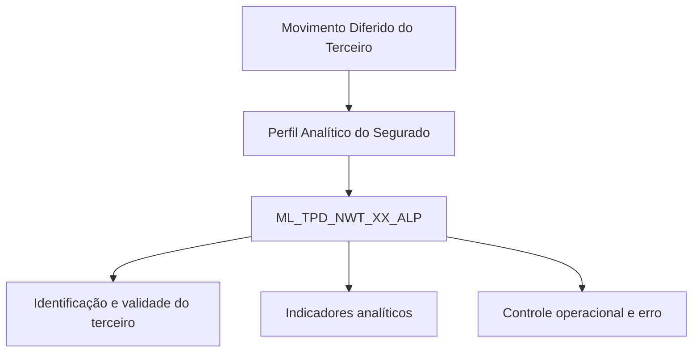

# Perfil Analítico do Segurado no Movimento Diferido do Terceiro — Visão Técnica

## 1. Metadados do Documento
- **Arquivo de Origem:** Não identificado no conteúdo extraído
- **Tipo de Documento:** Especificação Técnica
- **Domínio / Sistema:** Reef / Mapfre — Movimento Diferido do Terceiro
- **Público-Alvo:** Não identificado; o conteúdo é apresentado como visão técnica
- **Data/Versão Identificada:** Não identificada
- **Owner identificado:** `user:agonzalez_mapfre.com`
- **Lifecycle identificado:** Approved

---

## 2. Resumo Executivo & Contexto de Negócio

O documento descreve a inclusão ou detalhamento de informações de **Perfil Analítico do Segurado** no contexto do **Movimiento Diferido del Tercero**. O conteúdo está classificado como uma visão técnica e concentra-se exclusivamente no modelo de dados envolvido na operação.

A tabela identificada para a operação é `ML_TPD_NWT_XX_ALP`, descrita como uma **tabla buzón definición perfil analítico**. A estrutura concentra identificadores do registro, referências de companhia e documento do terceiro, data de validade, status de processamento e atributos analíticos associados ao cliente ou segurado.

Os atributos analíticos incluem indicadores de probabilidade de abandono, oportunidades de up selling e cross selling por linha de negócio, saturação, relacionamento, integralidade, quantidade de beneficiários, preferências de canal e dispositivo, credit score e métricas de comportamento digital.

O documento também indica campos operacionais de controle, como linha desabilitada, usuário que atualizou a linha, data de modificação, ação de origem e identificador interno de erro. Não são detalhados métodos de integração, contratos JSON, consultas SQL, regras de cálculo dos indicadores ou fluxos de processamento.

---

## 3. Arquitetura, Componentes & Tecnologias Envolvidas

Os elementos técnicos explicitamente citados são:

| Componente / Elemento | Descrição extraída |
| :--- | :--- |
| Reef | Contexto de documentação identificado como “DOCUMENTACIÓN Reef”. |
| Mapfre | Referência corporativa identificada no conteúdo e no owner `agonzalez_mapfre.com`. |
| Movimento Diferido do Terceiro | Operação na qual o Perfil Analítico do Segurado é detalhado. |
| `ML_TPD_NWT_XX_ALP` | Tabela envolvida na operação; descrita como tabela buzón de definição de perfil analítico. |
| Documentation / Documentación Reef | Referência ao repositório ou contexto documental exibido no conteúdo. |
| Zeus | Item presente na navegação da página, sem detalhamento técnico adicional. |
| Cloud | Item presente na navegação da página, sem detalhamento técnico adicional. |



**Nota de Análise:** O documento informa que a tabela `ML_TPD_NWT_XX_ALP` participa da operação, mas não detalha tecnologia de banco de dados, mecanismos de carga, microsserviços, APIs, métodos HTTP, contratos JSON, agendamento, origem dos dados ou consumidores da tabela.

---

## 4. Regras de Negócio, Especificações Funcionais & Processos

A especificação apresenta o modelo de dados da tabela `ML_TPD_NWT_XX_ALP` e sinaliza, para cada coluna, que o campo **cambia** possui valor `S` e que o campo **motivo/valor** possui valor `N.A.`.

As seguintes colunas são obrigatórias conforme o conteúdo:

1. `BTC_IDN_VAL` — identificador.
2. `SQN_VAL` — sequência.
3. `CMP_VAL` — companhia.
4. `THP_DCM_TYP_VAL` — tipo do documento do terceiro.
5. `THP_DCM_VAL` — documento do terceiro.
6. `VLD_DAT` — data de validade.
7. `DSB_ROW` — fila desabilitada.
8. `USR_VAL` — usuário que atualizou a fila.
9. `MDF_VAL` — data de modificação.

Os campos analíticos não obrigatórios descritos incluem probabilidades de abandono, up selling e cross selling, além de atributos de relacionamento, comportamento digital, segmentação e preferências do cliente.

O documento não define fórmulas, limiares, escalas, domínios de valores, periodicidade de atualização, regras de preenchimento, critérios de rejeição, nem comportamento para campos nulos. Também não apresenta um processo sequencial de carga ou atualização da tabela.

---

## 5. Tabelas de Parâmetros, Ambientes e Estruturas de Dados

| Item / Parâmetro | Descrição / Função | Tipo / Valores / Formato | Ambiente / Observações |
| :--- | :--- | :--- | :--- |
| Tabela `ML_TPD_NWT_XX_ALP` | Tabela buzón de definição de perfil analítico. | Não informado. | Tabela que intervém na operação. |
| `BTC_IDN_VAL` | Identificador. | Cambia: `S`; Motivo/Valor: `N.A.`; Obrigatória: Sim. | Não há detalhamento adicional. |
| `SQN_VAL` | Sequência. | Cambia: `S`; Motivo/Valor: `N.A.`; Obrigatória: Sim. | Não há detalhamento adicional. |
| `CMP_VAL` | Companhia. | Cambia: `S`; Motivo/Valor: `N.A.`; Obrigatória: Sim. | Não há detalhamento adicional. |
| `THP_DCM_TYP_VAL` | Tipo do documento do terceiro. | Cambia: `S`; Motivo/Valor: `N.A.`; Obrigatória: Sim. | Não há detalhamento adicional. |
| `THP_DCM_VAL` | Documento do terceiro. | Cambia: `S`; Motivo/Valor: `N.A.`; Obrigatória: Sim. | Não há detalhamento adicional. |
| `VLD_DAT` | Data de validade. | Cambia: `S`; Motivo/Valor: `N.A.`; Obrigatória: Sim. | Não há detalhamento adicional. |
| `PRC_THD_VAL` | Hilo. | Cambia: `S`; Motivo/Valor: `N.A.`; Obrigatória: Não. | Significado funcional adicional não informado. |
| `PRC_STS_VAL` | Situação do processo. | Cambia: `S`; Motivo/Valor: `N.A.`; Obrigatória: Não. | Não há domínio de status informado. |
| `CTV_VAL` | CLTV. | Cambia: `S`; Motivo/Valor: `N.A.`; Obrigatória: Não. | Sigla não expandida no documento. |
| `SRD_PER` | Probabilidade de abandono. | Cambia: `S`; Motivo/Valor: `N.A.`; Obrigatória: Não. | Não há escala ou fórmula informada. |
| `UPS_MOT_PER` | Probabilidade de up selling auto. | Cambia: `S`; Motivo/Valor: `N.A.`; Obrigatória: Não. | Não há escala ou fórmula informada. |
| `UPS_HOM_PER` | Probabilidade de up selling hogar. | Cambia: `S`; Motivo/Valor: `N.A.`; Obrigatória: Não. | Não há escala ou fórmula informada. |
| `UPS_HLT_PER` | Probabilidade de up selling salud. | Cambia: `S`; Motivo/Valor: `N.A.`; Obrigatória: Não. | Não há escala ou fórmula informada. |
| `CRG_AUT_PER` | Probabilidade de cross selling auto. | Cambia: `S`; Motivo/Valor: `N.A.`; Obrigatória: Não. | Não há escala ou fórmula informada. |
| `CRG_HOM_PER` | Probabilidade de cross selling hogar. | Cambia: `S`; Motivo/Valor: `N.A.`; Obrigatória: Não. | Não há escala ou fórmula informada. |
| `CRG_HLT_PER` | Probabilidade de cross selling salud. | Cambia: `S`; Motivo/Valor: `N.A.`; Obrigatória: Não. | Não há escala ou fórmula informada. |
| `SAR_IDX_VAL` | Indicador de saturação. | Cambia: `S`; Motivo/Valor: `N.A.`; Obrigatória: Não. | Não há regra de cálculo informada. |
| `RLN_IDX_VAL` | Índice de relação. | Cambia: `S`; Motivo/Valor: `N.A.`; Obrigatória: Não. | Não há regra de cálculo informada. |
| `IGR_VAL` | Integralidade. | Cambia: `S`; Motivo/Valor: `N.A.`; Obrigatória: Não. | Não há detalhamento adicional. |
| `BNF_QNT` | Quantidade de beneficiários. | Cambia: `S`; Motivo/Valor: `N.A.`; Obrigatória: Não. | Não há formato numérico informado. |
| `HNL_TYP_VAL` | Canal preferido. | Cambia: `S`; Motivo/Valor: `N.A.`; Obrigatória: Não. | Não há lista de canais informada. |
| `DVC_TYP_VAL` | Dispositivo preferido. | Cambia: `S`; Motivo/Valor: `N.A.`; Obrigatória: Não. | Não há lista de dispositivos informada. |
| `CDR_VAL` | Credit score. | Cambia: `S`; Motivo/Valor: `N.A.`; Obrigatória: Não. | Não há faixa de score informada. |
| `HOR_DAY_VAL` | Hora do dia. | Cambia: `S`; Motivo/Valor: `N.A.`; Obrigatória: Não. | Não há formato de hora informado. |
| `RNY_VAL` | Recorrência. | Cambia: `S`; Motivo/Valor: `N.A.`; Obrigatória: Não. | Não há detalhamento adicional. |
| `FRY_VAL` | Frequência de visita. | Cambia: `S`; Motivo/Valor: `N.A.`; Obrigatória: Não. | Não há unidade ou período informado. |
| `MDV_VAL` | Visitantes multidispositivo. | Cambia: `S`; Motivo/Valor: `N.A.`; Obrigatória: Não. | Não há detalhamento adicional. |
| `WEB_TIM_VAL` | Tempo na web. | Cambia: `S`; Motivo/Valor: `N.A.`; Obrigatória: Não. | Não há unidade de tempo informada. |
| `SNS_VAL` | Sessions site. | Cambia: `S`; Motivo/Valor: `N.A.`; Obrigatória: Não. | Não há período de apuração informado. |
| `WEB_DVC_TYP_VAL` | Dispositivo na web. | Cambia: `S`; Motivo/Valor: `N.A.`; Obrigatória: Não. | Não há lista de dispositivos informada. |
| `FWR_VAL` | Followers. | Cambia: `S`; Motivo/Valor: `N.A.`; Obrigatória: Não. | Não há detalhamento adicional. |
| `HNL_SBB_VAL` | Channel subscribers. | Cambia: `S`; Motivo/Valor: `N.A.`; Obrigatória: Não. | Não há detalhamento adicional. |
| `APL_ENM_VAL` | App engagement. | Cambia: `S`; Motivo/Valor: `N.A.`; Obrigatória: Não. | Não há métrica ou escala informada. |
| `CUS_SGM_TYP_VAL` | Identificador de segmentação de cliente. | Cambia: `S`; Motivo/Valor: `N.A.`; Obrigatória: Não. | Não há catálogo de segmentação informado. |
| `DSB_ROW` | Fila desabilitada. | Cambia: `S`; Motivo/Valor: `N.A.`; Obrigatória: Sim. | Campo de controle operacional. |
| `USR_VAL` | Usuário que atualizou a fila. | Cambia: `S`; Motivo/Valor: `N.A.`; Obrigatória: Sim. | Campo de rastreabilidade. |
| `MDF_VAL` | Data de modificação. | Cambia: `S`; Motivo/Valor: `N.A.`; Obrigatória: Sim. | Campo de rastreabilidade. |
| `ACN_ORG_VAL` | Ação origem. | Cambia: `S`; Motivo/Valor: `N.A.`; Obrigatória: Não. | Não há domínio de ações informado. |
| `ERR_IDN_VAL` | Identificador interno do erro. | Cambia: `S`; Motivo/Valor: `N.A.`; Obrigatória: Não. | Não há catálogo de erros informado. |

---

## 6. Bateria de Perguntas & Respostas para RAG (FAQ Sintético)

### P1: Qual tabela participa da operação de Perfil Analítico do Segurado no Movimento Diferido do Terceiro?
**R:** A tabela envolvida é `ML_TPD_NWT_XX_ALP`, descrita no documento como “TABLA BUZON DEFINICION PERFIL ANALITICO”.

### P2: Quais são os campos obrigatórios da tabela `ML_TPD_NWT_XX_ALP`?
**R:** Os campos obrigatórios são `BTC_IDN_VAL`, `SQN_VAL`, `CMP_VAL`, `THP_DCM_TYP_VAL`, `THP_DCM_VAL`, `VLD_DAT`, `DSB_ROW`, `USR_VAL` e `MDF_VAL`.

### P3: Qual campo armazena o documento do terceiro?
**R:** O campo `THP_DCM_VAL` é descrito como “DOCUMENTO DEL TERCERO”. O tipo do documento do terceiro é armazenado em `THP_DCM_TYP_VAL`.

### P4: Onde é registrada a data de validade do registro de perfil analítico?
**R:** A data de validade é registrada no campo obrigatório `VLD_DAT`, descrito como “FECHA VALIDEZ”.

### P5: Quais campos representam probabilidades de up selling no perfil analítico?
**R:** As probabilidades de up selling são registradas em `UPS_MOT_PER` para auto, `UPS_HOM_PER` para hogar e `UPS_HLT_PER` para salud. O documento não informa fórmulas, escalas ou faixas de valores desses campos.

### P6: Quais campos representam probabilidades de cross selling?
**R:** Os campos de probabilidade de cross selling são `CRG_AUT_PER` para auto, `CRG_HOM_PER` para hogar e `CRG_HLT_PER` para salud. Todos são marcados como não obrigatórios.

### P7: Como o documento registra a situação do processo?
**R:** A situação do processo é registrada no campo `PRC_STS_VAL`, descrito como “SITUACION DEL PROCESO”. O documento não define os valores possíveis para esse status.

### P8: Quais atributos descrevem preferência de interação ou uso digital do cliente?
**R:** O documento cita `HNL_TYP_VAL` para canal preferido, `DVC_TYP_VAL` para dispositivo preferido, `HOR_DAY_VAL` para hora do dia, `FRY_VAL` para frequência de visita, `MDV_VAL` para visitantes multidispositivo, `WEB_TIM_VAL` para tempo na web, `SNS_VAL` para sessions site, `WEB_DVC_TYP_VAL` para dispositivo na web, `FWR_VAL` para followers, `HNL_SBB_VAL` para channel subscribers e `APL_ENM_VAL` para app engagement.

### P9: Quais campos permitem rastrear a atualização de uma fila?
**R:** O documento define `DSB_ROW` como fila desabilitada, `USR_VAL` como usuário que atualizou a fila e `MDF_VAL` como data de modificação. Os três campos são obrigatórios.

### P10: Como é registrado um erro interno relacionado ao perfil analítico?
**R:** O identificador interno do erro é armazenado no campo `ERR_IDN_VAL`. Esse campo é marcado como não obrigatório e não possui catálogo ou classificação de erros detalhada no documento.

### P11: O documento especifica APIs, métodos HTTP ou contratos JSON para a tabela `ML_TPD_NWT_XX_ALP`?
**R:** Não. O documento apresenta a tabela e suas colunas, mas não detalha APIs, métodos HTTP, contratos JSON, microsserviços, processos de carga ou consumidores dos dados.

### P12: Qual campo contém o identificador de segmentação do cliente?
**R:** O campo `CUS_SGM_TYP_VAL` é descrito como “IDENTIFICADOR SEGMENTACION CLIENTE” e é marcado como não obrigatório.

---

## 7. Glossário de Termos, Siglas & Conceitos-Chave

- **`ML_TPD_NWT_XX_ALP`:** Tabela identificada como “TABLA BUZON DEFINICION PERFIL ANALITICO”.
- **Perfil Analítico do Segurado:** Conjunto de atributos analíticos associados ao segurado no contexto do Movimento Diferido do Terceiro.
- **Movimento Diferido do Terceiro:** Operação citada no título do documento; não possui detalhamento de processo adicional.
- **CLTV:** Termo associado ao campo `CTV_VAL`; o documento não expande a sigla.
- **Up Selling:** Termo utilizado para probabilidades registradas em campos `UPS_*`.
- **Cross Selling:** Termo utilizado para probabilidades registradas em campos `CRG_*`.
- **Hogar:** Termo utilizado nas descrições de `UPS_HOM_PER` e `CRG_HOM_PER`.
- **Salud:** Termo utilizado nas descrições de `UPS_HLT_PER` e `CRG_HLT_PER`.
- **Credit Score:** Termo utilizado na descrição do campo `CDR_VAL`.
- **App Engagement:** Termo utilizado na descrição do campo `APL_ENM_VAL`.
- **Reef:** Contexto de documentação citado como “DOCUMENTACIÓN Reef”.
- **DSB_ROW:** Campo descrito como “FILA DESHABILITADA”.
- **MDF_VAL:** Campo descrito como “FECHA MODIFICACION”.
- **ERR_IDN_VAL:** Campo descrito como “IDENTIFICADOR INTERNO DEL ERROR”.

---

## 8. Notas Críticas, Riscos & Limitações

- O conteúdo extraído não identifica o nome do arquivo de origem, data, versão, autor documental completo ou público-alvo formal.
- O documento não informa tipos físicos dos campos, tamanhos, formatos, restrições de banco de dados, chaves, índices ou relacionamentos entre tabelas.
- Não há detalhamento de fórmulas, escalas, regras de cálculo ou origens dos indicadores analíticos, incluindo probabilidades de abandono, up selling, cross selling, saturação, relacionamento e integralidade.
- Não são definidos valores permitidos para situação do processo, ação de origem, canal preferido, dispositivos ou segmentação de cliente.
- O documento não descreve APIs, contratos de integração, métodos HTTP, payloads, eventos, jobs, periodicidade de carga ou mecanismos de tratamento de erro.
- O campo `ERR_IDN_VAL` registra um identificador interno do erro, mas não há catálogo de erros, procedimento de correção ou fluxo de exceção associado.
- Os termos `CLTV`, `hilo`, `hogar` e `salud` são apresentados sem definição adicional no conteúdo original.

---

## 9. Conteúdo Bruto Estruturado (Referência Fiel)

```text
--- [PÁGINA 1 DE 3] ---

DETALLAR Información Perl Analítico del Asegurado en el
Movimiento Diferido del Tercero (Visión Técnica)
Modelo de datos involucrado
La tabla que interviene en esta operación es:
TABLA DESCRIPCIÓN
ML_TPD_NWT_XX_ALP TABLA BUZON DEFINICION PERFIL ANALITICO
COLUMNA CAMBIA VALOR MOTIVO/VALOR OBLIGATORIA COMENTARIO
BTC_IDN_VAL S N.A. SI IDENTIFICADOR
SQN_VAL S N.A. SI SECUENCIA
CMP_VAL S N.A. SI COMPANIA
THP_DCM_TYP_VAL S N.A. SI TIPO DEL DOCUMENTO DEL TERCERO
THP_DCM_VAL S N.A. SI DOCUMENTO DEL TERCERO
VLD_DAT S N.A. SI FECHA VALIDEZ
PRC_THD_VAL S N.A. NO HILO
PRC_STS_VAL S N.A. NO SITUACION DEL PROCESO
CTV_VAL S N.A. NO CLTV
SRD_PER S N.A. NO PROBABILIDAD ABANDONO
UPS_MOT_PER S N.A. NO PROBABILIDAD UP SELLING AUTO
UPS_HOM_PER S N.A. NO PROBABILIDAD UP SELLING HOGAR
Documentation / DOCUMENTACIÓN Reef
DOCUMENTACIÓN Reef
Mapfredocument
DOCUMENTACIÓN Reef
Owner
user:agonzalez_mapfre.com
Lifecycle
Approved Source
 / 
 VL
Buscar Inicio Soluciones Arquitecturas APIs Componentes Cloud Documentación Zeus Reef Ayuda
ES


--- [PÁGINA 2 DE 3] ---

COLUMNA CAMBIA VALOR MOTIVO/VALOR OBLIGATORIA COMENTARIO
UPS_HLT_PER S N.A. NO PROBABILIDAD UP SELLING SALUD
CRG_AUT_PER S N.A. NO PROBABILIDAD CROSS SELLING AUTO
CRG_HOM_PER S N.A. NO PROBABILIDAD CROSS SELLING HOGAR
CRG_HLT_PER S N.A. NO PROBABILIDAD CROSS SELLING SALUD
SAR_IDX_VAL S N.A. NO INDICADOR SATURACION
RLN_IDX_VAL S N.A. NO INDICE RELACION
IGR_VAL S N.A. NO INTEGRALIDAD
BNF_QNT S N.A. NO CANTIDAD DE BENEFICIARIOS
HNL_TYP_VAL S N.A. NO CANAL PREFERIDO
DVC_TYP_VAL S N.A. NO DISPOSITIVO PREFERIDO
CDR_VAL S N.A. NO CREDIT SCORE
HOR_DAY_VAL S N.A. NO HORA DIA
RNY_VAL S N.A. NO RECURRENCIA
FRY_VAL S N.A. NO FRECUENCIA VISITA
MDV_VAL S N.A. NO VISITANTES MULTIDISPOSITIVO
WEB_TIM_VAL S N.A. NO TIEMPO EN LA WEB
SNS_VAL S N.A. NO SECCIONS SITE
WEB_DVC_TYP_VAL S N.A. NO DISPOSITIVO EN LA WEB
FWR_VAL S N.A. NO FOLLOWERS
HNL_SBB_VAL S N.A. NO CHANNEL SUBSCRIBERS
APL_ENM_VAL S N.A. NO APP ENGAGEMENT
CUS_SGM_TYP_VAL S N.A. NO IDENTIFICADOR SEGMENTACION CLIENTE
DSB_ROW S N.A. SI FILA DESHABILITADA
USR_VAL S N.A. SI USUARIO QUE ACTUALIZO LA FILA
MDF_VAL S N.A. SI FECHA MODIFICACION
ACN_ORG_VAL S N.A. NO ACCION ORIGEN


--- [PÁGINA 3 DE 3] ---

COLUMNA CAMBIA VALOR MOTIVO/VALOR OBLIGATORIA COMENTARIO
ERR_IDN_VAL S N.A. NO IDENTIFICADOR INTERNO DEL ERROR
```
