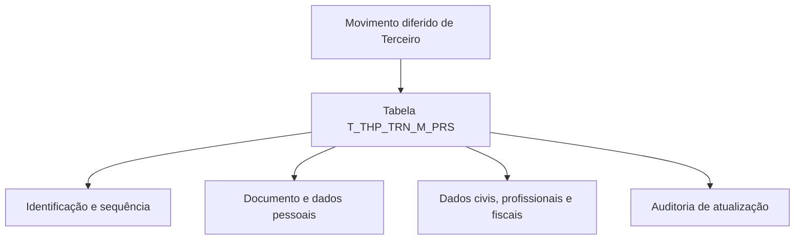

# Detalhar Informações Pessoais no Movimento Diferido de Terceiro — Visão Técnica

## 1. Metadados do Documento
- **Arquivo de Origem:** Não identificado; conteúdo bruto fornecido na solicitação.
- **Tipo de Documento:** Especificação Técnica.
- **Domínio / Sistema:** Reef / Mapfre / TRN / THP.
- **Público-Alvo:** Desenvolvedores, Arquitetos e Analistas de Dados.
- **Data/Versão Identificada:** Não identificada.

---

## 2. Resumo Executivo & Contexto de Negócio

O documento técnico descreve o detalhamento de informações pessoais de um terceiro no contexto de um movimento diferido. A operação utiliza a tabela `T_THP_TRN_M_PRS`, identificada como “TABLA BUZON PERSONA”.

A especificação apresenta uma matriz de colunas envolvidas na tabela, indicando para cada atributo se há alteração de valor, o motivo/valor associado, obrigatoriedade e uma descrição funcional em espanhol. Todas as linhas exibem `S` na coluna “CAMBIA VALOR” e `N.A.` em “MOTIVO/VALOR”.

Os campos obrigatórios identificados no conteúdo são `IDN_VAL`, `IDN_SQN`, `CMP_VAL`, `THP_DCM_TYP_VAL`, `THP_DCM_VAL`, `USR_VAL`, `MDF_DAT` e `MCA_TXL_OTH_CNY`. Os demais atributos listados estão marcados como não obrigatórios.

O conteúdo não especifica métodos HTTP, contratos JSON, regras de persistência, relacionamentos com outras tabelas, processos de integração, ambientes, URLs, tecnologia de banco de dados ou regras de validação além da obrigatoriedade declarada na matriz.

---

## 3. Arquitetura, Componentes & Tecnologias Envolvidas

| Componente / Termo | Descrição sustentada pelo documento |
| :--- | :--- |
| `T_THP_TRN_M_PRS` | Tabela que intervém na operação; descrita como “TABLA BUZON PERSONA”. |
| Movimento diferido | Contexto funcional no qual são detalhadas informações pessoais do terceiro. |
| Terceiro | Entidade cujos dados pessoais são representados pelas colunas da tabela. |
| Reef | Referenciado no cabeçalho de documentação (“DOCUMENTACIÓN Reef”). |
| Mapfre | Referenciado em “Mapfredocument” e no atributo de sociedade para consolidação do Grupo Mapfre. |
| TRN | Presente no nome da tabela `T_THP_TRN_M_PRS`; o documento não expande a sigla. |
| THP | Presente no nome da tabela e em diversos atributos; o documento não expande a sigla. |



**Nota de Análise:** O diagrama representa exclusivamente a relação explícita entre o movimento diferido, a tabela `T_THP_TRN_M_PRS` e os grupos funcionais inferíveis pelas descrições das colunas. O documento não detalha sistemas chamadores, integrações, APIs, protocolos, bancos de dados ou fluxos de execução.

---

## 4. Regras de Negócio, Especificações Funcionais & Processos

1. A tabela envolvida na operação é `T_THP_TRN_M_PRS`, descrita como tabela de buzón/persona.
2. Para todas as colunas apresentadas, o indicador **CAMBIA VALOR** é `S`.
3. Para todas as colunas apresentadas, o campo **MOTIVO/VALOR** é `N.A.`.
4. Os atributos obrigatórios na matriz fornecida são:
   - `IDN_VAL`: identificador.
   - `IDN_SQN`: sequência dentro do identificador.
   - `CMP_VAL`: companhia.
   - `THP_DCM_TYP_VAL`: tipo de documento do terceiro.
   - `THP_DCM_VAL`: código de documento do terceiro.
   - `USR_VAL`: usuário que atualizou a linha.
   - `MDF_DAT`: data de atualização da linha.
   - `MCA_TXL_OTH_CNY`: obrigação fiscal em outros países.
5. `ACN_ORG_VAL` representa a primeira ação produzida sobre o registro, com valores documentados:
   - `(I)NSERTAR`
   - `(M)ODIFICAR`
6. O documento lista atributos referentes a:
   - Identificação, documento e verificação documental do terceiro.
   - Nome, sobrenomes, alias e sufixo.
   - Data e local de nascimento.
   - Estado civil, nacionalidade, sexo, profissão, estudos e idioma.
   - Condição física ou jurídica, pessoa politicamente exposta e categoria de cliente.
   - Informações de representante legal.
   - Informações profissionais, renda mensal e moeda de renda.
   - Perfil financeiro, atividade econômica, regime fiscal e obrigação fiscal internacional.
   - Auditoria de atualização e código de erro.
7. **Nota de Análise:** O documento não descreve regras de cálculo, formatos de dados, domínios permitidos para a maioria dos atributos, mecanismos de tratamento de erro ou dependências entre campos.

---

## 5. Tabelas de Parâmetros, Ambientes e Estruturas de Dados

| Item / Parâmetro | Descrição / Função | Tipo / Valores / Formato | Ambiente / Observações |
| :--- | :--- | :--- | :--- |
| `T_THP_TRN_M_PRS` | Tabela Buzón Persona envolvida na operação. | Não informado. | Não informado. |
| `IDN_VAL` | Identificador. | Muda valor: `S`; motivo/valor: `N.A.`; obrigatório: Sim. | — |
| `IDN_SQN` | Sequência dentro do identificador. | Muda valor: `S`; motivo/valor: `N.A.`; obrigatório: Sim. | — |
| `PRC_THD_VAL` | Hilo. | Muda valor: `S`; motivo/valor: `N.A.`; obrigatório: Não. | — |
| `PRC_STS_VAL` | Situação do processo. | Muda valor: `S`; motivo/valor: `N.A.`; obrigatório: Não. | — |
| `CMP_VAL` | Companhia. | Muda valor: `S`; motivo/valor: `N.A.`; obrigatório: Sim. | — |
| `THP_DCM_TYP_VAL` | Tipo de documento do terceiro. | Muda valor: `S`; motivo/valor: `N.A.`; obrigatório: Sim. | — |
| `THP_DCM_VAL` | Código de documento do terceiro. | Muda valor: `S`; motivo/valor: `N.A.`; obrigatório: Sim. | — |
| `THP_POC` | Tratamento do terceiro. | Muda valor: `S`; motivo/valor: `N.A.`; obrigatório: Não. | — |
| `THP_NAM` | Nome do terceiro. | Muda valor: `S`; motivo/valor: `N.A.`; obrigatório: Não. | — |
| `THP_SCN_NAM` | Segundo nome do terceiro. | Muda valor: `S`; motivo/valor: `N.A.`; obrigatório: Não. | — |
| `THP_FRS_SRN` | Primeiro sobrenome do terceiro. | Muda valor: `S`; motivo/valor: `N.A.`; obrigatório: Não. | — |
| `THP_SCN_SRN` | Segundo sobrenome do terceiro. | Muda valor: `S`; motivo/valor: `N.A.`; obrigatório: Não. | — |
| `NAM_SFX_TYP_VAL` | Sufixo do terceiro, como SR. ou JR. | Muda valor: `S`; motivo/valor: `N.A.`; obrigatório: Não. | — |
| `THP_ALS` | Alias do terceiro. | Muda valor: `S`; motivo/valor: `N.A.`; obrigatório: Não. | — |
| `BRD_DAT` | Data de nascimento. | Muda valor: `S`; motivo/valor: `N.A.`; obrigatório: Não. | — |
| `JOB_VAL` | Trabalho. | Muda valor: `S`; motivo/valor: `N.A.`; obrigatório: Não. | — |
| `LNG_VAL` | Idioma. | Muda valor: `S`; motivo/valor: `N.A.`; obrigatório: Não. | — |
| `MPF_GRP_CNI_SCT_VAL` | Sociedade para consolidação do Grupo Mapfre. | Muda valor: `S`; motivo/valor: `N.A.`; obrigatório: Não. | — |
| `MRT_STS_VAL` | Estado civil. | Muda valor: `S`; motivo/valor: `N.A.`; obrigatório: Não. | — |
| `NTN_TYP_VAL` | Tipo de nacionalidade. | Muda valor: `S`; motivo/valor: `N.A.`; obrigatório: Não. | — |
| `NTN_VAL` | Nacionalidade. | Muda valor: `S`; motivo/valor: `N.A.`; obrigatório: Não. | — |
| `PHY_PRS` | Pessoa física ou jurídica. | Muda valor: `S`; motivo/valor: `N.A.`; obrigatório: Não. | — |
| `PRF_VAL` | Profissão. | Muda valor: `S`; motivo/valor: `N.A.`; obrigatório: Não. | — |
| `SEX_VAL` | Sexo. | Muda valor: `S`; motivo/valor: `N.A.`; obrigatório: Não. | — |
| `VLD_DAT` | Data de validade. | Muda valor: `S`; motivo/valor: `N.A.`; obrigatório: Não. | — |
| `ACN_ORG_VAL` | Primeira ação produzida sobre o registro. | `(I)NSERTAR` ou `(M)ODIFICAR`; obrigatório: Não. | Muda valor: `S`; motivo/valor: `N.A.`. |
| `USR_VAL` | Usuário que atualizou a linha. | Muda valor: `S`; motivo/valor: `N.A.`; obrigatório: Sim. | — |
| `MDF_DAT` | Data de atualização da linha. | Muda valor: `S`; motivo/valor: `N.A.`; obrigatório: Sim. | — |
| `ERR_IDN_VAL` | Código de erro. | Muda valor: `S`; motivo/valor: `N.A.`; obrigatório: Não. | — |
| `CHL_QNT` | Número de filhos. | Muda valor: `S`; motivo/valor: `N.A.`; obrigatório: Não. | — |
| `DCM_ISU_DAT` | Data de emissão do documento. | Muda valor: `S`; motivo/valor: `N.A.`; obrigatório: Não. | — |
| `DCM_EXY_DAT` | Data de expiração do documento. | Muda valor: `S`; motivo/valor: `N.A.`; obrigatório: Não. | — |
| `DCM_SHP_VAL` | Identificador de documento. | Muda valor: `S`; motivo/valor: `N.A.`; obrigatório: Não. | — |
| `DTH_DAT_VAL` | Data de falecimento. | Muda valor: `S`; motivo/valor: `N.A.`; obrigatório: Não. | — |
| `DBL_PER` | Percentual de deficiência. | Muda valor: `S`; motivo/valor: `N.A.`; obrigatório: Não. | — |
| `STD_VAL` | Nível de estudos. | Muda valor: `S`; motivo/valor: `N.A.`; obrigatório: Não. | — |
| `TLN_TYP_VAL` | Código de titulação. | Muda valor: `S`; motivo/valor: `N.A.`; obrigatório: Não. | — |
| `TMZ_TYP_VAL` | Fuso horário. | Muda valor: `S`; motivo/valor: `N.A.`; obrigatório: Não. | — |
| `LGR_DCM_TYP_VAL` | Tipo de documento do representante legal. | Muda valor: `S`; motivo/valor: `N.A.`; obrigatório: Não. | — |
| `LGR_DCM_VAL` | Documento do representante legal. | Muda valor: `S`; motivo/valor: `N.A.`; obrigatório: Não. | — |
| `IDN_THP_VAL` | Identificador do terceiro. | Muda valor: `S`; motivo/valor: `N.A.`; obrigatório: Não. | — |
| `PRS_PCE` | Pessoa politicamente exposta. | Muda valor: `S`; motivo/valor: `N.A.`; obrigatório: Não. | — |
| `THP_DCM_CNY_VAL` | País emissor do documento do terceiro. | Muda valor: `S`; motivo/valor: `N.A.`; obrigatório: Não. | — |
| `THP_DCM_CCK` | Marca de documento do terceiro comprovado. | Muda valor: `S`; motivo/valor: `N.A.`; obrigatório: Não. | — |
| `THP_DCM_CCK_DAT` | Data de comprovação do documento do terceiro. | Muda valor: `S`; motivo/valor: `N.A.`; obrigatório: Não. | — |
| `THP_DCM_OBS_CCK_MTH` | Observações e/ou método de comprovação do documento do terceiro. | Muda valor: `S`; motivo/valor: `N.A.`; obrigatório: Não. | — |
| `THP_DCM_VRF_VAL` | Verificador do documento. | Muda valor: `S`; motivo/valor: `N.A.`; obrigatório: Não. | — |
| `ECM_ACV_VAL` | Código de atividade econômica. | Muda valor: `S`; motivo/valor: `N.A.`; obrigatório: Não. | — |
| `ECM_ACV_TYP_VAL` | Tipo de código de atividade econômica. | Muda valor: `S`; motivo/valor: `N.A.`; obrigatório: Não. | — |
| `BRT_CNY_VAL` | País de nascimento. | Muda valor: `S`; motivo/valor: `N.A.`; obrigatório: Não. | — |
| `BRT_STT_VAL` | Estado de nascimento. | Muda valor: `S`; motivo/valor: `N.A.`; obrigatório: Não. | — |
| `BRT_PVC_VAL` | Província de nascimento. | Muda valor: `S`; motivo/valor: `N.A.`; obrigatório: Não. | — |
| `BRT_TWN_VAL` | Localidade de nascimento. | Muda valor: `S`; motivo/valor: `N.A.`; obrigatório: Não. | — |
| `RGT_FOL_VAL` | Folio de registro. | Muda valor: `S`; motivo/valor: `N.A.`; obrigatório: Não. | — |
| `CST_CTG_VAL` | Categoria de cliente. | Muda valor: `S`; motivo/valor: `N.A.`; obrigatório: Não. | — |
| `CSI_DAT` | Data de constituição. | Muda valor: `S`; motivo/valor: `N.A.`; obrigatório: Não. | — |
| `MRR_SRN` | Sobrenome de casado. | Muda valor: `S`; motivo/valor: `N.A.`; obrigatório: Não. | — |
| `INL_CNY_RIN_DAT` | Data desde residência no país. | Muda valor: `S`; motivo/valor: `N.A.`; obrigatório: Não. | — |
| `WRK_EMY_NAM` | Nome da empresa de trabalho. | Muda valor: `S`; motivo/valor: `N.A.`; obrigatório: Não. | — |
| `ICM_MNY` | Renda mensal. | Muda valor: `S`; motivo/valor: `N.A.`; obrigatório: Não. | — |
| `ICM_MNY_CRN_VAL` | Moeda da renda mensal. | Muda valor: `S`; motivo/valor: `N.A.`; obrigatório: Não. | — |
| `TXR_VAL` | Regime fiscal. | Muda valor: `S`; motivo/valor: `N.A.`; obrigatório: Não. | — |
| `SLF_ACN` | Marca de conta própria. | Muda valor: `S`; motivo/valor: `N.A.`; obrigatório: Não. | — |
| `FNP_MAN_ACV_VAL` | Perfil financeiro: atividade principal. | Muda valor: `S`; motivo/valor: `N.A.`; obrigatório: Não. | — |
| `FNP_OTH_ACV_VAL` | Perfil financeiro: outras atividades. | Muda valor: `S`; motivo/valor: `N.A.`; obrigatório: Não. | — |
| `MCA_TXL_OTH_CNY` | Obrigação fiscal em outros países. | Muda valor: `S`; motivo/valor: `N.A.`; obrigatório: Sim. | — |
| `CIY_TYP_VAL` | Tipo de sociedade. | Muda valor: `S`; motivo/valor: `N.A.`; obrigatório: Não. | — |

---

## 6. Bateria de Perguntas & Respostas para RAG (FAQ Sintético)

### P1: Qual tabela participa da operação de detalhamento de informações pessoais no movimento diferido de terceiro?
**R:** A tabela envolvida é `T_THP_TRN_M_PRS`, descrita no documento como “TABLA BUZON PERSONA”.

### P2: Quais campos são obrigatórios na tabela `T_THP_TRN_M_PRS`?
**R:** Os campos obrigatórios identificados são `IDN_VAL`, `IDN_SQN`, `CMP_VAL`, `THP_DCM_TYP_VAL`, `THP_DCM_VAL`, `USR_VAL`, `MDF_DAT` e `MCA_TXL_OTH_CNY`.

### P3: Qual é a finalidade do campo `IDN_SQN`?
**R:** `IDN_SQN` representa a sequência dentro do identificador e está marcado como obrigatório.

### P4: Qual campo registra o tipo de documento do terceiro?
**R:** `THP_DCM_TYP_VAL` registra o tipo de documento do terceiro. O campo está marcado como obrigatório.

### P5: Qual campo contém o código de documento do terceiro?
**R:** `THP_DCM_VAL` contém o código de documento do terceiro e é obrigatório na matriz apresentada.

### P6: Como o documento registra a ação inicial realizada sobre um registro?
**R:** O campo `ACN_ORG_VAL` representa a primeira ação produzida sobre o registro. Os valores documentados são `(I)NSERTAR` e `(M)ODIFICAR`.

### P7: Quais campos registram auditoria de atualização da linha?
**R:** `USR_VAL` identifica o usuário que atualizou a linha e `MDF_DAT` registra a data de atualização da linha. Ambos são obrigatórios.

### P8: Qual atributo indica se há obrigação fiscal em outros países?
**R:** `MCA_TXL_OTH_CNY` indica obrigação fiscal em outros países. Esse atributo está marcado como obrigatório.

### P9: Quais atributos armazenam dados de renda e perfil financeiro?
**R:** `ICM_MNY` representa a renda mensal, `ICM_MNY_CRN_VAL` a moeda da renda mensal, `FNP_MAN_ACV_VAL` o perfil financeiro da atividade principal e `FNP_OTH_ACV_VAL` o perfil financeiro de outras atividades.

### P10: Quais campos documentam a verificação do documento do terceiro?
**R:** Os atributos relacionados são `THP_DCM_CCK`, para a marca de documento comprovado; `THP_DCM_CCK_DAT`, para a data de comprovação; `THP_DCM_OBS_CCK_MTH`, para observações e/ou método de comprovação; e `THP_DCM_VRF_VAL`, para o verificador do documento.

### P11: O documento define formatos de dados, APIs ou contratos JSON para `T_THP_TRN_M_PRS`?
**R:** Não. O documento apresenta a tabela, as colunas, a obrigatoriedade e descrições funcionais, mas não define formatos de dados, APIs, métodos HTTP, contratos JSON, URLs, ambientes ou integrações.

### P12: Quais campos representam o local de nascimento do terceiro?
**R:** `BRT_CNY_VAL` representa o país de nascimento, `BRT_STT_VAL` o estado de nascimento, `BRT_PVC_VAL` a província de nascimento e `BRT_TWN_VAL` a localidade de nascimento.

---

## 7. Glossário de Termos, Siglas & Conceitos-Chave

- **`T_THP_TRN_M_PRS`:** Tabela identificada como “TABLA BUZON PERSONA” e envolvida na operação.
- **Terceiro:** Entidade cujas informações pessoais e documentais são tratadas pela tabela.
- **Movimento diferido:** Contexto funcional citado no título do documento; não há detalhamento adicional.
- **Reef:** Referência presente no cabeçalho de documentação.
- **Mapfre:** Referência corporativa presente no conteúdo e na descrição de consolidação do Grupo Mapfre.
- **TRN:** Sigla presente no nome da tabela; significado não definido no documento.
- **THP:** Sigla presente no nome da tabela e em diversos atributos; significado não definido no documento.
- **Buzón Persona:** Descrição fornecida para a tabela `T_THP_TRN_M_PRS`.
- **PEP / Pessoa politicamente exposta:** Conceito referenciado pela coluna `PRS_PCE`; a sigla não é explicitada no conteúdo original.
- **`N.A.`:** Valor exibido na coluna “MOTIVO/VALOR” para todos os atributos; o documento não explica seu significado.

---

## 8. Notas Críticas, Riscos & Limitações

- O documento não informa data, versão, autor técnico, ambiente, servidor, URL ou repositório de código.
- Não há definição de tipos físicos, tamanhos, formatos, chaves primárias, chaves estrangeiras, índices ou relacionamento da tabela `T_THP_TRN_M_PRS`.
- Não são descritos contratos de integração, endpoints, métodos HTTP, mensagens, eventos ou payloads JSON.
- Não há regras de validação além da indicação de obrigatoriedade.
- O termo `PRC_THD_VAL` é descrito apenas como “HILO”; não há explicação adicional.
- As siglas `TRN`, `THP` e outros códigos de atributos não são expandidos no documento.
- O texto original contém possível corrupção de codificação em “COMPAÏ¿½IA”; a transcrição bruta foi preservada para auditoria.
- A informação “Documentation / DOCUMENTACIÓN Reef”, “Mapfredocument”, “Owner user:agonzalez_mapfre.com” e “Lifecycle Approved Source / VL” aparece no conteúdo, mas não é contextualizada tecnicamente.

---

## 9. Conteúdo Bruto Estruturado (Referência Fiel)

```text
--- [PÁGINA 1 DE 4] ---

DETALLAR Información Personal en el Movimiento Diferido del
Tercero (Visión Técnica)
Modelo de datos involucrado
La tabla que interviene en esta operación es:
TABLA DESCRIPCIÓN
T_THP_TRN_M_PRS TABLA BUZON PERSONA
COLUMNA CAMBIA
VALOR
MOTIVO/VALOR OBLIGATORIA COMENTARIO
IDN_VAL S N.A. SI IDENTIFICADOR
IDN_SQN S N.A. SI SECUENCIA DENTRO DEL IDENTIFICADOR
PRC_THD_VAL S N.A. NO HILO
PRC_STS_VAL S N.A. NO SITUACION DEL PROCESO
CMP_VAL S N.A. SI COMPAÏ¿½IA
THP_DCM_TYP_VAL S N.A. SI TIPO DE COCUMENTO DEL TERCERO
THP_DCM_VAL S N.A. SI CODIGO DE DOCUMENTO DEL TERCERO
THP_POC S N.A. NO TRATAMIENTO DEL TERCERO
THP_NAM S N.A. NO NOMBRE DEL TERCERO
THP_SCN_NAM S N.A. NO SEGUN NOMBRE DEL TERCERO
THP_FRS_SRN S N.A. NO PRIMER APELLIDO DEL TERCERO
Documentation / DOCUMENTACIÓN Reef
DOCUMENTACIÓN Reef
Mapfredocument
DOCUMENTACIÓN Reef
Owner
user:agonzalez_mapfre.com
Lifecycle
Approved Source
 / 
 VL
Buscar Inicio Soluciones Arquitecturas APIs Componentes Cloud Documentación Zeus Reef Ayuda
ES


--- [PÁGINA 2 DE 4] ---

COLUMNA CAMBIA
VALOR
MOTIVO/VALOR OBLIGATORIA COMENTARIO
THP_SCN_SRN S N.A. NO SEGUNDO APELLIDO DEL TERCERO
NAM_SFX_TYP_VAL S N.A. NO SUFIJO DEL TERCERO (SR., JR., ETC.)
THP_ALS S N.A. NO ALIAS DEL TERCERO
BRD_DAT S N.A. NO FECHA DE NACIMIENTO
JOB_VAL S N.A. NO TRABAJO
LNG_VAL S N.A. NO IDIOMA
MPF_GRP_CNI_SCT_VAL S N.A. NO SOCIEDAD PARA CONSOLIDACION DEL
GRUPO MAPFRE
MRT_STS_VAL S N.A. NO ESTADO CIVIL
NTN_TYP_VAL S N.A. NO TIPO DE NACIONALIDAD
NTN_VAL S N.A. NO NACIONALIDAD
PHY_PRS S N.A. NO FISICO O JURIDICO
PRF_VAL S N.A. NO PROFESION
SEX_VAL S N.A. NO SEXO
VLD_DAT S N.A. NO FECHA DE VALIDEZ
ACN_ORG_VAL S N.A. NO PRMERA ACCION QUE SE PRODUCE SOBRE
EL REGISTRO ( (I)NSERTAR, (M)ODIFICAR )
USR_VAL S N.A. SI USUARIO QUE ACTUALIZO LA FILA
MDF_DAT S N.A. SI FECHA DE ACTUALIZACION DE LA FILA
ERR_IDN_VAL S N.A. NO CODIGO DE ERROR
CHL_QNT S N.A. NO NUMERO DE HIJOS
DCM_ISU_DAT S N.A. NO FECHA DE EMISIÓN DEL DOCUMENTO
DCM_EXY_DAT S N.A. NO FECHA DE CADUCIDAD DEL DOCUMENTO
DCM_SHP_VAL S N.A. NO IDENTIFICADOR DE DOCUMENTO
DTH_DAT_VAL S N.A. NO FECHA FALLECIMIENTO
DBL_PER S N.A. NO PORCENTAJE DISCAPACIDAD
STD_VAL S N.A. NO NIVEL DE ESTUDIOS


--- [PÁGINA 3 DE 4] ---

COLUMNA CAMBIA
VALOR
MOTIVO/VALOR OBLIGATORIA COMENTARIO
TLN_TYP_VAL S N.A. NO CODIGO TITULACION
TMZ_TYP_VAL S N.A. NO ZONA HORARIA
LGR_DCM_TYP_VAL S N.A. NO TIPO DOCUMENTO REPRESENTATE LEGAL
LGR_DCM_VAL S N.A. NO DOCUMENTO REPRESENTANTE LEGAL
IDN_THP_VAL S N.A. NO IDENTIFICADOR TERCERO
PRS_PCE S N.A. NO PERSONA POLITICAMENTE EXPUESTA
THP_DCM_CNY_VAL S N.A. NO PAIS EMISOR DEL DOC DEL TERCERO
THP_DCM_CCK S N.A. NO MARCA DE DOCUMENTO DEL TERCERO
COMPROBADO
THP_DCM_CCK_DAT S N.A. NO FECHA DE COMPROBACION DEL
DOCUMENTO DEL TERCERO
THP_DCM_OBS_CCK_MTH S N.A. NO OBSERVACIONES Y/O METODO DE
COMPROBACION DEL DOCUMENTO DEL
TERCERO
THP_DCM_VRF_VAL S N.A. NO VERIFICADOR DEL DOCUMENTO
ECM_ACV_VAL S N.A. NO CODIGO DE ACTIVIDAD ECONOMICA
ECM_ACV_TYP_VAL S N.A. NO TIPO DE CODIGO DE ACTIVIDAD
ECONOMICA
BRT_CNY_VAL S N.A. NO PAIS DE NACIMIENTO
BRT_STT_VAL S N.A. NO ESTADO DE NACIMIENTO
BRT_PVC_VAL S N.A. NO PROVINCIA DE NACIMIENTO
BRT_TWN_VAL S N.A. NO LOCALIDAD DE NACIMIENTO
RGT_FOL_VAL S N.A. NO FOLIO DE REGISTRO
CST_CTG_VAL S N.A. NO CATEGORIA DE CLIENTE
CSI_DAT S N.A. NO FECHA DE CONSTITUCION
MRR_SRN S N.A. NO APELLIDO DE CASADO
INL_CNY_RIN_DAT S N.A. NO FECHA DESDE RESIDENCIA EN EL PAIS
WRK_EMY_NAM S N.A. NO NOMBRE DE LA EMPRESA DE TRABAJO
ICM_MNY S N.A. NO INGRESO MENSUAL


--- [PÁGINA 4 DE 4] ---

COLUMNA CAMBIA
VALOR
MOTIVO/VALOR OBLIGATORIA COMENTARIO
ICM_MNY_CRN_VAL S N.A. NO MONEDA DE INGRESO MENSUAL
TXR_VAL S N.A. NO REGIMEN FISCAL
SLF_ACN S N.A. NO MARCA CUENTA PROPIA
FNP_MAN_ACV_VAL S N.A. NO PERFIL FINANCIERO ACTIVIDAD
PRINCIPAL
FNP_OTH_ACV_VAL S N.A. NO PERFIL FINANCIERO OTRAS ACTIVIDADES
MCA_TXL_OTH_CNY S N.A. SI OBLIGACION FISCAL EN OTROS PAISES
CIY_TYP_VAL S N.A. NO TIPO SOCIEDAD
```
