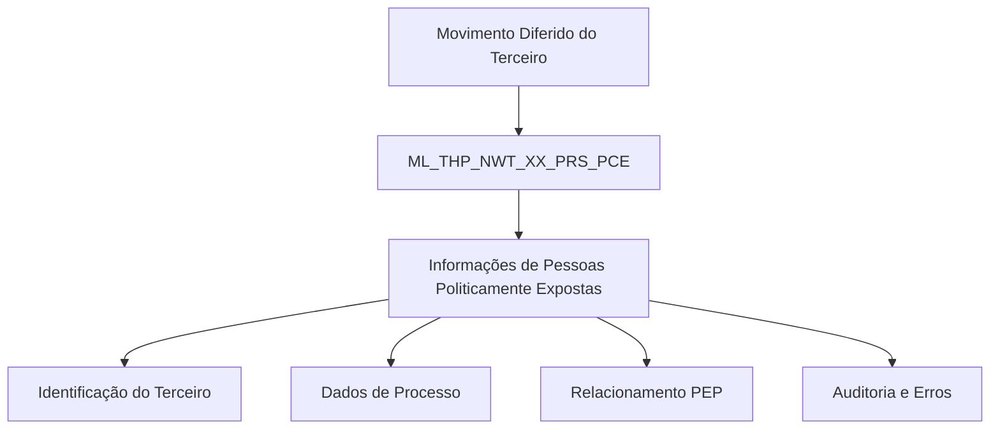

# Detalhamento de Informações de Pessoas Politicamente Expostas no Movimento Diferido do Terceiro — Visão Técnica

## 1. Metadados do Documento
- **Arquivo de Origem:** Não identificado no conteúdo fornecido
- **Tipo de Documento:** Especificação Técnica
- **Domínio / Sistema:** Reef / Mapfre / Movimento Diferido do Terceiro
- **Público-Alvo:** Desenvolvedores, Arquitetos, Operação
- **Data/Versão Identificada:** Não identificada

---

## 2. Resumo Executivo & Contexto de Negócio

O documento descreve, sob uma visão técnica, as informações de Pessoas Politicamente Expostas (PEP) envolvidas no processo denominado “Movimiento Diferido del Tercero”. O conteúdo identifica a tabela de dados utilizada pela operação e detalha as respectivas colunas, incluindo obrigatoriedade e descrição funcional.

A estrutura técnica central apresentada é a tabela `ML_THP_NWT_XX_PRS_PCE`, definida como uma “TABLA BUZON DE PERSONAS EXPUESTAS POLITICAMENTE”. A tabela contém identificadores, dados documentais do terceiro, informações de processo, relacionamento PEP, indicadores de familiar ou estrecho colaborador, datas de registro e baixa como PEP, auditoria e identificação de erro.

O documento também sinaliza que determinados campos são obrigatórios, especialmente campos de identificação, sequência, companhia, documentação do terceiro, validade, indicador de familiar/estrecho colaborador, estado de desabilitação da linha e dados de auditoria. Outros campos relacionados ao processo, situação, cargo ou relacionamento PEP, datas de registro e baixa, documentação relacionada ao PEP, ação de origem e erro interno aparecem como não obrigatórios.

Não há detalhamento de métodos HTTP, contratos de integração, mecanismos de carga, regras de persistência, valores permitidos, origem dos dados ou processamento operacional da tabela. O material é uma especificação parcial focada na estrutura de dados da caixa postal de Pessoas Politicamente Expostas.

---

## 3. Arquitetura, Componentes & Tecnologias Envolvidas

### Componentes e sistemas identificados

| Componente / Termo | Papel identificado no documento | Observações |
| :--- | :--- | :--- |
| `ML_THP_NWT_XX_PRS_PCE` | Tabela envolvida na operação de informações PEP | Descrita como tabela caixa postal de Pessoas Politicamente Expostas |
| Movimento Diferido do Terceiro | Operação na qual a tabela é utilizada | O fluxo operacional não é detalhado |
| Reef | Repositório ou contexto de documentação citado | Aparece em “Documentation / DOCUMENTACIÓN Reef” |
| Mapfre | Contexto organizacional/documental citado | Aparece em referências de documentação e no usuário proprietário |
| `agonzalez_mapfre.com` | Owner identificado no conteúdo | Apresentado como `user:agonzalez_mapfre.com` |
| Lifecycle Approved Source / VL | Metadados de ciclo de vida exibidos | O significado de `VL` não é detalhado |



> **Nota de Análise:** O conteúdo informa que a tabela `ML_THP_NWT_XX_PRS_PCE` intervém na operação, mas não descreve sistemas chamadores, integrações, protocolos, APIs, jobs, eventos, tecnologias de banco de dados ou contratos de dados.

---

## 4. Regras de Negócio, Especificações Funcionais & Processos

### Estrutura funcional identificada

A operação de Movimento Diferido do Terceiro utiliza a tabela `ML_THP_NWT_XX_PRS_PCE` para armazenar ou tratar dados relacionados a Pessoas Politicamente Expostas. A tabela é apresentada como uma caixa postal de Pessoas Politicamente Expostas.

### Regras de obrigatoriedade extraídas

1. Os campos `BTC_IDN_VAL`, `SQN_VAL` e `CMP_VAL` são obrigatórios e representam, respectivamente, identificador, sequência e companhia.
2. Os campos `THP_DCM_TYP_VAL` e `THP_DCM_VAL` são obrigatórios e representam o tipo de documento e o documento do terceiro.
3. O campo `VLD_DAT` é obrigatório e representa a data de validade.
4. O campo `FML_CBR` é obrigatório e representa o indicador de familiar ou estrecho colaborador.
5. O campo `DSB_ROW` é obrigatório e representa uma linha desabilitada.
6. Os campos `USR_VAL` e `MDF_DAT` são obrigatórios e registram o usuário que atualizou a linha e a data de modificação.
7. Os campos `PRC_THD_VAL` e `PRC_STS_VAL` não são obrigatórios e representam, respectivamente, o hilo e a situação do processo.
8. O campo `PCE_PST_RLN_VAL` não é obrigatório e representa o código de cargo ou relação PEP.
9. Os campos `PRS_PCE_RGS_DAT` e `PRS_PCE_RMV_DAT` não são obrigatórios e representam a data de alta e a data de baixa como Pessoa Politicamente Exposta.
10. Os campos `PRS_PCE_RLT_DCM_TYP_VAL` e `PRS_PCE_RLT_DCM_VAL` não são obrigatórios e representam o tipo e o código de documento relacionado ao PEP.
11. Os campos `ACN_ORG_VAL` e `ERR_IDN_VAL` não são obrigatórios e representam, respectivamente, a ação de origem e o identificador interno do erro.

> **Nota de Análise:** O campo “CAMBIA VALOR” é apresentado na extração como cabeçalho ou atributo da tabela, com valor `S` para todas as colunas listadas. O documento não explica semanticamente o significado de `S`, nem descreve se esse valor representa alteração, habilitação, sincronização ou outra regra.

> **Nota de Análise:** O documento não define regras de validação para formato de documentos, cálculo de datas, transições de situação do processo, tratamento de erros ou critérios para classificar uma pessoa como PEP.

---

## 5. Tabelas de Parâmetros, Ambientes e Estruturas de Dados

### Tabela principal envolvida

| Item / Parâmetro | Descrição / Função | Tipo / Valores / Formato | Ambiente / Observações |
| :--- | :--- | :--- | :--- |
| `ML_THP_NWT_XX_PRS_PCE` | Tabela caixa postal de Pessoas Politicamente Expostas | Nome de tabela | Intervém na operação de Movimento Diferido do Terceiro |

### Colunas da tabela `ML_THP_NWT_XX_PRS_PCE`

| Item / Parâmetro | Descrição / Função | Tipo / Valores / Formato | Ambiente / Observações |
| :--- | :--- | :--- | :--- |
| `BTC_IDN_VAL` | Identificador | Valor “Cambia Valor”: `S` | Obrigatória: Sim |
| `SQN_VAL` | Sequência | Valor “Cambia Valor”: `S` | Obrigatória: Sim |
| `CMP_VAL` | Companhia | Valor “Cambia Valor”: `S` | Obrigatória: Sim |
| `THP_DCM_TYP_VAL` | Tipo do documento do terceiro | Valor “Cambia Valor”: `S` | Obrigatória: Sim |
| `THP_DCM_VAL` | Documento do terceiro | Valor “Cambia Valor”: `S` | Obrigatória: Sim |
| `VLD_DAT` | Data de validade | Valor “Cambia Valor”: `S` | Obrigatória: Sim |
| `PRC_THD_VAL` | Hilo | Valor “Cambia Valor”: `S` | Obrigatória: Não |
| `PRC_STS_VAL` | Situação do processo | Valor “Cambia Valor”: `S` | Obrigatória: Não |
| `PCE_PST_RLN_VAL` | Código de cargo/relação PEP | Valor “Cambia Valor”: `S` | Obrigatória: Não |
| `FML_CBR` | Indicador de familiar ou estrecho colaborador | Valor “Cambia Valor”: `S` | Obrigatória: Sim |
| `PRS_PCE_RGS_DAT` | Data de alta como Pessoa Politicamente Exposta | Valor “Cambia Valor”: `S` | Obrigatória: Não |
| `PRS_PCE_RMV_DAT` | Data de baixa como Pessoa Politicamente Exposta | Valor “Cambia Valor”: `S` | Obrigatória: Não |
| `PRS_PCE_RLT_DCM_TYP_VAL` | Tipo de documento relacionado ao PEP | Valor “Cambia Valor”: `S` | Obrigatória: Não |
| `PRS_PCE_RLT_DCM_VAL` | Código de documento relacionado ao PEP | Valor “Cambia Valor”: `S` | Obrigatória: Não |
| `DSB_ROW` | Linha desabilitada | Valor “Cambia Valor”: `S` | Obrigatória: Sim |
| `USR_VAL` | Usuário que atualizou a linha | Valor “Cambia Valor”: `S` | Obrigatória: Sim |
| `MDF_DAT` | Data de modificação | Valor “Cambia Valor”: `S` | Obrigatória: Sim |
| `ACN_ORG_VAL` | Ação de origem | Valor “Cambia Valor”: `S` | Obrigatória: Não |
| `ERR_IDN_VAL` | Identificador interno do erro | Valor “Cambia Valor”: `S` | Obrigatória: Não |

### Metadados documentais identificados

| Item / Parâmetro | Descrição / Função | Tipo / Valores / Formato | Ambiente / Observações |
| :--- | :--- | :--- | :--- |
| Owner | Proprietário identificado no documento | `user:agonzalez_mapfre.com` | Não há outra identificação do responsável |
| Lifecycle | Estado de ciclo de vida exibido | `Approved Source / VL` | Significado de `VL` não detalhado |
| Documentação | Contexto documental | `Documentation / DOCUMENTACIÓN Reef` | Também há referência a `Mapfredocument` |

---

## 6. Bateria de Perguntas & Respostas para RAG (FAQ Sintético)

### P1: Qual tabela é utilizada para informações de Pessoas Politicamente Expostas no Movimento Diferido do Terceiro?
**R:** A tabela utilizada é `ML_THP_NWT_XX_PRS_PCE`, descrita no documento como a “TABLA BUZON DE PERSONAS EXPUESTAS POLITICAMENTE”. O documento informa que essa tabela intervém na operação de Movimento Diferido do Terceiro.

### P2: Quais campos identificam o registro e são obrigatórios na tabela `ML_THP_NWT_XX_PRS_PCE`?
**R:** Os campos obrigatórios de identificação apresentados são `BTC_IDN_VAL`, descrito como identificador; `SQN_VAL`, descrito como sequência; e `CMP_VAL`, descrito como companhia.

### P3: Quais dados documentais do terceiro são obrigatórios na tabela de Pessoas Politicamente Expostas?
**R:** Os dados documentais obrigatórios do terceiro são `THP_DCM_TYP_VAL`, que representa o tipo do documento do terceiro, e `THP_DCM_VAL`, que representa o documento do terceiro. O campo `VLD_DAT`, correspondente à data de validade, também é obrigatório.

### P4: Como a tabela registra se existe relação familiar ou de estrecho colaborador com uma Pessoa Politicamente Exposta?
**R:** O campo `FML_CBR` registra o indicador de familiar ou estrecho colaborador. O documento classifica `FML_CBR` como obrigatório.

### P5: Qual campo representa o cargo ou relacionamento PEP?
**R:** O campo `PCE_PST_RLN_VAL` representa o código de cargo ou relação PEP. De acordo com o documento, esse campo não é obrigatório.

### P6: Quais campos registram datas de alta e baixa como Pessoa Politicamente Exposta?
**R:** O campo `PRS_PCE_RGS_DAT` representa a data de alta como Pessoa Politicamente Exposta, enquanto `PRS_PCE_RMV_DAT` representa a data de baixa como Pessoa Politicamente Exposta. Ambos são classificados como não obrigatórios.

### P7: Como são armazenados documentos relacionados ao PEP?
**R:** O documento apresenta `PRS_PCE_RLT_DCM_TYP_VAL` como o tipo de documento relacionado ao PEP e `PRS_PCE_RLT_DCM_VAL` como o código de documento relacionado ao PEP. Ambos os campos não são obrigatórios.

### P8: Quais campos representam informações de processo na tabela PEP?
**R:** As informações de processo são representadas por `PRC_THD_VAL`, descrito como hilo, e `PRC_STS_VAL`, descrito como situação do processo. Os dois campos são não obrigatórios.

### P9: Quais informações de auditoria são obrigatórias no registro?
**R:** As informações obrigatórias de auditoria são `USR_VAL`, que identifica o usuário que atualizou a linha, e `MDF_DAT`, que representa a data de modificação. O campo `DSB_ROW`, que indica uma linha desabilitada, também é obrigatório.

### P10: Como a tabela registra origem de ação e erros internos?
**R:** O campo `ACN_ORG_VAL` representa a ação de origem, e o campo `ERR_IDN_VAL` representa o identificador interno do erro. Ambos são apresentados como não obrigatórios.

### P11: O documento especifica o significado do valor `S` na coluna “Cambia Valor”?
**R:** Não. O documento apresenta o valor `S` para todas as colunas listadas na seção “Cambia Valor”, mas não fornece definição para esse valor nem descreve sua consequência funcional ou técnica.

### P12: O documento detalha APIs, métodos HTTP ou contratos JSON para a tabela `ML_THP_NWT_XX_PRS_PCE`?
**R:** Não. O conteúdo fornecido limita-se à identificação da tabela e às suas colunas, obrigatoriedade e comentários. Não há métodos HTTP, endpoints, contratos JSON, mecanismos de integração ou detalhes de persistência.

---

## 7. Glossário de Termos, Siglas & Conceitos-Chave

- **PEP:** Pessoa Politicamente Exposta. O documento usa o termo em campos relacionados a cargo/relação PEP e documentos relacionados ao PEP.
- **`ML_THP_NWT_XX_PRS_PCE`:** Tabela caixa postal de Pessoas Politicamente Expostas.
- **`BTC_IDN_VAL`:** Identificador.
- **`SQN_VAL`:** Sequência.
- **`CMP_VAL`:** Companhia.
- **`THP_DCM_TYP_VAL`:** Tipo do documento do terceiro.
- **`THP_DCM_VAL`:** Documento do terceiro.
- **`VLD_DAT`:** Data de validade.
- **`PRC_THD_VAL`:** Hilo.
- **`PRC_STS_VAL`:** Situação do processo.
- **`PCE_PST_RLN_VAL`:** Código de cargo ou relação PEP.
- **`FML_CBR`:** Indicador de familiar ou estrecho colaborador.
- **`PRS_PCE_RGS_DAT`:** Data de alta como Pessoa Politicamente Exposta.
- **`PRS_PCE_RMV_DAT`:** Data de baixa como Pessoa Politicamente Exposta.
- **`PRS_PCE_RLT_DCM_TYP_VAL`:** Tipo de documento relacionado ao PEP.
- **`PRS_PCE_RLT_DCM_VAL`:** Código de documento relacionado ao PEP.
- **`DSB_ROW`:** Fila ou linha desabilitada.
- **`USR_VAL`:** Usuário que atualizou a linha.
- **`MDF_DAT`:** Data de modificação.
- **`ACN_ORG_VAL`:** Ação de origem.
- **`ERR_IDN_VAL`:** Identificador interno do erro.
- **Reef:** Referência de documentação apresentada no conteúdo.
- **Lifecycle:** Metadado de ciclo de vida exibido como `Approved Source / VL`.

---

## 8. Notas Críticas, Riscos & Limitações

- O documento não informa o tipo físico das colunas, como `VARCHAR`, `DATE`, `NUMBER`, tamanho, precisão ou domínio de valores.
- O significado funcional do valor `S` na coluna “Cambia Valor” não foi definido.
- Não há detalhamento sobre a origem dos dados, consumidores da tabela, frequência de carga, mecanismos de integração ou tratamento de falhas.
- Não há regras que expliquem quando uma pessoa deve ser registrada, atualizada, desabilitada ou removida como Pessoa Politicamente Exposta.
- Não há especificação de valores válidos para `PRC_STS_VAL`, `PCE_PST_RLN_VAL`, `FML_CBR`, `DSB_ROW` ou `ACN_ORG_VAL`.
- A noção de “hilo” em `PRC_THD_VAL` não é explicada.
- O documento não define a relação entre a situação do processo, o identificador interno de erro e a ação de origem.
- Não foram encontrados detalhes sobre permissões, segurança, retenção, proteção de dados pessoais, auditoria adicional, URLs, ambientes, servidores ou rotas de logs.

---

## 9. Conteúdo Bruto Estruturado (Referência Fiel)

```text
--- [PÁGINA 1 DE 2] ---

DETALLAR Información de Personas Políticamente Expuestas en el
Movimiento Diferido del Tercero (Visión Técnica)
Modelo de datos involucrado
La tabla que interviene en esta operación es:
TABLA DESCRIPCIÓN
ML_THP_NWT_XX_PRS_PCE TABLA BUZON DE PERSONAS EXPUESTAS POLITICAMENTE
COLUMNA CAMBIA
VALOR
MOTIVO/VALOR OBLIGATORIA COMENTARIO
BTC_IDN_VAL S N.A. SI IDENTIFICADOR
SQN_VAL S N.A. SI SECUENCIA
CMP_VAL S N.A. SI COMPANIA
THP_DCM_TYP_VAL S N.A. SI TIPO DEL DOCUMENTO DEL TERCERO
THP_DCM_VAL S N.A. SI DOCUMENTO DEL TERCERO
VLD_DAT S N.A. SI FECHA VALIDEZ
PRC_THD_VAL S N.A. NO HILO
PRC_STS_VAL S N.A. NO SITUACION DEL PROCESO
PCE_PST_RLN_VAL S N.A. NO CODIGO DE CARGO/RELACION PEP
FML_CBR S N.A. SI INDICADOR DE FAMILIAR O ESTRECHO
COLABORADOR
Documentation / DOCUMENTACIÓN Reef
DOCUMENTACIÓN Reef
Mapfredocument
DOCUMENTACIÓN Reef
Owner
user:agonzalez_mapfre.com
Lifecycle
Approved Source
 / 
 VL
Buscar Inicio Soluciones Arquitecturas APIs Componentes Cloud Documentación Zeus Reef Ayuda
ES


--- [PÁGINA 2 DE 2] ---

COLUMNA CAMBIA
VALOR
MOTIVO/VALOR OBLIGATORIA COMENTARIO
PRS_PCE_RGS_DAT S N.A. NO FECHA DE ALTA COMO PERSONA
EXPUESTA POLITICAMENTE
PRS_PCE_RMV_DAT S N.A. NO FECHA DE BAJA COMO PERSONA
EXPUESTA POLITICAMENTE
PRS_PCE_RLT_DCM_TYP_VAL S N.A. NO TIPO DE DOCUMENTO RELACIONADO
AL PEP
PRS_PCE_RLT_DCM_VAL S N.A. NO CODIGO DE DOCUMENTO
RELACIONADO AL PEP
DSB_ROW S N.A. SI FILA DESHABILITADA
USR_VAL S N.A. SI USUARIO QUE ACTUALIZO LA FILA
MDF_DAT S N.A. SI FECHA MODIFICACION
ACN_ORG_VAL S N.A. NO ACCION ORIGEN
ERR_IDN_VAL S N.A. NO IDENTIFICADOR INTERNO DEL ERROR
```
