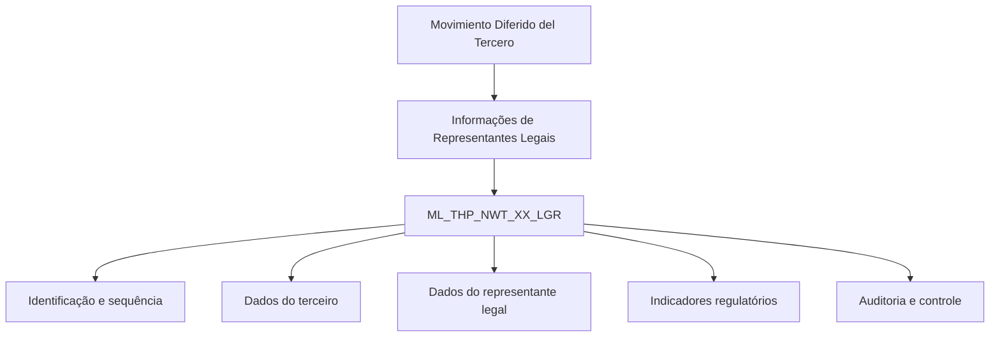

# Detalhamento de Representantes Legais no Movimento Diferido do Terceiro — Visão Técnica

## 1. Metadados do Documento
- **Arquivo de Origem:** Não identificado
- **Tipo de Documento:** Especificação Técnica
- **Domínio / Sistema:** Reef / Mapfre — Movimento Diferido do Terceiro
- **Público-Alvo:** Desenvolvedores, Arquitetos, Analistas Funcionais e Operação
- **Data/Versão Identificada:** Não identificada

---

## 2. Resumo Executivo & Contexto de Negócio

O documento descreve, sob uma visão técnica, o detalhamento de informações de representantes legais no processo denominado **Movimiento Diferido del Tercero**. O artefato identifica explicitamente o modelo de dados envolvido na operação e a tabela utilizada para armazenar essas informações.

A entidade central citada é a tabela `ML_THP_NWT_XX_LGR`, descrita como **TABLA BUZON REPRESENTANTES LEGALES**. A documentação relaciona colunas da tabela aos seus respectivos requisitos de alteração, obrigatoriedade e comentários funcionais.

Os campos documentados abrangem identificação e sequência, companhia, documento e atividade do terceiro, documento do representante legal, data de validade, situação do processo, indicadores de pessoa politicamente exposta, pessoa investigada e atividades ilícitas.

O conteúdo também registra atributos de auditoria e controle, como usuário responsável pela atualização da linha, data de modificação, ação de origem, identificador interno de erro e flag de linha desabilitada. Não há detalhamento de APIs, métodos HTTP, contratos JSON, fluxos de persistência ou regras de processamento além da estrutura de dados apresentada.

---

## 3. Arquitetura, Componentes & Tecnologias Envolvidas

Os componentes e referências explicitamente identificados são:

- **Reef:** contexto de documentação apresentado no conteúdo.
- **Mapfre:** referência corporativa presente na documentação.
- **Movimiento Diferido del Tercero:** operação para a qual são detalhados os representantes legais.
- **`ML_THP_NWT_XX_LGR`:** tabela de buzón de representantes legais.
- **Owner:** `user:agonzalez_mapfre.com`.
- **Lifecycle:** `Approved`.



**Nota de Análise:** o documento não detalha aplicações consumidoras ou produtoras da tabela `ML_THP_NWT_XX_LGR`, integrações, APIs, tecnologias de banco de dados, ambientes de execução ou contratos de interface.

---

## 4. Regras de Negócio, Especificações Funcionais & Processos

1. A operação documentada utiliza a tabela `ML_THP_NWT_XX_LGR`, definida como tabela de buzón de representantes legais.
2. As colunas `BTC_IDN_VAL`, `SQN_VAL` e `CMP_VAL` são obrigatórias e estão associadas, respectivamente, a identificador, sequência e companhia.
3. O terceiro é identificado por tipo de documento (`THP_DCM_TYP_VAL`), documento (`THP_DCM_VAL`) e atividade (`THP_ACV_VAL`); todos esses campos são obrigatórios.
4. O representante legal deve possuir tipo de documento (`LGR_DCM_TYP_VAL`) e documento (`LGR_DCM_VAL`), ambos obrigatórios.
5. A data de validade do registro é representada por `VLD_DAT` e é obrigatória.
6. `PRC_THD_VAL`, referente a hilo, e `PRC_STS_VAL`, referente à situação do processo, não são obrigatórios.
7. O indicador de pessoa politicamente exposta é armazenado em `PRS_PCE` e é obrigatório.
8. As datas de alta e baixa como representante legal, `LGR_RGS_DAT` e `LGR_RMV_DAT`, não são obrigatórias.
9. O controle de desabilitação de linha é realizado pelo campo obrigatório `DSB_ROW`.
10. A auditoria de atualização exige `USR_VAL`, para usuário que atualizou a linha, e `MDF_VAL`, para data de modificação.
11. `ACN_ORG_VAL`, correspondente à ação de origem, e `ERR_IDN_VAL`, correspondente ao identificador interno do erro, não são obrigatórios.
12. O tipo de representante legal é registrado em `LGR_TYP_VAL`, classificado como não obrigatório.
13. Os indicadores `ISG_PRS` para pessoa investigada e `ILG_ACV` para atividades ilícitas são obrigatórios.
14. A descrição de atividades ilícitas é registrada em `ILG_ACV_DSP_VAL`, classificada como não obrigatória.

**Nota de Análise:** o documento informa se os campos alteram valor com `S` e apresenta `N.A.` como motivo/valor em todos os itens. Não há detalhamento adicional sobre valores permitidos, domínios, tipos físicos de dados, chaves, relacionamentos ou regras de validação condicional.

---

## 5. Tabelas de Parâmetros, Ambientes e Estruturas de Dados

| Item / Parâmetro | Descrição / Função | Tipo / Valores / Formato | Ambiente / Observações |
| :--- | :--- | :--- | :--- |
| `ML_THP_NWT_XX_LGR` | Tabela buzón de representantes legais | Tabela de dados | Modelo de dados envolvido na operação |
| `BTC_IDN_VAL` | Identificador | Cambia valor: `S`; obrigatório: `SI` | Motivo/valor: `N.A.` |
| `SQN_VAL` | Sequência | Cambia valor: `S`; obrigatório: `SI` | Motivo/valor: `N.A.` |
| `CMP_VAL` | Companhia | Cambia valor: `S`; obrigatório: `SI` | Motivo/valor: `N.A.` |
| `THP_DCM_TYP_VAL` | Tipo do documento do terceiro | Cambia valor: `S`; obrigatório: `SI` | Motivo/valor: `N.A.` |
| `THP_DCM_VAL` | Documento do terceiro | Cambia valor: `S`; obrigatório: `SI` | Motivo/valor: `N.A.` |
| `THP_ACV_VAL` | Atividade do terceiro | Cambia valor: `S`; obrigatório: `SI` | Motivo/valor: `N.A.` |
| `LGR_DCM_TYP_VAL` | Tipo de documento do representante legal | Cambia valor: `S`; obrigatório: `SI` | Motivo/valor: `N.A.` |
| `LGR_DCM_VAL` | Documento do representante legal | Cambia valor: `S`; obrigatório: `SI` | Motivo/valor: `N.A.` |
| `VLD_DAT` | Data de validade | Cambia valor: `S`; obrigatório: `SI` | Motivo/valor: `N.A.` |
| `PRC_THD_VAL` | Hilo | Cambia valor: `S`; obrigatório: `NO` | Motivo/valor: `N.A.` |
| `PRC_STS_VAL` | Situação do processo | Cambia valor: `S`; obrigatório: `NO` | Motivo/valor: `N.A.` |
| `PRS_PCE` | Pessoa politicamente exposta | Cambia valor: `S`; obrigatório: `SI` | Motivo/valor: `N.A.` |
| `LGR_RGS_DAT` | Data de alta como representante legal | Cambia valor: `S`; obrigatório: `NO` | Motivo/valor: `N.A.` |
| `LGR_RMV_DAT` | Data de baixa como representante legal | Cambia valor: `S`; obrigatório: `NO` | Motivo/valor: `N.A.` |
| `DSB_ROW` | Linha desabilitada | Cambia valor: `S`; obrigatório: `SI` | Motivo/valor: `N.A.` |
| `USR_VAL` | Usuário que atualizou a linha | Cambia valor: `S`; obrigatório: `SI` | Motivo/valor: `N.A.` |
| `MDF_VAL` | Data de modificação | Cambia valor: `S`; obrigatório: `SI` | Motivo/valor: `N.A.` |
| `ACN_ORG_VAL` | Ação de origem | Cambia valor: `S`; obrigatório: `NO` | Motivo/valor: `N.A.` |
| `ERR_IDN_VAL` | Identificador interno do erro | Cambia valor: `S`; obrigatório: `NO` | Motivo/valor: `N.A.` |
| `LGR_TYP_VAL` | Tipo de representante legal | Cambia valor: `S`; obrigatório: `NO` | Motivo/valor: `N.A.` |
| `ISG_PRS` | Pessoa investigada | Cambia valor: `S`; obrigatório: `SI` | Motivo/valor: `N.A.` |
| `ILG_ACV` | Atividades ilícitas | Cambia valor: `S`; obrigatório: `SI` | Motivo/valor: `N.A.` |
| `ILG_ACV_DSP_VAL` | Descrição de atividades ilícitas | Cambia valor: `S`; obrigatório: `NO` | Motivo/valor: `N.A.` |
| Owner | Responsável indicado pela documentação | `user:agonzalez_mapfre.com` | Reef / Mapfre |
| Lifecycle | Estado do ciclo de vida da documentação | `Approved` | Não há versão ou data informada |

---

## 6. Bateria de Perguntas & Respostas para RAG (FAQ Sintético)

### P1: Qual tabela armazena as informações de representantes legais no Movimento Diferido do Terceiro?
**R:** A tabela identificada no documento é `ML_THP_NWT_XX_LGR`, descrita como **TABLA BUZON REPRESENTANTES LEGALES**.

### P2: Quais campos identificam o terceiro na tabela `ML_THP_NWT_XX_LGR`?
**R:** O documento informa três campos obrigatórios para dados do terceiro: `THP_DCM_TYP_VAL`, tipo do documento do terceiro; `THP_DCM_VAL`, documento do terceiro; e `THP_ACV_VAL`, atividade do terceiro.

### P3: Quais dados do representante legal são obrigatórios?
**R:** São obrigatórios o tipo de documento do representante legal (`LGR_DCM_TYP_VAL`) e o documento do representante legal (`LGR_DCM_VAL`). A data de alta e a data de baixa como representante legal não são obrigatórias.

### P4: A data de validade é obrigatória para o registro de representante legal?
**R:** Sim. O campo `VLD_DAT`, descrito como data de validade, está marcado como obrigatório (`SI`).

### P5: Como a tabela registra se uma pessoa é politicamente exposta?
**R:** O campo `PRS_PCE` registra a condição de pessoa politicamente exposta. O documento classifica `PRS_PCE` como obrigatório.

### P6: Quais campos tratam de investigação e atividades ilícitas?
**R:** `ISG_PRS` identifica pessoa investigada e é obrigatório. `ILG_ACV` representa atividades ilícitas e também é obrigatório. `ILG_ACV_DSP_VAL` armazena a descrição de atividades ilícitas, mas não é obrigatório.

### P7: Quais campos de auditoria são obrigatórios na tabela?
**R:** O documento aponta `USR_VAL`, usuário que atualizou a linha, e `MDF_VAL`, data de modificação, como campos obrigatórios. `DSB_ROW`, referente à linha desabilitada, também é obrigatório.

### P8: O processo possui campos para situação e hilo?
**R:** Sim. `PRC_THD_VAL` corresponde a hilo e `PRC_STS_VAL` corresponde à situação do processo. Ambos estão marcados como não obrigatórios.

### P9: Quais campos relacionados a erro e origem são não obrigatórios?
**R:** `ACN_ORG_VAL`, ação de origem, e `ERR_IDN_VAL`, identificador interno do erro, são ambos classificados como não obrigatórios.

### P10: O documento define os tipos de dados físicos, valores permitidos ou contratos de API dos campos?
**R:** Não. O documento informa nome de coluna, indicação de mudança de valor, obrigatoriedade e comentário funcional. Não detalha tipos físicos, domínios de valores, chaves, endpoints, métodos HTTP ou contratos JSON.

---

## 7. Glossário de Termos, Siglas & Conceitos-Chave

- **`ML_THP_NWT_XX_LGR`:** tabela de buzón de representantes legais.
- **`BTC_IDN_VAL`:** identificador.
- **`SQN_VAL`:** sequência.
- **`CMP_VAL`:** companhia.
- **`THP_DCM_TYP_VAL`:** tipo do documento do terceiro.
- **`THP_DCM_VAL`:** documento do terceiro.
- **`THP_ACV_VAL`:** atividade do terceiro.
- **`LGR_DCM_TYP_VAL`:** tipo de documento do representante legal.
- **`LGR_DCM_VAL`:** documento do representante legal.
- **`VLD_DAT`:** data de validade.
- **`PRC_THD_VAL`:** hilo.
- **`PRC_STS_VAL`:** situação do processo.
- **`PRS_PCE`:** pessoa politicamente exposta.
- **`LGR_RGS_DAT`:** data de alta como representante legal.
- **`LGR_RMV_DAT`:** data de baixa como representante legal.
- **`DSB_ROW`:** linha desabilitada.
- **`USR_VAL`:** usuário que atualizou a linha.
- **`MDF_VAL`:** data de modificação.
- **`ACN_ORG_VAL`:** ação de origem.
- **`ERR_IDN_VAL`:** identificador interno do erro.
- **`LGR_TYP_VAL`:** tipo de representante legal.
- **`ISG_PRS`:** pessoa investigada.
- **`ILG_ACV`:** atividades ilícitas.
- **`ILG_ACV_DSP_VAL`:** descrição de atividades ilícitas.
- **Reef:** contexto de documentação citado no artefato.
- **Lifecycle Approved:** estado de ciclo de vida informado para a documentação.

---

## 8. Notas Críticas, Riscos & Limitações

- O documento é concentrado no modelo de dados e não descreve o fluxo operacional completo do Movimento Diferido do Terceiro.
- Não foram identificados tipos físicos de colunas, tamanho de campos, valores permitidos, chaves primárias, chaves estrangeiras ou índices da tabela `ML_THP_NWT_XX_LGR`.
- Não há definição de comportamentos de inserção, atualização, exclusão, desabilitação lógica ou tratamento de erro.
- Não há contratos de API, métodos HTTP, mensagens, tópicos, filas, integrações ou aplicações consumidoras da estrutura.
- Não são apresentados URLs, servidores, ambientes, portas, versões de software ou procedimentos de implantação.
- A expressão `S` em “Cambia Valor” e `N.A.` em “Motivo/Valor” é apresentada sem definição adicional no conteúdo original.
- **Nota de Análise:** o documento lista a tabela `ML_THP_NWT_XX_LGR`, porém não detalha os métodos de acesso, contratos de integração ou regras condicionais de preenchimento dos campos.

---

## 9. Conteúdo Bruto Estruturado (Referência Fiel)

```text
--- [PÁGINA 1 DE 2] ---

DETALLAR Información de Representantes Legales en el Movimiento
Diferido del Tercero (Visión Técnica)
Modelo de datos involucrado
La tabla que interviene en esta operación es:
TABLA DESCRIPCIÓN
ML_THP_NWT_XX_LGR TABLA BUZON REPRESENTANTES LEGALES
COLUMNA CAMBIA
VALOR
MOTIVO/VALOR OBLIGATORIA COMENTARIO
BTC_IDN_VAL S N.A. SI IDENTIFICADOR
SQN_VAL S N.A. SI SECUENCIA
CMP_VAL S N.A. SI COMPANIA
THP_DCM_TYP_VAL S N.A. SI TIPO DEL DOCUMENTO DEL TERCERO
THP_DCM_VAL S N.A. SI DOCUMENTO DEL TERCERO
THP_ACV_VAL S N.A. SI ACTIVIDAD TERCERO
LGR_DCM_TYP_VAL S N.A. SI TIPO DOCUMENTO REPRESENTANTE LEGAL
LGR_DCM_VAL S N.A. SI DOCUMENTO REPRESENTANTE LEGAL
VLD_DAT S N.A. SI FECHA VALIDEZ
PRC_THD_VAL S N.A. NO HILO
PRC_STS_VAL S N.A. NO SITUACION DEL PROCESO
Documentation / DOCUMENTACIÓN Reef
DOCUMENTACIÓN Reef
Mapfredocument
DOCUMENTACIÓN Reef
Owner
user:agonzalez_mapfre.com
Lifecycle
Approved Source
 / 
 VL
Buscar Inicio Soluciones Arquitecturas APIs Componentes Cloud Documentación Zeus Reef Ayuda
ES


--- [PÁGINA 2 DE 2] ---

COLUMNA CAMBIA
VALOR
MOTIVO/VALOR OBLIGATORIA COMENTARIO
PRS_PCE S N.A. SI PERSONA POLITICAMENTE EXPUESTA
LGR_RGS_DAT S N.A. NO FECHA DE ALTA COMO REPRESENTANTE
LEGAL
LGR_RMV_DAT S N.A. NO FECHA DE BAJA COMO REPRESENTANTE
LEGAL
DSB_ROW S N.A. SI FILA DESHABILITADA
USR_VAL S N.A. SI USUARIO QUE ACTUALIZO LA FILA
MDF_VAL S N.A. SI FECHA MODIFICACION
ACN_ORG_VAL S N.A. NO ACCION ORIGEN
ERR_IDN_VAL S N.A. NO IDENTIFICADOR INTERNO DEL ERROR
LGR_TYP_VAL S N.A. NO TIPO DE REPRESENTANTE LEGAL
ISG_PRS S N.A. SI PERSONA INVESTIGADA
ILG_ACV S N.A. SI ACTIVIDADES ILICITAS
ILG_ACV_DSP_VAL S N.A. NO DESCRIPCION DE ACTIVIDADES ILICITAS
```
