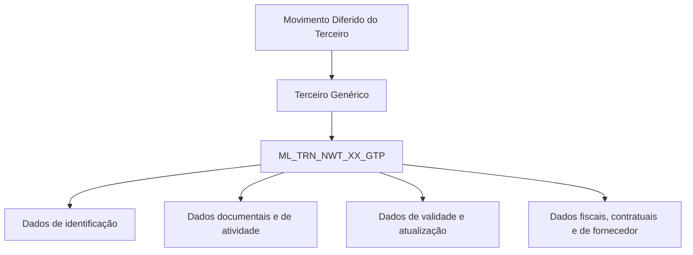

# Movimento Diferido do Terceiro — Detalhamento do Terceiro Genérico (Visão Técnica)

## 1. Metadados do Documento
- **Arquivo de Origem:** Não identificado no conteúdo extraído
- **Tipo de Documento:** Especificação Técnica
- **Domínio / Sistema:** Reef / Mapfre — Movimento Diferido do Terceiro
- **Público-Alvo:** Desenvolvedores, Arquitetos e Operação
- **Data/Versão Identificada:** Não identificada

---

## 2. Resumo Executivo & Contexto de Negócio

O documento apresenta uma visão técnica para detalhar informações de um **Terceiro Genérico** no contexto do **Movimento Diferido do Terceiro**. O escopo explicitamente apresentado é o modelo de dados envolvido na operação.

A operação utiliza a tabela `ML_TRN_NWT_XX_GTP`, descrita como **TABLA BUZON TERCERO GENERICO**. O conteúdo disponível mapeia colunas da tabela, sua obrigatoriedade e comentários funcionais em espanhol.

A especificação identifica campos de identificação, sequência, companhia, documento, atividade, validade, atualização e usuário responsável pela atualização da linha. Também relaciona atributos complementares do terceiro, como agrupamento, observações, retenção, classificação de beneficiário, dados fiscais, contrato, idioma e dados de fornecedor.

O material está hospedado ou associado à documentação Reef/Mapfre e possui referência de proprietário `user:agonzalez_mapfre.com`, com ciclo de vida indicado como `Approved Source / VL`. Não há descrição de fluxos transacionais, APIs, métodos HTTP, contratos JSON, integrações, regras de preenchimento ou comportamento de persistência.

---

## 3. Arquitetura, Componentes & Tecnologias Envolvidas

Os elementos identificados no conteúdo são:

| Componente / Elemento | Papel identificado |
| :--- | :--- |
| Reef | Contexto de documentação citado como “DOCUMENTACIÓN Reef”. |
| Mapfre | Organização ou domínio mencionado em `Mapfredocument` e no identificador do proprietário. |
| Movimento Diferido do Terceiro | Operação à qual o detalhamento técnico se aplica. |
| Terceiro Genérico | Entidade de negócio cujas informações são armazenadas na tabela identificada. |
| `ML_TRN_NWT_XX_GTP` | Tabela descrita como “TABLA BUZON TERCERO GENERICO”. |
| `user:agonzalez_mapfre.com` | Proprietário identificado na documentação. |
| `Approved Source / VL` | Informação de lifecycle exibida no conteúdo. |



**Nota de Análise:** O conteúdo não descreve microsserviços, camadas de aplicação, infraestrutura, bancos de dados além da tabela citada, protocolos de integração, APIs, URLs, ambientes ou ferramentas de CI/CD.

---

## 4. Regras de Negócio, Especificações Funcionais & Processos

A regra estrutural explicitamente disponível é o cadastro de dados do Terceiro Genérico na tabela `ML_TRN_NWT_XX_GTP`, no contexto do Movimento Diferido do Terceiro.

### Campos obrigatórios identificados

Os seguintes campos estão marcados como obrigatórios (`SI`) no conteúdo:

1. `IDN_VAL`: identificador.
2. `IDN_SQN`: sequência dentro do identificador.
3. `CMP_VAL`: companhia.
4. `THP_DCM_TYP_VAL`: tipo de documento do terceiro.
5. `THP_DCM_VAL`: código de documento do terceiro.
6. `THP_ACV_VAL`: atividade do terceiro.
7. `VLD_DAT`: data de validade.
8. `MDF_DAT`: data de atualização.
9. `USR_VAL`: usuário que atualizou a linha.

### Campos não obrigatórios identificados

Os demais campos documentados estão marcados como não obrigatórios (`NO`), incluindo dados de processo, código do terceiro, classificação, retenção, dados fiscais, contrato, idioma e fornecedor.

### Restrições e lacunas documentais

- A coluna **CAMBIA** possui valor `S` para todos os campos apresentados.
- A coluna **VALOR MOTIVO/VALOR** possui valor `N.A.` para todos os campos apresentados.
- O conteúdo não explica o significado operacional de `S` em **CAMBIA**.
- O conteúdo não define formatos, domínios de valores, tamanhos, chaves primárias, chaves estrangeiras ou regras de validação para as colunas.
- O conteúdo não informa como a tabela é inserida, atualizada, consultada ou integrada a outros sistemas.
- O conteúdo não descreve métodos HTTP, contratos JSON ou interfaces expostas para o Terceiro Genérico.

---

## 5. Tabelas de Parâmetros, Ambientes e Estruturas de Dados

### Estrutura de dados: `ML_TRN_NWT_XX_GTP`

| Item / Parâmetro | Descrição / Função | Tipo / Valores / Formato | Ambiente / Observações |
| :--- | :--- | :--- | :--- |
| `IDN_VAL` | Identificador | CAMBIA: `S`; VALOR: `N.A.` | Obrigatório: `SI` |
| `IDN_SQN` | Sequência dentro do identificador | CAMBIA: `S`; VALOR: `N.A.` | Obrigatório: `SI` |
| `PRC_THD_VAL` | Hilo | CAMBIA: `S`; VALOR: `N.A.` | Obrigatório: `NO` |
| `PRC_STS_VAL` | Situação do processo | CAMBIA: `S`; VALOR: `N.A.` | Obrigatório: `NO` |
| `CMP_VAL` | Companhia | CAMBIA: `S`; VALOR: `N.A.` | Obrigatório: `SI` |
| `THP_DCM_TYP_VAL` | Tipo de documento do terceiro | CAMBIA: `S`; VALOR: `N.A.` | Obrigatório: `SI` |
| `THP_DCM_VAL` | Código de documento do terceiro | CAMBIA: `S`; VALOR: `N.A.` | Obrigatório: `SI` |
| `THP_ACV_VAL` | Atividade do terceiro | CAMBIA: `S`; VALOR: `N.A.` | Obrigatório: `SI` |
| `THP_VAL` | Código de terceiro | CAMBIA: `S`; VALOR: `N.A.` | Obrigatório: `NO` |
| `THR_LVL_VAL` | Tercer nivel | CAMBIA: `S`; VALOR: `N.A.` | Obrigatório: `NO` |
| `THP_QLT_VAL` | Qualidade | CAMBIA: `S`; VALOR: `N.A.` | Obrigatório: `NO` |
| `MTC_VAL` | Compensação | CAMBIA: `S`; VALOR: `N.A.` | Obrigatório: `NO` |
| `THP_GRG_VAL` | Agrupamento | CAMBIA: `S`; VALOR: `N.A.` | Obrigatório: `NO` |
| `THP_OBS_VAL` | Observações | CAMBIA: `S`; VALOR: `N.A.` | Obrigatório: `NO` |
| `RTN_TYP_VAL` | Retenção | CAMBIA: `S`; VALOR: `N.A.` | Obrigatório: `NO` |
| `VLD_DAT` | Data de validade | CAMBIA: `S`; VALOR: `N.A.` | Obrigatório: `SI` |
| `DSB_ROW` | Inabilitado | CAMBIA: `S`; VALOR: `N.A.` | Obrigatório: `NO` |
| `BNF_CSS_VAL` | Classe de beneficiário | CAMBIA: `S`; VALOR: `N.A.` | Obrigatório: `NO` |
| `ASC_THP_VAL` | Colegiado | CAMBIA: `S`; VALOR: `N.A.` | Obrigatório: `NO` |
| `THP_DSC_VAL` | Causa de inabilitação | CAMBIA: `S`; VALOR: `N.A.` | Obrigatório: `NO` |
| `TAX_IDT_VAL` | Identificação fiscal | CAMBIA: `S`; VALOR: `N.A.` | Obrigatório: `NO` |
| `TAX_THP_TYP_VAL` | IVA terceiro | CAMBIA: `S`; VALOR: `N.A.` | Obrigatório: `NO` |
| `MDF_DAT` | Data de atualização | CAMBIA: `S`; VALOR: `N.A.` | Obrigatório: `SI` |
| `ACN_ORG_VAL` | Ação de origem | CAMBIA: `S`; VALOR: `N.A.` | Obrigatório: `NO` |
| `TYL_VAL` | Tipologia | CAMBIA: `S`; VALOR: `N.A.` | Obrigatório: `NO` |
| `SPL_CTG_VAL` | Categoria de fornecedor | CAMBIA: `S`; VALOR: `N.A.` | Obrigatório: `NO` |
| `SPL_STT_TYP_VAL` | Tipo de estado do fornecedor | CAMBIA: `S`; VALOR: `N.A.` | Obrigatório: `NO` |
| `CTR_VAL` | Identificação de contrato | CAMBIA: `S`; VALOR: `N.A.` | Obrigatório: `NO` |
| `INL_CTR_DAT` | Data de início de vigência do contrato | CAMBIA: `S`; VALOR: `N.A.` | Obrigatório: `NO` |
| `FNL_CTR_DAT` | Data de fim de vigência do contrato | CAMBIA: `S`; VALOR: `N.A.` | Obrigatório: `NO` |
| `LNG_VAL` | Idioma | CAMBIA: `S`; VALOR: `N.A.` | Obrigatório: `NO` |
| `USR_VAL` | Usuário que atualizou a linha | CAMBIA: `S`; VALOR: `N.A.` | Obrigatório: `SI` |

### Ambiente e governança documental

| Item / Parâmetro | Descrição / Função | Tipo / Valores / Formato | Ambiente / Observações |
| :--- | :--- | :--- | :--- |
| Owner | Proprietário da documentação | `user:agonzalez_mapfre.com` | Exibido no conteúdo extraído |
| Lifecycle | Estado do ciclo de vida | `Approved Source / VL` | Exibido no conteúdo extraído |
| Idioma da interface documental | Idioma mostrado na navegação | `ES` | Exibido no conteúdo extraído |
| Ambiente técnico | Não informado | Não identificado | Não há URL, servidor ou ambiente técnico no conteúdo |

---

## 6. Bateria de Perguntas & Respostas para RAG (FAQ Sintético)

### P1: Qual tabela armazena os dados do Terceiro Genérico no Movimento Diferido do Terceiro?
**R:** A tabela identificada no documento é `ML_TRN_NWT_XX_GTP`, descrita como `TABLA BUZON TERCERO GENERICO`.

### P2: Quais campos obrigatórios foram identificados na tabela `ML_TRN_NWT_XX_GTP`?
**R:** Os campos obrigatórios são `IDN_VAL`, `IDN_SQN`, `CMP_VAL`, `THP_DCM_TYP_VAL`, `THP_DCM_VAL`, `THP_ACV_VAL`, `VLD_DAT`, `MDF_DAT` e `USR_VAL`.

### P3: Qual campo representa a sequência dentro do identificador?
**R:** O campo `IDN_SQN` representa a “SECUENCIA DENTRO DEL IDENTIFICADOR” e está marcado como obrigatório.

### P4: Qual campo representa o tipo de documento do terceiro?
**R:** O campo `THP_DCM_TYP_VAL` representa o tipo de documento do terceiro e é obrigatório.

### P5: Onde é armazenado o código de documento do terceiro?
**R:** O código de documento do terceiro é armazenado no campo `THP_DCM_VAL`, marcado como obrigatório.

### P6: Quais campos registram validade, atualização e autoria da atualização?
**R:** `VLD_DAT` registra a data de validade, `MDF_DAT` registra a data de atualização e `USR_VAL` registra o usuário que atualizou a linha. Os três campos são obrigatórios.

### P7: O código de terceiro é obrigatório na tabela?
**R:** Não. O campo `THP_VAL`, descrito como código de terceiro, está marcado como não obrigatório (`NO`).

### P8: Quais campos estão relacionados a contrato?
**R:** `CTR_VAL` registra a identificação do contrato, `INL_CTR_DAT` registra a data de início de vigência do contrato e `FNL_CTR_DAT` registra a data de fim de vigência do contrato. Os três campos estão marcados como não obrigatórios.

### P9: Quais dados fiscais do terceiro são documentados?
**R:** O documento lista `TAX_IDT_VAL` para identificação fiscal e `TAX_THP_TYP_VAL` para IVA do terceiro. Ambos estão marcados como não obrigatórios.

### P10: O documento detalha APIs, métodos HTTP ou contratos JSON para a operação?
**R:** Não. O conteúdo apresenta somente o modelo de dados da tabela `ML_TRN_NWT_XX_GTP`; não há métodos HTTP, endpoints, contratos JSON ou detalhes de integração.

### P11: Quais atributos de fornecedor são registrados?
**R:** `SPL_CTG_VAL` representa a categoria de fornecedor e `SPL_STT_TYP_VAL` representa o tipo de estado do fornecedor. Ambos são não obrigatórios.

### P12: Qual é o proprietário identificado na documentação?
**R:** O proprietário indicado é `user:agonzalez_mapfre.com`.

---

## 7. Glossário de Termos, Siglas & Conceitos-Chave

- **Reef:** Nome citado no cabeçalho e na documentação como `DOCUMENTACIÓN Reef`; o conteúdo não apresenta expansão ou definição adicional.
- **Mapfre:** Nome citado em `Mapfredocument` e no identificador do proprietário; o conteúdo não fornece definição adicional.
- **Terceiro Genérico:** Entidade de negócio mencionada no título e associada à tabela `ML_TRN_NWT_XX_GTP`.
- **Movimento Diferido do Terceiro:** Contexto funcional no qual o detalhamento do Terceiro Genérico é apresentado.
- **`ML_TRN_NWT_XX_GTP`:** Tabela identificada como `TABLA BUZON TERCERO GENERICO`.
- **Hilo:** Descrição associada ao campo `PRC_THD_VAL`; não há explicação adicional.
- **IVA:** Termo associado ao campo `TAX_THP_TYP_VAL`; o documento não expande a sigla.
- **Lifecycle:** Rótulo documental cujo valor exibido é `Approved Source / VL`.
- **CAMBIA:** Coluna do modelo de dados cujo valor é `S` para todos os campos listados; o significado de `S` não é definido.
- **N.A.:** Valor exibido na coluna “VALOR MOTIVO/VALOR”; não há explicação adicional no conteúdo.

---

## 8. Notas Críticas, Riscos & Limitações

- **Ausência de definição técnica de tipos:** O documento não informa tipos físicos, tamanhos, formatos de data, precisão numérica ou restrições de banco de dados.
- **Ausência de chaves e relacionamentos:** Não há definição de chave primária, chaves estrangeiras, índices ou relacionamento da tabela `ML_TRN_NWT_XX_GTP` com outras tabelas.
- **Ausência de regras de processamento:** O conteúdo não explica o comportamento de `PRC_THD_VAL`, `PRC_STS_VAL`, `DSB_ROW`, `ACN_ORG_VAL` ou os critérios para alteração de estado.
- **Ausência de integração documentada:** Não são apresentados endpoints, APIs, mensagens, filas, protocolos ou contratos de integração.
- **Significado não detalhado de indicadores:** Os valores `S` em **CAMBIA** e `N.A.` em **VALOR MOTIVO/VALOR** não são explicados.
- **Sem informação de ambiente:** Não há URLs, servidores, portas, credenciais, bancos de dados, ambientes de desenvolvimento, homologação ou produção.
- **Nota de Análise:** O documento lista a tabela `ML_TRN_NWT_XX_GTP` e suas colunas, mas não detalha operações de inserção, atualização, leitura ou exclusão nem contratos expostos para consumo da estrutura.

---

## 9. Conteúdo Bruto Estruturado (Referência Fiel)

```text
--- [PÁGINA 1 DE 2] ---

DETALLAR Información del Tercero Genérico en el Movimiento
Diferido del Tercero (Visión Técnica)
Modelo de datos involucrado
La tabla que interviene en esta operación es:
TABLA DESCRIPCIÓN
ML_TRN_NWT_XX_GTP TABLA BUZON TERCERO GENERICO
COLUMNA CAMBIA VALOR MOTIVO/VALOR OBLIGATORIA COMENTARIO
IDN_VAL S N.A. SI IDENTIFICADOR
IDN_SQN S N.A. SI SECUENCIA DENTRO DEL IDENTIFICADOR
PRC_THD_VAL S N.A. NO HILO
PRC_STS_VAL S N.A. NO SITUACION DEL PROCESO
CMP_VAL S N.A. SI COMPAIA
THP_DCM_TYP_VAL S N.A. SI TIPO DE COCUMENTO DEL TERCERO
THP_DCM_VAL S N.A. SI CODIGO DE DOCUMENTO DEL TERCERO
THP_ACV_VAL S N.A. SI ACTIVIDAD DEL TERCERO
THP_VAL S N.A. NO CODIGO DE TERCERO
THR_LVL_VAL S N.A. NO TERCER NIVEL
THP_QLT_VAL S N.A. NO CALIDAD
MTC_VAL S N.A. NO COMPENSACION
Documentation / DOCUMENTACIÓN Reef
DOCUMENTACIÓN Reef
Mapfredocument
DOCUMENTACIÓN Reef
Owner
user:agonzalez_mapfre.com
Lifecycle
Approved Source
 / 
 VL
Buscar Inicio Soluciones Arquitecturas APIs Componentes Cloud Documentación Zeus Reef Ayuda
ES


--- [PÁGINA 2 DE 2] ---

COLUMNA CAMBIA VALOR MOTIVO/VALOR OBLIGATORIA COMENTARIO
THP_GRG_VAL S N.A. NO AGRUPACION
THP_OBS_VAL S N.A. NO OBSERVACIONES
RTN_TYP_VAL S N.A. NO RETENCION
VLD_DAT S N.A. SI FECHA VALIDEZ
DSB_ROW S N.A. NO INHABILITADO
BNF_CSS_VAL S N.A. NO CLASE BENEFICIARIO
ASC_THP_VAL S N.A. NO COLEGIADO
THP_DSC_VAL S N.A. NO CAUSA INHABILITACION
TAX_IDT_VAL S N.A. NO IDENTIFICACION FISCAL
TAX_THP_TYP_VAL S N.A. NO IVA TERCERO
MDF_DAT S N.A. SI FECHA ACTUALIZACION
ACN_ORG_VAL S N.A. NO ACCION ORIGEN
TYL_VAL S N.A. NO TIPOLOGIA
SPL_CTG_VAL S N.A. NO CATEGORIA DE PROVEEDOR
SPL_STT_TYP_VAL S N.A. NO TIPO ESTADO PROVEEDOR
CTR_VAL S N.A. NO IDENTIFICACION CONTRATO
INL_CTR_DAT S N.A. NO FECHA INICIO VIGENCIA CONTRATO
FNL_CTR_DAT S N.A. NO FECHA FIN VIGENCIA CONTRATO
LNG_VAL S N.A. NO IDIOMA
USR_VAL S N.A. SI USUARIO QUE ACTUALIZO LA FILA
```
