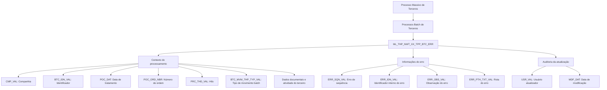

# REVISAR Proceso Masivo de Terceros — Visión Técnica do Modelo de Dados de Erros Batch

## 1. Metadados do Documento
- **Arquivo de Origem:** `Não identificado no conteúdo extraído`
- **Tipo de Documento:** `Especificação Técnica`
- **Domínio / Sistema:** `Reef / Mapfre / Processo Massivo de Terceros`
- **Público-Alvo:** `Desenvolvedores, Arquitetos, Operação`
- **Data/Versão Identificada:** `Não identificada`

---

## 2. Resumo Executivo & Contexto de Negócio

O documento apresenta uma visão técnica do modelo de dados associado ao processo massivo de terceiros. O foco explícito é a tabela `ML_THP_NWT_XX_TPP_BTC_ERR`, identificada como a tabela de caixa postal de erros para processos batch de terceiros.

A estrutura documentada registra informações de contexto do processamento batch, incluindo companhia, identificador, data de tratamento, número de ordem do processo, hilo, tipo de movimento batch e dados documentais do terceiro. Esses atributos permitem associar um erro ao contexto operacional em que ocorreu.

A tabela também concentra atributos específicos de erro, como sequência, identificador interno, observação e rota onde o erro acontece. Adicionalmente, existem campos de auditoria para usuário responsável pela atualização da linha e data de modificação.

O conteúdo está associado à documentação Reef e apresenta referências a Mapfre e ao proprietário `user:agonzalez_mapfre.com`. O material extraído não descreve fluxos executáveis, métodos HTTP, contratos de integração, regras de retenção, mecanismos de correção ou processos de consulta à tabela.

---

## 3. Arquitetura, Componentes & Tecnologias Envolvidas

| Componente / Termo | Classificação | Descrição sustentada pelo documento |
| :--- | :--- | :--- |
| `ML_THP_NWT_XX_TPP_BTC_ERR` | Tabela | Tabela de caixa postal de erros dos processos batch de terceiros. |
| Processo Masivo de Terceros | Processo | Processo tratado pela visão técnica apresentada. |
| Processos Batch Terceros | Contexto de processamento | Processos batch de terceiros cujos erros são registrados na tabela. |
| Reef | Documentação / domínio citado | Referência presente como “DOCUMENTACIÓN Reef”. |
| Mapfre | Organização / domínio citado | Referência presente no conteúdo como “Mapfredocument”. |
| `user:agonzalez_mapfre.com` | Owner | Proprietário identificado no conteúdo extraído. |



> **Nota de Análise:** O documento identifica a tabela de erros e seus campos, mas não detalha componentes de aplicação, tecnologias de banco de dados, integrações, interfaces, APIs ou contratos JSON.

---

## 4. Regras de Negócio, Especificações Funcionais & Processos

1. A operação analisada é denominada `Proceso Masivo de Terceros`.
2. A tabela envolvida na operação é `ML_THP_NWT_XX_TPP_BTC_ERR`.
3. A tabela `ML_THP_NWT_XX_TPP_BTC_ERR` é descrita como tabela de caixa postal de erros de processos batch de terceiros.
4. Todos os campos listados no conteúdo extraído possuem indicação `SI` na coluna `OBLIGATORIA`; portanto, todos são apresentados como obrigatórios.
5. Todos os campos listados possuem valor `N.A.` na coluna `MOTIVO/VALOR`.
6. Os campos documentados são marcados com `S` na coluna `CAMBIA VALOR`; o documento não explica o significado operacional da marcação `S`.
7. O contexto de processamento deve ser registrado por meio de companhia, identificador, data de tratamento, número de ordem do processo, hilo e tipo de movimento batch.
8. A identificação do terceiro no registro de erro deve incluir tipo de documento, documento e atividade do terceiro.
9. A caracterização do erro deve incluir erro de sequência, identificador interno, observação e rota em que o erro ocorre.
10. A auditoria da atualização da linha deve incluir usuário que atualizou a linha e data de modificação.

> **Nota de Análise:** O material não descreve regras de validação dos valores, tipos físicos das colunas, chaves primárias, chaves estrangeiras, índices, códigos de erro permitidos nem o procedimento de tratamento ou reprocessamento dos erros.

---

## 5. Tabelas de Parâmetros, Ambientes e Estruturas de Dados

| Item / Parâmetro | Descrição / Função | Tipo / Valores / Formato | Ambiente / Observações |
| :--- | :--- | :--- | :--- |
| `ML_THP_NWT_XX_TPP_BTC_ERR` | Tabela de caixa postal de erros de processos batch de terceiros. | Tabela. | Associada ao processo massivo de terceiros. |
| `CMP_VAL` | Companhia. | `CAMBIA VALOR: S`; `MOTIVO/VALOR: N.A.`; obrigatório: `SI`. | Campo obrigatório. |
| `BTC_IDN_VAL` | Identificador. | `CAMBIA VALOR: S`; `MOTIVO/VALOR: N.A.`; obrigatório: `SI`. | Campo obrigatório. |
| `POC_DAT` | Data de tratamento. | `CAMBIA VALOR: S`; `MOTIVO/VALOR: N.A.`; obrigatório: `SI`. | Campo obrigatório. |
| `POC_ORD_NBR` | Número de ordem do processo. | `CAMBIA VALOR: S`; `MOTIVO/VALOR: N.A.`; obrigatório: `SI`. | Campo obrigatório. |
| `PRC_THD_VAL` | Hilo. | `CAMBIA VALOR: S`; `MOTIVO/VALOR: N.A.`; obrigatório: `SI`. | Campo obrigatório. O documento não define “hilo”. |
| `BTC_MVM_THP_TYP_VAL` | Tipo de movimento batch. | `CAMBIA VALOR: S`; `MOTIVO/VALOR: N.A.`; obrigatório: `SI`. | Campo obrigatório. |
| `THP_DCM_TYP_VAL` | Tipo do documento do terceiro. | `CAMBIA VALOR: S`; `MOTIVO/VALOR: N.A.`; obrigatório: `SI`. | Campo obrigatório. |
| `THP_DCM_VAL` | Documento do terceiro. | `CAMBIA VALOR: S`; `MOTIVO/VALOR: N.A.`; obrigatório: `SI`. | Campo obrigatório. |
| `THP_ACV_VAL` | Atividade do terceiro. | `CAMBIA VALOR: S`; `MOTIVO/VALOR: N.A.`; obrigatório: `SI`. | Campo obrigatório. |
| `ERR_SQN_VAL` | Erro de sequência. | `CAMBIA VALOR: S`; `MOTIVO/VALOR: N.A.`; obrigatório: `SI`. | Campo obrigatório. |
| `ERR_IDN_VAL` | Identificador interno do erro. | `CAMBIA VALOR: S`; `MOTIVO/VALOR: N.A.`; obrigatório: `SI`. | Campo obrigatório. |
| `ERR_OBS_VAL` | Observação do erro. | `CAMBIA VALOR: S`; `MOTIVO/VALOR: N.A.`; obrigatório: `SI`. | Campo obrigatório. |
| `ERR_PTH_TXT_VAL` | Rota em que ocorre o erro. | `CAMBIA VALOR: S`; `MOTIVO/VALOR: N.A.`; obrigatório: `SI`. | Campo obrigatório. |
| `USR_VAL` | Usuário que atualizou a linha. | `CAMBIA VALOR: S`; `MOTIVO/VALOR: N.A.`; obrigatório: `SI`. | Campo de auditoria obrigatório. |
| `MDF_DAT` | Data de modificação. | `CAMBIA VALOR: S`; `MOTIVO/VALOR: N.A.`; obrigatório: `SI`. | Campo de auditoria obrigatório. |

---

## 6. Bateria de Perguntas & Respostas para RAG (FAQ Sintético)

### P1: Qual tabela registra os erros do processo massivo de terceiros?
**R:** A tabela identificada no documento é `ML_THP_NWT_XX_TPP_BTC_ERR`. Ela é descrita como a tabela de caixa postal de erros dos processos batch de terceiros.

### P2: Quais campos identificam o contexto do processamento batch com erro?
**R:** O contexto de processamento é composto por `CMP_VAL` para companhia, `BTC_IDN_VAL` para identificador, `POC_DAT` para data de tratamento, `POC_ORD_NBR` para número de ordem do processo, `PRC_THD_VAL` para hilo e `BTC_MVM_THP_TYP_VAL` para tipo de movimento batch.

### P3: Como o terceiro relacionado ao erro é identificado na tabela?
**R:** O terceiro é caracterizado pelos campos `THP_DCM_TYP_VAL`, correspondente ao tipo do documento do terceiro; `THP_DCM_VAL`, correspondente ao documento do terceiro; e `THP_ACV_VAL`, correspondente à atividade do terceiro.

### P4: Quais informações de erro são armazenadas em `ML_THP_NWT_XX_TPP_BTC_ERR`?
**R:** A tabela armazena `ERR_SQN_VAL` para erro de sequência, `ERR_IDN_VAL` para identificador interno do erro, `ERR_OBS_VAL` para observação do erro e `ERR_PTH_TXT_VAL` para a rota em que o erro acontece.

### P5: Qual campo informa a rota onde ocorreu um erro?
**R:** O campo `ERR_PTH_TXT_VAL` registra a “RUTA EN LA QUE SUCEDE EL ERROR”, isto é, a rota em que ocorre o erro.

### P6: Quais campos realizam a auditoria da atualização de uma linha de erro?
**R:** O campo `USR_VAL` identifica o usuário que atualizou a linha, enquanto `MDF_DAT` registra a data de modificação.

### P7: Os campos documentados da tabela são obrigatórios?
**R:** Sim. Todos os campos apresentados no conteúdo extraído possuem a marcação `SI` na coluna `OBLIGATORIA`.

### P8: O documento informa os tipos físicos ou formatos técnicos dos campos da tabela?
**R:** Não. O documento informa o nome e a descrição funcional dos campos, além das marcações `S`, `N.A.` e `SI`, mas não apresenta tipos físicos, tamanhos, formatos de data, domínios de valores ou definições DDL.

### P9: O documento detalha como corrigir ou reprocessar erros batch de terceiros?
**R:** Não. O conteúdo limita-se à identificação da tabela e à descrição de suas colunas. Não há procedimento de correção, reprocessamento, escalonamento ou encerramento de erros.

### P10: Quem é identificado como proprietário da documentação?
**R:** O conteúdo extraído apresenta `user:agonzalez_mapfre.com` no campo `Owner`.

---

## 7. Glossário de Termos, Siglas & Conceitos-Chave

- **BTC:** Sigla presente nos nomes `BTC_IDN_VAL` e `BTC_MVM_THP_TYP_VAL`; o documento não expande a sigla.
- **CMP:** Sigla presente em `CMP_VAL`; o campo é descrito como companhia.
- **DCM:** Sigla presente nos campos documentais do terceiro; o documento não expande a sigla.
- **ERR:** Prefixo associado aos campos de erro, incluindo sequência, identificador, observação e rota.
- **MDF:** Prefixo presente em `MDF_DAT`; o campo é descrito como data de modificação.
- **POC:** Prefixo presente em `POC_DAT` e `POC_ORD_NBR`; os campos representam data de tratamento e número de ordem do processo.
- **PRC:** Prefixo presente em `PRC_THD_VAL`; o campo é descrito como hilo.
- **THP:** Prefixo presente nos campos relacionados ao terceiro; o documento não expande a sigla.
- **USR:** Prefixo presente em `USR_VAL`; o campo é descrito como usuário que atualizou a linha.
- **Hilo:** Termo usado na descrição de `PRC_THD_VAL`; não possui definição adicional no conteúdo.
- **Proceso Masivo de Terceros:** Processo massivo de terceiros ao qual a tabela de erros está vinculada.
- **Processos Batch Terceros:** Processos batch de terceiros para os quais a tabela atua como caixa postal de erros.

---

## 8. Notas Críticas, Riscos & Limitações

- O conteúdo é limitado ao modelo de dados de uma única tabela de erros.
- Não foram identificados tipos físicos, comprimentos, nulabilidade técnica, chaves, relacionamentos, índices ou definições SQL.
- A marcação `S` na coluna `CAMBIA VALOR` não é explicada pelo documento.
- A marcação `N.A.` na coluna `MOTIVO/VALOR` não recebe detalhamento adicional.
- Não há descrição de ambientes, URLs, servidores, rotas de acesso, credenciais ou políticas de segurança.
- Não há processo documentado para consulta, resolução, reprocessamento, exclusão ou arquivamento de erros.
- Não há detalhamento sobre o significado das siglas técnicas nos nomes das colunas.
- Não há diagrama original, contratos de integração ou documentação de APIs associadas ao processo.

---

## 9. Conteúdo Bruto Estruturado (Referência Fiel)

```text
--- [PÁGINA 1 DE 2] ---

REVISAR Proceso Masivo de Terceros (Visión Técnica)
Modelo de datos involucrado
La tabla que interviene en esta operación es:
TABLA DESCRIPCIÓN
ML_THP_NWT_XX_TPP_BTC_ERR TABLA BUZON ERRORES PROCESOS BATCH TERCEROS
COLUMNA CAMBIA VALOR MOTIVO/VALOR OBLIGATORIA COMENTARIO
CMP_VAL S N.A. SI COMPANIA
BTC_IDN_VAL S N.A. SI IDENTIFICADOR
POC_DAT S N.A. SI FECHA DE TRATAMIENTO
POC_ORD_NBR S N.A. SI NUMERO DE ORDEN DE PROCESO
PRC_THD_VAL S N.A. SI HILO
BTC_MVM_THP_TYP_VAL S N.A. SI TIPO DE MOVIMIENTO BATCH
THP_DCM_TYP_VAL S N.A. SI TIPO DEL DOCUMENTO DEL TERCERO
THP_DCM_VAL S N.A. SI DOCUMENTO DEL TERCERO
THP_ACV_VAL S N.A. SI ACTIVIDAD TERCERO
ERR_SQN_VAL S N.A. SI ERROR DE SECUENCIA
ERR_IDN_VAL S N.A. SI IDENTIFICADOR INTERNO DEL ERROR
ERR_OBS_VAL S N.A. SI OBSERVACION ERROR
Documentation / DOCUMENTACIÓN Reef
DOCUMENTACIÓN Reef
Mapfredocument
DOCUMENTACIÓN Reef
Owner
user:agonzalez_mapfre.com
Lifecycle
Approved Source
 /
VL
Buscar Inicio Soluciones Arquitecturas APIs Componentes Cloud Documentación Zeus Reef Ayuda
ES


--- [PÁGINA 2 DE 2] ---

COLUMNA CAMBIA VALOR MOTIVO/VALOR OBLIGATORIA COMENTARIO
ERR_PTH_TXT_VAL S N.A. SI RUTA EN LA QUE SUCEDE EL ERROR
USR_VAL S N.A. SI USUARIO QUE ACTUALIZO LA FILA
MDF_DAT S N.A. SI FECHA MODIFICACION
```
