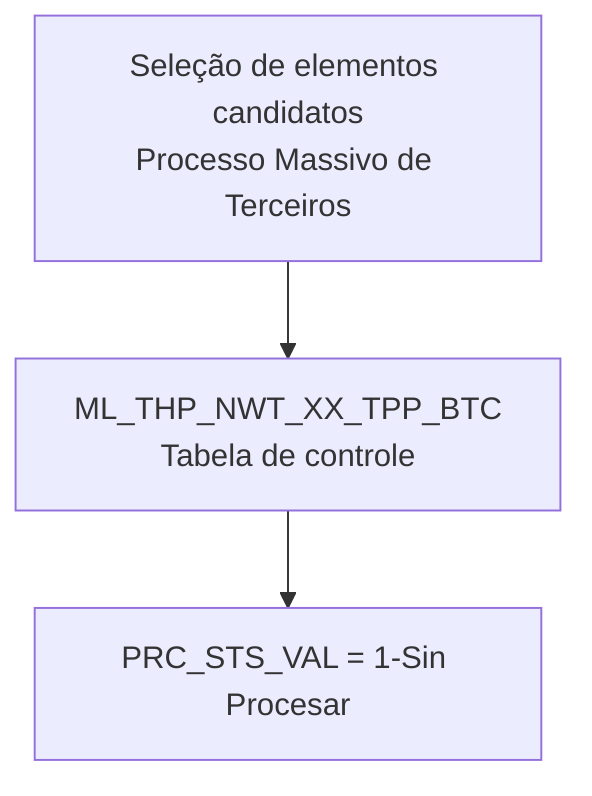

# Seleção de Elementos Candidatos do Processo Massivo de Terceiros — Visão Técnica

## 1. Metadados do Documento
- **Arquivo de Origem:** Não identificado no conteúdo fornecido
- **Tipo de Documento:** Especificação Técnica
- **Domínio / Sistema:** Reef / Processo Massivo de Terceiros
- **Público-Alvo:** Desenvolvedores, Arquitetos, Operação
- **Data/Versão Identificada:** Não identificada

---

## 2. Resumo Executivo & Contexto de Negócio

O documento descreve a visão técnica da operação de seleção de elementos candidatos do **Processo Massivo de Terceiros**. O conteúdo identifica a tabela de controle utilizada pela operação e relaciona os campos obrigatórios associados ao processamento.

A tabela citada é `ML_THP_NWT_XX_TPP_BTC`, descrita como **Tabela Control Procesos Masivos Terceros**. Os campos apresentados abrangem identificação de companhia, terceiro, documento, atividade, ordem de processo, hilo, tipo de movimento batch, estado do processo, usuário e data de modificação.

O campo `PRC_STS_VAL` possui uma regra explícita: deve assumir o valor **`1-Sin Procesar`**, caracterizando a situação inicial do processo como não processada.

O conteúdo fornecido não detalha métodos HTTP, contratos de integração, arquitetura de microsserviços, regras de seleção dos candidatos, processamento posterior, responsáveis técnicos, mecanismos de atualização ou tratamento de erros.

---

## 3. Arquitetura, Componentes & Tecnologias Envolvidas

O documento referencia os seguintes elementos:

| Componente / Tecnologia | Descrição sustentada pelo documento |
| :--- | :--- |
| Reef | Contexto documental indicado como “Documentation / DOCUMENTACIÓN Reef”. |
| Processo Massivo de Terceiros | Processo técnico no qual ocorre a seleção de elementos candidatos. |
| `ML_THP_NWT_XX_TPP_BTC` | Tabela de controle de processos massivos de terceiros. |
| Mapfre | Referência visual presente no conteúdo extraído. |
| Zeus | Referência presente no menu de navegação da documentação. |

O documento não apresenta uma arquitetura de camadas, integração entre sistemas, APIs, microsserviços ou fluxo de dados completo. A relação explicitamente identificada é entre a operação de seleção e a tabela de controle `ML_THP_NWT_XX_TPP_BTC`.



> **Nota de Análise:** O diagrama representa somente a relação mínima sustentada pelo conteúdo: a operação utiliza a tabela de controle e a tabela possui o estado de processo `1-Sin Procesar`. O documento não detalha as etapas posteriores do fluxo.

---

## 4. Regras de Negócio, Especificações Funcionais & Processos

### Operação descrita
A operação é denominada **“Seleccionar Elementos Candidatos del Proceso Masivo de Terceros”** e é apresentada sob a perspectiva técnica.

### Modelo de dados envolvido
A operação utiliza a tabela `ML_THP_NWT_XX_TPP_BTC`, identificada como tabela de controle de processos massivos de terceiros.

### Regra de estado do processo
- O campo `PRC_STS_VAL` deve receber o valor **`1-Sin Procesar`**.
- O comentário associado ao campo `PRC_STS_VAL` é **“Situación del Proceso”**.
- O campo `PRC_STS_VAL` está marcado como obrigatório.

### Obrigatoriedade dos campos
Todos os campos listados no conteúdo fornecido estão marcados como obrigatórios com o valor `SI` na coluna **OBLIGATORIA**.

> **Nota de Análise:** A coluna “CAMBIA VALOR” contém `S` para os campos listados, mas o documento não define o significado de `S`. A coluna “MOTIVO/VALOR” contém `N.A.` para a maior parte dos campos; também não há definição explícita dessa sigla no conteúdo.

---

## 5. Tabelas de Parâmetros, Ambientes e Estruturas de Dados

### Tabela de controle do processo massivo de terceiros

| Item / Parâmetro | Descrição / Função | Tipo / Valores / Formato | Ambiente / Observações |
| :--- | :--- | :--- | :--- |
| `ML_THP_NWT_XX_TPP_BTC` | Tabela de controle de processos massivos de terceiros. | Tabela de dados. | Associada à operação de seleção de elementos candidatos. |

### Campos da tabela `ML_THP_NWT_XX_TPP_BTC`

| Item / Parâmetro | Descrição / Função | Tipo / Valores / Formato | Ambiente / Observações |
| :--- | :--- | :--- | :--- |
| `CMP_VAL` | Compañía. | Campo marcado com `S`; motivo/valor `N.A.` | Obrigatório: `SI`. |
| `BTC_IDN_VAL` | Identificador. | Campo marcado com `S`; motivo/valor `N.A.` | Obrigatório: `SI`. |
| `POC_DAT` | Fecha de tratamiento. | Campo marcado com `S`; motivo/valor `N.A.` | Obrigatório: `SI`. |
| `POC_ORD_NBR` | Número de orden de proceso. | Campo marcado com `S`; motivo/valor `N.A.` | Obrigatório: `SI`. |
| `PRC_THD_VAL` | Hilo. | Campo marcado com `S`; motivo/valor `N.A.` | Obrigatório: `SI`. |
| `BTC_MVM_THP_TYP_VAL` | Tipo de movimiento batch. | Campo marcado com `S`; motivo/valor `N.A.` | Obrigatório: `SI`. |
| `THP_DCM_TYP_VAL` | Tipo del documento del tercero. | Campo marcado com `S`; motivo/valor `N.A.` | Obrigatório: `SI`. |
| `THP_DCM_VAL` | Documento del tercero. | Campo marcado com `S`; motivo/valor `N.A.` | Obrigatório: `SI`. |
| `THP_ACV_VAL` | Actividad tercero. | Campo marcado com `S`; motivo/valor `N.A.` | Obrigatório: `SI`. |
| `PRC_STS_VAL` | Situación del proceso. | Valor indicado: `1-Sin Procesar`; campo marcado com `S`. | Obrigatório: `SI`. |
| `USR_VAL` | Usuario que actualizó la fila. | Campo marcado com `S`; motivo/valor `N.A.` | Obrigatório: `SI`. |
| `MDF_DAT` | Fecha modificación. | Campo marcado com `S`; motivo/valor `N.A.` | Obrigatório: `SI`. |

### Ambientes, URLs e rotas de logs

| Item / Parâmetro | Descrição / Função | Tipo / Valores / Formato | Ambiente / Observações |
| :--- | :--- | :--- | :--- |
| Ambientes | Não detalhados. | Não informado. | O documento não apresenta URLs, servidores ou nomes de ambientes. |
| Rotas de logs | Não detalhadas. | Não informado. | O documento não apresenta caminhos, arquivos ou configurações de log. |
| APIs e endpoints | Não detalhados. | Não informado. | O documento não apresenta métodos HTTP, URLs ou contratos JSON. |

---

## 6. Bateria de Perguntas & Respostas para RAG (FAQ Sintético)

### P1: Qual tabela é utilizada na seleção de elementos candidatos do Processo Massivo de Terceiros?
**R:** A tabela utilizada é `ML_THP_NWT_XX_TPP_BTC`, descrita como a tabela de controle de processos massivos de terceiros.

### P2: Qual é o estado inicial indicado para o campo `PRC_STS_VAL`?
**R:** O campo `PRC_STS_VAL` deve receber o valor `1-Sin Procesar`, que representa a situação do processo como não processada.

### P3: O campo `PRC_STS_VAL` é obrigatório?
**R:** Sim. O documento marca `PRC_STS_VAL` como obrigatório com o valor `SI` na coluna “OBLIGATORIA”.

### P4: Qual campo representa a companhia na tabela de controle de processos massivos de terceiros?
**R:** O campo `CMP_VAL` representa a companhia, conforme o comentário “COMPANIA” apresentado no documento.

### P5: Qual campo identifica o terceiro no processo massivo?
**R:** O campo `BTC_IDN_VAL` é descrito como “IDENTIFICADOR”. O documento não especifica se esse identificador corresponde exclusivamente ao terceiro ou a outro elemento do processo.

### P6: Quais campos representam o documento do terceiro?
**R:** `THP_DCM_TYP_VAL` representa o tipo de documento do terceiro, e `THP_DCM_VAL` representa o documento do terceiro.

### P7: Qual campo registra a atividade do terceiro?
**R:** O campo `THP_ACV_VAL` registra a atividade do terceiro, conforme a descrição “ACTIVIDAD TERCERO”.

### P8: Qual campo registra o número de ordem do processo?
**R:** O campo `POC_ORD_NBR` registra o número de ordem do processo, conforme a descrição “NUMERO DE ORDEN DE PROCESO”.

### P9: Qual campo está relacionado ao tipo de movimento batch?
**R:** O campo `BTC_MVM_THP_TYP_VAL` é descrito como “TIPO DE MOVIMIENTO BATCH”.

### P10: Quais campos registram auditoria de atualização da linha?
**R:** `USR_VAL` registra o usuário que atualizou a linha, e `MDF_DAT` registra a data de modificação.

### P11: O documento define APIs, métodos HTTP ou contratos JSON para o Processo Massivo de Terceiros?
**R:** Não. O conteúdo fornecido não detalha APIs, métodos HTTP, endpoints, contratos JSON ou integrações entre serviços.

### P12: O documento informa o significado do valor `S` na coluna “CAMBIA VALOR”?
**R:** Não. O valor `S` aparece para os campos listados, mas o documento não fornece sua definição.

---

## 7. Glossário de Termos, Siglas & Conceitos-Chave

- **BTC:** Sigla presente em `BTC_IDN_VAL` e `BTC_MVM_THP_TYP_VAL`; o documento não expande seu significado.
- **CMP:** Sigla presente em `CMP_VAL`; relacionada à companhia pelo comentário “COMPANIA”.
- **MDF:** Sigla presente em `MDF_DAT`; associada à data de modificação pelo comentário “FECHA MODIFICACION”.
- **N.A.:** Valor apresentado na coluna “MOTIVO/VALOR”; o documento não define seu significado.
- **POC:** Sigla presente em `POC_DAT` e `POC_ORD_NBR`; relacionada à data de tratamento e ao número de ordem de processo, respectivamente.
- **PRC:** Sigla presente em `PRC_THD_VAL` e `PRC_STS_VAL`; relacionada a hilo e situação do processo, respectivamente.
- **Reef:** Contexto de documentação mencionado no conteúdo.
- **THP:** Sigla presente em campos relacionados a documento e atividade do terceiro; o documento não expande seu significado.
- **USR:** Sigla presente em `USR_VAL`; relacionada ao usuário que atualizou a linha.

---

## 8. Notas Críticas, Riscos & Limitações

- O documento não informa o nome do arquivo de origem, data, versão, autor técnico ou histórico de alterações.
- O documento não define os tipos físicos dos campos, como texto, número, data, tamanho ou precisão.
- O documento não explica o significado do indicador `S` presente na coluna “CAMBIA VALOR”.
- O documento não define o significado de `N.A.` na coluna “MOTIVO/VALOR”.
- O documento não descreve a lógica para selecionar candidatos, critérios de elegibilidade, filtros, ordenação ou exclusão de registros.
- O documento não informa transições posteriores ao estado `1-Sin Procesar`.
- O documento não apresenta URLs, ambientes, servidores, rotas de logs, procedimentos de monitoramento, regras de retentativa ou tratamento de falhas.
- O documento não detalha integrações, métodos HTTP, contratos JSON, microsserviços ou dependências externas.

---

## 9. Conteúdo Bruto Estruturado (Referência Fiel)

```text
--- [PÁGINA 1 DE 2] ---

SELECCIONAR ELEMENTOS CANDIDATOS del Proceso Masivo de
Terceros (Visión Técnica)
Modelo de datos involucrado
La tabla que interviene en esta operación es:
TABLA DESCRIPCIÓN
ML_THP_NWT_XX_TPP_BTC TABLA CONTROL PROCESOS MASIVOS TERCEROS
COLUMNA CAMBIA
VALOR
MOTIVO/VALOR OBLIGATORIA COMENTARIO
CMP_VAL S N.A. SI COMPANIA
BTC_IDN_VAL S N.A. SI IDENTIFICADOR
POC_DAT S N.A. SI FECHA DE TRATAMIENTO
POC_ORD_NBR S N.A. SI NUMERO DE ORDEN DE
PROCESO
PRC_THD_VAL S N.A. SI HILO
BTC_MVM_THP_TYP_VAL S N.A. SI TIPO DE MOVIMIENTO BATCH
THP_DCM_TYP_VAL S N.A. SI TIPO DEL DOCUMENTO DEL
TERCERO
THP_DCM_VAL S N.A. SI DOCUMENTO DEL TERCERO
THP_ACV_VAL S N.A. SI ACTIVIDAD TERCERO
PRC_STS_VAL S Toma el valor 1-Sin
Procesar
SI SITUACION DEL PROCESO
Documentation / DOCUMENTACIÓN Reef
DOCUMENTACIÓN Reef
Mapfredocument
DOCUMENTACIÓN Reef
Owner
user:agonzalez_mapfre.com
Lifecycle
Approved Source
 /
VL
Buscar Inicio Soluciones Arquitecturas APIs Componentes Cloud Documentación Zeus Reef Ayuda
ES


--- [PÁGINA 2 DE 2] ---

COLUMNA CAMBIA
VALOR
MOTIVO/VALOR OBLIGATORIA COMENTARIO
USR_VAL S N.A. SI USUARIO QUE ACTUALIZO LA
FILA
MDF_DAT S N.A. SI FECHA MODIFICACION
```
