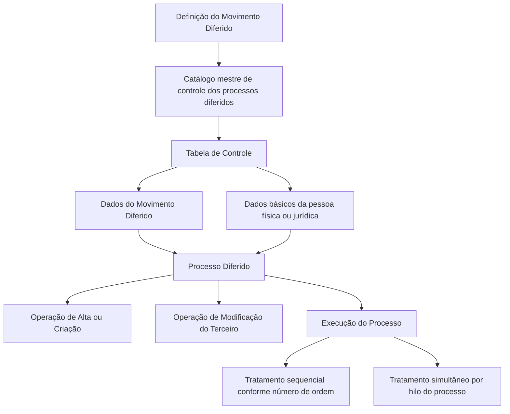
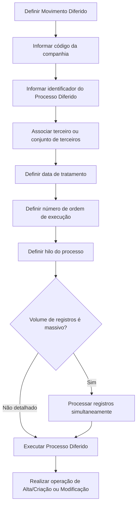

# Processo Massivo de Terceiros — Processo Diferido

## 1. Metadados do Documento
- **Arquivo de Origem:** Não identificado no conteúdo extraído
- **Tipo de Documento:** Especificação Técnica
- **Domínio / Sistema:** Módulo de Terceiros / DOCUMENTACIÓN Reef / Mapfredocument
- **Público-Alvo:** Desenvolvedores, Arquitetos, Operação
- **Data/Versão Identificada:** Não identificada

---

## 2. Resumo Executivo & Contexto de Negócio

O documento descreve a criação de um processo massivo de terceiros por meio de um **Processo Diferido** no Módulo de Terceiros. O objetivo declarado é registrar, no catálogo mestre de controle dos processos diferidos, as informações específicas que identificam um Movimento Diferido.

A tabela de controle não é dedicada exclusivamente ao Movimento Diferido. Além dos dados de controle do processo, a tabela contém informações básicas para identificar a pessoa física ou jurídica que será submetida a uma das operações diferidas disponíveis no Módulo de Terceiros.

As duas operações diferidas explicitamente citadas são: **Alta ou Criação** e **Modificação do Terceiro**. A criação do Movimento Diferido exige atributos relacionados à companhia, identificação do processo, data de tratamento, ordem de execução e hilo do processo.

O documento destaca uma necessidade operacional para cenários de grande volume: o processamento simultâneo por meio de diferentes hilos do processo. Essa execução paralela visa reduzir a janela de tempo necessária para executar o Processo Diferido.

---

## 3. Arquitetura, Componentes & Tecnologias Envolvidas

### Componentes identificados

| Componente | Papel identificado no documento |
| :--- | :--- |
| Módulo de Terceiros | Módulo que disponibiliza operações diferidas para criação e modificação de terceiros. |
| Catálogo mestre de controle dos processos diferidos | Estrutura que registra informações específicas do Movimento Diferido e dados básicos de identificação de pessoas físicas ou jurídicas. |
| Tabela de Controle | Tabela que contém informações do Movimento Diferido e dados básicos da pessoa física ou jurídica tratada. |
| Processo Diferido | Processo que identifica e trata um terceiro ou conjunto de terceiros em sua execução. |
| Movimento Diferido | Entidade cuja criação é registrada no catálogo mestre de controle. |
| DOCUMENTACIÓN Reef | Contexto documental citado no conteúdo extraído. |
| Mapfredocument | Termo exibido no conteúdo extraído. |



**Nota de Análise:** O documento não detalha tecnologias de implementação, métodos HTTP, contratos JSON, banco de dados, endpoints, filas, protocolos de integração ou ambientes técnicos.

---

## 4. Regras de Negócio, Especificações Funcionais & Processos

### Objetivo funcional

O processo deve registrar no catálogo mestre de controle dos processos diferidos do Módulo de Terceiros a informação específica que identifica o Movimento Diferido.

### Escopo da Tabela de Controle

A Tabela de Controle possui escopo ampliado. Ela não armazena somente informações do Movimento Diferido, pois também inclui dados básicos que identificam a pessoa física ou jurídica para a qual será realizada uma operação diferida no Módulo de Terceiros.

### Operações diferidas disponíveis

1. **Operação de Alta ou Criação**
   - Aplicável à criação de terceiros.
2. **Operação de Modificação do Terceiro**
   - Aplicável à alteração de dados de terceiros existentes.

### Atributos associados à criação do Movimento Diferido

1. **Compañía**
   - Indica o código da companhia sobre a qual está sendo definida a movimentação diferida de Terceiros.

2. **Identificador Proceso**
   - Indica o código do Processo Diferido.
   - O Processo Diferido identifica o terceiro ou conjunto de terceiros que será tratado durante a execução do processo.

3. **Fecha Tratamiento del Proceso**
   - Contém a data na qual é realizada a execução do Processo Diferido.

4. **Número de Orden del Proceso**
   - Determina a ordem em que a operação deve ser executada no sistema.

5. **Hilo del Proceso**
   - Contém o código do hilo do processo no qual o registro será executado.
   - Em cenários de volume massivo de registros, o Processo Diferido pode ser processado simultaneamente.
   - O processamento simultâneo é utilizado para reduzir a janela de tempo de execução.

### Fluxo funcional reconstruído



**Nota de Análise:** O documento não informa critérios de validação dos campos, obrigatoriedade, tipos de dados, valores permitidos, tratamento de erros, regras de reprocessamento ou mecanismos de monitoramento da execução.

---

## 5. Tabelas de Parâmetros, Ambientes e Estruturas de Dados

| Item / Parâmetro | Descrição / Função | Tipo / Valores / Formato | Ambiente / Observações |
| :--- | :--- | :--- | :--- |
| Compañía | Código da companhia na qual é definida a movimentação diferida de Terceiros. | Código de companhia; formato não detalhado. | Aplicável à definição do Movimento Diferido. |
| Identificador Proceso | Código do Processo Diferido que identifica o terceiro ou conjunto de terceiros a tratar. | Código de processo; formato não detalhado. | Utilizado durante a execução do Processo Diferido. |
| Fecha Tratamiento del Proceso | Data na qual ocorre a execução do Processo Diferido. | Data; formato não detalhado. | Relacionada ao momento de tratamento do processo. |
| Número de Orden del Proceso | Define a ordem de execução da operação no sistema. | Número de ordem; formato não detalhado. | Controla a sequência de execução. |
| Hilo del Proceso | Código do hilo no qual o registro será executado. | Código de hilo; formato não detalhado. | Pode suportar processamento simultâneo em cenários massivos. |
| Operação de Alta ou Criação | Operação diferida disponível para criar um terceiro. | Operação funcional. | Disponível no Módulo de Terceiros. |
| Operação de Modificação do Terceiro | Operação diferida disponível para modificar um terceiro. | Operação funcional. | Disponível no Módulo de Terceiros. |
| Pessoa física ou jurídica | Entidade identificada na Tabela de Controle para realização de operação diferida. | Entidade de negócio. | Dados básicos são armazenados na Tabela de Controle. |

---

## 6. Bateria de Perguntas & Respostas para RAG (FAQ Sintético)

### P1: Qual é o objetivo do processo massivo de terceiros com Processo Diferido?
**R:** O objetivo é registrar, no catálogo mestre de controle dos processos diferidos do Módulo de Terceiros, as informações específicas que identificam o Movimento Diferido.

### P2: A Tabela de Controle contém somente dados do Movimento Diferido?
**R:** Não. A Tabela de Controle contém informações do Movimento Diferido e dados básicos que identificam a pessoa física ou jurídica para a qual será realizada uma operação diferida no Módulo de Terceiros.

### P3: Quais operações diferidas estão disponíveis no Módulo de Terceiros?
**R:** O documento cita duas operações diferidas: a Operação de Alta ou Criação e a Operação de Modificação do Terceiro.

### P4: Qual é a função do atributo Compañía?
**R:** O atributo Compañía informa ao sistema o código da companhia sobre a qual está sendo realizada a definição do Movimento Diferido de Terceiros.

### P5: O que o Identificador Proceso representa?
**R:** O Identificador Proceso representa o código do Processo Diferido que identificará o terceiro ou conjunto de terceiros a ser tratado durante a execução do processo.

### P6: Para que serve a Fecha Tratamiento del Proceso?
**R:** A Fecha Tratamiento del Proceso contém a data na qual será realizada a execução do Processo Diferido.

### P7: Como o Número de Orden del Proceso influencia o tratamento?
**R:** O Número de Orden del Proceso determina a ordem em que a operação deve ser executada no sistema.

### P8: O que é o Hilo del Proceso no contexto do Processo Diferido?
**R:** O Hilo del Proceso é o código do hilo no qual o registro será executado. Esse atributo permite identificar a execução do registro dentro de um hilo específico do processo.

### P9: Por que o Processo Diferido pode utilizar processamento simultâneo?
**R:** Quando o volume de registros a tratar é massivo, o Processo Diferido pode precisar ser processado simultaneamente para reduzir a janela de tempo de execução.

### P10: O documento informa métodos HTTP ou contratos JSON para o Processo Diferido?
**R:** Não. O documento não detalha métodos HTTP, contratos JSON, endpoints, tecnologias de implementação ou interfaces de integração.

---

## 7. Glossário de Termos, Siglas & Conceitos-Chave

- **Alta ou Criação:** Operação diferida disponível no Módulo de Terceiros para criar um terceiro.
- **Catálogo mestre de controle:** Estrutura onde são registradas informações específicas que identificam o Movimento Diferido.
- **Compañía:** Código da companhia sobre a qual é definida a movimentação diferida de Terceiros.
- **Fecha Tratamiento del Proceso:** Data de execução do Processo Diferido.
- **Hilo del Proceso:** Código do hilo no qual será executado um registro do processo.
- **Identificador Proceso:** Código do Processo Diferido que identifica o terceiro ou conjunto de terceiros a ser tratado.
- **Movimento Diferido:** Movimento cuja informação identificadora é registrada no catálogo mestre de controle.
- **Número de Orden del Proceso:** Atributo que determina a ordem de execução de uma operação no sistema.
- **Processo Diferido:** Processo utilizado para tratar um terceiro ou conjunto de terceiros no Módulo de Terceiros.
- **Tabela de Controle:** Tabela que reúne informações do Movimento Diferido e dados básicos da pessoa física ou jurídica.
- **Terceiro:** Pessoa física ou jurídica que será submetida a uma operação diferida de criação ou modificação.

---

## 8. Notas Críticas, Riscos & Limitações

- O conteúdo não informa o nome do arquivo de origem, data, versão ou autoria técnica do documento.
- O documento não especifica formatos, tipos de dados, domínio de valores, obrigatoriedade ou validações dos atributos descritos.
- Não foram identificados detalhes sobre persistência, banco de dados, integrações, APIs, endpoints ou contratos de mensagem.
- Não há detalhamento sobre tratamento de erros, reprocessamento, idempotência, concorrência ou monitoramento da execução paralela.
- O processamento simultâneo por hilo é mencionado como recurso para volume massivo, mas o documento não define a quantidade de hilos, estratégia de distribuição ou controles de consistência.
- Não há definição de ambientes, URLs, rotas de logs, servidores ou credenciais.
- **Nota de Análise:** O documento lista o Módulo de Terceiros e o Processo Diferido, porém não detalha os contratos técnicos ou as interfaces expostas.

---

## 9. Conteúdo Bruto Estruturado (Referência Fiel)

```text
--- [PÁGINA 1 DE 1] ---

CREAR Proceso Masivo de Terceros - Proceso Diferido (enlace con
visión técnica)
Objetivo
Registrar en el catálogo maestro de control de los procesos diferidos del Módulo de Terceros la información especíca que identica el
Movimiento Diferido.
IMPORTANTE: La tabla de Control no contiene solamente información del Movimiento Diferido puesto que además, incluye los datos básicos
que identican a la persona física o jurídica para la que se va a realizar una de las dos operaciones diferidas disponibles para el Módulo de
Terceros:
Operación de Alta o Creación, y
Operación de Modicación del Tercero.
Los atributos que concretamente corresponden a la Creación del Movimiento Diferido en este catálogo maestro son ...
Compañía
Esta propiedad le indica al sistema el código de la compañía sobre la que se está realizando la denición del movimiento diferido de
Terceros.
Identicador Proceso
Esta propiedad le indica al sistema el código del Proceso Diferido que identicará al Tercero o conjunto de Terceros que se van a tratar en la
ejecución del Proceso.
Fecha Tratamiento del Proceso
Este Atributo contiene la Fecha en la que se realiza la Ejecución del Proceso Diferido.
Número de Orden del Proceso
Esta propiedad determina el orden en el que se se debe ejecutar la operación en el sistema.
Hilo del Proceso
Este Atributo contiene el código del hilo del Proceso en el que se va a ejecutar el registro puesto que en ocasiones, normalmente cuando el
volumen de registros a tratar es masivo, la ejecución del proceso diferido necesita ser procesado de manera simultánea para acortar la
ventana de tiempo de su ejecución.
Documentation / DOCUMENTACIÓN Reef
DOCUMENTACIÓN Reef
Mapfredocument
DOCUMENTACIÓN Reef
Owner
user:agonzalez_mapfre.com
Lifecycle
Approved Source
 /
VL
Buscar Inicio Soluciones Arquitecturas APIs Componentes Cloud Documentación Zeus Reef Ayuda
ES
```
