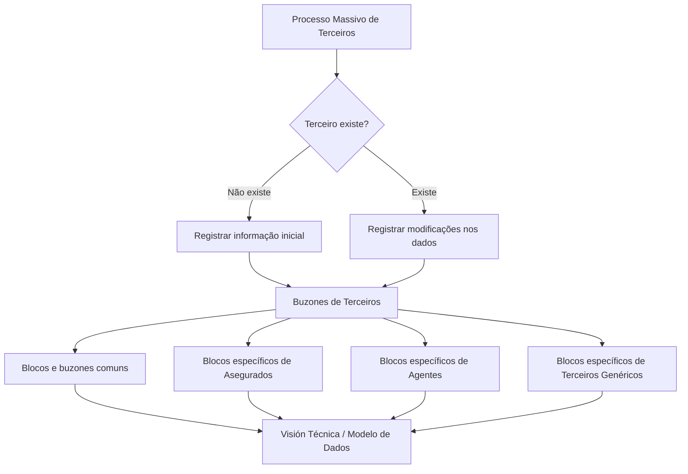

# Processo Massivo de Terceiros — Blocos e Buzones de Informação no Reef

## 1. Metadados do Documento
- **Arquivo de Origem:** Não identificado no conteúdo extraído
- **Tipo de Documento:** Especificação Técnica / Procedimento funcional
- **Domínio / Sistema:** Reef / Processo Massivo de Terceiros
- **Público-Alvo:** Não identificado; conteúdo direcionado a usuários técnicos e funcionais que criam ou modificam Terceiros
- **Data/Versão Identificada:** Não identificada

---

## 2. Resumo Executivo & Contexto de Negócio

O documento descreve o processo de detalhamento de alterações para **Terceros Candidatos** no contexto do **Proceso Masivo de Terceros**. O processo registra, nos Buzones de Terceros, a informação inicial de um Terceiro ou modificações nos dados de um Terceiro existente.

A finalidade declarada é identificar quais blocos e buzones de informação devem ou podem ser utilizados ao criar ou modificar um Terceiro no sistema. O documento organiza esses blocos entre informações comuns a múltiplas atividades e informações específicas por atividade de Terceiro.

A principal regra de qualidade de dados é a necessidade de coerência total entre os buzones e seus atributos. Como exemplos, o documento estabelece que um Terceiro indicado como inabilitado deve possuir o código da causa de inabilitação e que um Asegurado com Obrigações Fiscais deve possuir informações no bloco correspondente.

As tabelas apresentadas no material relacionam operações de detalhamento a referências de “Visión Técnica”, destinadas ao modelo de dados dos buzones. Entretanto, o conteúdo extraído não traz os links, contratos de dados, atributos específicos, formatos, métodos HTTP ou estruturas técnicas dessas referências.

---

## 3. Arquitetura, Componentes & Tecnologias Envolvidas

| Componente / Termo | Papel identificado no documento |
| :--- | :--- |
| Reef | Sistema ou domínio documental referido como “DOCUMENTACIÓN Reef”. |
| Proceso Masivo de Terceros | Processo para registrar informações iniciais ou alterações de Terceiros. |
| Terceros Candidatos | Entidades tratadas pelo processo de criação ou modificação. |
| Buzones de Terceros | Estruturas que armazenam informações iniciais ou alterações de dados de Terceiros. |
| Bloques de Información | Agrupamentos funcionais de informação dos buzones. |
| Visión Técnica | Referência para o modelo de dados das estruturas de informação. |
| Mapfredocument | Termo exibido na navegação/documentação; sem detalhamento adicional. |
| Zeus | Termo exibido na navegação/documentação; sem detalhamento adicional. |



> **Nota de Análise:** O documento não detalha componentes de infraestrutura, APIs, protocolos, bancos de dados, tecnologias de implementação, ambientes ou integrações externas.

---

## 4. Regras de Negócio, Especificações Funcionais & Processos

### 4.1 Finalidade do processo

1. Registrar informação inicial de um Terceiro nos Buzones de Terceros quando o Terceiro não existir.
2. Registrar modificações nos dados de um Terceiro nos Buzones de Terceros quando o Terceiro já existir.
3. Identificar os blocos e buzones disponíveis ou aplicáveis à criação e à modificação de Terceiros no sistema.
4. Consultar a “Visión Técnica” associada a cada operação para acessar o modelo de dados da estrutura correspondente.

### 4.2 Regra obrigatória de coerência entre buzones e atributos

O documento determina que deve haver **total coerência** entre os buzones e os atributos que os buzones contêm.

| Condição declarada | Informação obrigatória correlata |
| :--- | :--- |
| Um Terceiro está indicado como inabilitado. | Deve ser indicado o código da causa de inabilitação. |
| Um Asegurado possui Obrigações Fiscais. | Deve ser contemplada a informação no bloco correspondente de Obrigações Fiscais. |

### 4.3 Classificação dos blocos de informação

Os buzones são organizados nas seguintes categorias:

1. **Blocos e Buzones de Información — Comunes para distintas Actividades de Terceros.**
2. **Blocos e Buzones de Información Específicos para la Actividad [1] — Asegurados.**
3. **Blocos e Buzones de Información Específicos para la Actividad [2] — Agentes.**
4. **Blocos e Buzones de Información Específicos para las Actividades de Terceros Genéricos.**

> **Nota de Análise:** O material enumera operações de detalhamento, mas não descreve os campos internos, as validações completas, as regras de obrigatoriedade por atributo, os fluxos de aprovação ou os contratos de integração de cada buzón.

---

## 5. Tabelas de Parâmetros, Ambientes e Estruturas de Dados

### 5.1 Operações comuns para distintas atividades de Terceiros

| Item / Parâmetro | Descrição / Função | Tipo / Valores / Formato | Ambiente / Observações |
| :--- | :--- | :--- | :--- |
| Detallar Datos Básicos del Tercero | Detalhar dados básicos do Terceiro. | Operação / Buzón | Possui referência para “Acceder a Visión Técnica”. |
| Detallar Datos Identificativos | Detalhar dados identificativos do Terceiro. | Operação / Buzón | Possui referência para “Acceder a Visión Técnica”. |
| Detallar Obligaciones Fiscales | Detalhar obrigações fiscais. | Operação / Buzón | Deve ser contemplado quando um Asegurado possui Obrigações Fiscais. |
| Detallar Datos Personas Políticamente Expuestas | Detalhar dados de Pessoas Politicamente Expostas. | Operação / Buzón | Possui referência para “Acceder a Visión Técnica”. |
| Detallar Contactos del Tercero | Detalhar contatos do Terceiro. | Operação / Buzón | Possui referência para “Acceder a Visión Técnica”. |
| Detallar Direcciones del Tercero | Detalhar endereços do Terceiro. | Operação / Buzón | Possui referência para “Acceder a Visión Técnica”. |
| Detallar Documentos Alternativos | Detalhar documentos alternativos. | Operação / Buzón | Possui referência para “Acceder a Visión Técnica”. |
| Detallar Representantes Legales | Detalhar representantes legais. | Operação / Buzón | Possui referência para “Acceder a Visión Técnica”. |
| Detallar Accionistas | Detalhar acionistas. | Operação / Buzón | Possui referência para “Acceder a Visión Técnica”. |
| Detallar Datos Bancarios | Detalhar dados bancários. | Operação / Buzón | Possui referência para “Acceder a Visión Técnica”. |

### 5.2 Operações específicas para a atividade [1] — Asegurados

| Item / Parâmetro | Descrição / Função | Tipo / Valores / Formato | Ambiente / Observações |
| :--- | :--- | :--- | :--- |
| Detallar Información del Asegurado | Detalhar informações do Asegurado. | Operação / Buzón | Específico da atividade Asegurados. |
| Detallar Consentimientos del Tercero | Detalhar consentimentos do Terceiro. | Operação / Buzón | Específico da atividade Asegurados. |
| Detallar Datos Asegurado No Deseado | Detalhar dados de Asegurado Não Desejado. | Operação / Buzón | Específico da atividade Asegurados. |
| Detallar Perfil Analítico del Tercero | Detalhar perfil analítico do Terceiro. | Operação / Buzón | Específico da atividade Asegurados. |
| Detallar Datos Licencia o Permiso de Conducción | Detalhar dados de licença ou permissão de condução. | Operação / Buzón | Específico da atividade Asegurados. |

### 5.3 Operações específicas para a atividade [2] — Agentes

| Item / Parâmetro | Descrição / Função | Tipo / Valores / Formato | Ambiente / Observações |
| :--- | :--- | :--- | :--- |
| Detallar Información del Agente | Detalhar informações do Agente. | Operação / Buzón | Específico da atividade Agentes. |

### 5.4 Operações específicas para Terceiros Genéricos

| Item / Parâmetro | Descrição / Função | Tipo / Valores / Formato | Ambiente / Observações |
| :--- | :--- | :--- | :--- |
| Detallar Información de los Terceros Genéricos | Detalhar informações dos Terceiros Genéricos. | Operação / Buzón | Possui referência para “Acceder a Visión Técnica”. |

---

## 6. Bateria de Perguntas & Respostas para RAG (FAQ Sintético)

### P1: Qual é o objetivo do Processo Massivo de Terceiros?
**R:** O objetivo é registrar, nos Buzones de Terceros, a informação inicial de um Terceiro quando ele não existe ou as modificações em seus dados quando ele já existe. O processo também permite identificar quais blocos e buzones podem ser usados na criação ou alteração de um Terceiro.

### P2: O que deve ocorrer quando um Terceiro ainda não existe?
**R:** Quando o Terceiro não existe, o processo registra a informação inicial do Terceiro nos Buzones de Terceros.

### P3: O que deve ocorrer quando um Terceiro já existe no sistema?
**R:** Quando o Terceiro existe, o processo registra as modificações nos dados do Terceiro nos Buzones de Terceros.

### P4: Qual regra deve ser seguida ao indicar que um Terceiro está inabilitado?
**R:** Deve existir total coerência entre buzones e atributos. Se um Terceiro for indicado como inabilitado, deve ser informado também o código da causa de inabilitação.

### P5: Onde devem ser informadas as Obrigações Fiscais de um Asegurado?
**R:** Se um Asegurado tiver Obrigações Fiscais, a informação deve ser contemplada no bloco correspondente de Obrigações Fiscais.

### P6: Quais operações comuns estão disponíveis para dados de Terceiros?
**R:** As operações comuns incluem dados básicos, dados identificativos, obrigações fiscais, dados de Pessoas Politicamente Expostas, contatos, endereços, documentos alternativos, representantes legais, acionistas e dados bancários.

### P7: Quais buzones são específicos da atividade de Asegurados?
**R:** A atividade de Asegurados possui operações para informação do Asegurado, consentimentos do Terceiro, dados de Asegurado Não Desejado, perfil analítico do Terceiro e dados de licença ou permissão de condução.

### P8: Existe uma operação específica para Agentes?
**R:** Sim. A atividade [2] — Agentes possui a operação “Detallar Información del Agente”, associada ao detalhamento das informações do Agente.

### P9: Onde consultar o modelo de dados dos buzones?
**R:** As tabelas do documento possuem referências “Acceder a Visión Técnica”, indicadas como acesso ao modelo de dados dos buzones e às respectivas estruturas de informação. Os conteúdos dessas referências não estão presentes no texto extraído.

### P10: O documento especifica métodos HTTP, contratos JSON ou campos técnicos dos buzones?
**R:** Não. O documento lista operações e menciona acesso à Visión Técnica, mas não detalha métodos HTTP, contratos JSON, nomes de atributos, formatos de campos ou regras técnicas por estrutura.

---

## 7. Glossário de Termos, Siglas & Conceitos-Chave

- **Asegurado:** Atividade [1] de Terceiro para a qual existem blocos e buzones específicos.
- **Agente:** Atividade [2] de Terceiro para a qual existe a operação “Detallar Información del Agente”.
- **Buzón:** Estrutura de informação do Terceiro utilizada para registrar informação inicial ou modificações de dados.
- **Bloque de Información:** Agrupamento de informações ou buzones associados a uma finalidade funcional.
- **Obligaciones Fiscales:** Bloco destinado às obrigações fiscais; deve ser contemplado quando um Asegurado possuir essas obrigações.
- **Persona Políticamente Expuesta:** Categoria para a qual existe a operação “Detallar Datos Personas Políticamente Expuestas”.
- **Proceso Masivo de Terceros:** Processo de registro inicial ou de alteração dos dados de Terceiros.
- **Reef:** Sistema ou domínio de documentação identificado como “DOCUMENTACIÓN Reef”.
- **Tercero:** Entidade cujas informações podem ser criadas ou modificadas no processo.
- **Tercero Candidato:** Terceiro tratado no contexto de detalhamento de alterações do processo massivo.
- **Terceros Genéricos:** Categoria de Terceiros com operação específica de detalhamento de informações.
- **Visión Técnica:** Referência ao modelo de dados dos buzones e das estruturas de informação.

---

## 8. Notas Críticas, Riscos & Limitações

- A coerência entre buzones e atributos é uma exigência explícita. Dados sem informações correlatas podem gerar inconsistência funcional.
- O documento não disponibiliza os links efetivos para as referências “Acceder a Visión Técnica”.
- Não há detalhamento de atributos, tipos de dados, campos obrigatórios, códigos permitidos ou validações técnicas internas dos buzones.
- Não há informações sobre APIs, métodos HTTP, contratos JSON, mensageria, banco de dados, autenticação ou mecanismos de integração.
- Não são informados ambientes, URLs, servidores, versões, responsáveis técnicos, fluxo de aprovação ou tratamento de erros.
- Os termos “Mapfredocument” e “Zeus” aparecem na navegação, mas não possuem explicação funcional ou técnica adicional no conteúdo extraído.

---

## 9. Conteúdo Bruto Estruturado (Referência Fiel)

```text
--- [PÁGINA 1 DE 2] ---

DETALLAR Cambios en los Terceros Candidatos - Proceso Masivo de
Terceros
¿En que consiste?
Registrar en los Buzones de Terceros la información inicial del Tercero o las modicaciones en los datos del Tercero que serán de aplicación
en los casos que el Tercero no exista o exista respectivamente.
Objetivo
Conocer qué bloques y buzones de información se tienen o pueden contemplar al crear o modicar un Tercero en el Sistema.
IMPORTANTE: Tiene que existir una total coherencia en los buzones y en los atributos que estos contienen. Por ejemplo: Si se indica que un
Tercero está inhabilitado se debe indicar el código de la causa de inhabilitación, en cambio si se indica que un Asegurado tiene Obligaciones
Fiscales debería contemplarse su información en el Bloque correspondiente, ... y así sucesivamente.
La Tablas que se muestran a continuación cuentan con enlaces a las Operaciones de Creación en línea y al Modelo de datos de los Buzones
que contienen la información del Tercero en sus respectivas estructuras.
Bloques y Buzones de Información - COMUNES para distintas Actividades de Terceros
OPERACIÓN BUZONES - MODELO DE DATOS
Detallar Datos Básicos del Tercero Acceder a Visión Técnica
Detallar Datos Identicativos Acceder a Visión Técnica
Detallar Obligaciones Fiscales Acceder a Visión Técnica
Detallar Datos Personas Políticamente Expuestas Acceder a Visión Técnica
Detallar Contactos del Tercero Acceder a Visión Técnica
Detallar Direcciones del Tercero Acceder a Visión Técnica
Detallar Documentos Alternativos Acceder a Visión Técnica
Detallar Representantes Legales Acceder a Visión Técnica
Documentation / DOCUMENTACIÓN Reef
DOCUMENTACIÓN Reef
Mapfredocument
DOCUMENTACIÓN Reef
Owner
user:agonzalez_mapfre.com
Lifecycle
Approved Source
 /
VL
Buscar Inicio Soluciones Arquitecturas APIs Componentes Cloud Documentación Zeus Reef Ayuda
ES


--- [PÁGINA 2 DE 2] ---

OPERACIÓN BUZONES - MODELO DE DATOS
Detallar Accionistas Acceder a Visión Técnica
Detallar Datos Bancarios Acceder a Visión Técnica
Bloques y Buzones de Información Especícos para la Actividad [1] - Asegurados
OPERACIÓN BUZONES - MODELO DE DATOS
Detallar Información del Asegurado Acceder a Visión Técnica
Detallar Consentimientos del Tercero Acceder a Visión Técnica
Detallar Datos Asegurado No Deseado Acceder a Visión Técnica
Detallar Perl Analítico del Tercero Acceder a Visión Técnica
Detallar Datos Licencia o Permiso de Conducción Acceder a Visión Técnica
Bloques y Buzones de Información Especícos para la Actividad [2] - Agentes
OPERACIÓN BUZONES - MODELO DE DATOS
Detallar Información del Agente Acceder a Visión Técnica
Bloques y Buzones de Información Especícos para las Actividades de Terceros Genéricos
OPERACIÓN BUZONES - MODELO DE DATOS
Detallar Información de los Terceros Genéricos. Acceder a Visión Técnica
Checking links...
```
