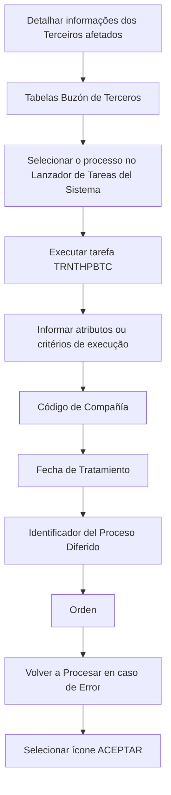

# Procedimento para Executar Processo Massivo de Terceiros no Reef.core

## 1. Metadados do Documento
- **Arquivo de Origem:** Não identificado no conteúdo fornecido
- **Tipo de Documento:** Procedimento
- **Domínio / Sistema:** Reef.core — módulo de Terceiros
- **Público-Alvo:** Operação e usuários responsáveis pela execução de processos no módulo de Terceiros
- **Data/Versão Identificada:** Não identificada

---

## 2. Resumo Executivo & Contexto de Negócio

O documento descreve o procedimento para executar um processo massivo de Terceiros no sistema Reef.core. O objetivo explicitamente apresentado é conhecer o procedimento necessário para realizar essa execução.

O processo é caracterizado como um **Processo Diferido**. A execução ocorre após o detalhamento das informações dos Terceiros afetados nas diferentes Tabelas Buzón de Terceros.

A execução do Processo Diferido é realizada por meio do Lanzador de Tareas del Sistema. Para o módulo de Terceiros, a tarefa indicada é `TRNTHPBTC`, que requer o preenchimento de atributos ou critérios de execução.

O conteúdo informa que a ordem de captura dos atributos deve ser observada da esquerda para a direita e de cima para baixo. Após o preenchimento dos campos, o procedimento é concluído ao selecionar o ícone **ACEPTAR**.

> **Nota de Análise:** O documento não detalha os critérios de elegibilidade dos Terceiros, o conteúdo das Tabelas Buzón de Terceros, o comportamento interno da tarefa `TRNTHPBTC`, nem o tratamento operacional posterior a uma execução com falha.

---

## 3. Arquitetura, Componentes & Tecnologias Envolvidas

Os elementos identificados no procedimento são:

| Componente / Elemento | Papel identificado no documento |
| :--- | :--- |
| Reef.core | Sistema no qual o processo massivo de Terceiros é executado. |
| Módulo de Terceiros | Módulo cujos Processos Diferidos são executados. |
| Tabelas Buzón de Terceros | Tabelas nas quais são detalhadas as informações dos Terceiros afetados antes da execução. |
| Lanzador de Tareas del Sistema | Mecanismo utilizado para executar o processo definido. |
| `TRNTHPBTC` | Tarefa utilizada para executar os Processos Diferidos do módulo de Terceiros. |
| Ícone `ACEPTAR` | Ação final indicada para confirmar a execução após o preenchimento dos atributos. |



> **Nota de Análise:** O documento fornece um fluxo procedimental, mas não apresenta arquitetura técnica de integração, protocolos, endpoints, bancos de dados, contratos de serviço ou ambientes de execução.

---

## 4. Regras de Negócio, Especificações Funcionais & Processos

### Processo para execução diferida de Terceiros

1. Detalhar as informações dos Terceiros afetados nas diferentes **Tablas Buzón de Terceros**.
2. Executar o processo definido por meio do **Lanzador de Tareas del Sistema**.
3. Utilizar a tarefa `TRNTHPBTC`, identificada como a tarefa de execução dos Processos Diferidos do módulo de Terceiros.
4. Informar os atributos ou critérios de execução requeridos pela tarefa.
5. Respeitar a ordem de captura dos atributos: da esquerda para a direita e de cima para baixo.
6. Preencher os campos listados:
   - Código de Compañía;
   - Fecha de Tratamiento;
   - Identificador del Proceso Diferido;
   - Orden;
   - Volver a Procesar en caso de Error.
7. Selecionar o ícone **ACEPTAR** como última ação do procedimento.

### Regras e restrições explicitamente identificadas

| Regra / Restrição | Descrição |
| :--- | :--- |
| Pré-condição para execução | As informações dos Terceiros afetados devem estar detalhadas nas Tabelas Buzón de Terceros. |
| Mecanismo de execução | O processo definido deve ser executado pelo Lanzador de Tareas del Sistema. |
| Tarefa aplicável | Os Processos Diferidos do módulo de Terceiros são executados com a tarefa `TRNTHPBTC`. |
| Ordem de preenchimento | Os atributos devem ser capturados da esquerda para a direita e de cima para baixo. |
| Confirmação | Ao final do preenchimento, deve-se selecionar o ícone `ACEPTAR`. |
| Reprocessamento | Existe um campo denominado `Volver a Procesar en caso de Error`; o documento não especifica seus valores válidos nem o comportamento resultante. |

---

## 5. Tabelas de Parâmetros, Ambientes e Estruturas de Dados

| Item / Parâmetro | Descrição / Função | Tipo / Valores / Formato | Ambiente / Observações |
| :--- | :--- | :--- | :--- |
| Código de Compañía | Campo de atributo ou critério de execução da tarefa `TRNTHPBTC`. | Não especificado | O texto apresenta “Código de Compañía” duas vezes; não esclarece se é rótulo repetido ou dois campos distintos. |
| Fecha de Tratamiento | Campo de atributo ou critério de execução da tarefa `TRNTHPBTC`. | Não especificado | O texto apresenta “Fecha de Tratamiento” duas vezes; não esclarece se é rótulo repetido ou dois campos distintos. |
| Identificador del Proceso Diferido | Campo para identificação do Processo Diferido. | Não especificado | O termo aparece com caractere de codificação corrompido no conteúdo bruto: `Identicador`. |
| Orden | Campo de atributo ou critério de execução. | Não especificado | Não há definição de ordem, faixa ou valores permitidos. |
| Volver a Procesar en caso de Error | Campo relacionado ao reprocessamento quando ocorre erro. | Não especificado | O documento não informa se o valor é booleano, opcional ou obrigatório. |
| `TRNTHPBTC` | Tarefa para execução dos Processos Diferidos do módulo de Terceiros. | Identificador de tarefa | Executada por meio do Lanzador de Tareas del Sistema. |
| Tabelas Buzón de Terceros | Estruturas que contêm as informações dos Terceiros afetados. | Não especificado | Devem ser detalhadas antes da execução. |
| `ACEPTAR` | Ícone para concluir ou confirmar a ação. | Ação de interface | Selecionado por último. |
| Idioma | Campo exibido no conteúdo. | Não especificado | Aparece três vezes na página 2, sem explicação adicional. |
| Usuario | Campo exibido no conteúdo. | Não especificado | Não há regra ou descrição adicional. |
| Clave de Usuario | Campo exibido no conteúdo. | Não especificado | Não há regra ou descrição adicional. |

---

## 6. Bateria de Perguntas & Respostas para RAG (FAQ Sintético)

### P1: Qual é o objetivo do procedimento documentado?
**R:** O objetivo é conhecer o procedimento necessário para executar um processo massivo de Terceiros no sistema Reef.core.

### P2: Qual sistema é utilizado para executar o processo massivo de Terceiros?
**R:** O processo massivo de Terceiros é executado no sistema Reef.core, no contexto do módulo de Terceiros.

### P3: O que deve ocorrer antes da execução do Processo Diferido?
**R:** Antes da execução, as informações dos Terceiros afetados devem ser detalhadas nas diferentes Tabelas Buzón de Terceros.

### P4: Por qual mecanismo o processo definido deve ser executado?
**R:** O processo definido deve ser executado por meio do Lanzador de Tareas del Sistema.

### P5: Qual tarefa executa os Processos Diferidos do módulo de Terceiros?
**R:** Os Processos Diferidos do módulo de Terceiros são executados com a tarefa `TRNTHPBTC`.

### P6: Qual é a ordem indicada para preencher os atributos da tarefa `TRNTHPBTC`?
**R:** Os atributos devem ser preenchidos da esquerda para a direita e de cima para baixo, conforme indicado no documento.

### P7: Quais atributos ou critérios de execução são mencionados para a tarefa `TRNTHPBTC`?
**R:** O documento menciona Código de Compañía, Fecha de Tratamiento, Identificador del Proceso Diferido, Orden e Volver a Procesar en caso de Error.

### P8: Como o processo é confirmado após o preenchimento dos campos?
**R:** Após o preenchimento dos atributos ou critérios de execução, o procedimento informa que deve ser selecionado o ícone `ACEPTAR`.

### P9: O documento informa quais valores devem ser usados para Código de Compañía?
**R:** Não. O documento apenas lista Código de Compañía como atributo de execução, sem definir formato, domínio de valores ou obrigatoriedade.

### P10: O documento explica como funciona o reprocessamento em caso de erro?
**R:** Não. O documento menciona o campo `Volver a Procesar en caso de Error`, mas não especifica valores possíveis, critérios para reprocessamento ou comportamento após uma falha.

### P11: O documento descreve os métodos, contratos ou integrações da tarefa `TRNTHPBTC`?
**R:** Não. O conteúdo somente identifica `TRNTHPBTC` como a tarefa utilizada para executar Processos Diferidos do módulo de Terceiros.

### P12: Há informações sobre ambientes, URLs, servidores ou rotas de logs?
**R:** Não. O conteúdo fornecido não apresenta URLs, ambientes, servidores, portas, rotas de logs ou parâmetros de infraestrutura.

---

## 7. Glossário de Termos, Siglas & Conceitos-Chave

- **Reef.core:** Sistema citado como o ambiente no qual é executado o processo massivo de Terceiros.
- **Terceiros:** Entidade de negócio afetada pelo processo massivo e pelos Processos Diferidos descritos.
- **Proceso Masivo de Terceros:** Processo massivo relacionado a Terceiros no Reef.core.
- **Proceso Diferido:** Processo cuja execução é realizada pela tarefa `TRNTHPBTC` no módulo de Terceiros.
- **Tablas Buzón de Terceros:** Tabelas nas quais devem ser detalhadas as informações dos Terceiros afetados antes da execução.
- **Lanzador de Tareas del Sistema:** Mecanismo do sistema utilizado para executar o processo definido.
- **TRNTHPBTC:** Identificador da tarefa usada para executar os Processos Diferidos do módulo de Terceiros.
- **ACEPTAR:** Ícone que deve ser selecionado ao final do procedimento.
- **Código de Compañía:** Atributo ou critério de execução listado para a tarefa.
- **Fecha de Tratamiento:** Atributo ou critério de execução listado para a tarefa.
- **Identificador del Proceso Diferido:** Atributo para identificação do Processo Diferido.
- **Orden:** Atributo ou critério de execução listado para a tarefa.
- **Volver a Procesar en caso de Error:** Campo relacionado ao reprocessamento após erro.

---

## 8. Notas Críticas, Riscos & Limitações

- O documento não informa o nome do arquivo de origem, data, versão, autor técnico ou histórico de alterações.
- Não há detalhamento funcional ou técnico das Tabelas Buzón de Terceros.
- Não são especificados formatos, tipos, valores válidos, obrigatoriedade ou regras de validação dos atributos da tarefa `TRNTHPBTC`.
- O campo `Volver a Procesar en caso de Error` é citado, porém o comportamento de reprocessamento não é descrito.
- Não há evidência de procedimentos de monitoramento, consulta de status, tratamento de falhas, rollback ou validação de resultados.
- Não são apresentados ambientes, URLs, servidores, credenciais, permissões, logs, integrações externas ou contratos de dados.
- O conteúdo contém sinais de extração ou codificação incompleta, incluindo `denido` e `Identicador`.
- Os campos `Idioma`, `Usuario` e `Clave de Usuario` aparecem na página 2, mas o documento não explica sua finalidade no processo.

---

## 9. Conteúdo Bruto Estruturado (Referência Fiel)

```text
--- [PÁGINA 1 DE 2] ---

EJECUTAR Proceso Masivo de Terceros
Objetivo
Conocer el procedimiento que se ha de realizar para ejecutar un proceso masivo de Terceros en Reef.core.
Ejecutar Proceso Diferido
Una vez se ha detallado la información de los Terceros afectados en las diferentes Tablas Buzón de Terceros, se tiene que ejecutar el proceso
denido mediante el Lanzador de Tareas del Sistema.
Los Procesos Diferidos del módulo de Terceros se ejecutan con la Tarea TRNTHPBTC, informando e ella los siguientes Atributos o criterios
de ejecución...
De izquierda a derecha y de arriba hacia abajo los siguientes campos marcan el orden de captura de los Atributos.
Código de Compañía
Código de Compañía
Fecha de Tratamiento
Fecha de Tratamiento.
#### Identicador del Proceso Diferido
Orden
Volver a Procesar en caso de Error
Documentation / DOCUMENTACIÓN Reef
DOCUMENTACIÓN Reef
Mapfredocument
DOCUMENTACIÓN Reef
Owner
user:agonzalez_mapfre.com
Lifecycle
Approved Source
 / 
 VL
Buscar Inicio Soluciones Arquitecturas APIs Componentes Cloud Documentación Zeus Reef Ayuda
ES


--- [PÁGINA 2 DE 2] ---

Idioma
Idioma
Idioma
Usuario
Clave de Usuario
... y por último, se pulsa el icono ACEPTAR.
```
