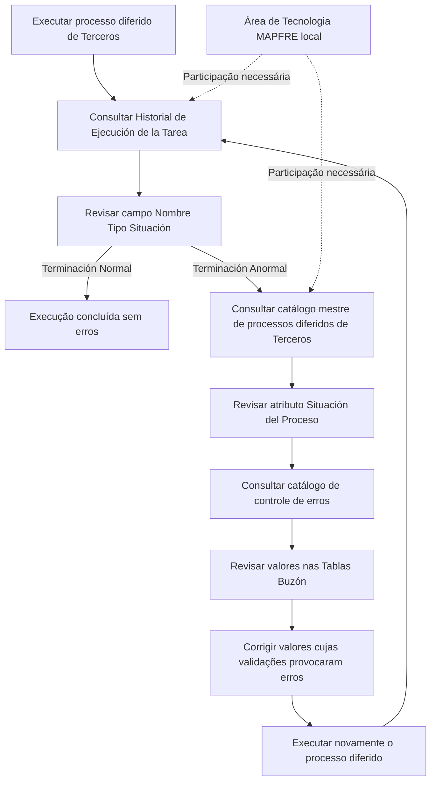

# Procedimento de Revisão da Execução Massiva de Terceiros — Processos Diferidos no Reef

## 1. Metadados do Documento
- **Arquivo de Origem:** `Não identificado no conteúdo fornecido`
- **Tipo de Documento:** `Procedimento`
- **Domínio / Sistema:** `Reef / Terceiros / MAPFRE`
- **Público-Alvo:** `Operação, Tecnologia e equipes locais MAPFRE`
- **Data/Versão Identificada:** `Não identificada`

---

## 2. Resumo Executivo & Contexto de Negócio

O conteúdo descreve o procedimento de revisão do resultado da execução de um processo diferido relacionado a **TERCEROS** no ambiente documental Reef. A verificação ocorre após a execução do processo diferido, por meio do **Historial de Ejecución de la Tarea**.

O principal critério operacional é o conteúdo do campo **Nombre Tipo Situación**. Quando a execução é concluída sem erros, o campo deve apresentar o valor **“Terminación Normal”**. Quando a execução apresenta falhas, o campo apresenta **“Terminación Anormal”**.

Em caso de terminação anormal, a análise deve continuar em dois pontos: o catálogo mestre de processos diferidos de Terceiros, para consultar o atributo **Situación del Proceso**, e o catálogo de controle de erros dos processos diferidos de Terceiros, para consultar o detalhe do erro.

A recuperação operacional exige revisar os valores informados nas **Tablas Buzón**, corrigindo os registros cujas validações tenham provocado erros. Após as correções, o processo diferido deve ser executado novamente, em aproximações sucessivas, até alcançar o resultado final esperado. O documento registra que a revisão do processo requer participação da área de Tecnologia da empresa MAPFRE local.

---

## 3. Arquitetura, Componentes & Tecnologias Envolvidas

Os componentes e repositórios de informação explicitamente citados são:

- Processo diferido de **Terceros**.
- Processo massivo de **TERCEROS**.
- **Historial de Ejecución de la Tarea**.
- Campo **Nombre Tipo Situación**.
- Catálogo mestre de processos diferidos de Terceros.
- Atributo **Situación del Proceso**.
- Catálogo de controle de erros dos processos diferidos de Terceros.
- **Tablas Buzón**.
- Área de Tecnologia da empresa **MAPFRE local**.
- Portal ou área documental **Reef / DOCUMENTACIÓN Reef**.



> **Nota de Análise:** O conteúdo não detalha a tecnologia de implementação, métodos HTTP, contratos JSON, banco de dados, endereços de ambiente, responsáveis específicos ou critérios técnicos de correção das validações nas Tablas Buzón.

---

## 4. Regras de Negócio, Especificações Funcionais & Processos

1. Após executar o processo diferido, deve-se comprovar o resultado da execução no **Historial de Ejecución de la Tarea**.
2. A comprovação deve revisar especificamente o conteúdo do campo **Nombre Tipo Situación**.
3. O valor **“Terminación Normal”** indica que a execução terminou sem erros.
4. O valor **“Terminación Anormal”** indica que a execução terminou com erros.
5. Quando houver **“Terminación Anormal”**, deve-se acessar o catálogo mestre de processos diferidos de Terceros.
6. No catálogo mestre, deve-se consultar o valor do atributo **Situación del Proceso**.
7. Também deve-se consultar o detalhe no catálogo de controle de erros dos processos diferidos de Terceros.
8. Os valores informados nas **Tablas Buzón** devem ser revisados.
9. Os valores cujas validações tenham provocado erros devem ser corrigidos.
10. Após as correções, o processo diferido deve ser executado novamente.
11. A reexecução deve ocorrer por aproximações sucessivas até que seja obtido o resultado final.
12. A revisão do processo, no estado descrito pelo documento, deve ocorrer com participação da área de Tecnologia da empresa MAPFRE local.

---

## 5. Tabelas de Parâmetros, Ambientes e Estruturas de Dados

| Item / Parâmetro | Descrição / Função | Tipo / Valores / Formato | Ambiente / Observações |
| :--- | :--- | :--- | :--- |
| Processo diferido de Terceros | Processo cuja execução deve ser revisada após processamento. | Não detalhado. | Associado ao domínio de Terceros. |
| Processo massivo TERCEROS | Processo mencionado no título do conteúdo bruto. | Não detalhado. | Não há detalhamento adicional. |
| Historial de Ejecución de la Tarea | Local de consulta do resultado da execução do processo diferido. | Histórico de execução. | Deve ser consultado após a execução. |
| Campo Nombre Tipo Situación | Campo usado para identificar a situação de término da execução. | “Terminación Normal” ou “Terminación Anormal”. | Deve ser revisado especificamente. |
| Terminación Normal | Resultado que indica execução concluída sem erros. | Valor do campo Nombre Tipo Situación. | Indica conclusão normal. |
| Terminación Anormal | Resultado que indica execução concluída com erros. | Valor do campo Nombre Tipo Situación. | Exige investigação e correção. |
| Catálogo mestre de processos diferidos de Terceros | Fonte para consultar a situação do processo após terminação anormal. | Catálogo. | Consultar o atributo Situación del Proceso. |
| Situación del Proceso | Atributo consultado no catálogo mestre de processos diferidos de Terceros. | Não detalhado. | Usado na análise de terminação anormal. |
| Catálogo de controle de erros | Fonte para consultar detalhes de erros de processos diferidos de Terceros. | Catálogo. | Deve ser consultado em caso de terminação anormal. |
| Tablas Buzón | Tabelas cujos valores devem ser revisados e eventualmente corrigidos. | Tabelas. | Corrigir valores associados a validações com erro. |
| Área de Tecnologia MAPFRE local | Área cuja participação é necessária para a revisão do processo. | Equipe organizacional. | Requisito registrado na nota do documento. |
| Reef | Contexto documental ou sistema mencionado no conteúdo. | Documentação. | O conteúdo apresenta referências a “DOCUMENTACIÓN Reef”. |

---

## 6. Bateria de Perguntas & Respostas para RAG (FAQ Sintético)

### P1: Onde deve ser verificado o resultado da execução de um processo diferido de Terceros?
**R:** O resultado deve ser verificado no **Historial de Ejecución de la Tarea**, após a execução do processo diferido.

### P2: Qual campo deve ser revisado no histórico de execução da tarefa?
**R:** Deve ser revisado especificamente o conteúdo do campo **Nombre Tipo Situación**.

### P3: O que significa o valor “Terminación Normal” no campo Nombre Tipo Situación?
**R:** O valor **“Terminación Normal”** indica que a execução do processo diferido terminou sem erros.

### P4: O que significa o valor “Terminación Anormal” no campo Nombre Tipo Situación?
**R:** O valor **“Terminación Anormal”** indica que a execução do processo diferido terminou com erros e exige análise complementar.

### P5: O que deve ser consultado quando o processo de Terceros apresenta “Terminación Anormal”?
**R:** Deve-se consultar o catálogo mestre de processos diferidos de Terceros para verificar o atributo **Situación del Proceso** e consultar o detalhe no catálogo de controle de erros dos processos diferidos de Terceros.

### P6: Qual atributo deve ser analisado no catálogo mestre de processos diferidos de Terceros?
**R:** O atributo que deve ser analisado é **Situación del Proceso**.

### P7: O que deve ser feito com os valores registrados nas Tablas Buzón após uma execução com erro?
**R:** Os valores informados nas **Tablas Buzón** devem ser revisados, e aqueles cujas validações tenham provocado erros devem ser corrigidos.

### P8: O processo diferido deve ser reexecutado após corrigir valores com erro nas Tablas Buzón?
**R:** Sim. Após corrigir os valores que provocaram erros de validação, o processo diferido deve ser executado novamente.

### P9: Como deve ocorrer a reexecução do processo diferido?
**R:** A reexecução deve ocorrer mediante aproximações sucessivas, até alcançar o resultado final.

### P10: Qual equipe deve participar da revisão do processo diferido de Terceros?
**R:** A revisão deve ser realizada com a participação da área de Tecnologia da empresa **MAPFRE local**.

### P11: O documento descreve os métodos, contratos ou interfaces técnicas do processo diferido?
**R:** Não. O conteúdo descreve o procedimento de verificação, análise de erro, correção de valores e reexecução, mas não detalha métodos HTTP, contratos JSON, integrações técnicas ou interfaces do processo.

---

## 7. Glossário de Termos, Siglas & Conceitos-Chave

- **TERCEROS / Terceros:** Domínio ou processo referido pelo conteúdo como objeto da execução massiva e dos processos diferidos.
- **Proceso Diferido:** Processo cuja execução é revisada após o processamento no histórico de tarefas.
- **Historial de Ejecución de la Tarea:** Local indicado para verificar o resultado de execução do processo diferido.
- **Nombre Tipo Situación:** Campo cujo conteúdo deve ser revisado para identificar a situação de término da execução.
- **Terminación Normal:** Valor que indica que a execução terminou sem erros.
- **Terminación Anormal:** Valor que indica que a execução terminou com erros.
- **Situación del Proceso:** Atributo que deve ser consultado no catálogo mestre de processos diferidos de Terceros.
- **Tablas Buzón:** Tabelas que contêm valores a serem revisados e corrigidos quando validações provocarem erros.
- **MAPFRE local:** Empresa ou unidade local cuja área de Tecnologia deve participar da revisão do processo.
- **Reef:** Nome mencionado nas referências de documentação do conteúdo bruto.

---

## 8. Notas Críticas, Riscos & Limitações

- A revisão do processo requer participação da área de Tecnologia da empresa MAPFRE local.
- Uma execução com **“Terminación Anormal”** exige investigação em mais de uma fonte: catálogo mestre de processos diferidos e catálogo de controle de erros.
- A correção de valores nas **Tablas Buzón** é necessária quando validações provocarem erros.
- A resolução pode exigir múltiplas reexecuções, pois o documento determina a execução por aproximações sucessivas.
- O conteúdo não informa os critérios de validação aplicados às Tablas Buzón.
- O conteúdo não descreve o formato dos erros, os campos das tabelas, o mecanismo de execução, as tecnologias utilizadas ou os responsáveis além da referência à área de Tecnologia MAPFRE local.
- A extração contém caracteres possivelmente corrompidos em palavras como `Especícamente` e `nal`; a redação estruturada preserva o significado contextual sem inferir conteúdo adicional.

---

## 9. Conteúdo Bruto Estruturado (Referência Fiel)

```text
--- [PÁGINA 1 DE 1] ---

REVISAR Ejecución del Masivo TERCEROS
Revisar el Resultado de la Ejecución del Proceso Diferido
Una vez ejecutado el proceso diferido, se tiene que comprobar el resultado de su ejecución en el Historial de Ejecución de la Tarea:
Especícamente revisar el contenido del Campo Nombre Tipo Situación.
Si la ejecución ha terminado sin errores su valor será “Terminación Normal”, mientras que en caso contrario mostrará “Terminación
Anormal". En este caso se debe acceder al catálogo maestro de procesos diferidos de Terceros para conocer el valor del Atributo Situación
del Proceso además del detalle en el catálogo de control de errores de los procesos diferidos de Terceros.
Se deberán revisar los valores informados en las Tablas Buzón y corregir aquellos cuyas validaciones hayan provocado errores.
Tras ello se tendrá que ejecutar nuevamente el proceso diferido para llegar a su resultado nal mediante la ejecución de aproximaciones
sucesivas.
NOTA: La revisión del Proceso, hoy por hoy, se tiene que realizar con la participación del área de Tecnología de la empresa MAPFRE local.
Documentation / DOCUMENTACIÓN Reef
DOCUMENTACIÓN Reef
Mapfredocument
DOCUMENTACIÓN Reef
Owner
user:agonzalez_mapfre.com
Lifecycle
Approved Source
 / 
 VL
Buscar Inicio Soluciones Arquitecturas APIs Componentes Cloud Documentación Zeus Reef Ayuda
ES
```
