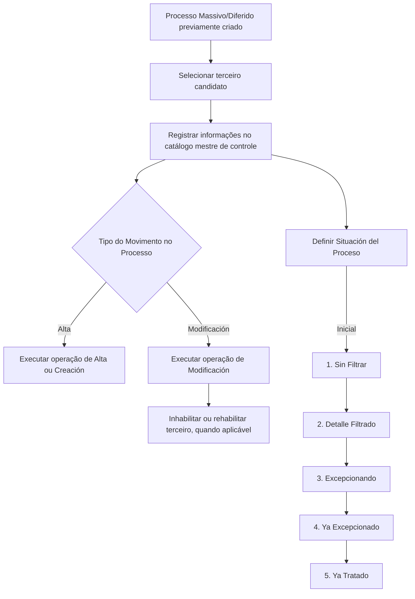

# Seleção de Terceiros Candidatos — Processo Massivo/Diferido do Módulo de Terceiros

## 1. Metadados do Documento
- **Arquivo de Origem:** Não identificado no conteúdo extraído
- **Tipo de Documento:** Especificação Técnica
- **Domínio / Sistema:** Módulo de Terceiros; Processos Massivos/Diferidos; DOCUMENTACIÓN Reef / Mapfre
- **Público-Alvo:** Não identificado explicitamente
- **Data/Versão Identificada:** Não identificada
- **Status documental identificado:** Lifecycle: `Approved Source`
- **Responsável identificado:** `user:agonzalez_mapfre.com`

---

## 2. Resumo Executivo & Contexto de Negócio

O documento descreve a funcionalidade de **seleção de terceiros candidatos** para um **Processo Massivo de Terceiros**. O objetivo declarado é registrar, no catálogo mestre de controle dos processos diferidos do Módulo de Terceiros, as informações que identificam pessoas físicas ou jurídicas que serão processadas posteriormente.

O Processo Massivo/Diferido suporta duas operações para cada terceiro candidato: **Alta ou Criação** e **Modificação do Terceiro**. A seleção de candidatos registra os atributos necessários para identificar o terceiro, determinar a operação a ser executada e acompanhar a situação de processamento dentro do fluxo massivo.

A operação é definida pelo atributo **Tipo do Movimento no Processo**, com os valores `Alta` e `Modificación`. O documento estabelece que ações específicas de **inhabilitar** ou **reabilitar** um terceiro devem ser implementadas como movimentos do tipo `Modificación`.

A execução do processo é acompanhada pelo atributo **Situación del Proceso**. Antes da execução do processo, a situação é inicialmente definida como `1. Sin Filtrar`. O documento apresenta ainda estados posteriores relacionados à filtragem, exceções e tratamento do terceiro candidato.

> **Nota de Análise:** O conteúdo extraído menciona um “enlace con visión técnica”, porém não apresenta a visão técnica, métodos HTTP, contratos de integração, persistência, componentes de software, URLs, tecnologias ou critérios de transição entre estados.

---

## 3. Arquitetura, Componentes & Tecnologias Envolvidas

### Componentes e conceitos identificados

| Componente / Conceito | Papel identificado no documento |
| :--- | :--- |
| Módulo de Terceiros | Módulo do sistema no qual existem processos diferidos e operações sobre terceiros. |
| Processo Massivo/Diferido | Processo previamente criado que executa operações sobre terceiros candidatos. |
| Catálogo mestre de controle | Local indicado para o registro das informações de identificação e controle dos processos diferidos. |
| Terceiro candidato | Pessoa física ou jurídica para a qual será executada uma operação no processo massivo. |
| Operação de Alta ou Creación | Operação disponível para criação de um terceiro. |
| Operação de Modificación | Operação disponível para alteração de informações de um terceiro; também cobre inabilitação e reabilitação. |
| DOCUMENTACIÓN Reef | Área ou repositório documental identificado no conteúdo bruto. |
| Mapfredocument | Termo exibido na navegação/documentação extraída. |
| Owner `user:agonzalez_mapfre.com` | Responsável documental identificado no texto. |

### Fluxo funcional identificado



> **Nota de Análise:** O diagrama representa somente relações e estados explicitamente citados. O documento não detalha se os estados `2` a `5` possuem transições obrigatórias, automáticas, manuais, condicionais ou reversíveis.

---

## 4. Regras de Negócio, Especificações Funcionais & Processos

### 4.1 Objetivo do processo

O processo registra no catálogo mestre de controle dos processos diferidos do Módulo de Terceiros a informação que identifica pessoas físicas ou jurídicas para as quais será realizada uma das operações disponíveis no sistema:

1. **Operação de Alta ou Creación**.
2. **Operação de Modificación del Tercero**.

### 4.2 Identificação do terceiro candidato

A seleção de terceiros candidatos contempla os seguintes dados de identificação:

1. **Tipo Documento Identificador del Tercero**  
   Identifica o tipo de documento identificador do terceiro.

2. **Clave del Documento Identificador del Tercero**  
   Contém a chave associada ao tipo de documento identificador do terceiro.

3. **Código de Actividad del Tercero**  
   Indica no sistema o código da atividade do terceiro.

### 4.3 Tipo do movimento no processo

O atributo **Tipo del Movimiento en el Proceso** especifica a operação que será realizada na execução do terceiro em relação às informações contempladas no movimento diferido.

Valores possíveis explicitamente informados:

- `Alta`
- `Modificación`

### 4.4 Regra para inabilitação e reabilitação

As modificações específicas destinadas a:

- inabilitar um terceiro; ou
- reabilitar um terceiro

devem ser implementadas sob o tipo de movimento:

- `Modificación`

### 4.5 Situação do processo

O atributo **Situación del Proceso** indica o estado da execução da operação definida para o terceiro candidato dentro do Processo Massivo.

Antes da execução do processo, a situação inicial é:

- `1. Sin Filtrar`

Estados listados no conteúdo:

1. `Sin Filtrar`
2. `Detalle Filtrado`
3. `Excepcionando`
4. `Ya Excepcionado`
5. `Ya Tratado`

> **Nota de Análise:** O documento não informa as regras de negócio que levam um terceiro de um estado para outro, nem detalha o significado operacional de `Excepcionando`, `Ya Excepcionado` e `Ya Tratado`.

---

## 5. Tabelas de Parâmetros, Ambientes e Estruturas de Dados

### 5.1 Atributos do terceiro candidato no processo massivo

| Item / Parâmetro | Descrição / Função | Tipo / Valores / Formato | Ambiente / Observações |
| :--- | :--- | :--- | :--- |
| Tipo del Movimiento en el Proceso | Especifica a operação a realizar na execução do terceiro em relação às informações do movimento diferido. | `Alta`; `Modificación` | Inabilitação e reabilitação devem usar `Modificación`. |
| Tipo Documento Identificador del Tercero | Identifica o tipo de documento identificador do terceiro. | Não detalhado | Aplicável ao terceiro candidato. |
| Clave del Documento Identificador del Tercero | Contém a chave associada ao tipo de documento identificador do terceiro. | Não detalhado | Aplicável ao terceiro candidato. |
| Código de Actividad del Tercero | Indica o código da atividade do terceiro no sistema. | Não detalhado | Aplicável ao terceiro candidato. |
| Situación del Proceso | Indica o estado de execução da operação definida para o terceiro candidato no Processo Massivo. | Valores `1` a `5` listados no documento | Estado inicial antes da execução: `1. Sin Filtrar`. |

### 5.2 Valores do tipo de movimento

| Valor | Descrição / Função | Observações |
| :--- | :--- | :--- |
| `Alta` | Operação de alta ou criação do terceiro. | O documento não detalha validações, dados obrigatórios ou efeitos da criação. |
| `Modificación` | Operação de alteração do terceiro. | Deve ser usada para inabilitar ou reabilitar um terceiro. |

### 5.3 Estados da situação do processo

| Código | Situação do Processo | Descrição sustentada pelo documento | Observações |
| :--- | :--- | :--- | :--- |
| `1` | `Sin Filtrar` | Estado inicial antes da execução do processo. | Descrição explícita no documento. |
| `2` | `Detalle Filtrado` | Estado listado para a execução do terceiro candidato. | Sem detalhamento adicional. |
| `3` | `Excepcionando` | Estado listado para a execução do terceiro candidato. | Sem detalhamento adicional. |
| `4` | `Ya Excepcionado` | Estado listado para a execução do terceiro candidato. | Sem detalhamento adicional. |
| `5` | `Ya Tratado` | Estado listado para a execução do terceiro candidato. | Sem detalhamento adicional. |

### 5.4 Ambientes, servidores, URLs e logs

| Item / Parâmetro | Descrição / Função | Tipo / Valores / Formato | Ambiente / Observações |
| :--- | :--- | :--- | :--- |
| Ambientes | Não identificados. | Não aplicável | O conteúdo não informa ambientes de desenvolvimento, homologação ou produção. |
| Servidores | Não identificados. | Não aplicável | O conteúdo não informa nomes, IPs ou hosts. |
| URLs | Não identificadas. | Não aplicável | Há menção a “enlace con visión técnica”, sem URL ou conteúdo técnico extraído. |
| Logs | Não identificados. | Não aplicável | O conteúdo não informa rotas, formatos ou níveis de log. |

---

## 6. Bateria de Perguntas & Respostas para RAG (FAQ Sintético)

### P1: Qual é o objetivo da seleção de terceiros candidatos no Processo Massivo de Terceiros?
**R:** O objetivo é registrar, no catálogo mestre de controle dos processos diferidos do Módulo de Terceiros, as informações que identificam pessoas físicas ou jurídicas para as quais será executada uma operação no Processo Massivo/Diferido.

### P2: Quais operações podem ser realizadas para um terceiro candidato?
**R:** O documento informa duas operações disponíveis: a operação de `Alta` ou `Creación`, destinada à criação do terceiro, e a operação de `Modificación`, destinada à alteração do terceiro.

### P3: Qual atributo define a operação que será executada para o terceiro?
**R:** O atributo `Tipo del Movimiento en el Proceso` define a operação que será executada para o terceiro em relação às informações contempladas no movimento diferido.

### P4: Quais valores são aceitos pelo atributo Tipo del Movimiento en el Proceso?
**R:** Os valores apresentados no documento são `Alta` e `Modificación`.

### P5: Como deve ser implementada a inabilitação de um terceiro?
**R:** A inabilitação de um terceiro deve ser implementada sob o tipo de movimento `Modificación`.

### P6: Como deve ser implementada a reabilitação de um terceiro?
**R:** A reabilitação de um terceiro deve ser implementada sob o tipo de movimento `Modificación`.

### P7: Qual é a situação inicial de um terceiro candidato antes da execução do processo?
**R:** Antes da execução do Processo Massivo, a propriedade `Situación del Proceso` assume inicialmente o valor `1. Sin Filtrar`.

### P8: Quais estados de Situación del Proceso são listados no documento?
**R:** O documento lista os estados `1. Sin Filtrar`, `2. Detalle Filtrado`, `3. Excepcionando`, `4. Ya Excepcionado` e `5. Ya Tratado`.

### P9: Quais dados identificam um terceiro candidato no processo?
**R:** O documento cita o `Tipo Documento Identificador del Tercero`, a `Clave del Documento Identificador del Tercero` e o `Código de Actividad del Tercero` como atributos relacionados à seleção dos terceiros candidatos.

### P10: O documento descreve os contratos de API, métodos HTTP ou payloads JSON do Módulo de Terceiros?
**R:** Não. O conteúdo extraído não detalha métodos HTTP, endpoints, contratos JSON, autenticação, persistência ou integrações técnicas, apesar de mencionar um “enlace con visión técnica”.

### P11: O documento informa como ocorre a transição entre os estados da Situación del Proceso?
**R:** Não. O documento lista os estados possíveis e informa que `1. Sin Filtrar` é o estado inicial antes da execução, mas não especifica gatilhos, responsáveis, condições ou regras para transição entre os estados.

### P12: O Processo Massivo/Diferido pode operar sobre pessoas físicas e jurídicas?
**R:** Sim. O documento declara que o processo registra informações que identificam pessoas físicas ou jurídicas para as quais será executada uma das operações disponíveis no Módulo de Terceiros.

---

## 7. Glossário de Termos, Siglas & Conceitos-Chave

- **Alta:** Operação de alta ou criação de um terceiro.
- **Catálogo maestro de control:** Catálogo mestre de controle dos processos diferidos do Módulo de Terceiros.
- **Clave del Documento Identificador:** Chave associada ao tipo de documento identificador do terceiro.
- **Código de Actividad del Tercero:** Código que indica a atividade do terceiro no sistema.
- **DOCUMENTACIÓN Reef:** Área documental identificada na extração.
- **Mapfredocument:** Termo identificado na navegação/documentação extraída; sem definição adicional.
- **Modificación:** Tipo de movimento para alteração de um terceiro; utilizado também para inabilitação e reabilitação.
- **Módulo de Terceros:** Módulo do sistema que trata terceiros e seus processos diferidos.
- **Proceso Masivo/Diferido:** Processo previamente criado para execução de operações sobre terceiros candidatos.
- **Situación del Proceso:** Propriedade que indica o estado da execução da operação definida para um terceiro candidato.
- **Tercero:** Pessoa física ou jurídica registrada ou processada no Módulo de Terceiros.
- **Tercero candidato:** Pessoa física ou jurídica selecionada para ser processada em um Processo Massivo/Diferido.
- **Tipo Documento Identificador del Tercero:** Propriedade que identifica o tipo de documento usado para identificar o terceiro.
- **Tipo del Movimiento en el Proceso:** Atributo que especifica a operação a executar sobre o terceiro no processo diferido.

---

## 8. Notas Críticas, Riscos & Limitações

- O conteúdo não apresenta o detalhamento técnico mencionado como “enlace con visión técnica”.
- Não foram identificados endpoints, métodos HTTP, contratos de mensagens, modelos JSON, tabelas físicas, banco de dados, mecanismos de autenticação ou autorização.
- Não foram informados ambientes, servidores, URLs, portas, variáveis de configuração, pipelines de CI/CD ou caminhos de logs.
- Não há descrição dos critérios de filtragem associados ao estado `Detalle Filtrado`.
- Não há detalhamento das condições que causam estados de exceção, nem da diferença operacional entre `Excepcionando` e `Ya Excepcionado`.
- Não há regra explícita para a transição ao estado `Ya Tratado`.
- O documento não informa campos obrigatórios, formatos ou validações para os documentos identificadores, suas chaves ou o código de atividade do terceiro.
- O conteúdo identifica o status documental `Approved Source`, mas não informa versão, data de publicação ou histórico de alterações.

---

## 9. Conteúdo Bruto Estruturado (Referência Fiel)

```text
--- [PÁGINA 1 DE 2] ---

SELECCIONAR Terceros Candidatos - Proceso Masivo de Terceros
(enlace con visión técnica)
Objetivo
Registrar en el catálogo maestro de control de los procesos diferidos del Módulo de Terceros la información que identica a las Personas
físicas o jurídicas para la que se va a realizar una de las dos operaciones disponibles en el sistema para el Módulo de Terceros:
Operación de Alta o Creación, y
Operación de Modicación del Tercero.
Los atributos que corresponden a la Selección de los Terceros Candidatos para el Proceso Masivo/Diferido creado previamente son...
Tipo del Movimiento en el Proceso
Este Atributo especica la operación que se va a realizar en la ejecución del Tercero con respecto de la información contemplada en el
Movimiento Diferido siendo sus posibles valores:
Alta.
Modicación.
NOTA: Las Modicaciones especícas para Inhabilitar o Rehabilitar un Tercero se deben implementar bajo el tipo de movimiento
Modicación.
Tipo Documento Identicador del Tercero
Esta propiedad identicará el tipo de Documento Identicador del Tercero.
Clave del Documento Identicador del Tercero
Este atributo contendrá la clave del Tipo de documento Identicador asociado al Tercero.
Código de Actividad del Tercero
Esta propiedad indica en el sistema el código de la Actividad del Tercero.
Situación del Proceso
Esta propiedad indica el estado de la ejecución de la operación denida para el Tercero candidato dentro del Proceso Masivo, estado que
inicialmente, es decir, antes de la ejecución del proceso, toma el valor '1'.
Sus posibles valores:
1. Sin Filtrar.
Documentation / DOCUMENTACIÓN Reef
DOCUMENTACIÓN Reef
Mapfredocument
DOCUMENTACIÓN Reef
Owner
user:agonzalez_mapfre.com
Lifecycle
Approved Source
 /
 VL
Buscar Inicio Soluciones Arquitecturas APIs Componentes Cloud Documentación Zeus Reef Ayuda
ES


--- [PÁGINA 2 DE 2] ---

2. Detalle Filtrado.
3. Excepcionando.
4. Ya Excepcionado.
5. Ya Tratado.
```
