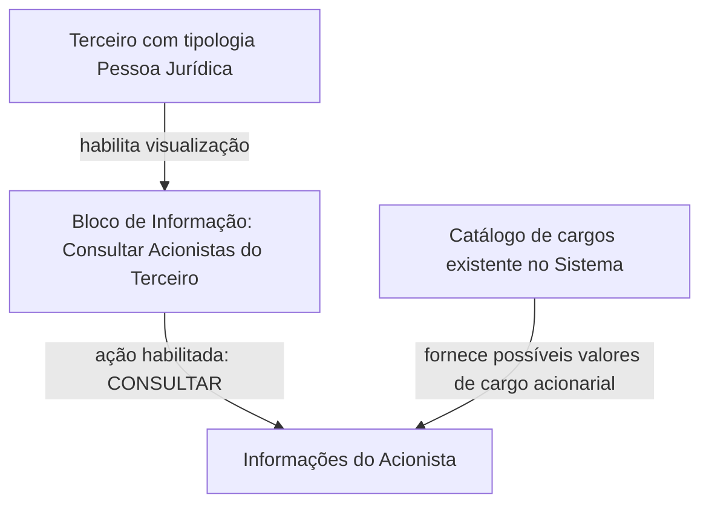

# Consulta de Acionistas de Terceiros — Documentação Reef / Mapfredocument

## 1. Metadados do Documento
- **Arquivo de Origem:** Não identificado; conteúdo extraído de documentação Reef.
- **Tipo de Documento:** Especificação Funcional.
- **Domínio / Sistema:** Reef / Mapfredocument — consulta de acionistas de terceiros.
- **Público-Alvo:** Desenvolvedores, analistas funcionais, operação e negócio.
- **Data/Versão Identificada:** Não identificada.

---

## 2. Resumo Executivo & Contexto de Negócio

O documento descreve o bloco de informação **“CONSULTAR los Accionistas del Tercero”**, destinado à visualização dos acionistas associados a um terceiro. O objetivo explícito do bloco é mostrar os acionistas quando a tipologia do terceiro corresponde a uma **Pessoa Jurídica**.

A ação habilitada no bloco é exclusivamente **CONSULTAR**, sem indicação de operações de criação, alteração, exclusão ou inativação de acionistas. A documentação concentra-se nos atributos exibidos para cada acionista e na sequência de visualização dessas informações.

Os dados apresentados incluem identificação documental, nacionalidade, nome, apelidos ou razão social, datas de vínculo acionário, percentual acionarial, cargo, validade operacional, classificação como pessoa politicamente exposta e estado de inabilitação no sistema.

O conteúdo pertence à área de documentação Reef e apresenta referências visuais a “Mapfredocument”, “DOCUMENTACIÓN Reef”, ciclo de vida **Approved Source**, proprietário `user:agonzalez_mapfre.com` e idioma **ES**. O documento não especifica integrações, contratos de API, persistência, endpoints, tecnologias de implementação ou regras de cálculo adicionais.

---

## 3. Arquitetura, Componentes & Tecnologias Envolvidas

### Componentes e elementos identificados

| Componente / Elemento | Papel identificado no documento | Observações |
| :--- | :--- | :--- |
| Bloco “CONSULTAR los Accionistas del Tercero” | Exibe informações de acionistas de um terceiro. | Aplicável quando o terceiro é Pessoa Jurídica. |
| Terceiro | Entidade à qual os acionistas estão associados. | A tipologia do terceiro condiciona a disponibilidade do bloco. |
| Acionista | Pessoa física ou jurídica associada ao terceiro. | Possui atributos documentais, cadastrais, acionários e de situação. |
| Sistema | Repositório ou contexto operacional referido pelo documento. | O texto menciona catálogo de cargos existente no sistema e operação plena no sistema. |
| Catálogo de cargos | Fonte dos possíveis valores de cargo acionarial. | Não há detalhamento dos valores, estrutura ou responsável pelo catálogo. |
| Reef | Contexto documental indicado pela expressão “DOCUMENTACIÓN Reef”. | Não há descrição técnica da plataforma Reef. |
| Mapfredocument | Referência presente no conteúdo bruto. | Não há detalhamento funcional ou arquitetural adicional. |

### Relação funcional identificada



**Nota de Análise:** O documento descreve uma relação funcional entre terceiro, acionistas e catálogo de cargos, mas não detalha arquitetura de software, APIs, serviços, bancos de dados, protocolos, tecnologias, URLs ou ambientes técnicos.

---

## 4. Regras de Negócio, Especificações Funcionais & Processos

### 4.1 Condição de aplicabilidade

1. O bloco de informação é denominado **“CONSULTAR los Accionistas del Tercero”**.
2. O propósito do bloco é **mostrar os acionistas do terceiro**.
3. A apresentação dos acionistas ocorre sempre que a tipologia do terceiro corresponder a uma **Pessoa Jurídica**.
4. O documento não descreve o comportamento do bloco para terceiros cuja tipologia não seja Pessoa Jurídica.

### 4.2 Ação habilitada

- A única ação explicitamente habilitada é **CONSULTAR**.
- O documento não apresenta ações habilitadas para inclusão, edição, remoção, exportação ou aprovação de acionistas.

### 4.3 Ordem de visualização

- A relação de atributos descrita no documento determina a sequência de apresentação da informação.
- A orientação de leitura indicada é **da esquerda para a direita e de cima para baixo**.
- O documento não informa regras de ordenação entre múltiplos acionistas, como ordenação por nome, percentual acionarial, data de alta ou cargo.

### 4.4 Atributos exibidos para cada acionista

1. **Tipo Documento Accionista**
   - Visualiza o tipo de documento associado à pessoa física ou jurídica que atua como acionista.

2. **Clave del Documento Accionista**
   - Contém a chave do documento do acionista.

3. **Nacionalidad del Accionista**
   - Mostra o país de nacionalidade do acionista.

4. **Nombre**
   - Contém o nome do acionista.

5. **Apellidos**
   - Os campos de apelidos determinam os apelidos ou a razão social do acionista.

6. **Fecha de Alta**
   - Indica a data em que o acionista passa a possuir direitos acionários sobre o terceiro.

7. **Fecha de Baja**
   - Mostra a data em que o acionista deixa de possuir direitos acionários em relação ao terceiro ao qual está associado.

8. **Porcentaje Accionarial**
   - Contém o percentual acionarial do acionista em relação ao número de ações emitidas pelo terceiro.

9. **Cargo**
   - Visualiza o cargo acionarial sustentado pelo acionista.
   - Os possíveis valores de cargo são definidos no catálogo de cargos existente no sistema.

10. **Fecha de Validez**
    - Mostra a data a partir da qual o acionista do terceiro está ou estará plenamente operativo no sistema.

11. **Marca Persona Políticamente Expuesta**
    - Identifica o acionista como pessoa politicamente exposta.

12. **Inhabilitación**
    - Mostra se o acionista está ou não inabilitado no sistema.

### 4.5 Restrições e ausências de especificação

- O documento não define formatos de data.
- O documento não define a escala, precisão, faixa válida ou arredondamento do percentual acionarial.
- O documento não informa valores possíveis para a marca de pessoa politicamente exposta.
- O documento não informa valores possíveis para inabilitação.
- O documento não detalha os cargos disponíveis no catálogo de cargos.
- O documento não detalha validações de consistência entre data de alta, data de baixa e data de validade.
- O documento não informa regras de privacidade, autorização ou perfis de acesso para a consulta.

---

## 5. Tabelas de Parâmetros, Ambientes e Estruturas de Dados

| Item / Parâmetro | Descrição / Função | Tipo / Valores / Formato | Ambiente / Observações |
| :--- | :--- | :--- | :--- |
| Tipologia do Terceiro | Determina a aplicabilidade do bloco de consulta de acionistas. | Pessoa Jurídica. | O documento não descreve outras tipologias. |
| Ação habilitada | Permite consultar as informações de acionistas do terceiro. | `CONSULTAR`. | Nenhuma outra ação é descrita. |
| Tipo Documento Accionista | Exibe o tipo de documento associado ao acionista. | Não especificado. | O acionista pode ser pessoa física ou jurídica. |
| Clave del Documento Accionista | Armazena ou exibe a chave do documento do acionista. | Não especificado. | Não há formato ou regra de validação descritos. |
| Nacionalidad del Accionista | Exibe o país de nacionalidade do acionista. | País; formato não especificado. | Não há lista de países, códigos ou padrão informado. |
| Nombre | Exibe o nome do acionista. | Texto; formato não especificado. | Aplicável conforme apresentado no documento. |
| Apellidos | Exibe apelidos ou razão social do acionista. | Texto; formato não especificado. | O documento indica que os campos determinam apelidos ou razão social. |
| Fecha de Alta | Indica o início dos direitos acionários do acionista sobre o terceiro. | Data; formato não especificado. | Relacionada aos direitos acionários. |
| Fecha de Baja | Indica o término dos direitos acionários do acionista sobre o terceiro. | Data; formato não especificado. | Relacionada à baixa dos direitos acionários. |
| Porcentaje Accionarial | Exibe o percentual de participação acionária em relação às ações emitidas pelo terceiro. | Percentual; precisão e formato não especificados. | Não há regra de soma, limite ou cálculo adicional. |
| Cargo | Exibe o cargo acionarial do acionista. | Valores definidos no catálogo de cargos do sistema. | O catálogo não é transcrito ou detalhado. |
| Fecha de Validez | Indica quando o acionista está ou estará plenamente operativo no sistema. | Data; formato não especificado. | Não há critério adicional para determinar validade. |
| Marca Persona Políticamente Expuesta | Identifica um acionista como pessoa politicamente exposta. | Não especificado. | Não há definição da sigla PEP nem regras de classificação no texto. |
| Inhabilitación | Indica se o acionista está inabilitado no sistema. | Estado “está ou não inabilitado”. | Valores técnicos e motivos não especificados. |
| Owner | Proprietário indicado na documentação. | `user:agonzalez_mapfre.com`. | Metadado exibido no conteúdo bruto. |
| Lifecycle | Estado de ciclo de vida do conteúdo. | `Approved Source`. | Metadado exibido no conteúdo bruto. |
| Idioma | Idioma indicado na interface documental. | `ES`. | O conteúdo funcional está em espanhol. |
| Ambiente técnico | URLs, servidores, portas, logs ou credenciais. | Não identificado. | O documento não contém esses dados. |

---

## 6. Bateria de Perguntas & Respostas para RAG (FAQ Sintético)

### P1: Em que situação o bloco “Consultar Acionistas do Terceiro” deve ser apresentado?
**R:** O bloco “CONSULTAR los Accionistas del Tercero” deve ser apresentado quando a tipologia do terceiro corresponder a uma **Pessoa Jurídica**. O objetivo declarado é mostrar os acionistas associados a esse terceiro.

### P2: Quais ações podem ser realizadas no bloco de acionistas do terceiro?
**R:** O documento informa somente a ação **CONSULTAR**. Não há descrição de ações para criar, editar, excluir, aprovar, inativar ou exportar informações de acionistas.

### P3: Qual é a ordem de exibição dos atributos do acionista?
**R:** Os atributos devem ser visualizados conforme a relação apresentada no documento, seguindo a orientação **da esquerda para a direita e de cima para baixo**. O documento não define uma regra de ordenação entre registros de acionistas.

### P4: O que representa o campo “Fecha de Alta” de um acionista?
**R:** “Fecha de Alta” representa a data em que o acionista possui direitos acionários sobre o terceiro. O documento não especifica o formato da data nem regras complementares de validação.

### P5: O que informa o campo “Fecha de Baja”?
**R:** “Fecha de Baja” mostra a data em que o acionista deixa de ter direitos acionários em relação ao terceiro ao qual está associado.

### P6: Como é definido o percentual acionarial de um acionista?
**R:** O campo “Porcentaje Accionarial” contém o percentual acionarial do acionista em relação ao número de ações emitidas pelo terceiro. O documento não informa fórmula de cálculo, precisão decimal, limite de valores ou regra de soma entre acionistas.

### P7: De onde vêm os valores possíveis do campo “Cargo”?
**R:** Os valores possíveis para “Cargo” são definidos no catálogo de cargos existente no sistema. O documento não lista os cargos disponíveis, nem descreve a gestão desse catálogo.

### P8: O que significa a “Fecha de Validez” no cadastro de um acionista?
**R:** A “Fecha de Validez” mostra a data a partir da qual o acionista do terceiro está ou estará plenamente operativo no sistema. Não há detalhamento sobre validações, estados intermediários ou critérios para operação plena.

### P9: Como o documento trata uma pessoa politicamente exposta?
**R:** O campo “Marca Persona Políticamente Expuesta” identifica o acionista como pessoa politicamente exposta. O documento não detalha critérios de classificação, valores do campo, fluxos de aprovação ou consequências operacionais dessa identificação.

### P10: O que o campo “Inhabilitación” informa?
**R:** “Inhabilitación” informa se o acionista está ou não inabilitado no sistema. O documento não especifica os motivos de inabilitação, responsáveis pela alteração desse estado ou efeitos funcionais da inabilitação.

### P11: O campo de nacionalidade utiliza qual padrão de país?
**R:** O campo “Nacionalidad del Accionista” mostra o país de nacionalidade do acionista. O documento não identifica se o país utiliza nome textual, código ISO, catálogo interno ou outro padrão de codificação.

### P12: O documento descreve APIs, integrações ou contratos JSON para consultar acionistas?
**R:** Não. O documento descreve o bloco funcional de consulta e seus atributos, mas não fornece métodos HTTP, endpoints, contratos JSON, serviços, bancos de dados ou mecanismos de integração.

---

## 7. Glossário de Termos, Siglas & Conceitos-Chave

- **Acionista:** Pessoa física ou jurídica associada a um terceiro e detentora de direitos acionários.
- **Apellidos:** Apelidos; no contexto do documento, os campos podem determinar os apelidos ou a razão social do acionista.
- **Cargo acionarial:** Cargo sustentado pelo acionista conforme valores existentes no catálogo de cargos do sistema.
- **Clave del Documento Accionista:** Chave do documento do acionista.
- **Fecha de Alta:** Data em que o acionista possui direitos acionários sobre o terceiro.
- **Fecha de Baja:** Data em que o acionista deixa de possuir direitos acionários sobre o terceiro.
- **Fecha de Validez:** Data a partir da qual o acionista está ou estará plenamente operativo no sistema.
- **Inhabilitación:** Estado que indica se o acionista está ou não inabilitado no sistema.
- **Mapfredocument:** Referência presente nos metadados extraídos; o documento não oferece definição adicional.
- **Marca Persona Políticamente Expuesta:** Campo que identifica o acionista como pessoa politicamente exposta.
- **Nacionalidad del Accionista:** País de nacionalidade do acionista.
- **Pessoa Jurídica:** Tipologia de terceiro que habilita a apresentação do bloco de acionistas.
- **Porcentaje Accionarial:** Percentual de participação do acionista em relação ao número de ações emitidas pelo terceiro.
- **Reef:** Referência à documentação indicada como “DOCUMENTACIÓN Reef”.
- **Terceiro:** Entidade à qual os acionistas e respectivos direitos acionários estão associados.
- **Tipo Documento Accionista:** Tipo de documento associado à pessoa física ou jurídica atuando como acionista.

---

## 8. Notas Críticas, Riscos & Limitações

- **Cobertura funcional limitada:** O documento detalha somente a consulta e a visualização de atributos de acionistas. Não documenta processos de manutenção cadastral.
- **Ausência de especificação técnica:** Não há tecnologias, APIs, endpoints, autenticação, autorização, modelos de dados, bancos de dados, logs, URLs, servidores, ambientes ou contratos de integração.
- **Ausência de regras de validação:** Não são definidos formatos de documentos, datas ou percentuais, nem validações entre data de alta, data de baixa e data de validade.
- **Dependência externa não detalhada:** O campo de cargo depende de um catálogo de cargos existente no sistema, mas o catálogo, seus valores e sua governança não são descritos.
- **Dados sensíveis:** A identificação de pessoa politicamente exposta e o estado de inabilitação são atributos potencialmente sensíveis, mas o documento não descreve controles de acesso, trilhas de auditoria ou mascaramento.
- **Ambiguidade de campos de nome:** O texto menciona que dois campos de apelidos determinam os apelidos ou a razão social, sem esclarecer a regra aplicável para pessoa física versus pessoa jurídica.
- **Nota de Análise:** O documento lista o bloco de consulta de acionistas, porém não detalha métodos HTTP, contratos JSON, regras de permissão ou fontes de dados.

---

## 9. Conteúdo Bruto Estruturado (Referência Fiel)

```text
--- [PÁGINA 1 DE 2] ---

CONSULTAR los Accionistas del Tercero
Objetivo
Siempre y cuando la tipología del Tercero corresponda a una Persona Jurídica, el propósito de este Bloque de Información es Mostrar a los
Accionistas del Tercero.
Acciones habilitadas
 CONSULTAR ( )
Accionistas
De izquierda a derecha y de arriba hacia abajo, la siguiente relación de atributos determina la secuencia de visualización de la Información.
Tipo Documento Accionista
Este campo visualiza el tipo de documento asociado a la persona física o jurídica como accionista.
Clave del Documento Accionista
Este dato contiene la clave del documento del Accionista.
Nacionalidad del Accionista
Este campo del bloque de información muestra el país de nacionalidad del Accionista.
Nombre
Este campo contiene el nombre del Accionista.
Apellidos
Estos dos campos del bloque de información determinan o bien los apellidos o bien la Razón Social del accionista.
Documentation / DOCUMENTACIÓN Reef
DOCUMENTACIÓN Reef
Mapfredocument
DOCUMENTACIÓN Reef
Owner
user:agonzalez_mapfre.com
Lifecycle
Approved Source
 /
 VL
Buscar Inicio Soluciones Arquitecturas APIs Componentes Cloud Documentación Zeus Reef Ayuda
ES


--- [PÁGINA 2 DE 2] ---

Fecha de Alta
Este dato observa la fecha en la que el accionista tiene los derechos accionariales del Tercero.
Fecha de Baja
Este campo muestra la fecha en la que el accionista causa baja en relación con los derechos accionariales del Tercero al que está asociado.
Porcentaje Accionarial
Este Campo contiene el Porcentaje accionarial del accionista en relación al número de acciones emitidas por el Tercero.
Cargo
Este Campo visualiza el cargo accionarial que sustenta el accionista de acuerdo con los posibles valores en los cargos de�nidos en el
catálogo de cargos existente en el Sistema.
Fecha de Validez
Esta propiedad muestra la fecha a partir de la cual el accionista del Tercero está o estará plenamente operativo en el sistema.
Marca Persona Políticamente Expuesta
Este campo identi�ca al accionista como persona políticamente expuesta.
Inhabilitación
Esta propiedad muestra si el Accionista está o no inhabilitado en el sistema.
```
