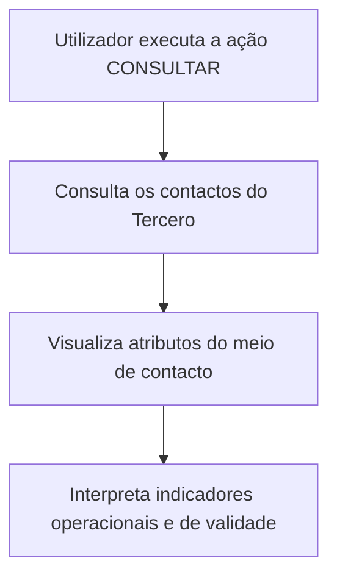

# Consulta de Contactos del Tercero — Documentación Reef

## 1. Metadatos del Documento
- **Arquivo de Origem:** Não identificado; conteúdo extraído de “DOCUMENTACIÓN Reef”
- **Tipo de Documento:** Manual Operacional
- **Domínio / Sistema:** Reef / consulta de contactos de Terceros
- **Público-Alvo:** Operação, Negócio e utilizadores do sistema
- **Data/Versão Identificada:** Não identificada
- **Proprietário Identificado:** `user:agonzalez_mapfre.com`
- **Ciclo de Vida Identificado:** Approved Source / VL

---

## 2. Resumo Executivo & Contexto de Negócio

O documento descreve a funcionalidade **“CONSULTAR los Contactos del Tercero”** no sistema Reef. O objetivo declarado é visualizar os contactos associados a um Tercero na data da consulta. A única ação habilitada explicitamente é **CONSULTAR**.

A funcionalidade apresenta atributos de meios de contacto, identificação, nome, cargo, departamento, país, relação e indicadores operacionais. Os atributos são exibidos em uma sequência de visualização definida da esquerda para a direita e de cima para baixo.

A documentação informa que, salvo indicação expressa em contrário, os campos podem apresentar indistintamente informações de **Personas Físicas** e **Personas Jurídicas**. O conteúdo concentra-se na consulta e interpretação dos dados, sem detalhar criação, alteração, exclusão, métodos HTTP, contratos JSON, APIs ou integrações externas.

Entre os indicadores consultáveis estão a designação de contacto de referência para notificações, meio de contacto padrão, meio prioritário, validação pela entidade seguradora, inabilitação e data de validade. Esses elementos suportam processos operacionais e aplicações da entidade.

---

## 3. Arquitetura, Componentes & Tecnologias Envolvidas

O conteúdo identifica os seguintes elementos funcionais:

- **Sistema Reef:** contexto documental e sistema no qual ocorre a consulta.
- **Tercero:** entidade cujos contactos e meios de contacto são visualizados.
- **Medio de Contacto:** registo de contacto associado ao Tercero.
- **Personas Físicas e Personas Jurídicas:** tipos de pessoas cujas informações podem ser exibidas.
- **Catálogo de Cargos do Sistema:** origem dos valores possíveis para o código de cargo.
- **Catálogo de Departamentos de Empresas do Sistema:** origem dos valores possíveis para departamento ou seção.
- **Catálogo de Países do Sistema:** origem dos valores possíveis para o código de país.
- **Configuración de la Compañía:** contém a ativação do controlo de limite de prémios para prevenção de lavagem de dinheiro.
- **Entidad aseguradora:** entidade que pode validar o meio de contacto.

> **Nota de Análise:** O documento não descreve arquitetura técnica, camadas de software, microsserviços, APIs, bases de dados, protocolos, URLs, ambientes ou tecnologias de implementação. Também não apresenta um fluxo de integração passível de reconstrução fiel em Mermaid.

Fluxo funcional explicitamente identificado:



---

## 4. Regras de Negócio, Especificações Funcionais & Processos

### 4.1 Objetivo da consulta

A funcionalidade permite visualizar os contactos do Tercero existentes no sistema na data da consulta.

### 4.2 Ação habilitada

A ação habilitada no documento é:

- **CONSULTAR**

### 4.3 Sequência de visualização

Os atributos determinam a sequência de visualização da informação:

1. Da esquerda para a direita.
2. De cima para baixo.

Caso não exista especificação ou indicação expressa de campos, são visualizadas indistintamente informações de Personas Físicas e Personas Jurídicas.

### 4.4 Regras para contacto de referência

A marca **Tercero de Referencia** determina que o contacto é a pessoa de referência para envio das notificações correspondentes quando todas as seguintes condições forem cumpridas:

1. O controlo no limite de prémios para prevenção de lavagem de dinheiro está ativado na Configuración de la Compañía.
2. O Tercero que está a ser capturado é uma Persona Jurídica.
3. Na Informação do Tercero foi indicado que devem ser enviadas notificações.

### 4.5 Regras para meio de contacto por defeito

Para Terceros com mais de um meio de contacto associado:

- O campo **Medio de Contacto por Defecto** indica qual meio deve ser considerado por defeito nos processos operativos e/ou aplicações da entidade.
- Só pode existir **um** meio identificado e marcado como meio por defeito para cada uso dos meios de contacto atribuídos.

### 4.6 Regras para meio de contacto prioritário

Para Terceros com mais de um meio de contacto associado:

- O campo **Medio de Contacto Prioritario** identifica o meio que deve ser considerado preferencialmente nos processos operativos da entidade.
- Só pode existir **um** meio identificado como prioritário para o conjunto total dos meios de contacto do Tercero.

### 4.7 Validação, vigência e operação

- **Medio de Contacto Validado:** indica se o meio de contacto foi efetivamente validado pela entidade seguradora para classificar a qualidade da informação capturada.
- **Inhabilitación:** estabelece se o meio de contacto deixou de estar em vigor e, por esse motivo, deve ser considerado nos processos internos da entidade.
- **Fecha de Validez:** apresenta a data a partir da qual o meio de contacto está ou estará plenamente operativo.
- **Observaciones:** apresenta, em texto plano, observações usadas para ampliar ou detalhar a informação do meio de contacto durante o processo de alta.

---

## 5. Tabelas de Parâmetros, Ambientes e Estruturas de Dados

| Item / Parâmetro | Descrição / Função | Tipo / Valores / Formato | Ambiente / Observações |
| :--- | :--- | :--- | :--- |
| Uso del Medio de Contacto | Contém o valor do uso do meio de contacto do Tercero. | Valor do uso do meio de contacto. | Associado ao Tercero. |
| Secuencia del Medio de Contacto | Apresenta o número de sequência do meio de contacto do Tercero. | Número atribuído automaticamente pelo sistema durante a captura. | Associado ao processo de captura. |
| Tipo del Medio de Contacto | Visualiza a tipologia do meio de contacto do Tercero. | Tipologia do meio de contacto. | Associado ao Tercero. |
| Clave/valor del Medio de Contacto | Contém o valor real do tipo de meio de contacto. | Valor conforme o tipo de meio definido. | O documento não detalha formatos possíveis. |
| Nombre del Medio de Contacto | Contém o nome ou os nomes da pessoa que atua como meio de contacto. | Nome textual. | Aplicável à pessoa que atua como contacto. |
| Primer y Segundo Apellido del Contacto | Apresenta o apelido ou os apelidos da pessoa que atua como contacto. | Texto. | Aplicável à pessoa de contacto. |
| Tipo Documento | Apresenta o tipo de documento usado para identificar a pessoa física ou jurídica como contacto. | Tipo de documento. | Aplicável a Personas Físicas ou Personas Jurídicas. |
| Clave del Documento | Contém a chave do documento que identifica a pessoa do contacto. | Chave de identificação documental. | Associada à pessoa de contacto. |
| Tipo de Cargo en la Empresa | Mostra, quando aplicável, o valor da classificação do cargo da pessoa na empresa. | Classificação de cargo. | Associada à pessoa de contacto. |
| Cargo/Actividad del Contacto | Visualiza o código do posto que identifica o contacto do Tercero. | Código conforme catálogo de Cargos do Sistema. | O documento não apresenta os valores do catálogo. |
| Departamento del Contacto | Mostra o código do departamento ou seção que identifica o contacto do Tercero. | Código conforme catálogo de Departamentos de Empresas do Sistema. | O documento não apresenta os valores do catálogo. |
| Clave del País | Mostra, quando aplicável, o código do primeiro nível da estrutura geográfica: países. | Código conforme catálogo de Países do Sistema. | Associado ao meio de contacto do Tercero. |
| Relación | Texto livre usado na captura para detalhar ou ampliar a informação sobre o departamento ou a relação do contacto com o Tercero. | Texto livre. | Informação complementar. |
| Tercero de Referencia | Define que o contacto é a pessoa de referência para envio de notificações. | Marca ou indicador. | Depende da ativação do controlo de lavagem de dinheiro, de o Tercero ser Persona Jurídica e de haver indicação de envio de notificações. |
| Medio de Contacto por Defecto | Indica o meio que deve ser usado por defeito nos processos operativos e/ou aplicações da entidade. | Marca ou indicador. | Apenas um por cada uso dos meios de contacto atribuídos. |
| Medio de Contacto Prioritario | Indica o meio a considerar preferencialmente nos processos operativos da entidade. | Marca ou indicador. | Apenas um para o total de meios de contacto do Tercero. |
| Medio de Contacto Validado | Indica se a entidade seguradora validou efetivamente o meio de contacto. | Indicador de validação. | Usado para classificar a qualidade da informação capturada. |
| Inhabilitación | Define se o meio de contacto deixou de estar em vigor. | Indicador de vigência/inabilitação. | Deve ser considerado nos processos internos da entidade. |
| Fecha de Validez | Visualiza a data a partir da qual o meio de contacto está ou estará plenamente operativo. | Data. | Associada ao meio de contacto. |
| Observaciones | Visualiza observações que ampliam ou detalham a informação do meio de contacto. | Texto plano. | Registadas no processo de alta. |
| Ação habilitada | Permite visualizar contactos do Tercero. | `CONSULTAR` | O documento não lista outras ações. |

---

## 6. Bateria de Perguntas & Respostas para RAG (FAQ Sintético)

### P1: Qual é o objetivo da funcionalidade “CONSULTAR los Contactos del Tercero”?
**R:** O objetivo é visualizar no sistema os contactos do Tercero na data em que a consulta é realizada.

### P2: Qual ação está habilitada na documentação de contactos do Tercero?
**R:** A documentação identifica exclusivamente a ação **CONSULTAR**. O conteúdo não descreve ações de criação, alteração, eliminação ou outras operações sobre contactos.

### P3: Como o sistema apresenta a sequência de visualização dos atributos dos contactos?
**R:** Os atributos determinam a sequência de visualização da informação da esquerda para a direita e de cima para baixo.

### P4: Em que situação um contacto é marcado como “Tercero de Referencia”?
**R:** Um contacto é marcado como pessoa de referência para envio de notificações quando o controlo no limite de prémios para prevenção de lavagem de dinheiro está ativo na configuração da companhia, o Tercero em captura é uma Persona Jurídica e a Informação do Tercero indica que devem ser enviadas notificações.

### P5: Qual é a regra de unicidade do “Medio de Contacto por Defecto”?
**R:** Quando o Tercero possui mais de um meio de contacto, o meio por defeito é aquele considerado nos processos operativos e/ou aplicações da entidade. Só pode existir um meio marcado como tal para cada uso dos meios de contacto atribuídos.

### P6: Qual é a diferença entre “Medio de Contacto por Defecto” e “Medio de Contacto Prioritario”?
**R:** O meio por defeito é considerado nos processos operativos e/ou aplicações da entidade para um determinado uso de meios de contacto. O meio prioritário é o meio considerado preferencialmente nos processos operativos da entidade e só pode existir um para o total de meios de contacto do Tercero.

### P7: O que significa um “Medio de Contacto Validado”?
**R:** Significa que o meio de contacto foi efetivamente validado pela entidade seguradora com o objetivo de classificar a qualidade da informação capturada no sistema.

### P8: O que informa o campo “Inhabilitación”?
**R:** O campo informa se o meio de contacto associado ao Tercero deixou de estar em vigor. Quando indicado, essa condição deve ser considerada nos processos internos da entidade.

### P9: Qual é a finalidade da “Fecha de Validez” de um meio de contacto?
**R:** A Fecha de Validez apresenta a data a partir da qual o meio de contacto está ou estará plenamente operativo.

### P10: De onde vêm os valores de cargo, departamento e país do contacto?
**R:** O código de Cargo/Actividad do Contacto é baseado no catálogo de Cargos do Sistema. O Departamento del Contacto é baseado no catálogo de Departamentos de Empresas do Sistema. A Clave del País é baseada no catálogo de Países existente no Sistema.

### P11: O que pode ser registado no campo “Relación”?
**R:** O campo Relación é utilizado como texto livre durante a captura das informações do Tercero para detalhar ou ampliar a informação relativa ao Departamento del Contacto ou à relação do contacto com o Tercero.

### P12: O documento especifica métodos HTTP, APIs ou contratos JSON para consulta de contactos?
**R:** Não. O documento descreve atributos funcionais e regras de visualização para a consulta de contactos do Tercero, mas não detalha métodos HTTP, APIs, contratos JSON, endpoints ou integrações técnicas.

---

## 7. Glossário de Termos, Siglas & Conceitos-Chave

- **Reef:** nome identificado no cabeçalho da documentação e no contexto do sistema.
- **Tercero:** entidade cujos contactos e meios de contacto são consultados no sistema.
- **Persona Física:** tipo de pessoa mencionado como possível origem das informações apresentadas nos campos.
- **Persona Jurídica:** tipo de pessoa mencionado como possível origem das informações apresentadas nos campos e como condição para a regra de Tercero de Referencia.
- **Medio de Contacto:** registo de contacto associado ao Tercero.
- **Tercero de Referencia:** contacto marcado como pessoa de referência para receber notificações, mediante condições documentadas.
- **Medio de Contacto por Defecto:** meio de contacto utilizado por defeito nos processos operativos e/ou aplicações da entidade.
- **Medio de Contacto Prioritario:** meio de contacto considerado preferencialmente nos processos operativos da entidade.
- **Medio de Contacto Validado:** meio de contacto validado pela entidade seguradora para classificar a qualidade da informação.
- **Inhabilitación:** indicação de que o meio de contacto deixou de estar em vigor.
- **Fecha de Validez:** data a partir da qual o meio de contacto está ou estará plenamente operativo.
- **Prevención del Lavado de Dinero:** contexto do controlo no limite de prémios mencionado como condição para a designação de Tercero de Referencia.

---

## 8. Notas Críticas, Riscos & Limitações

- O documento não apresenta detalhes técnicos de implementação, arquitetura de software, APIs, serviços, bases de dados, ambientes, URLs, portas, credenciais ou mecanismos de autenticação.
- O documento não especifica formatos, domínios de valores ou catálogos concretos para tipo de meio de contacto, cargo, departamento, país e documento.
- A regra de **Tercero de Referencia** depende de uma configuração da companhia relacionada à prevenção de lavagem de dinheiro; o documento não detalha como essa configuração é administrada.
- Os indicadores de meio por defeito e meio prioritário possuem restrições de unicidade distintas, que devem ser preservadas: um por uso dos meios de contacto para o meio por defeito e um para o total de meios do Tercero para o meio prioritário.
- O conteúdo não define o comportamento do sistema quando houver dados inválidos, campos ausentes, múltiplas marcações indevidas ou conflito entre meios de contacto.
- **Nota de Análise:** A documentação é funcional e descritiva. Não existe detalhamento adicional sobre contratos de integração, operações de persistência ou regras técnicas de validação.

---

## 9. Conteúdo Bruto Estruturado (Referência Fiel)

```text
--- [PÁGINA 1 DE 3] ---

CONSULTAR los Contactos del Tercero
Objetivo
Visualizar los contactos del Tercero en el sistema a la fecha de consulta.
Acciones habilitadas
 CONSULTAR ( )
Contactos
De izquierda a derecha y de arriba hacia abajo, los siguientes atributos determinan la secuencia de visualización de la Información.
Si no se especica o indica expresamente los campos visualizarán indistintamente información de las Personas Físicas y de las Personas
Jurídicas.
Uso del Medio de Contacto
Este atributo contiene el valor del Uso del medio de Contacto del Tercero.
Secuencia del Medio de Contacto
Este dato muestra el Número de Secuencia del Medio de Contacto del Tercero siendo un valor que el Sistema asignó automáticamente en el
proceso de captura.
Tipo del Medio de Contacto
Este atributo visualiza la tipología del medio de contacto del Tercero.
Documentation / DOCUMENTACIÓN Reef
DOCUMENTACIÓN Reef
Mapfredocument
DOCUMENTACIÓN Reef
Owner
user:agonzalez_mapfre.com
Lifecycle
Approved Source
 / 
 VL
Buscar Inicio Soluciones Arquitecturas APIs Componentes Cloud Documentación Zeus Reef Ayuda
ES


--- [PÁGINA 2 DE 3] ---

Clave/valor del Medio de Contacto
Este Atributo contiene el valor real del Tipo del Medio de Contacto (de acuerdo con el tipo de medio denido)
Nombre del Medio de Contacto
Este campo contiene el Nombre o los Nombres de la Persona que actúa como Medio de Contacto.
Primer y Segundo Apellido del Contacto
Este dato muestra el Apellido o los Apellidos de la Persona que actúa como Medio de Contacto.
Tipo Documento
Este campo observa el tipo de documento con el que se identicó a la persona física o jurídica como contacto.
Clave del Documento
Este otro dato contiene la clave del documento que identica a la Persona del Contacto.
Tipo de Cargo en la Empresa
Este dato en su caso mostrará el valor de la clasicación del cargo de las Persona en la Empresa, asociado a la Persona de Contacto.
Cargo/Actividad del Contacto
Este campo visualiza el código del Puesto con el que se identica el contacto del Tercero de acuerdo con la relación de posibles valores
existentes en el catálogo de Cargos del Sistema.
Departamento del Contacto
Este Campo muestra el código del departamento o sección con el que se identicó el contacto del Tercero, de acuerdo con la relación de
posibles valores existentes en el catálogo de Departamentos de Empresas del Sistema.
Clave del País
Este Campo, en su caso, muestra el código del primer nivel de la estructura Geográca (países) asociado al Medio de Contacto del Tercero y
de acuerdo con la relación de posibles valores existentes en el catálogo de Países existente en el Sistema.
Relación
Esta cualidad se utilizó en la captura de la información del Tercero como texto libre para detallar o ampliar la información relativa al
Departamento del Contacto o la relación del Contacto con el Tercero.
Tercero de Referencia
Esta marca determina que el Contacto es la Persona de Referencia (a la que se deben enviar las noticaciones correspondientes) en el caso
que se cumplan:
El Control en el Límite de Primas para la Prevención del Lavado de Dinero esté activado en la Conguración de la Compañía.
El Tercero que se esté capturando sea una Persona Jurídica y además se haya indicado en la Información del Tercero que se le han de
enviar noticaciones.
Medio de Contacto por Defecto
Este campo, en aquellos Terceros que tienen más de un medio de Contacto asociado, indicará cual de ellos es el que se debe considerar por
defecto en los Procesos Operativos y/o Aplicaciones de la Entidad.
Solamente puede haber uno identicado y marcado como tal por cada Uso de los Medios de Contacto asignados.
Medio de Contacto Prioritario
Este Campo, en aquellos Terceros que tienen más de un medio de Contacto asociado, va a indicar cual de ellos es el que se ha de considerar
preferentemente en los Procesos Operativos de la Entidad.
Solamente puede haber uno identicado como tal para el total de Medios de Contacto del Tercero


--- [PÁGINA 3 DE 3] ---

Medio de Contacto Validado
Este Dato indica si el Medio de Contacto ha sido efectivamente validado por parte de la entidad aseguradora a efectos de clasicar la calidad
de la información capturada en el Sistema.
Inhabilitación
Este campo establece si el Medio de Contacto asociado al Tercero ha dejado de estar en vigor y por ello debería ser considerado en los
procesos internos de la entidad.
Fecha de Validez
Esta propiedad visualiza la fecha a partir de la cual el Medio de Contacto está o va a estar plenamente operativo.
Observaciones
Se visualizan las observaciones, como texto plano, que permitieron ampliar o detallar la información del Medio de Contacto del Tercero en su
proceso de alta.
```
