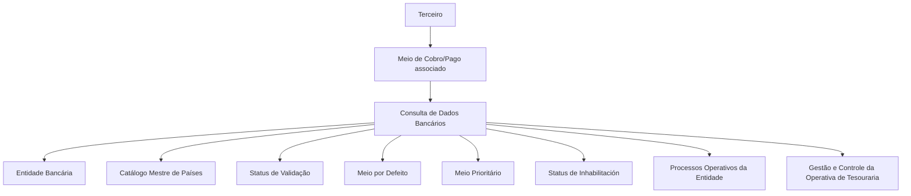

# Consulta de Dados Bancários de Terceiros — Meios de Cobrança e Pagamento

## 1. Metadados do Documento
- **Arquivo de Origem:** Não informado; conteúdo bruto extraído de documentação Reef.
- **Tipo de Documento:** Manual Operacional.
- **Domínio / Sistema:** Reef / Mapfre — gestão de dados bancários de Terceiros e meios de cobrança/pagamento.
- **Público-Alvo:** Operação, Negócio, Analistas Funcionais e Desenvolvedores.
- **Data/Versão Identificada:** Não identificada. O conteúdo indica ciclo de vida “Approved Source”.

---

## 2. Resumo Executivo & Contexto de Negócio

O documento descreve a funcionalidade de **consulta dos Dados Bancários de um Terceiro** no contexto da documentação Reef. O objetivo declarado é visualizar os meios de cobrança e pagamento associados a um Terceiro, incluindo contas, cartões e outros tipos de meios não detalhados.

A funcionalidade disponibiliza a ação de **CONSULTAR**, sem que o documento descreva operações de inclusão, alteração ou remoção. Os atributos são apresentados em uma sequência de visualização definida: da esquerda para a direita e de cima para baixo.

A consulta abrange informações de identificação, classificação, instituição bancária, localização geográfica, titularidade, tokenização, mascaramento, criptografia, finalidade operacional, moeda, validade, vencimento e status de qualidade do dado. O modelo descrito suporta tanto meios utilizados para **Cobros** quanto para **Pagos**.

O documento estabelece regras importantes para seleção operacional dos meios associados a um Terceiro: apenas um meio pode ser definido como padrão entre todos os meios do Terceiro; apenas um meio pode ser definido como prioritário para cada tipo de meio de cobrança/pagamento; e um meio inabilitado não deve ser utilizado pelas operações da entidade seguradora.

---

## 3. Arquitetura, Componentes & Tecnologias Envolvidas

O conteúdo não detalha arquitetura técnica, microsserviços, APIs, bancos de dados, protocolos, URLs, ambientes, métodos HTTP ou contratos JSON. A documentação cita o sistema **Reef**, o contexto corporativo **Mapfre** e catálogos mestres utilizados para consulta de valores possíveis.

Componentes e referências funcionais identificados:

| Componente / Entidade | Papel identificado no documento |
| :--- | :--- |
| Reef | Sistema ou repositório de documentação no qual a funcionalidade é apresentada. |
| Terceiro | Entidade à qual os meios de cobrança e pagamento estão associados. |
| Meio de Cobro/Pago | Registro de conta, cartão ou outro meio associado ao Terceiro. |
| Catálogo de Entidades Bancárias | Catálogo de possíveis valores para a Entidade Bancária. |
| Catálogo Mestre de Países | Catálogo de possíveis valores para a Clave del País. |
| Entidade Seguradora | Entidade que valida a qualidade do dado e utiliza os meios em suas operações. |
| Operativa de Tesouraria | Contexto de gestão e controle que define o uso do meio para um movimento. |
| Processos Operativos da Entidade | Processos que utilizam o meio padrão ou o meio prioritário. |



> **Nota de Análise:** O diagrama representa exclusivamente relações funcionais explicitadas no conteúdo. O documento não detalha interfaces técnicas, persistência de dados, integrações ou mecanismos de autenticação.

---

## 4. Regras de Negócio, Especificações Funcionais & Processos

### 4.1 Objetivo da funcionalidade
A funcionalidade permite visualizar as informações dos meios de cobrança e pagamento associados ao Terceiro, incluindo contas, cartões e outros meios indicados por reticências no documento original.

### 4.2 Ação habilitada
A única ação explicitamente habilitada é:

- **CONSULTAR:** visualização das informações bancárias e operacionais dos meios de cobrança/pagamento associados ao Terceiro.

### 4.3 Ordem de apresentação
Os atributos dos Dados Bancários devem ser visualizados segundo a sequência indicada no documento:

1. Da esquerda para a direita.
2. De cima para baixo.

### 4.4 Regras de classificação e identificação
- O **Medio Cobro/Pago** identifica o meio de cobrança/pagamento.
- A **Clase del Medio de Cobro/Pago** apresenta o valor da subdivisão dos meios de cobrança/pagamento do Terceiro.
- O **Tipo de Entidad Comercializadora** apresenta o código do tipo de entidade comercializadora associado ao meio de cobrança/pagamento.
- A **Entidad Bancaria** apresenta o código da instituição bancária à qual pertence o meio, conforme o catálogo de Entidades Bancárias do sistema.
- A **Clave del País** apresenta o código do primeiro nível da estrutura geográfica, correspondente ao país onde foi identificada a localização da Entidade Bancária, conforme o catálogo mestre de Países.

### 4.5 Regras de titularidade, valores e proteção de dados
- O atributo **Titular** identifica a pessoa titular do meio de cobrança/pagamento.
- O **Valor Enmascarado** deve mostrar o valor do meio conforme o tipo de mascaramento aplicável ao meio.
- O **Tipo de Token** contém o código do tipo de token associado ao meio.
- O **Token Medio Cobro Cobro/Pago** mostra o código do token de acordo com o tipo de token associado.
- O **Valor del Medio Cobro/Pago** identifica o valor real do meio. Para cartões, corresponde ao número do cartão; para contas correntes, corresponde ao número da conta.
- O **Valor Encriptado del Medio Cobro/Pago** mostra o valor do meio de forma criptografada.

### 4.6 Regras operacionais de cobrança e pagamento
- O **Tipo de Movimiento** identifica se o meio é utilizado para realizar cobranças ou pagamentos.
- O **Tipo Uso del Movimiento** informa o uso no qual o meio pode ser empregado sem restrição, de acordo com a gestão e controle da Operativa de Tesouraria da Entidade.
- A **Moneda** apresenta o código da moeda do meio de cobrança/pagamento.
- A **Secuencia/Orden** apresenta o número sequencial do meio associado ao Terceiro. Esse valor é atribuído automaticamente pelo sistema no momento do cadastro.

### 4.7 Regras de validade e vencimento
- O **Mes Vencimiento** contém o mês de vencimento do meio associado ao Terceiro.
- O **Año Vencimiento** contém o ano de vencimento do meio associado ao Terceiro.
- A **Fecha de Validez** indica a data a partir da qual o meio esteve, está ou estará operacional para todos os efeitos no sistema.

### 4.8 Regras de qualidade, seleção e indisponibilidade
- O atributo **Medio Cobro/Pago Validado** indica se o meio foi validado pela entidade seguradora para fins de qualidade de dados.
- O **Medio Cobro/Pago por Defecto** indica, para Terceiros com mais de um meio associado, qual meio deve aparecer por padrão nos Processos Operativos da Entidade.
- **Regra de unicidade do meio por padrão:** somente um meio de cobrança/pagamento pode estar identificado e marcado como padrão entre todos os meios associados ao mesmo Terceiro.
- A propriedade **Inhabilitación** indica que o meio associado ao Terceiro deixou de estar vigente.
- **Regra de exclusão operacional:** um meio inabilitado não deve ser considerado em nenhuma operação da entidade seguradora que utilize meios de cobrança/pagamento de Terceiros.
- O **Medio Cobro/Pago Prioritario** indica, quando o Terceiro possui mais de um meio associado, qual meio deve ser preferencialmente utilizado nos Processos Operativos da Entidade.
- **Regra de unicidade do meio prioritário:** somente um meio pode estar identificado e marcado como prioritário para cada Tipo de Medio de Cobro/Pago.

---

## 5. Tabelas de Parâmetros, Ambientes e Estruturas de Dados

| Item / Parâmetro | Descrição / Função | Tipo / Valores / Formato | Ambiente / Observações |
| :--- | :--- | :--- | :--- |
| Acción habilitada | Permite visualizar os dados bancários associados ao Terceiro. | CONSULTAR | Não há outras ações especificadas. |
| Medio Cobro/Pago | Mostra o meio de cobrança/pagamento associado ao Terceiro. | Não detalhado | Pode incluir contas, cartões e outros meios. |
| Clase del Medio de Cobro/Pago | Mostra a subdivisão do meio de cobrança/pagamento. | Valor de subdivisão | Não detalhado. |
| Tipo de Entidad Comercializadora | Visualiza o código do tipo de entidade comercializadora do meio associado. | Código | Não detalhado. |
| Entidad Bancaria | Mostra o código da instituição bancária do meio. | Código de catálogo | Conforme catálogo de Entidades Bancárias do Sistema. |
| Clave del País | Mostra o país de localização da Entidade Bancária. | Código do primeiro nível geográfico | Conforme catálogo mestre de Países do Sistema. |
| Titular | Identifica a pessoa titular do meio. | Identificação de pessoa | Não detalhado. |
| Valor Enmascarado | Mostra o valor do meio segundo o mascaramento aplicável. | Valor mascarado | O tipo de mascaramento não é especificado. |
| Tipo de Token | Contém o código do tipo de token associado ao meio. | Código | Não detalhado. |
| Token Medio Cobro Cobro/Pago | Mostra o código do token associado ao meio. | Código de token | Exibido de acordo com o Tipo de Token associado. |
| Valor del Medio Cobro/Pago | Identifica o valor real do meio. | Número de cartão, número de conta ou equivalente | Depende do tipo de meio. |
| Valor Encriptado del Medio Cobro/Pago | Apresenta o valor do meio de forma criptografada. | Valor criptografado | Algoritmo ou tecnologia de criptografia não informados. |
| Tipo de Movimiento | Indica se o meio é usado para cobranças ou pagamentos. | Cobros ou Pagos | Não há enumeração técnica adicional. |
| Tipo Uso del Movimiento | Indica o uso permitido sem restrição. | Uso operacional | Conforme gestão e controle da Operativa de Tesouraria. |
| Moneda | Mostra o código da moeda do meio. | Código de moeda | Padrão de código não informado. |
| Secuencia/Orden | Mostra a sequência do meio associado ao Terceiro. | Número sequencial | Atribuído automaticamente pelo sistema no cadastro. |
| Mes Vencimiento | Informa o mês de vencimento. | Mês | Aplicável ao meio associado. |
| Año Vencimiento | Informa o ano de vencimento. | Ano | Aplicável ao meio associado. |
| Medio Cobro/Pago Validado | Indica se o meio foi validado para qualidade de dados. | Estado de validação | Validação realizada pela entidade seguradora. |
| Medio Cobro/Pago por Defecto | Define o meio exibido por padrão nos processos operativos. | Indicador de padrão | Apenas um por Terceiro entre todos os meios associados. |
| Inhabilitación | Indica que o meio não está mais vigente. | Indicador de inabilitação | Meio inabilitado não deve ser usado nas operações da entidade seguradora. |
| Medio Cobro/Pago Prioritario | Define o meio preferencial nos processos operativos. | Indicador de prioridade | Apenas um por Tipo de Medio de Cobro/Pago. |
| Fecha de Validez | Define a data a partir da qual o meio está operacional. | Data | Pode indicar meio que esteve, está ou estará operativo. |

---

## 6. Bateria de Perguntas & Respostas para RAG (FAQ Sintético)

### P1: Qual é o objetivo da consulta de Dados Bancários de um Terceiro?
**R:** O objetivo é visualizar os meios de cobrança e pagamento associados ao Terceiro, incluindo contas, cartões e outros meios mencionados no documento.

### P2: Quais ações estão habilitadas na funcionalidade de Dados Bancários?
**R:** O documento informa somente a ação **CONSULTAR**. Não há descrição de ações de criação, alteração, exclusão ou validação manual.

### P3: Como o sistema identifica o meio de cobrança ou pagamento padrão de um Terceiro?
**R:** O campo **Medio Cobro/Pago por Defecto** identifica o meio que aparecerá por padrão nos Processos Operativos da Entidade. Para um mesmo Terceiro, somente um meio pode estar marcado como padrão entre todos os meios associados.

### P4: Qual é a regra para um meio de cobrança/pagamento prioritário?
**R:** O campo **Medio Cobro/Pago Prioritario** identifica o meio a ser considerado preferencialmente nos Processos Operativos da Entidade. Só pode existir um meio prioritário para cada Tipo de Medio de Cobro/Pago.

### P5: O que acontece quando um meio de cobrança/pagamento está inabilitado?
**R:** A propriedade **Inhabilitación** indica que o meio deixou de estar vigente. Portanto, o meio inabilitado não deve ser considerado em nenhuma operação da entidade seguradora que utilize meios de cobrança ou pagamento de Terceiros.

### P6: Qual é a diferença entre Valor Enmascarado, Valor Real e Valor Encriptado?
**R:** O **Valor Enmascarado** apresenta o valor segundo o mascaramento aplicável ao meio. O **Valor del Medio Cobro/Pago** representa o valor real, como o número de cartão ou da conta corrente. O **Valor Encriptado del Medio Cobro/Pago** apresenta esse valor de forma criptografada. O documento não detalha os formatos de mascaramento nem os algoritmos de criptografia.

### P7: Como a Entidade Bancária e o país são determinados na consulta?
**R:** A **Entidad Bancaria** mostra o código da instituição bancária conforme o catálogo de Entidades Bancárias do Sistema. A **Clave del País** mostra o código do país, primeiro nível da estrutura geográfica, onde foi identificada a localização da Entidade Bancária, conforme o catálogo mestre de Países.

### P8: Como é atribuída a sequência de um meio associado ao Terceiro?
**R:** O campo **Secuencia/Orden** mostra o número de sequência do meio associado ao Terceiro. Esse número é atribuído automaticamente pelo sistema no momento do cadastro do meio.

### P9: O que informa o Tipo de Movimiento?
**R:** O **Tipo de Movimiento** identifica se o meio de cobrança/pagamento é utilizado para realizar cobranças ou pagamentos.

### P10: Para que serve o Tipo Uso del Movimiento?
**R:** O **Tipo Uso del Movimiento** mostra o uso para o qual o meio pode ser empregado sem restrição, considerando a gestão e o controle da Operativa de Tesouraria da Entidade.

### P11: O que significa um meio de cobrança/pagamento validado?
**R:** O atributo **Medio Cobro/Pago Validado** informa se o meio foi validado pela entidade seguradora para fins de qualidade de dados.

### P12: Como a data de validade afeta a operação do meio?
**R:** A **Fecha de Validez** informa ao sistema a data a partir da qual o meio de cobrança/pagamento esteve, está ou estará operativo para todos os efeitos no sistema.

---

## 7. Glossário de Termos, Siglas & Conceitos-Chave

- **Reef:** Nome citado no cabeçalho da documentação; o documento não fornece expansão ou definição adicional.
- **Mapfre:** Organização ou contexto corporativo citado no cabeçalho da documentação.
- **Terceiro:** Entidade à qual são associados meios de cobrança e pagamento.
- **Medio Cobro/Pago:** Meio associado ao Terceiro para realizar cobranças ou pagamentos, como conta, cartão ou outro meio.
- **Cobros:** Utilização do meio para cobranças.
- **Pagos:** Utilização do meio para pagamentos.
- **Entidad Bancaria:** Instituição bancária à qual pertence o meio de cobrança/pagamento.
- **Entidad Comercializadora:** Tipo de entidade comercializadora associado ao meio de cobrança/pagamento.
- **Clave del País:** Código do país de localização da Entidade Bancária no primeiro nível da estrutura geográfica.
- **Token:** Código associado ao meio de cobrança/pagamento, classificado por um Tipo de Token.
- **Enmascaramiento:** Forma de apresentação mascarada do valor do meio de cobrança/pagamento.
- **Inhabilitación:** Estado que indica que o meio deixou de estar vigente e não deve ser utilizado operacionalmente.
- **Operativa de Tesorería:** Contexto de gestão e controle operacional que orienta o uso de meios de cobrança e pagamento.
- **Medio por Defecto:** Meio exibido por padrão nos processos operativos da Entidade.
- **Medio Prioritario:** Meio preferencial para uso nos processos operativos da Entidade.

---

## 8. Notas Críticas, Riscos & Limitações

- O documento descreve somente a ação de consulta; não especifica fluxos de cadastro, manutenção, exclusão, aprovação ou inabilitação de meios.
- Não há especificação de arquitetura de software, APIs, integrações, bancos de dados, URLs, ambientes, autenticação, autorização ou trilhas de auditoria.
- O documento menciona o valor real de cartões e contas, além de versões mascaradas e criptografadas, mas não define controles de acesso, políticas de exposição, algoritmos criptográficos ou regras de mascaramento.
- Não foram identificados formatos para códigos de moeda, país, entidade bancária, token, datas ou indicadores de status.
- A regra de prioridade é definida por **Tipo de Medio de Cobro/Pago**, enquanto a regra de meio padrão é definida para todos os meios do Terceiro. Essa diferença deve ser preservada em qualquer implementação ou interpretação funcional.
- O documento não esclarece a relação entre o status de validação, a inabilitação, a data de validade, o vencimento e a elegibilidade efetiva para uso operacional.
- **Nota de Análise:** O texto cita contas e cartões como exemplos, mas não detalha classes de meios, contratos de dados, validações específicas por tipo ou métodos de tokenização.

---

## 9. Conteúdo Bruto Estruturado (Referência Fiel)

```text
--- [PÁGINA 1 DE 3] ---

CONSULTAR los Datos Bancarios del Tercero
Objetivo
Visualizar la información de los Medios de Cobro y Pago (Cuentas, Tarjetas, ...) asociados al Tercero.
Acciones habilitadas
 CONSULTAR ( )
Datos Bancarios
De izquierda a derecha y de arriba hacia abajo, los siguientes atributos determinan la secuencia de visualización de la Información.
Medio Cobro/Pago
Este dato muestra el Medio de Cobro/Pago.
Clase del Medio de Cobro/Pago
Este dato muestra el valor de la Subdivisión de los Medios de Cobro/Pago del Tercero.
Tipo de Entidad Comercializadora
Este Campo visualiza el código del Tipo de Entidad Comercializadora del Medio de Cobro/Pago asociado al Medio de Cobro/Pago del
Tercero.
Entidad Bancaria
Documentation / DOCUMENTACIÓN Reef
DOCUMENTACIÓN Reef
Mapfredocument
DOCUMENTACIÓN Reef
Owner
user:agonzalez_mapfre.com
Lifecycle
Approved Source
 /
VL
Buscar Inicio Soluciones Arquitecturas APIs Componentes Cloud Documentación Zeus Reef Ayuda
ES


--- [PÁGINA 2 DE 3] ---

Este dato visualiza el código de la Entidad Bancaria a la que pertenece el Medio de Cobro/Pago del Tercero, de acuerdo con la relación de
posibles valores existentes en el catálogo de Entidades Bancarias del Sistema.
Clave del País
Este dato contiene el código del primer nivel de la estructura Geográca (países) en el que se identicó la ubicación de la Entidad Bancaria
del Medio de Cobro y Pago asociado al Tercero, de acuerdo con la relación de posibles valores existentes en el catálogo maestro de Países
existente en el Sistema.
Titular
Este atributo identica la persona Titular del Medio de Cobro/Pago.
Valor Enmascarado
Este campo visualiza el Valor del Medio de Cobro/Pago de acuerdo con el tipo de enmascaramiento contemplado para el Medio de
Cobro/Pago.
Tipo de Token
Este campo contiene el código del tipo de token del Medio de Cobro y Pago asociado al Tercero.
Token Medio Cobro Cobro/Pago
Este dato muestra el código del Token del Medio de Cobro y Pago asociado al Tercero de acuerdo con el tipo de Token que tenga asociado.
Valor del Medio Cobro/Pago
Este dato identica el Valor 'Real' del Medio de Cobro/Pago, es decir, si el Medio de Cobro/Pago es una Tarjeta el número de la tarjeta, si es
una Cuenta Corriente el número de la cuenta, etcétera.
Valor Encriptado del Medio Cobro/Pago
Este Atributo muestra de manera encriptada el valor del Medio de Cobro/Pago.
Tipo de Movimiento
Este campo identica si el Medio de Cobro/Pago se utiliza para realizar Cobros o Pagos.
Tipo Uso del Movimiento
De acuerdo con la Gestión y Control en la Operativa de Tesorería de la Entidad, este dato muestra el uso en el que el Medio de Cobro/Pago
podrá ser empleado sin restricción.
Moneda
Este campo visualiza el código de la Moneda del Medio de Cobro/Pago.
Secuencia/Orden
Este dato muestra el número de secuencia del Medio de Cobro/Pago asociado al Tercero. Es un valor que se asignó automáticamente por
parte del Sistema en el alta.
Mes Vencimiento
Este campo contiene el Mes de Vencimiento del Medio de Cobro/Pago del Tercero.
Año Vencimiento
Este otro campo muestra el Año de Vencimiento del Medio de Cobro/Pago del Tercero.
Medio Cobro/Pago Validado
Este dato muestra e indica si el Medio de Cobro/Pago ha sido o no validado, a efectos de calidad del dato, por la entidad aseguradora.


--- [PÁGINA 3 DE 3] ---

Medio Cobro/Pago por Defecto
Este Campo, en aquellos Terceros que tienen más de un medio de Cobro/Pago asociado, indicará cual de ellos es el que aparecerá por
defecto en los Procesos Operativos de la Entidad.
Solamente puede haber uno identicado y marcado como tal entre todos los Medios de Cobro/Pago del Tercero.
Inhabilitación
Esta propiedad establece si el Medio de Cobro/Pago asociado al Tercero ha dejado de estar en vigor y por tanto no debe ser considerado en
ninguno de las operativas de la entidad aseguradora que utilicen los medios de Cobro/Pago de los Terceros.
Medio Cobro/Pago Prioritario
Este Campo, en aquellos Terceros que tienen más de un medio de Cobro/Pago asociado, indicará cual de ellos es el que se ha de considerar
preferentemente en los Procesos Operativos de la Entidad.
Solamente puede haber uno identicado y marcado como tal por cada Tipo de Medio de Cobro/Pago.
Fecha de Validez
Esta propiedad le indica al sistema la fecha a partir de la cual el Medio de Cobro/Pago estuvo, está o estará a todos los efectos operativo en
el sistema.
```
