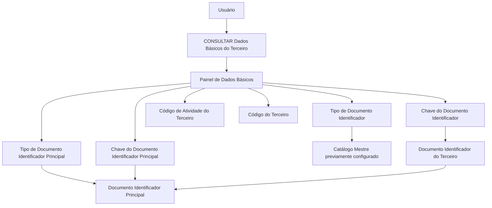

# Consulta de Dados Básicos do Terceiro no Reef.core

## 1. Metadados do Documento
- **Arquivo de Origem:** `Não identificado`
- **Tipo de Documento:** Manual Operacional
- **Domínio / Sistema:** Reef.core / Documentación Reef / Mapfre
- **Público-Alvo:** Operação, Negócio, Analistas Funcionais e Desenvolvedores
- **Data/Versão Identificada:** Não identificada

---

## 2. Resumo Executivo & Contexto de Negócio

O documento descreve a funcionalidade **“CONSULTAR Datos Básicos del Tercero”** no sistema Reef.core. O objetivo declarado é visualizar os dados identificadores de um Terceiro no sistema, abrangendo pessoa física ou pessoa jurídica.

A tela de dados básicos apresenta atributos em uma sequência de visualização definida da esquerda para a direita e de cima para baixo. Entre as informações apresentadas estão o tipo e a chave do documento identificador, o código de atividade e o código interno do Terceiro.

A documentação também descreve a associação entre documentos identificadores do Terceiro e um documento identificador principal. Essa associação permite relacionar vários documentos a um documento básico ou principal.

O conteúdo não detalha fluxos de autenticação, métodos HTTP, contratos de API, persistência de dados, permissões além da ação de consulta, nem regras de manutenção dos catálogos mestres.

---

## 3. Arquitetura, Componentes & Tecnologias Envolvidas

| Componente / Termo | Papel identificado no documento |
| :--- | :--- |
| Reef.core | Sistema no qual os dados básicos do Terceiro são visualizados. |
| Tela / painel de dados básicos | Área que apresenta os atributos identificadores do Terceiro. |
| Catálogo mestre | Fonte previamente configurada para a relação de tipos de documentos identificadores. |
| Terceiro | Pessoa física ou jurídica identificada no sistema. |
| Documento identificador principal | Documento ao qual o tipo e a chave de outros documentos do Terceiro podem ser relacionados. |
| Código de atividade do Terceiro | Código associado à atividade do Terceiro. |
| Código interno do Terceiro | Código atribuído automática ou manualmente quando a atividade do Terceiro exige código interno. |



> **Nota de Análise:** O documento descreve uma relação funcional entre documentos identificadores e um documento principal, mas não especifica o modelo de dados, as chaves de relacionamento, interfaces técnicas ou serviços responsáveis pela consulta.

---

## 4. Regras de Negócio, Especificações Funcionais & Processos

### Objetivo funcional
A funcionalidade permite visualizar os dados identificadores do Terceiro no sistema Reef.core.

### Ação habilitada
A única ação explicitamente indicada é:

- **CONSULTAR**

### Sequência de visualização
Os atributos da informação são apresentados segundo a seguinte orientação:

1. Da esquerda para a direita.
2. De cima para baixo.

### Regras para identificação do Terceiro

1. O **Tipo Documento Identificador** informa o tipo de documento utilizado para identificar uma pessoa física ou jurídica.
2. Os tipos de documentos exibidos devem estar previamente configurados no catálogo mestre do Reef.core.
3. A **Chave do Documento Identificador** apresenta a chave do Terceiro.
4. O **Código de Atividade do Terceiro** apresenta o código da atividade associada ao Terceiro.
5. O **Código do Terceiro** é o código interno atribuído pelo sistema.
6. O código interno pode ser atribuído automaticamente quando a atividade do Terceiro exigir código interno e a configuração determinar atribuição automática pelo sistema.
7. O código interno pode ser atribuído manualmente quando a atividade do Terceiro determinar a obrigatoriedade de atribuir um código ao Terceiro.
8. O **Tipo Documento Identificador Principal** mostra o tipo de documento principal ao qual o tipo e a chave do documento do Terceiro estão relacionados.
9. A relação com o documento principal permite relacionar vários documentos a um documento básico.
10. A **Chave do Documento Identificador Principal** mostra a chave do documento principal com a qual o tipo e a chave do documento do Terceiro serão relacionados.
11. A relação da chave do documento identificador principal permite conectar diversos documentos a um documento principal.

---

## 5. Tabelas de Parâmetros, Ambientes e Estruturas de Dados

| Item / Parâmetro | Descrição / Função | Tipo / Valores / Formato | Ambiente / Observações |
| :--- | :--- | :--- | :--- |
| Ação habilitada | Permite visualizar dados básicos do Terceiro. | `CONSULTAR` | Nenhuma outra ação é descrita. |
| Tipo Documento Identificador | Mostra o tipo de documento que identifica pessoa física ou jurídica. | Tipo de documento configurado | A relação de tipos deve estar previamente configurada no catálogo mestre do Reef.core. |
| Chave do Documento Identificador | Mostra a chave do Terceiro. | Chave de documento | O formato da chave não é especificado. |
| Código de Atividade do Terceiro | Indica o código da atividade do Terceiro. | Código de atividade | Valores permitidos não detalhados. |
| Código do Terceiro | Código interno atribuído ao Terceiro. | Código interno do sistema | Pode ser automático ou manual conforme configuração e obrigatoriedade da atividade. |
| Tipo Documento Identificador Principal | Mostra o tipo do documento principal relacionado ao documento do Terceiro. | Tipo de documento | Permite relacionar vários documentos a um documento básico. |
| Chave do Documento Identificador Principal | Mostra a chave do documento principal relacionado ao documento do Terceiro. | Chave de documento | Permite conectar diversos documentos a um documento principal. |
| Catálogo mestre | Mantém a relação de tipos de documentos identificadores. | Configuração prévia | Citado como catálogo mestre do Reef.core. |

---

## 6. Bateria de Perguntas & Respostas para RAG (FAQ Sintético)

### P1: Qual é o objetivo da funcionalidade “CONSULTAR Datos Básicos del Tercero”?
**R:** O objetivo é visualizar no sistema Reef.core os dados identificadores de um Terceiro.

### P2: Qual ação está habilitada na funcionalidade de dados básicos do Terceiro?
**R:** O documento indica exclusivamente a ação **CONSULTAR** para a funcionalidade apresentada.

### P3: Como os atributos de dados básicos são organizados na tela?
**R:** Os atributos são apresentados da esquerda para a direita e de cima para baixo.

### P4: O que representa o Tipo Documento Identificador do Terceiro?
**R:** O Tipo Documento Identificador mostra o tipo de documento utilizado para identificar uma pessoa física ou jurídica, de acordo com os tipos previamente configurados no catálogo mestre do Reef.core.

### P5: De onde vêm os tipos de documentos identificadores apresentados para o Terceiro?
**R:** Os tipos de documentos identificadores devem ter sido previamente configurados no catálogo mestre do Reef.core.

### P6: O que a Chave do Documento Identificador mostra?
**R:** A Chave do Documento Identificador mostra a chave do Terceiro.

### P7: Quando o Código do Terceiro pode ser atribuído automaticamente?
**R:** O Código do Terceiro pode ser atribuído automaticamente pelo sistema quando a atividade do Terceiro exigir um código interno e houver configuração para atribuição automática pelo sistema.

### P8: Quando o Código do Terceiro pode ser atribuído manualmente?
**R:** O Código do Terceiro pode ser atribuído manualmente quando a atividade do Terceiro determinar que é obrigatório atribuir um código ao Terceiro.

### P9: Qual é a função do Tipo Documento Identificador Principal?
**R:** O Tipo Documento Identificador Principal mostra o tipo do documento principal ao qual o tipo e a chave do documento do Terceiro estão relacionados, permitindo relacionar vários documentos a um documento básico.

### P10: O que a Chave do Documento Identificador Principal permite relacionar?
**R:** A Chave do Documento Identificador Principal mostra a chave do documento principal e permite relacionar o tipo e a chave do documento do Terceiro a esse documento, conectando diversos documentos a um documento principal.

---

## 7. Glossário de Termos, Siglas & Conceitos-Chave

- **Reef.core:** Sistema citado como responsável pela consulta e pelo catálogo mestre de tipos de documentos.
- **Terceiro:** Pessoa física ou jurídica identificada no sistema.
- **Documento Identificador:** Documento utilizado para identificar o Terceiro.
- **Documento Identificador Principal:** Documento principal ao qual outros documentos identificadores do Terceiro podem ser relacionados.
- **Catálogo Mestre:** Cadastro previamente configurado que contém a relação de tipos de documentos.
- **Código de Atividade do Terceiro:** Código associado à atividade do Terceiro.
- **Código do Terceiro:** Código interno do sistema atribuído automática ou manualmente ao Terceiro, conforme regras da atividade.

---

## 8. Notas Críticas, Riscos & Limitações

- O documento não identifica o arquivo de origem, a data, a versão ou a autoria técnica da especificação.
- Não são detalhados métodos HTTP, APIs, contratos JSON, banco de dados, integrações ou mecanismos de autenticação.
- Não são informados os valores possíveis para código de atividade, código do Terceiro ou chaves de documentos.
- A documentação informa que o catálogo mestre deve ser previamente configurado, mas não descreve o processo, os responsáveis ou as validações para essa configuração.
- Não há detalhamento de mensagens de erro, regras de autorização, auditoria, paginação ou critérios de busca.
- **Nota de Análise:** O documento descreve a consulta de atributos identificadores, mas não detalha como o Terceiro é localizado antes da exibição do painel de dados básicos.

---

## 9. Conteúdo Bruto Estruturado (Referência Fiel)

```text
--- [PÁGINA 1 DE 2] ---

CONSULTAR Datos Básicos del Tercero
Objetivo
Visualizar los datos identicadores del Tercero en el sistema.
Acciones habilitadas
 CONSULTAR ( )
Datos Básicos
De izquierda a derecha y de arriba hacia abajo, los siguientes atributos determinan la secuencia de visualización de la Información.
Tipo Documento Identicador
Este Atributo del colapsador muestra el tipo de documento con el que se identica a la persona física o jurídica de acuerdo con la relación de
tipos de documentos que hayan sido congurados en el catálogo maestro de Reef.core previamente.
Clave del Documento Identicador
Este Atributo de la pantalla muestra la clave del Tercero.
Código de Actividad del Tercero
Esta propiedad indicará el código de la Actividad del Tercero.
Código del Tercero
Este dato será el código interno del sistema que se asignó al Tercero automáticamente en el supuesto que se hubiera congurado que la
actividad del tercero obligara a tener un código interno y este fuera asignado por el Sistema, o manualmente caso que la actividad del Tercero
determinara la obligatoriedad de asignar un código al Tercero.
Tipo Documento Identicador Principal
Documentation / DOCUMENTACIÓN Reef
DOCUMENTACIÓN Reef
Mapfredocument
DOCUMENTACIÓN Reef
Owner
user:agonzalez_mapfre.com
Lifecycle
Approved Source
 / 
 VL
Buscar Inicio Soluciones Arquitecturas APIs Componentes Cloud Documentación Zeus Reef Ayuda
ES


--- [PÁGINA 2 DE 2] ---

Este dato visualiza el tipo de documento principal con el que se relaciona el tipo y la clave del documento del Tercero pudiendo de esta
manera relacionar varios documentos con uno básico.
Clave del Documento Identicador Principal
Este campo del panel de datos básicos mostrará la clave del documento principal con el que se va a relacionar el tipo y la clave del
documento del Tercero pudiendo de esta manera conectar diversos documentos con un documento principal.
```
