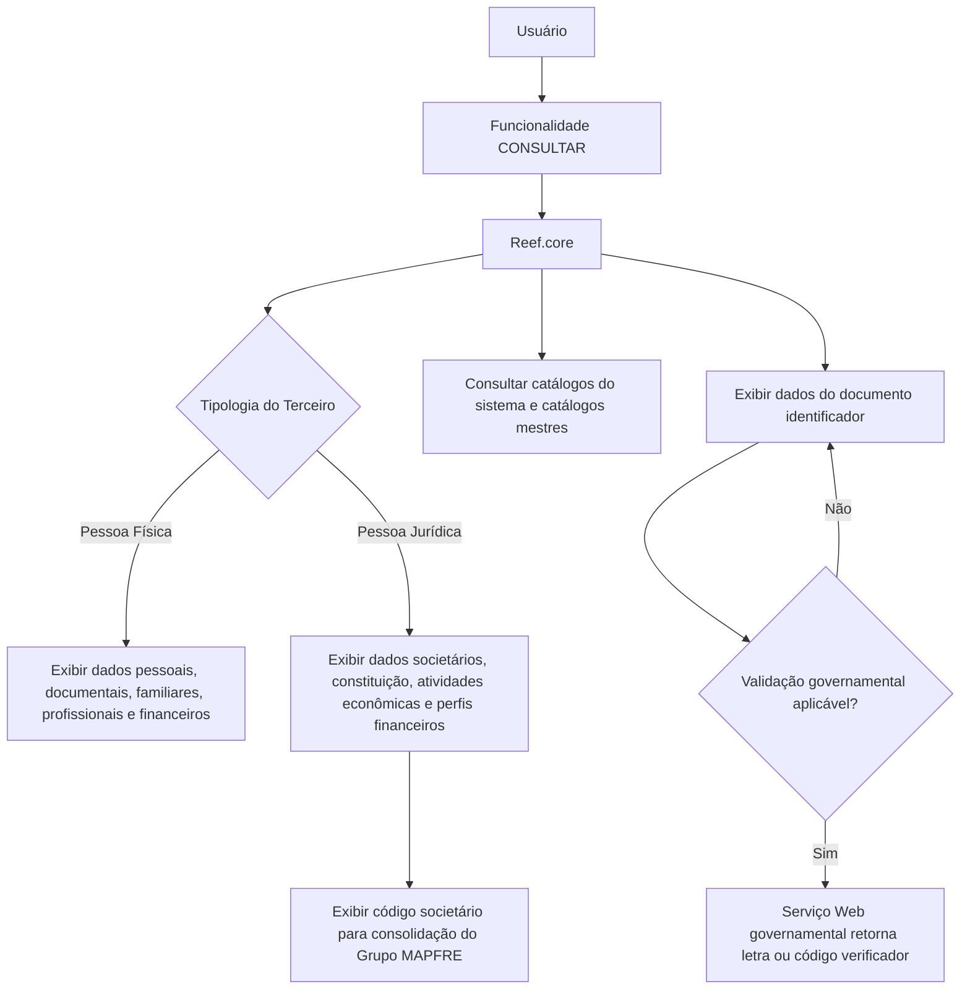

# Consultar Dados de Pessoa Física/Jurídica de Terceiro no Reef.core

## 1. Metadados do Documento
- **Arquivo de Origem:** Não identificado no conteúdo extraído
- **Tipo de Documento:** Manual Operacional
- **Domínio / Sistema:** Reef.core / DOCUMENTACIÓN Reef / Grupo MAPFRE
- **Público-Alvo:** Usuários funcionais, analistas de negócio, desenvolvedores e equipes de operação
- **Data/Versão Identificada:** Não identificada

---

## 2. Resumo Executivo & Contexto de Negócio

O documento descreve a funcionalidade de consulta dos dados complementares de um Terceiro no sistema Reef.core. A funcionalidade abrange Terceiros classificados como Pessoa Física ou Pessoa Jurídica e apresenta atributos de identificação, documentação, categorização, situação fiscal, dados societários, filiação, residência, atividade econômica, ocupação e perfil financeiro.

A ação habilitada apresentada é **CONSULTAR**. O objetivo declarado é visualizar informações complementares do Terceiro no sistema, incluindo dados cuja exibição depende da tipologia final atribuída no cadastro: Pessoa Física ou Pessoa Jurídica. A visualização segue uma ordem indicada como “da esquerda para a direita e de cima para baixo”.

O documento estabelece diversas regras condicionais. Dados pessoais, familiares, profissionais, financeiros e de nascimento são aplicáveis somente quando o Terceiro é Pessoa Física. Em contrapartida, informações de constituição, atividade econômica, folio registral, perfil financeiro e código societário são aplicáveis quando o Terceiro é Pessoa Jurídica.

O Reef.core utiliza catálogos mestres e catálogos do sistema para representar diversos códigos, como país, estado, província, localidade, idioma, moeda, profissão, ocupação, atividades econômicas, categorias, regimes fiscais e tipos societários. O documento também descreve controles de qualidade de dados documentais, como marca de comprovação, data de comprovação, observações e resultado de verificação obtido por serviço governamental em determinados países.

---

## 3. Arquitetura, Componentes & Tecnologias Envolvidas

### Componentes e conceitos identificados

| Componente / Conceito | Papel descrito no documento |
| :--- | :--- |
| **Reef.core** | Sistema que suporta a consulta e mantém catálogos mestres e internos relacionados ao Terceiro. |
| **Terceiro** | Entidade consultada; pode ser Pessoa Física ou Pessoa Jurídica. |
| **Pessoa Física** | Tipologia de Terceiro associada a dados pessoais, familiares, profissionais, financeiros e de residência. |
| **Pessoa Jurídica** | Tipologia de Terceiro associada a dados societários, constituição, atividades econômicas e perfis financeiros. |
| **Catálogos do Sistema** | Fonte de valores possíveis para códigos como país, estado, província, localidade, categoria e moeda. |
| **Catálogos mestres do Reef.core** | Fonte de valores para regime fiscal, profissões, ocupações, atividades econômicas, idiomas, perfis financeiros e tipos societários. |
| **Serviço Web governamental** | Serviço chamado em países onde o documento identificador do Terceiro exige validação que retorna letra ou código verificador. |
| **Grupo MAPFRE** | Contexto organizacional da consolidação societária por meio do código societário do Terceiro jurídico. |

### Fluxo funcional de consulta



> **Nota de Análise:** O documento descreve a consulta funcional e os atributos exibidos, mas não detalha interfaces técnicas, métodos HTTP, contratos JSON, bancos de dados, autenticação, rotas, URLs, servidores ou tecnologias de implementação.

---

## 4. Regras de Negócio, Especificações Funcionais & Processos

### 4.1 Objetivo e ação habilitada

1. A funcionalidade tem como objetivo visualizar dados complementares do Terceiro no sistema.
2. A ação habilitada explicitamente é **CONSULTAR**.
3. Os atributos são apresentados em uma ordem de visualização indicada como da esquerda para a direita e de cima para baixo.
4. Quando os campos não são especificados expressamente, podem ser visualizados tanto no registro de Pessoas Físicas quanto no de Pessoas Jurídicas.

### 4.2 Tipologia do Terceiro

1. A marca **Pessoa Física ou Pessoa Jurídica** indica a tipologia final atribuída ao Terceiro no momento de seu cadastro.
2. A marca é aplicável a atividades configuradas para associação tanto com pessoas físicas quanto com entidades jurídicas.
3. A tipologia determina quais grupos de atributos são aplicáveis à consulta.

### 4.3 Identificação e rastreabilidade

1. O **ID único do Terceiro** é atribuído automaticamente mediante execução de uma lógica de negócio local, desde que a configuração dos parâmetros da companhia exija identificação unívoca de Terceiros em todas as aplicações que gerenciam suas informações.
2. O ID único permite rastreabilidade, integração e cruzamento de dados entre sistemas.
3. O ID único não substitui a funcionalidade do atributo de código interno do Terceiro utilizado no Reef.core.

### 4.4 Documento identificador e qualidade de dados

1. A **Data de Emissão** representa a data de emissão do documento do Terceiro.
2. A **Data de Caducidade** representa a data de vencimento do documento do Terceiro.
3. O **País Emissor** apresenta o código do país emissor do documento identificador conforme o catálogo de Países do sistema.
4. O **Verificador do Documento Identificador** apresenta o resultado de uma chamada a Serviço Web governamental em países que exigem retorno de letra ou código verificador.
5. A **Marca de Comprovação** indica se o documento do Terceiro foi revisado e verificado em relação à qualidade de dados.
6. A **Data de Comprovação** é exibida quando a marca de comprovação indica que o documento foi revisado e comprovado.
7. As **Observações** apresentam texto explicativo ou observações sobre o método empregado na verificação quando o documento tiver sido revisado e validado.

### 4.5 Regras exclusivas de Pessoa Física

Os seguintes dados são condicionados à tipologia Pessoa Física:

- Por Conta Própria.
- Segundo Nome.
- Primeiro Apelido.
- Segundo Apelido.
- Apelido de Casado/a.
- Estado Civil.
- Nome e Apelidos do Cônjuge, quando o estado civil for coerente com o campo.
- Data de Nascimento.
- Data de Falecimento.
- Data de Início de Residência.
- Nacionalidade.
- Tipo de Nacionalidade.
- Gênero.
- Percentual de Deficiência.
- Profissão.
- Ocupação.
- Nome da Empresa.
- Tipo de Empresa.
- Tipo de Emprego.
- Rendimentos Mensais Estimados.
- Moeda dos rendimentos mensais.
- Nível de Estudos.
- Titulação.
- Número de Filhos.

O tipo de emprego distingue entre assalariado e autônomo. O documento define autônomos como pessoas físicas que exercem, de forma habitual, pessoal, direta, por conta própria e fora do âmbito de direção e organização de outra pessoa, uma atividade econômica ou profissional com finalidade lucrativa, empregando ou não trabalhadores assalariados.

### 4.6 Regras exclusivas de Pessoa Jurídica

Os seguintes dados são condicionados à tipologia Pessoa Jurídica:

- Atividade Econômica.
- Tipo de Atividade Econômica.
- Folio Registral.
- Data de Constituição.
- Perfil Financeiro da Atividade Principal.
- Perfil Financeiro das Atividades Secundárias.
- Código Tipo Sociedade.

O **Folio Registral** identifica e diferencia a Pessoa Jurídica de outros Terceiros com documentos similares. A **Data de Constituição** representa a data em que o Terceiro Jurídico foi constituído como sociedade por ato jurídico.

### 4.7 Regras aplicáveis a ambas as tipologias

1. **Alias do Terceiro** pode ser visualizado independentemente de o Terceiro ser Pessoa Física ou Jurídica.
2. **Sociedade para Consolidação em Grupo MAPFRE - GL** exibe o código societário do Terceiro jurídico para consolidação em processos do Grupo MAPFRE, tanto para Pessoas Físicas quanto Jurídicas, conforme descrito no documento.
3. **País, Estado, Província e Localidade de Nascimento/Constituição** representam, respectivamente, o local de nascimento da Pessoa Física ou de constituição da Pessoa Jurídica.
4. **Nome** representa o nome da Pessoa Física ou a razão social da Pessoa Jurídica.
5. **Tratamento** e **Posposto** são atributos do nome do Terceiro.
6. **Idioma** representa a preferência de idioma nas comunicações da entidade seguradora com o Terceiro.
7. **Obrigações Fiscais em outros Países**, quando ativado, habilita o botão para consulta dos países em que o Terceiro possui obrigações fiscais.

---

## 5. Tabelas de Parâmetros, Ambientes e Estruturas de Dados

### 5.1 Consulta, identificação e classificação

| Item / Parâmetro | Descrição / Função | Tipo / Valores / Formato | Ambiente / Observações |
| :--- | :--- | :--- | :--- |
| Ação habilitada | Permite consultar dados complementares do Terceiro. | CONSULTAR | Reef.core |
| Pessoa Física ou Pessoa Jurídica | Indica a tipologia final atribuída ao Terceiro no cadastro. | Marca de verificação | Aplicável em atividades configuradas para ambas as tipologias. |
| ID único do Terceiro | Código automaticamente atribuído para identificação unívoca, rastreabilidade, integração e cruzamento de dados. | Código / identificador | Depende da configuração dos parâmetros da companhia e de lógica de negócio local. Não substitui o código interno do Terceiro no Reef.core. |
| Categoria do Terceiro | Código da categoria atribuída ao Terceiro. | Código de catálogo | Catálogo do sistema. |
| Regime Fiscal | Código do regime fiscal do Terceiro. | Código de catálogo | Catálogo mestre do Reef.core. |
| Alias do Terceiro | Apelido ou sobrenome do Terceiro. | Texto | Aplicável a Pessoa Física e Pessoa Jurídica. |
| Pessoa Politicamente Exposta | Permite consulta no painel de informação correspondente quando a marca estiver ativada. | Marca de verificação | O documento não detalha o painel nem os critérios de ativação. |
| Por Conta Própria | Identifica o Terceiro como trabalhador por conta própria. | Indicador | Aplicável somente à Pessoa Física. |

### 5.2 Dados documentais e verificação

| Item / Parâmetro | Descrição / Função | Tipo / Valores / Formato | Ambiente / Observações |
| :--- | :--- | :--- | :--- |
| Data de Emissão | Data de emissão do documento do Terceiro. | Data | Documento identificador do Terceiro. |
| Data de Caducidade | Data de vencimento do documento do Terceiro. | Data | Documento identificador do Terceiro. |
| País Emissor | Código do país emissor do documento identificador. | Código de país | Catálogo de Países do sistema. |
| Verificador do Documento Identificador | Resultado da chamada a serviço fornecido pelo governo. | Letra ou código verificador | Aplicável em países que exigem validação do documento. |
| Marca de Comprovação | Indica se o documento foi revisado e verificado. | Marca / estado | Relacionada à qualidade dos dados do Terceiro. |
| Data de Comprovação | Data em que a revisão e comprovação foram realizadas. | Data | Exibida se o documento foi revisado e comprovado. |
| Observações | Texto explicativo sobre o método utilizado na comprovação. | Texto | Exibido se o documento foi revisado e validado. |

### 5.3 Dados societários e econômicos

| Item / Parâmetro | Descrição / Função | Tipo / Valores / Formato | Ambiente / Observações |
| :--- | :--- | :--- | :--- |
| Sociedade para Consolidação em Grupo MAPFRE - GL | Código societário para consolidação em processos do Grupo MAPFRE. | Código societário | O documento indica uso para Pessoas Físicas e Jurídicas. |
| Atividade Econômica | Classificação das atividades econômicas em Terceiros Jurídicos. | Classificação | Configurada pela entidade seguradora. |
| Tipo de Atividade Econômica | Código do tipo de atividade econômica. | Código | Catálogo mestre de Atividades Econômicas. |
| Folio Registral | Número que identifica e diferencia a Pessoa Jurídica de Terceiros com documentos similares. | Número | Aplicável à Pessoa Jurídica. |
| Data de Constituição | Data de constituição do Terceiro Jurídico como sociedade. | Data | Aplicável à Pessoa Jurídica. |
| Perfil Financeiro Atividade Principal | Código do perfil financeiro da atividade econômica principal. | Código | Catálogo mestre do sistema; aplicável à Pessoa Jurídica. |
| Perfil Financeiro Atividades Secundárias | Código do perfil financeiro para atividades econômicas secundárias. | Código | Catálogo mestre do sistema; aplicável à Pessoa Jurídica. |
| Código Tipo Sociedade | Tipo de código societário do Terceiro. | Código | Catálogo mestre do sistema; aplicável à Pessoa Jurídica. |

### 5.4 Dados de filiação, nome e situação pessoal

| Item / Parâmetro | Descrição / Função | Tipo / Valores / Formato | Ambiente / Observações |
| :--- | :--- | :--- | :--- |
| Tratamento | Tratamento de respeito anteposto ao nome do Terceiro. | Código / valor de tratamento | Reservado a determinadas pessoas de elevado status social, conforme a descrição. |
| Posposto | Código posposto ao nome próprio para indicar condição do Terceiro. | Código | Associado ao nome do Terceiro. |
| Nome | Nome da Pessoa Física ou razão social da Pessoa Jurídica. | Texto | Aplicável conforme tipologia. |
| Segundo Nome | Segundo e demais nomes do Terceiro. | Texto | Pessoa Física. |
| Primeiro Apelido | Primeiro sobrenome do Terceiro. | Texto | Pessoa Física. |
| Segundo Apelido | Segundo sobrenome do Terceiro. | Texto | Pessoa Física. |
| Apelido de Casado/a | Sobrenome de casado/a do Terceiro. | Texto | Pessoa Física; aplicável em países onde a prática é difundida. |
| Estado Civil | Código do estado civil do Terceiro. | Código | Pessoa Física. |
| Nome e Apelidos do Cônjuge | Nome completo do cônjuge. | Texto | Pessoa Física; depende de estado civil coerente. |
| Data de Nascimento | Data de nascimento do Terceiro. | Data | Pessoa Física. |
| Data de Falecimento | Data de falecimento do Terceiro. | Data | Pessoa Física. |
| Data de Início de Residência | Data de início de residência do Terceiro. | Data | Pessoa Física. |
| Nacionalidade | Nacionalidade do Terceiro. | Código ou valor não detalhado | Pessoa Física. |
| Tipo de Nacionalidade | Código de tipo de nacionalidade. | Código | Pessoa Física; codificação local da entidade seguradora. |
| Gênero | Gênero do Terceiro. | Valor não detalhado | Pessoa Física. |
| Número de Filhos | Número de descendentes do Terceiro. | Número | Pessoa Física. |

### 5.5 Localização, comunicação, profissão e finanças

| Item / Parâmetro | Descrição / Função | Tipo / Valores / Formato | Ambiente / Observações |
| :--- | :--- | :--- | :--- |
| País de Nascimento/Constituição | Código do país de nascimento ou de constituição. | Código de país | Catálogo de Países do sistema. |
| Estado de Nascimento/Constituição | Código do estado de nascimento ou de constituição. | Código de estado | Catálogo de Estados do sistema. |
| Província de Nascimento/Constituição | Código da província de nascimento ou de constituição. | Código de província | Catálogo de Províncias do sistema. |
| Localidade de Nascimento/Constituição | Código da localidade de nascimento ou de constituição. | Código de localidade | Catálogo de Localidades do sistema. |
| Idioma | Preferência para comunicações da entidade seguradora com o Terceiro. | Código de idioma | Catálogo mestre de Idiomas do sistema. |
| Percentual de Deficiência | Percentual de deficiência do Terceiro. | Percentual | Pessoa Física; conforme tabelas de graus de incapacidade do país. |
| Profissão | Código da profissão associada ao Terceiro. | Código | Pessoa Física; catálogo mestre de Profissões do Reef.core. |
| Ocupação | Código da ocupação associada ao Terceiro. | Código | Pessoa Física; catálogo mestre de Ocupações do Reef.core. |
| Nome da Empresa | Nome da empresa em que o Terceiro trabalha. | Texto | Pessoa Física. |
| Tipo de Empresa | Tipo de empresa em que o Terceiro trabalha. | Tipologia definida | Pessoa Física. |
| Tipo de Emprego | Classifica o emprego, distinguindo assalariado e autônomo. | Tipo de emprego | Pessoa Física. |
| Rendimentos Mensais Estimados | Valor dos rendimentos mensais do Terceiro. | Valor monetário | Pessoa Física. |
| Moeda | Código da moeda dos rendimentos mensais estimados. | Código de moeda | Pessoa Física; catálogo de moedas do sistema. |
| Nível de Estudos | Código do nível de escolaridade do Terceiro. | Código | Pessoa Física. |
| Titulação | Código da titulação do Terceiro. | Código | Pessoa Física. |
| Obrigações Fiscais em outros Países | Habilita botão de consulta dos países onde o Terceiro possui obrigações fiscais. | Campo ativado / desativado | O documento não detalha a tela ou os dados retornados pelo botão. |

---

## 6. Bateria de Perguntas & Respostas para RAG (FAQ Sintético)

### P1: Qual é o objetivo da funcionalidade CONSULTAR no Reef.core?
**R:** A funcionalidade CONSULTAR tem o objetivo de visualizar os dados complementares do Terceiro no sistema Reef.core. A consulta abrange dados documentais, de classificação, fiscais, societários, pessoais, profissionais e financeiros, conforme a tipologia Pessoa Física ou Pessoa Jurídica.

### P2: O que determina se os dados de Pessoa Física ou Pessoa Jurídica serão exibidos?
**R:** A marca “Pessoa Física ou Pessoa Jurídica” indica a tipologia final atribuída ao Terceiro durante seu cadastro. Essa tipologia determina os grupos de atributos aplicáveis: dados pessoais, familiares, profissionais e financeiros para Pessoa Física; e dados societários, econômicos e de constituição para Pessoa Jurídica.

### P3: Como funciona o ID único do Terceiro?
**R:** O ID único do Terceiro é atribuído automaticamente por lógica de negócio local quando os parâmetros da companhia exigem identificação unívoca dos Terceiros nas aplicações que gerenciam suas informações. O identificador apoia rastreabilidade, integração e cruzamento de dados entre sistemas, mas não substitui o código interno do Terceiro utilizado pelo Reef.core.

### P4: Como o Reef.core trata a validação do documento identificador do Terceiro?
**R:** Em países nos quais o documento exige consulta a um serviço fornecido pelo governo, o sistema realiza uma chamada a Serviço Web que retorna uma letra ou código verificador. O resultado é exibido no atributo Verificador do Documento Identificador. A qualidade documental também é representada pela Marca de Comprovação, Data de Comprovação e Observações sobre o método utilizado na verificação.

### P5: Quando a Data de Comprovação do documento é exibida?
**R:** A Data de Comprovação é exibida quando o estado da Marca de Comprovação implica que o documento do Terceiro foi revisado e comprovado. O documento não define valores possíveis para essa marca nem o processo técnico de revisão.

### P6: Quais dados pessoais são exclusivos para Terceiros classificados como Pessoa Física?
**R:** Para Pessoa Física, o documento prevê dados como segundo nome, sobrenomes, apelido de casado/a, estado civil, cônjuge, datas de nascimento, falecimento e início de residência, nacionalidade, gênero, deficiência, profissão, ocupação, empresa, tipo de emprego, rendimentos mensais, moeda, escolaridade, titulação e número de filhos.

### P7: Como o tipo de emprego é descrito para Pessoa Física?
**R:** O Tipo de Emprego permite distinguir entre assalariado e autônomo. O documento caracteriza o autônomo como pessoa física que exerce habitual, pessoal e diretamente uma atividade econômica ou profissional por conta própria, fora da direção e organização de outra pessoa, com finalidade lucrativa e podendo ou não empregar trabalhadores assalariados.

### P8: Quais campos são exclusivos de Pessoa Jurídica?
**R:** Os campos exclusivos de Pessoa Jurídica incluem Atividade Econômica, Tipo de Atividade Econômica, Folio Registral, Data de Constituição, Perfil Financeiro da Atividade Principal, Perfil Financeiro das Atividades Secundárias e Código Tipo Sociedade.

### P9: O que é o Folio Registral no contexto do Terceiro Jurídico?
**R:** O Folio Registral é o número que identifica e diferencia um Terceiro Jurídico de outros Terceiros com documentos similares. O documento o descreve como uma numeração individual chamada de Folio ou Folio Registral.

### P10: Como são obtidos os códigos de país, estado, província e localidade?
**R:** Os campos País, Estado, Província e Localidade de Nascimento/Constituição contêm códigos obtidos das relações de valores existentes nos respectivos catálogos do sistema. Esses campos descrevem o local de nascimento da Pessoa Física ou o local de constituição da Pessoa Jurídica.

### P11: Para que serve o campo Sociedade para Consolidação em Grupo MAPFRE - GL?
**R:** O campo permite visualizar o código societário do Terceiro jurídico para consolidação nos processos do Grupo MAPFRE. O texto informa que esse campo se aplica tanto a Pessoas Físicas quanto a Pessoas Jurídicas.

### P12: O que acontece quando Obrigações Fiscais em outros Países está ativado?
**R:** Quando o campo Obrigações Fiscais em outros Países está ativado, é habilitado o botão correspondente para consultar informações dos países nos quais o Terceiro possui obrigações fiscais. O documento não detalha os campos exibidos por essa consulta.

---

## 7. Glossário de Termos, Siglas & Conceitos-Chave

- **Reef.core:** Sistema mencionado como responsável por suportar a consulta de Terceiros e manter determinados catálogos mestres.
- **Terceiro:** Entidade cadastrada e consultada no sistema, classificada como Pessoa Física ou Pessoa Jurídica.
- **Pessoa Física:** Terceiro individual para o qual se aplicam dados pessoais, familiares, profissionais, financeiros e de residência.
- **Pessoa Jurídica:** Entidade constituída por ato jurídico, associada a informações societárias, econômicas e de perfil financeiro.
- **ID único do Terceiro:** Identificador automaticamente atribuído para identificação unívoca, rastreabilidade e integração.
- **Marca de Comprovação:** Indicador que determina se o documento do Terceiro foi revisado e verificado.
- **Folio Registral:** Número individual que identifica e diferencia uma Pessoa Jurídica de outros Terceiros com documentos similares.
- **GL:** Sigla presente em “Sociedade para Consolidação em Grupo MAPFRE - GL”; o documento não explicita seu significado.
- **Grupo MAPFRE:** Grupo citado como contexto dos processos de consolidação societária.
- **Perfil Financeiro:** Código relativo ao perfil financeiro de atividades econômicas principal ou secundárias de um Terceiro Jurídico.
- **Catálogo mestre:** Relação de valores possíveis mantida pelo sistema para representação padronizada de códigos.
- **Serviço Web governamental:** Serviço fornecido por governo de determinados países para devolver letra ou código verificador do documento do Terceiro.

---

## 8. Notas Críticas, Riscos & Limitações

- O conteúdo descreve atributos funcionais de consulta, mas não especifica APIs, métodos HTTP, contratos JSON, eventos, modelo físico de dados, autenticação, autorização, integrações técnicas ou mecanismos de auditoria.
- Não foram identificadas URLs, ambientes, servidores, portas, repositórios, pipelines de CI/CD ou caminhos de logs.
- O documento cita lógica de negócio local para geração do ID único, mas não detalha a regra de geração, unicidade, tratamento de colisões ou sistema responsável.
- O documento cita uma chamada a Serviço Web governamental para determinados países, mas não identifica países, critérios de acionamento, protocolo, disponibilidade, tratamento de falhas ou retentativas.
- Diversos campos dependem de catálogos mestres ou catálogos do sistema; o conteúdo não fornece códigos, valores permitidos, governança dos catálogos ou responsáveis por sua manutenção.
- O documento afirma que Obrigações Fiscais em outros Países habilita um botão de consulta, mas não detalha a informação apresentada, o comportamento de navegação ou as regras de acesso.
- A expressão “Sociedade para Consolidação em Grupo MAPFRE - GL” apresenta aparente associação com Terceiro jurídico, mas o texto também informa aplicação para Pessoas Físicas e Jurídicas. O documento não resolve essa ambiguidade funcional.
- **Nota de Análise:** O material é uma especificação descritiva de campos de interface. Não deve ser utilizado isoladamente para implementar integrações ou validações técnicas sem documentação complementar.

---

## 9. Conteúdo Bruto Estruturado (Referência Fiel)

```text
--- [PÁGINA 1 DE 6] ---

CONSULTAR Datos Persona Física/Jurídica del Tercero
Objetivo
Visualizar los datos complementarios del Tercero en el sistema.
Acciones habilitadas
 CONSULTAR ( )
Datos Persona Persona Física/Jurídica
De izquierda a derecha y de arriba hacia abajo, los siguientes atributos determinan el orden de la visualización de la información.
Si no se especi�ca o indica expresamente los Campos se visualizarán indistintamente tanto en el registro de información de las Personas
Físicas como para las Personas Jurídicas.
Persona Física o Persona Jurídica
Esta marca de veri�cación, en aquellas actividades en las que se haya con�gurado la posibilidad de estar asociada tanto para personas
físicas como para entidades jurídicas, indica la tipología del Tercero �nalmente asignada en el alta del Tercero.
ID único del Tercero
Siempre y cuando se haya de�nido en la con�guración de los parámetros de la compañía la necesidad de identi�car unívocamente a los
Terceros en todas las aplicaciones que gestionen su información, este atributo contendrá el código del Identi�cador único que se asignará
automáticamente al Tercero mediante la ejecución de una lógica de negocio local, permitiendo de esta manera la trazabilidad, integración y
cruce de datos entre los sistemas.
Este atributo NO SUSTITUYE en ningún caso la funcionalidad soportada por el atributo que identi�ca el código del tercero que es de uso
interno en Reef.core.
Documentation / DOCUMENTACIÓN Reef
DOCUMENTACIÓN Reef
Mapfredocument
DOCUMENTACIÓN Reef
Owner
user:agonzalez_mapfre.com
Lifecycle
Approved Source
 / 
 VL
Buscar Inicio Soluciones Arquitecturas APIs Componentes Cloud Documentación Zeus Reef Ayuda
ES

--- [PÁGINA 2 DE 6] ---

Persona Políticamente Expuesta
Si esta marca estuviera activada se podrá efectuar la consulta en el panel de información correspondiente.
Fecha de Emisión
Esta propiedad plasma la Fecha de Emisión del Documento del Tercero.
Fecha de Caducidad
Esta propiedad muestra la Fecha de Caducidad del Documento del Tercero.
País Emisor
Este Campo visualiza el código del país emisor del documento identi�cador del Tercero de acuerdo con la relación de posibles valores
existentes en el catálogo de Países existente en el Sistema.
Veri�cador del Documento Identi�cador
Puesto que existen países en los que con el documento del Tercero han de realizar una llamada a un Servicio provisto por el gobierno,
Servicio Web que devolverá una letra o un código veri�cador, este código mostrará el resultado de dicha llamada.
Marca de Comprobación
Este dato determinará si documento del Tercero ha sido o no revisado y veri�cado, todo ello en relación con la calidad de los datos del
Tercero en el sistema.
Fecha de Comprobación
En el supuesto que el estado de la marca de comprobación implicara que el documento del Tercero hubiera sido revisado y comprobado, este
campo mostrará la fecha en la que esta acción se realizó.
Observaciones
En el supuesto que el documento del Tercero hubiera sido revisado y validado este campo muestra el texto aclaratorio u observaciones sobre
el método que se empleó para su comprobación.
Categoría del Tercero
Este atributo contiene el código de la categoría asignada al Tercero de acuerdo con la relación de posibles valores existentes en el catálogo
del Sistema.
Régimen Fiscal
Este dato contiene el código del régimen �scal del Tercero de acuerdo con la relación de posibles valores existentes en el catálogo maestro
de Reef.core.
Por Cuenta Propia
Este dato identi�ca al Tercero como Trabajador por cuenta propia siempre y cuando el Tercero sea persona física.
Persona Legal
Visualizar los datos de ámbito económico del Tercero en el sistema.
Alias del Tercero
Este dato visualiza el apodo o sobrenombre del Tercero independientemente si este es persona física o jurídica.
Sociedad para Consolidación en Grupo MAPFRE - GL

--- [PÁGINA 3 DE 6] ---

Este campo permite muestra el código societario del tercero jurídico para su consolidación en los procesos del Grupo MAPFRE tanto para
personas físicas como jurídicas.
Actividad Económica
Este atributo contiene una clasi�cación de las actividades económicas en los Terceros Jurídicos con�gurada por la entidad aseguradora.
Tipo de Actividad Económica
Este Campo representa el código del tipo de la actividad económica del Tercero de acuerdo con los posibles valores con�gurados en el
catálogo maestro de Actividades Económicas.
Folio Registral
Si el Tercero es persona Jurídica este campo representa el número que lo identi�ca y diferencia del resto de terceros con documentos
similares (esta numeración individual recibe el nombre de Folio o Folio Registral).
Fecha de Constitución
Puesto que las personas jurídicas nacen como consecuencia de un acto jurídico (acto de constitución) este dato identi�ca la fecha en la que
el Tercero Jurídico fue constituido como sociedad.
Persona
El objetivo de este sub bloque de datos es Visualizar los datos de �liación del Asegurado de acuerdo con la tipología del Tercero: Persona
Física o bien Persona Jurídica.
Tratamiento
Este Atributo muestra el Tratamiento de respeto que se antepone al nombre del Tercero y que por cortesía o por respeto está reservado a
determinadas personas de elevado rango social.
Pospuesto
Este Dato contiene el código del pospuesto al Nombre Propio del Tercero para indicar alguna condición de este.
Nombre
Este Atributo contiene el nombre del Tercero en caso que el Tercero sea una Persona Física o la Razón Social en el supuesto que sea una
Persona Jurídica.
Segundo Nombre
Siempre y cuando el Tercero sea una Persona Física, este dato contendrá el segundo y sucesivos nombres del Tercero.
Primer Apellido
Siempre y cuando el Tercero sea una Persona Física, este dato contendrá el primer Apellido del Tercero.
Segundo Apellido

--- [PÁGINA 4 DE 6] ---

Siempre y cuando el Tercero sea una Persona Física, este dato contendrá el segundo Apellido del Tercero.
Apellido de Casado/a
Siempre y cuando el Tercero sea una Persona Física, este dato contendrá el Apellido de casado/a del Tercero (en aquellos países en los que
esta costumbre relacionada con los nombres de soltero en el matrimonio sea de uso extendido).
Estado Civil
Siempre y cuando el Tercero sea una Persona Física, este dato contendrá el código del estado civil del Tercero.
Nombre y Apellidos del Cónyuge
Siempre y cuando el Tercero sea una Persona Física y su estado civil sea coherente con el posible valor de este campo, este dato contendrá
el Nombre y los Apellidos del cónyuge del Tercero.
Fecha de Nacimiento
Siempre y cuando el Tercero sea una Persona Física, este dato indicará la Fecha de nacimiento del Tercero.
Fecha de Fallecimiento
Siempre y cuando el Tercero sea una Persona Física este campo indicará la Fecha de fallecimiento del Tercero.
Fecha de Inicio de Residencia
Siempre y cuando el Tercero sea una Persona Física este dato indicará la Fecha de inicio de Residencia del Tercero.
Nacionalidad
Siempre y cuando el Tercero sea una Persona Física, este dato indicará la nacionalidad del Tercero.
Tipo de Nacionalidad
Siempre y cuando el Tercero sea una Persona Física este campo contendrá el código de tipo de nacionalidad del Tercero de acuerdo con la
codi�cación efectuada localmente por parte de la entidad aseguradora para su posterior uso en los procesos internos de la entidad.
País de Nacimiento/Constitución
Este Campo contiene el código del país en el que nació la Persona o se haya constituido el Tercero Jurídico, de acuerdo con la relación de
posibles valores del catálogo de países existente en el Sistema.
Estado de Nacimiento/Constitución
Este Campo contiene el código del estado en el que nació la Persona o se haya constituido el Tercero Jurídico, de acuerdo con la relación de
posibles valores del catálogo de estados existente en el Sistema.
Provincia de Nacimiento/Constitución
Este Campo contiene el código de la provincia en la que nació la Persona o se haya constituido el Tercero Jurídico, de acuerdo con la relación
de posibles valores del catálogo de provincias existente en el Sistema.
Localidad de Nacimiento/Constitución
Este Campo contiene el código de la localidad en la que nació la Persona o se haya constituido el Tercero Jurídico, de acuerdo con la relación
de posibles valores del catálogo de localidades existente en el Sistema.
Idioma
Este Campo contiene la preferencia del idioma en las comunicaciones de la entidad aseguradora con el Tercero, de acuerdo con la relación de
posibles valores existentes en el catálogo maestro de Idiomas del Sistema.
Género
Siempre y cuando el Tercero sea una Persona Física este campo indicará el género del Tercero.

--- [PÁGINA 5 DE 6] ---

Porcentaje Discapacidad
Siempre y cuando el Tercero sea una Persona Física este dato visualizará el porcentaje de Discapacidad del Tercero de acuerdo con las
tablas de baremos y grados de minusvalías del país.
Profesión
Siempre y cuando el Tercero sea una Persona Física este Campo muestra el código de la profesión asociada al Tercero de acuerdo con la
relación de posibles valores existentes en el catálogo maestro de Profesiones de Reef.core.
Ocupación
Siempre y cuando el Tercero sea una Persona Física este Campo contiene el código de la ocupación asociada al Tercero de acuerdo con la
relación de posibles valores existentes en el catálogo maestro de Ocupaciones de Reef.core.
Nombre de la Empresa
Siempre y cuando el Tercero registrado sea una Persona Física este dato indicará el nombre de la Empresa en la que el Tercero esté ocupado.
Tipo de Empresa
Siempre y cuando el Tercero registrado sea una Persona Física este dato mostrará el tipo de empresa en la que el Tercero está ocupado de
acuerdo con una de las tipologías de�nidas.
Tipo de Empleo
Siempre y cuando el Tercero sea Persona Física este dato visualiza el tipo de empleo del Tercero y distinguir si es un Asalariado o un
Autónomo (Personas físicas que realizan de forma habitual, personal, directa, por cuenta propia y fuera del ámbito de dirección y
organización de otra persona, una actividad económica o profesional a título lucrativo, den o no ocupación a trabajadores por cuenta ajena)
Ingresos Mensuales Estimados
Siempre y cuando el Tercero sea una Persona Física este Campo representa el importe de los Ingresos Mensuales del Tercero.
Moneda
Siempre y cuando el Tercero sea una Persona Física este dato muestra el código de la Moneda en la que se han expresado los Ingresos
Mensuales Estimados del Tercero de acuerdo con la relación de posibles valores existentes en el catálogo de monedas del Sistema.
Nivel de Estudios
Siempre y cuando el Tercero sea una Persona Física este campo determina el código del nivel de estudios del Tercero.
Titulación
Siempre y cuando el Tercero sea una Persona Física este campo muestra el código de la titulación del Tercero.
Per�l Financiero Act. Principal
Siempre y cuando el Tercero sea una Persona Jurídica este dato observa el código del per�l �nanciero del Tercero de su actividad económica
principal de acuerdo con la relación de posibles valores existentes en el catálogo maestro del Sistema.
Per�l Financiero Act. Secundarias
Siempre y cuando el Tercero sea una Persona Jurídica este dato contendrá el código del per�l �nanciero del Tercero para sus actividades
económicas secundarias de acuerdo con la relación de posibles valores existentes en el catálogo maestro del Sistema.
Código Tipo Sociedad
Siempre y cuando el Tercero sea una Persona Jurídica este Dato contendrá el tipo de código societario del Tercero de acuerdo con la relación
de posibles valores existentes en el catálogo maestro existente en el Sistema.
Obligaciones Fiscales en otros Países

--- [PÁGINA 6 DE 6] ---

Si este campo está activado, se habilitará el botón correspondiente que permitirá consultar la información de aquellos países en los que el
Tercero tuviera Obligaciones Fiscales.
Número de Hijos ( )
Siempre y cuando el Tercero sea una Persona Física este atributo visualiza el número de vástagos del Tercero.
```
