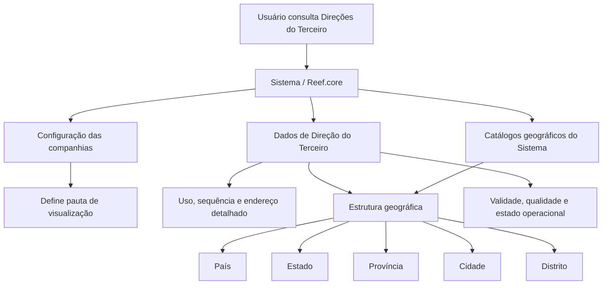

# Consulta de Direções de Terceiros no Reef.core

## 1. Metadados do Documento
- **Arquivo de Origem:** Não identificado no conteúdo fornecido
- **Tipo de Documento:** Especificação Funcional / Documentação de Sistema
- **Domínio / Sistema:** Reef.core / DOCUMENTACIÓN Reef / Mapfre
- **Público-Alvo:** Analistas funcionais, desenvolvedores, operação e equipes de negócio
- **Data/Versão Identificada:** Não identificada

---

## 2. Resumo Executivo & Contexto de Negócio

O documento descreve a funcionalidade de **consulta e visualização das Direções do Terceiro** no sistema Reef.core. O objetivo declarado é disponibilizar as direções associadas a um terceiro na data da consulta, por meio da ação habilitada de consulta.

A visualização dos dados de endereço pode obedecer a uma de duas pautas ou sequências, definidas pela configuração das companhias. O texto disponível detalha somente a primeira sequência de apresentação, organizada da esquerda para a direita e de cima para baixo. A segunda pauta é mencionada, mas não é descrita.

A funcionalidade reúne atributos de uso, ordenação, estrutura geográfica, endereço detalhado, geolocalização, qualidade de dados, validade e status operacional. A estrutura geográfica é apresentada em cinco níveis: país, estado, província, cidade e distrito.

O documento também estabelece controles operacionais relevantes: apenas uma direção pode ser marcada como direção por defeito; uma direção inabilitada não deve ser utilizada nos processos operacionais da entidade; e a marca de comprovação informa se a direção foi revisada e verificada em relação à qualidade dos dados.

---

## 3. Arquitetura, Componentes & Tecnologias Envolvidas

### Componentes e sistemas citados

| Componente / Termo | Papel identificado no documento |
| :--- | :--- |
| **Reef.core** | Sistema no qual o número de sequência das direções do terceiro é atribuído e exibido automaticamente. |
| **Sistema** | Mantém catálogos geográficos, configurações de companhias e dados de direções de terceiros. |
| **Catálogo de países** | Fonte de possíveis valores para o primeiro nível geográfico: país. |
| **Catálogo de estados** | Fonte de possíveis valores para o segundo nível geográfico: estado. |
| **Catálogo de províncias** | Fonte de possíveis valores para o terceiro nível geográfico: província. |
| **Catálogo de localidades** | Fonte de possíveis valores para o quarto nível geográfico: cidade. |
| **Catálogo de distritos** | Fonte de possíveis valores para o quinto nível geográfico: distrito. |
| **Callejero local** | Referência local para tipo de via e composição detalhada da direção. |
| **Entidade asseguradora** | Entidade que realiza a codificação local do tipo de domicílio e possui um país de referência. |
| **Configuração das companhias** | Define o modo ou sequência de visualização das informações de endereço. |



**Nota de Análise:** O conteúdo não detalha métodos HTTP, APIs, contratos JSON, bancos de dados, integrações externas, infraestrutura, ambientes ou tecnologias de implementação além da referência ao Reef.core e aos catálogos do sistema.

---

## 4. Regras de Negócio, Especificações Funcionais & Processos

### Objetivo funcional
- A funcionalidade permite **visualizar as Direções do Terceiro no sistema na data de consulta**.
- A ação explicitamente habilitada é **CONSULTAR**.

### Regras de visualização
1. A visualização dos dados pode seguir uma de **duas pautas ou sequências**.
2. O modo de visualização é definido por um parâmetro presente na configuração das companhias.
3. O texto descreve a primeira sequência como uma apresentação realizada **da esquerda para a direita e de cima para baixo**.
4. Caso os campos não sejam especificados ou indicados expressamente, eles podem ser utilizados indistintamente na visualização das informações de:
   - Pessoas Físicas.
   - Pessoas Jurídicas.
5. A segunda sequência de visualização é mencionada, porém não possui detalhamento adicional no conteúdo fornecido.

### Regras de identificação e ordenação
1. **Uso da Direção** deve informar o uso associado à direção do terceiro.
2. **Sequência/Ordem** deve conter o número de sequência da captura das direções do terceiro.
3. O valor de **Sequência/Ordem** é atribuído e exibido automaticamente pelo Reef.core.

### Regras da estrutura geográfica
1. **País** corresponde ao primeiro nível da estrutura geográfica e deve usar valores existentes no catálogo de países do sistema.
2. **Estado** corresponde ao segundo nível da estrutura geográfica e deve usar valores existentes no catálogo de estados do sistema.
3. **Província** corresponde ao terceiro nível da estrutura geográfica e deve usar valores existentes no catálogo de províncias do sistema.
4. **Cidade** corresponde ao quarto nível da estrutura geográfica e deve usar valores existentes no catálogo de localidades do sistema.
5. **Distrito** corresponde ao quinto nível da estrutura geográfica e deve usar valores existentes no catálogo de distritos do sistema.
6. **Código Postal** identifica o código postal associado aos cinco níveis da estrutura geográfica em que a direção está localizada.

### Regras de composição do endereço
1. **Tipo de Domicílio** apresenta o tipo de via associado à direção conforme o callejero local e a codificação efetuada localmente pela entidade asseguradora.
2. **Direção** contém o endereço detalhado segundo o callejero e os usos locais.
3. O detalhamento da direção pode indicar elementos como:
   - Cerrada.
   - Urbanização.
   - Bloco.
   - Escada.
   - Apartamento.
4. **Número** contém o número da direção do terceiro.
5. **Complemento Direção** apresenta informações complementares da direção.

### Regras para endereços fora do país da entidade asseguradora
1. Caso a direção em captura não pertença ao país da entidade asseguradora, os catálogos da estrutura territorial podem não conter as informações correspondentes.
2. Nessa condição, o campo **Complemento País** permite visualizar os dados de direção **sem realizar qualquer validação**.

### Regras de geolocalização
1. **Latitude** deve conter graus, minutos e segundos que identifiquem a latitude da direção do terceiro.
2. **Longitude** deve conter graus, minutos e segundos que identifiquem a longitude da direção do terceiro.

### Regras de endereço padrão, fiscal, qualidade e uso operacional
1. Quando um terceiro possuir mais de uma direção associada, o campo **Direção por Defeito** identifica qual delas é a direção padrão.
2. Somente pode existir **uma única Direção por Defeito** identificada como tal para o terceiro.
3. **Marca de Comprovação** informa se a direção foi revisada e verificada em relação à qualidade dos dados no sistema.
4. **Inabilitação** informa ao sistema que a direção associada ao terceiro está inabilitada.
5. Uma direção inabilitada **não deve ser empregada, considerada ou utilizada** nos processos operacionais da entidade.
6. Quando um terceiro possuir mais de uma direção associada, o campo **Domicílio Fiscal** informa qual delas corresponde à direção fiscal.
7. **Data de Validez** indica a data a partir da qual a direção está plenamente operacional para utilização nos processos da companhia.
8. **Observações**, quando preenchido, apresenta o texto descritivo com informações complementares sobre a direção indicada no processo de alta.

---

## 5. Tabelas de Parâmetros, Ambientes e Estruturas de Dados

| Item / Parâmetro | Descrição / Função | Tipo / Valores / Formato | Ambiente / Observações |
| :--- | :--- | :--- | :--- |
| Ação habilitada | Permite consultar direções do terceiro. | `CONSULTAR` | Não são descritas ações de criação, alteração ou exclusão. |
| Uso da Direção | Informa o uso associado à direção do terceiro. | Não especificado | — |
| Sequência/Ordem | Número de sequência na captura das direções do terceiro. | Valor atribuído automaticamente | Reef.core atribui e exibe o valor. |
| País | Primeiro nível da estrutura geográfica da direção. | Código do catálogo de países | Catálogo de países do sistema. |
| Estado | Segundo nível da estrutura geográfica da direção. | Código do catálogo de estados | Catálogo de estados do sistema. |
| Província | Terceiro nível da estrutura geográfica da direção. | Código do catálogo de províncias | Catálogo de províncias do sistema. |
| Cidade | Quarto nível da estrutura geográfica da direção. | Código do catálogo de localidades | Catálogo de localidades do sistema. |
| Distrito | Quinto nível da estrutura geográfica da direção. | Código do catálogo de distritos | Catálogo de distritos do sistema. |
| Código Postal | Identifica o código postal associado aos cinco níveis geográficos. | Chave de código postal | Associado à estrutura geográfica da direção. |
| Tipo de Domicílio | Exibe o tipo de via da direção. | Codificação local | Baseado no callejero local e na codificação da entidade asseguradora. |
| Direção | Contém o endereço detalhado. | Texto estruturado conforme usos locais | Pode incluir cerrada, urbanização, bloco, escada e apartamento. |
| Número | Contém o número da direção do terceiro. | Não especificado | — |
| Complemento Direção | Exibe informações complementares da direção. | Não especificado | — |
| Complemento País | Permite exibir dados de endereço sem validação quando a direção não pertence ao país da entidade asseguradora. | Texto ou dados não especificados | Aplicável quando catálogos territoriais não possuem dados correspondentes. |
| Latitude | Armazena a latitude da direção. | Graus, minutos e segundos | — |
| Longitude | Armazena a longitude da direção. | Graus, minutos e segundos | — |
| Direção por Defeito | Indica a direção padrão entre múltiplas direções do terceiro. | Indicador não especificado | Somente uma direção pode ser padrão. |
| Marca de Comprovação | Indica revisão e verificação da direção quanto à qualidade dos dados. | Indicador não especificado | Relacionado à qualidade de dados no sistema. |
| Inabilitação | Informa que a direção está inabilitada. | Indicador não especificado | Direção inabilitada não deve ser utilizada em processos operacionais. |
| Domicílio Fiscal | Indica a direção fiscal entre múltiplas direções do terceiro. | Indicador não especificado | — |
| Data de Validez | Indica a data a partir da qual a direção é plenamente operacional. | Data | Aplicável aos processos da companhia. |
| Observações | Exibe informação complementar registrada no processo de alta. | Texto descritivo | Exibido quando houver conteúdo. |
| Configuração das companhias | Determina a pauta de apresentação das informações. | Parâmetro de configuração não especificado | Duas pautas são mencionadas; apenas a primeira é descrita. |

---

## 6. Bateria de Perguntas & Respostas para RAG (FAQ Sintético)

### P1: Qual é o objetivo da funcionalidade de consulta de direções no Reef.core?
**R:** O objetivo é visualizar as direções associadas a um terceiro no sistema na data em que a consulta é realizada. O documento identifica a ação habilitada como `CONSULTAR`.

### P2: Quais ações sobre direções de terceiros estão habilitadas no documento?
**R:** O documento informa explicitamente somente a ação `CONSULTAR`. Não há detalhamento sobre ações de inclusão, alteração, exclusão ou inativação executadas pela mesma tela ou processo.

### P3: Como o sistema define a ordem de exibição dos campos de endereço?
**R:** A ordem de visualização é definida por um parâmetro na configuração das companhias. O documento afirma que existem duas pautas de visualização e detalha a primeira como uma sequência da esquerda para a direita e de cima para baixo.

### P4: O número de sequência da direção precisa ser informado manualmente?
**R:** Não. O campo Sequência/Ordem contém o número de sequência na captura das direções do terceiro, e esse valor é atribuído e exibido automaticamente pelo Reef.core.

### P5: Quais são os níveis da estrutura geográfica de uma direção de terceiro?
**R:** A estrutura geográfica contém cinco níveis: país, estado, província, cidade e distrito. Cada nível é representado por um código relacionado a um catálogo correspondente mantido no sistema.

### P6: Como o sistema trata uma direção localizada fora do país da entidade asseguradora?
**R:** Se a direção não pertence ao país da entidade asseguradora, é possível que os catálogos territoriais não contenham as informações necessárias. Nessa situação, o campo Complemento País permite visualizar os dados da direção sem realizar validação.

### P7: Quantas direções por defeito um terceiro pode ter?
**R:** Um terceiro pode ter somente uma Direção por Defeito identificada como tal, mesmo que possua múltiplas direções associadas.

### P8: O que significa uma direção inabilitada?
**R:** Uma direção inabilitada é uma direção cuja propriedade de Inabilitação informa ao sistema que ela não deve ser empregada, considerada nem utilizada nos processos operacionais da entidade.

### P9: Qual é a finalidade da Marca de Comprovação?
**R:** A Marca de Comprovação indica se a direção do terceiro foi revisada e verificada em relação à qualidade dos dados cadastrados no sistema.

### P10: Como são registrados latitude e longitude na direção do terceiro?
**R:** A latitude deve conter os graus, minutos e segundos que identificam a latitude da direção. A longitude deve conter os graus, minutos e segundos que identificam a longitude da direção.

### P11: O que a Data de Validez representa para uma direção?
**R:** A Data de Validez indica a partir de qual data a direção do terceiro está plenamente operacional para uso nos processos da companhia.

### P12: O que pode ser exibido no campo Direção?
**R:** O campo Direção contém o endereço detalhado conforme o callejero e os usos locais. O documento cita como exemplos a indicação ou não de cerrada, urbanização, bloco, escada e apartamento.

---

## 7. Glossário de Termos, Siglas & Conceitos-Chave

- **Reef.core:** Sistema citado como responsável por atribuir e mostrar automaticamente o número de sequência das direções do terceiro.
- **Terceiro:** Entidade para a qual as direções são consultadas e visualizadas no sistema.
- **Direção por Defeito:** Direção padrão do terceiro; somente uma pode ser identificada dessa forma.
- **Domicílio Fiscal:** Direção fiscal de um terceiro que possui mais de uma direção associada.
- **Marca de Comprovação:** Indicador de que a direção foi revisada e verificada em relação à qualidade de dados.
- **Inabilitação:** Propriedade que informa que uma direção não deve ser utilizada nos processos operacionais da entidade.
- **Data de Validez:** Data a partir da qual a direção está plenamente operacional para os processos da companhia.
- **Callejero local:** Referência local utilizada para determinar o tipo de via e a composição detalhada da direção.
- **Estrutura geográfica:** Hierarquia territorial formada por país, estado, província, cidade e distrito.
- **Complemento País:** Campo usado para visualizar, sem validação, dados de uma direção quando os catálogos territoriais não possuem informações para o país correspondente.
- **Pessoa Física:** Categoria de terceiro mencionada no contexto de visualização dos campos.
- **Pessoa Jurídica:** Categoria de terceiro mencionada no contexto de visualização dos campos.

---

## 8. Notas Críticas, Riscos & Limitações

- O documento menciona duas pautas de visualização, mas apresenta detalhes somente sobre a primeira pauta.
- Não são especificados os valores permitidos para Uso da Direção, Tipo de Domicílio, Marca de Comprovação, Inabilitação, Direção por Defeito ou Domicílio Fiscal.
- Não são fornecidos formatos técnicos detalhados para datas, códigos geográficos, latitude, longitude ou código postal.
- O campo Complemento País permite visualizar dados sem validação quando a direção está fora do país da entidade asseguradora; isso representa uma condição que pode afetar a consistência territorial dos dados.
- Direções inabilitadas não devem ser utilizadas nos processos operacionais da entidade, exigindo que processos consumidores respeitem esse indicador.
- A unicidade da Direção por Defeito é uma restrição funcional explícita que precisa ser preservada.
- O documento não detalha integrações, APIs, permissões, perfis de acesso, histórico de alterações, auditoria, regras de atualização nem comportamento para registros sem dados geográficos.

---

## 9. Conteúdo Bruto Estruturado (Referência Fiel)

```text
--- [PÁGINA 1 DE 3] ---

CONSULTAR las Direcciones del Tercero
Objetivo
Visualizar las Direcciones del Tercero en el sistema a la fecha de consulta.
Acciones habilitadas
 CONSULTAR ( )
Direcciones
La visualización de los Datos puede seguir una de las dos siguientes pautas ...
Documentation / DOCUMENTACIÓN Reef
DOCUMENTACIÓN Reef
Mapfredocument
DOCUMENTACIÓN Reef
Owner
user:agonzalez_mapfre.com
Lifecycle
Approved Source
 / 
 VL
Buscar Inicio Soluciones Arquitecturas APIs Componentes Cloud Documentación Zeus Reef Ayuda
ES


--- [PÁGINA 2 DE 3] ---

... De acuerdo con la conguración del parámetro de la conguración de las compañías que le indica al Sistema el modo de visualización de
la información.
Atendiendo a la primera de las dos secuencias, de izquierda a derecha y de arriba hacia abajo, los siguientes campos determinan la
secuencia de visualización de la Información.
Si no se especica o indica expresamente los campos se emplearán indistintamente en la visualización de la información de las Personas
Físicas y de las Personas Jurídicas.
Uso de la Dirección
Este dato contendrá el uso que tiene asociado la Dirección del Tercero.
Secuencia/Orden
Este dato contiene el Número de Secuencia en la Captura de las Direcciones del Tercero. Es un valor que se asigna y muestra en Reef.core
automáticamente.
País
Este Campo contiene el código del primer nivel de la estructura Geográca en la que se encuentra ubicada la Dirección del Tercero de
acuerdo con la relación de posibles valores existentes en el catálogo de países existente en el Sistema.
Estado
Este Campo contiene el código del segundo nivel de la estructura Geográca en la que se encuentra ubicada la Dirección del Tercero de
acuerdo con la relación de posibles valores existentes en el catálogo de estados existente en el Sistema.
Provincia
Este Campo contiene el código del tercer nivel de la estructura Geográca en la que se encuentra ubicada la Dirección del Tercero de acuerdo
con la relación de posibles valores existentes en el catálogo de provincias existente en el Sistema.
Ciudad
Este Campo contiene el código del cuarto nivel de la estructura Geográca en la que se encuentra ubicada la Dirección del Tercero de
acuerdo con la relación de posibles valores existentes en el catálogo de localidades existente en el Sistema.
Distrito
Este Campo contiene el código del quinto nivel de la estructura Geográca en la que se encuentra ubicada la Dirección del Tercero de
acuerdo con la relación de posibles valores existentes en el catálogo de distritos existente en el Sistema.
Código Postal
Esta Propiedad contiene la clave que identica el Código Postal asociado a los cinco niveles de la estructura geográca en la que está
ubicada la Dirección del Tercero.
Tipo de Domicilio
De acuerdo con el callejero local, este dato visualiza el tipo de vía asignado a la dirección del Tercero de acuerdo con la codicación
efectuada localmente por parte de la entidad aseguradora.
Dirección
Este Campo contiene la dirección detallada de acuerdo con el Callejero y los usos locales (Indicación o no de la Cerrada, Urbanización,
Bloque, Escalera, Apartamento,...)
Número
Este Atributo contiene el número de la Dirección del Tercero.
Complemento Dirección
Este Campo muestra la información complementaria de la Dirección del Tercero.


--- [PÁGINA 3 DE 3] ---

Complemento País
Si la dirección que se está capturando en el sistema no es del país de la entidad aseguradora es posible que no se tenga en los catálogos de
la estructura territorial la información correspondiente, por lo cual este campo permite visualizar 'sin realizar validación alguna' los datos de la
dirección.
Latitud
Este dato de la dirección del Tercero contiene la información correspondiente a los grados, minutos y segundos que identiquen su latitud.
Longitud
Este campo de la Dirección del Tercero debe contener la información correspondiente a los grados, minutos y segundos que identican su
longitud.
Dirección por Defecto
Este Campo, en aquellos Terceros que tienen más de una dirección asociada, indicará cual de ellas es la Dirección por Defecto del Tercero.
Solamente puede haber una Dirección por Defecto identicada como tal.
Marca de Comprobación
Este campo indica si la Dirección del Tercero ha sido o no revisada y vericada, todo ello en relación con la calidad de los datos en el sistema.
Inhabilitación
Esta propiedad le indica al Sistema que la Dirección asociada al Tercero está inhabilitada, por lo que no debería ser empleada, contemplada o
utilizada en los procesos operativos de la entidad.
Domicilio Fiscal
Este Campo, en aquellos Terceros que tienen más de una dirección asociada, mostrará cual de ellas es la Dirección Fiscal del Tercero.
Fecha de Validez
Esta propiedad indicará la Fecha de Validez de la Dirección del Tercero, es decir, a partir de qué fecha está plenamente operativa para ser
empleada en los procesos de la compañía.
Observaciones
Este Campo si tiene información, visualizará el texto descriptivo con la información complementaria sobre la Dirección del Tercero indicada
en el proceso de alta.
```
