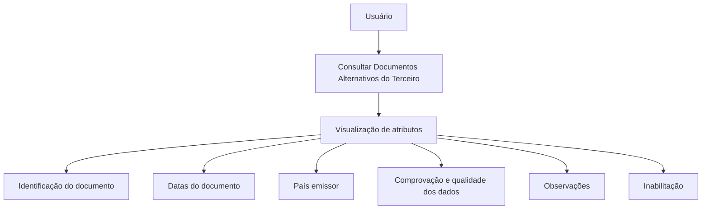

# Consulta de Documentos Alternativos de Terceiros — Documentação Reef

## 1. Metadados do Documento
- **Arquivo de Origem:** Não identificado no conteúdo fornecido
- **Tipo de Documento:** Procedimento
- **Domínio / Sistema:** Documentação Reef / Mapfredocument
- **Público-Alvo:** Operação, Negócio e usuários consultores de informações de terceiros
- **Data/Versão Identificada:** Não identificada

---

## 2. Resumo Executivo & Contexto de Negócio

O documento descreve a funcionalidade de consulta de **Documentos Alternativos do Terceiro**. O objetivo explícito é permitir a visualização dos documentos alternativos usados para identificar um terceiro no sistema.

A ação habilitada indicada pelo documento é exclusivamente **CONSULTAR**. Não há evidência de operações de criação, edição, exclusão ou validação manual no conteúdo fornecido.

A visualização apresenta atributos em uma sequência definida “da esquerda para a direita e de cima para baixo”. Quando os campos não são expressamente especificados, devem ser visualizados indistintamente para **Pessoas Físicas** e **Pessoas Jurídicas**.

Os dados consultados abrangem identificação do documento alternativo, datas de emissão, validade, caducidade e comprovação, país emissor, observações e situação de inabilitação. Essas informações apoiam processos da entidade relacionados à qualidade dos dados e à utilização operacional de documentos alternativos de terceiros.

---

## 3. Arquitetura, Componentes & Tecnologias Envolvidas

O conteúdo identifica o ambiente documental **Reef**, referências a **DOCUMENTACIÓN Reef** e **Mapfredocument**, além de navegação para áreas como Soluções, Arquiteturas, APIs, Componentes, Cloud, Documentação e Zeus. Entretanto, o material não detalha arquitetura de software, integrações, protocolos, APIs, bancos de dados, microsserviços, métodos HTTP ou contratos JSON.



**Nota de Análise:** O documento lista a navegação de Documentação Reef e Mapfredocument, mas não detalha os componentes técnicos responsáveis por disponibilizar ou persistir os dados.

---

## 4. Regras de Negócio, Especificações Funcionais & Processos

1. A funcionalidade tem como objetivo visualizar os Documentos Alternativos do Terceiro.
2. A ação habilitada é **CONSULTAR**.
3. Os atributos devem ser apresentados em sequência de leitura:
   - Da esquerda para a direita.
   - De cima para baixo.
4. Quando não houver especificação expressa de campos, os campos devem ser visualizados indistintamente para:
   - Pessoas Físicas.
   - Pessoas Jurídicas.
5. O **Tipo Documento Alternativo** mostra o documento alternativo com o qual o terceiro se identifica.
6. A **Clave del Documento Alternativo** contém a chave do documento alternativo do terceiro.
7. A **Fecha de Emisión** mostra a data de emissão do documento alternativo.
8. A **Fecha de Caducidad**, quando conhecida, indica a data de caducidade do documento alternativo.
9. O **País Emisor** mostra o código do país emissor conforme o catálogo de países existente no sistema.
10. A **Marca de Comprobación** permite indicar, nos processos da entidade, se o documento alternativo foi revisado e verificado, em relação à qualidade dos dados no sistema.
11. A **Fecha de Comprobación** contém a data da revisão e comprovação quando o estado da marca de comprovação indicar que o documento foi revisado e comprovado.
12. As **Observaciones** mostram texto esclarecedor ou observações sobre o fato da comprovação quando o documento alternativo tiver sido revisado e validado.
13. A **Fecha de Validez** informa ao sistema a data a partir da qual o Documento Alternativo do Terceiro está ou estará plenamente operativo.
14. A **Inhabilitación** indica que o documento alternativo do terceiro está inabilitado. Esse estado deve ser empregado, considerado ou utilizado nos processos operativos da entidade que o demandarem.

---

## 5. Tabelas de Parâmetros, Ambientes e Estruturas de Dados

| Item / Parâmetro | Descrição / Função | Tipo / Valores / Formato | Ambiente / Observações |
| :--- | :--- | :--- | :--- |
| Ação habilitada | Permite consultar documentos alternativos do terceiro | `CONSULTAR` | O documento não cita outras ações habilitadas |
| Tipo Documento Alternativo | Mostra o documento alternativo utilizado para identificar o terceiro | Não especificado | Aplicável à identificação do terceiro |
| Clave del Documento Alternativo | Contém a chave do documento alternativo do terceiro | Não especificado | O texto utiliza o termo “clave” |
| Fecha de Emisión | Mostra a data de emissão do documento alternativo | Data; formato não especificado | — |
| Fecha de Caducidad | Indica a data de caducidade do documento alternativo | Data; quando conhecida | Campo condicional à existência da informação |
| País Emisor | Mostra o código do país emissor do documento alternativo | Código de país | Deve obedecer ao catálogo de países do sistema |
| Marca de Comprobación | Indica se o documento alternativo foi revisado e verificado | Estado não especificado | Relacionada à qualidade dos dados no sistema |
| Fecha de Comprobación | Registra a data da ação de revisão e comprovação | Data; formato não especificado | Preenchida quando a marca indicar revisão e comprovação |
| Observaciones | Mostra texto explicativo sobre a comprovação | Texto | Aplicável quando o documento foi revisado e validado |
| Fecha de Validez | Define a data a partir da qual o documento está ou estará plenamente operativo | Data; formato não especificado | Possui efeito operacional futuro ou vigente |
| Inhabilitación | Indica que o documento alternativo está inabilitado | Estado não especificado | Deve ser considerado pelos processos operativos que o demandarem |
| Pessoas Físicas | Categoria de terceiro para visualização de campos | Categoria de pessoa | Campos não especificados são visualizados indistintamente |
| Pessoas Jurídicas | Categoria de terceiro para visualização de campos | Categoria de pessoa | Campos não especificados são visualizados indistintamente |
| Documentação Reef | Contexto documental indicado na página | Ambiente documental | Referenciado como “DOCUMENTACIÓN Reef” |
| Mapfredocument | Referência exibida na documentação | Não especificado | O conteúdo não detalha a função técnica |

---

## 6. Bateria de Perguntas & Respostas para RAG (FAQ Sintético)

### P1: Qual é o objetivo da funcionalidade de Documentos Alternativos do Terceiro?
**R:** O objetivo é visualizar os Documentos Alternativos do Terceiro, isto é, os documentos alternativos usados para identificar um terceiro no sistema.

### P2: Quais ações estão habilitadas para Documentos Alternativos?
**R:** O documento informa somente a ação **CONSULTAR**. Não são descritas ações de inclusão, alteração, exclusão ou validação manual.

### P3: Como os atributos dos Documentos Alternativos devem ser exibidos?
**R:** Os atributos devem seguir a sequência de visualização da esquerda para a direita e de cima para baixo.

### P4: Os campos de Documentos Alternativos se aplicam a Pessoas Físicas e Pessoas Jurídicas?
**R:** Sim. Caso os campos não sejam especificados ou indicados expressamente, os campos devem ser visualizados indistintamente para Pessoas Físicas e Pessoas Jurídicas.

### P5: O que representa a Marca de Comprobación de um Documento Alternativo?
**R:** A Marca de Comprobación permite considerar, nos processos da entidade, se o documento alternativo foi revisado e verificado. Essa informação está relacionada à qualidade dos dados no sistema.

### P6: Quando a Fecha de Comprobación deve conter uma data?
**R:** A Fecha de Comprobación contém a data da ação de revisão e comprovação quando o estado da Marca de Comprobación indicar que o documento alternativo foi revisado e comprovado.

### P7: Como o País Emisor é determinado?
**R:** O País Emisor visualiza o código do país emissor do documento alternativo do terceiro conforme a relação de valores existente no catálogo de países do sistema.

### P8: Qual é a finalidade da Fecha de Validez?
**R:** A Fecha de Validez informa ao sistema a data a partir da qual o Documento Alternativo do Terceiro está ou estará plenamente operativo.

### P9: O que significa Inhabilitación em um Documento Alternativo?
**R:** Inhabilitación indica que o documento alternativo do terceiro está inabilitado. Esse estado deve ser empregado, considerado ou utilizado nos processos operativos da entidade que o demandarem.

### P10: Quando devem ser apresentadas Observaciones sobre o documento?
**R:** As Observaciones apresentam um texto esclarecedor ou observações sobre o fato da comprovação quando o documento alternativo tiver sido revisado e validado.

---

## 7. Glossário de Termos, Siglas & Conceitos-Chave

- **Documento Alternativo:** Documento usado para identificar um terceiro.
- **Terceiro:** Entidade ou pessoa identificada por meio de um documento alternativo no contexto do sistema.
- **Marca de Comprobación:** Propriedade que informa se o documento alternativo foi revisado e verificado.
- **Fecha de Comprobación:** Data em que ocorreu a revisão e comprovação do documento, quando aplicável.
- **Fecha de Validez:** Data a partir da qual o documento alternativo está ou estará plenamente operativo.
- **Inhabilitación:** Estado que indica que o documento alternativo está inabilitado.
- **País Emisor:** Código do país emissor do documento alternativo, conforme catálogo de países do sistema.
- **Pessoas Físicas:** Categoria de terceiros mencionada para a visualização de campos.
- **Pessoas Jurídicas:** Categoria de terceiros mencionada para a visualização de campos.
- **Reef:** Nome presente no contexto de documentação exibido no material.
- **Mapfredocument:** Referência presente no material; a função não é detalhada.

---

## 8. Notas Críticas, Riscos & Limitações

- O material não informa o nome do arquivo de origem, data, versão, autor técnico ou histórico de alterações.
- Não há detalhamento de arquitetura, APIs, integrações, persistência de dados, autenticação, permissões ou contratos de interface.
- A ação **CONSULTAR** é a única ação explicitamente habilitada.
- Não são definidos formatos de data, domínios de valores, obrigatoriedade de campos ou regras de preenchimento.
- O documento não especifica os valores possíveis para a Marca de Comprobación ou para Inhabilitación.
- O catálogo de países é mencionado, mas não é apresentado.
- **Nota de Análise:** O conteúdo descreve os atributos de consulta, porém não detalha métodos HTTP, contratos JSON, fluxo de atualização nem a origem dos dados exibidos.

---

## 9. Conteúdo Bruto Estruturado (Referência Fiel)

```text
--- [PÁGINA 1 DE 2] ---

CONSULTAR los Documentos Alternativos del Tercero
Objetivo
Visualizar los Documentos Alternativos del Tercero.
Acciones habilitadas
 CONSULTAR ( )
Documentos Alternativos
De izquierda a derecha y de arriba hacia abajo, los siguientes atributos determinan la secuencia de visualización de la Información.
Si no se especica o indica expresamente los Campos se visualizarán indistintamente tanto en las Personas Físicas como para las Personas
Jurídicas.
Tipo Documento Alternativo
Este Atributo del muestra el documento alternativo con el que se identica al Tercero de acuerdo.
Clave del Documento Alternativo
Este date del bloque de información contiene la clave del documento alternativo del Tercero.
Fecha de Emisión
Esta propiedad muestra la fecha de emisión del documento alternativo del Tercero.
Fecha de Caducidad
Este campo, si conocido, indica la fecha de caducidad del documento alternativo del Tercero.
País Emisor
Documentation / DOCUMENTACIÓN Reef
DOCUMENTACIÓN Reef
Mapfredocument
DOCUMENTACIÓN Reef
Owner
user:agonzalez_mapfre.com
Lifecycle
Approved Source
 / 
 VL
Buscar Inicio Soluciones Arquitecturas APIs Componentes Cloud Documentación Zeus Reef Ayuda
ES


--- [PÁGINA 2 DE 2] ---

Este dato visualiza el código del país emisor del documento alternativo del Tercero de acuerdo con la relación de posibles valores existentes
en el catálogo de países del Sistema.
Marca de Comprobación
Esta propiedad permite considerar en los procesos de la entidad si el documento alternativo ha sido o no revisado y vericado, todo ello en
relación con la calidad de los datos en el sistema.
Fecha de Comprobación
En el supuesto que el estado de la marca de comprobación implique que el documento alternativo sí haya sido revisado y comprobado, este
campo contiene la fecha en la que esta acción se habrá realizado.
Observaciones
Caso que el documento alternativo haya sido revisado y validado, este Dato visualiza el texto aclaratorio u observaciones sobre el propio
hecho de la comprobación.
Fecha de Validez
Esta propiedad le indica al sistema la fecha a partir de la cual el Documento Alternativo del Tercero está o estará plenamente operativo.
Inhabilitación
El cotejo de este campo muestra e indica que el documento alternativo del Tercero está inhabilitado, por lo que este supuesto debería ser
empleado, considerado o utilizado en los procesos operativos de la entidad que así lo demandaran.
```
