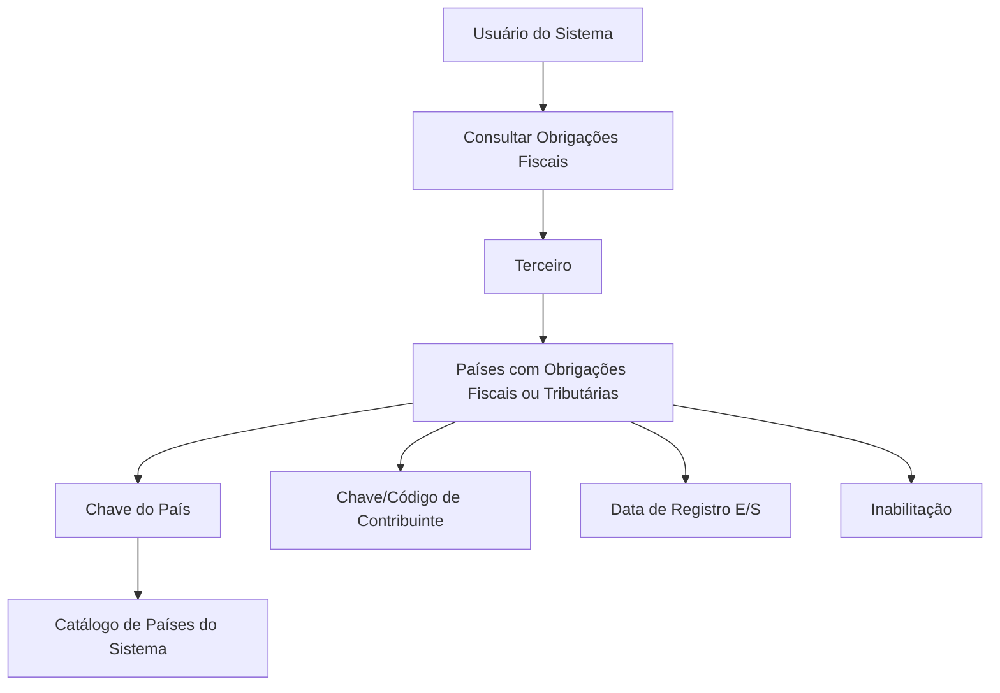

# Consulta de Obligaciones Fiscales del Tercero — Documentación Reef

## 1. Metadados do Documento
- **Arquivo de Origem:** Não identificado
- **Tipo de Documento:** Manual Operacional
- **Domínio / Sistema:** Reef / Mapfredocument
- **Público-Alvo:** Operação, Negócio e usuários do sistema
- **Data/Versão Identificada:** Não identificada

---

## 2. Resumo Executivo & Contexto de Negócio

O documento descreve a funcionalidade **“CONSULTAR las Obligaciones Fiscales del Tercero”** no contexto da documentação Reef. O objetivo declarado é visualizar os países nos quais um terceiro possui obrigações fiscais ou tributárias.

A consulta apresenta informações do terceiro como contribuinte local em cada país aplicável. Os dados incluem a chave do país, a chave ou código de contribuinte, a data de entrada ou saída no status de obrigado tributário e a situação de inabilitação.

A funcionalidade possui a ação habilitada **CONSULTAR**, associada às obrigações fiscais. O documento também define que a sequência de apresentação das informações deve ser interpretada da esquerda para a direita e de cima para baixo.

Não há detalhamento sobre autenticação, URLs, métodos HTTP, contratos de integração, persistência de dados, regras de atualização ou tratamento de erros. O conteúdo disponível concentra-se na finalidade da consulta e na semântica dos atributos exibidos.

---

## 3. Arquitetura, Componentes & Tecnologias Envolvidas

Os componentes e contextos explicitamente mencionados são:

- **Reef:** contexto de documentação no qual a funcionalidade é apresentada.
- **Mapfredocument:** identificação textual presente no conteúdo bruto.
- **Catálogo de países do Sistema:** fonte de possíveis valores para a chave do país.
- **Terceiro:** entidade consultada, identificada como obrigado tributário ou contribuinte local em determinado país.
- **Obligaciones Fiscales:** funcionalidade de consulta de obrigações fiscais ou tributárias.



**Nota de Análise:** o documento não descreve uma arquitetura técnica de serviços, bancos de dados, APIs, ambientes ou protocolos de comunicação. O diagrama representa exclusivamente o fluxo funcional sustentado pelo conteúdo fornecido.

---

## 4. Regras de Negócio, Especificações Funcionais & Processos

1. A funcionalidade tem como objetivo visualizar os países nos quais o terceiro possui obrigações fiscais ou tributárias.
2. A ação explicitamente habilitada é **CONSULTAR** obrigações fiscais.
3. A sequência de visualização das informações é determinada da esquerda para a direita e de cima para baixo.
4. A **Chave do País** apresenta o código do primeiro nível da estrutura geográfica, correspondente aos países.
5. A Chave do País é exibida quando o terceiro está identificado como obrigado tributário no país correspondente.
6. Os valores possíveis para a Chave do País são relacionados ao catálogo de países do Sistema.
7. A **Chave/Código de Contribuinte** apresenta a chave ou código do terceiro como contribuinte local no país em que possui obrigação tributária.
8. A **Data de Registro E/S** apresenta a data de entrada ou a data de saída do terceiro no status de obrigado tributário.
9. A **Inabilitação** indica se o terceiro deixou de ser obrigado tributário no país em questão.

---

## 5. Tabelas de Parâmetros, Ambientes e Estruturas de Dados

| Item / Parâmetro | Descrição / Função | Tipo / Valores / Formato | Ambiente / Observações |
| :--- | :--- | :--- | :--- |
| Ação habilitada | Permite consultar obrigações fiscais do terceiro. | `CONSULTAR` | Não há outros tipos de ação detalhados. |
| Chave do País | Visualiza o código do primeiro nível da estrutura geográfica — países — em que o terceiro está identificado como obrigado tributário. | Código de país; valores relacionados ao catálogo de países do Sistema. | Não há formato ou exemplos de código informados. |
| Chave/Código de Contribuinte | Mostra a chave ou o código do terceiro como contribuinte local no país em que figura como obrigado tributário. | Chave ou código. | Não há formato, tamanho ou catálogo informado. |
| Data de Registro E/S | Mostra a data de entrada ou saída do terceiro no status de obrigado tributário. | Data de Entrada ou Data de Saída. | O formato da data não é detalhado. |
| Inabilitação | Determina se o terceiro deixou de ser obrigado tributário no país correspondente. | Indicador de situação. | Os valores possíveis do indicador não são informados. |
| Catálogo de Países do Sistema | Relação de possíveis valores usada para identificar países. | Catálogo de países. | Não há identificação técnica, localização ou responsável pelo catálogo. |
| Owner | Identificação de proprietário exibida no conteúdo. | `user:agonzalez_mapfre.com` | Texto apresentado literalmente no conteúdo bruto. |
| Lifecycle | Estado de ciclo de vida exibido no conteúdo. | `Approved Source / VL` | O significado de `VL` não é definido no documento. |

---

## 6. Bateria de Perguntas & Respostas para RAG (FAQ Sintético)

### P1: Qual é o objetivo da funcionalidade de consulta de obrigações fiscais do terceiro?
**R:** O objetivo é visualizar os países nos quais o terceiro possui obrigações fiscais ou tributárias.

### P2: Qual ação está habilitada na funcionalidade de obrigações fiscais?
**R:** A ação habilitada explicitamente no documento é **CONSULTAR** obrigações fiscais.

### P3: O que representa a Chave do País na consulta de obrigações fiscais?
**R:** A Chave do País visualiza o código do primeiro nível da estrutura geográfica, correspondente aos países, no qual o terceiro está identificado como obrigado tributário.

### P4: De onde vêm os valores possíveis para a Chave do País?
**R:** Os valores possíveis da Chave do País estão relacionados ao catálogo de países do Sistema.

### P5: O que é exibido no campo Chave/Código de Contribuinte?
**R:** O campo exibe a chave ou o código do terceiro como contribuinte local no país em que o terceiro aparece como obrigado tributário.

### P6: O que significa o campo Data de Registro E/S?
**R:** O campo Data de Registro E/S mostra a data de entrada ou a data de saída do terceiro no status de obrigado tributário.

### P7: Qual informação é determinada pelo campo Inabilitação?
**R:** O campo Inabilitação determina se o terceiro deixou de ser obrigado tributário no país em questão.

### P8: Como a sequência de visualização das informações deve ser interpretada?
**R:** A sequência de visualização deve ser interpretada da esquerda para a direita e de cima para baixo.

### P9: O documento informa quais métodos HTTP ou APIs são usados para consultar obrigações fiscais?
**R:** Não. O documento não detalha métodos HTTP, APIs, contratos JSON, URLs, serviços ou integrações técnicas.

### P10: O documento define os valores possíveis do indicador de Inabilitação?
**R:** Não. O documento informa apenas que o campo determina se o terceiro deixou de ser obrigado tributário no país, sem especificar valores possíveis, formato ou regra de cálculo.

---

## 7. Glossário de Termos, Siglas & Conceitos-Chave

- **Terceiro:** entidade consultada na funcionalidade, que pode estar identificada como obrigado tributário em um país.
- **Obrigação Fiscal / Tributária:** condição associada ao terceiro em determinado país, conforme apresentada no documento.
- **Obrigado Tributário:** status do terceiro em um país no qual possui obrigação fiscal ou tributária.
- **Chave do País:** código do país, correspondente ao primeiro nível da estrutura geográfica.
- **Chave/Código de Contribuinte:** identificação do terceiro como contribuinte local em um país.
- **Data de Registro E/S:** data de entrada ou saída do terceiro no status de obrigado tributário.
- **Inabilitação:** indicador que determina se o terceiro deixou de ser obrigado tributário em determinado país.
- **E/S:** abreviação apresentada no campo “Fecha de Registro E/S”; o documento associa o campo a data de entrada ou saída.
- **Reef:** contexto de documentação mencionado no conteúdo.
- **VL:** sigla exibida em “Approved Source / VL”; não definida no documento.

---

## 8. Notas Críticas, Riscos & Limitações

- O documento não identifica o arquivo de origem, data, versão ou autor técnico.
- Não há detalhamento de arquitetura de software, endpoints, métodos HTTP, payloads, banco de dados ou integrações.
- Não são informados formatos para código de país, código de contribuinte ou data de registro.
- O indicador de Inabilitação não possui valores, critérios de cálculo ou regras de validação especificados.
- O documento não define permissões, perfis de acesso, autenticação ou auditoria para a ação **CONSULTAR**.
- A sigla **VL** aparece no ciclo de vida, mas não possui definição no conteúdo.
- **Nota de Análise:** o documento descreve atributos de uma tela ou consulta funcional, porém não fornece detalhamento adicional sobre comportamento técnico ou contratos de dados.

---

## 9. Conteúdo Bruto Estruturado (Referência Fiel)

```text
--- [PÁGINA 1 DE 1] ---

CONSULTAR las Obligaciones Fiscales del Tercero
Objetivo
Visualizar los Países en los que el Tercero tiene Obligaciones Fiscales o Tributarias.
Acciones habilitadas
 CONSULTAR ( )
Obligaciones Fiscales.
De izquierda a derecha y de arriba hacia abajo, los siguientes atributos determinan la secuencia de visualización de la Información.
Clave del País
Este Campo visualiza el código del primer nivel de la estructura Geográca (países) en el que el Tercero está identicado como obligado
tributario, de acuerdo con la relación de posibles valores existentes en el catálogo de países del Sistema.
Clave/Código de Contribuyente
Este campo muestra la clave o el código del Tercero como contribuyente local en el País en el que aparece como obligado tributario.
Fecha de Registro E/S
Este Campo muestra la Fecha de Entrada o de Salida del Tercero con el status de Obligado Tributario.
Inhabilitación
Este campo determina si el Tercero ha dejado de ser Obligado Tributario en el País en cuestión.
Documentation / DOCUMENTACIÓN Reef
DOCUMENTACIÓN Reef
Mapfredocument
DOCUMENTACIÓN Reef
Owner
user:agonzalez_mapfre.com
Lifecycle
Approved Source
 /
 VL
Buscar Inicio Soluciones Arquitecturas APIs Componentes Cloud Documentación Zeus Reef Ayuda
ES
```
