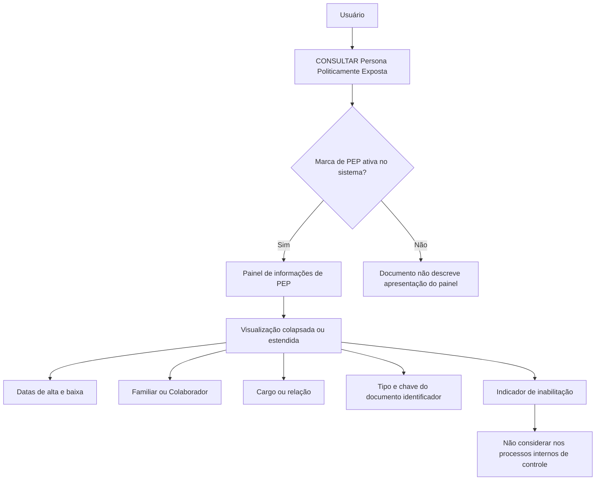

# Consulta de Persona Politicamente Exposta (PEP) — Documentação Reef

## 1. Metadados do Documento
- **Arquivo de Origem:** `Não identificado`
- **Tipo de Documento:** `Manual Operacional`
- **Domínio / Sistema:** `DOCUMENTACIÓN Reef / Mapfredocument`
- **Público-Alvo:** `Usuários de consulta, Operação, Negócio e equipes de controles internos`
- **Data/Versão Identificada:** `Não identificada`

---

## 2. Resumo Executivo & Contexto de Negócio

O documento descreve a funcionalidade **“CONSULTAR Persona Políticamente Expuesta”**, destinada a visualizar informações de um **Tercero** classificado como Persona Politicamente Exposta ou associado a um Familiar ou Colaborador com essa condição.

A funcionalidade disponibiliza exclusivamente a ação de consulta. O painel de dados de Persona Politicamente Exposta é apresentado somente quando existe uma marca ativa no sistema indicando que o Tercero é uma Persona Politicamente Exposta ou possui uma associação com uma pessoa nessa condição.

As informações podem ser visualizadas em um painel colapsado ou estendido. A ordem dos atributos no painel segue a sequência de leitura definida pelo documento: da esquerda para a direita e de cima para baixo.

O conteúdo apresenta campos de datas de alta e baixa, identificação de vínculo familiar ou profissional, cargo ou relação, documentos identificadores e indicador de inabilitação. O indicador de inabilitação determina que o Tercero ou a Persona Politicamente Exposta relacionada não deve ser considerada nos processos internos de controle da entidade.

---

## 3. Arquitetura, Componentes & Tecnologias Envolvidas

O documento cita os seguintes elementos:

| Componente / Termo | Papel identificado no documento |
| :--- | :--- |
| DOCUMENTACIÓN Reef | Repositório ou contexto documental apresentado no rodapé/cabeçalho. |
| Mapfredocument | Identificador exibido no conteúdo documental. |
| Tercero | Entidade consultada na funcionalidade de Persona Politicamente Exposta. |
| Persona Politicamente Exposta | Condição consultada para o Tercero ou para pessoa relacionada. |
| Familiar / Colaborador | Pessoa relacionada ao Tercero que pode possuir a condição de Persona Politicamente Exposta. |
| Catálogo de Cargos | Fonte dos valores possíveis para cargo ou relação com a Persona Politicamente Exposta. |
| Processos de controle internos | Processos da entidade que não devem considerar pessoas marcadas como inabilitadas. |



> **Nota de Análise:** O documento não detalha tecnologias de implementação, endpoints, métodos HTTP, contratos de integração, persistência de dados, perfis de autorização nem mecanismos técnicos de ativação da marca de Persona Politicamente Exposta.

---

## 4. Regras de Negócio, Especificações Funcionais & Processos

1. A funcionalidade possui a ação habilitada **CONSULTAR**.
2. O objetivo da consulta é visualizar dados do Tercero como Persona Politicamente Exposta ou sua relação com Familiar ou Colaborador que possua essa condição.
3. O painel de informações de Persona Politicamente Exposta deve aparecer quando estiver ativa a marca do sistema que identifica uma das seguintes situações:
   - O Tercero é uma Persona Politicamente Exposta.
   - O Tercero possui associação com uma Persona Politicamente Exposta.
4. O painel pode ser apresentado de maneira colapsada ou estendida.
5. A sequência de visualização dos atributos deve seguir a ordem da esquerda para a direita e de cima para baixo.
6. A **Fecha de Alta como Persona Politicamente Expuesta** apresenta a data de alta:
   - Do Tercero como Persona Politicamente Exposta; ou
   - Do Familiar ou Colaborador do Tercero como Persona Politicamente Exposta.
7. A **Fecha de Baja como Persona Politicamente Expuesta** apresenta a data em que:
   - O Tercero deixou de ser Persona Politicamente Exposta; ou
   - A Persona Politicamente Exposta relacionada deixou de possuir essa condição.
8. O atributo **Familiar / Colaborador** identifica se a Persona Politicamente Exposta relacionada é Familiar ou Colaborador do Tercero.
9. O campo **Cargo o Relación con la Persona Políticamente Expuesta** apresenta o cargo ou a relação do Tercero ou da pessoa relacionada, conforme os valores disponíveis no catálogo de cargos do sistema.
10. O campo **Tipo Documento Identificador de la Persona Políticamente Expuesta Relacionada** apresenta o tipo de documento do Familiar ou Colaborador relacionado ao Tercero.
11. O campo **Clave del Documento Identificador de la Persona Políticamente Relacionada** contém a chave do documento identificador do Familiar ou Colaborador relacionado ao Tercero.
12. A propriedade **Inhabilitación** indica que o Tercero ou a Persona Politicamente Exposta relacionada está inabilitada.
13. Quando houver inabilitação, o Tercero ou a pessoa relacionada não deve ser considerada nos processos internos de controle existentes na entidade.

---

## 5. Tabelas de Parâmetros, Ambientes e Estruturas de Dados

| Item / Parâmetro | Descrição / Função | Tipo / Valores / Formato | Ambiente / Observações |
| :--- | :--- | :--- | :--- |
| Ação habilitada | Permite consultar a informação de Persona Politicamente Exposta. | `CONSULTAR` | Nenhuma outra ação é documentada. |
| Marca de PEP | Condição que determina a apresentação do painel de informações. | Marca ativa no sistema | Pode indicar que o Tercero é PEP ou que possui PEP associada. |
| Painel de informações de PEP | Área de visualização dos dados da condição de Persona Politicamente Exposta. | Colapsado ou estendido | Exibido quando a marca de PEP estiver ativa. |
| Fecha de Alta como Persona Politicamente Expuesta | Data de alta do Tercero ou de Familiar/Colaborador como PEP. | Data | O formato da data não é especificado. |
| Fecha de Baja como Persona Politicamente Expuesta | Data de baixa do Tercero ou da PEP relacionada. | Data | O formato da data não é especificado. |
| Familiar / Colaborador | Identifica o tipo de relação da PEP relacionada com o Tercero. | Familiar ou Colaborador | Aplicável à pessoa relacionada. |
| Cargo o Relación con la Persona Políticamente Expuesta | Mostra o cargo ou a relação do Tercero ou da pessoa relacionada. | Valores do catálogo de cargos do sistema | O catálogo e seus valores não são detalhados. |
| Tipo Documento Identificador de la Persona Políticamente Expuesta Relacionada | Apresenta o tipo de documento do Familiar ou Colaborador relacionado. | Tipo de documento | Valores permitidos não especificados. |
| Clave del Documento Identificador de la Persona Políticamente Relacionada | Contém a chave do documento identificador do Familiar ou Colaborador relacionado. | Chave de documento | Formato não especificado. |
| Inhabilitación | Indica inabilitação do Tercero ou da PEP relacionada. | Propriedade/indicador | Pessoas inabilitadas não devem ser consideradas nos processos internos de controle. |
| Owner | Proprietário exibido na página documental. | `user:agonzalez_mapfre.com` | Informação apresentada no conteúdo bruto. |
| Lifecycle | Estado de ciclo de vida exibido na página. | `Approved Source / VL` | O significado de `VL` não é detalhado. |

---

## 6. Bateria de Perguntas & Respostas para RAG (FAQ Sintético)

### P1: Qual é o objetivo da funcionalidade “CONSULTAR Persona Politicamente Exposta”?
**R:** A funcionalidade permite visualizar os dados de um Tercero como Persona Politicamente Exposta ou visualizar a relação do Tercero com um Familiar ou Colaborador que possua essa condição.

### P2: Qual ação está habilitada na tela de Persona Politicamente Exposta?
**R:** O documento informa que a ação habilitada é exclusivamente **CONSULTAR**.

### P3: Em qual condição o painel de informações de Persona Politicamente Exposta é exibido?
**R:** O painel é exibido quando está ativa no sistema a marca que identifica que o Tercero é uma Persona Politicamente Exposta ou que o Tercero possui associada uma pessoa com essa condição.

### P4: Quais formas de visualização do painel de Persona Politicamente Exposta são previstas?
**R:** O painel de informações pode ser apresentado de forma colapsada ou de forma estendida.

### P5: Como é definida a ordem de exibição dos atributos no painel de Persona Politicamente Exposta?
**R:** Os atributos devem ser interpretados na sequência de visualização da esquerda para a direita e de cima para baixo.

### P6: O que representa a data de alta como Persona Politicamente Exposta?
**R:** A data de alta mostra quando o Tercero, ou o Familiar ou Colaborador do Tercero, foi registrado como Persona Politicamente Exposta.

### P7: O que representa a data de baixa como Persona Politicamente Exposta?
**R:** A data de baixa indica quando o Tercero ou a Persona Politicamente Exposta relacionada deixou de possuir a condição de Persona Politicamente Exposta.

### P8: Como o sistema diferencia Familiar e Colaborador?
**R:** O atributo **Familiar / Colaborador** identifica se a Persona Politicamente Exposta relacionada ao Tercero é classificada como Familiar ou como Colaborador.

### P9: De onde vêm os possíveis valores de cargo ou relação com a Persona Politicamente Exposta?
**R:** O campo de cargo ou relação utiliza os possíveis valores existentes no catálogo de cargos do sistema. O documento não apresenta os valores desse catálogo.

### P10: Quais dados documentais são apresentados para uma Persona Politicamente Exposta relacionada?
**R:** São apresentados o tipo do documento identificador e a chave do documento identificador do Familiar ou Colaborador relacionado ao Tercero.

### P11: Qual é o efeito do indicador de inabilitação nos processos internos?
**R:** A inabilitação informa que o Tercero ou a Persona Politicamente Exposta relacionada está inabilitada e, portanto, não deve ser considerada nos processos internos de controle existentes na entidade.

### P12: O documento descreve APIs, métodos HTTP ou contratos JSON da consulta de PEP?
**R:** Não. O documento descreve o objetivo funcional, as condições de visualização e os campos apresentados, mas não detalha APIs, métodos HTTP, contratos JSON ou integrações técnicas.

---

## 7. Glossário de Termos, Siglas & Conceitos-Chave

- **PEP / Persona Politicamente Exposta:** Condição consultada para o Tercero ou para Familiar/Colaborador relacionado, conforme a denominação apresentada no documento.
- **Tercero:** Entidade cujas informações de Persona Politicamente Exposta ou relações com PEP são consultadas.
- **Familiar / Colaborador:** Classificação da pessoa relacionada ao Tercero que pode possuir a condição de Persona Politicamente Exposta.
- **Inhabilitación:** Propriedade que indica que o Tercero ou a PEP relacionada está inabilitada e não deve participar dos processos internos de controle.
- **Catálogo de Cargos:** Catálogo existente no sistema que fornece valores possíveis para o campo de cargo ou relação.
- **DOCUMENTACIÓN Reef:** Identificação da área ou repositório documental exibido no conteúdo.
- **Mapfredocument:** Termo exibido na navegação ou identificação do documento; não possui definição adicional no texto.
- **VL:** Sigla exibida no estado de lifecycle `Approved Source / VL`; o documento não fornece expansão ou significado.

---

## 8. Notas Críticas, Riscos & Limitações

- O documento não identifica o nome do arquivo original, data, versão nem autoria formal, exceto pelo owner exibido como `user:agonzalez_mapfre.com`.
- Não há detalhamento de perfis de acesso, autenticação, autorização ou regras para habilitar a ação de consulta.
- O documento não apresenta os valores do catálogo de cargos.
- Não são especificados formatos para datas, chaves documentais ou tipos de documentos.
- Não há especificação de APIs, endpoints, contratos JSON, integrações, banco de dados ou tecnologias de implementação.
- O documento não detalha como a marca de Persona Politicamente Exposta é criada, atualizada, removida ou auditada.
- A regra de inabilitação tem impacto operacional relevante: o Tercero ou a PEP relacionada não deve ser considerada nos processos internos de controle da entidade.

---

## 9. Conteúdo Bruto Estruturado (Referência Fiel)

```text
--- [PÁGINA 1 DE 2] ---

CONSULTAR Persona Políticamente Expuesta
Objetivo
Visualizar los datos del Tercero como Persona Políticamente Expuesta o su relación con algún Familiar o estrecho Colaborador que tenga
dicha condición.
Acciones habilitadas
 CONSULTAR ( )
Datos Persona Políticamente Expuesta
Siempre y cuando se haya activado la marca que identica en el sistema que el Tercero es o tiene asociada una persona políticamente
expuesta aparecerá el panel de información correspondiente de manera colapsada...
... o de manera extendida
De izquierda a derecha y de arriba hacia abajo, los siguientes atributos determinan la secuencia de visualización de la Información.
Fecha de Alta como Persona Políticamente Expuesta
Este Dato visualiza la fecha de Alta del Tercero o del Familiar o Colaborador del Tercero como Persona Políticamente Expuesta.
Fecha de Baja como Persona Políticamente Expuesta
Este Dato muestra la fecha en la que el Tercero o la Persona Políticamente Expuesta Relacionada causó baja como Persona Políticamente
Expuesta.
Familiar / Colaborador
Este Atributo identica si la Persona Políticamente Expuesta Relacionada es un Familiar o un Colaborador del Tercero.
Documentation / DOCUMENTACIÓN Reef
DOCUMENTACIÓN Reef
Mapfredocument
DOCUMENTACIÓN Reef
Owner
user:agonzalez_mapfre.com
Lifecycle
Approved Source
 / 
 VL
Buscar Inicio Soluciones Arquitecturas APIs Componentes Cloud Documentación Zeus Reef Ayuda
ES


--- [PÁGINA 2 DE 2] ---

Cargo o Relación con la Persona Políticamente Expuesta
Este Campo muestra la relación o el Cargo del Tercero o de la Persona Políticamente Expuesta relacionada, de acuerdo con los posibles
valores del catálogo de Cargos existente en el Sistema.
Tipo Documento Identicador de la Persona Políticamente Expuesta Relacionada
Este campo observa el tipo de documento del Familiar o Colaborador Relacionado con el Tercero.
Clave del Documento Identicador de la Persona Políticamente Relacionada
Este dato contiene la clave del documento Identicador del Familiar o Colaborador Relacionado con el Tercero.
Inhabilitación
Esta propiedad indica que o bien el Tercero o la Personas Políticamente Expuesta Relacionada con el Tercero está inhabilitada y por ende no
debiera considerarse en los procesos de control internos existentes en la entidad.
```
