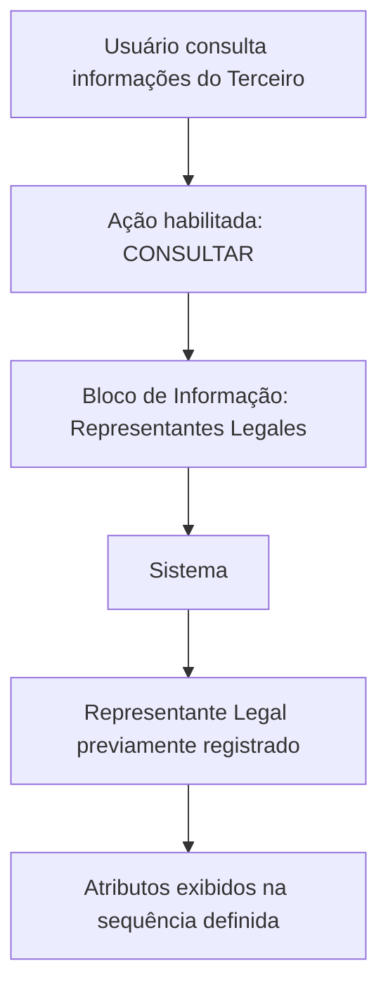

# Consulta de Representantes Legales del Tercero — Documentación Reef

## 1. Metadados do Documento
- **Arquivo de Origem:** Não identificado no conteúdo fornecido
- **Tipo de Documento:** Especificação Técnica / Funcional
- **Domínio / Sistema:** DOCUMENTACIÓN Reef / Mapfre
- **Público-Alvo:** Desenvolvedores, Analistas Funcionais, Operação e Negócio
- **Data/Versão Identificada:** Não identificada

---

## 2. Resumo Executivo & Contexto de Negócio

O documento descreve o bloco de informação **“CONSULTAR los Representantes Legales del Tercero”**, cujo propósito é visualizar os representantes legais associados a um terceiro na data de consulta das informações. A funcionalidade disponibiliza a ação **CONSULTAR** para acesso aos dados apresentados.

A especificação determina a sequência de visualização dos atributos: leitura da esquerda para a direita e de cima para baixo. Quando os campos não forem especificados ou indicados expressamente, os atributos podem ser utilizados indistintamente para apresentar informações de pessoas físicas e pessoas jurídicas.

Os dados apresentados abrangem identificação documental, nome completo, tipo ou classe de representação legal, datas de início, fim e validade, além de marcas relacionadas a pessoa politicamente exposta, inabilitação, pessoa investigada e realização de atividades ilícitas.

O documento também estabelece que o nome completo do representante legal deve estar previamente registrado no sistema e identificado com o código de atividade **45**. Para situações em que a marca de realização de atividades ilícitas esteja ativa, deve ser exibida a descrição explicativa registrada para essas atividades.

> **Nota de Análise:** O conteúdo não detalha métodos HTTP, contratos JSON, persistência de dados, critérios de autenticação, perfis de acesso, integrações, ambientes técnicos ou mecanismos de atualização dos dados de representantes legais.

---

## 3. Arquitetura, Componentes & Tecnologias Envolvidas

Os elementos explicitamente citados no documento são:

- **DOCUMENTACIÓN Reef**
- **Mapfredocument**
- **Bloco de Informação:** CONSULTAR los Representantes Legales del Tercero
- **Ação habilitada:** CONSULTAR
- **Sistema:** repositório no qual o nome completo do representante legal deve estar previamente registrado
- **Terceiro:** entidade consultada, que pode ser pessoa física ou pessoa jurídica
- **Representante Legal:** pessoa associada ao terceiro e apresentada pelo bloco de informação



> **Nota de Análise:** O diagrama representa exclusivamente a relação funcional inferível do texto. O documento não especifica componentes de infraestrutura, APIs, bancos de dados, microsserviços, protocolos ou tecnologias de implementação.

---

## 4. Regras de Negócio, Especificações Funcionais & Processos

1. O bloco de informação tem como propósito visualizar um ou mais representantes legais do terceiro na data em que as informações são consultadas.

2. A ação habilitada para o bloco de informação é **CONSULTAR**.

3. Os atributos devem ser visualizados na sequência descrita no documento, da esquerda para a direita e de cima para baixo.

4. Quando os campos não forem especificados ou expressamente indicados, os campos devem ser empregados indistintamente para exibir informações de:
   - Pessoas físicas.
   - Pessoas jurídicas.

5. O atributo **Tipo Documento Representante Legal** deve apresentar o tipo de documento utilizado para identificar o representante legal, conforme os tipos de documentos existentes no sistema.

6. O atributo **Clave del Documento** deve apresentar a chave do documento do representante legal do terceiro.

7. O campo **Nombre Completo** deve apresentar o nome completo do representante legal do terceiro. Esse representante legal deve:
   - Estar previamente registrado no sistema.
   - Estar identificado com o código de atividade **45**.

8. O dado **Tipo/Clase de Representación Legal** deve apresentar a classe ou tipologia de representação legal associada à pessoa, conforme codificação realizada localmente pela entidade seguradora.

9. O atributo **Fecha Inicio** deve apresentar a data de alta da pessoa como representante legal.

10. O atributo **Fecha Fin** deve apresentar a data de baixa na qual a pessoa deixa de atuar como representante legal do terceiro.

11. A propriedade **Fecha de Validez** deve apresentar a data a partir da qual a pessoa passa, ou passará, a vigorar como representante legal do terceiro.

12. O campo **Marca Persona Políticamente Expuesta** deve identificar se o representante legal é uma pessoa politicamente exposta.

13. A propriedade **Inhabilitación** deve estabelecer se o status do representante legal continua vigente ou se a pessoa está inabilitada para exercer a representação legal.

14. O campo **Marca Persona Investigada** deve identificar se o representante legal é uma pessoa investigada.

15. O atributo **Marca Realización Actividades Ilícitas** deve determinar se o representante legal realizou qualquer tipo de atividade ilícita.

16. Caso a marca de realização de atividades ilícitas esteja ativa, o atributo **Descripción de Actividades** deve exibir o texto explicativo sobre as atividades registrado anteriormente.

---

## 5. Tabelas de Parâmetros, Ambientes e Estruturas de Dados

| Item / Parâmetro | Descrição / Função | Tipo / Valores / Formato | Ambiente / Observações |
| :--- | :--- | :--- | :--- |
| CONSULTAR | Ação habilitada para o bloco de representantes legais. | Ação funcional. | Não há detalhamento de autorização, interface ou método técnico. |
| Representantes Legales | Bloco de informação utilizado para visualizar representantes legais de um terceiro. | Bloco de informação. | Visualização na data de consulta das informações do terceiro. |
| Tipo Documento Representante Legal | Tipo de documento com o qual o representante legal é identificado. | Tipo de documento existente no sistema. | O documento não lista os tipos de documento permitidos. |
| Clave del Documento | Chave do documento do representante legal do terceiro. | Chave documental. | Formato não especificado. |
| Nombre Completo | Nome completo do representante legal do terceiro. | Campo textual. | Requer registro prévio no sistema e código de atividade 45. |
| Código de atividade | Código associado ao representante legal previamente registrado. | Valor citado: `45`. | O significado do código 45 não é detalhado. |
| Tipo/Clase de Representación Legal | Classe ou tipologia de representação legal associada à pessoa. | Codificação local. | Efetuada localmente pela entidade seguradora. |
| Fecha Inicio | Data de alta da pessoa como representante legal. | Data. | Formato não especificado. |
| Fecha Fin | Data de baixa em que a pessoa deixa de atuar como representante legal. | Data. | Formato não especificado. |
| Fecha de Validez | Data a partir da qual a representação legal entra ou entrará em vigor. | Data. | Pode referir-se a vigência presente ou futura. |
| Marca Persona Políticamente Expuesta | Identifica o representante legal como pessoa politicamente exposta. | Marca. | Valores possíveis não especificados. |
| Inhabilitación | Indica se o status do representante legal permanece vigente ou se está inabilitado para atuar. | Status / propriedade. | Regras de inabilitação não especificadas. |
| Marca Persona Investigada | Identifica o representante legal como pessoa investigada. | Marca. | Valores possíveis não especificados. |
| Marca Realización Actividades Ilícitas | Identifica que o representante legal realizou atividades ilícitas. | Marca. | Aciona a apresentação da descrição de atividades quando ativa. |
| Descripción de Actividades | Texto explicativo sobre atividades ilícitas registradas. | Campo textual. | Exibido quando a marca de realização de atividades ilícitas está ativa. |
| DOCUMENTACIÓN Reef | Referência documental exibida no conteúdo extraído. | Sistema / repositório documental. | Sem detalhamento técnico adicional. |
| Mapfredocument | Referência exibida no conteúdo extraído. | Plataforma ou identificação documental. | Sem detalhamento técnico adicional. |
| Owner | Proprietário indicado no conteúdo extraído. | `user:agonzalez_mapfre.com` | Valor apresentado literalmente no documento. |
| Lifecycle | Estado de ciclo de vida documental. | `Approved Source` | O documento não explica o modelo de lifecycle. |

---

## 6. Bateria de Perguntas & Respostas para RAG (FAQ Sintético)

### P1: Qual é o objetivo do bloco “CONSULTAR los Representantes Legales del Tercero”?
**R:** O bloco tem como objetivo visualizar um ou mais representantes legais associados ao terceiro na data em que as informações desse terceiro são consultadas.

### P2: Qual ação está habilitada para o bloco de representantes legais?
**R:** A ação habilitada no documento é **CONSULTAR**.

### P3: Como os atributos de representantes legais devem ser exibidos?
**R:** Os atributos devem seguir a sequência de visualização da esquerda para a direita e de cima para baixo.

### P4: O bloco de representantes legais atende pessoas físicas e pessoas jurídicas?
**R:** Sim. Quando os campos não forem especificados ou expressamente indicados, eles podem ser empregados indistintamente para mostrar informações de pessoas físicas e pessoas jurídicas.

### P5: Qual condição existe para que o nome completo de um representante legal seja exibido?
**R:** O nome completo do representante legal deve estar previamente registrado no sistema e identificado com o código de atividade 45.

### P6: O que representa o atributo “Tipo/Clase de Representación Legal”?
**R:** O atributo apresenta a classe ou tipologia de representação legal associada à pessoa, de acordo com a codificação efetuada localmente pela entidade seguradora.

### P7: Qual é a diferença entre Fecha Inicio, Fecha Fin e Fecha de Validez?
**R:** **Fecha Inicio** apresenta a data de alta da pessoa como representante legal. **Fecha Fin** apresenta a data de baixa, quando a pessoa deixa de atuar como representante legal do terceiro. **Fecha de Validez** apresenta a data a partir da qual a pessoa entra ou entrará em vigor como representante legal.

### P8: O que informa a propriedade Inhabilitación?
**R:** A propriedade Inhabilitación estabelece se o status do representante legal segue vigente ou se a pessoa está inabilitada para exercer a função de representante legal.

### P9: Quando a Descripción de Actividades deve ser exibida?
**R:** A Descripción de Actividades deve ser exibida quando a marca de realização de atividades ilícitas estiver ativa. O campo mostra o texto explicativo registrado sobre essas atividades.

### P10: Quais marcas de risco ou condição pessoal podem ser apresentadas para um representante legal?
**R:** O documento cita as marcas de pessoa politicamente exposta, pessoa investigada e realização de atividades ilícitas. Também cita a propriedade de inabilitação, que informa a vigência ou impedimento para exercer a representação legal.

### P11: O documento especifica os valores permitidos para as marcas de pessoa politicamente exposta, pessoa investigada e atividades ilícitas?
**R:** Não. O documento informa a finalidade dessas marcas, mas não detalha os valores possíveis, o formato de armazenamento, regras de preenchimento ou origem dos dados.

### P12: O documento descreve APIs, contratos JSON ou tecnologias de integração para a consulta?
**R:** Não. O conteúdo fornecido descreve atributos funcionais de visualização, mas não especifica APIs, métodos HTTP, contratos JSON, tecnologias, bancos de dados ou protocolos de integração.

---

## 7. Glossário de Termos, Siglas & Conceitos-Chave

- **Terceiro:** Entidade cujas informações e representantes legais são consultados; o documento indica que os campos podem atender pessoas físicas ou jurídicas.
- **Representante Legal:** Pessoa associada ao terceiro e apresentada pelo bloco de informação.
- **Tipo Documento Representante Legal:** Tipo de documento utilizado para identificar o representante legal conforme os tipos existentes no sistema.
- **Clave del Documento:** Chave do documento do representante legal.
- **Tipo/Clase de Representación Legal:** Classe ou tipologia de representação legal associada à pessoa.
- **Fecha Inicio:** Data de alta da pessoa como representante legal.
- **Fecha Fin:** Data de baixa na qual a pessoa deixa de atuar como representante legal.
- **Fecha de Validez:** Data a partir da qual a pessoa entra ou entrará em vigor como representante legal.
- **Persona Políticamente Expuesta:** Condição identificada pela marca correspondente; o documento não fornece definição adicional.
- **Persona Investigada:** Condição identificada pela marca correspondente; o documento não fornece definição adicional.
- **Inhabilitación:** Propriedade que indica se o representante legal permanece vigente ou está inabilitado para exercer a função.
- **Marca Realización Actividades Ilícitas:** Marca que determina que o representante legal realizou algum tipo de atividade ilícita.
- **DOCUMENTACIÓN Reef:** Referência documental presente no conteúdo extraído; não há expansão ou definição adicional.
- **Mapfredocument:** Referência presente no conteúdo extraído; não há definição adicional.
- **Lifecycle:** Campo de ciclo de vida documental, apresentado com o valor `Approved Source`.

---

## 8. Notas Críticas, Riscos & Limitações

- O documento não apresenta nome de arquivo, data, versão, autor técnico ou histórico de revisões.
- O conteúdo não detalha APIs, endpoints, contratos de dados, integrações, banco de dados, logs, segurança, autenticação ou autorização.
- Não há especificação de formatos para documentos, chaves documentais ou datas.
- Não há definição dos valores permitidos para as marcas de pessoa politicamente exposta, pessoa investigada ou realização de atividades ilícitas.
- Não são descritas regras para criação, atualização, baixa, inabilitação ou validação de representantes legais.
- O significado funcional do código de atividade **45** não é detalhado.
- A codificação do tipo ou classe de representação legal é realizada localmente pela entidade seguradora, mas o documento não fornece a tabela de códigos.
- A fonte extraída contém caracteres de codificação corrompidos em termos como `especica`, `codicación` e `identica`; o conteúdo foi preservado na referência bruta.

---

## 9. Conteúdo Bruto Estruturado (Referência Fiel)

```text
--- [PÁGINA 1 DE 2] ---

CONSULTAR los Representantes Legales del Tercero
El propósito de este Bloque de Información es Visualizar al/los Representantes Legales del Tercero a la fecha de consulta de su información.
Acciones habilitadas
 CONSULTAR ( )
Representantes Legales
De izquierda a derecha y de arriba hacia abajo, los siguientes atributos determinan la secuencia de visualización de la Información.
Si no se especica o indica expresamente los Campos se emplearán indistintamente tanto para mostrar información de las Personas Físicas
como de las Personas Jurídicas.
Tipo Documento Representante Legal
Este Atributo del colapsador contiene el Tipo de Documento con el que se identica al Representante Legal de acuerdo con los tipos de
documentos existentes en el sistema.
Clave del Documento
Este Atributo contiene la clave del documento del Representante Legal del Tercero.
Nombre Completo
Este Campo mostrará el nombre completo del Representante Legal del Tercero que tendrá que estar previamente registrado en el Sistema e
identicado con el código de actividad 45.
Tipo/Clase de Representación Legal
Este dato contendrá la Clase o Tipología de Representación Legal que se va a asociar a la persona, de acuerdo con la codicación efectuada
localmente por parte de la entidad aseguradora.
Fecha Inicio
Documentation / DOCUMENTACIÓN Reef
DOCUMENTACIÓN Reef
Mapfredocument
DOCUMENTACIÓN Reef
Owner
user:agonzalez_mapfre.com
Lifecycle
Approved Source
 /
VL
Buscar Inicio Soluciones Arquitecturas APIs Componentes Cloud Documentación Zeus Reef Ayuda
ES


--- [PÁGINA 2 DE 2] ---

Este dato visualiza la Fecha de ALTA de la persona como Representante Legal.
Fecha Fin
Este Atributo muestra la Fecha de BAJA en la que la persona deja de fungir como Representante Legal del Tercero.
Fecha de Validez
Esta propiedad muestra la Fecha a partir de la cual entra o entrará en vigor la persona como Representante Legal del Tercero.
Marca Persona Políticamente Expuesta
Este campo identica al Representante Legal como Persona Políticamente Expuesta.
Inhabilitación
Esta propiedad establece si el status del Representante Legal sigue en vigor o bien está inhabilitado para ejercer como tal.
Marca Persona Investigada
Este Campo identica al Representante Legal como Persona Investigada.
Marca Realización Actividades Ilícitas
Este Atributo determina que el Representante Legal es Persona que ha efectuado cualquier tipo de actividades ilícitas.
Descripción de Actividades
En el caso que la marca de realización de actividades ilícitas esté activa, este atributo visualiza el texto aclaratorio sobre dichas actividades
que se registró en su momento.
```
