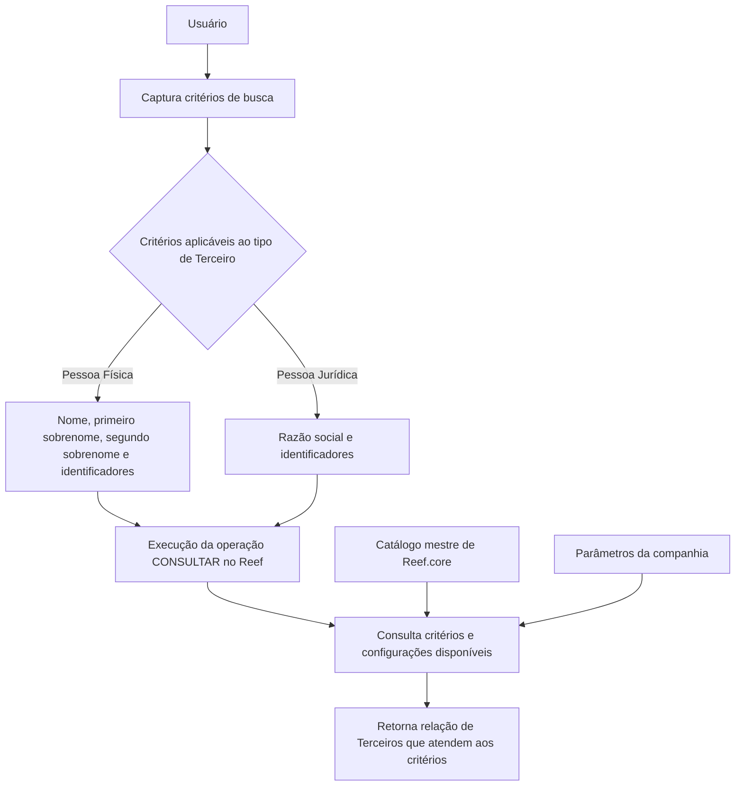

# Consulta de Terceiros por Dados do Terceiro — Documentação Reef

## 1. Metadados do Documento
- **Arquivo de Origem:** Não identificado no conteúdo fornecido
- **Tipo de Documento:** Especificação Técnica
- **Domínio / Sistema:** Reef / Reef.core / Mapfre
- **Público-Alvo:** Desenvolvedores, analistas funcionais, operação e usuários do sistema
- **Data/Versão Identificada:** Não identificada

---

## 2. Resumo Executivo & Contexto de Negócio

O documento descreve a operação **“Consultar Tercero por datos del Tercero”**, destinada à consulta de Terceiros no sistema Reef. A operação permite capturar critérios de busca usuais e combiná-los logicamente para retornar a relação de Terceiros que atende aos critérios informados.

A funcionalidade aplica-se tanto a **Pessoas Físicas** quanto a **Pessoas Jurídicas**, salvo quando uma regra indicar expressamente uma restrição. Os critérios podem ser utilizados parcialmente ou integralmente, e as buscas não diferenciam caracteres maiúsculos de minúsculos.

A disponibilidade obrigatória ou habilitada dos campos pode variar conforme o **código de atividade do Terceiro**. O documento também determina que não existem limitações relacionadas ao papel do usuário ou a possíveis restrições de informação do usuário que executa a consulta.

A operação habilitada indicada no documento é **CONSULTAR**. Os critérios de pesquisa abrangem dados nominais, sobrenomes, identificadores documentais, código de atividade, código interno, alias e identificador único corporativo.

---

## 3. Arquitetura, Componentes & Tecnologias Envolvidas

Os componentes e conceitos explicitamente citados são:

- **Reef:** Sistema no qual a consulta é executada.
- **Reef.core:** Componente que mantém o atributo de código do Terceiro como propriedade própria e exclusiva.
- **Catálogo mestre de Reef.core:** Origem dos tipos de documentos configurados para identificação de Pessoas Físicas e Jurídicas.
- **Parâmetros da companhia:** Configuração que pode determinar a necessidade de identificação unívoca dos Terceiros em aplicações que gerenciam suas informações.
- **Mapfre / Mapfredocument:** Termos exibidos na navegação ou identificação documental fornecida, sem detalhamento funcional adicional.
- **VL:** Termo exibido no conteúdo, sem detalhamento adicional.



> **Nota de Análise:** O conteúdo fornecido não detalha métodos HTTP, contratos JSON, banco de dados, URLs, autenticação, camadas técnicas, integrações externas ou mecanismos de persistência da operação.

---

## 4. Regras de Negócio, Especificações Funcionais & Processos

### 4.1 Objetivo da operação

A operação permite capturar os critérios de busca mais usuais dos Terceiros. As combinações lógicas desses critérios permitem executar uma consulta no sistema e obter a relação de Terceiros que cumpre os critérios informados.

### 4.2 Premissas gerais de consulta

1. Quando não houver indicação expressa em sentido contrário, os critérios de busca devem ser empregados indistintamente para consultas de Pessoas Físicas e Pessoas Jurídicas.
2. As buscas de Terceiros podem ser realizadas utilizando parte ou todo o valor de qualquer critério.
3. As buscas são realizadas sem distinção entre letras maiúsculas e minúsculas.
4. A obrigatoriedade e/ou habilitação dos campos no registro dos dados de cada bloco ou estrutura de informação pode variar de acordo com o código de atividade do Terceiro.
5. Não existem limitações no papel do usuário, nem nas possíveis restrições sobre a informação que o usuário que executa a consulta possa possuir.

### 4.3 Ação habilitada

- **CONSULTAR:** ação disponibilizada para executar a pesquisa de Terceiros.

### 4.4 Sequência de captura

Os campos de critérios de pesquisa seguem a sequência visual da tela, da esquerda para a direita e de cima para baixo.

### 4.5 Critérios de busca de Terceiros

#### Nome

O atributo **Nome** contém:

- O nome simples ou composto do Terceiro, quando o Terceiro for uma Pessoa Física.
- A razão social, quando o Terceiro for uma Pessoa Jurídica.

#### Primeiro Apellido

O critério **Primeiro Apellido** realiza a busca pelo primeiro sobrenome do Terceiro, desde que o Terceiro seja uma Pessoa Física.

#### Segundo Apellido

O critério **Segundo Apellido** explora o catálogo de acordo com o segundo sobrenome do Terceiro, desde que o Terceiro seja uma Pessoa Física.

#### Tipo Documento Identificador

O critério **Tipo Documento Identificador** contém:

1. O tipo de documento usado para identificar a Pessoa Física ou Jurídica, de acordo com a relação de tipos de documentos previamente configurados no catálogo mestre de Reef.core.
2. O Tipo de Documento Alternativo do Terceiro.

#### Clave del Documento Identificador

O campo **Clave del Documento Identificador** contém a chave do Terceiro.

#### Código de Actividad del Tercero

O critério **Código de Actividad del Tercero** permite buscar de acordo com o código da atividade do Terceiro informado.

#### Código del Tercero

O campo **Código del Tercero** permite buscar Terceiros pelo código interno do sistema. Esse código é atribuído automática ou manualmente no momento da criação do Terceiro.

#### Alias del Tercero

O campo **Alias del Tercero** permite informar o apelido ou sobrenome informal do Terceiro, seja Pessoa Física ou Pessoa Jurídica, como critério de busca.

#### ID único del Tercero

O campo **ID único del Tercero** contém o código do identificador único do Terceiro quando os parâmetros da companhia tiverem definido a necessidade de identificar univocamente os Terceiros em todas as aplicações que gerenciam suas informações.

O atributo **ID único del Tercero** não substitui, em hipótese alguma, a funcionalidade suportada pelo atributo **Código del Tercero**, que é propriedade própria e exclusiva de Reef.core.

---

## 5. Tabelas de Parâmetros, Ambientes e Estruturas de Dados

| Item / Parâmetro | Descrição / Função | Tipo / Valores / Formato | Ambiente / Observações |
| :--- | :--- | :--- | :--- |
| Operação | Executa a consulta de Terceiros | `CONSULTAR` | Ação habilitada no documento |
| Nome | Busca pelo nome simples ou composto da Pessoa Física ou pela razão social da Pessoa Jurídica | Texto; pesquisa parcial ou completa | Aplicável a Pessoas Físicas e Jurídicas |
| Primeiro Apellido | Busca pelo primeiro sobrenome | Texto; pesquisa parcial ou completa | Aplicável quando o Terceiro é Pessoa Física |
| Segundo Apellido | Explora o catálogo pelo segundo sobrenome | Texto; pesquisa parcial ou completa | Aplicável quando o Terceiro é Pessoa Física |
| Tipo Documento Identificador | Define o tipo de documento para identificação do Terceiro | Tipo de documento configurado; Tipo de Documento Alternativo | Tipos configurados previamente no catálogo mestre de Reef.core |
| Clave del Documento Identificador | Contém a chave do Terceiro | Chave do Terceiro | Sem formato adicional especificado |
| Código de Actividad del Tercero | Permite pesquisar pelo código de atividade do Terceiro | Código de atividade informado | Pode influenciar a obrigatoriedade ou habilitação de campos |
| Código del Tercero | Permite pesquisar pelo código interno do sistema | Código atribuído automática ou manualmente | Atribuído na criação do Terceiro; propriedade própria e exclusiva de Reef.core |
| Alias del Tercero | Permite pesquisar pelo apelido ou sobrenome informal | Texto; pesquisa parcial ou completa | Aplicável a Terceiros físicos ou jurídicos |
| ID único del Tercero | Contém o código de identificação única do Terceiro | Código identificador único | Depende da configuração dos parâmetros da companhia; não substitui o Código del Tercero |
| Sensibilidade a maiúsculas/minúsculas | Define o comportamento da pesquisa textual | Sem distinção entre maiúsculas e minúsculas | Aplicável às buscas de Terceiros |
| Correspondência parcial | Define o escopo de correspondência dos critérios | Parte ou totalidade do valor de qualquer critério | Aplicável às buscas de Terceiros |
| Restrições por perfil | Regra de acesso descrita para a consulta | Não há limitações de papel ou de possíveis restrições de informação do usuário | Conforme o conteúdo fornecido |

> **Nota de Análise:** O documento não fornece servidores, URLs, portas, credenciais, variáveis de log, nomes de bancos de dados ou dados de ambiente.

---

## 6. Bateria de Perguntas & Respostas para RAG (FAQ Sintético)

### P1: Qual é o objetivo da operação “Consultar Tercero por datos del Tercero”?
**R:** A operação permite capturar os critérios de busca mais usuais dos Terceiros, combiná-los logicamente e executar uma consulta no sistema para retornar a relação de Terceiros que atende aos critérios informados.

### P2: A consulta de Terceiros atende Pessoas Físicas e Pessoas Jurídicas?
**R:** Sim. Quando não houver indicação expressa em contrário, os critérios de busca são empregados indistintamente para consultas de Pessoas Físicas e Pessoas Jurídicas.

### P3: É possível pesquisar apenas parte do valor de um nome ou identificador?
**R:** Sim. As buscas de Terceiros podem ser realizadas por parte ou pela totalidade do valor de qualquer um dos critérios disponíveis.

### P4: A pesquisa diferencia letras maiúsculas de minúsculas?
**R:** Não. As buscas são realizadas sem importar se os critérios foram informados em maiúsculas ou minúsculas.

### P5: Como o campo Nome funciona para Pessoas Físicas e Jurídicas?
**R:** Para uma Pessoa Física, o campo Nome contém o nome simples ou composto do Terceiro. Para uma Pessoa Jurídica, o campo Nome contém a razão social do Terceiro.

### P6: Em quais situações os campos Primeiro Apellido e Segundo Apellido podem ser usados?
**R:** Os campos Primeiro Apellido e Segundo Apellido são aplicáveis quando o Terceiro é uma Pessoa Física. O Primeiro Apellido pesquisa pelo primeiro sobrenome, e o Segundo Apellido explora o catálogo de acordo com o segundo sobrenome.

### P7: De onde vêm os tipos de documento utilizados no critério Tipo Documento Identificador?
**R:** Os tipos de documento são obtidos da relação de tipos de documentos previamente configurados no catálogo mestre de Reef.core. O critério também contempla o Tipo de Documento Alternativo do Terceiro.

### P8: O que representa o Código del Tercero?
**R:** O Código del Tercero é o código interno do sistema atribuído automática ou manualmente ao Terceiro no momento de sua criação. O documento informa que esse atributo é propriedade própria e exclusiva de Reef.core.

### P9: O ID único del Tercero substitui o Código del Tercero?
**R:** Não. O documento afirma explicitamente que o ID único del Tercero não substitui, em nenhum caso, a funcionalidade do Código del Tercero.

### P10: Quando o campo ID único del Tercero é utilizado?
**R:** O campo é utilizado quando a configuração dos parâmetros da companhia tiver definido a necessidade de identificar univocamente os Terceiros em todas as aplicações que gerenciam suas informações.

### P11: O código de atividade do Terceiro influencia a consulta?
**R:** Sim. O Código de Actividad del Tercero pode ser usado como critério de busca. Além disso, a obrigatoriedade e/ou habilitação dos campos em blocos ou estruturas de informação pode variar conforme o código de atividade do Terceiro.

### P12: Existem restrições de consulta de acordo com o perfil ou papel do usuário?
**R:** Não. O documento declara que não existem limitações no papel do usuário nem nas possíveis restrições sobre a informação que o usuário que executa a consulta possa ter.

---

## 7. Glossário de Termos, Siglas & Conceitos-Chave

- **Alias del Tercero:** Apelido ou sobrenome informal de um Terceiro físico ou jurídico, utilizado como critério de busca.
- **Catálogo mestre de Reef.core:** Catálogo no qual os tipos de documentos devem estar previamente configurados.
- **Clave del Documento Identificador:** Campo que contém a chave do Terceiro.
- **Código de Actividad del Tercero:** Código de atividade informado como critério de busca e potencial fator de variação de habilitação ou obrigatoriedade de campos.
- **Código del Tercero:** Código interno do sistema atribuído automática ou manualmente na criação do Terceiro; propriedade própria e exclusiva de Reef.core.
- **ID único del Tercero:** Código de identificação única do Terceiro, condicionado à configuração dos parâmetros da companhia.
- **Pessoa Física:** Tipo de Terceiro para o qual podem ser utilizados nome, primeiro sobrenome e segundo sobrenome.
- **Pessoa Jurídica:** Tipo de Terceiro para o qual o campo Nome contém a razão social.
- **Reef:** Sistema no qual a operação de consulta é executada.
- **Reef.core:** Componente citado como proprietário exclusivo da funcionalidade do Código del Tercero.
- **Tercero / Terceiro:** Entidade consultada no sistema, que pode ser Pessoa Física ou Pessoa Jurídica.
- **Tipo Documento Alternativo:** Tipo de documento alternativo do Terceiro, incluído no critério Tipo Documento Identificador.
- **VL:** Termo exibido no material original sem definição contextual.
- **Mapfredocument:** Termo exibido no material original sem definição funcional contextual.

---

## 8. Notas Críticas, Riscos & Limitações

- O documento não detalha contratos de API, métodos HTTP, estruturas JSON, telas completas, mensagens de erro, regras de combinação lógica dos filtros ou critérios de ordenação dos resultados.
- Não foram identificadas informações sobre autenticação, autorização técnica, logs, auditoria, infraestrutura, banco de dados, endpoints, URLs, servidores ou ambientes.
- A obrigatoriedade e a habilitação dos campos podem variar conforme o código de atividade do Terceiro, mas o documento não especifica quais códigos produzem quais variações.
- O uso do ID único del Tercero depende de uma configuração dos parâmetros da companhia que não foi detalhada.
- Os termos “Mapfre”, “Mapfredocument”, “VL”, “Zeus”, “Cloud” e itens de navegação aparecem no conteúdo, mas não possuem explicação funcional adicional.
- Há caracteres corrompidos na extração original, como em “especica”, “identicar”, “congurados” e “denido”. A interpretação semântica foi preservada sem inventar conteúdo ausente.

---

## 9. Conteúdo Bruto Estruturado (Referência Fiel)

```text
--- [PÁGINA 1 DE 2] ---

OPERACIÓN CONSULTAR Tercero por datos del Tercero
¿En que consiste?
En la captura de los criterios de búsqueda más usuales de los Terceros cuyas combinaciones lógicas posibilitan ejecutar la consulta en el
sistema dando como resultado la relación de Terceros que cumplen con estos criterios.
Premisas
Si no se especica o indica expresamente, los criterios de búsqueda se emplearán indistintamente tanto para consultas sobre Personas
Físicas como para las Personas Jurídicas.
Las búsquedas de los Terceros se pueden realizar por parte o todo el valor de cualquiera de los criterios.
Las búsquedas se realizan sin importar que los criterios estén en Mayúsculas o Minúsculas.
La obligatoriedad y/o la habilitación de los campos en el registro de los datos de cada uno de los bloques o estructuras de información
puede variar de acuerdo con el código de actividad del Tercero.
No existen limitaciones en el rol y en las posibles restricciones sobre la información que pudiera tener del Usuario que efectúa la
consulta.
Acciones habilitadas
 CONSULTAR ( )
Datos del Tercero
De izquierda a derecha y de arriba hacia abajo, los siguientes Campos marcan la secuencia de captura de los criterios de búsqueda.
Nombre
Este Atributo contiene el nombre (simple o compuesto) del Tercero en caso que el Tercero sea una Persona Física o la Razón Social en el
supuesto que sea una Persona Jurídica.
Primer Apellido
Documentation / DOCUMENTACIÓN Reef
DOCUMENTACIÓN Reef
Mapfredocument
DOCUMENTACIÓN Reef
Owner
user:agonzalez_mapfre.com
Lifecycle
Approved Source
 / 
 VL
Buscar Inicio Soluciones Arquitecturas APIs Componentes Cloud Documentación Zeus Reef Ayuda
ES


--- [PÁGINA 2 DE 2] ---

Siempre y cuando el Tercero sea una Persona Física, este dato realizará la búsqueda por el primer Apellido del Tercero.
Segundo Apellido
Siempre y cuando el Tercero sea una Persona Física, este dato explorará el catálogo de acuerdo con el segundo Apellido del Tercero.
Tipo Documento Identicador
Este criterio de búsqueda contiene:
El tipo de documento con el que se va a identicar a la persona física o jurídica de acuerdo con la relación de tipos de documentos que
hayan sido congurados en el catálogo maestro de Reef.core previamente,
El Tipo de Documento Alternativo del Tercero.
Clave del Documento Identicador
Este campo de la pantalla contendrá la clave del Tercero.
Código de Actividad del Tercero
Este criterio permite realizar la búsqueda de acuerdo con el código de la Actividad del Tercero ingresado.
Código del Tercero
Este dato permite realizar las búsquedas de los Terceros con el código interno del sistema que se asignó al Tercero automática o
manualmente en el momento de su creación.
Alias del Tercero
Este dato permite capturar el apodo o sobrenombre del Tercero, físico o jurídico, como criterio de búsqueda.
ID único del Tercero
Siempre y cuando se haya denido en la conguración de los parámetros de la compañía la necesidad de identicar unívocamente a los
Terceros en todas las aplicaciones que gestionen su información, este campo contendrá el código del Identicador único del Tercero.
Este atributo NO SUSTITUYE en ningún caso la funcionalidad soportada por el atributo del código del tercero que es una propiedad propia
y exclusiva de Reef.core.
```
