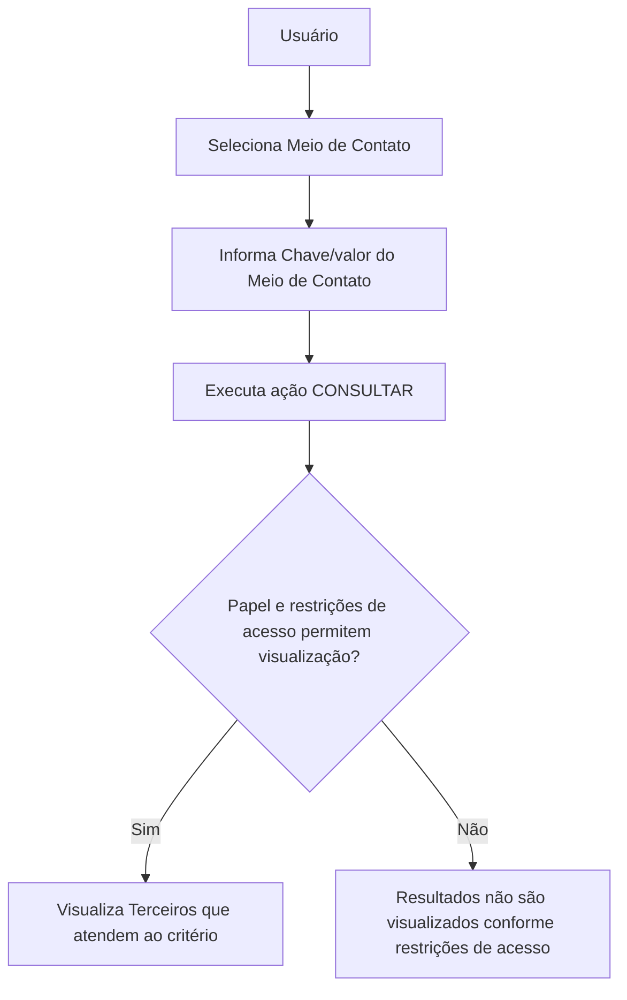

# Operação de Consulta de Terceiro por Meio de Contato — Documentação Reef

## 1. Metadados do Documento
- **Arquivo de Origem:** Não informado no conteúdo bruto
- **Tipo de Documento:** Procedimento funcional
- **Domínio / Sistema:** Reef / Mapfre
- **Público-Alvo:** Usuários funcionais, operação e analistas de negócio
- **Data/Versão Identificada:** Não identificada
- **Owner identificado:** `user:agonzalez_mapfre.com`
- **Lifecycle identificado:** Approved Source

---

## 2. Resumo Executivo & Contexto de Negócio

O documento descreve a operação **“Consultar Terceiro por Meio de Contato do Terceiro”** no contexto da documentação Reef. A operação permite pesquisar registros de Terceiros mediante a captura de um tipo de meio de contato e do respectivo valor do meio de contato.

A consulta retorna os Terceiros que atendem ao critério informado. A visualização dos resultados está condicionada ao papel do usuário que realiza a consulta e às restrições de acesso à informação aplicáveis a esse usuário.

A ação explicitamente habilitada no procedimento é **CONSULTAR**. O processo destaca que os campos devem ser preenchidos em uma sequência específica, lida da esquerda para a direita, para definir os critérios de busca.

O documento apresenta dois critérios centrais: **Meio de Contato**, que identifica um dos tipos possíveis de contato do Terceiro, e **Chave/valor do Meio de Contato**, que contém o valor real correspondente ao tipo de meio de contato escolhido. Não há detalhamento de exemplos concretos de valores, contratos técnicos, endpoints, métodos HTTP, integrações ou persistência de dados.

---

## 3. Arquitetura, Componentes & Tecnologias Envolvidas

Os elementos identificados no conteúdo são:

| Componente / Termo | Papel identificado no documento | Detalhamento disponível |
| :--- | :--- | :--- |
| Reef | Contexto de documentação e sistema relacionado à operação | O documento não detalha a arquitetura interna do Reef. |
| Mapfre | Referência corporativa presente no identificador do owner e no texto “Mapfredocument” | A relação técnica ou funcional com a operação não é detalhada. |
| Terceiro | Entidade consultada pelo procedimento | Representa o registro retornado quando atende aos critérios de contato e acesso. |
| Usuário | Executor da consulta | A visualização depende do papel e das restrições de acesso do usuário. |
| Meio de Contato | Critério de busca | Define o tipo de contato usado na pesquisa. |
| Chave/valor do Meio de Contato | Critério de busca | Define o valor efetivo associado ao tipo de meio de contato. |
| CONSULTAR | Ação habilitada | Executa a operação de busca. |



> **Nota de Análise:** O documento descreve um fluxo funcional de consulta, mas não informa serviços, microsserviços, APIs, bancos de dados, protocolos, URLs, tecnologias de frontend ou mecanismos técnicos de autorização.

---

## 4. Regras de Negócio, Especificações Funcionais & Processos

### 4.1 Objetivo da operação

A operação consiste na captura do tipo e/ou do meio de contato do Terceiro para realizar uma busca no sistema. A busca deve permitir visualizar os Terceiros que cumprem o critério de pesquisa informado.

### 4.2 Regra de controle de acesso

A visualização dos Terceiros retornados pela consulta depende de duas condições relacionadas ao usuário que executa a operação:

1. O papel atribuído ao usuário deve permitir o acesso à informação.
2. As restrições de acesso à informação aplicáveis ao usuário não devem impedir a visualização.

O documento não define quais papéis existem, quais permissões são exigidas, como as restrições são configuradas ou o comportamento do sistema quando a visualização não é permitida.

### 4.3 Ação habilitada

A ação habilitada no procedimento é:

- **CONSULTAR**

Não são listadas ações de criação, edição, exclusão, exportação, limpeza de filtros ou consulta avançada.

### 4.4 Sequência de captura dos critérios

Os campos dos dados do Terceiro determinam a sequência de captura dos critérios de busca. A sequência deve ser considerada **da esquerda para a direita**.

### 4.5 Critérios de busca

1. **Meio de Contato**
   - Contém um dos possíveis valores dos Meios de Contato do Terceiro.
   - Determina o tipo de meio de contato pelo qual se deseja realizar a pesquisa.

2. **Chave/valor do Meio de Contato**
   - Contém o valor real do Meio de Contato.
   - O valor deve estar de acordo com o tipo de meio de contato definido no critério anterior.

> **Nota de Análise:** O documento não especifica a lista de tipos permitidos para “Meio de Contato”, nem os formatos válidos para “Chave/valor do Meio de Contato”.

---

## 5. Tabelas de Parâmetros, Ambientes e Estruturas de Dados

| Item / Parâmetro | Descrição / Função | Tipo / Valores / Formato | Ambiente / Observações |
| :--- | :--- | :--- | :--- |
| Meio de Contato | Critério que seleciona um dos possíveis meios de contato do Terceiro para realizar a pesquisa. | Um dos valores possíveis dos Meios de Contato do Terceiro. | O documento não lista os valores possíveis. |
| Chave/valor do Meio de Contato | Atributo que contém o valor efetivo do meio de contato selecionado. | Valor real correspondente ao tipo de meio definido. | O formato do valor não é informado. |
| CONSULTAR | Ação habilitada para executar a busca. | Ação funcional. | Não são identificadas outras ações habilitadas. |
| Papel do usuário | Elemento que pode permitir ou restringir a visualização dos resultados. | Não informado. | Não há matriz de papéis ou permissões. |
| Restrições de acesso à informação | Condições de acesso que podem limitar a visualização dos Terceiros encontrados. | Não informado. | Não há regras técnicas ou funcionais detalhadas. |
| Owner | Proprietário identificado na documentação. | `user:agonzalez_mapfre.com` | Associado ao portal/documentação apresentada. |
| Lifecycle | Estado identificado no conteúdo. | `Approved Source` | Não há definição adicional do ciclo de vida. |
| Idioma da interface/documentação | Idioma exibido no portal. | `ES` | O texto funcional está em espanhol. |

---

## 6. Bateria de Perguntas & Respostas para RAG (FAQ Sintético)

### P1: Em que consiste a operação Consultar Terceiro por Meio de Contato do Terceiro?
**R:** A operação consiste em capturar o tipo e/ou o meio de contato de um Terceiro para pesquisar no sistema os Terceiros que atendem ao critério informado. A visualização dos resultados depende do papel e das restrições de acesso à informação do usuário que realiza a consulta.

### P2: Qual ação está habilitada no procedimento de consulta de Terceiro por meio de contato?
**R:** A ação habilitada explicitamente no documento é **CONSULTAR**.

### P3: Quais são os critérios de busca usados para consultar um Terceiro por meio de contato?
**R:** Os critérios identificados são **Meio de Contato** e **Chave/valor do Meio de Contato**. O primeiro define o tipo de contato usado na pesquisa; o segundo contém o valor real correspondente ao tipo selecionado.

### P4: O que representa o campo Meio de Contato?
**R:** O campo **Meio de Contato** contém um dos possíveis valores dos meios de contato do Terceiro e define o tipo de contato pelo qual a pesquisa será realizada.

### P5: O que deve ser informado no campo Chave/valor do Meio de Contato?
**R:** O campo **Chave/valor do Meio de Contato** deve conter o valor real do meio de contato, de acordo com o tipo de meio previamente definido.

### P6: Em qual ordem os critérios de busca devem ser capturados?
**R:** Os campos determinam a sequência de captura dos critérios de busca da esquerda para a direita.

### P7: Todo usuário pode visualizar os Terceiros retornados na consulta?
**R:** Não necessariamente. A visualização dos Terceiros que atendem ao critério depende do papel do usuário que realiza a consulta e das restrições de acesso à informação que possam ser aplicáveis a esse usuário.

### P8: O documento informa quais valores são aceitos para Meio de Contato?
**R:** Não. O documento afirma que o critério contém um dos possíveis valores dos Meios de Contato do Terceiro, mas não apresenta a lista desses valores.

### P9: O documento define o formato do valor de contato?
**R:** Não. O documento informa apenas que a Chave/valor do Meio de Contato contém o valor real conforme o tipo de meio definido, sem especificar formatos, máscaras ou regras de validação.

### P10: O documento apresenta APIs ou métodos HTTP para a consulta de Terceiro?
**R:** Não. Não há endpoints, métodos HTTP, contratos JSON, serviços, microsserviços ou detalhes de integração técnica descritos no conteúdo fornecido.

---

## 7. Glossário de Termos, Siglas & Conceitos-Chave

- **Terceiro:** Entidade consultada pela operação descrita no documento.
- **Meio de Contato:** Tipo de contato do Terceiro utilizado como critério de pesquisa.
- **Chave/valor do Meio de Contato:** Valor efetivo associado ao tipo de meio de contato selecionado.
- **CONSULTAR:** Ação habilitada para executar a pesquisa.
- **Reef:** Nome presente no contexto da documentação; o documento não fornece expansão ou definição adicional.
- **Mapfre:** Nome presente no conteúdo e no identificador do owner; o documento não detalha seu significado ou relação funcional com a operação.
- **Lifecycle:** Campo exibido no portal de documentação com o valor `Approved Source`.
- **Approved Source:** Valor de Lifecycle exibido no conteúdo; não há definição adicional no documento.

---

## 8. Notas Críticas, Riscos & Limitações

- O documento não identifica o arquivo de origem, data, versão, autor técnico ou histórico de alterações.
- Não há lista de valores permitidos para o campo **Meio de Contato**.
- Não há formatos, máscaras, obrigatoriedade, tamanho mínimo ou máximo, nem regras de validação para **Chave/valor do Meio de Contato**.
- Não há matriz de papéis, permissões ou restrições de acesso à informação.
- Não há especificação do comportamento do sistema quando o usuário não possui permissão para visualizar resultados.
- Não são descritas APIs, métodos HTTP, contratos de integração, microsserviços, banco de dados, logs, URLs de ambiente, servidores ou mecanismos de autenticação.
- O conteúdo menciona um “Exemplo”, mas não apresenta nenhum exemplo funcional após essa indicação.
- **Nota de Análise:** O documento é suficiente para identificar a intenção funcional básica da consulta, mas não permite implementar ou operar tecnicamente a funcionalidade sem documentação complementar.

---

## 9. Conteúdo Bruto Estruturado (Referência Fiel)

```text
--- [PÁGINA 1 DE 1] ---

OPERACIÓN CONSULTAR Tercero por Medio de Contacto del Tercero
¿En que consiste?
En la captura del tipo y/ó el medio de contacto del Tercero para realizar la búsqueda en el sistema y visualizar los Terceros que cumplen con
este criterio (siempre y cuando el rol y las restricciones de acceso a la información que pudiera tener el Usuario que efectúa la consulta lo
permitan).
Acciones habilitadas
 CONSULTAR ( )
Datos del Tercero
De izquierda a derecha los siguientes campos determinan la secuencia de captura de los criterios de búsqueda.
Medio de Contacto
Este criterio de búsqueda contiene uno de los posibles valores de los Medios de Contacto del Tercero por el cual se desea realizar la
pesquisa.
Clave/valor del Medio de Contacto
Este Atributo contiene el valor real del Medio de Contacto de acuerdo con el tipo de medio denido.
Ejemplo:
Documentation / DOCUMENTACIÓN Reef
DOCUMENTACIÓN Reef
Mapfredocument
DOCUMENTACIÓN Reef
Owner
user:agonzalez_mapfre.com
Lifecycle
Approved Source
 / 
 VL
Buscar Inicio Soluciones Arquitecturas APIs Componentes Cloud Documentación Zeus Reef Ayuda
ES
```
