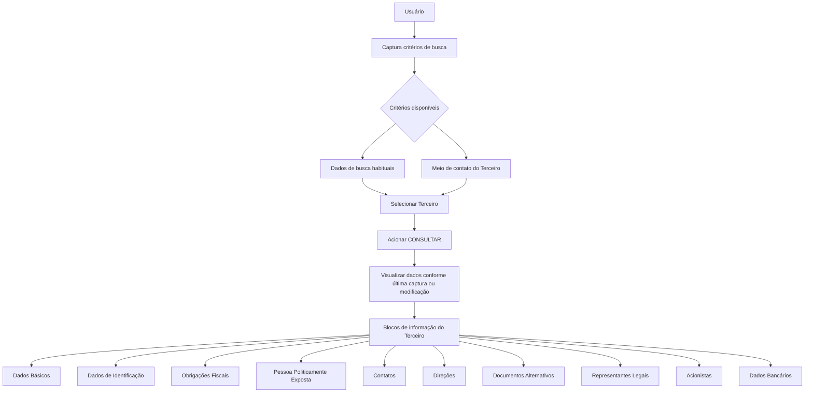

# Consulta de Terceiro por Situação em Vigor — Documentação Reef

## 1. Metadados do Documento
- **Arquivo de Origem:** Não identificado no conteúdo fornecido
- **Tipo de Documento:** Procedimento
- **Domínio / Sistema:** Reef / Mapfre / Mapfredocument
- **Público-Alvo:** Operação, usuários de consulta e analistas funcionais
- **Data/Versão Identificada:** Não identificada

---

## 2. Resumo Executivo & Contexto de Negócio

O documento descreve a operação **“Consultar Tercero por Situación en Vigor”**, destinada à consulta de informações de um Terceiro após a captura dos critérios de busca e a seleção do registro desejado. Os critérios podem ser os dados de busca mais habituais ou o meio de contato do Terceiro.

Após o acionamento do botão de consulta, a operação apresenta os dados do Terceiro nas diversas estruturas de informação. A visualização considera a última data em que os dados foram capturados ou modificados em cada estrutura.

As informações são organizadas em blocos funcionais, incluindo dados básicos, identificação, obrigações fiscais, pessoa politicamente exposta, contatos, direções, documentos alternativos, representantes legais, acionistas e dados bancários.

O conteúdo estabelece que os dados apresentados podem variar conforme o código de atividade do Terceiro e conforme o tipo de Terceiro, que pode ser Pessoa Física ou Pessoa Jurídica. Não há limitação de visualização associada ao papel do usuário que realiza a consulta.

---

## 3. Arquitetura, Componentes & Tecnologias Envolvidas

Os componentes e referências identificados no conteúdo são:

| Componente / Referência | Descrição sustentada pelo conteúdo |
| :--- | :--- |
| Reef | Contexto de documentação exibido como “DOCUMENTACIÓN Reef”. |
| Mapfredocument | Referência de documentação presente no conteúdo. |
| Operação “Consultar Tercero por Situación en Vigor” | Operação de consulta de dados de um Terceiro. |
| Terceiro | Entidade consultada pela operação. |
| Usuário | Executa a consulta; seu papel não limita a visualização dos dados. |
| Blocos de informação | Estruturas que apresentam informações do Terceiro. |



**Nota de Análise:** O conteúdo não detalha tecnologias de implementação, métodos HTTP, contratos JSON, bancos de dados, URLs de ambientes ou integrações entre sistemas.

---

## 4. Regras de Negócio, Especificações Funcionais & Processos

### Processo de consulta

1. O usuário captura os critérios necessários para realizar a busca.
2. Os critérios de busca podem ser os dados de busca mais habituais ou o meio de contato do Terceiro.
3. O usuário seleciona o Terceiro cuja informação pretende consultar.
4. O usuário pressiona o botão correspondente à operação de consulta.
5. A operação apresenta os dados do Terceiro nas diferentes estruturas de informação.
6. Os dados apresentados em cada estrutura correspondem à última data em que foram capturados ou modificados.

### Regras de visualização

| Regra | Descrição |
| :--- | :--- |
| Atualidade dos dados | A informação exibida em cada estrutura considera a última data em que os dados foram capturados ou modificados. |
| Variação por código de atividade | Os dados visíveis em cada bloco ou estrutura de informação podem variar conforme o código de atividade do Terceiro. |
| Variação por tipo de Terceiro | Os dados visíveis também podem variar se o tipo de Terceiro for Pessoa Física ou Pessoa Jurídica. |
| Limitação por papel do usuário | Não existe limitação para visualizar os dados associada ao papel do usuário que efetua a consulta. |

### Ação habilitada

- **CONSULTAR**

### Estruturas de informação disponíveis

- Dados Básicos
- Dados de Identificação do Terceiro
- Obrigações Fiscais
- Pessoa Politicamente Exposta
- Contatos
- Direções
- Documentos Alternativos
- Representantes Legais
- Acionistas
- Dados Bancários

---

## 5. Tabelas de Parâmetros, Ambientes e Estruturas de Dados

| Item / Parâmetro | Descrição / Função | Tipo / Valores / Formato | Ambiente / Observações |
| :--- | :--- | :--- | :--- |
| Critérios de busca | Permitem realizar a busca de um Terceiro. | Dados de busca habituais ou meio de contato do Terceiro. | O conteúdo não detalha campos ou formatos dos critérios. |
| Terceiro selecionado | Registro cuja informação será consultada. | Terceiro. | Deve ser selecionado após a busca. |
| CONSULTAR | Ação habilitada para visualizar a informação do Terceiro. | Botão / ação. | A consulta não possui limitação associada ao papel do usuário. |
| Dados Básicos | Estrutura de informação do Terceiro. | Bloco de dados. | Pode variar conforme código de atividade e tipo de Terceiro. |
| Dados de Identificação do Terceiro | Estrutura de identificação do Terceiro. | Bloco de dados. | Pode variar conforme código de atividade e tipo de Terceiro. |
| Obrigações Fiscais | Estrutura de informação fiscal do Terceiro. | Bloco de dados. | Mencionada no processo; sem detalhamento de campos. |
| Pessoa Politicamente Exposta | Estrutura de informação relativa a Pessoa Politicamente Exposta. | Bloco de dados. | Mencionada no processo; sem detalhamento de campos. |
| Contatos | Estrutura de meios de contato do Terceiro. | Bloco de dados. | O meio de contato também pode ser usado como critério de busca. |
| Direções | Estrutura de informações de endereço. | Bloco de dados. | Mencionada como “Direcciones” no conteúdo original. |
| Documentos Alternativos | Estrutura de documentos alternativos. | Bloco de dados. | Sem detalhamento de tipos documentais. |
| Representantes Legais | Estrutura de representantes legais do Terceiro. | Bloco de dados. | Sem detalhamento de campos. |
| Acionistas | Estrutura de acionistas do Terceiro. | Bloco de dados. | Sem detalhamento de campos. |
| Dados Bancários | Estrutura de dados bancários do Terceiro. | Bloco de dados. | Sem detalhamento de campos. |
| Código de atividade | Condiciona os dados visualizados nos blocos. | Código de atividade do Terceiro. | Valores não especificados. |
| Tipo de Terceiro | Condiciona os dados visualizados nos blocos. | Pessoa Física ou Pessoa Jurídica. | Não são descritos outros tipos. |

---

## 6. Bateria de Perguntas & Respostas para RAG (FAQ Sintético)

### P1: Em que consiste a operação “Consultar Tercero por Situación en Vigor”?
**R:** A operação permite consultar as informações de um Terceiro após a captura dos critérios de busca, a seleção do Terceiro desejado e o acionamento do botão de consulta. Os dados são apresentados em diferentes estruturas de informação conforme a última data em que foram capturados ou modificados.

### P2: Quais critérios podem ser usados para buscar um Terceiro?
**R:** O documento informa que a busca pode ser realizada pelos dados de busca mais habituais ou pelo meio de contato do Terceiro. O conteúdo não especifica os campos, formatos ou valores aceitos para esses critérios.

### P3: O que acontece após selecionar um Terceiro e acionar a consulta?
**R:** Após selecionar o Terceiro e pressionar o botão correspondente, são visualizados os dados do Terceiro nas diferentes estruturas de informação, considerando a última data em que os dados foram capturados ou modificados.

### P4: Quais blocos de informação podem ser consultados para um Terceiro?
**R:** Os blocos listados são: Dados Básicos, Dados de Identificação do Terceiro, Obrigações Fiscais, Pessoa Politicamente Exposta, Contatos, Direções, Documentos Alternativos, Representantes Legais, Acionistas e Dados Bancários.

### P5: Os dados exibidos são sempre os mesmos para todos os Terceiros?
**R:** Não. Os dados visualizados em cada bloco ou estrutura de informação podem variar de acordo com o código de atividade do Terceiro e também conforme o tipo de Terceiro, que pode ser Pessoa Física ou Pessoa Jurídica.

### P6: O tipo de Terceiro influencia a consulta?
**R:** Sim. O documento estabelece que as informações apresentadas nos blocos podem variar quando o tipo de Terceiro é Pessoa Física ou Pessoa Jurídica.

### P7: O código de atividade do Terceiro influencia os dados apresentados?
**R:** Sim. Os dados visualizados em cada bloco ou estrutura de informação podem variar conforme o código de atividade do Terceiro.

### P8: Existe restrição de consulta baseada no papel do usuário?
**R:** Não. O documento afirma que não existe qualquer limitação para visualizar os dados associada ao papel que o usuário que efetua a consulta possa ter.

### P9: Qual ação está habilitada no procedimento documentado?
**R:** A ação habilitada é **CONSULTAR**.

### P10: A documentação especifica os campos dos Dados Bancários e das Obrigações Fiscais?
**R:** Não. O conteúdo apenas lista Dados Bancários e Obrigações Fiscais como estruturas de informação disponíveis, sem detalhar seus campos, regras de preenchimento ou formatos.

---

## 7. Glossário de Termos, Siglas & Conceitos-Chave

- **Terceiro:** Entidade cujas informações são pesquisadas e consultadas pela operação.
- **Pessoa Física:** Tipo de Terceiro citado como fator que pode alterar os dados visualizados.
- **Pessoa Jurídica:** Tipo de Terceiro citado como fator que pode alterar os dados visualizados.
- **Pessoa Politicamente Exposta:** Estrutura de informação disponível na consulta do Terceiro.
- **Código de atividade:** Atributo do Terceiro que pode determinar a variação dos dados exibidos.
- **CONSULTAR:** Ação habilitada para visualizar dados do Terceiro.
- **Reef:** Referência presente no cabeçalho de documentação.
- **Mapfredocument:** Referência de documentação presente no conteúdo.

---

## 8. Notas Críticas, Riscos & Limitações

- O documento não identifica nome de arquivo, data, versão, autor formal ou classificação documental.
- O conteúdo não detalha os campos dos critérios de busca habituais nem os campos usados como meio de contato.
- O conteúdo não descreve métodos HTTP, contratos JSON, autenticação, autorização técnica, APIs, bancos de dados, URLs ou ambientes.
- O documento lista os blocos de informação, mas não detalha seus atributos, obrigatoriedades, validações ou regras de preenchimento.
- A regra de ausência de limitação por papel do usuário é explícita, mas o conteúdo não descreve mecanismos técnicos de controle de acesso.
- Não há detalhamento adicional sobre as estruturas de Obrigações Fiscais, Pessoa Politicamente Exposta, Documentos Alternativos, Representantes Legais, Acionistas e Dados Bancários.

---

## 9. Conteúdo Bruto Estruturado (Referência Fiel)

```text
--- [PÁGINA 1 DE 2] ---

OPERACIÓN CONSULTAR Tercero por Situación en Vigor
¿En que consiste?
Una vez capturados los criterios para realizar la búsqueda, sean estos por los datos de búsqueda más habituales o por el medio de contacto
del Tercero y haber seleccionado el Tercero del cual se pretende consultar su información...
... tras pulsar el botón correspondiente, se visualizarán sus datos en las distintas estructuras de información de acuerdo a la última fecha en
los que estos hayan sido capturados o modicados en ellas.
Proceso
Datos
Básicos
Datos
Identificación
Obligaciones
Fiscales
Persona
Políticamente
Expuesta
Contactos Direcciones Documentos
Alternativos
Representantes
Legales Accionistas Datos
Bancarios
Premisas
Los datos que se visualizan en cada uno de los bloques o estructuras de información pueden variar de acuerdo con el código de
actividad del Tercero.
Además, los datos que se visualizan en cada uno de los bloques o estructuras de información también pueden variar si el Tipo de Tercero
es una Persona Física o una Persona Jurídica.
No existe limitación alguna para visualizar los datos asociado al rol que pudiera tener del Usuario que efectúa la consulta.
Acciones habilitadas
 CONSULTAR ( )
Datos del Tercero
 Datos Básicos ( )
 Datos Identicación del Tercero ( )
 Persona Políticamente Expuesta ( )
 Contactos ( )
Documentation / DOCUMENTACIÓN Reef
DOCUMENTACIÓN Reef
Mapfredocument
DOCUMENTACIÓN Reef
Owner
user:agonzalez_mapfre.com
Lifecycle
Approved Source
 / 
 VL
Buscar Inicio Soluciones Arquitecturas APIs Componentes Cloud Documentación Zeus Reef Ayuda
ES


--- [PÁGINA 2 DE 2] ---

Direcciones ( )
 Documentos Alternativos ( )
 Representantes Legales ( )
 Accionistas ( )
 Datos Bancarios ( )
```
