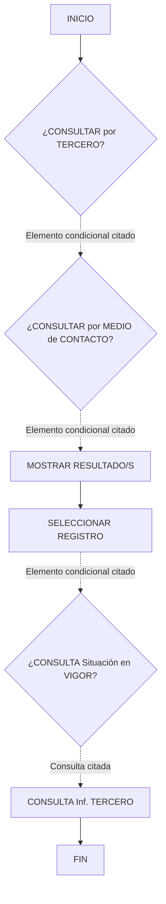

# Operação “Consultar Tercero” — Documentação Reef

## 1. Metadados do Documento
- **Arquivo de Origem:** Não identificado no conteúdo fornecido
- **Tipo de Documento:** Procedimento operacional
- **Domínio / Sistema:** Reef / Mapfredocument
- **Público-Alvo:** Operação e usuários que consultam informações de terceiros
- **Data/Versão Identificada:** Não identificada

---

## 2. Resumo Executivo & Contexto de Negócio

O documento descreve a operação **“Consultar Tercero”**, destinada à consulta de informações de terceiros em sua última situação. A operação cobre terceiros classificados como **Personas Físicas** ou **Personas Jurídicas**.

A consulta pode ser iniciada por dois critérios de busca apresentados no documento: dados do terceiro ou meio de contato do terceiro. Após a consulta, o fluxo indica a apresentação de resultados e a seleção de um registro.

O material também menciona a consulta de **Situação em Vigor** e a consulta de informações do terceiro. O conteúdo fornecido não detalha campos de entrada, regras de filtro, critérios de ordenação, contratos de integração, métodos HTTP ou estrutura de dados retornada.

---

## 3. Arquitetura, Componentes & Tecnologias Envolvidas

| Componente / Termo | Papel identificado no documento |
| :--- | :--- |
| **Operação “Consultar Tercero”** | Processo de consulta de informações de terceiros. |
| **Tercero** | Entidade consultada, podendo ser Persona Física ou Persona Jurídica. |
| **Reef** | Domínio de documentação indicado por “Documentation / DOCUMENTACIÓN Reef”. |
| **Mapfredocument** | Elemento de navegação ou repositório citado no conteúdo. |
| **Owner** | Identificado como `user:agonzalez_mapfre.com`. |
| **Lifecycle** | Indicado como `Approved Source`. |
| **VL** | Sigla exibida no conteúdo, sem detalhamento adicional. |

O documento apresenta um fluxo operacional, mas a extração textual não preserva as conexões direcionais nem a associação inequívoca entre cada resposta **SI/NO** e os próximos passos. O diagrama abaixo representa somente os elementos explicitamente identificados, sem inferir caminhos condicionais ausentes.



> **Nota de Análise:** A direção e os destinos das ramificações `SI` e `NO` não estão legíveis no conteúdo bruto fornecido. O documento não permite afirmar quais passos são executados para cada resposta.

---

## 4. Regras de Negócio, Especificações Funcionais & Processos

### Objetivo funcional
A operação permite consultar informações de terceiros em sua última situação.

### Escopo de entidades
- **Personas Físicas**
- **Personas Jurídicas**

### Critérios de busca apresentados
1. Consultar por dados do terceiro.
2. Consultar por meio de contato do terceiro.

### Ações e etapas identificadas
1. Início da operação.
2. Avaliação da consulta por terceiro.
3. Avaliação da consulta por meio de contato.
4. Exibição de resultado(s).
5. Seleção de registro.
6. Avaliação de consulta de situação em vigor.
7. Consulta de informações do terceiro.
8. Fim do processo.

### Restrições de fidelidade documental
- O documento não descreve quais dados compõem os “Dados del Tercero”.
- O documento não informa quais meios de contato podem ser utilizados.
- O documento não define campos obrigatórios, formatos, máscaras, validações ou mensagens de erro.
- O documento não detalha o significado funcional de “Situación en Vigor”.
- O documento não especifica permissões, perfis de acesso, serviços, APIs ou integrações técnicas.

---

## 5. Tabelas de Parâmetros, Ambientes e Estruturas de Dados

| Item / Parâmetro | Descrição / Função | Tipo / Valores / Formato | Ambiente / Observações |
| :--- | :--- | :--- | :--- |
| Operação | Consulta de informações de terceiros em sua última situação. | `Consultar Tercero` | Processo operacional documentado. |
| Tipo de terceiro | Classificação da entidade consultada. | `Personas Físicas`; `Personas Jurídicas` | Ambos são citados como escopo da operação. |
| Critério de busca | Consulta por dados do terceiro. | `¿Consultar por Datos del Tercero?` | Campos não detalhados. |
| Critério de busca | Consulta por meio de contato do terceiro. | `¿Consultar por Medio de Contacto del Tercero?` | Meios de contato não detalhados. |
| Consulta adicional | Consulta de situação em vigor. | `¿Consultar Situación en Vigor?` | Regra e resultado não detalhados. |
| Resultado | Apresentação dos resultados da consulta. | `MOSTRAR RESULTADO/S` | Estrutura de resultado não detalhada. |
| Seleção | Escolha de um resultado apresentado. | `SELECCIONAR REGISTRO` | Critérios de seleção não detalhados. |
| Consulta de informação | Consulta das informações do terceiro. | `CONSULTA Inf. TERCERO` | Conteúdo retornado não detalhado. |
| Owner | Proprietário indicado na documentação. | `user:agonzalez_mapfre.com` | Exibido no conteúdo bruto. |
| Lifecycle | Estado de ciclo de vida indicado. | `Approved Source` | Exibido no conteúdo bruto. |
| Referência documental | Área ou produto citado no menu de documentação. | `Reef` | Também aparece como “DOCUMENTACIÓN Reef”. |
| Referência documental | Elemento citado no conteúdo. | `Mapfredocument` | Sem descrição adicional. |
| Sigla | Sigla apresentada no cabeçalho. | `VL` | Significado não identificado. |
| Idioma | Idioma exibido na navegação. | `ES` | Exibido no conteúdo bruto. |

---

## 6. Bateria de Perguntas & Respostas para RAG (FAQ Sintético)

### P1: Em que consiste a operação “Consultar Tercero”?
**R:** A operação “Consultar Tercero” permite consultar informações de terceiros em sua última situação. O documento informa que os terceiros podem ser Personas Físicas ou Personas Jurídicas.

### P2: Quais tipos de terceiros podem ser consultados?
**R:** A operação contempla terceiros classificados como Personas Físicas e Personas Jurídicas.

### P3: Quais critérios de busca são apresentados para a operação “Consultar Tercero”?
**R:** O documento apresenta dois critérios: consulta por dados do terceiro e consulta por meio de contato do terceiro.

### P4: O documento detalha quais campos fazem parte dos dados do terceiro?
**R:** Não. O documento apenas apresenta a opção “¿Consultar por Datos del Tercero?”, sem listar campos, formatos, obrigatoriedades ou regras de validação.

### P5: Quais meios de contato podem ser usados para consultar um terceiro?
**R:** O conteúdo menciona a opção “¿Consultar por Medio de Contacto del Tercero?”, mas não especifica quais meios de contato são aceitos.

### P6: O que ocorre após a consulta no fluxo apresentado?
**R:** O fluxo contém as etapas “MOSTRAR RESULTADO/S” e “SELECCIONAR REGISTRO”. O conteúdo não detalha os critérios de apresentação, ordenação ou seleção dos resultados.

### P7: O que significa a consulta de “Situación en Vigor”?
**R:** O documento contém a decisão “¿CONSULTA Situación en VIGOR?”, mas não define o significado funcional de “Situación en Vigor”, suas regras ou os dados retornados.

### P8: A operação documenta APIs, métodos HTTP ou contratos JSON?
**R:** Não. O documento não apresenta APIs, métodos HTTP, URLs, contratos JSON, serviços técnicos ou especificações de integração.

### P9: Quem é o owner identificado na documentação?
**R:** O conteúdo identifica o owner como `user:agonzalez_mapfre.com`.

### P10: Qual é o status de lifecycle indicado?
**R:** O lifecycle indicado no conteúdo é `Approved Source`.

### P11: Qual é a relação de Reef com o documento?
**R:** Reef é citado no conteúdo como “Documentation / DOCUMENTACIÓN Reef” e “DOCUMENTACIÓN Reef”. O documento não detalha se Reef é um sistema, repositório, portal ou domínio funcional.

### P12: O documento define o roteamento das respostas “SI” e “NO” do fluxograma?
**R:** Não de forma recuperável pela extração fornecida. Os marcadores “SI” e “NO” estão presentes, mas as conexões e os destinos de cada ramificação não foram preservados no texto bruto.

---

## 7. Glossário de Termos, Siglas & Conceitos-Chave

- **Consultar Tercero:** Operação para consulta das informações de terceiros em sua última situação.
- **Tercero:** Entidade consultada pela operação; pode ser Persona Física ou Persona Jurídica.
- **Persona Física:** Tipo de terceiro citado no escopo da operação.
- **Persona Jurídica:** Tipo de terceiro citado no escopo da operação.
- **Medio de Contacto:** Critério de busca citado para consultar um terceiro; formatos aceitos não são detalhados.
- **Situación en Vigor:** Consulta ou condição presente no fluxograma; significado não definido no conteúdo.
- **Reef:** Referência de documentação citada como “DOCUMENTACIÓN Reef”.
- **Mapfredocument:** Termo citado na navegação do conteúdo; função não detalhada.
- **VL:** Sigla exibida no cabeçalho; significado não identificado.
- **Owner:** Campo de propriedade identificado como `user:agonzalez_mapfre.com`.
- **Lifecycle:** Campo de ciclo de vida identificado como `Approved Source`.

---

## 8. Notas Críticas, Riscos & Limitações

- A extração não preserva a estrutura visual completa do fluxograma, especialmente as transições correspondentes a `SI` e `NO`.
- O documento não detalha entradas, saídas, campos, filtros, formatos ou validações da consulta.
- Não há definição de critérios para “última situação” do terceiro.
- Não há detalhamento semântico para “Situación en Vigor”.
- Não foram identificados serviços, APIs, ambientes, URLs, servidores, logs, autenticação, perfis de acesso ou contratos de integração.
- As siglas e termos `VL`, `Reef` e `Mapfredocument` não recebem definição adicional no conteúdo fornecido.

---

## 9. Conteúdo Bruto Estruturado (Referência Fiel)

```text
--- [PÁGINA 1 DE 1] ---

OPERACIÓN CONSULTAR Tercero
¿En que consiste?
Esta operación permite realizar la consulta de la información de los Terceros a su última situación sean estos Personas Físicas o Personas
Jurídicas.
Proceso
SI
NO
SI
NO
SI
NO
INICIO ¿CONSULTAR por
TERCERO?
¿CONSULTAR por
MEDIO de CONTACTO?
MOSTRAR
RESULTADO/S
SELECCIONAR
REGISTRO
¿CONSULTA
Situación en
VIGOR?
CONSULTA Inf.
TERCERO
FIN
Criterios de Búsqueda
 ¿Consultar por Datos del Tercero? ( )
 ¿Consultar por Medio de Contacto del Tercero?( )
Consultas
 ¿Consultar Situación en Vigor? ( )
Documentation / DOCUMENTACIÓN Reef
DOCUMENTACIÓN Reef
Mapfredocument
DOCUMENTACIÓN Reef
Owner
user:agonzalez_mapfre.com
Lifecycle
Approved Source
 / 
 VL
Buscar Inicio Soluciones Arquitecturas APIs Componentes Cloud Documentación Zeus Reef Ayuda
ES
```
