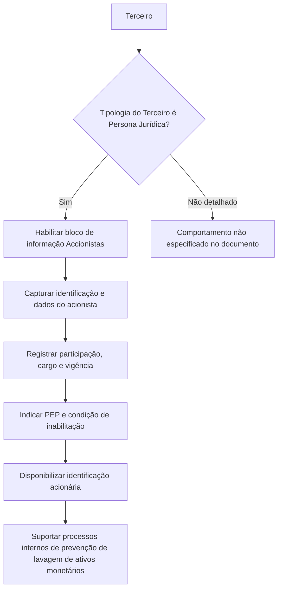

# Cadastro de Acionistas de Terceiros no Reef — Identificação Acionária para Prevenção à Lavagem de Ativos

## 1. Metadados do Documento
- **Arquivo de Origem:** Não identificado no conteúdo fornecido
- **Tipo de Documento:** Especificação Funcional
- **Domínio / Sistema:** DOCUMENTACIÓN Reef / Mapfre
- **Público-Alvo:** Desenvolvedores, Arquitetos, Operação, Negócio e equipes de conformidade
- **Data/Versão Identificada:** Não identificada

---

## 2. Resumo Executivo & Contexto de Negócio

O documento descreve o bloco de informação **Accionistas** para criação e manutenção de acionistas associados a um **Tercero** no sistema Reef. O bloco é aplicável quando a tipologia do terceiro corresponde a uma **Persona Jurídica**.

O objetivo funcional é identificar os acionistas de uma pessoa jurídica. A identificação acionária permite à entidade seguradora gerenciar e controlar internamente situações relacionadas à normativa de prevenção de lavagem de ativos monetários.

A documentação caracteriza uma ação no mercado financeiro como um título emitido por uma Sociedade Anônima ou Sociedade Comanditária por Ações. Cada ação representa o valor de uma das frações iguais nas quais o capital social da sociedade está dividido.

O processo documentado permite registrar dados de identificação, nacionalidade, participação acionária, cargo, vigência, condição de Pessoa Politicamente Exposta e inabilitação do acionista. O sistema também permite registrar um novo acionista já marcado como inabilitado no mesmo processo.

Não há detalhamento de arquitetura técnica, integrações, APIs, persistência de dados, métodos HTTP, contratos JSON, regras de cálculo, validações de formato ou permissões de acesso.

---

## 3. Arquitetura, Componentes & Tecnologias Envolvidas

Os elementos identificados no conteúdo são:

| Componente / Termo | Papel identificado |
| :--- | :--- |
| **Reef** | Sistema ou domínio de documentação no qual o bloco de informação de acionistas está descrito. |
| **DOCUMENTACIÓN Reef** | Área documental indicada no conteúdo extraído. |
| **Mapfre** | Referência corporativa presente nos elementos de navegação/documentação. |
| **Tercero** | Entidade à qual os acionistas são associados. O bloco é aplicável quando o terceiro é uma Persona Jurídica. |
| **Accionistas** | Bloco de informação para identificar e registrar acionistas do terceiro. |
| **Catálogo de cargos** | Catálogo existente no sistema que contém os valores possíveis para o Cargo Acionarial. |
| **Normativa de prevenção de lavagem de ativos monetários** | Contexto regulatório e operacional suportado pela identificação acionária. |



> **Nota de Análise:** O documento não descreve microsserviços, banco de dados, APIs, URLs de ambiente, protocolos de integração, tecnologias de implementação ou mecanismos de autenticação.

---

## 4. Regras de Negócio, Especificações Funcionais & Processos

### 4.1. Condição de aplicação do bloco Accionistas

1. O bloco de informação **Accionistas** é aplicável sempre que a tipologia do **Tercero** corresponder a uma **Persona Jurídica**.
2. O propósito do bloco é identificar os acionistas do terceiro.
3. A identificação dos acionistas habilita a entidade seguradora a cumprir a normativa de prevenção de lavagem de ativos monetários.
4. A identificação acionária permite gerir e controlar internamente esse cenário regulatório.

### 4.2. Ação disponível

O documento apresenta a ação possível:

- **CREAR:** criação de acionistas.

### 4.3. Sequência de captura de informações

O documento estabelece que, da esquerda para a direita e de cima para baixo, os atributos definem a sequência de captura das informações do acionista:

1. Tipo Documento Accionista.
2. Clave del Documento Accionista.
3. Nacionalidad del Accionista.
4. Nombre.
5. Apellidos.
6. Fecha de Alta.
7. Fecha de Baja.
8. Porcentaje Accionarial.
9. Cargo.
10. Fecha de Validez.
11. Marca Persona Políticamente Expuesta.
12. Inhabilitación.

### 4.4. Identificação do acionista

- **Tipo Documento Accionista:** contém o tipo de documento utilizado para identificar a pessoa física ou jurídica identificada como acionista. Os tipos de documento devem ter sido previamente configurados no sistema.
- **Clave del Documento Accionista:** contém a chave do documento do acionista.
- **Nacionalidad del Accionista:** contém o país de nacionalidade do acionista.
- **Nombre:** contém o nome do acionista.
- **Apellidos:** dois campos permitem capturar os sobrenomes do acionista ou a razão social do acionista.

### 4.5. Participação acionária e cargo

- **Fecha de Alta:** identifica a data em que o acionista passa a ter direitos acionários sobre o terceiro.
- **Fecha de Baja:** identifica a data em que o acionista deixa de possuir direitos acionários em relação ao terceiro ao qual está associado.
- **Porcentaje Accionarial:** identifica o percentual de participação acionária do acionista em relação ao número de ações emitidas pelo terceiro.
- **Cargo:** identifica o cargo acionário assumido pelo acionista. Os valores possíveis devem ser definidos no catálogo de cargos existente no sistema.

### 4.6. Vigência e histórico

- **Fecha de Validez:** indica ao sistema a data a partir da qual o acionista do terceiro estará plenamente operacional no sistema.
- O uso correto da data de validade permite manter um histórico das alterações realizadas nas informações do acionista.

### 4.7. Pessoa Politicamente Exposta e inabilitação

- **Marca Persona Políticamente Expuesta:** permite identificar o acionista como Pessoa Politicamente Exposta.
- A marcação de Pessoa Politicamente Exposta permite à entidade seguradora gerenciar e controlar internamente esse fato.
- **Inhabilitación:** estabelece que o acionista está inabilitado no sistema.
- É possível registrar um novo acionista e marcá-lo como inabilitado no mesmo processo.

> **Nota de Análise:** O documento não define critérios de obrigatoriedade, valores aceitos, máscaras, validações de datas, limites para o percentual acionário, regras de consistência entre data de alta e data de baixa, nem o comportamento do sistema para acionistas inabilitados.

---

## 5. Tabelas de Parâmetros, Ambientes e Estruturas de Dados

| Item / Parâmetro | Descrição / Função | Tipo / Valores / Formato | Ambiente / Observações |
| :--- | :--- | :--- | :--- |
| Ação `CREAR` | Permite criar um acionista. | Ação funcional. | Única ação explicitamente apresentada. |
| Tipologia do Tercero | Determina a aplicabilidade do bloco Accionistas. | Persona Jurídica. | O bloco é aplicável quando o terceiro é uma Persona Jurídica. |
| Tipo Documento Accionista | Identifica o tipo de documento da pessoa física ou jurídica acionista. | Tipos previamente configurados no sistema. | O documento não lista os tipos disponíveis. |
| Clave del Documento Accionista | Armazena a chave do documento do acionista. | Não especificado. | Sem regra de formato ou validação descrita. |
| Nacionalidad del Accionista | Armazena o país de nacionalidade do acionista. | País. | O documento não informa catálogo, código ou formato. |
| Nombre | Armazena o nome do acionista. | Não especificado. | Aplicável à identificação do acionista. |
| Apellidos | Captura sobrenomes ou razão social do acionista. | Dois campos. | Permite capturar sobrenomes ou razão social. |
| Fecha de Alta | Registra a data a partir da qual o acionista possui direitos acionários sobre o terceiro. | Data. | Formato não especificado. |
| Fecha de Baja | Registra a data em que o acionista deixa de possuir direitos acionários sobre o terceiro associado. | Data. | Formato não especificado. |
| Porcentaje Accionarial | Registra a participação acionária do acionista em relação ao número de ações emitidas pelo terceiro. | Percentual. | O documento não especifica escala, precisão ou limites. |
| Cargo | Registra o cargo acionário assumido pelo acionista. | Valores definidos no catálogo de cargos. | O catálogo existe no sistema, mas seus valores não são listados. |
| Fecha de Validez | Determina a partir de quando o acionista estará plenamente operacional no sistema. | Data. | Permite manter histórico de alterações nas informações. |
| Marca Persona Políticamente Expuesta | Identifica o acionista como Pessoa Politicamente Exposta. | Marca / atributo. | Apoia processos internos de gestão e controle da entidade seguradora. |
| Inhabilitación | Define que o acionista está inabilitado no sistema. | Propriedade / marca. | Pode ser atribuída durante o registro de um novo acionista. |
| Catálogo de cargos | Fonte dos valores possíveis para o campo Cargo. | Catálogo existente no sistema. | Valores não detalhados no documento. |
| Ambiente | Não identificado. | Não aplicável. | Não há URLs, servidores, portas ou nomes de ambientes. |
| Logs | Não identificados. | Não aplicável. | Não há caminhos, níveis ou parâmetros de log. |

---

## 6. Bateria de Perguntas & Respostas para RAG (FAQ Sintético)

### P1: Quando o bloco de informação Accionistas deve ser utilizado no Reef?
**R:** O bloco de informação Accionistas deve ser utilizado quando a tipologia do Tercero corresponder a uma Persona Jurídica. Nessa condição, o bloco permite identificar os acionistas associados ao terceiro.

### P2: Qual é o objetivo de identificar acionistas de um terceiro?
**R:** A identificação de acionistas permite à entidade seguradora cumprir a normativa de prevenção de lavagem de ativos monetários, além de gerir e controlar internamente esse cenário nos seus processos.

### P3: Quais são os dados de identificação capturados para um acionista?
**R:** O documento descreve os campos Tipo Documento Accionista, Clave del Documento Accionista, Nacionalidad del Accionista, Nombre e Apellidos. Os dois campos de Apellidos podem capturar os sobrenomes ou a razão social do acionista.

### P4: De onde vêm os valores aceitos para o Tipo Documento Accionista?
**R:** O Tipo Documento Accionista utiliza os tipos de documentos que tenham sido previamente configurados no sistema. O documento não apresenta a lista desses tipos de documento.

### P5: O que representa a Fecha de Alta de um acionista?
**R:** A Fecha de Alta identifica a data em que o acionista passa a ter os direitos acionários do Tercero.

### P6: O que representa a Fecha de Baja de um acionista?
**R:** A Fecha de Baja identifica a data em que o acionista deixa de possuir direitos acionários em relação ao Tercero ao qual está associado.

### P7: Como o Porcentaje Accionarial é definido no cadastro de acionistas?
**R:** O Porcentaje Accionarial identifica o percentual de participação acionária do acionista em relação ao número de ações emitidas pelo Tercero. O documento não informa limites, casas decimais ou regras de validação para esse percentual.

### P8: Como é preenchido o Cargo de um acionista?
**R:** O campo Cargo identifica o cargo acionário exercido pelo acionista. Os valores possíveis são definidos no catálogo de cargos existente no sistema, mas o documento não lista os cargos disponíveis.

### P9: Para que serve a Fecha de Validez?
**R:** A Fecha de Validez informa ao sistema a data a partir da qual o acionista do Tercero estará plenamente operacional. O uso correto dessa propriedade permite manter um histórico das alterações efetuadas nas informações do acionista.

### P10: O que significa a Marca Persona Políticamente Expuesta?
**R:** A Marca Persona Políticamente Expuesta identifica o acionista como Pessoa Politicamente Exposta. Essa identificação permite à entidade seguradora gerir e controlar internamente esse fato nos seus processos.

### P11: É possível cadastrar um acionista já inabilitado?
**R:** Sim. O documento informa expressamente que é possível registrar um novo acionista e marcá-lo como inabilitado no mesmo processo.

### P12: O documento define APIs, métodos HTTP ou contratos JSON para o cadastro de acionistas?
**R:** Não. O documento descreve campos funcionais e regras de negócio do bloco Accionistas, mas não detalha APIs, métodos HTTP, contratos JSON, integrações, banco de dados ou arquitetura técnica.

---

## 7. Glossário de Termos, Siglas & Conceitos-Chave

- **Accionistas:** Bloco de informação destinado à identificação e ao registro dos acionistas de um Tercero.
- **Cargo Accionarial:** Cargo assumido pelo acionista, conforme valores definidos no catálogo de cargos do sistema.
- **Clave del Documento Accionista:** Chave do documento que identifica o acionista.
- **Fecha de Alta:** Data em que o acionista passa a ter direitos acionários sobre o Tercero.
- **Fecha de Baja:** Data em que o acionista deixa de ter direitos acionários sobre o Tercero associado.
- **Fecha de Validez:** Data a partir da qual o acionista estará plenamente operacional no sistema.
- **Inhabilitación:** Propriedade que estabelece que o acionista está inabilitado no sistema.
- **Marca Persona Políticamente Expuesta:** Atributo que identifica o acionista como Pessoa Politicamente Exposta.
- **Persona Jurídica:** Tipologia de Tercero para a qual o bloco Accionistas é aplicável.
- **Porcentaje Accionarial:** Percentual de participação do acionista em relação ao número de ações emitidas pelo Tercero.
- **Razón Social:** Denominação social que pode ser capturada nos campos Apellidos para um acionista.
- **Reef:** Sistema ou domínio documental mencionado no conteúdo fornecido.
- **Tercero:** Entidade à qual o acionista está associado.
- **Tipo Documento Accionista:** Tipo de documento utilizado para identificar a pessoa física ou jurídica acionista.

---

## 8. Notas Críticas, Riscos & Limitações

- O documento não identifica o arquivo de origem, autor, data, versão ou responsável pela documentação.
- O conteúdo não apresenta arquitetura de software, componentes técnicos, integrações, APIs, banco de dados, eventos, filas, protocolos ou mecanismos de autenticação.
- Não existem URLs, ambientes, servidores, portas, variáveis de configuração ou rotas de logs no texto extraído.
- O documento não detalha valores do catálogo de cargos nem tipos de documentos previamente configurados no sistema.
- Não são definidos formatos, obrigatoriedade, regras de validação ou mensagens de erro para os campos.
- Não há regra explícita de consistência entre Fecha de Alta, Fecha de Baja e Fecha de Validez.
- Não há detalhamento sobre os efeitos operacionais da inabilitação, além de indicar que o acionista fica inabilitado no sistema.
- Não há definição de critérios, processo de aprovação ou controles adicionais associados à marca de Pessoa Politicamente Exposta.
- O conteúdo extraído contém caracteres de substituição ou codificação incorreta em palavras como “nanciero”, “Identicar”, “congurados” e “denidos”. A interpretação foi preservada sem introduzir conteúdo externo.

---

## 9. Conteúdo Bruto Estruturado (Referência Fiel)

```text
--- [PÁGINA 1 DE 2] ---

CREAR Accionistas del Tercero
Objetivo
Una acción en el mercado nanciero es un título emitido por una Sociedad Anónima o Sociedad comanditaria por acciones que representa el
valor de una de las fracciones iguales en que se divide su capital social.
Siempre y cuando la tipología del Tercero corresponda a una Persona Jurídica, el propósito de este Bloque de Información es Identicar a
sus Accionistas lo que habilita a la entidad aseguradora en el cumplimiento de la normativa de prevención de lavado de activos monetarios
ya que la identicación accionarial permitirá gestionar y controlar en sus procesos internos dicho supuesto.
Posibles Acciones
 CREAR ( )
Accionistas
De izquierda a derecha y de arriba hacia abajo, los siguientes atributos marcan la secuencia de captura de la información.
Tipo Documento Accionista (  )
Este Atributo del colapsador contiene el tipo de documento con el que se va a identicar a la persona física o jurídica identicada como
accionista de acuerdo con los tipos de documentos que hayan sido congurados previamente en el sistema.
Clave del Documento Accionista ( )
Este Atributo del panel contiene la clave del documento del Accionista.
Nacionalidad del Accionista (  )
Este Atributo del panel contiene el país de nacionalidad del Accionista.
Nombre ( )
Este Atributo del colapsador contendrá el nombre del Accionista.
Documentation / DOCUMENTACIÓN Reef
DOCUMENTACIÓN Reef
Mapfredocument
DOCUMENTACIÓN Reef
Owner
user:agonzalez_mapfre.com
Lifecycle
Approved Source
 / 
 VL
Buscar Inicio Soluciones Arquitecturas APIs Componentes Cloud Documentación Zeus Reef Ayuda
ES


--- [PÁGINA 2 DE 2] ---

Apellidos ( )
Estos dos campos del colapsador permiten capturar o bien los Apellidos o bien la Razón Social del accionista.
Fecha de Alta ( )
Este Campo identica la fecha en la que el Accionista tiene los derechos accionariales del Tercero.
Fecha de Baja ( )
Este Campo identica la fecha en la que el Accionista causa baja en relación con los derechos accionariales del Tercero al que está asociado.
Porcentaje Accionarial ( )
Este Campo identica el Porcentaje accionarial del Accionista en relación al número de acciones emitidas por el Tercero.
Cargo ( )
Este Campo identica el Cargo Accionarial que sustenta el Accionista de acuerdo con los posibles valores en los cargos denidos en el
catálogo de cargos existente en el Sistema.
Fecha de Validez ( )
Esta propiedad le indica al sistema la fecha a partir de la cual el Accionista del Tercero estará plenamente operativo en el sistema por lo que
su correcto uso permite tener un histórico de los cambios efectuados con su información.
Marca Persona Políticamente Expuesta ( )
Este Atributo permite identicar al Accionista como Persona Políticamente Expuesta, marca que permitiría a la entidad aseguradora gestionar
y controlar en sus procesos internos este hecho.
Inhabilitación ( )
Esta propiedad establece que el Accionista está inhabilitado en el sistema.
Es posible Registrar un nuevo accionista y marcarlo a su vez como Inhabilitado en el mismo proceso.
Consejo:
```
