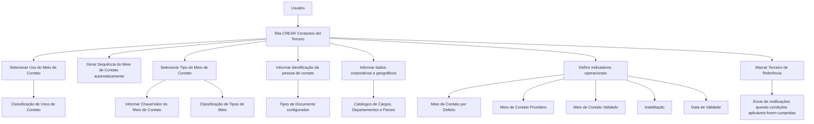

# REEF — Criação de Contatos de Terceiros: Especificação Funcional de Meios de Contato

## 1. Metadados do Documento
- **Arquivo de Origem:** Não informado; conteúdo extraído de “DOCUMENTACIÓN Reef / Mapfredocument”
- **Tipo de Documento:** Especificação Funcional
- **Domínio / Sistema:** Reef — gestão de Terceiros e Meios de Contato
- **Público-Alvo:** Desenvolvedores, Analistas Funcionais, Operação e equipes da entidade seguradora
- **Data/Versão Identificada:** Não identificada
- **Owner identificado:** `user:agonzalez_mapfre.com`
- **Lifecycle identificado:** Approved Source

---

## 2. Resumo Executivo & Contexto de Negócio

O documento descreve a tela **“CREAR Contactos del Tercero”** do sistema Reef. O objetivo funcional da tela é permitir que usuários registrem um ou mais meios de contato associados a um Terceiro. O registro pode ser utilizado tanto para Pessoas Físicas quanto para Pessoas Jurídicas, exceto quando o documento indicar expressamente uma diferenciação.

A funcionalidade organiza a captura de dados em uma sequência de atributos, percorridos da esquerda para a direita e de cima para baixo. Os atributos abrangem classificação de uso e tipo de contato, valor efetivo do contato, identificação da pessoa de contato, vínculo corporativo, localização geográfica, indicadores operacionais e dados de histórico.

A entidade seguradora possui responsabilidade explícita pela revisão das classificações utilizadas para **Usos dos Contatos** e **Tipos dos Meios de Contato**, para garantir o emprego e a exploração corretos dessas informações em seus processos internos. O documento também referencia catálogos previamente configurados no sistema para documentos, cargos, departamentos e países.

A gestão de meios de contato contempla regras relevantes para operação e qualidade de dados: um meio padrão por uso, um único meio prioritário para o conjunto de contatos do Terceiro, validação realizada pela entidade seguradora, inabilitação de meios fora de vigor e vigência datada para suportar histórico de alterações.

Há uma regra específica para a marcação de **Terceiro de Referência**, vinculada ao envio de notificações e condicionada à ativação do controle de limite de prêmios para prevenção à lavagem de dinheiro, à natureza jurídica do Terceiro e à configuração de envio de notificações para esse Terceiro.

---

## 3. Arquitetura, Componentes & Tecnologias Envolvidas

O conteúdo apresenta uma funcionalidade de captura de dados dentro do sistema **Reef**, relacionada ao cadastro de Terceiros e seus meios de contato. Não são detalhados componentes técnicos, APIs, métodos HTTP, contratos JSON, banco de dados, microsserviços, tecnologias de infraestrutura ou ambientes de execução.

Os elementos funcionais explicitamente identificados são:

- Tela **CREAR Contactos del Tercero**.
- Ação possível: **CREAR**.
- Cadastro de um ou vários meios de contato por Terceiro.
- Catálogo de Usos dos Contatos de Terceiros.
- Catálogo de Tipos de Meios de Contato de Terceiros.
- Catálogo configurado de Tipos de Documento.
- Catálogo de Cargos.
- Catálogo de Departamentos de Empresas.
- Catálogo de Países.
- Configuração da Companhia para controle no limite de prêmios voltado à prevenção de lavagem de dinheiro.
- Processos operativos, aplicações e processos internos da entidade seguradora.
- Notificações direcionadas ao contato marcado como Pessoa de Referência.



> **Nota de Análise:** O documento não detalha arquitetura técnica, integrações, serviços, persistência, autenticação, APIs ou contratos de dados da funcionalidade Reef.

---

## 4. Regras de Negócio, Especificações Funcionais & Processos

### 4.1 Escopo da funcionalidade

1. A tela permite criar um ou vários meios de contato para um Terceiro.
2. A ação explicitamente indicada no documento é **CREAR**.
3. Os atributos devem ser capturados na sequência descrita visualmente: da esquerda para a direita e de cima para baixo.
4. Caso os campos não sejam expressamente especificados ou indicados, os campos aplicam-se indistintamente ao registro de informações de Pessoas Físicas e Pessoas Jurídicas.

### 4.2 Classificação e identificação do meio de contato

1. **Uso do Meio de Contato** contém um dos valores da classificação de usos atribuídos aos contatos de Terceiros.
2. A classificação de usos deve ser revisada pela entidade seguradora para o uso correto e para a exploração nos processos internos da entidade.
3. **Sequência do Meio de Contato** representa o número sequencial na captura dos meios de contato do Terceiro.
4. O sistema atribui automaticamente a sequência do meio de contato durante o processo de captura.
5. **Tipo do Meio de Contato** contém um dos valores da classificação dos tipos de meios de contato do Terceiro.
6. A classificação dos tipos de meios de contato deve ser revisada pela entidade seguradora antes de sua consideração e emprego nos processos internos.
7. **Chave/valor do Meio de Contato** contém o valor efetivo do tipo de meio de contato selecionado.
8. Quando o tipo selecionado for **Correio eletrônico**, o valor informado deve ter formato e conteúdo de endereço de e-mail, como `xxxxxx@zzzzzz.zzz`.
9. Quando o tipo selecionado for **Telefone**, o valor informado deve ter formato e conteúdo correspondentes a telefone, como `< +99 99 9999 9999>`, em conformidade com as regras dos Planos Nacionais de Numeração Telefônica dos países.

### 4.3 Dados da pessoa de contato

1. **Nome do Meio de Contato** armazena o nome ou os nomes da pessoa que atua como meio de contato.
2. **Primeiro e Segundo Sobrenome do Contato** armazena o sobrenome ou os sobrenomes da pessoa que atua como contato.
3. **Tipo Documento** contém o tipo de documento usado para identificar a Pessoa Física ou Jurídica atuando como contato.
4. Os tipos de documento devem ter sido previamente configurados no sistema.
5. **Chave do Documento** contém a chave do documento que identifica a Pessoa de Contato.

### 4.4 Dados organizacionais e geográficos

1. **Tipo de Cargo na Empresa** contém o valor da classificação de cargos das pessoas nas empresas, associado à Pessoa de Contato.
2. **Cargo/Atividade do Contato** contém o código do posto utilizado para identificar o Contato do Terceiro, conforme o catálogo de cargos existente no sistema.
3. **Departamento do Contato** contém o código do departamento ou seção utilizado para identificar o Contato do Terceiro, conforme o catálogo de departamentos de empresas existente no sistema.
4. **Chave do País** contém o código do primeiro nível da estrutura geográfica, correspondente a países, no qual o Meio de Contato do Terceiro é identificado.
5. A Chave do País deve seguir a relação de valores do catálogo de países existente no sistema.
6. **Relação** é um campo de texto livre utilizado para detalhar ou ampliar informações sobre o Departamento do Contato ou sobre a relação entre o Contato e o Terceiro.

### 4.5 Terceiro de Referência e notificações

A marca **Terceiro de Referência** indica que o Contato é a pessoa de referência à qual devem ser enviadas as notificações correspondentes. Essa indicação aplica-se quando as seguintes condições forem cumpridas:

1. O controle no limite de prêmios para prevenção de lavagem de dinheiro está ativado na Configuração da Companhia.
2. O Terceiro em captura é uma Pessoa Jurídica.
3. Na Informação do Terceiro foi indicado que notificações devem ser enviadas para esse Terceiro.

### 4.6 Meio de contato padrão

1. O campo **Meio de Contato por Defeito** identifica, entre vários meios de contato associados ao mesmo Terceiro, qual deve ser considerado como padrão nos processos operativos e/ou nas aplicações da entidade.
2. Só pode haver um meio de contato identificado como padrão para cada Uso de Meio de Contato atribuído.

### 4.7 Meio de contato prioritário

1. O campo **Meio de Contato Prioritário** identifica, entre vários meios de contato associados ao Terceiro, o meio a ser considerado preferencialmente nos processos operativos da entidade.
2. Só pode haver um meio de contato prioritário para o total de meios de contato do Terceiro.

### 4.8 Validade, qualidade e histórico

1. **Meio de Contato Validado** informa se o meio de contato foi efetivamente validado pela entidade seguradora.
2. A validação tem a finalidade de classificar a qualidade da informação capturada no sistema.
3. **Inabilitação** informa se o meio de contato associado ao Terceiro deixou de estar em vigor.
4. Caso o meio esteja inabilitado, essa condição deve ser considerada nos processos internos da entidade.
5. **Data de Validade** informa ao sistema a data a partir da qual o meio de contato estará plenamente operativo.
6. O uso adequado da Data de Validade permite manter histórico das alterações realizadas na informação do meio de contato do Terceiro.
7. **Observações** permite registrar texto simples para ampliar ou detalhar informações do meio de contato do Terceiro.

---

## 5. Tabelas de Parâmetros, Ambientes e Estruturas de Dados

| Item / Parâmetro | Descrição / Função | Tipo / Valores / Formato | Ambiente / Observações |
| :--- | :--- | :--- | :--- |
| Ação | Operação indicada para a tela de contatos | `CREAR` | O documento não descreve outras ações. |
| Uso do Meio de Contato | Classifica o uso atribuído ao contato do Terceiro | Um valor da classificação de usos | A entidade seguradora deve revisar a classificação para uso e exploração internos corretos. |
| Sequência do Meio de Contato | Número sequencial da captura de meios de contato do Terceiro | Número de sequência | Atribuído automaticamente pelo sistema durante a captura. |
| Tipo do Meio de Contato | Classifica o tipo de meio de contato do Terceiro | Um valor da classificação de tipos | A entidade seguradora deve revisar a classificação para utilização em processos internos. |
| Chave/valor do Meio de Contato | Armazena o valor efetivo do meio associado ao tipo definido | E-mail, telefone ou formato correspondente ao tipo | Para e-mail: `xxxxxx@zzzzzz.zzz`; para telefone: `< +99 99 9999 9999>`, conforme planos nacionais de numeração. |
| Nome do Meio de Contato | Armazena nome(s) da pessoa que atua como meio de contato | Texto | Referente à pessoa de contato. |
| Primeiro e Segundo Sobrenome do Contato | Armazena sobrenome(s) da pessoa de contato | Texto | Referente à pessoa de contato. |
| Tipo Documento | Identifica o tipo de documento da Pessoa Física ou Jurídica de contato | Tipo previamente configurado | O documento cita um “colapsador”, sem detalhar o comportamento da interface. |
| Chave do Documento | Identifica a Pessoa de Contato por seu documento | Chave do documento | O formato não é detalhado. |
| Tipo de Cargo na Empresa | Classificação de cargos associada à Pessoa de Contato | Valor de classificação | O catálogo ou valores permitidos não são detalhados. |
| Cargo/Atividade do Contato | Código do posto que identifica o Contato do Terceiro | Código de cargo | Deve seguir o catálogo de Cargos existente no sistema. |
| Departamento do Contato | Código do departamento ou seção que identifica o Contato do Terceiro | Código de departamento | Deve seguir o catálogo de Departamentos de Empresas existente no sistema. |
| Chave do País | Código do primeiro nível da estrutura geográfica do meio de contato | Código de país | Deve seguir o catálogo de Países existente no sistema. |
| Relação | Detalha ou amplia dados do Departamento do Contato ou da relação com o Terceiro | Texto livre | Não há tamanho ou formato definido. |
| Terceiro de Referência | Indica o contato que deve receber notificações correspondentes | Marca / indicador | Depende de controle de prevenção à lavagem de dinheiro ativo, Terceiro Pessoa Jurídica e configuração de notificações. |
| Meio de Contato por Defeito | Define o meio padrão por uso de contato | Marca / indicador | Máximo de um por Uso de Meio de Contato. |
| Meio de Contato Prioritário | Define o meio preferencial nos processos operativos | Marca / indicador | Máximo de um para o total de meios de contato do Terceiro. |
| Meio de Contato Validado | Informa se a entidade seguradora validou o meio de contato | Marca / indicador | Usado para classificar a qualidade da informação. |
| Inabilitação | Informa se o meio de contato deixou de estar em vigor | Marca / indicador | Deve ser considerado nos processos internos quando aplicável. |
| Data de Validade | Informa quando o meio de contato passa a estar plenamente operativo | Data | Permite histórico de alterações na informação do meio de contato. |
| Observações | Amplia ou detalha informações sobre o meio de contato | Texto simples | Não há formato, limite ou obrigatoriedade especificados. |

> **Nota de Análise:** O documento não apresenta URLs, endereços de servidores, ambientes, rotas de logs, portas, credenciais, APIs ou mapeamentos de infraestrutura.

---

## 6. Bateria de Perguntas & Respostas para RAG (FAQ Sintético)

### P1: Qual é o objetivo da tela “CREAR Contactos del Tercero” no Reef?
**R:** A tela “CREAR Contactos del Tercero” permite que usuários registrem um ou vários meios de contato associados a um Terceiro no sistema Reef. O documento indica que, salvo especificação expressa em contrário, os campos podem ser usados tanto para Pessoas Físicas quanto para Pessoas Jurídicas.

### P2: Como o sistema atribui a sequência de um meio de contato?
**R:** A Sequência do Meio de Contato contém o número sequencial da captura dos meios de contato do Terceiro. Esse valor é atribuído automaticamente pelo sistema durante o processo de captura; o documento não descreve entrada manual desse número pelo usuário.

### P3: Como deve ser preenchido o campo Chave/valor do Meio de Contato para um e-mail?
**R:** Quando o Tipo do Meio de Contato estiver associado a “Correio eletrônico”, a Chave/valor do Meio de Contato deve conter um endereço de e-mail com formato e conteúdo de correio eletrônico, exemplificado no documento como `xxxxxx@zzzzzz.zzz`.

### P4: Como deve ser preenchido o campo Chave/valor do Meio de Contato para um telefone?
**R:** Quando o Tipo do Meio de Contato estiver associado a “Telefone”, a Chave/valor do Meio de Contato deve conter formato e conteúdo correspondentes a telefone, exemplificado como `< +99 99 9999 9999>`. O documento determina que o formato deve respeitar as regras dos Planos Nacionais de Numeração Telefônica dos países.

### P5: Qual é a diferença entre Meio de Contato por Defeito e Meio de Contato Prioritário?
**R:** O Meio de Contato por Defeito define qual meio deve ser considerado padrão nos processos operativos e/ou aplicações da entidade, existindo no máximo um por cada Uso de Meio de Contato. O Meio de Contato Prioritário define o meio considerado preferencialmente nos processos operativos da entidade, existindo no máximo um para o total de meios de contato do Terceiro.

### P6: Em quais condições um contato pode ser marcado como Terceiro de Referência para notificações?
**R:** O contato é marcado como Terceiro de Referência, destinatário das notificações correspondentes, quando o Controle no Limite de Prêmios para Prevenção de Lavagem de Dinheiro está ativado na Configuração da Companhia, o Terceiro em captura é uma Pessoa Jurídica e a Informação do Terceiro indica que notificações devem ser enviadas para esse Terceiro.

### P7: Qual é a finalidade do campo Meio de Contato Validado?
**R:** O campo Meio de Contato Validado informa se a entidade seguradora efetivamente validou o meio de contato. Essa informação é utilizada para classificar a qualidade da informação registrada no sistema.

### P8: Como a inabilitação de um meio de contato deve ser interpretada?
**R:** A Inabilitação informa se o meio de contato associado ao Terceiro deixou de estar em vigor. Quando um meio está inabilitado, essa situação deve ser considerada nos processos internos da entidade seguradora.

### P9: Para que serve a Data de Validade de um meio de contato?
**R:** A Data de Validade informa ao sistema a data a partir da qual o meio de contato estará plenamente operativo. O uso adequado desse campo permite manter o histórico das alterações efetuadas nas informações de meios de contato do Terceiro.

### P10: Quais dados organizacionais podem ser informados para um contato?
**R:** O documento permite informar Tipo de Cargo na Empresa, Cargo/Atividade do Contato, Departamento do Contato, Chave do País e Relação. Cargo/Atividade deve seguir o catálogo de Cargos, Departamento deve seguir o catálogo de Departamentos de Empresas, e Chave do País deve seguir o catálogo de Países existente no sistema.

### P11: O que deve ser informado no campo Relação?
**R:** Relação é um campo de texto livre utilizado para detalhar ou ampliar informações sobre o Departamento do Contato ou sobre a relação do Contato com o Terceiro. O documento não especifica tamanho máximo, formato ou valores predefinidos para esse texto.

### P12: Quem é responsável pela revisão das classificações de usos e tipos de meios de contato?
**R:** A entidade seguradora deve revisar tanto a classificação de Usos dos Contatos de Terceiros quanto a classificação de Tipos dos Meios de Contato do Terceiro. A finalidade dessa revisão é assegurar o emprego correto dessas classificações e sua exploração posterior nos processos internos da entidade.

---

## 7. Glossário de Termos, Siglas & Conceitos-Chave

- **Reef:** Sistema ou domínio documental identificado como “DOCUMENTACIÓN Reef”; o documento não expande a sigla ou nome.
- **Terceiro:** Entidade para a qual são registrados um ou vários meios de contato. O documento prevê aplicação a Pessoas Físicas e Pessoas Jurídicas.
- **Pessoa Física:** Categoria de pessoa mencionada como aplicável ao cadastro de informações de contato.
- **Pessoa Jurídica:** Categoria de Terceiro para a qual se aplica, entre outras condições, a regra de Terceiro de Referência e notificações.
- **Meio de Contato:** Informação de contato associada a um Terceiro, classificada por uso e por tipo.
- **Uso do Meio de Contato:** Classificação que define o uso atribuído a um contato de Terceiro.
- **Tipo do Meio de Contato:** Classificação que define o tipo de contato, como Correio eletrônico ou Telefone.
- **Meio de Contato por Defeito:** Meio selecionado como padrão para um determinado Uso de Meio de Contato.
- **Meio de Contato Prioritário:** Meio selecionado como preferencial entre todos os meios de contato de um Terceiro.
- **Terceiro de Referência:** Pessoa de contato à qual devem ser enviadas as notificações correspondentes quando as condições documentadas forem cumpridas.
- **Controle no Limite de Prêmios:** Controle citado na Configuração da Companhia, relacionado à prevenção de lavagem de dinheiro.
- **Prevenção de Lavagem de Dinheiro:** Finalidade associada ao controle no limite de prêmios; o documento não detalha regras, cálculos ou integrações desse controle.
- **Data de Validade:** Data a partir da qual o meio de contato fica plenamente operativo.
- **Inabilitação:** Indicador de que um meio de contato deixou de estar em vigor.

---

## 8. Notas Críticas, Riscos & Limitações

- O documento não especifica quais campos são obrigatórios, opcionais, editáveis ou somente leitura.
- O documento não define validações técnicas completas para e-mail, telefone, documento, cargo, departamento, país, data ou observações.
- Os catálogos de Usos, Tipos de Meio de Contato, Tipos de Documento, Cargos, Departamentos e Países são mencionados, mas seus valores, proprietários, mecanismos de manutenção e integrações não são detalhados.
- Não há detalhamento sobre o comportamento do sistema em caso de tentativa de marcar mais de um Meio de Contato por Defeito para o mesmo uso.
- Não há detalhamento sobre o comportamento do sistema em caso de tentativa de marcar mais de um Meio de Contato Prioritário para o Terceiro.
- O documento não especifica se o Meio de Contato por Defeito precisa também ser Meio de Contato Prioritário, ou vice-versa.
- A regra de Terceiro de Referência descreve condições de negócio, mas não define mensagens de validação, ordem de avaliação, tratamento de exceções ou fluxo operacional de notificação.
- A Inabilitação deve ser considerada nos processos internos, porém o documento não identifica quais processos, aplicações ou efeitos operacionais serão impactados.
- O uso da Data de Validade suporta histórico de alterações, mas não é detalhado como o histórico é persistido, consultado ou aplicado antes da data de vigência.
- Não há detalhes de arquitetura técnica, APIs, formatos de integração, persistência, segurança, auditoria, permissões, logs, URLs, servidores ou ambientes.
- **Nota de Análise:** O documento lista exemplos de e-mail e telefone, porém não define expressões regulares, regras internacionais completas de normalização ou validação técnica executável.

---

## 9. Conteúdo Bruto Estruturado (Referência Fiel)

```text
--- [PÁGINA 1 DE 3] ---

CREAR Contactos del Tercero
Objetivo
El propósito de esta pantalla es proporcionar la funcionalidad para que los Usuarios puedan registrar uno o varios Medios de contacto para el
Tercero.
Posibles Acciones
 CREAR ( )
Contactos
De izquierda a derecha y de arriba hacia abajo, los siguientes atributos marcan la secuencia de captura de la información.
Si no se especica o indica expresamente los Campos se emplearán indistintamente tanto en el registro de información de las Personas
Físicas como para las Personas Jurídicas.
Uso del Medio de Contacto (  )
Este atributo contiene el valor de uno de los Usos en los que se clasican los Contactos de los Terceros, clasicación de valores que ha de
ser revisada por parte de la entidad aseguradora para su correcto empleo y explotación en los procesos internos de la entidad.
Secuencia del Medio de Contacto
Este dato contiene el Número de Secuencia en la Captura de los Medios de Contacto del Tercero siendo un valor que el Sistema asigna
automáticamente en el proceso de captura.
Tipo del Medio de Contacto (  )
Documentation / DOCUMENTACIÓN Reef
DOCUMENTACIÓN Reef
Mapfredocument
DOCUMENTACIÓN Reef
Owner
user:agonzalez_mapfre.com
Lifecycle
Approved Source
 / 
 VL
Buscar Inicio Soluciones Arquitecturas APIs Componentes Cloud Documentación Zeus Reef Ayuda
ES


--- [PÁGINA 2 DE 3] ---

Este atributo contiene uno de los posibles valores de la clasicación de los Tipos de los Medios de Contacto del Tercero, clasicación que ha
de ser revisada por parte de la entidad aseguradora para su posterior consideración y empleo en los procesos internos de la entidad.
Clave/valor del Medio de Contacto ( )
Este Atributo contiene el valor real del Tipo del Medio de Contacto (de acuerdo con el tipo de medio denido)
Así pues, si se ha asociado en el contacto del Tercero el tipo 'Correo electrónico' el valor de este Dato tiene que tener el formato y contenido
de un correo electrónico: xxxxxx@zzzzzz.zzz, en cambio y si se ha asociado al Tercero un tipo 'Teléfono' el valor de este Dato tiene que tener
el formato y contenido que correspondan a un Teléfono: < +99 99 9999 9999> (de acuerdo con las reglas de los Planes Nacionales de
Numeración Telefónica de los Países).
Nombre del Medio de Contacto ( )
Este campo contiene el Nombre o los Nombres de la Persona que actúa como Medio de Contacto.
Primer y Segundo Apellido del Contacto ( )
Este dato contiene el Apellido o los Apellidos de la Persona que actúa como Medio de Contacto.
Tipo Documento (  )
Este campo del colapsador contiene el tipo de documento con el que se va a identicar a la persona física o jurídica como Contacto de
acuerdo con los tipos de documentos que hayan sido congurados en el sistema previamente.
Clave del Documento ( )
Este Atributo del panel contiene la clave del documento que identica a la Persona del Contacto.
Tipo de Cargo en la Empresa (  )
Este atributo contiene el valor de la clasicación de los cargos de las Personas en las Empresas, asociado a la Persona de Contacto.
Cargo/Actividad del Contacto (  )
Este Campo contiene el código del Puesto con el que se estará identicando el Contacto del Tercero, de acuerdo con la relación de posibles
valores existentes en el catálogo de Cargos existente en el Sistema.
Departamento del Contacto (  )
Este Campo contiene el código del departamento o sección con el que se estará identicando el Contacto del Tercero, de acuerdo con la
relación de posibles valores existentes en el catálogo de Departamentos de Empresas existente en el Sistema.
Clave del País (  )
Este Campo contiene el código del primer nivel de la estructura Geográca (países) en el que se estará identicando el Medio de Contacto del
Tercero, de acuerdo con la relación de posibles valores existentes en el catálogo de Países existente en el Sistema.
Relación ( )
Esta cualidad se utiliza como texto libre para detallar o ampliar la información relativa al Departamento del Contacto o la relación del
Contacto con el Tercero.
Tercero de Referencia ( )
Esta marca indica que el Contacto es la Persona de Referencia (a la que se deben enviar las noticaciones correspondientes) en el caso que
se cumplan:
El Control en el Límite de Primas para la Prevención del Lavado de Dinero esté activado en la Conguración de la Compañía.
El Tercero que se esté capturando sea una Persona Jurídica y además se haya indicado en la Información del Tercero que se le han de
enviar noticaciones.
Medio de Contacto por Defecto ( )


--- [PÁGINA 3 DE 3] ---

Este Campo, en aquellos Terceros que tienen más de un medio de Contacto asociado, indicará cual de ellos es el que se debe considerar por
defecto en los Procesos Operativos y/o Aplicaciones de la Entidad.
Solamente puede haber uno identicado y marcado como tal por cada Uso de los Medios de Contacto asignados.
Medio de Contacto Prioritario ( )
Este Campo, en aquellos Terceros que tienen más de un medio de Contacto asociado, va a indicar cual de ellos es el que se ha de considerar
preferentemente en los Procesos Operativos de la Entidad.
Solamente puede haber uno identicado como tal para el total de Medios de Contacto del Tercero
Medio de Contacto Validado ( )
Este Dato indica si el Medio de Contacto ha sido efectivamente validado por parte de la entidad aseguradora a efectos de clasicar la calidad
de la información capturada en el Sistema.
Inhabilitación ( )
Este campo establece si el Medio de Contacto asociado al Tercero ha dejado de estar en vigor y por ello en caso de estarlo debería estar
considerado en los procesos internos de la entidad.
Fecha de Validez ( )
Esta propiedad le indica al sistema la fecha a partir de la cual el Medio de Contacto va a estar plenamente operativo por lo que su adecuado
uso permite tener un histórico de los cambios efectuados en la Información del Medio de Contacto del Tercero.
Observaciones ( )
El objetivo de este campo es la posibilidad de capturar texto plano para ampliar o detallar la información del Medio de Contacto del Tercero.
```
