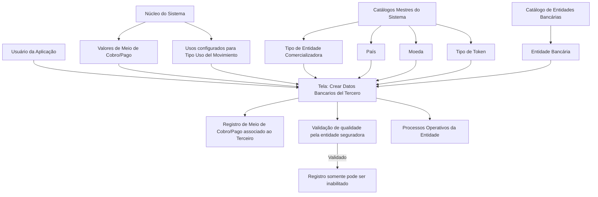

# Documentação Reef — Criação de Dados Bancários do Terceiro

## 1. Metadados do Documento
- **Arquivo de Origem:** Não identificado; conteúdo extraído de documentação Reef.
- **Tipo de Documento:** Especificação Funcional.
- **Domínio / Sistema:** Reef / Mapfre — meios de cobrança e pagamento associados a terceiros.
- **Público-Alvo:** Desenvolvedores, analistas funcionais, operação e negócio.
- **Data/Versão Identificada:** Não identificada. Lifecycle: `Approved`; Owner: `user:agonzalez_mapfre.com`.

---

## 2. Resumo Executivo & Contexto de Negócio

O documento descreve a tela **“Crear Datos Bancarios del Tercero”**, destinada a identificar e registrar no sistema informações de meios de cobrança e pagamento associados a um terceiro. Os meios abrangem, entre outros, contas e cartões.

A funcionalidade organiza a captura de atributos em uma sequência lógica, da esquerda para a direita e de cima para baixo. Parte dos campos é preenchida a partir de catálogos mestres ou valores fornecidos pelo núcleo do sistema, incluindo meios de cobrança/pagamento, países, moedas, entidades bancárias e tipos de token.

A especificação diferencia valores operacionais e valores protegidos do meio de cobrança/pagamento: valor real, valor mascarado e valor criptografado. Também registra titularidade, tokenização, movimento permitido, moeda, vencimento e sequência automática atribuída pelo sistema.

A qualidade e a governança dos dados são tratadas por meio da validação do meio de cobrança/pagamento. Após a comprovação e validação pela entidade seguradora, o sistema permite somente a inabilitação do registro, não a alteração dos seus dados.

Para terceiros com múltiplos meios associados, o documento estabelece regras de unicidade para o meio padrão e para o meio prioritário: apenas um meio padrão por terceiro e apenas um meio prioritário por tipo de meio de cobrança/pagamento.

---

## 3. Arquitetura, Componentes & Tecnologias Envolvidas

Componentes e conceitos explicitamente citados:

- **Reef:** repositório ou contexto de documentação indicado no conteúdo.
- **Sistema / núcleo do Sistema:** fornece valores configurados para determinados campos.
- **Catálogo Maestro del Sistema:** origem de valores para tipos de entidade comercializadora, tipos de token, países e moedas.
- **Catálogo de Entidades Bancarias:** origem de valores para entidade bancária.
- **Entidade seguradora:** responsável pela configuração de subclasses de meios e pela validação da qualidade do meio de cobrança/pagamento.
- **Operativa de Tesorería:** contexto que determina usos configurados para o meio de cobrança/pagamento.
- **Processos Operativos de la Entidad:** utilizam o meio definido como padrão ou prioritário.



**Nota de Análise:** o documento não detalha tecnologias de implementação, APIs, métodos HTTP, contratos JSON, bancos de dados, URLs, servidores, integrações técnicas ou mecanismos criptográficos específicos.

---

## 4. Regras de Negócio, Especificações Funcionais & Processos

### Funcionalidade principal

1. A tela permite que usuários da aplicação identifiquem e registrem informações de meios de cobrança e pagamento associados a um terceiro.
2. Os meios de cobrança/pagamento incluem contas, cartões e outros tipos não detalhados no documento.
3. A sequência de captura lógica dos atributos segue a disposição visual da tela: da esquerda para a direita e de cima para baixo.
4. A ação explicitamente indicada é **CREAR**, relacionada à criação de dados bancários.

### Regras de origem e preenchimento

1. O campo **Medio Cobro/Pago** contém um dos valores possíveis fornecidos pelo núcleo do sistema.
2. O campo **Clase del Medio de Cobro/Pago** representa a subdivisão dos meios de cobrança/pagamento do terceiro, conforme valores configurados pela entidade seguradora.
3. O campo **Tipo de Entidad Comercializadora** usa um código existente no catálogo mestre do sistema.
4. O campo **Entidad Bancaria** usa um código existente no catálogo de entidades bancárias do sistema.
5. O campo **Clave del País** representa o primeiro nível da estrutura geográfica — países — e utiliza valores do catálogo mestre de países.
6. O campo **Tipo de Token** utiliza um código existente no catálogo mestre.
7. O campo **Tipo Uso del Movimiento** utiliza um dos usos configurados e fornecidos pelo núcleo do sistema para a gestão e controle da operativa de tesouraria.
8. O campo **Moneda** utiliza um código existente no catálogo mestre de moedas.
9. A **Secuencia/Orden** é atribuída automaticamente pelo sistema.

### Regras de dados do meio de cobrança/pagamento

1. **Titular** identifica a pessoa titular do meio de cobrança/pagamento.
2. **Valor Enmascarado** apresenta o valor do meio conforme o tipo de mascaramento aplicável.
3. **Token Medio Cobro Cobro/Pago** contém o código do token associado ao tipo de token selecionado.
4. **Valor del Medio Cobro/Pago** armazena o valor real do meio:
   - Para cartão, corresponde ao número do cartão.
   - Para conta corrente, corresponde ao número da conta.
5. **Valor Encriptado del Medio Cobro/Pago** identifica o valor criptografado do meio de cobrança/pagamento.
6. **Tipo de Movimiento** determina se o meio pode ser usado para cobranças, pagamentos ou ambos conforme os valores permitidos pelo sistema.
7. **Mes Vencimiento** e **Año Vencimiento** registram, respectivamente, mês e ano de vencimento do meio associado ao terceiro.

### Regras de validação, bloqueio de alteração e inabilitação

1. **Medio Cobro/Pago Validado** indica se o meio foi validado pela entidade seguradora para fins de qualidade dos dados.
2. Após a comprovação e validação do meio de cobrança/pagamento, o sistema permite apenas sua **inabilitação**.
3. Após a validação, a modificação dos dados do meio de cobrança/pagamento não é permitida.
4. **Inhabilitación** indica que o meio associado ao terceiro deixou de estar vigente.
5. Um meio inabilitado não deve ser considerado por operações da entidade seguradora que utilizem meios de cobrança/pagamento de terceiros.

### Regras de prioridade e seleção padrão

1. **Medio Cobro/Pago por Defecto** identifica o meio exibido por padrão nos processos operativos da entidade quando o terceiro possui mais de um meio associado.
2. Somente um meio de cobrança/pagamento pode estar identificado como padrão entre todos os meios associados ao mesmo terceiro.
3. **Medio Cobro/Pago Prioritario** identifica o meio que deve ser considerado preferencialmente nos processos operativos da entidade quando o terceiro possui mais de um meio associado.
4. Somente um meio pode estar identificado como prioritário para cada tipo de meio de cobrança/pagamento.
5. **Fecha de Validez** determina a data a partir da qual o meio estará plenamente operativo no sistema.
6. O uso correto da data de validade permite manter histórico das mudanças efetuadas nas informações do meio.

---

## 5. Tabelas de Parâmetros, Ambientes e Estruturas de Dados

| Item / Parâmetro | Descrição / Função | Tipo / Valores / Formato | Ambiente / Observações |
| :--- | :--- | :--- | :--- |
| Acción | Ação disponível para criação de dados bancários. | `CREAR` | Não há outros tipos de ação detalhados. |
| Medio Cobro/Pago | Identifica o meio de cobrança/pagamento associado ao terceiro. | Um dos valores fornecidos pelo núcleo do sistema. | Pode incluir contas, cartões e outros meios não especificados. |
| Clase del Medio de Cobro/Pago | Representa a subdivisão do meio de cobrança/pagamento do terceiro. | Valores configurados pela entidade seguradora. | Relação de valores não apresentada. |
| Tipo de Entidad Comercializadora | Código do tipo de entidade comercializadora do meio associado. | Código de catálogo mestre. | Catálogo mestre do sistema. |
| Entidad Bancaria | Código da entidade bancária à qual pertence o meio associado. | Código de catálogo. | Catálogo de Entidades Bancárias do Sistema. |
| Clave del País | Código do primeiro nível da estrutura geográfica que identifica a localização da entidade bancária. | Código de país. | Catálogo mestre de países do sistema. |
| Titular | Identifica a pessoa titular do meio de cobrança/pagamento. | Não detalhado. | — |
| Valor Enmascarado | Exibe o valor do meio conforme a modalidade de mascaramento aplicável. | Valor mascarado. | Tipo de mascaramento não detalhado. |
| Tipo de Token | Código do tipo de token associado ao meio. | Código de catálogo mestre. | Catálogo Maestro. |
| Token Medio Cobro Cobro/Pago | Código do token associado ao meio de cobrança/pagamento. | Código de token associado ao tipo de token. | — |
| Valor del Medio Cobro/Pago | Identifica o valor real do meio de cobrança/pagamento. | Número de cartão, número de conta corrente ou equivalente. | Exemplos fornecidos pelo documento. |
| Valor Encriptado del Medio Cobro/Pago | Identifica o valor criptografado do meio. | Valor criptografado. | Algoritmo, chave e mecanismo não detalhados. |
| Tipo de Movimiento | Define se o meio pode realizar cobranças ou pagamentos. | Cobros ou Pagos. | Valores exatos não detalhados. |
| Tipo Uso del Movimiento | Define o uso configurado no qual o meio poderá ser empregado sem restrição. | Um dos usos configurados pelo núcleo do sistema. | Gestão e controle da operativa de tesouraria. |
| Moneda | Código de moeda do meio de cobrança/pagamento. | Código de moeda. | Catálogo mestre de moedas do sistema. |
| Secuencia/Orden | Número sequencial do meio associado ao terceiro. | Valor atribuído automaticamente. | Gerado pelo sistema. |
| Mes Vencimiento | Mês de vencimento do meio associado. | Mês. | — |
| Año Vencimiento | Ano de vencimento do meio associado. | Ano. | — |
| Medio Cobro/Pago Validado | Indica se o meio foi validado para qualidade dos dados. | Indicador de validado ou não validado. | Após validação, somente é permitida a inabilitação. |
| Medio Cobro/Pago por Defecto | Indica o meio apresentado por padrão nos processos operativos. | Indicador. | Apenas um por terceiro entre todos os meios associados. |
| Inhabilitación | Indica que o meio deixou de estar vigente. | Indicador. | Meio inabilitado não deve ser considerado nas operativas da entidade seguradora. |
| Medio Cobro/Pago Prioritario | Indica o meio preferencial nos processos operativos. | Indicador. | Apenas um por tipo de meio de cobrança/pagamento. |
| Fecha de Validez | Data a partir da qual o meio está plenamente operativo. | Data. | Permite histórico de alterações. |

---

## 6. Bateria de Perguntas & Respostas para RAG (FAQ Sintético)

### P1: Qual é o objetivo da tela “Crear Datos Bancarios del Tercero”?
**R:** A tela permite que usuários da aplicação identifiquem e registrem no sistema as informações dos meios de cobrança e pagamento associados a um terceiro, incluindo contas, cartões e outros meios não detalhados.

### P2: De onde vêm os valores do campo Medio Cobro/Pago?
**R:** O campo Medio Cobro/Pago contém um dos valores possíveis fornecidos pelo núcleo do sistema.

### P3: Como é preenchida a Clase del Medio de Cobro/Pago?
**R:** A Clase del Medio de Cobro/Pago contém a subdivisão do meio de cobrança/pagamento do terceiro conforme a relação de valores configurados pela entidade seguradora.

### P4: Qual catálogo deve ser utilizado para identificar a entidade bancária?
**R:** O campo Entidad Bancaria utiliza o código da entidade bancária conforme os valores existentes no Catálogo de Entidades Bancárias do Sistema.

### P5: O que representa o Valor del Medio Cobro/Pago?
**R:** O Valor del Medio Cobro/Pago identifica o valor real do meio associado ao terceiro. Para cartão, o documento exemplifica o número do cartão; para conta corrente, o número da conta.

### P6: Qual é a diferença entre Valor Enmascarado e Valor Encriptado del Medio Cobro/Pago?
**R:** Valor Enmascarado visualiza o valor do meio conforme o tipo de mascaramento contemplado. Valor Encriptado del Medio Cobro/Pago identifica o valor criptografado do meio. O documento não detalha as técnicas de mascaramento ou criptografia.

### P7: Quem atribui a Secuencia/Orden do meio de cobrança/pagamento?
**R:** A Secuencia/Orden é um número sequencial do meio associado ao terceiro e é atribuída automaticamente pelo sistema.

### P8: O que ocorre depois que um meio de cobrança/pagamento é validado?
**R:** Após a comprovação e validação do meio pela entidade seguradora para fins de qualidade dos dados, o sistema permite apenas sua inabilitação. A modificação dos dados deixa de ser permitida.

### P9: Quantos meios de cobrança/pagamento podem ser definidos como padrão para um terceiro?
**R:** Somente um meio de cobrança/pagamento pode ser identificado e marcado como padrão entre todos os meios associados ao mesmo terceiro.

### P10: Quantos meios prioritários podem existir para cada tipo de meio de cobrança/pagamento?
**R:** Somente um meio pode ser identificado e marcado como prioritário por cada tipo de meio de cobrança/pagamento.

### P11: Qual é o efeito da inabilitação de um meio associado a um terceiro?
**R:** A inabilitação indica que o meio deixou de estar vigente e, portanto, não deve ser considerado nas operativas da entidade seguradora que utilizem meios de cobrança/pagamento de terceiros.

### P12: Para que serve a Fecha de Validez?
**R:** A Fecha de Validez informa a data a partir da qual o meio de cobrança/pagamento estará plenamente operativo no sistema. Seu uso correto permite manter histórico das mudanças feitas nas informações do meio.

---

## 7. Glossário de Termos, Siglas & Conceitos-Chave

- **Reef:** contexto de documentação identificado como “DOCUMENTACIÓN Reef”.
- **Tercero:** entidade ou pessoa à qual o meio de cobrança/pagamento está associado.
- **Medio Cobro/Pago:** meio utilizado para cobranças ou pagamentos, como conta, cartão ou outro meio não detalhado.
- **Entidad Bancaria:** entidade bancária à qual pertence o meio de cobrança/pagamento.
- **Entidad Comercializadora:** tipo de entidade comercializadora associado ao meio de cobrança/pagamento.
- **Núcleo del Sistema:** componente citado como fornecedor de valores de meios de cobrança/pagamento e usos configurados.
- **Catálogo Maestro:** catálogo mestre do sistema, fonte de valores para determinados campos.
- **Token:** código associado ao meio de cobrança/pagamento, classificado por tipo de token.
- **Operativa de Tesorería:** gestão e controle operacional de tesouraria da entidade.
- **Valor Enmascarado:** apresentação protegida do valor do meio conforme o mascaramento aplicável.
- **Valor Encriptado:** valor criptografado do meio de cobrança/pagamento.
- **Inhabilitación:** condição que indica que o meio deixou de estar vigente.
- **Medio por Defecto:** meio apresentado como padrão nos processos operativos.
- **Medio Prioritario:** meio considerado preferencialmente nos processos operativos.
- **Fecha de Validez:** data a partir da qual o meio está plenamente operativo.

---

## 8. Notas Críticas, Riscos & Limitações

- O documento não identifica versão, data de publicação, nome do arquivo de origem ou autor além do campo `Owner`.
- O documento não descreve APIs, contratos de integração, métodos HTTP, URLs, tecnologias, bancos de dados, mecanismos de autenticação ou permissões.
- As listas concretas de valores dos catálogos mestres, catálogo de entidades bancárias, tipos de token, moedas, países e usos de movimento não foram fornecidas.
- O documento não especifica formatos, obrigatoriedade, tamanhos, validações sintáticas ou regras de consistência entre campos.
- O mecanismo de criptografia e os critérios de mascaramento do valor do meio não são detalhados.
- A regra pós-validação é restritiva: uma vez validado, o meio não pode ser modificado; apenas inabilitado. Processos de correção ou substituição de dados validados não são descritos.
- A regra de prioridade é definida por tipo de meio, enquanto a regra de meio padrão é definida entre todos os meios do terceiro; a coexistência operacional desses dois indicadores não é detalhada.

---

## 9. Conteúdo Bruto Estruturado (Referência Fiel)

```text
--- [PÁGINA 1 DE 3] ---

CREAR Datos Bancarios del Tercero
Objetivo
Esta pantalla proporciona la funcionalidad para que los Usuarios de la Aplicación puedan Identicar y registrar en el Sistema la información
de los Medios de Cobro y Pago (Cuentas, Tarjetas, ...) asociados al Tercero.
Posibles Acciones
 CREAR ( )
Datos Bancarios
De izquierda a derecha y de arriba hacia abajo, los siguientes atributos marcan la secuencia de captura lógica de la información.
Medio Cobro/Pago (  )
Este dato contendrá uno de los posibles valores de los Medios de Cobro/Pago proporcionados por el núcleo del Sistema.
Clase del Medio de Cobro/Pago (  )
Este Campo contiene el valor de la Subdivisión de los Medios de Cobro/Pago del Tercero, de acuerdo con la relación de posibles valores
congurados por la entidad aseguradora.
Tipo de Entidad Comercializadora (  )
Este Campo contiene el código del Tipo de Entidad Comercializadora del Medio de Cobro/Pago asociado al Medio de Cobro/Pago del
Tercero, de acuerdo con la relación de posibles valores existentes en el catálogo maestro del Sistema.
Documentation / DOCUMENTACIÓN Reef
DOCUMENTACIÓN Reef
Mapfredocument
DOCUMENTACIÓN Reef
Owner
user:agonzalez_mapfre.com
Lifecycle
Approved Source
 / 
 VL
Buscar Inicio Soluciones Arquitecturas APIs Componentes Cloud Documentación Zeus Reef Ayuda
ES


--- [PÁGINA 2 DE 3] ---

Entidad Bancaria (  )
Este Campo contiene el código de la Entidad Bancaria a la que pertenece el Medio de Cobro/Pago del Tercero, de acuerdo con la relación de
posibles valores existentes en el catálogo de Entidades Bancarias del Sistema.
Clave del País (  )
Este Campo contiene el código del primer nivel de la estructura Geográca (países) en el que se estará identicando la ubicación de la
Entidad Bancaria del Medio de Cobro y Pago asociado al Tercero, de acuerdo con la relación de posibles valores existentes en el catálogo
maestro de Países existente en el Sistema.
Titular ( )
Este Atributo identica la persona Titular del Medio de Cobro/Pago.
Valor Enmascarado
Este Atributo visualiza el Valor del Medio de Cobro/Pago de acuerdo con el tipo de enmascaramiento contemplado para el Medio de
Cobro/Pago.
Tipo de Token (  )
Este Campo contiene el código del tipo de token del Medio de Cobro y Pago asociado al Tercero, de acuerdo con la relación de posibles
valores existentes en el Catálogo Maestro.
Token Medio Cobro Cobro/Pago ( )
Este Campo contiene el código del Token del Medio de Cobro y Pago asociado al Tercero de acuerdo con su tipo de Token asociado.
Valor del Medio Cobro/Pago ( )
Este Atributo identica el Valor 'Real' del Medio de Cobro/Pago, es decir, si el Medio de Cobro/Pago es una Tarjeta el número de la tarjeta, si
es una Cuenta Corriente el número de la cuenta, etcétera.
Valor Encriptado del Medio Cobro/Pago
Este Atributo identica el Valor encriptado del Medio de Cobro/Pago.
Tipo de Movimiento (  )
Este Atributo identica si el Medio de Cobro/Pago se puede utilizar para realizar Cobros o Pagos.
Tipo Uso del Movimiento (  )
De acuerdo con la Gestión y Control en la Operativa de Tesorería de la Entidad, este dato contendrá el valor de uno de los usos congurados y
proporcionados por el núcleo del Sistema en el que el Medio de Cobro/Pago podrá ser empleado sin restricción.
Moneda (  )
Este Campo contendrá el código de la Moneda del Medio de Cobro/Pago de acuerdo con la relación de posibles valores existentes en el
catálogo maestro de Monedas existente en el Sistema.
Secuencia/Orden
Este dato contiene el Número de Secuencia del Medio de Cobro/Pago asociado al Tercero. Es un valor que se asigna automáticamente por
parte del Sistema.
Mes Vencimiento ( )
Este Atributo contiene el Mes de Vencimiento del Medio de Cobro/Pago del Tercero.
Año Vencimiento ( )
Este Atributo contiene el Año de Vencimiento del Medio de Cobro/Pago del Tercero.


--- [PÁGINA 3 DE 3] ---

Medio Cobro/Pago Validado ( )
Este Dato indica si el Medio de Cobro/Pago ha sido o no validado, a efectos de calidad del dato, por la entidad aseguradora. Una vez se haya
efectuado la comprobación y validación del Medio de Cobro/Pago, el sistema solamente permitirá su inhabilitación no así la modicación de
sus datos.
Medio Cobro/Pago por Defecto ( )
Este Campo, en aquellos Terceros que tienen más de un medio de Cobro/Pago asociado, indicará cual de ellos es el que aparecerá por
defecto en los Procesos Operativos de la Entidad.
Solamente puede haber uno identicado y marcado como tal entre todos los Medios de Cobro/Pago del Tercero.
Inhabilitación ( )
Esta propiedad establece si el Medio de Cobro/Pago asociado al Tercero ha dejado de estar en vigor y por tanto no debiera ser considerado
en ninguno de las operativas de la entidad aseguradora que utilicen los medios de Cobro/Pago de los Terceros.
Medio Cobro/Pago Prioritario ( )
Este Campo, en aquellos Terceros que tienen más de un medio de Cobro/Pago asociado, indicará cual de ellos es el que se ha de considerar
preferentemente en los Procesos Operativos de la Entidad.
Solamente puede haber uno identicado y marcado como tal por cada Tipo de Medio de Cobro/Pago.
Fecha de Validez ( )
Esta propiedad le indica al sistema la fecha a partir de la cual el Medio de Cobro/Pago estará plenamente operativo en el sistema por lo que
su correcto uso permite tener un histórico de los cambios efectuados en su información.
```
