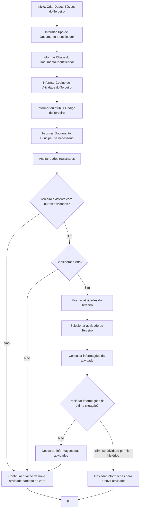

# Criação de Dados Básicos do Terceiro no Reef.core

## 1. Metadados do Documento
- **Arquivo de Origem:** Não identificado no conteúdo fornecido
- **Tipo de Documento:** Especificação Funcional
- **Domínio / Sistema:** Reef.core — gestão e identificação de Terceiros
- **Público-Alvo:** Analistas funcionais, desenvolvedores, operação e negócio
- **Data/Versão Identificada:** Não identificada

---

## 2. Resumo Executivo & Contexto de Negócio

O documento descreve a ação de criação dos **Dados Básicos do Terceiro** no sistema Reef.core. O objetivo central do processo é assegurar a identificação inequívoca de uma pessoa física ou jurídica por meio de um tipo de documento identificador e de uma chave de documento.

A criação do Terceiro depende de informações configuradas previamente em catálogos mestres, especialmente a relação de tipos de documentos aceitos. O processo também inclui o código de atividade do Terceiro e, conforme a configuração da atividade, um código interno que pode ser atribuído automaticamente pelo sistema ou manualmente.

A especificação permite relacionar múltiplos documentos a um documento identificador principal. Esse mecanismo possibilita tratar documentos distintos, como NIF, passaporte e DNI, como pertencentes a um único Terceiro, evitando a criação de registros independentes para a mesma pessoa.

Após a aceitação dos dados, o sistema avalia se o Terceiro já existe com outras atividades. Caso exista, o usuário pode consultar uma atividade já registrada, transferir dados da última situação para a nova atividade — quando o registro em histórico for permitido — ou descartar os dados das atividades existentes e iniciar a criação da nova atividade do zero.

---

## 3. Arquitetura, Componentes & Tecnologias Envolvidas

O conteúdo identifica os seguintes elementos funcionais do domínio Reef.core:

- **Reef.core:** Sistema no qual ocorre a identificação e criação do Terceiro.
- **Terceiro:** Pessoa física ou jurídica registrada e identificada no sistema.
- **Dados Básicos:** Painel ou conjunto de atributos usados para registrar a identificação do Terceiro.
- **Catálogo mestre:** Fonte previamente configurada com os tipos de documento permitidos.
- **Atividade do Terceiro:** Contexto de negócio associado ao Terceiro; pode determinar a obrigatoriedade e a forma de atribuição do código interno.
- **Histórico:** Repositório ou capacidade funcional que pode permitir o traslado de dados da última situação de uma atividade para uma nova atividade.
- **Documento identificador principal:** Documento usado para relacionar outros documentos pertencentes ao mesmo Terceiro.

O conteúdo não detalha tecnologias de implementação, métodos HTTP, integrações, contratos JSON, bancos de dados, URLs de ambiente ou componentes técnicos de infraestrutura.



---

## 4. Regras de Negócio, Especificações Funcionais & Processos

### 4.1 Objetivo da criação de Dados Básicos

A ação de criação dos Dados Básicos do Terceiro tem como finalidade realizar a **identificação inequívoca do Terceiro no sistema**.

A especificação apresentada refere-se à ação:

- **CRIAR** — Dados Básicos.

### 4.2 Sequência de captura de informações

Os atributos devem ser capturados na sequência indicada pela interface, da esquerda para a direita e de cima para baixo.

### 4.3 Tipo de Documento Identificador

O atributo **Tipo Documento Identificador** contém o tipo de documento que será usado para identificar uma pessoa física ou jurídica.

A escolha do tipo de documento depende da relação de tipos de documentos previamente configurada no catálogo mestre do Reef.core.

### 4.4 Chave do Documento Identificador

O atributo **Clave del Documento Identificador** contém a chave documental do Terceiro.

Exemplos fornecidos pelo documento:

- O Banco de Santander, como pessoa jurídica no Reino de Espanha, é identificado pelo tipo de documento **NIF**, com chave **A-39000013**.
- Juan Pérez Pérez, como pessoa física, é identificado pelo tipo de documento **DNI**, com chave **50818772**.
- A Agencia Estatal de Administración Tributaria é registrada com **NIF Q2826000H**.

### 4.5 Código de Atividade do Terceiro

A propriedade **Código de Actividad del Tercero** indica o código da atividade associada ao Terceiro.

O documento não detalha os valores possíveis, o formato do código de atividade ou o catálogo de atividades disponível.

### 4.6 Código do Terceiro

O **Código del Tercero** é o código interno do sistema atribuído ao Terceiro.

As regras de atribuição apresentadas são:

1. O código interno pode ser atribuído automaticamente pelo sistema.
2. A atribuição automática ocorre quando a atividade do Terceiro exige código interno e a configuração determina que esse código seja atribuído pelo sistema.
3. O código interno pode ser atribuído manualmente.
4. A atribuição manual ocorre quando a atividade do Terceiro determina a obrigatoriedade de atribuir um código ao Terceiro.

### 4.7 Documento Identificador Principal

O atributo **Tipo Documento Identificador Principal** pode ser utilizado quando a entidade determinar essa necessidade.

Esse atributo contém o tipo de documento principal ao qual serão relacionados o tipo e a chave do documento identificador do Terceiro. O objetivo é permitir a relação de vários documentos a um documento básico.

O atributo **Clave del Documento Identificador Principal** contém a chave do documento principal usado para relacionar diversos documentos ao mesmo documento principal.

Exemplo apresentado:

- Em Espanha, uma pessoa física pode possuir um Número de Identificação Fiscal, cujo tipo de documento é o **NIF**.
- O NIF pode ser tratado como documento principal.
- O código de passaporte, tipo **PAS**, e o Documento Nacional de Identidade, tipo **DNI**, podem ser relacionados ao NIF.
- Essa relação permite que a instalação reconheça um único Terceiro em vez de três Terceiros distintos.

### 4.8 Processo após aceitação dos dados

Após aceitar os dados registrados, o sistema verifica se o Terceiro já existe no sistema com outras atividades.

Caso o Terceiro já exista com outras atividades, o processo permite:

1. Selecionar uma atividade existente.
2. Consultar as informações da atividade selecionada.
3. Trasladar os dados da última situação para a nova atividade, desde que a atividade permita o registro no histórico.
4. Cancelar ou descartar as informações das atividades existentes.
5. Continuar o processo de criação da nova atividade do Terceiro partindo do zero.

O documento representa decisões relacionadas a:

- Aceitar os dados.
- Verificar se existe Terceiro com outras atividades.
- Considerar alerta.
- Mostrar atividades do Terceiro.
- Selecionar atividade do Terceiro.
- Consultar informações da atividade.
- Trasladar informações da atividade do Terceiro.
- Descartar informações das atividades do Terceiro.
- Finalizar o processo.

---

## 5. Tabelas de Parâmetros, Ambientes e Estruturas de Dados

| Item / Parâmetro | Descrição / Função | Tipo / Valores / Formato | Ambiente / Observações |
| :--- | :--- | :--- | :--- |
| Ação | Inicia o cadastro dos Dados Básicos do Terceiro. | CRIAR | Documento apresenta a ação “CRIAR ( ) Datos Básicos”. |
| Terceiro | Pessoa física ou jurídica identificada no Reef.core. | Pessoa física ou pessoa jurídica | O documento não define uma estrutura técnica de dados para Terceiro. |
| Tipo Documento Identificador | Define o tipo de documento usado para identificar o Terceiro. | Exemplos: NIF, DNI | Deve pertencer à relação de tipos previamente configurada no catálogo mestre do Reef.core. |
| Chave do Documento Identificador | Armazena a chave documental do Terceiro. | Exemplos: A-39000013, 50818772, Q2826000H | Associada ao tipo de documento identificador. |
| Código de Atividade do Terceiro | Indica o código da atividade do Terceiro. | Não detalhado | A atividade influencia a obrigatoriedade e a forma de atribuição do código interno. |
| Código do Terceiro | Código interno atribuído ao Terceiro. | Não detalhado | Pode ser automático ou manual conforme configuração e regra da atividade. |
| Tipo Documento Identificador Principal | Define o tipo de documento principal para relacionar outros documentos do Terceiro. | Exemplos: NIF | Utilizado somente caso a entidade determine essa necessidade. |
| Chave do Documento Identificador Principal | Armazena a chave do documento principal. | Exemplo conceitual: chave do NIF | Permite conectar documentos diversos a um documento principal. |
| Documento PAS | Documento de passaporte citado como exemplo. | PAS | Pode ser relacionado ao NIF como documento principal. |
| Documento DNI | Documento Nacional de Identidade citado como exemplo. | DNI | Pode identificar uma pessoa física e pode ser relacionado a um NIF principal. |
| Documento NIF | Número de Identificação Fiscal citado como exemplo. | NIF | Pode identificar pessoa jurídica ou atuar como documento principal de pessoa física na Espanha. |
| Catálogo mestre | Repositório previamente configurado de tipos de documentos. | Não detalhado | O conteúdo não informa tecnologia, localização ou procedimento de configuração. |
| Histórico | Capacidade de registrar e recuperar a última situação de uma atividade. | Não detalhado | O traslado de informações depende de a atividade permitir registro no histórico. |
| Alerta | Ponto de decisão do fluxo após identificar Terceiro com outras atividades. | Sim / Não | O documento não detalha os critérios para considerar o alerta. |
| Ambiente / URL / Servidor | Informações técnicas de infraestrutura. | Não identificado | Não há URLs, servidores, portas, logs ou ambientes descritos no conteúdo. |

---

## 6. Bateria de Perguntas & Respostas para RAG (FAQ Sintético)

### P1: Qual é o objetivo da criação dos Dados Básicos do Terceiro no Reef.core?
**R:** O objetivo da criação dos Dados Básicos do Terceiro é assegurar a identificação inequívoca de uma pessoa física ou jurídica no sistema Reef.core.

### P2: Onde são definidos os tipos de documentos aceitos para identificar um Terceiro?
**R:** Os tipos de documentos aceitos devem estar previamente configurados na relação de tipos de documentos do catálogo mestre do Reef.core. O atributo Tipo Documento Identificador utiliza essa configuração para identificar pessoas físicas ou jurídicas.

### P3: Quais exemplos de identificação de Terceiro são apresentados no documento?
**R:** O documento informa que o Banco de Santander é identificado em Espanha por NIF com chave A-39000013; Juan Pérez Pérez é identificado por DNI com chave 50818772; e a Agencia Estatal de Administración Tributaria é registrada por NIF com chave Q2826000H.

### P4: Como o Código do Terceiro é atribuído?
**R:** O Código do Terceiro é um código interno do sistema. Ele pode ser atribuído automaticamente quando a atividade exigir código interno e a configuração determinar atribuição pelo sistema, ou pode ser informado manualmente quando a atividade tornar obrigatória a atribuição de um código ao Terceiro.

### P5: Para que serve o Código de Atividade do Terceiro?
**R:** O Código de Atividade do Terceiro indica a atividade associada ao Terceiro. O documento também estabelece que a atividade pode determinar a obrigatoriedade de um código interno e se esse código será atribuído automática ou manualmente.

### P6: Qual é a finalidade do Documento Identificador Principal?
**R:** O Documento Identificador Principal permite relacionar diversos documentos de uma mesma pessoa física ou jurídica a um documento básico principal. Dessa forma, documentos como NIF, PAS e DNI podem ser tratados como pertencentes a um único Terceiro.

### P7: Como o NIF pode ser usado para evitar registros duplicados de Terceiro?
**R:** No exemplo apresentado, o NIF de uma pessoa física em Espanha pode ser considerado o documento principal. O passaporte, identificado por PAS, e o Documento Nacional de Identidade, identificado por DNI, podem ser relacionados ao NIF, permitindo que o sistema reconheça um único Terceiro em vez de três Terceiros distintos.

### P8: O que acontece quando o Terceiro já existe no sistema com outras atividades?
**R:** Após aceitar os dados, o sistema verifica se o Terceiro já possui outras atividades. Caso exista, é possível selecionar uma atividade, consultar suas informações e, quando a atividade permitir registro em histórico, trasladar os dados da última situação para a nova atividade. Também é possível descartar as informações e criar a nova atividade partindo do zero.

### P9: Em que condição as informações da última situação de uma atividade podem ser trasladadas?
**R:** As informações da última situação podem ser trasladadas para a nova atividade somente quando a atividade permitir seu registro no histórico.

### P10: O documento define quais critérios devem ser usados para considerar um alerta no processo?
**R:** Não. O fluxo inclui a decisão “¿CONSIDERAR Alerta?”, mas o documento não especifica as condições, regras ou parâmetros que determinam quando um alerta deve ser considerado.

### P11: O documento informa métodos HTTP, APIs ou contratos de integração do Reef.core?
**R:** Não. O documento descreve atributos e regras funcionais para criação de Dados Básicos do Terceiro, mas não detalha métodos HTTP, APIs, contratos JSON, integrações técnicas ou serviços expostos.

### P12: Existem informações sobre ambientes, URLs, servidores ou caminhos de logs?
**R:** Não. O conteúdo fornecido não apresenta URLs, nomes de servidores, ambientes técnicos, portas, rotas de log ou procedimentos de operação de infraestrutura.

---

## 7. Glossário de Termos, Siglas & Conceitos-Chave

- **Reef.core:** Sistema citado como responsável pelo cadastro e identificação de Terceiros.
- **Terceiro:** Pessoa física ou jurídica identificada e registrada no sistema.
- **Dados Básicos:** Conjunto de atributos utilizados para registrar a identificação do Terceiro.
- **NIF:** Tipo de documento citado como Número de Identificação Fiscal.
- **DNI:** Tipo de documento citado como Documento Nacional de Identidade.
- **PAS:** Tipo de documento citado como passaporte.
- **Catálogo mestre:** Catálogo previamente configurado com a relação de tipos de documentos aceitos.
- **Código de Atividade do Terceiro:** Código que identifica a atividade associada ao Terceiro.
- **Código do Terceiro:** Código interno do sistema atribuído ao Terceiro de forma automática ou manual.
- **Documento Identificador Principal:** Tipo e chave de documento usados como referência para relacionar diversos documentos de um mesmo Terceiro.
- **Histórico:** Registro que pode conter a última situação de uma atividade e permitir o traslado de informações para uma nova atividade.
- **Trasladar informações:** Transferir dados da última situação de uma atividade para uma nova atividade do Terceiro.
- **Alerta:** Decisão presente no fluxo, sem critérios detalhados no conteúdo fornecido.

---

## 8. Notas Críticas, Riscos & Limitações

- **Nota de Análise:** O documento não identifica o nome do arquivo de origem, data, versão, autor técnico ou histórico de revisões.
- **Nota de Análise:** O documento menciona o Reef.core, mas não detalha arquitetura de software, microsserviços, bancos de dados, APIs, métodos HTTP, contratos JSON ou mecanismos de integração.
- **Nota de Análise:** Não há definição dos critérios para a decisão “¿CONSIDERAR Alerta?” no fluxo de criação do Terceiro.
- **Nota de Análise:** O documento não apresenta o catálogo de atividades, os valores possíveis para Código de Atividade do Terceiro ou as regras específicas que definem a atribuição automática ou manual do Código do Terceiro.
- **Nota de Análise:** A transferência de dados da última situação depende de a atividade permitir registro em histórico, mas não são detalhadas as atividades elegíveis, os atributos trasladados ou os controles de auditoria.
- **Risco de qualidade cadastral:** Caso o Tipo Documento Identificador, a Chave do Documento Identificador ou o Documento Identificador Principal sejam utilizados de forma inconsistente, o objetivo de identificação inequívoca do Terceiro pode ser comprometido.
- **Risco de duplicidade:** A não utilização adequada do documento principal pode resultar no tratamento de documentos NIF, PAS e DNI como Terceiros diferentes, apesar de pertencerem à mesma pessoa.
- **Limitação de rastreabilidade:** O conteúdo bruto apresenta caracteres de codificação incorreta em alguns termos, como “Identicación”, “congurados” e “especíco”. Esta estruturação preserva o sentido aparente sem inventar conteúdo ausente.

---

## 9. Conteúdo Bruto Estruturado (Referência Fiel)

```text
--- [PÁGINA 1 DE 2] ---

CREAR Datos Básicos del Tercero
Objetivo
El propósito de la acción de creación de los Datos Básicos del Tercero es la Identicación inequívoca del Tercero en el sistema.
Posibles Acciones
 CREAR ( )
Datos Básicos
De izquierda a derecha y de arriba hacia abajo, los siguientes atributos marcan la secuencia de captura de la Información.
Tipo Documento Identicador (  )
Este Atributo del colapsador contiene el tipo de documento con el que se va a identicar a la persona física o jurídica de acuerdo con la
relación de tipos de documentos que hayan sido congurados en el catálogo maestro de Reef.core previamente.
Clave del Documento Identicador (  )
Este Atributo de la pantalla contendrá la clave del Tercero.
A modo de ejemplos:
El Banco de Santander como persona jurídica se identica en el Reino de España con el Tipo de Documento NIF con clave de documento
A-39000013
Juan Pérez Pérez como persona física se identicará en el sistema con el Tipo de Documento DNI cuya clave es 50818772
La Agencia Estatal de Administración Tributaria se registra como NIF Q2826000H.
Código de Actividad del Tercero (  )
Esta propiedad indicará el código de la Actividad del Tercero.
Documentation / DOCUMENTACIÓN Reef
DOCUMENTACIÓN Reef
Mapfredocument
DOCUMENTACIÓN Reef
Owner
user:agonzalez_mapfre.com
Lifecycle
Approved Source
 / 
 VL
Buscar Inicio Soluciones Arquitecturas APIs Componentes Cloud Documentación Zeus Reef Ayuda
ES


--- [PÁGINA 2 DE 2] ---

Código del Tercero ( )
Este dato será el código interno del sistema que se asignará al Tercero automáticamente en el supuesto que se haya congurado que la
actividad del tercero obligue a tener un código interno y este sea asignado por el Sistema, o manualmente caso que la actividad del Tercero
determine la obligatoriedad de asignar un código al Tercero.
Tipo Documento Identicador Principal (  )
Caso que la entidad determine la necesidad, este atributo del panel de datos básicos contiene el tipo de documento principal con el que se va
a relacionar el tipo y la clave del documento del Tercero pudiendo de esta manera relacionar varios documentos con uno básico.
Clave del Documento Identicador Principal ( )
De igual forma este campo del panel de datos básicos contiene la clave del documento principal con el que se va a relacionar el tipo y la clave
del documento del Tercero pudiendo de esta manera conectar diversos documentos con un documento principal.
A modo de ejemplo:
Puesto que en España todas las personas físicas tienen asignada un Número de Identicación Fiscal cuyo tipo de documento es el NIF, es
factible considerarlo como Tipo de Documento Principal y relacionar así tanto el código del pasaporte (PAS) como el Documento Nacional de
Identidad (DNI) del Tercero con el NIF.
De esta manera podríamos determinar e informar que la instalación maneja un único Tercero frente a tres Terceros distintos.
Proceso
Una vez se acepten los datos que hayan sido registrados y en el caso especíco en el que el Tercero ya exista en el Sistema con Otras
Actividades podremos, o bien Seleccionar una de ellas para Consultar su información y/o Trasladar los datos de su última situación (siempre
y cuando la actividad permita su registro en el histórico) para la nueva actividad del Tercero, o bien Cancelar y continuar el con el Proceso de
Creación del Tercero para la nueva actividad partiendo de cero.
SI
NO
NO
SI
ACEPTAR
INFORMACIÓN
¿TERCERO EXISTENTE con
otras ACTIVIDADES?
¿CONSIDERAR Alerta?
MOSTRAR ACTIVIDADES
del TERCERO
SELECCIONAR ACTIVIDAD
TERCERO
CONSULTAR Inf.
Actividad del TERCERO
TRASLADAR Inf.
Actividad del TERCERO
DESCARTAR Inf.
Actividades del TERCERO
FIN
```
