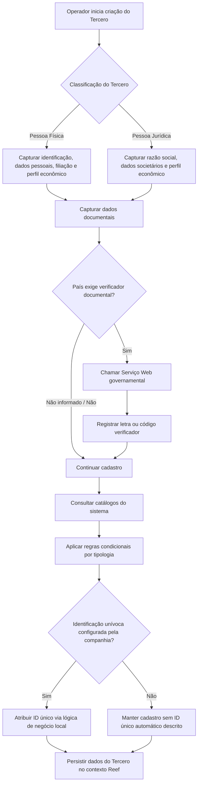

# Documentação Reef — Criação de Dados de Pessoa Física/Jurídica de Terceiro

## 1. Metadados do Documento
- **Arquivo de Origem:** `Não identificado — conteúdo bruto fornecido pelo usuário`
- **Tipo de Documento:** Manual Operacional / Especificação Funcional
- **Domínio / Sistema:** Reef / Reef.core / Grupo MAPFRE
- **Público-Alvo:** Analistas funcionais, desenvolvedores, operação e equipes de cadastro de terceiros
- **Data/Versão Identificada:** Não identificada
- **Lifecycle Identificado:** Approved Source
- **Owner Identificado:** `agonzalez_mapfre.com`

---

## 2. Resumo Executivo & Contexto de Negócio

O documento descreve a função de criação e manutenção dos dados de uma entidade denominada **Tercero** no sistema Reef. Um Tercero pode ser classificado como **Pessoa Física** ou **Pessoa Jurídica**, e o cadastro reúne dados de identificação, documentos, perfil econômico, características societárias, informações de filiação e atributos pessoais.

A finalidade principal do painel de informação é identificar o tipo de Tercero, indicar se a pessoa é politicamente exposta, complementar o documento identificador e classificar o Tercero conforme catálogos corporativos e locais. A documentação também estabelece campos condicionais: diversos atributos devem ser usados somente para Pessoas Físicas, enquanto outros são exclusivos de Pessoas Jurídicas.

O sistema Reef.core mantém um código interno de Tercero. O documento diferencia esse código interno do **ID único do Tercero**, que pode ser atribuído automaticamente por uma lógica de negócio local quando a companhia configurar a necessidade de identificação unívoca entre aplicações. O ID único busca viabilizar rastreabilidade, integração e cruzamento de dados, mas não substitui o código interno de Reef.core.

O cadastro utiliza catálogos do sistema para múltiplos atributos, incluindo países, estados, províncias, localidades, categorias, moedas, profissões, ocupações, idiomas e atividades econômicas. Portanto, a qualidade e a consistência dos dados dependem das relações de valores mantidas nesses catálogos.

O documento também descreve controles de qualidade documental, incluindo marca de comprovação, data de comprovação, observações do método de validação e, em determinados países, a possibilidade de chamada a um serviço governamental para obter letra ou código verificador do documento identificador.

---

## 3. Arquitetura, Componentes & Tecnologias Envolvidas

### Sistemas, módulos e conceitos identificados

| Componente / Conceito | Papel descrito |
| :--- | :--- |
| **Reef** | Sistema no qual ocorre a criação e manutenção dos dados do Tercero. |
| **Reef.core** | Sistema ou núcleo citado como fonte do código interno do Tercero e de catálogos mestres. |
| **Painel de informação** | Interface funcional para captura dos dados de Pessoa Física ou Pessoa Jurídica. |
| **Lógica de negócio local** | Lógica responsável pela atribuição automática do ID único do Tercero, quando configurada pela companhia. |
| **Catálogo de Países** | Fonte de valores para país emissor, país de nascimento ou constituição. |
| **Catálogo de Estados** | Fonte de valores para estado de nascimento ou constituição. |
| **Catálogo de Províncias** | Fonte de valores para província de nascimento ou constituição. |
| **Catálogo de Localidades** | Fonte de valores para localidade de nascimento ou constituição. |
| **Catálogo de Actividades Económicas** | Fonte de valores para tipo de atividade econômica. |
| **Catálogo mestre de Reef.core** | Fonte de valores para regime fiscal, profissões, ocupações e outros dados mestres citados. |
| **Serviço Web governamental** | Serviço aplicável em alguns países para retornar letra ou código verificador de documento. |
| **Grupo MAPFRE - GL** | Contexto de consolidação societária para captura do código societário de Tercero Jurídico. |

### Fluxo funcional extraído



> **Nota de Análise:** O documento não informa tecnologias de implementação, protocolos, contratos de API, métodos HTTP, formatos JSON, bancos de dados, URLs, ambientes ou mecanismos de autenticação do Reef, Reef.core ou do Serviço Web governamental.

---

## 4. Regras de Negócio, Especificações Funcionais & Processos

### 4.1 Objetivos funcionais do painel

O painel de criação de dados de Pessoa Física/Jurídica permite:

1. Identificar o Tercero como Pessoa Física ou Pessoa Jurídica.
2. Identificar se o Tercero é Pessoa Politicamente Exposta.
3. Complementar informações do documento identificador do Tercero.
4. Classificar o Tercero.
5. Capturar características econômicas.
6. Capturar dados de filiação conforme a tipologia de Pessoa Física ou Pessoa Jurídica.

### 4.2 Regra geral de aplicabilidade de campos

- Quando o documento não especificar ou não indicar expressamente a aplicabilidade de um campo, o campo pode ser empregado tanto no registro de Pessoas Físicas quanto no registro de Pessoas Jurídicas.
- Campos cuja descrição começa com “Siempre y cuando el Tercero sea una Persona Física” são condicionais à classificação de Pessoa Física.
- Campos cuja descrição começa com “Siempre y cuando el Tercero sea una Persona Jurídica” são condicionais à classificação de Pessoa Jurídica.
- A marca Pessoa Física ou Pessoa Jurídica deve indicar a tipologia do Tercero em atividades configuradas para associação com pessoas físicas e entidades jurídicas.

### 4.3 Identificação unívoca e código interno

- O **ID único do Tercero** é utilizado apenas quando os parâmetros da companhia definirem a necessidade de identificar univocamente Terceros em todas as aplicações que administram suas informações.
- Nessa situação, o identificador é atribuído automaticamente mediante execução de lógica de negócio local.
- O objetivo do ID único é apoiar rastreabilidade, integração e cruzamento de dados entre sistemas.
- O ID único **não substitui** o atributo que identifica o código interno do Tercero em Reef.core.

### 4.4 Regras de identificação documental e qualidade de dados

- A marca **Pessoa Politicamente Exposta** habilita o comportamento necessário para inserir dados específicos da pessoa no painel correspondente.
- A **Fecha de Emisión** registra a data de emissão do documento do Tercero.
- A **Fecha de Caducidad** registra a data de validade do documento do Tercero.
- O **País Emisor** deve receber o código do país emissor conforme o catálogo de países do sistema.
- Alguns países exigem chamada a um serviço fornecido pelo governo para obter uma letra ou código verificador relacionado ao documento do Tercero.
- O código verificador retornado deve ser considerado e utilizado posteriormente nas operações com o Tercero.
- A **Marca de Comprobación** indica se o documento foi revisado e verificado, contribuindo para a avaliação da qualidade dos dados.
- Quando a marca indicar documento revisado e comprovado, a **Fecha de Comprobación** deve registrar a data da ação.
- Quando o documento for revisado e validado, **Observaciones** permite registrar texto explicativo ou observações sobre o método empregado na comprovação.

### 4.5 Classificação fiscal, econômica e de trabalho

- A **Categoría del Tercero** deve receber código existente no catálogo do sistema.
- O **Régimen Fiscal** deve receber código conforme o catálogo mestre de Reef.core.
- **Por Cuenta Propia** identifica um Tercero como trabalhador por conta própria quando:
  - o Tercero é Pessoa Física;
  - exerce atividade econômica independente e direta;
  - não está sujeito a contrato de trabalho;
  - pode utilizar serviços remunerados de outras pessoas para realizar a atividade, na condição de empregador.
- A **Actividad Económica** representa uma classificação das atividades econômicas dos Terceros Jurídicos configurada pela entidade seguradora.
- O **Tipo de Actividad Económica** deve usar código do catálogo mestre de Atividades Econômicas.
- O **Tipo de Empleo** permite distinguir Pessoa Física assalariada de autônoma.
- A definição apresentada para autônomo compreende Pessoa Física que realiza habitual, pessoal e diretamente, por conta própria e fora do âmbito de direção e organização de outra pessoa, atividade econômica ou profissional lucrativa, com ou sem trabalhadores por conta alheia.

### 4.6 Dados de Pessoa Jurídica

Para Tercero Jurídico, o documento descreve:

- Código societário para consolidação dos processos do Grupo MAPFRE.
- Classificação de atividade econômica.
- Tipo de atividade econômica.
- Folio Registral, número individual que identifica e diferencia a Pessoa Jurídica de documentos similares.
- Data de constituição, referente ao ato jurídico de constituição da sociedade.
- Razão social no campo **Nombre**.
- País, estado, província e localidade de constituição.
- Perfis financeiros de atividade econômica principal e secundárias.
- Código do tipo societário.
- Informação sobre obrigações fiscais em outros países.

### 4.7 Dados de Pessoa Física

Para Tercero Pessoa Física, o documento descreve:

- Nome, segundo nome e sobrenomes.
- Tratamento e posposto.
- Estado civil e dados do cônjuge, quando coerentes com o estado civil.
- Data de nascimento, falecimento e início de residência.
- Nacionalidade e tipo de nacionalidade.
- Local de nascimento.
- Idioma preferencial de comunicação.
- Gênero.
- Percentual de deficiência, conforme tabelas de graus de incapacidade do país.
- Profissão, ocupação, empresa, tipo de empresa e tipo de emprego.
- Estimativa de rendimentos mensais e moeda.
- Nível de estudos e titulação.
- Número de filhos.

### 4.8 Valores exemplificados para tratamento e posposto

Os valores apresentados são exemplos, não uma lista completa.

| Categoria | Código | Descrição |
| :--- | :--- | :--- |
| Tratamento | 001 | Don |
| Tratamento | 002 | Doña |
| Tratamento | 003 | Señor |
| Tratamento | 004 | Señora |
| Tratamento | 005 | Ilmo. |
| Tratamento | 006 | Excmo. |
| Posposto — Pessoa Física | 001 | Junior |
| Posposto — Pessoa Física | 002 | Senior |
| Posposto — Pessoa Jurídica | 003 | U.T.E. |
| Posposto — Pessoa Jurídica | 004 | S.A. |
| Posposto — Pessoa Jurídica | 005 | Ltd. |
| Posposto — Pessoa Jurídica | 006 | G.M.B.H |

---

## 5. Tabelas de Parâmetros, Ambientes e Estruturas de Dados

### 5.1 Identificação, classificação e documento

| Item / Parâmetro | Descrição / Função | Tipo / Valores / Formato | Ambiente / Observações |
| :--- | :--- | :--- | :--- |
| Pessoa Física ou Pessoa Jurídica | Indica a tipologia do Tercero. | Marca de verificação; Pessoa Física ou Pessoa Jurídica. | Aplicável em atividades configuradas para ambas as tipologias. |
| ID único do Tercero | Código identificador único atribuído automaticamente. | Código; formato não informado. | Depende da configuração de parâmetros da companhia e de lógica de negócio local. Não substitui o código interno de Reef.core. |
| Pessoa Politicamente Exposta | Habilita entrada de dados específicos de pessoa politicamente exposta. | Marca de verificação. | Comportamento específico do sistema. |
| Fecha de Emisión | Registra a emissão do documento do Tercero. | Data; formato não informado. | Documento identificador. |
| Fecha de Caducidad | Registra a validade do documento do Tercero. | Data; formato não informado. | Documento identificador. |
| País Emisor | Código do país emissor do documento. | Código de catálogo. | Conforme catálogo de Países do sistema. |
| Verificador del Documento Identificador | Letra ou código retornado por serviço governamental. | Letra ou código; formato não informado. | Aplicável a países que exigem consulta de documento a Serviço Web governamental. |
| Marca de Comprobación | Indica se o documento foi revisado e verificado. | Marca de verificação. | Relacionada à qualidade dos dados do Tercero. |
| Fecha de Comprobación | Registra quando ocorreu a revisão e comprovação documental. | Data; formato não informado. | Preenchida quando a marca indicar documento revisado e comprovado. |
| Observaciones | Registra observações sobre o método de comprovação. | Texto. | Aplicável quando o documento foi revisado e validado. |
| Categoría del Tercero | Categoria atribuída ao Tercero. | Código de catálogo. | Conforme catálogo do sistema. |
| Régimen Fiscal | Regime fiscal do Tercero. | Código de catálogo. | Conforme catálogo mestre de Reef.core. |
| Por Cuenta Propia | Identifica trabalhador por conta própria. | Marca de verificação. | Aplicável a Pessoa Física em atividade independente e direta. |

### 5.2 Dados econômicos e societários

| Item / Parâmetro | Descrição / Função | Tipo / Valores / Formato | Ambiente / Observações |
| :--- | :--- | :--- | :--- |
| Alias del Tercero | Captura apelido ou sobrenome do Tercero. | Texto. | Aplicável a Pessoa Física e Pessoa Jurídica. |
| Sociedad para Consolidación en Grupo MAPFRE - GL | Captura código societário para consolidação do Grupo MAPFRE. | Código societário; formato não informado. | Documento afirma aplicabilidade tanto a pessoas físicas quanto jurídicas. |
| Actividad Económica | Classifica atividades econômicas de Terceros Jurídicos. | Classificação configurada pela entidade seguradora. | Aplicável a Tercero Jurídico. |
| Tipo de Actividad Económica | Código do tipo de atividade econômica. | Código de catálogo. | Conforme catálogo mestre de Atividades Econômicas. |
| Folio Registral | Número individual de identificação da Pessoa Jurídica. | Número; formato não informado. | Aplicável a Tercero Jurídico. |
| Fecha de Constitución | Identifica a data de constituição da sociedade. | Data; formato não informado. | Aplicável a Tercero Jurídico. |
| Perfil Financiero Act. Principal | Perfil financeiro da atividade econômica principal. | Código de catálogo. | Aplicável a Pessoa Jurídica. |
| Perfil Financiero Act. Secundarias | Perfil financeiro das atividades econômicas secundárias. | Código de catálogo. | Aplicável a Pessoa Jurídica. |
| Código Tipo Sociedad | Tipo de código societário do Tercero. | Código de catálogo. | Aplicável a Pessoa Jurídica. |
| Obligaciones Fiscales en otros Países | Permite registrar países nos quais o Tercero possui obrigações fiscais. | Marca de verificação. | Adapta o comportamento do sistema para entrada desses dados. |

### 5.3 Identificação nominal e filiação

| Item / Parâmetro | Descrição / Função | Tipo / Valores / Formato | Ambiente / Observações |
| :--- | :--- | :--- | :--- |
| Tratamiento | Tratamento de respeito que antecede o nome. | Código de catálogo. | Exemplos: Don, Doña, Señor, Señora, Ilmo., Excmo. |
| Pospuesto | Código após o nome que indica condição do Tercero. | Código de catálogo. | Exemplos para Pessoa Física: Junior, Senior. Para Pessoa Jurídica: U.T.E., S.A., Ltd., G.M.B.H. |
| Nombre | Nome de Pessoa Física ou razão social de Pessoa Jurídica. | Texto. | A interpretação depende da tipologia do Tercero. |
| Segundo Nombre | Segundo e demais nomes do Tercero. | Texto. | Aplicável a Pessoa Física. |
| Primer Apellido | Primeiro sobrenome do Tercero. | Texto. | Aplicável a Pessoa Física. |
| Segundo Apellido | Segundo sobrenome do Tercero. | Texto. | Aplicável a Pessoa Física. |
| Apellido de Casado/a | Sobrenome de casado(a). | Texto. | Aplicável a Pessoa Física, em países onde a prática é usual. |
| Estado Civil | Estado civil do Tercero. | Código; valores não informados. | Aplicável a Pessoa Física. |
| Nombre y Apellidos del Cónyuge | Nome e sobrenomes do cônjuge. | Texto. | Aplicável a Pessoa Física quando coerente com o estado civil. |
| Número de Hijos | Número de filhos do Tercero. | Número. | Aplicável a Pessoa Física. |

### 5.4 Dados pessoais, localidade e comunicação

| Item / Parâmetro | Descrição / Função | Tipo / Valores / Formato | Ambiente / Observações |
| :--- | :--- | :--- | :--- |
| Fecha de Nacimiento | Data de nascimento. | Data; formato não informado. | Aplicável a Pessoa Física. |
| Fecha de Fallecimiento | Data de falecimento. | Data; formato não informado. | Aplicável a Pessoa Física. |
| Fecha de Inicio de Residencia | Data de início de residência. | Data; formato não informado. | Aplicável a Pessoa Física. |
| Nacionalidad | Nacionalidade do Tercero. | Código; valores não informados. | Aplicável a Pessoa Física. |
| Tipo de Nacionalidad | Tipo de nacionalidade do Tercero. | Código local. | Codificação efetuada localmente pela entidade seguradora para processos internos. |
| País de Nacimiento/Constitución | País de nascimento ou constituição. | Código de catálogo. | Conforme catálogo de países do sistema. |
| Estado de Nacimiento/Constitución | Estado de nascimento ou constituição. | Código de catálogo. | Conforme catálogo de estados do sistema. |
| Provincia de Nacimiento/Constitución | Província de nascimento ou constituição. | Código de catálogo. | Conforme catálogo de províncias do sistema. |
| Localidad de Nacimiento/Constitución | Localidade de nascimento ou constituição. | Código de catálogo. | Conforme catálogo de localidades do sistema. |
| Idioma | Preferência de idioma nas comunicações da entidade seguradora. | Código de catálogo. | Conforme catálogo mestre de Idiomas. |
| Género | Gênero do Tercero. | Valor não informado. | Aplicável a Pessoa Física. |
| Porcentaje Discapacidad | Percentual de deficiência. | Percentual; escala não informada. | Aplicável a Pessoa Física e conforme tabelas de graus de incapacidade do país. |

### 5.5 Dados profissionais, emprego, rendimento e formação

| Item / Parâmetro | Descrição / Função | Tipo / Valores / Formato | Ambiente / Observações |
| :--- | :--- | :--- | :--- |
| Profesión | Profissão associada ao Tercero. | Código de catálogo. | Aplicável a Pessoa Física; catálogo mestre de Profissões de Reef.core. |
| Ocupación | Ocupação associada ao Tercero. | Código de catálogo. | Aplicável a Pessoa Física; catálogo mestre de Ocupações de Reef.core. |
| Nombre de la Empresa | Nome da empresa em que o Tercero trabalha. | Texto. | Aplicável a Pessoa Física. |
| Tipo de Empresa | Tipo da empresa em que o Tercero trabalha. | Código ou tipologia; valores não informados. | Aplicável a Pessoa Física. |
| Tipo de Empleo | Tipo de emprego do Tercero. | Valor que distingue assalariado e autônomo. | Aplicável a Pessoa Física. |
| Ingresos Mensuales Estimados | Valor dos rendimentos mensais do Tercero. | Valor monetário; formato não informado. | Aplicável a Pessoa Física. |
| Moneda | Moeda dos rendimentos mensais estimados. | Código de catálogo. | Conforme catálogo de moedas do sistema. |
| Nivel de Estudios | Nível de estudos do Tercero. | Código; valores não informados. | Aplicável a Pessoa Física. |
| Titulación | Titulação do Tercero. | Código; valores não informados. | Aplicável a Pessoa Física. |

### 5.6 Ambientes, rotas e infraestrutura

| Item / Parâmetro | Descrição / Função | Tipo / Valores / Formato | Ambiente / Observações |
| :--- | :--- | :--- | :--- |
| URLs de ambiente | Não informadas. | Não informado. | O documento não apresenta URLs. |
| Servidores | Não informados. | Não informado. | O documento não apresenta servidores. |
| Portas | Não informadas. | Não informado. | O documento não apresenta portas. |
| Rotas de log | Não informadas. | Não informado. | O documento não apresenta caminhos ou variáveis de log. |
| APIs e contratos | Não detalhados. | Não informado. | Apenas há menção genérica a Serviço Web governamental. |

---

## 6. Bateria de Perguntas & Respostas para RAG (FAQ Sintético)

### P1: Qual é o objetivo do painel de criação de dados de Pessoa Física/Jurídica no Reef?
**R:** O painel permite identificar o Tercero como Pessoa Física ou Pessoa Jurídica, identificar se o Tercero é uma Pessoa Politicamente Exposta, complementar os dados do documento identificador e classificar o Tercero. O painel também reúne informações econômicas, societárias e de filiação de acordo com a tipologia cadastrada.

### P2: O ID único do Tercero substitui o código interno utilizado pelo Reef.core?
**R:** Não. O documento afirma expressamente que o ID único do Tercero não substitui a funcionalidade suportada pelo atributo que identifica o código interno do Tercero em Reef.core. O ID único é atribuído automaticamente por lógica de negócio local quando a companhia configurar a identificação unívoca entre aplicações.

### P3: Quando o sistema deve atribuir automaticamente o ID único do Tercero?
**R:** O ID único deve ser atribuído automaticamente quando os parâmetros da companhia definirem a necessidade de identificar univocamente os Terceros em todas as aplicações que administram suas informações. A atribuição ocorre por meio da execução de uma lógica de negócio local.

### P4: Para que serve a marca Pessoa Politicamente Exposta?
**R:** A ativação da marca Pessoa Politicamente Exposta modula o comportamento do sistema, permitindo inserir os dados específicos da pessoa no painel de informação correspondente. O documento não detalha quais são esses dados específicos.

### P5: Como funciona a validação de documentos de Terceros em países que exigem verificador?
**R:** Em determinados países, o documento do Tercero exige chamada a um Serviço Web fornecido pelo governo. Esse serviço retorna uma letra ou código verificador que deve ser considerado e utilizado posteriormente nas operações com o Tercero.

### P6: Qual é a função da Marca de Comprobación do documento identificador?
**R:** A Marca de Comprobación informa se o documento do Tercero foi revisado e verificado. Esse dado permite que os processos da entidade considerem a qualidade das informações do Tercero no sistema. Quando o documento foi comprovado, a Fecha de Comprobación registra a data da ação.

### P7: Quais campos de identificação são exclusivos de Pessoa Física?
**R:** O documento identifica como aplicáveis a Pessoa Física, entre outros, segundo nome, primeiro e segundo sobrenome, sobrenome de casado(a), estado civil, dados do cônjuge, datas de nascimento e falecimento, início de residência, nacionalidade, gênero, deficiência, profissão, ocupação, emprego, rendimentos, formação e número de filhos.

### P8: Como o campo Nombre deve ser interpretado para cada tipologia de Tercero?
**R:** Para Pessoa Física, o campo Nombre contém o nome do Tercero. Para Pessoa Jurídica, o mesmo campo contém a razão social do Tercero.

### P9: O que caracteriza um Tercero como Por Cuenta Propia?
**R:** Por Cuenta Propia identifica um Tercero como trabalhador por conta própria quando se trata de Pessoa Física que exerce atividade econômica independente e direta, sem contrato de trabalho. A definição admite que essa pessoa utilize serviços remunerados de outras pessoas para realizar a atividade, atuando como empregador.

### P10: Como o sistema diferencia assalariado e autônomo?
**R:** O campo Tipo de Empleo permite identificar se uma Pessoa Física é assalariada ou autônoma. O documento define autônomo como pessoa que exerce, de forma habitual, pessoal e direta, por conta própria e fora da direção e organização de outra pessoa, uma atividade econômica ou profissional lucrativa, com ou sem empregados.

### P11: Quais dados econômicos devem ser registrados para uma Pessoa Jurídica?
**R:** Para Pessoa Jurídica, o documento descreve atividade econômica, tipo de atividade econômica, código societário para consolidação do Grupo MAPFRE, Folio Registral, data de constituição, perfil financeiro da atividade principal, perfil financeiro das atividades secundárias, código de tipo societário e obrigações fiscais em outros países.

### P12: De onde vêm os valores de país, estado, província e localidade?
**R:** Os valores devem ser selecionados a partir dos catálogos existentes no sistema. País utiliza o catálogo de Países; estado utiliza o catálogo de Estados; província utiliza o catálogo de Províncias; e localidade utiliza o catálogo de Localidades.

### P13: Como são registrados os rendimentos mensais estimados de uma Pessoa Física?
**R:** O campo Ingresos Mensuales Estimados contém o valor dos rendimentos mensais do Tercero Pessoa Física. O campo Moneda deve receber o código da moeda usada para expressar esses rendimentos, conforme o catálogo de moedas do sistema.

---

## 7. Glossário de Termos, Siglas & Conceitos-Chave

- **Reef:** Sistema no qual é realizado o cadastro e a manutenção de dados do Tercero.
- **Reef.core:** Núcleo ou sistema citado como responsável pelo código interno do Tercero e por catálogos mestres.
- **Tercero:** Entidade cadastrada no sistema, classificada como Pessoa Física ou Pessoa Jurídica.
- **Pessoa Física:** Tercero correspondente a uma pessoa individual.
- **Pessoa Jurídica:** Tercero correspondente a uma entidade jurídica, sociedade ou organização.
- **ID único del Tercero:** Identificador atribuído automaticamente por lógica local quando configurado pela companhia para identificação unívoca entre aplicações.
- **Pessoa Politicamente Exposta:** Classificação cujo acionamento permite entrada de dados específicos no painel correspondente.
- **Marca de Comprobación:** Indicador de que o documento do Tercero foi revisado e verificado.
- **Verificador del Documento Identificador:** Letra ou código retornado por serviço governamental em países que requerem validação documental.
- **Régimen Fiscal:** Código do regime fiscal do Tercero conforme catálogo mestre de Reef.core.
- **Por Cuenta Propia:** Condição de trabalhador autônomo ou por conta própria aplicável a Pessoa Física.
- **Folio Registral:** Número individual de identificação de uma Pessoa Jurídica.
- **GL:** Sigla apresentada em “Grupo MAPFRE - GL”; o documento não expande seu significado.
- **U.T.E.:** Valor exemplificado como posposto para Pessoa Jurídica; o documento não expande a sigla.
- **S.A.:** Valor exemplificado como posposto para Pessoa Jurídica; o documento não expande a sigla.
- **Ltd.:** Valor exemplificado como posposto para Pessoa Jurídica; o documento não expande a sigla.
- **G.M.B.H:** Valor exemplificado como posposto para Pessoa Jurídica; o documento não expande a sigla.

---

## 8. Notas Críticas, Riscos & Limitações

- O documento não informa obrigatoriedade, cardinalidade, formatos, tamanhos máximos, máscaras ou validações técnicas dos campos.
- O documento cita catálogos do sistema, mas não apresenta seus valores completos, mecanismos de manutenção ou identificadores técnicos.
- A lógica de negócio local para geração de ID único é mencionada, porém não é detalhada.
- O Serviço Web governamental é citado sem URL, autenticação, protocolo, contrato, método HTTP, tratamento de falhas ou países aplicáveis.
- Não há descrição de APIs, microsserviços, bancos de dados, ambientes, servidores, portas, pipelines de implantação ou rotas de log.
- O documento afirma que os exemplos de tratamento e posposto são apenas exemplos, portanto não devem ser tratados como catálogo completo.
- A documentação não define quais dados específicos são habilitados pela marca Pessoa Politicamente Exposta.
- A documentação não esclarece a coerência permitida entre Estado Civil e Nome y Apellidos del Cónyuge, apenas determina que o preenchimento deve ser coerente com o valor possível do campo.
- A aplicação dos campos não explicitamente condicionais a uma tipologia deve ser entendida conforme a regra geral apresentada: uso indistinto para Pessoa Física e Pessoa Jurídica.
- **Nota de Análise:** O conteúdo fornecido aparenta ter sido extraído de uma interface documental e contém caracteres de codificação corrompidos em palavras como “identicar”, “congurado” e “perl”. O significado foi preservado conforme o contexto textual, sem inclusão de fatos externos.

---

## 9. Conteúdo Bruto Estruturado (Referência Fiel)

```text
--- [PÁGINA 1 DE 7] ---

CREAR Datos Persona Física/Jurídica del Tercero
Objetivo
La función de los campos que aparecen en este panel de información permite:
Identicar al Tercero como Persona Física o Jurídica.
Identicar o no al Tercero como Persona Políticamente Expuesta.
Complementar la información del Documento identicador del Tercero.
Clasicar al Tercero.
Posibles Acciones
 CREAR ( )
Datos Persona Persona Física/Jurídica
De izquierda a derecha y de arriba hacia abajo, los siguientes atributos marcan la secuencia de captura de la información.
Si no se especica o indica expresamente los Campos se emplearán indistintamente tanto en el registro de información de las Personas
Físicas como para las Personas Jurídicas.
Persona Física o Persona Jurídica ( )
Esta marca de vericación, en aquellas actividades en las que se haya congurado la posibilidad de estar asociada tanto para personas
físicas como para entidades jurídicas, indicará la tipología del Tercero.
ID único del Tercero ( )
Siempre y cuando se haya denido en la conguración de los parámetros de la compañía la necesidad de identicar unívocamente a los
Terceros en todas las aplicaciones que gestionen su información, este atributo contendrá el código del Identicador único que se asignará
Documentation / DOCUMENTACIÓN Reef
DOCUMENTACIÓN Reef
Mapfredocument
DOCUMENTACIÓN Reef
Owner
user:agonzalez_mapfre.com
Lifecycle
Approved Source
 / 
 VL
Buscar Inicio Soluciones Arquitecturas APIs Componentes Cloud Documentación Zeus Reef Ayuda
ES


--- [PÁGINA 2 DE 7] ---

automáticamente al Tercero mediante la ejecución de una lógica de negocio local, permitiendo de esta manera la trazabilidad, integración y
cruce de datos entre los sistemas.
Este atributo NO SUSTITUYE en ningún caso la funcionalidad soportada por el atributo que identica el código del tercero que es de uso
interno en Reef.core.
Persona Políticamente Expuesta ( )
La activación de esta marca de vericación modula el comportamiento del sistema permitiendo ingresar los datos especícos de la persona
en el panel de información correspondiente.
Fecha de Emisión ( )
Esta propiedad sirve para indicar la Fecha de Emisión del Documento del Tercero.
Fecha de Caducidad ( )
Esta propiedad indicará en cambio la Fecha de Caducidad del Documento del Tercero.
País Emisor (  )
Este Campo contiene el código del país emisor documento identicador del Tercero de acuerdo con la relación de posibles valores existentes
en el catálogo de Países existente en el Sistema.
Vericador del Documento Identicador ( )
Existen países en los que con el documento del Tercero han de realizar una llamada a un Servicio provisto por el gobierno, Servicio Web que
devolverá una letra o un código vericador, código que tendrá que ser considerado y utilizado posteriormente en las operaciones con el
Tercero.
Marca de Comprobación ( )
Este dato permite considerar en los procesos de la entidad si el documento del Tercero ha sido o no revisado y vericado, todo ello en
relación con la calidad de los datos del Tercero en el sistema.
Fecha de Comprobación ( )
En el supuesto que el estado de la marca de comprobación implicara que el documento del Tercero hubiera sido revisado y comprobado, este
campo contendrá la fecha en la que esta acción se realizó.
Observaciones ( )
En el supuesto que el documento del Tercero hubiera sido revisado y validado este campo permite ingresar un texto aclaratorio u
observaciones sobre el método empleado para su comprobación.
Categoría del Tercero (  )
Este Campo contiene el código de la categoría asignada al Tercero de acuerdo con la relación de posibles valores existentes en el catálogo
del Sistema.
Régimen Fiscal (  )
Este Campo contiene el código del régimen scal del Tercero de acuerdo con la relación de posibles valores existentes en el catálogo
maestro de Reef.core.
Por Cuenta Propia ( )
Este dato permite identicar al Tercero como Trabajador por cuenta propia siempre y cuando el Tercero sea persona física y realice una
actividad económica de forma independiente y directa sin estar sujeto a un contrato de trabajo, aunque éste utilice el servicio remunerado de
otras personas para llevar a cabo su actividad (empleador).
Persona Legal


--- [PÁGINA 3 DE 7] ---

El propósito de los datos que aparecen en este panel de información no es otro que ingresar en el sistema determinadas características de
ámbito económico del Tercero.
Alias del Tercero ( )
Este Campo permite capturar el apodo o sobrenombre del Tercero independientemente si este es persona física o jurídica.
Sociedad para Consolidación en Grupo MAPFRE - GL ( )
Este Dato permite capturar el Código Societario del Tercero Jurídico para su consolidación en los procesos del Grupo MAPFRE tanto para
personas físicas como jurídicas.
Actividad Económica (  )
Este atributo contiene una clasicación de las actividades económicas en los Terceros Jurídicos congurada por la entidad aseguradora.
Tipo de Actividad Económica (  )
Este Campo contiene el código del tipo de la actividad económica del Tercero de acuerdo con los posibles valores congurados en el
catálogo maestro de Actividades Económicas.
Folio Registral ( )
Cada Tercero como persona Jurídica debe tener un número que lo identica y diferencia de los documentos similares (esta numeración
individual recibe el nombre de Folio o Folio Registral).
Fecha de Constitución ( )
Puesto que las personas jurídicas nacen como consecuencia de un acto jurídico (acto de constitución) este dato sirve para identicar la
fecha en la que el Tercero Jurídico se ha constituido como sociedad.
Persona
El propósito de los datos que aparecen en este Bloque de información es Identicar los datos de liación del Asegurado de acuerdo con la
tipología del Tercero: Persona Física o bien Persona Jurídica.
Tratamiento ( )
Este Atributo contiene el Tratamiento de respeto que se antepone al nombre del Tercero y que por cortesía o por respeto está reservado a
determinadas personas de elevado rango social.
A modo de ejemplo se podrían considerar:


--- [PÁGINA 4 DE 7] ---

Código TRATAMIENTO Descripción
001 Don
002 Doña
003 Señor
004 Señora
005 Ilmo.
006 Excmo.
... ...
Pospuesto ( )
Este Dato contiene el código del pospuesto al Nombre Propio del Tercero para indicar alguna condición de este, como por ejemplo para
indicar que se es más joven o mayor que otra Persona emparentada con ella, generalmente su padre, y del mismo nombre.
A modo de ejemplo para las Personas Físicas se podrían usar los siguientes valores
Código POSPUESTO Descripción
001 Junior
002 Senior
... ...
Mientras que en el caso de Personas Jurídicas
Código POSPUESTO. Descripción
003 U.T.E.
004 S.A.
005 Ltd.
006 G.M.B.H
... ...
Nombre ( )
Este Atributo contiene el nombre del Tercero en caso que el Tercero sea una Persona Física o la Razón Social en el supuesto que sea una
Persona Jurídica.
Segundo Nombre ( )
Siempre y cuando el Tercero sea una Persona Física, este dato contendrá el segundo y sucesivos nombres del Tercero.
Primer Apellido ( )


--- [PÁGINA 5 DE 7] ---

Siempre y cuando el Tercero sea una Persona Física, este dato contendrá el primer Apellido del Tercero.
Segundo Apellido ( )
Siempre y cuando el Tercero sea una Persona Física, este dato contendrá el segundo Apellido del Tercero.
Apellido de Casado/a ( )
Siempre y cuando el Tercero sea una Persona Física, este dato contendrá el Apellido de casado/a del Tercero (en aquellos países en los que
esta costumbre relacionada con los nombres de soltero en el matrimonio sea de uso extendido).
Estado Civil (  )
Siempre y cuando el Tercero sea una Persona Física, este dato contendrá el código del estado civil del Tercero.
Nombre y Apellidos del Cónyuge ( )
Siempre y cuando el Tercero sea una Persona Física y su estado civil esté en coherencia con el posible valor de este campo, este dato
contendrá el Nombre y los Apellidos del cónyuge del Tercero.
Fecha de Nacimiento ( )
Siempre y cuando el Tercero sea una Persona Física, este dato indicará la Fecha de nacimiento del Tercero.
Fecha de Fallecimiento ( )
Siempre y cuando el Tercero sea una Persona Física este campo indicará la Fecha de fallecimiento del Tercero.
Fecha de Inicio de Residencia ( )
Siempre y cuando el Tercero sea una Persona Física este dato indicará la Fecha de inicio de Residencia del Tercero.
Nacionalidad (  )
Siempre y cuando el Tercero sea una Persona Física, este dato indicará la nacionalidad del Tercero.
Tipo de Nacionalidad (  )
Siempre y cuando el Tercero sea una Persona Física este campo contendrá el código de tipo de nacionalidad del Tercero de acuerdo con la
codicación efectuada localmente por parte de la entidad aseguradora para su posterior uso en los procesos internos de la entidad.
País de Nacimiento/Constitución (  )
Este Campo contiene el código del país en el que haya nacido la Persona o se haya constituido el Tercero Jurídico, de acuerdo con la relación
de posibles valores del catálogo de países existente en el Sistema.
Estado de Nacimiento/Constitución (  )
Este Campo contiene el código del estado en el que haya nacido la Persona o se haya constituido el Tercero Jurídico, de acuerdo con la
relación de posibles valores del catálogo de estados existente en el Sistema.
Provincia de Nacimiento/Constitución (  )
Este Campo contiene el código de la provincia en la que haya nacido la Persona o se haya constituido el Tercero Jurídico, de acuerdo con la
relación de posibles valores del catálogo de provincias existente en el Sistema.
Localidad de Nacimiento/Constitución (  )
Este Campo contiene el código de la localidad en la que haya nacido la Persona o se haya constituido el Tercero Jurídico, de acuerdo con la
relación de posibles valores del catálogo de localidades existente en el Sistema.
Idioma (  )
Este Campo contiene la preferencia del idioma en las comunicaciones de la entidad aseguradora con el Tercero, de acuerdo con la relación
de posibles valores existentes en el catálogo maestro de Idiomas del Sistema.


--- [PÁGINA 6 DE 7] ---

Género ( )
Siempre y cuando el Tercero sea una Persona Física este campo indicará el género del Tercero.
Porcentaje Discapacidad ( )
Siempre y cuando el Tercero sea una Persona Física este dato debería indicar el porcentaje de Discapacidad del Tercero de acuerdo con las
tablas de baremos y grados de minusvalías del país.
Profesión (  )
Siempre y cuando el Tercero sea una Persona Física este Campo contiene el código de la profesión asociada al Tercero de acuerdo con la
relación de posibles valores existentes en el catálogo maestro de Profesiones de Reef.core.
Ocupación (  )
Siempre y cuando el Tercero sea una Persona Física este Campo contiene el código de la ocupación asociada al Tercero de acuerdo con la
relación de posibles valores existentes en el catálogo maestro de Ocupaciones de Reef.core.
Nombre de la Empresa ( )
Siempre y cuando el Tercero que se esté registrando sea una Persona Física este dato permite indicar el nombre de la Empresa en la que el
Tercero está ocupado.
Tipo de Empresa (  )
Siempre y cuando el Tercero que estemos registrando sea una Persona Física este dato permite indicar el tipo de empresa en la que el
Tercero está ocupado de acuerdo con una de las tipologías denidas.
Tipo de Empleo (  )
Siempre y cuando el Tercero sea Persona Física este dato permite indicar el tipo de empleo del Tercero y distinguir si es un Asalariado o un
Autónomo (Personas físicas que realizan de forma habitual, personal, directa, por cuenta propia y fuera del ámbito de dirección y
organización de otra persona, una actividad económica o profesional a título lucrativo, den o no ocupación a trabajadores por cuenta ajena)
Ingresos Mensuales Estimados ( )
Siempre y cuando el Tercero sea una Persona Física este Campo contendrá el importe de los Ingresos Mensuales del Tercero.
Moneda (  )
Siempre y cuando el Tercero sea una Persona Física este dato ha de contener el código de la Moneda en la que se han expresado los
Ingresos Mensuales Estimados del Tercero de acuerdo con la relación de posibles valores existentes en el catálogo de monedas del Sistema.
Nivel de Estudios (  )
Siempre y cuando el Tercero sea una Persona Física este Campo contendrá el código del nivel de estudios del Tercero.
Titulación (  )
Siempre y cuando el Tercero sea una Persona Física este Campo contendrá el código de la titulación del Tercero.
Perl Financiero Act. Principal (  )
Siempre y cuando el Tercero sea una Persona Jurídica este dato contendrá el código del perl nanciero del Tercero de su actividad
económica principal de acuerdo con la relación de posibles valores existentes en el catálogo maestro del Sistema.
Perl Financiero Act. Secundarias (  )
Siempre y cuando el Tercero sea una Persona Jurídica este dato contendrá el código del perl nanciero del Tercero para sus actividades
económicas secundarias de acuerdo con la relación de posibles valores existentes en el catálogo maestro del Sistema.
Código Tipo Sociedad (  )


--- [PÁGINA 7 DE 7] ---

Siempre y cuando el Tercero sea una Persona Jurídica este Dato contendrá el tipo de código societario del Tercero de acuerdo con la relación
de posibles valores existentes en el catálogo maestro existente en el Sistema.
Obligaciones Fiscales en otros Países ( )
La activación de esta marca de vericación adapta el comportamiento del sistema permitiendo ingresar los datos de aquellos países en los
que el Tercero tiene Obligaciones Fiscales.
Número de Hijos ( )
Siempre y cuando el Tercero sea una Persona Física este atributo contendrá el número de vástagos del Tercero.
```
