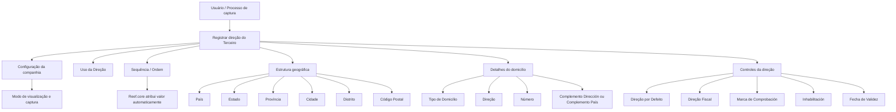

# Gestão de Direções de Terceiros no Reef.core — Especificação Funcional

## 1. Metadados do Documento
- **Arquivo de Origem:** Não identificado; conteúdo bruto fornecido pelo usuário.
- **Tipo de Documento:** Especificação Técnica / Manual Funcional.
- **Domínio / Sistema:** Documentação Reef; Reef.core; gestão de dados de Terceiros.
- **Público-Alvo:** Desenvolvedores, analistas funcionais, operação e negócio.
- **Data/Versão Identificada:** Não identificada.

---

## 2. Resumo Executivo & Contexto de Negócio

O documento descreve a ação **CREAR Direcciones del Tercero**, cujo objetivo é registrar e classificar direções associadas a um Terceiro no sistema Reef.core. A documentação detalha atributos de endereço, seu significado funcional e regras de uso na operação de entidades seguradoras.

A captura dos dados de direção pode seguir uma entre duas sequências configuráveis nas companhias. O texto fornecido descreve atributos percorridos da esquerda para a direita e de cima para baixo, mas não apresenta integralmente as duas sequências nem a configuração específica de cada companhia.

A estrutura geográfica de uma direção é organizada em cinco níveis: País, Estado, Província, Cidade e Distrito. Os valores desses níveis devem ser obtidos dos catálogos existentes no sistema. O Código Postal é associado aos cinco níveis da estrutura geográfica.

O documento também define regras para direção padrão, direção fiscal, inabilitação, validação, validade e coordenadas geográficas. Há restrições explícitas: somente uma Direção por Defeito e uma Direção Fiscal podem ser identificadas para cada Terceiro, e a captura em **Complemento Dirección** é excludente em relação à captura em **Complemento País**.

---

## 3. Arquitetura, Componentes & Tecnologias Envolvidas

| Componente / Termo | Papel identificado |
| :--- | :--- |
| **Reef.core** | Sistema que atribui automaticamente o número de sequência na captura de direções do Terceiro. |
| **Documentación Reef** | Repositório ou contexto documental mencionado no conteúdo bruto. |
| **Entidade asseguradora** | Organização que realiza codificações locais, utiliza processos internos e define a configuração de visualização e captura. |
| **Catálogo de países** | Fonte de valores possíveis para o primeiro nível da estrutura geográfica. |
| **Catálogo de estados** | Fonte de valores possíveis para o segundo nível da estrutura geográfica. |
| **Catálogo de províncias** | Fonte de valores possíveis para o terceiro nível da estrutura geográfica. |
| **Catálogo de localidades** | Fonte de valores possíveis para o quarto nível da estrutura geográfica. |
| **Catálogo de distritos** | Fonte de valores possíveis para o quinto nível da estrutura geográfica. |
| **Callejero local** | Referência local para Tipo de Domicílio e detalhamento de Direção. |



> **Nota de Análise:** O documento menciona duas sequências de captura configuráveis por companhia, mas o conteúdo fornecido não detalha completamente ambas as sequências, nem os parâmetros técnicos de configuração.

---

## 4. Regras de Negócio, Especificações Funcionais & Processos

### 4.1 Objetivo funcional
A ação **CREAR Direcciones del Tercero** destina-se ao registro e à classificação de direções de um Terceiro.

### 4.2 Sequência de captura
- A captura pode seguir uma de duas sequências.
- A configuração existente nas companhias determina o modo de visualização e captura das informações.
- A primeira sequência é apresentada como uma leitura da esquerda para a direita e de cima para baixo.
- Caso os campos não sejam especificados ou indicados expressamente, devem ser utilizados indistintamente para registro de informações de Pessoas Físicas e Pessoas Jurídicas.

### 4.3 Estrutura geográfica
A direção do Terceiro pode conter uma estrutura geográfica hierárquica:

1. **País:** primeiro nível da estrutura geográfica.
2. **Estado:** segundo nível da estrutura geográfica.
3. **Província:** terceiro nível da estrutura geográfica.
4. **Cidade:** quarto nível da estrutura geográfica.
5. **Distrito:** quinto nível da estrutura geográfica.
6. **Código Postal:** chave associada aos cinco níveis geográficos da direção.

Cada nível deve utilizar os valores possíveis existentes no catálogo correspondente do sistema.

### 4.4 Complementos e endereços fora do país da entidade seguradora
- **Complemento Dirección** permite registrar informações adicionais sobre a direção, como urbanização, ponto quilométrico ou andar de um edifício para uma Direção Comercial.
- **Complemento País** pode ser utilizado quando a direção não pertence ao país da entidade seguradora e os catálogos territoriais não possuem a informação necessária.
- A captura em **Complemento País** ocorre sem validação.
- A captura em **Complemento Dirección** é excludente da captura em **Complemento País**.

### 4.5 Coordenadas geográficas
- A latitude e a longitude são coordenadas geográficas angulares utilizadas para localizar um ponto na superfície terrestre.
- O sistema de coordenadas geográficas utiliza graus, minutos e segundos, acompanhados de uma indicação cardinal: Norte, Sul, Este ou Oeste.
- A notação apresentada primeiro contém latitude e depois longitude.
- Exemplo apresentado: `(66° 33’ 9’’ N; 11° 04’ 13’’ E)`.
- A latitude corresponde à distância angular entre um ponto e o Equador.
- A longitude corresponde à distância angular entre um ponto e o meridiano de Greenwich.
- O atributo Latitude deve conter graus, minutos e segundos que identificam a latitude.
- O atributo Longitude deve conter graus, minutos e segundos que identificam a longitude.
- A letra `W` pode ser encontrada em vez de `O` para Oeste, por corresponder ao termo inglês *West*.

### 4.6 Regras de unicidade
- Um Terceiro com múltiplas direções pode possuir somente **uma Direção por Defeito**.
- Um Terceiro com múltiplas direções pode possuir somente **uma Direção Fiscal**.

### 4.7 Estado operacional e qualidade de dados
- **Marca de Comprobación** indica se a direção foi revisada e verificada para fins de qualidade de dados.
- **Inhabilitación** indica que a direção está inabilitada e, portanto, não deve ser empregada, considerada ou utilizada em processos operacionais da entidade.
- **Fecha de Validez** representa a data de validade da direção.
- **Observaciones** permite o registro de texto descritivo complementar.

---

## 5. Tabelas de Parâmetros, Ambientes e Estruturas de Dados

| Item / Parâmetro | Descrição / Função | Tipo / Valores / Formato | Ambiente / Observações |
| :--- | :--- | :--- | :--- |
| Uso de la Dirección | Uso associado à direção do Terceiro. | Codificação local da entidade seguradora. | Utilizado posteriormente nos processos internos da entidade. |
| Secuencia/Orden | Número de sequência na captura de direções do Terceiro. | Valor automático. | Atribuído automaticamente pelo Reef.core. |
| País | Primeiro nível da estrutura geográfica. | Código de país. | Valores obtidos do catálogo de países do sistema. |
| Estado | Segundo nível da estrutura geográfica. | Código de estado. | Valores obtidos do catálogo de estados do sistema. |
| Provincia | Terceiro nível da estrutura geográfica. | Código de província. | Valores obtidos do catálogo de províncias do sistema. |
| Ciudad | Quarto nível da estrutura geográfica. | Código de localidade. | Valores obtidos do catálogo de localidades do sistema. |
| Distrito | Quinto nível da estrutura geográfica. | Código de distrito. | Valores obtidos do catálogo de distritos do sistema. |
| Código Postal | Identifica o código postal da direção. | Chave de código postal. | Associado aos cinco níveis da estrutura geográfica. |
| Tipo de Domicilio | Tipo de via associado à direção. | Codificação local. | Definido de acordo com o callejero local. |
| Dirección | Detalhamento da direção. | Texto de direção. | Pode incluir indicação de cerrada, urbanização, bloco, escada e apartamento. |
| Número | Número da direção do Terceiro. | Número. | Não há formato adicional especificado. |
| Complemento Dirección | Informações complementares da direção. | Texto complementar. | Pode indicar urbanização, ponto quilométrico ou andar do edifício. Excludente com Complemento País. |
| Complemento País | Dados de direção fora da estrutura territorial catalogada. | Texto sem validação. | Aplicável quando a direção não é do país da entidade seguradora. Excludente com Complemento Dirección. |
| Latitud | Coordenada geográfica de latitude. | Graus, minutos, segundos e orientação cardinal. | Exemplo: `66° 33’ 9’’ N`. |
| Longitud | Coordenada geográfica de longitude. | Graus, minutos, segundos e orientação cardinal. | Exemplo: `11° 04’ 13’’ E`. |
| Dirección por Defecto | Identifica a direção padrão do Terceiro. | Indicador. | Apenas uma direção padrão por Terceiro. |
| Marca de Comprobación | Indica revisão e verificação da direção. | Indicador. | Relacionada à qualidade dos dados. |
| Inhabilitación | Indica que a direção está inabilitada. | Indicador. | A direção não deve ser usada nos processos operacionais. |
| Domicilio Fiscal | Identifica a direção fiscal do Terceiro. | Indicador. | Apenas uma direção fiscal por Terceiro. |
| Fecha de Validez | Indica a validade da direção. | Data. | Não há formato de data especificado. |
| Observaciones | Informações adicionais sobre a direção. | Texto descritivo. | Campo complementar. |

---

## 6. Bateria de Perguntas & Respostas para RAG (FAQ Sintético)

### P1: Qual é o objetivo da ação CREAR Direcciones del Tercero?
**R:** A ação CREAR Direcciones del Tercero tem como objetivo registrar e classificar as direções associadas a um Terceiro no sistema documentado.

### P2: Como é atribuído o valor de Secuencia/Orden de uma direção?
**R:** O atributo Secuencia/Orden contém o número de sequência na captura das direções do Terceiro. Esse valor é atribuído automaticamente pelo Reef.core.

### P3: Quais são os níveis da estrutura geográfica de uma direção?
**R:** A estrutura geográfica possui cinco níveis: País, Estado, Província, Cidade e Distrito. Cada nível utiliza valores provenientes do catálogo correspondente existente no sistema.

### P4: Qual é a função do Código Postal na direção do Terceiro?
**R:** O Código Postal contém a chave que identifica o código postal associado aos cinco níveis da estrutura geográfica onde a direção do Terceiro está localizada.

### P5: Quando o campo Complemento País deve ser usado?
**R:** Complemento País deve ser usado quando a direção capturada não pertence ao país da entidade seguradora e a informação territorial correspondente não existe nos catálogos da estrutura territorial. Nesse campo, os dados podem ser capturados sem validação.

### P6: Complemento Dirección e Complemento País podem ser preenchidos simultaneamente?
**R:** Não. A captura de informações no campo Complemento Dirección é excludente em relação à captura no campo Complemento País.

### P7: Quantas direções padrão um Terceiro pode ter?
**R:** Um Terceiro pode ter várias direções associadas, mas somente uma direção pode ser identificada como Dirección por Defecto.

### P8: Quantas direções fiscais um Terceiro pode ter?
**R:** Um Terceiro pode ter várias direções associadas, mas somente uma pode ser identificada como Domicilio Fiscal.

### P9: Qual é o efeito da Inhabilitación sobre uma direção?
**R:** Inhabilitación informa ao sistema que a direção associada ao Terceiro está inabilitada. Portanto, essa direção não deve ser utilizada, contemplada ou empregada nos processos operacionais da entidade.

### P10: O que a Marca de Comprobación representa?
**R:** A Marca de Comprobación permite considerar, nos processos da entidade, se a direção do Terceiro foi revisada e verificada, em relação à qualidade dos dados registrados no sistema.

### P11: Qual é o formato indicado para latitude e longitude?
**R:** Latitude e longitude devem conter graus, minutos, segundos e uma orientação cardinal. O documento apresenta o exemplo `(66° 33’ 9’’ N; 11° 04’ 13’’ E)`, no qual a latitude aparece antes da longitude.

### P12: Para que serve o campo Observaciones?
**R:** Observaciones permite capturar um texto descritivo com informações complementares sobre a direção do Terceiro.

---

## 7. Glossário de Termos, Siglas & Conceitos-Chave

- **Reef.core:** Sistema citado como responsável por atribuir automaticamente o número de sequência da captura de direções.
- **Terceiro:** Entidade à qual uma ou mais direções são associadas.
- **Callejero local:** Referência local usada para definir o tipo de via e o detalhamento da direção.
- **Dirección por Defecto:** Direção padrão do Terceiro; apenas uma pode ser marcada dessa forma.
- **Domicilio Fiscal:** Direção fiscal do Terceiro; apenas uma pode ser marcada dessa forma.
- **Marca de Comprobación:** Indicador de revisão e verificação da direção para qualidade de dados.
- **Inhabilitación:** Indicador de que a direção não deve ser utilizada em processos operacionais.
- **Latitud:** Distância angular entre um ponto e o Equador; simbolizada no texto por `ϕ`.
- **Longitud:** Distância angular entre um ponto e o meridiano de Greenwich; simbolizada no texto por `λ`.
- **W:** Letra que pode ser usada em vez de `O` para Oeste, proveniente do termo inglês *West*.

---

## 8. Notas Críticas, Riscos & Limitações

- O conteúdo não identifica nome de arquivo, data, versão ou autoria documental verificável.
- O documento informa a existência de duas sequências de captura, mas o conteúdo fornecido não apresenta detalhamento completo de ambas.
- Os campos marcados com parênteses no texto original não possuem explicação de obrigatoriedade, tipo técnico, tamanho, formato ou domínio de valores.
- Não são documentados contratos de API, métodos HTTP, estruturas JSON, permissões, mensagens de erro ou regras de persistência.
- Não há detalhamento sobre como a configuração da companhia define a visualização e a captura das informações.
- Não é fornecido formato de data para **Fecha de Validez**.
- A utilização de Complemento País sem validação representa uma flexibilização de qualidade e padronização territorial dos dados.

---

## 9. Conteúdo Bruto Estruturado (Referência Fiel)

```text
--- [PÁGINA 1 DE 4] ---

CREAR Direcciones del Tercero
Objetivo
El propósito de esta acción no es otro que Registrar y Clasificar las Direcciones del Tercero.
Posibles Acciones
 CREAR ( )
Direcciones
La captura de los Datos puede seguir una de las dos siguientes secuencias ...
Documentation / DOCUMENTACIÓN Reef
DOCUMENTACIÓN Reef
Mapfredocument
DOCUMENTACIÓN Reef
Owner
user:agonzalez_mapfre.com
Lifecycle
Approved Source
 / 
 VL
Buscar Inicio Soluciones Arquitecturas APIs Componentes Cloud Documentación Zeus Reef Ayuda
ES

--- [PÁGINA 2 DE 4] ---

... De acuerdo con la configuración del parámetro en la configuración de las compañías que le indica al Sistema el modo de visualización y
captura de la información.
Atendiendo a la primera de las dos secuencias, de izquierda a derecha y de arriba hacia abajo, los siguientes atributos marcan la secuencia
de captura de la información.
Si no se especifica o indica expresamente los campos se emplearán indistintamente tanto en el registro de información de las Personas
Físicas como para las Personas Jurídicas.
Uso de la Dirección (  )
Este dato contendrá el uso que se va a asociar a la Dirección del Tercero de acuerdo con la codificación efectuada localmente por parte de la
entidad aseguradora para su posterior uso en los procesos internos de la entidad.
Secuencia/Orden
Este dato contiene el Número de Secuencia en la Captura de las Direcciones del Tercero. Es un valor que se asigna en Reef.core
automáticamente.
País (  )
Este Campo contiene el código del primer nivel de la estructura Geográfica en la que se encuentra ubicada la Dirección del Tercero de
acuerdo con la relación de posibles valores existentes en el catálogo de países existente en el Sistema.
Estado (  )
Este Campo contiene el código del segundo nivel de la estructura Geográfica en la que se encuentra ubicada la Dirección del Tercero de
acuerdo con la relación de posibles valores existentes en el catálogo de estados existente en el Sistema.
Provincia (  )
Este Campo contiene el código del tercer nivel de la estructura Geográfica en la que se encuentra ubicada la Dirección del Tercero de acuerdo
con la relación de posibles valores existentes en el catálogo de provincias existente en el Sistema.
Ciudad (  )
Este Campo contiene el código del cuarto nivel de la estructura Geográfica en la que se encuentra ubicada la Dirección del Tercero de
acuerdo con la relación de posibles valores existentes en el catálogo de localidades existente en el Sistema.
Distrito (  )
Este Campo contiene el código del quinto nivel de la estructura Geográfica en la que se encuentra ubicada la Dirección del Tercero de acuerdo
con la relación de posibles valores existentes en el catálogo de distritos existente en el Sistema.
Código Postal (  )
Esta Propiedad contiene la clave que identifica el Código Postal asociado a los cinco niveles de la estructura geográfica en la que está
ubicada la Dirección del Tercero.
Tipo de Domicilio (  )
De acuerdo con el callejero local, este dato contendrá el Tipo de Vía que se va a asociar a la Dirección del Tercero de acuerdo con la
codificación efectuada localmente por parte de la entidad aseguradora para su posterior uso en los procesos internos de la entidad.
Dirección ( )
Este Campo contiene la Dirección detallada de acuerdo con el Callejero y los usos locales (Indicación o no de la Cerrada, Urbanización,
Bloque, Escalera, Apartamento,...)

--- [PÁGINA 3 DE 4] ---

Número ( )
Este Atributo contiene el número de la Dirección del Tercero.
Complemento Dirección ( )
Este Campo permite capturar información complementaria de la Dirección del Tercero como por ejemplo:
1. Para indicar la Urbanización del Domicilio.
2. Para indicar algún punto kilométrico que facilite la ubicación del Domicilio.
3. Para indicar la Planta del Edificio en la que se encuentra la ubicación del Tercero en una Dirección tipificada como Dirección Comercial,
Complemento País ( )
Si la dirección que se está capturando en el sistema no es del país de la entidad aseguradora es posible que no se tenga en los catálogos de
la estructura territorial la información correspondiente, por lo cual este campo permite capturar 'sin realizar validación alguna' los datos de la
dirección.
La captura de información en el Campo Complemento Dirección es excluyente de la captura de información del Campo Complemento
País
Latitud ( )
CONTEXTO.
La latitud y la longitud son los dos tipos de coordenadas geográficas angulares que conforman el sistema de referencia planetario y que
permiten ubicar un punto cualquiera en la superficie del planeta Tierra.
Por ejemplo: Coordenadas del punto X: (66° 33’ 9’’ N; 11° 04’ 13’’ E)
Latitud. Es el ángulo imaginario que determina la distancia entre un punto cualquiera y el ecuador.
Longitud. Es el ángulo imaginario que determina la distancia entre un punto y el meridiano de Greenwich o meridiano 0.
Este Atributo de la dirección del Tercero tiene que contener la información correspondiente a los grados, minutos y segundos que identifiquen
su latitud, ... en nuestro ejemplo 66° 33’ 9’’ N
Longitud ( )
Este Atributo de la Dirección del Tercero debe contener la información correspondiente a los grados, minutos y segundos que identifican su
longitud, ... con los datos del ejemplo anterior 11° 04’ 13’’ E
Dirección por Defecto ( )
Este Campo, en aquellos Terceros que tienen más de una dirección asociada, indicará cual de ellas es la Dirección por Defecto del Tercero.
Solamente puede haber una Dirección por Defecto identificada como tal.

--- [PÁGINA 4 DE 4] ---

Marca de Comprobación ( )
Esta propiedad permite considerar en los procesos de la entidad si la Dirección del Tercero ha sido o no revisada y verificada, todo ello en
relación con la calidad de los datos en el sistema.
Inhabilitación ( )
Esta propiedad le indica al Sistema que la Dirección asociada al Tercero está inhabilitada, por lo que no debería ser empleada, contemplada o
utilizada en los procesos operativos de la entidad.
Domicilio Fiscal ( )
Este Campo, en aquellos Terceros que tienen más de una dirección asociada, indicará cual de ellas es la Dirección Fiscal del Tercero.
Solamente puede haber una única Dirección Fiscal identificada como tal.
Fecha de Validez ( )
Esta propiedad indicará la Fecha de Validez de la Dirección del Tercero.
Observaciones ( )
Este Campo permite capturar un texto descriptivo con información complementaria sobre la Dirección del Tercero.
```
