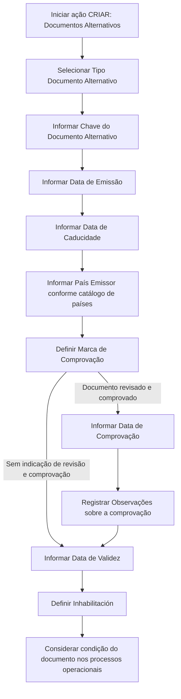

# Documentação REEF — Criar Documentos Alternativos do Terceiro

## 1. Metadados do Documento
- **Arquivo de Origem:** Não identificado no conteúdo fornecido
- **Tipo de Documento:** Especificação Funcional
- **Domínio / Sistema:** REEF / Mapfre — gestão de Terceiros
- **Público-Alvo:** Analistas funcionais, desenvolvedores, operação e equipes de qualidade de dados
- **Data/Versão Identificada:** Não identificada

---

## 2. Resumo Executivo & Contexto de Negócio

O documento descreve a ação de **criação e captura de Documentos Alternativos do Terceiro** no sistema REEF. O propósito funcional é permitir a identificação alternativa de um Terceiro por documentos diferentes do seu documento principal.

A funcionalidade contempla o registro de atributos relativos ao documento alternativo, incluindo tipo, chave, datas de emissão, validade e caducidade, país emissor e informações de comprovação. A sequência de captura deve ser interpretada da esquerda para a direita e de cima para baixo.

Os campos descritos podem ser utilizados tanto para o registro de informações de **Pessoas Físicas** quanto de **Pessoas Jurídicas**, salvo quando houver indicação expressa em contrário. O conteúdo não apresenta distinções adicionais entre os dois tipos de pessoa.

A documentação também estabelece controles de qualidade do dado. A marca de comprovação indica se o documento alternativo foi revisado e verificado; quando a comprovação estiver aplicável, podem ser registrados a data da comprovação e comentários sobre a validação.

O recurso de data de validade permite manter histórico de alterações na informação do documento alternativo. O campo de inabilitação informa ao sistema que determinado documento alternativo não está habilitado e que essa condição deve ser considerada nos processos operacionais da entidade.

---

## 3. Arquitetura, Componentes & Tecnologias Envolvidas

O conteúdo fornecido cita os seguintes elementos:

| Componente / Elemento | Papel identificado |
| :--- | :--- |
| **REEF** | Sistema ou domínio documental no qual a ação é documentada. |
| **Mapfre** | Contexto corporativo identificado na documentação. |
| **Terceiro** | Entidade cuja identificação pode utilizar documentos principais ou alternativos. |
| **Documentos Alternativos** | Registros usados para identificação alternativa do Terceiro. |
| **Catálogo de países do Sistema** | Fonte dos valores possíveis para o código do país emissor. |
| **Processos operacionais da entidade** | Processos que devem considerar a condição de inabilitação do documento alternativo. |

O documento não descreve microsserviços, APIs, bancos de dados, contratos HTTP, tecnologias de infraestrutura, ambientes ou integrações técnicas.



> **Nota de Análise:** O documento apresenta um fluxo funcional de captura de dados, não uma arquitetura técnica. Não há detalhamento sobre persistência, interfaces, serviços, APIs ou validações sistêmicas adicionais.

---

## 4. Regras de Negócio, Especificações Funcionais & Processos

### 4.1 Objetivo da ação

A ação de captura de Documentos Alternativos do Terceiro tem como objetivo facilitar a identificação do Terceiro por documentos alternativos ao documento principal.

### 4.2 Ação disponível

A ação explicitamente indicada no documento é:

- **CRIAR:** criação de registros de Documentos Alternativos.

### 4.3 Sequência de captura

Os atributos devem seguir a sequência visual estabelecida pela documentação:

1. Da esquerda para a direita.
2. De cima para baixo.

### 4.4 Abrangência para tipos de Terceiro

Na ausência de especificação ou indicação expressa de campos, os atributos podem ser empregados indistintamente para:

- Pessoas Físicas.
- Pessoas Jurídicas.

### 4.5 Regras por atributo

1. **Tipo Documento Alternativo**
   - Contém o documento alternativo utilizado para identificar alternativamente o Terceiro.
   - A escolha deve ocorrer de acordo com os tipos de documentos existentes.

2. **Clave del Documento Alternativo**
   - Contém a chave do documento alternativo do Terceiro.

3. **Fecha de Emisión**
   - Indica a data de emissão do Documento Alternativo do Terceiro.

4. **Fecha de Caducidad**
   - Indica a data de caducidade do Documento Alternativo do Terceiro.

5. **País Emisor**
   - Contém o código do país emissor do documento alternativo.
   - Os valores devem estar de acordo com o catálogo de países existente no Sistema.

6. **Marca de Comprobación**
   - Permite considerar, nos processos da entidade, se o documento alternativo foi revisado e verificado.
   - Está relacionada à qualidade dos dados no sistema.

7. **Fecha de Comprobación**
   - Deve conter a data em que a revisão e comprovação foram realizadas.
   - Aplica-se quando o estado da Marca de Comprobación indicar que o documento alternativo foi revisado e comprovado.

8. **Observaciones**
   - Permite registrar texto aclaratório ou observações relativas ao fato da comprovação.
   - Aplica-se caso o documento alternativo tenha sido revisado e validado.

9. **Fecha de Validez**
   - Indica a data a partir da qual o Documento Alternativo do Terceiro estará plenamente operativo no sistema.
   - O uso correto permite manter histórico das alterações efetuadas na informação do documento.

10. **Inhabilitación**
    - Indica ao Sistema que o documento alternativo do Terceiro está inabilitado.
    - Essa condição deve ser usada, considerada ou aplicada nos processos operacionais da entidade.

---

## 5. Tabelas de Parâmetros, Ambientes e Estruturas de Dados

| Item / Parâmetro | Descrição / Função | Tipo / Valores / Formato | Ambiente / Observações |
| :--- | :--- | :--- | :--- |
| Ação | Operação apresentada para Documentos Alternativos. | `CRIAR` | Nenhuma outra ação é detalhada. |
| Tipo Documento Alternativo | Define o documento alternativo usado para identificar o Terceiro. | Tipos de documentos existentes | O catálogo ou valores concretos não são apresentados. |
| Clave del Documento Alternativo | Chave do documento alternativo do Terceiro. | Não especificado | Campo localizado no painel de informação. |
| Fecha de Emisión | Data de emissão do documento alternativo. | Data; formato não especificado | Referente ao Documento Alternativo do Terceiro. |
| Fecha de Caducidad | Data de caducidade do documento alternativo. | Data; formato não especificado | Referente ao Documento Alternativo do Terceiro. |
| País Emisor | Código do país emissor do documento alternativo. | Código presente no catálogo de países do Sistema | O documento não apresenta a lista do catálogo. |
| Marca de Comprobación | Informa se o documento foi revisado e verificado. | Estado de comprovação; valores não especificados | Relacionada à qualidade de dados e aos processos da entidade. |
| Fecha de Comprobación | Data da realização da revisão e comprovação. | Data; formato não especificado | Aplicável se a Marca de Comprobación indicar revisão e comprovação. |
| Observaciones | Texto aclaratório ou observações sobre a comprovação. | Texto; tamanho e formato não especificados | Aplicável se o documento tiver sido revisado e validado. |
| Fecha de Validez | Data a partir da qual o documento estará plenamente operativo. | Data; formato não especificado | Permite histórico das alterações da informação. |
| Inhabilitación | Informa que o documento alternativo está inabilitado. | Estado; valores não especificados | Deve ser considerado nos processos operacionais da entidade. |
| Tipos de Terceiro | Categorias para as quais os campos podem ser usados indistintamente. | Pessoas Físicas e Pessoas Jurídicas | Válido quando não houver especificação expressa em contrário. |

> **Nota de Análise:** O documento não informa obrigatoriedade de campos, formatos de data, tamanhos máximos, valores booleanos, mensagens de erro, regras de unicidade ou critérios de persistência.

---

## 6. Bateria de Perguntas & Respostas para RAG (FAQ Sintético)

### P1: Qual é o objetivo da ação de criação de Documentos Alternativos do Terceiro?
**R:** O objetivo é facilitar a identificação de um Terceiro por documentos alternativos ao seu documento principal.

### P2: Qual ação é apresentada para a gestão de Documentos Alternativos?
**R:** A documentação apresenta a ação **CRIAR** para o registro de Documentos Alternativos.

### P3: Os campos de Documentos Alternativos podem ser usados para Pessoas Físicas e Pessoas Jurídicas?
**R:** Sim. Quando não houver especificação ou indicação expressa de um campo, os atributos podem ser utilizados indistintamente para o registro de informação de Pessoas Físicas e Pessoas Jurídicas.

### P4: Como deve ser informado o país emissor de um documento alternativo?
**R:** O campo País Emisor deve conter o código do país emissor do documento alternativo conforme a relação de valores disponível no catálogo de países existente no Sistema.

### P5: Para que serve a Marca de Comprobación?
**R:** A Marca de Comprobación permite que os processos da entidade considerem se o documento alternativo foi revisado e verificado. Esse controle está relacionado à qualidade dos dados no sistema.

### P6: Quando a Fecha de Comprobación deve ser preenchida?
**R:** A Fecha de Comprobación é aplicável quando o estado da Marca de Comprobación indicar que o documento alternativo foi revisado e comprovado. Nesse caso, o campo registra a data em que essa ação foi realizada.

### P7: Qual é a finalidade do campo Observaciones?
**R:** Observaciones permite registrar um texto aclaratório ou observações sobre a comprovação quando o documento alternativo tiver sido revisado e validado.

### P8: O que representa a Fecha de Validez de um Documento Alternativo?
**R:** A Fecha de Validez informa a data a partir da qual o Documento Alternativo do Terceiro estará plenamente operativo no sistema. O uso correto desse campo permite manter histórico das alterações efetuadas nas informações do documento.

### P9: Como o sistema deve interpretar a Inhabilitación?
**R:** A Inhabilitación informa ao Sistema que o documento alternativo do Terceiro está inabilitado. Essa condição deve ser empregada, considerada ou utilizada nos processos operacionais da entidade.

### P10: Quais datas são descritas para o Documento Alternativo do Terceiro?
**R:** O documento descreve Fecha de Emisión, Fecha de Caducidad, Fecha de Comprobación e Fecha de Validez. A Fecha de Comprobación possui condição de aplicabilidade vinculada à Marca de Comprobación.

### P11: Em qual ordem os atributos devem ser capturados?
**R:** Os atributos devem seguir a sequência de captura apresentada da esquerda para a direita e de cima para baixo.

### P12: A documentação especifica o formato das datas ou os valores permitidos para a Marca de Comprobación?
**R:** Não. O documento menciona os campos de data e a Marca de Comprobación, mas não especifica formatos de data, valores permitidos, obrigatoriedade ou regras de validação.

---

## 7. Glossário de Termos, Siglas & Conceitos-Chave

- **REEF:** Nome do contexto documental ou sistema identificado no cabeçalho da documentação.
- **Terceiro:** Entidade que pode ser identificada por um documento principal ou por documentos alternativos.
- **Documento Alternativo:** Documento utilizado para identificar o Terceiro alternativamente ao documento principal.
- **Documento Principal:** Documento de identificação principal do Terceiro, citado como referência para diferenciar os documentos alternativos.
- **Clave del Documento Alternativo:** Chave associada ao documento alternativo do Terceiro.
- **País Emisor:** País emissor do documento alternativo, representado por código conforme catálogo de países do Sistema.
- **Marca de Comprobación:** Indicador que permite considerar se o documento alternativo foi revisado e verificado.
- **Fecha de Comprobación:** Data em que ocorreu a revisão e comprovação do documento alternativo.
- **Fecha de Validez:** Data a partir da qual o documento alternativo está plenamente operativo no sistema.
- **Inhabilitación:** Condição que indica que o documento alternativo está inabilitado.
- **Pessoas Físicas:** Categoria de Terceiro para a qual os campos podem ser utilizados, salvo indicação expressa em contrário.
- **Pessoas Jurídicas:** Categoria de Terceiro para a qual os campos podem ser utilizados, salvo indicação expressa em contrário.

---

## 8. Notas Críticas, Riscos & Limitações

- O documento não identifica o arquivo de origem, versão, data de publicação ou responsável funcional.
- Não são especificados formatos para as datas de emissão, caducidade, comprovação e validade.
- Não são apresentados os valores possíveis do catálogo de tipos de documentos alternativos.
- Não é apresentada a relação de códigos do catálogo de países do Sistema.
- A documentação não define se os campos são obrigatórios, opcionais, condicionais além da regra explícita da Fecha de Comprobación, ou se possuem validações de consistência.
- Não há especificação dos valores possíveis para Marca de Comprobación e Inhabilitación.
- Não são descritos critérios de inabilitação, reabilitação, exclusão, alteração ou consulta de Documentos Alternativos.
- Não há detalhamento de integrações, APIs, serviços, persistência, permissões, trilha de auditoria ou tratamento de erros.
- **Nota de Análise:** O documento descreve a funcionalidade de captura, mas não detalha métodos HTTP, contratos JSON, regras de autorização ou componentes técnicos associados.

---

## 9. Conteúdo Bruto Estruturado (Referência Fiel)

```text
--- [PÁGINA 1 DE 2] ---

CREAR Documentos Alternativos del Tercero
Objetivo
El propósito de la acción de captura de los Documentos Alternativos del Tercero es facilitar la identicación del Tercero con documentos
'alternativos' al documento 'principal'.
Posibles Acciones
 CREAR ( )
Documentos Alternativos
De izquierda a derecha y de arriba hacia abajo, los siguientes atributos marcan la secuencia de captura de la información.
Si no se especica o indica expresamente los Campos se emplearán indistintamente tanto en el registro de información de las Personas
Físicas como para las Personas Jurídicas.
Tipo Documento Alternativo (  )
Este Atributo del colapsador contiene el documento alternativo con el que se va a identicar alternativamente al Tercero de acuerdo con los
tipos de documentos existentes.
Clave del Documento Alternativo ( )
Este Campo del panel de información contiene la clave del documento alternativo del Tercero.
Fecha de Emisión ( )
Esta propiedad indicará la Fecha de Emisión del Documento Alternativo del Tercero.
Fecha de Caducidad ( )
Este Dato indicará la Fecha de Caducidad del Documento Alternativo del Tercero.
Documentation / DOCUMENTACIÓN Reef
DOCUMENTACIÓN Reef
Mapfredocument
DOCUMENTACIÓN Reef
Owner
user:agonzalez_mapfre.com
Lifecycle
Approved Source
 / 
 VL
Buscar Inicio Soluciones Arquitecturas APIs Componentes Cloud Documentación Zeus Reef Ayuda
ES


--- [PÁGINA 2 DE 2] ---

País Emisor (  )
Este Campo contiene el código del país emisor del documento alternativo del Tercero de acuerdo con la relación de posibles valores
existentes en el catálogo de países existente en el Sistema.
Marca de Comprobación ( )
Esta propiedad permite considerar en los procesos de la entidad si el documento alternativo ha sido o no revisado y vericado, todo ello en
relación con la calidad de los datos en el sistema.
Fecha de Comprobación ( )
En el supuesto que el estado de la marca de comprobación implique que el documento alternativo sí ha sido revisado y comprobado, este
campo contiene la fecha en la que esta acción se habrá realizado.
Observaciones ( )
Caso que el documento alternativo haya sido revisado y validado, este Dato permite ingresar un texto aclaratorio u observaciones al hecho de
la comprobación.
Fecha de Validez ( )
Esta propiedad le indica al sistema la fecha a partir de la cual el Documento Alternativo del Tercero estará plenamente operativo en el
sistema por lo que su correcto uso permite tener un histórico de los cambios efectuados en su información.
Inhabilitación ( )
El cotejo de este campo le indica al Sistema que el documento alternativo del Tercero está inhabilitado, por lo que este supuesto debería ser
empleado, considerado o utilizado en los procesos operativos de la entidad.
```
