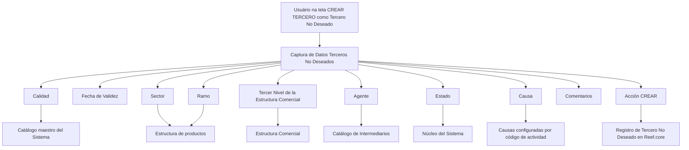

# Reef.core — Registro de Tercero como Tercero No Deseado

## 1. Metadados do Documento
- **Arquivo de Origem:** `Não identificado no conteúdo bruto` (referências visíveis: `Mapfredocument` e `DOCUMENTACIÓN Reef`)
- **Tipo de Documento:** Especificação Funcional
- **Domínio / Sistema:** Reef.core / Reef
- **Público-Alvo:** Desenvolvedores, Analistas Funcionais, Operação e Negócio
- **Data/Versão Identificada:** Não identificada

---

## 2. Resumo Executivo & Contexto de Negócio

O documento descreve a tela **“CREAR TERCERO como Tercero No Deseado”** no sistema **Reef.core**. O objetivo explícito é registrar um terceiro como **Tercero No Deseado**, considerando o código de atividade e os valores dos atributos que identificam esse terceiro.

A tela possui a ação habilitada **CREAR** e organiza a captura de informações na seção **Datos Terceros No Deseados**. A sequência de preenchimento é definida da esquerda para a direita e de cima para baixo.

A classificação de um terceiro como não desejado pode ser aplicada em escopos distintos da estrutura de produtos e comercial: setor, ramo técnico e terceiro nível da estrutura comercial. Para esses atributos, o documento prevê códigos genéricos que ampliam a abrangência da marcação para todos os valores existentes.

O registro inclui também qualidade, data de validade, agente, estado, causa e comentários. A data de validade permite manter histórico das alterações realizadas nas informações do terceiro. O documento não detalha métodos HTTP, contratos JSON, persistência, validações obrigatórias, permissões ou integrações técnicas.

---

## 3. Arquitetura, Componentes & Tecnologias Envolvidas

| Componente / Termo | Papel descrito |
| :--- | :--- |
| Reef.core | Sistema que fornece a funcionalidade para registrar o terceiro como não desejado. |
| Tela “CREAR TERCERO como Tercero No Deseado” | Interface funcional para captura e criação do registro. |
| Datos Terceros No Deseados | Conjunto de atributos capturados para classificar um terceiro como não desejado. |
| Catálogo maestro del Sistema | Fonte de valores previamente codificados para o atributo Calidad. |
| Estrutura de produtos | Fonte dos códigos de Sector e Ramo técnico. |
| Estrutura Comercial | Fonte do código do terceiro nível da estrutura comercial. |
| Catálogo de Intermediarios | Fonte de possíveis valores para Agente. |
| Núcleo do Sistema | Fornece a classificação de Estado. |
| Código de actividad | Referência para configuração de causas ou motivos de inabilitação. |



> **Nota de Análise:** O documento descreve a funcionalidade e os atributos da tela, mas não detalha arquitetura física, microsserviços, banco de dados, APIs, tecnologias de implementação, ambientes ou mecanismos de integração.

---

## 4. Regras de Negócio, Especificações Funcionais & Processos

### Ação disponível
- A ação habilitada na tela é **CREAR**.

### Sequência de captura
- Os atributos de **Datos Terceros No Deseados** devem ser capturados da esquerda para a direita e de cima para baixo.

### Regras por atributo

1. **Calidad**
   - Permite capturar o código de qualidade associado ao terceiro.
   - O código deve corresponder a valores previamente codificados no catálogo mestre do sistema.
   - O código é informado no momento de registrar o terceiro como Tercero No Deseado.

2. **Fecha de Validez**
   - Indica a data a partir da qual o terceiro será identificado como Tercero No Deseado.
   - O uso correto da data permite manter histórico das alterações realizadas nas informações do terceiro.

3. **Sector**
   - Deve conter o código do setor conforme a estrutura de produtos configurada no sistema.
   - O código genérico **9999** marca o terceiro como não desejado para todos os setores existentes.
   - Um código de setor específico marca o terceiro como não desejado apenas para operações daquele setor.
   - O sistema contempla o registro de um terceiro como não desejado para um único setor dentre os setores existentes.

4. **Ramo**
   - Deve conter o código do ramo técnico conforme a estrutura de produtos definida no sistema.
   - O código genérico **999** marca o terceiro como não desejado para todos os ramos existentes.
   - Um código de ramo técnico específico marca o terceiro como não desejado apenas para aquele ramo.

5. **Tercer Nivel de la Estructura Comercial**
   - Deve conter o código do terceiro nível da estrutura comercial conforme a relação de valores configurada no sistema.
   - O código genérico **9999** marca o terceiro como não desejado para todas as oficinas existentes.
   - Um código de oficina específico marca o terceiro como não desejado apenas para aquela oficina.

6. **Agente**
   - Registra o código do agente para o qual o terceiro é considerado não desejado.
   - Os valores possíveis são configurados no catálogo de intermediários do sistema.

7. **Estado**
   - Contém uma classificação fornecida pelo núcleo do sistema.
   - A classificação representa possíveis condições e situações que identificam o terceiro como Tercero No Deseado.

8. **Causa**
   - Contém a causa ou motivo pelo qual o terceiro está sendo inabilitado.
   - Os códigos de causa ou motivo são configurados por código de atividade no sistema.

9. **Comentarios**
   - Permite capturar texto livre.
   - O texto pode ampliar ou detalhar o motivo pelo qual o terceiro é considerado uma pessoa física ou jurídica indesejável.

---

## 5. Tabelas de Parâmetros, Ambientes e Estruturas de Dados

| Item / Parâmetro | Descrição / Função | Tipo / Valores / Formato | Ambiente / Observações |
| :--- | :--- | :--- | :--- |
| Acción | Ação habilitada na tela. | `CREAR` | Nenhum ambiente informado. |
| Calidad | Código de qualidade associado ao terceiro. | Código previamente codificado | Obtido no catálogo mestre do sistema. |
| Fecha de Validez | Data a partir da qual o terceiro é identificado como não desejado. | Data; formato não informado | Permite histórico de alterações. |
| Sector | Define o setor em que a classificação se aplica. | Código de setor; `9999` para todos os setores | Conforme estrutura de produtos configurada. |
| Ramo | Define o ramo técnico em que a classificação se aplica. | Código de ramo técnico; `999` para todos os ramos | Conforme estrutura de produtos definida. |
| Tercer Nivel de la Estructura Comercial | Define a oficina ou escopo comercial da classificação. | Código configurado; `9999` para todas as oficinas | Conforme relação de valores da estrutura comercial. |
| Agente | Identifica o agente para o qual o terceiro é não desejado. | Código de agente | Valores do catálogo de intermediários. |
| Estado | Classificação de condições e situações do terceiro não desejado. | Valor fornecido pelo núcleo do sistema | Valores e enumerações não detalhados. |
| Causa | Motivo de inabilitação do terceiro. | Código de causa ou motivo | Configurado por código de atividade. |
| Comentarios | Complementa ou detalha o motivo da classificação. | Texto plano | Aplicável a pessoa física ou jurídica. |

---

## 6. Bateria de Perguntas & Respostas para RAG (FAQ Sintético)

### P1: Qual é o objetivo da tela “CREAR TERCERO como Tercero No Deseado” no Reef.core?
**R:** A tela permite registrar um terceiro como **Tercero No Deseado** no Reef.core, usando o código de atividade e os valores dos atributos que identificam o terceiro.

### P2: Qual ação está habilitada na tela de registro de Tercero No Deseado?
**R:** A ação habilitada é **CREAR**.

### P3: Como deve ser realizada a sequência de preenchimento dos dados?
**R:** Os atributos da seção **Datos Terceros No Deseados** devem ser capturados da esquerda para a direita e de cima para baixo.

### P4: Qual é a função da Fecha de Validez?
**R:** A Fecha de Validez informa a data a partir da qual o terceiro será identificado como Tercero No Deseado. Seu uso correto permite manter histórico das alterações efetuadas nas informações do terceiro.

### P5: O que acontece quando o código 9999 é utilizado no atributo Sector?
**R:** O código genérico **9999** permite marcar o terceiro como Tercero No Deseado para todos os setores existentes.

### P6: É possível classificar um terceiro como não desejado apenas para um setor específico?
**R:** Sim. Ao informar o código de um setor específico, o terceiro é identificado como Tercero No Deseado somente para as operações daquele setor. O documento afirma que o sistema permite a marcação para um único setor dentre os setores existentes.

### P7: Qual código genérico deve ser usado para aplicar a classificação a todos os ramos?
**R:** O código genérico **999** deve ser usado no atributo **Ramo** para marcar o terceiro como Tercero No Deseado para todos os ramos existentes.

### P8: Como aplicar a classificação de Tercero No Deseado a todas as oficinas?
**R:** Deve-se utilizar o código genérico **9999** no atributo **Tercer Nivel de la Estructura Comercial**. Esse valor aplica a classificação a todas as oficinas existentes.

### P9: De onde vêm os valores possíveis para o atributo Agente?
**R:** Os valores possíveis de Agente são configurados no catálogo de intermediários do sistema. O atributo registra o código do agente para o qual o terceiro é considerado não desejado.

### P10: Como é definido o Estado do terceiro não desejado?
**R:** O Estado contém uma classificação proporcionada pelo núcleo do sistema, representando possíveis condições e situações que identificam o terceiro como Tercero No Deseado.

### P11: Como é determinada a Causa de inabilitação do terceiro?
**R:** A Causa corresponde ao motivo pelo qual o terceiro está sendo inabilitado. Os códigos de causas ou motivos de inabilitação são configurados no sistema por código de atividade.

### P12: Para que servem os Comentarios no cadastro?
**R:** Comentarios permitem registrar texto plano para ampliar ou detalhar o motivo pelo qual o terceiro é considerado uma pessoa física ou jurídica indesejável.

---

## 7. Glossário de Termos, Siglas & Conceitos-Chave

- **Reef.core:** Sistema no qual a funcionalidade de registro de Tercero No Deseado é disponibilizada.
- **Tercero:** Entidade registrada no sistema e que pode ser classificada como não desejada.
- **Tercero No Deseado:** Classificação aplicada ao terceiro conforme código de atividade e atributos de identificação.
- **Calidad:** Código de qualidade associado ao terceiro.
- **Fecha de Validez:** Data a partir da qual o terceiro passa a ser identificado como não desejado.
- **Sector:** Código de setor conforme a estrutura de produtos configurada no sistema.
- **Ramo:** Código de ramo técnico conforme a estrutura de produtos.
- **Tercer Nivel de la Estructura Comercial:** Código do terceiro nível da estrutura comercial, associado a oficinas.
- **Agente:** Código do agente definido no catálogo de intermediários.
- **Estado:** Classificação provida pelo núcleo do sistema sobre condições e situações do terceiro.
- **Causa:** Motivo de inabilitação configurado por código de atividade.
- **Comentarios:** Campo de texto livre para detalhar o motivo da classificação.
- **Código de actividad:** Referência usada para configurar códigos de causas ou motivos de inabilitação.

---

## 8. Notas Críticas, Riscos & Limitações

- O documento não informa quais campos são obrigatórios.
- O documento não especifica formatos de data, tamanho de campos, regras de validação, mensagens de erro ou critérios de unicidade.
- O documento não detalha os valores permitidos para **Calidad**, **Estado**, **Causa**, **Sector**, **Ramo**, **Agente** ou estrutura comercial.
- Não são descritos contratos de API, métodos HTTP, estruturas JSON, persistência de dados, auditoria, autenticação ou autorização.
- Os códigos genéricos têm semântica explícita: `9999` para todos os setores e todas as oficinas; `999` para todos os ramos.
- **Nota de Análise:** O documento lista a funcionalidade do Reef.core, porém não detalha a implementação técnica ou o comportamento do sistema após a ação **CREAR**.

---

## 9. Conteúdo Bruto Estruturado (Referência Fiel)

```text
--- [PÁGINA 1 DE 2] ---

CREAR TERCERO como Tercero No Deseado
Objetivo
El propósito de esta pantalla proporciona la funcionalidad en Reef.core para registrar al Tercero como un Tercero No Deseado, de acuerdo
con su código de actividad y de los valores de los atributos que identican al Tercero.
Acciones habilitadas
 CREAR ( )
Datos Terceros No Deseados
De Izquierda a Derecha y de Arriba hacia Abajo, los siguientes atributos marcan la secuencia de captura de la Información en el sistema.
Calidad (  )
Este Campo va a permitir capturar el código de calidad que se va a asociar al Tercero de acuerdo con los valores previamente codicados en
el catálogo maestro del Sistema, en el momento de registrarlo como Tercero No Deseado.
Fecha de Validez ( )
Esta propiedad le indica al sistema la fecha a partir de la cual el Tercero va a ser identicado como Tercero No Deseado por lo que su
correcto uso permite tener un histórico de los cambios efectuados en la Información del Tercero.
Sector (  )
Este Campo contiene el código del sector de acuerdo con la estructura de productos congurada en el Sistema.
Documentation / DOCUMENTACIÓN Reef
DOCUMENTACIÓN Reef
Mapfredocument
DOCUMENTACIÓN Reef
Owner
user:agonzalez_mapfre.com
Lifecycle
Approved Source
 / 
 VL
Buscar Inicio Soluciones Arquitecturas APIs Componentes Cloud Documentación Zeus Reef Ayuda
ES

--- [PÁGINA 2 DE 2] ---

Utilizando el valor genérico en este atributo (código 9999) el sistema permite marcar al Tercero como Tercero no Deseado para todos los
Sectores existentes o bien al utilizar el código de un Sector en concreto, identicar al Tercero como Tercero no Deseado únicamente para
las Operaciones de este Sector.
De esta manera el sistema contempla la posibilidad de marcaje de un Tercero como Tercero No Deseado para un único Sector de los n
existentes.
Ramo (  )
Este Campo deber contener el código del ramo técnico de acuerdo con la estructura de productos denida en el Sistema.
Utilizando el valor genérico en este atributo (código 999) el sistema permite marcar al Tercero como Tercero no Deseado para todos los
Ramos existentes o bien al utilizar el código de un Ramo Técnico de los n existentes, identicar al Tercero como Tercero no Deseado
únicamente para ese Ramo.
Tercer Nivel de la Estructura Comercial (  )
Este Campo ha de contener el código del tercer nivel de la Estructura Comercial, de acuerdo con la relación de valores congurada en el
Sistema.
Utilizando el valor genérico en este atributo (código 9999), el sistema permite marcar al Tercero como Tercero no Deseado para todas las
Ocinas existentes o bien al utilizar el código de una Ocina en Particular, identicar al Tercero como Tercero No Deseado únicamente
para esa Ocina.
Agente (  )
Este Campo registra el código del agente, de acuerdo con la relación de posibles valores congurada en el catálogo de Intermediarios en el
Sistema, para el que se considera el Tercero como No deseado.
Estado (  )
Este atributo contiene una clasicación proporcionada por el núcleo del Sistema, de las posibles condiciones y situaciones que identican al
Tercero como Tercero No Deseado.
Causa (  )
Este Campo contiene la causa o motivo por el cual se está inhabilitando al tercero, de acuerdo con los códigos de causas o motivos de
inhabilitación que se hayan congurado por código de actividad en el Sistema.
Comentarios ( )
Este Atributo permite capturar texto plano para ampliar o detallar el motivo por el que se está considerando al Tercero como una Persona
Física o Jurídica indeseable.
Consejo:
Consejo:
Consejo:
```
