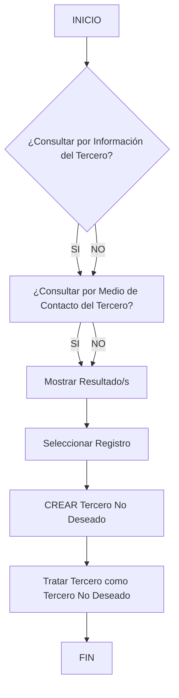

# Operação “Criar Tercero como Tercero No Deseado” — Documentação Reef

## 1. Metadados do Documento
- **Arquivo de Origem:** Não identificado no conteúdo fornecido
- **Tipo de Documento:** Procedimento
- **Domínio / Sistema:** Reef / Mapfre
- **Público-Alvo:** Negócio, operação e usuários responsáveis pelo tratamento de terceiros
- **Data/Versão Identificada:** Não identificada
- **Owner identificado:** `user:agonzalez_mapfre.com`
- **Lifecycle identificado:** Approved Source
- **Classificação identificada:** VL

---

## 2. Resumo Executivo & Contexto de Negócio

O documento descreve a operação **“Crear Tercero como Tercero no Deseado”**, destinada a registrar um terceiro como **Tercero No Deseado**. O registro é realizado conforme o **código de atividade** do terceiro e os **valores dos atributos** que compõem a sua atribuição.

O processo inclui uma etapa de consulta para localizar o terceiro antes de executar a criação do registro de terceiro não desejado. O conteúdo indica dois critérios de busca: consulta por **dados do terceiro** e consulta por **meio de contato do terceiro**.

Após a consulta, o processo prevê a exibição dos resultados, a seleção de um registro e a execução da ação **“CREAR Tercero No Deseado”**. O fluxo encerra após a criação.

O conteúdo fornecido não detalha campos obrigatórios, validações, regras de elegibilidade, persistência, permissões, contratos de integração, métodos HTTP, telas ou mensagens de erro relacionadas à operação.

---

## 3. Arquitetura, Componentes & Tecnologias Envolvidas

### Sistemas, portais e elementos citados

| Componente / Termo | Papel identificado no conteúdo |
| :--- | :--- |
| Reef | Contexto documental e sistema associado à operação. |
| Mapfre | Organização ou domínio corporativo indicado no conteúdo. |
| Mapfredocument | Termo exibido no cabeçalho ou navegação documental. |
| DOCUMENTACIÓN Reef | Área ou classificação da documentação. |
| Tercero | Entidade consultada e tratada no processo. |
| Tercero No Deseado | Classificação ou estado aplicado ao terceiro por meio da operação. |
| Código de atividade | Critério citado para o registro do terceiro como não desejado. |
| Atributos de atribuição | Valores considerados para registrar o terceiro como não desejado. |
| Dados do Tercero | Critério de busca disponível no processo. |
| Medio de Contacto del Tercero | Critério alternativo de busca disponível no processo. |

### Fluxo operacional extraído



> **Nota de Análise:** O diagrama reproduz os elementos de fluxo apresentados no conteúdo bruto. As condições exatas associadas aos ramos `SI` e `NO`, bem como a obrigatoriedade ou exclusividade entre os critérios de consulta, não são detalhadas no documento.

---

## 4. Regras de Negócio, Especificações Funcionais & Processos

### Objetivo funcional

A operação permite registrar um **Tercero** como **Tercero No Deseado**. Segundo o documento, o tratamento considera:

1. O **código de atividade** do terceiro.
2. Os **valores dos atributos** que conformam a atribuição do terceiro.

### Processo operacional identificado

1. Iniciar a operação.
2. Consultar informações do terceiro, quando aplicável.
3. Consultar o meio de contato do terceiro, quando aplicável.
4. Exibir os resultados da consulta.
5. Selecionar um registro.
6. Executar a ação **“CREAR Tercero No Deseado”**.
7. Tratar o terceiro como **Tercero No Deseado**.
8. Encerrar o processo.

### Critérios de busca listados

- **¿Consultar por Datos del Tercero?**
- **¿Consultar por Medio de Contacto del Tercero?**

### Limites de especificação identificados

- O documento não informa quais códigos de atividade tornam um terceiro não desejado.
- O documento não apresenta os atributos que compõem a atribuição.
- O documento não define os valores aceitos para os atributos.
- O documento não indica se os dois critérios de busca podem ser usados simultaneamente.
- O documento não descreve mensagens de confirmação, erro ou validação.
- O documento não detalha autorização, perfil de acesso ou trilha de auditoria.

---

## 5. Tabelas de Parâmetros, Ambientes e Estruturas de Dados

| Item / Parâmetro | Descrição / Função | Tipo / Valores / Formato | Ambiente / Observações |
| :--- | :--- | :--- | :--- |
| Tercero | Entidade tratada pela operação. | Não especificado. | Pode ser consultada e selecionada antes da criação. |
| Tercero No Deseado | Classificação aplicada ao terceiro. | Não especificado. | Criada pela ação `CREAR Tercero No Deseado`. |
| Código de atividade | Elemento considerado no registro do terceiro como não desejado. | Não especificado. | Não há catálogo ou regras de correspondência no documento. |
| Atributos de atribuição | Valores que conformam a atribuição do terceiro. | Não especificado. | Não são enumerados no conteúdo. |
| Dados do Tercero | Critério de consulta. | Não especificado. | Listado em “Criterios de Búsqueda”. |
| Medio de Contacto del Tercero | Critério de consulta. | Não especificado. | Listado em “Criterios de Búsqueda”. |
| Owner | Proprietário identificado da documentação. | `user:agonzalez_mapfre.com` | Exibido na área de documentação Reef. |
| Lifecycle | Estado do ciclo de vida documental. | `Approved Source` | Exibido na área de documentação Reef. |
| Classificação | Valor exibido junto à documentação. | `VL` | O documento não explica o significado de `VL`. |
| Idioma | Idioma exibido no portal documental. | `ES` | O conteúdo operacional está em espanhol. |

---

## 6. Bateria de Perguntas & Respostas para RAG (FAQ Sintético)

### P1: Qual é o objetivo da operação “Crear Tercero como Tercero no Deseado”?
**R:** A operação permite registrar um terceiro como **Tercero No Deseado**, considerando o código de atividade do terceiro e os valores dos atributos que conformam a sua atribuição.

### P2: Quais critérios de busca estão disponíveis para localizar um terceiro?
**R:** O documento lista dois critérios de busca: consulta por **Dados do Tercero** e consulta por **Medio de Contacto del Tercero**.

### P3: Qual é a ação que cria a classificação de terceiro não desejado?
**R:** A ação indicada no fluxo é **“CREAR Tercero No Deseado”**. Após selecionar um registro, essa ação trata o terceiro como **Tercero No Deseado**.

### P4: O processo exige a seleção de um registro antes da criação?
**R:** Sim. O fluxo apresentado indica a sequência “Mostrar Resultado/s”, “Seleccionar Registro” e, em seguida, “CREAR Tercero No Deseado”.

### P5: Quais informações são usadas para classificar um terceiro como não desejado?
**R:** O documento informa que o registro ocorre de acordo com o **código de atividade** e os **valores dos atributos** que conformam a atribuição do terceiro. Os atributos e seus valores não são detalhados.

### P6: O documento define quais códigos de atividade resultam em um terceiro não desejado?
**R:** Não. O conteúdo afirma que o código de atividade é considerado, mas não fornece uma lista de códigos, critérios de elegibilidade ou regras de decisão.

### P7: O documento detalha os campos ou o formato dos dados do terceiro?
**R:** Não. O documento cita a consulta por dados do terceiro, mas não enumera campos, formatos, obrigatoriedade ou regras de validação.

### P8: O documento informa se a busca por dados do terceiro e por meio de contato deve ser combinada?
**R:** Não. Ambos aparecem como critérios de busca, porém o documento não informa se são alternativos, cumulativos ou obrigatórios.

### P9: Quem é o proprietário identificado para a documentação?
**R:** O conteúdo identifica o owner como `user:agonzalez_mapfre.com`.

### P10: Qual é o estado de ciclo de vida identificado no conteúdo?
**R:** O campo **Lifecycle** está identificado como `Approved Source`.

---

## 7. Glossário de Termos, Siglas & Conceitos-Chave

- **Tercero:** Entidade consultada e tratada pela operação descrita.
- **Tercero No Deseado:** Classificação aplicada ao terceiro após a execução da ação de criação.
- **CREAR Tercero No Deseado:** Ação indicada para registrar e tratar o terceiro como não desejado.
- **Código de actividad:** Código de atividade do terceiro, citado como elemento considerado no registro.
- **Atributos:** Valores que conformam a atribuição do terceiro, segundo o documento.
- **Medio de Contacto:** Meio de contato do terceiro, usado como critério de busca.
- **Reef:** Contexto de documentação e sistema citado no conteúdo.
- **Mapfre:** Organização ou domínio corporativo citado no conteúdo.
- **Lifecycle:** Campo de ciclo de vida documental; o valor apresentado é `Approved Source`.
- **VL:** Valor exibido no documento sem definição disponível.
- **ES:** Identificador de idioma exibido; corresponde ao espanhol no contexto apresentado.

---

## 8. Notas Críticas, Riscos & Limitações

- O documento apresenta o processo em nível resumido e não fornece detalhamento técnico sobre implementação.
- Não há especificação dos códigos de atividade aceitos, rejeitados ou associados ao status de **Tercero No Deseado**.
- Não há detalhamento dos atributos que compõem a atribuição nem dos valores utilizados na classificação.
- Não há informações sobre perfis de acesso, permissões, autenticação ou segregação de funções.
- Não há endpoints, contratos JSON, métodos HTTP, integrações, bancos de dados, logs, ambientes, URLs ou procedimentos de recuperação.
- Não há regras explícitas para duplicidade, reversão da classificação, atualização de um terceiro já tratado ou tratamento de erro.
- **Nota de Análise:** O documento lista a operação e seus critérios de busca, mas não detalha os mecanismos técnicos ou funcionais necessários para implementar ou operar exceções do processo.

---

## 9. Conteúdo Bruto Estruturado (Referência Fiel)

```text
--- [PÁGINA 1 DE 1] ---

OPERACIÓN CREAR Tercero como Tercero no Deseado
¿En que consiste?
Esta operación permite registrar al Tercero como un Tercero No Deseado, de acuerdo con su código de actividad y de los valores de los
atributos que conforman su asignación.
Proceso
SI
NO
SI
NO
INICIO ¿Consultar por **Información**
del Tercero?
Consultar por **Medio
de Contacto** del Tercero?
Mostrar Resultado/s Seleccionar
Registro **CREAR** Tercero No Deseado
FIN
Criterios de Búsqueda
 ¿Consultar por Datos del Tercero? ( )
 ¿Consultar por Medio de Contacto del Tercero?( )
Tratar Tercero como Tercero No Deseado
 CREAR Tercero No Deseado ( )
Documentation / DOCUMENTACIÓN Reef
DOCUMENTACIÓN Reef
Mapfredocument
DOCUMENTACIÓN Reef
Owner
user:agonzalez_mapfre.com
Lifecycle
Approved Source
 / 
 VL
Buscar Inicio Soluciones Arquitecturas APIs Componentes Cloud Documentación Zeus Reef Ayuda
ES
```
