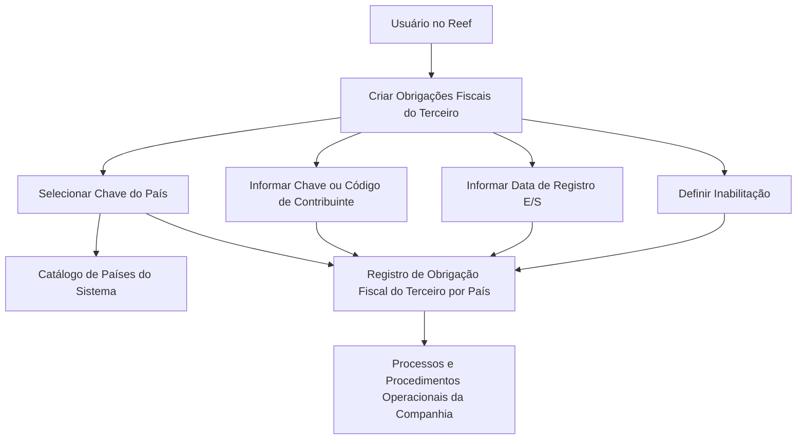
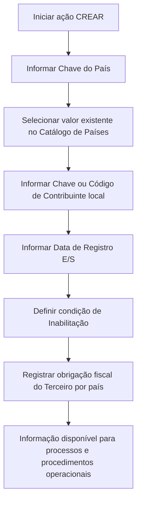

# Criação de Obrigações Fiscais do Terceiro — Bloco de Dados Reef

## 1. Metadados do Documento
- **Arquivo de Origem:** `Não identificado no conteúdo fornecido`
- **Tipo de Documento:** Manual Operacional
- **Domínio / Sistema:** Reef / Mapfre
- **Público-Alvo:** Operação, Negócio e usuários do sistema Reef
- **Data/Versão Identificada:** Não identificada
- **Owner identificado:** `user:agonzalez_mapfre.com`
- **Lifecycle identificado:** Approved Source / VL

---

## 2. Resumo Executivo & Contexto de Negócio

O documento descreve o bloco de dados **“CREAR Obligaciones Fiscales del Tercero”** do sistema Reef. O objetivo do bloco é identificar os países nos quais um Terceiro possui obrigações fiscais ou tributárias.

O registro dessas obrigações permite à Companhia considerar ou excluir o Terceiro de processos e procedimentos operacionais nos quais a situação tributária seja relevante. O documento não detalha quais processos operacionais utilizam essa informação.

A ação disponível no bloco de dados é **CREAR**, associada à criação de obrigações fiscais. A captura da informação possui uma sequência de atributos indicada como leitura da esquerda para a direita e de cima para baixo.

Os atributos descritos são: chave do país, chave ou código de contribuinte, data de registro de entrada ou saída e inabilitação. O documento estabelece que um país pode ser registrado como tendo obrigações fiscais e ser marcado como inabilitado no mesmo processo.

---

## 3. Arquitetura, Componentes & Tecnologias Envolvidas

Os elementos explicitamente citados são:

| Componente / Elemento | Papel identificado |
| :--- | :--- |
| Reef | Sistema ou contexto documental no qual o bloco de dados é apresentado. |
| Bloco de Dados “CREAR Obligaciones Fiscales del Tercero” | Funcionalidade para registrar obrigações fiscais ou tributárias de um Terceiro por país. |
| Terceiro | Entidade para a qual são identificadas obrigações tributárias locais. |
| Catálogo de países do Sistema | Relação de valores utilizada para a chave do país. |
| Companhia | Organização que utiliza a informação tributária do Terceiro em processos e procedimentos operacionais. |
| Mapfre | Nome presente no conteúdo documental. |
| Mapfredocument | Nome presente no conteúdo documental. |
| Zeus | Item presente no menu de navegação documental; sem detalhamento funcional. |
| APIs | Item presente no menu de navegação documental; sem detalhamento de interfaces. |
| Cloud | Item presente no menu de navegação documental; sem detalhamento técnico. |



**Nota de Análise:** O documento não detalha arquitetura de software, integrações, APIs, persistência de dados, métodos HTTP, contratos JSON, tecnologias de implementação ou ambientes.

---

## 4. Regras de Negócio, Especificações Funcionais & Processos

### Objetivo funcional

O bloco de dados deve identificar os países nos quais o Terceiro possui obrigações fiscais ou tributárias. Essa identificação permite que a Companhia considere ou exclua o Terceiro de processos e procedimentos operacionais que precisem levar em conta sua condição tributária.

### Ação disponível

- **CREAR:** ação indicada para criar obrigações fiscais.

### Sequência de captura

O documento determina que os atributos devem seguir uma sequência de captura apresentada visualmente **da esquerda para a direita e de cima para baixo**. A ordem textual identificada é:

1. Chave do país.
2. Chave ou código de contribuinte.
3. Data de registro E/S.
4. Inabilitação.

### Regras por atributo

1. **Chave do País**
   - Contém o código do primeiro nível da estrutura geográfica: países.
   - Identifica o país no qual o Terceiro é considerado obrigado tributário.
   - Deve estar de acordo com os valores disponíveis no catálogo de países existente no sistema.

2. **Chave/Código de Contribuinte**
   - Identifica a chave ou o código do Terceiro como contribuinte local.
   - O código está relacionado ao país no qual o Terceiro aparece como obrigado tributário.

3. **Data de Registro E/S**
   - Contém a data de entrada ou a data de saída do Terceiro no status de obrigação tributária.
   - O documento utiliza a abreviação **E/S**, associando-a explicitamente a “Entrada ou Saída”.

4. **Inabilitação**
   - Estabelece se o Terceiro deixou de ser obrigado tributário no país correspondente.
   - É permitido registrar um país no qual o Terceiro tenha obrigações fiscais e, simultaneamente, marcar esse país como inabilitado no mesmo processo.

### Fluxo funcional reconstruído



**Nota de Análise:** O conteúdo não especifica obrigatoriedade de campos, formatos de data, regras de validação, comportamento de edição/exclusão, mensagens de erro, permissões de acesso ou efeitos específicos da inabilitação nos processos operacionais.

---

## 5. Tabelas de Parâmetros, Ambientes e Estruturas de Dados

| Item / Parâmetro | Descrição / Função | Tipo / Valores / Formato | Ambiente / Observações |
| :--- | :--- | :--- | :--- |
| CREAR | Ação disponível para criar obrigações fiscais. | Ação funcional. | Não há detalhamento sobre permissões ou resultado técnico da ação. |
| Obrigações Fiscais | Informação referente às obrigações fiscais ou tributárias do Terceiro. | Bloco de dados / registro funcional. | Associada a países em que o Terceiro é obrigado tributário. |
| Chave do País | Código do primeiro nível da estrutura geográfica, correspondente a países. | Código de país; valores do catálogo de países do sistema. | Identifica o país em que o Terceiro está identificado como obrigado tributário. |
| Catálogo de Países | Relação de possíveis valores para a Chave do País. | Catálogo existente no sistema. | O documento não informa códigos, quantidade de países ou padrão de codificação. |
| Chave/Código de Contribuinte | Chave ou código do Terceiro como contribuinte local. | Código não especificado. | Relacionado ao país no qual o Terceiro consta como obrigado tributário. |
| Data de Registro E/S | Data de entrada ou saída do Terceiro no status de obrigação tributária. | Data; formato não informado. | “E/S” corresponde a Entrada ou Saída. |
| Inabilitação | Indica se o Terceiro deixou de ser obrigado tributário no país em questão. | Indicador; valores não informados. | Pode ser marcada no mesmo processo em que o país é registrado com obrigações fiscais. |
| Terceiro | Entidade cujas obrigações fiscais ou tributárias são registradas. | Entidade de negócio. | O documento não informa estrutura cadastral ou identificador técnico. |
| Reef | Sistema ou área documental referenciada. | Sistema / contexto documental. | O conteúdo menciona “DOCUMENTACIÓN Reef”. |
| Owner | Responsável identificado no documento. | `user:agonzalez_mapfre.com` | Valor literal apresentado no conteúdo. |
| Lifecycle | Estado documental informado. | `Approved Source / VL` | Não há explicação do significado de “VL”. |

---

## 6. Bateria de Perguntas & Respostas para RAG (FAQ Sintético)

### P1: Qual é o objetivo do bloco de dados “CREAR Obligaciones Fiscales del Tercero”?
**R:** O objetivo do bloco é identificar os países nos quais um Terceiro possui obrigações fiscais ou tributárias. Essa informação permite à Companhia considerar ou excluir o Terceiro de processos e procedimentos operacionais nos quais a situação tributária precisa ser considerada.

### P2: Qual ação está disponível para registrar obrigações fiscais do Terceiro?
**R:** A ação explicitamente indicada no documento é **CREAR**, associada à criação de obrigações fiscais.

### P3: O que representa a Chave do País no registro de obrigações fiscais?
**R:** A Chave do País contém o código do primeiro nível da estrutura geográfica, correspondente a países. Ela identifica o país em que o Terceiro está identificado como obrigado tributário e deve utilizar valores existentes no catálogo de países do sistema.

### P4: De onde devem vir os valores da Chave do País?
**R:** Os valores da Chave do País devem estar de acordo com a relação de possíveis valores existente no catálogo de países do sistema.

### P5: Para que serve a Chave ou Código de Contribuinte?
**R:** A Chave ou Código de Contribuinte permite identificar a chave ou o código do Terceiro como contribuinte local no país em que o Terceiro aparece como obrigado tributário.

### P6: O que significa o campo Data de Registro E/S?
**R:** O campo Data de Registro E/S contém a data de entrada ou a data de saída do Terceiro com o status de obrigação tributária. O documento não informa o formato da data nem como distinguir tecnicamente entrada de saída.

### P7: Qual é a finalidade do campo Inabilitação?
**R:** O campo Inabilitação estabelece se o Terceiro deixou de ser obrigado tributário no país em questão.

### P8: É permitido registrar uma obrigação fiscal e marcar o país como inabilitado no mesmo processo?
**R:** Sim. O documento afirma que é possível registrar um país no qual o Terceiro tenha obrigações fiscais e, ao mesmo tempo, marcá-lo como inabilitado no mesmo processo.

### P9: Em que ordem os atributos devem ser capturados?
**R:** O documento informa que os atributos seguem a sequência apresentada da esquerda para a direita e de cima para baixo. Na transcrição textual, a ordem é: Chave do País, Chave/Código de Contribuinte, Data de Registro E/S e Inabilitação.

### P10: O documento descreve APIs, métodos HTTP ou contratos JSON para a criação de obrigações fiscais?
**R:** Não. Embora “APIs” apareça no menu de navegação do conteúdo, o documento não detalha APIs, métodos HTTP, endpoints, contratos JSON, integrações ou mecanismos técnicos de persistência.

---

## 7. Glossário de Termos, Siglas & Conceitos-Chave

- **CREAR:** Ação indicada para criar obrigações fiscais.
- **Data de Registro E/S:** Campo que contém data de entrada ou saída do Terceiro no status de obrigação tributária.
- **E/S:** Entrada ou Saída.
- **Inabilitação:** Condição que estabelece se o Terceiro deixou de ser obrigado tributário no país em questão.
- **Obrigação Fiscal / Tributária:** Situação do Terceiro como obrigado tributário em um país.
- **Reef:** Sistema ou contexto documental mencionado no conteúdo.
- **Terceiro:** Entidade cujo vínculo de obrigação tributária por país é registrado.
- **VL:** Sigla exibida em “Approved Source / VL”; significado não detalhado no documento.

---

## 8. Notas Críticas, Riscos & Limitações

- O documento não informa o nome do arquivo de origem, data, versão, autor documental completo ou histórico de alterações.
- O documento não detalha se os campos são obrigatórios, opcionais, condicionais ou validados entre si.
- Não são informados formatos de dados para chave do país, código de contribuinte ou data de registro E/S.
- Não há definição dos valores possíveis para Inabilitação, como verdadeiro/falso, ativo/inativo ou outro padrão.
- O documento permite registrar uma obrigação fiscal e marcar o mesmo país como inabilitado no mesmo processo, mas não explica o efeito operacional ou de negócio dessa combinação.
- Não há lista de processos e procedimentos operacionais da Companhia que consomem a informação de obrigação tributária.
- Não são descritas integrações, APIs, permissões, auditoria, logs, tratamento de erros, persistência ou ambientes técnicos.
- **Nota de Análise:** O conteúdo é predominantemente funcional e resumido; detalhes técnicos adicionais não foram apresentados.

---

## 9. Conteúdo Bruto Estruturado (Referência Fiel)

```text
--- [PÁGINA 1 DE 1] ---

CREAR Obligaciones Fiscales del Tercero
Objetivo
El propósito de este Bloque de Datos es identicar los Países en los que el Tercero tiene Obligaciones Fiscales o Tributarias, lo que permite a
la Compañía contemplar o excluir al Tercero de aquellos procesos y procedimientos operativos en los que dicha situación deba ser
considerada.
Posibles Acciones
 CREAR ( )
Obligaciones Fiscales.
De izquierda a derecha y de arriba hacia abajo, los siguientes atributos marcan la secuencia de captura de la información.
Clave del País (  )
Este Campo contiene el código del primer nivel de la estructura Geográca (países) en el que el Tercero está identicado como obligado
tributario, de acuerdo con la relación de posibles valores existentes en el catálogo de países existente en el Sistema.
Clave/Código de Contribuyente ( )
Este Dato permite identicar la clave o el código del Tercero como Contribuyente local en el País en el que aparece como obligado tributario.
Fecha de Registro E/S ( )
Este Campo contiene la Fecha de Entrada o de Salida del Tercero con el status de Obligación Tributaria.
Inhabilitación ( )
Este campo establece si el Tercero ha dejado de ser Obligado Tributario en el País en cuestión.
Es posible Registrar un país en el que el Tercero tenga Obligaciones Fiscales y su vez marcarlo como Inhabilitada en el mismo proceso.
Documentation / DOCUMENTACIÓN Reef
DOCUMENTACIÓN Reef
Mapfredocument
DOCUMENTACIÓN Reef
Owner
user:agonzalez_mapfre.com
Lifecycle
Approved Source
 / 
 VL
Buscar Inicio Soluciones Arquitecturas APIs Componentes Cloud Documentación Zeus Reef Ayuda
ES
```
