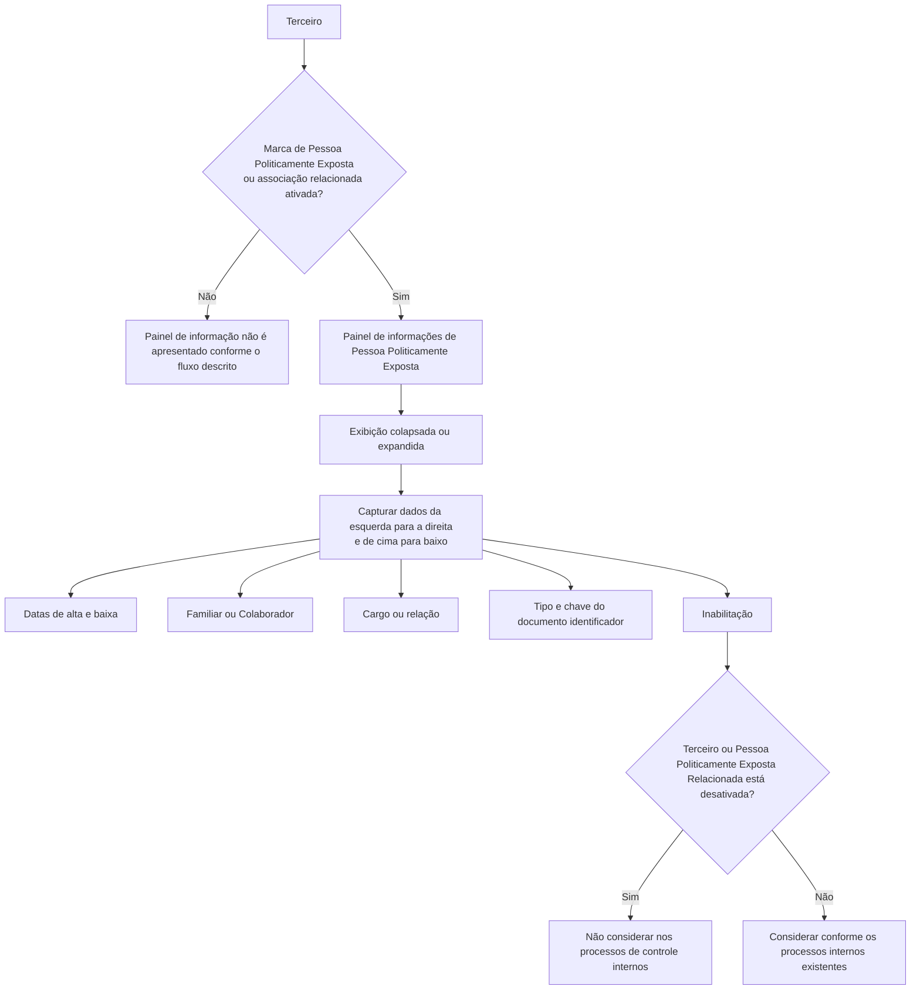

# Criação de Pessoa Politicamente Exposta e Relacionamentos Familiares ou de Colaboração

## 1. Metadados do Documento
- **Arquivo de Origem:** `Não identificado no conteúdo fornecido`
- **Tipo de Documento:** Manual Operacional / Especificação Funcional
- **Domínio / Sistema:** DOCUMENTACIÓN Reef / Mapfredocument
- **Público-Alvo:** Operação, Negócio, Analistas Funcionais e Desenvolvedores
- **Data/Versão Identificada:** Não identificada
- **Owner identificado:** `user:agonzalez_mapfre.com`
- **Lifecycle identificado:** `Approved Source`

---

## 2. Resumo Executivo & Contexto de Negócio

O documento descreve o bloco de informação utilizado para identificar um Terceiro como Pessoa Politicamente Exposta ou para associar o Terceiro a um Familiar ou Colaborador que possua essa condição. O objetivo declarado é permitir que a companhia inclua ou exclua o Terceiro de processos e procedimentos relacionados ao cumprimento de normativas vigentes sobre delitos financeiros.

A ação funcional indicada é **CREAR**. Quando a marca sistêmica que identifica o Terceiro como Pessoa Politicamente Exposta — ou que indica a existência de uma Pessoa Politicamente Exposta associada — está ativada, o sistema apresenta o painel de informações correspondente.

O painel de informações pode ser exibido de modo colapsado ou expandido. A sequência de preenchimento dos dados deve seguir a orientação visual descrita no documento: da esquerda para a direita e de cima para baixo.

A especificação detalha dados de vigência da condição de Pessoa Politicamente Exposta, a classificação do relacionamento como Familiar ou Colaborador, o cargo ou relação aplicável e os dados documentais da Pessoa Politicamente Exposta Relacionada. Também define a propriedade de Inabilitação, que impede a consideração do Terceiro ou da Pessoa Politicamente Exposta Relacionada nos controles internos da entidade.

---

## 3. Arquitetura, Componentes & Tecnologias Envolvidas

O conteúdo não apresenta arquitetura técnica de software, tecnologias, APIs, métodos HTTP, contratos JSON, servidores ou integrações entre microsserviços. O fluxo funcional identificável envolve o cadastro de informações de Pessoa Politicamente Exposta no sistema e sua utilização pelos processos internos de controle.

Componentes funcionais citados:

- **Terceiro:** entidade avaliada ou relacionada a uma Pessoa Politicamente Exposta.
- **Marca de identificação no sistema:** condição que habilita a apresentação do painel de informações.
- **Painel de informação de Pessoa Politicamente Exposta:** área exibida de forma colapsada ou expandida.
- **Catálogo de Cargos:** fonte dos valores possíveis para o campo de cargo ou relação.
- **Processos de controle internos:** processos da entidade que devem considerar ou desconsiderar o Terceiro ou a Pessoa Politicamente Exposta Relacionada.
- **DOCUMENTACIÓN Reef / Mapfredocument:** contexto documental identificado no conteúdo bruto.



> **Nota de Análise:** O documento não detalha a implementação técnica da marca sistêmica, os valores permitidos para Familiar/Colaborador, os valores do catálogo de Cargos, as regras de obrigatoriedade dos campos ou os processos internos específicos de controle.

---

## 4. Regras de Negócio, Especificações Funcionais & Processos

1. O bloco de informação tem como propósito identificar o Terceiro como Pessoa Politicamente Exposta ou relacionar o Terceiro a algum Familiar ou Colaborador que tenha essa condição.

2. A identificação permite à companhia incluir ou excluir o Terceiro de processos e procedimentos da entidade relacionados ao cumprimento das normativas vigentes em matéria de delitos financeiros.

3. A ação possível explicitamente apresentada é **CREAR**.

4. O painel de informação correspondente deve aparecer quando estiver ativada a marca que identifica no sistema que:
   - o Terceiro é uma Pessoa Politicamente Exposta; ou
   - o Terceiro possui associada uma Pessoa Politicamente Exposta.

5. O painel pode ser apresentado de forma:
   - colapsada; ou
   - expandida.

6. A captura dos campos deve seguir a sequência visual indicada:
   - da esquerda para a direita;
   - de cima para baixo.

7. A **Data de Alta como Pessoa Politicamente Exposta** contém a data de alta:
   - do Terceiro como Pessoa Politicamente Exposta; ou
   - do Familiar ou Colaborador relacionado ao Terceiro como Pessoa Politicamente Exposta.

8. A **Data de Baja como Pessoa Politicamente Exposta** contém a data em que:
   - o Terceiro deixa de ser Pessoa Politicamente Exposta; ou
   - a Pessoa Politicamente Exposta Relacionada deixa de ter essa condição.

9. O atributo **Familiar / Colaborador** identifica se a Pessoa Politicamente Exposta Relacionada é:
   - Familiar do Terceiro; ou
   - Colaborador do Terceiro.

10. O campo **Cargo o Relación con la Persona Políticamente Expuesta** identifica a relação ou o cargo:
    - do Terceiro; ou
    - da Pessoa Politicamente Exposta relacionada;
    
    conforme os valores possíveis do catálogo de Cargos existente no sistema.

11. O **Tipo Documento Identificador de la Persona Políticamente Expuesta Relacionada** contém o tipo de documento do Familiar ou Colaborador relacionado ao Terceiro.

12. A **Clave del Documento Identificador de la Persona Políticamente Relacionada** contém a chave do documento identificador do Familiar ou Colaborador relacionado ao Terceiro.

13. A propriedade **Inhabilitación** informa ao sistema que:
    - o Terceiro está desativado; ou
    - a Pessoa Politicamente Exposta Relacionada ao Terceiro está desativada.

14. Quando a propriedade de Inabilitação indicar desativação, o Terceiro ou a Pessoa Politicamente Exposta Relacionada não deve ser considerado nos processos de controle internos existentes na entidade.

---

## 5. Tabelas de Parâmetros, Ambientes e Estruturas de Dados

| Item / Parâmetro | Descrição / Função | Tipo / Valores / Formato | Ambiente / Observações |
| :--- | :--- | :--- | :--- |
| Ação possível | Ação indicada para o bloco de informação. | `CREAR` | Nenhuma outra ação é detalhada. |
| Marca de identificação | Habilita a apresentação do painel quando identifica que o Terceiro é Pessoa Politicamente Exposta ou possui uma Pessoa Politicamente Exposta associada. | Marca sistêmica; valores não detalhados. | O mecanismo técnico da marca não é descrito. |
| Painel de informação | Área para apresentação e captura de dados de Pessoa Politicamente Exposta. | Colapsado ou expandido. | Aparece quando a marca de identificação está ativada. |
| Ordem de captura | Define a sequência visual de preenchimento dos campos. | Esquerda para direita; cima para baixo. | Regra explicitamente descrita. |
| Fecha de Alta como Persona Políticamente Expuesta | Data de alta do Terceiro ou do Familiar/Colaborador relacionado como Pessoa Politicamente Exposta. | Data; formato não informado. | Aplica-se ao Terceiro ou à pessoa relacionada. |
| Fecha de Baja como Persona Políticamente Expuesta | Data de baixa da condição de Pessoa Politicamente Exposta do Terceiro ou da pessoa relacionada. | Data; formato não informado. | O documento usa o termo “Baja”. |
| Familiar / Colaborador | Identifica a natureza do vínculo da Pessoa Politicamente Exposta Relacionada com o Terceiro. | `Familiar` ou `Colaborador` | Não há detalhamento de valores adicionais. |
| Cargo o Relación con la Persona Políticamente Expuesta | Identifica cargo ou relação do Terceiro ou da Pessoa Politicamente Exposta relacionada. | Valores do catálogo de Cargos existente no sistema. | O catálogo e seus valores não são apresentados. |
| Tipo Documento Identificador de la Persona Políticamente Expuesta Relacionada | Contém o tipo do documento do Familiar ou Colaborador relacionado ao Terceiro. | Tipo de documento; valores não informados. | O documento o descreve como dado do colapsador. |
| Clave del Documento Identificador de la Persona Políticamente Relacionada | Contém a chave do documento identificador do Familiar ou Colaborador relacionado ao Terceiro. | Chave de documento; formato não informado. | Não há regra de validação descrita. |
| Inhabilitación | Indica que o Terceiro ou a Pessoa Politicamente Exposta Relacionada está desativada. | Propriedade; valores não detalhados. | Impede a consideração nos processos de controle internos. |
| Owner | Proprietário identificado na documentação. | `user:agonzalez_mapfre.com` | Extraído do rodapé/contexto documental. |
| Lifecycle | Estado identificado na documentação. | `Approved Source` | Significado operacional não detalhado. |

---

## 6. Bateria de Perguntas & Respostas para RAG (FAQ Sintético)

### P1: Qual é o objetivo do bloco de informação de Pessoa Politicamente Exposta?
**R:** O bloco de informação tem o objetivo de identificar o Terceiro como Pessoa Politicamente Exposta ou de relacionar o Terceiro a um Familiar ou Colaborador que tenha essa condição. Essa identificação permite incluir ou excluir o Terceiro dos processos e procedimentos relacionados ao cumprimento das normativas vigentes sobre delitos financeiros.

### P2: Quando o painel de informações de Pessoa Politicamente Exposta deve aparecer?
**R:** O painel deve aparecer quando a marca ativada no sistema identificar que o Terceiro é Pessoa Politicamente Exposta ou que o Terceiro possui associada uma Pessoa Politicamente Exposta.

### P3: Como o painel de informações de Pessoa Politicamente Exposta pode ser exibido?
**R:** O documento informa que o painel de informação correspondente pode ser exibido de maneira colapsada ou de maneira expandida.

### P4: Qual é a sequência de preenchimento dos campos no painel?
**R:** Os campos devem ser capturados da esquerda para a direita e de cima para baixo, conforme a sequência visual descrita no documento.

### P5: O que deve ser registrado na data de alta como Pessoa Politicamente Exposta?
**R:** A data de alta deve conter a data em que o Terceiro se torna Pessoa Politicamente Exposta ou a data em que o Familiar ou Colaborador relacionado ao Terceiro se torna Pessoa Politicamente Exposta.

### P6: O que representa a data de baixa como Pessoa Politicamente Exposta?
**R:** A data de baixa contém a data em que o Terceiro ou a Pessoa Politicamente Exposta Relacionada deixa de ter a condição de Pessoa Politicamente Exposta.

### P7: Para que serve o atributo Familiar / Colaborador?
**R:** O atributo Familiar / Colaborador permite identificar se a Pessoa Politicamente Exposta Relacionada é um Familiar ou um Colaborador do Terceiro.

### P8: De onde vêm os valores do campo Cargo ou Relação com a Pessoa Politicamente Exposta?
**R:** O campo identifica o cargo ou a relação do Terceiro ou da Pessoa Politicamente Exposta relacionada de acordo com os possíveis valores do catálogo de Cargos existente no sistema. O documento não apresenta esse catálogo.

### P9: Quais dados documentais devem ser registrados para um Familiar ou Colaborador relacionado?
**R:** Devem ser registrados o tipo do documento identificador do Familiar ou Colaborador relacionado ao Terceiro e a chave do documento identificador dessa pessoa relacionada. O documento não especifica os formatos ou os valores permitidos.

### P10: Qual é o efeito da propriedade Inhabilitación?
**R:** A propriedade Inhabilitación indica ao sistema que o Terceiro ou a Pessoa Politicamente Exposta Relacionada ao Terceiro está desativada. Nessa situação, a pessoa indicada não deve ser considerada nos processos de controle internos existentes na entidade.

### P11: Quais ações funcionais o documento apresenta para o bloco de informação?
**R:** O documento apresenta explicitamente a ação **CREAR**. Não há detalhamento de ações de edição, consulta, exclusão ou aprovação.

### P12: O documento descreve APIs, métodos HTTP ou contratos de integração para este cadastro?
**R:** Não. O conteúdo fornecido descreve o objetivo funcional, as condições de exibição do painel e os campos de captura, mas não detalha APIs, métodos HTTP, contratos JSON, serviços ou integrações técnicas.

---

## 7. Glossário de Termos, Siglas & Conceitos-Chave

- **Terceiro:** entidade que pode ser identificada como Pessoa Politicamente Exposta ou associada a um Familiar ou Colaborador com essa condição.
- **Pessoa Politicamente Exposta:** condição atribuída ao Terceiro ou a uma pessoa relacionada, tratada pelo bloco de informação.
- **Pessoa Politicamente Exposta Relacionada:** Familiar ou Colaborador relacionado ao Terceiro que possui a condição de Pessoa Politicamente Exposta.
- **Familiar / Colaborador:** atributo que identifica se a Pessoa Politicamente Exposta Relacionada possui vínculo familiar ou de colaboração com o Terceiro.
- **Catálogo de Cargos:** catálogo existente no sistema que fornece os possíveis valores para o campo de cargo ou relação.
- **Inhabilitación:** propriedade que indica a desativação do Terceiro ou da Pessoa Politicamente Exposta Relacionada, impedindo sua consideração nos processos de controle internos.
- **Colapsador:** termo usado no documento para a área colapsável que contém dados, incluindo o tipo de documento identificador.
- **DOCUMENTACIÓN Reef:** identificação exibida no conteúdo documental.
- **Mapfredocument:** identificação exibida no conteúdo documental.
- **Lifecycle:** campo documental identificado com o valor `Approved Source`.

---

## 8. Notas Críticas, Riscos & Limitações

- O conteúdo não identifica o nome do arquivo de origem, a data, a versão ou a autoria completa do documento.
- Não são detalhados os valores aceitos pela marca de identificação de Pessoa Politicamente Exposta.
- O documento não informa quais campos são obrigatórios, condicionais ou opcionais.
- Não são apresentados formatos, máscaras, regras de validação ou restrições para datas, tipos documentais e chaves de documentos.
- O catálogo de Cargos é referenciado, mas seus valores não são incluídos.
- Não são detalhados os processos de controle internos que utilizam a identificação ou a Inhabilitación.
- Não há descrição de permissões, perfis de acesso, trilha de auditoria, regras de aprovação ou histórico de alterações.
- O documento não apresenta arquitetura técnica, APIs, integrações, rotas, URLs, ambientes, servidores, logs ou contratos de dados.
- **Nota de Análise:** O conteúdo descreve a ação `CREAR`, mas não detalha métodos de persistência, edição, exclusão ou consulta do registro.

---

## 9. Conteúdo Bruto Estruturado (Referência Fiel)

```text
--- [PÁGINA 1 DE 2] ---

CREAR Persona Políticamente Expuesta
Objetivo
El propósito de este Bloque de Información es identicar al Tercero como Persona Políticamente Expuesta o relacionarlo con algún Familiar
o estrecho Colaborador que tenga dicha condición, lo que permite a la compañía incluir o excluir al Tercero de aquellos procesos y
procedimientos de la entidad relacionados con el cumplimiento de las normativas vigentes en materia de delitos nancieros.
Posibles Acciones
 CREAR ( )
Datos Persona Políticamente Expuesta
Siempre y cuando se haya activado la marca que identica en el sistema que el Tercero es o tiene asociada una persona políticamente
expuesta aparecerá el panel de información correspondiente de manera colapsada...
... o de manera extendida
De izquierda a derecha y de arriba hacia abajo, los siguientes campos marcan la secuencia de captura de la Información.
Fecha de Alta como Persona Políticamente Expuesta ( )
Este Dato contendrá la fecha de Alta del Tercero como Persona Políticamente Expuesta o del Familiar o Colaborador como Persona
Políticamente Expuesta relacionada con el Tercero.
Fecha de Baja como Persona Políticamente Expuesta ( )
Este Dato contendrá la fecha en la que el Tercero o la Persona Políticamente Expuesta Relacionada causan baja como Personas
Políticamente Expuestas.
Familiar / Colaborador ( )
Documentation / DOCUMENTACIÓN Reef
DOCUMENTACIÓN Reef
Mapfredocument
DOCUMENTACIÓN Reef
Owner
user:agonzalez_mapfre.com
Lifecycle
Approved Source
 /
 VL
Buscar Inicio Soluciones Arquitecturas APIs Componentes Cloud Documentación Zeus Reef Ayuda
ES


--- [PÁGINA 2 DE 2] ---

Este Atributo permite identicar si la Persona Políticamente Expuesta Relacionada es un Familiar o un Colaborador del Tercero.
Cargo o Relación con la Persona Políticamente Expuesta (  )
Este Campo identica la relación o el Cargo del Tercero o de la Persona Políticamente Expuesta relacionada, de acuerdo con los posibles
valores del catálogo de Cargos existente en el Sistema.
Tipo Documento Identicador de la Persona Políticamente Expuesta Relacionada (  )
Este Dato del colapsador contiene el tipo de documento del Familiar o Colaborador Relacionado con el Tercero.
Clave del Documento Identicador de la Persona Políticamente Relacionada ( )
Este Campo contiene la clave del documento Identicador del Familiar o Colaborador Relacionado con el Tercero.
Inhabilitación ( )
Esta propiedad le indica al Sistema que o bien el Tercero o la Personas Políticamente Expuesta Relacionada con el Tercero está desactivada y
por ende no debiera considerarse en los procesos de control internos existentes en la entidad.
```
