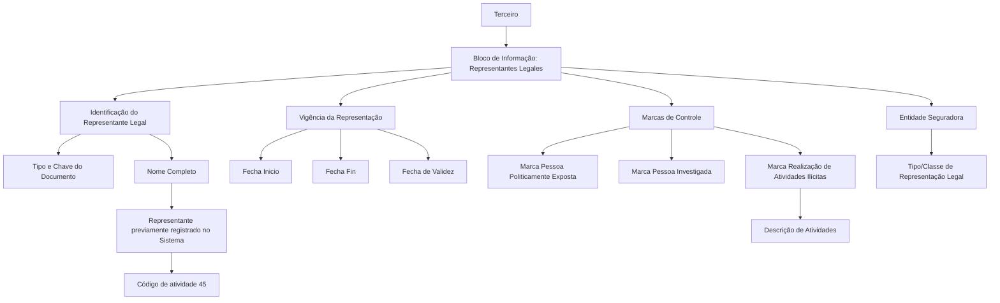

# Criação de Representantes Legais do Terceiro — Documentação Reef

## 1. Metadados do Documento
- **Arquivo de Origem:** Não identificado no conteúdo extraído
- **Tipo de Documento:** Especificação Funcional
- **Domínio / Sistema:** Reef / Mapfre
- **Público-Alvo:** Desenvolvedores, Analistas Funcionais, Operação e Negócio
- **Data/Versão Identificada:** Não identificada

---

## 2. Resumo Executivo & Contexto de Negócio

O documento descreve o bloco de informação **“Crear Representantes Legales del Tercero”**, destinado a registrar e identificar representantes legais associados a um Terceiro no sistema Reef. A representação legal é apresentada como a faculdade concedida por lei a uma pessoa para agir em nome de outra, fazendo recair sobre esta última os efeitos dos atos praticados.

O objetivo funcional do bloco é identificar um ou mais representantes legais de um Terceiro. A documentação informa que a captura dos atributos deve seguir a ordem visual definida de esquerda para direita e de cima para baixo.

Os campos descritos podem ser utilizados tanto no registro de informações de **Personas Físicas** quanto de **Personas Jurídicas**, exceto quando houver indicação expressa em contrário. O representante legal deve estar previamente registrado no sistema e identificado com o código de atividade **45**.

Além da identificação documental e da vigência da representação, o bloco contempla marcas de controle para Pessoa Politicamente Exposta, Pessoa Investigada e realização de atividades ilícitas. Essas marcas permitem que a entidade seguradora gerencie tais circunstâncias em seus processos internos.

---

## 3. Arquitetura, Componentes & Tecnologias Envolvidas

O conteúdo extraído menciona os seguintes elementos:

- **Reef:** sistema ou domínio da documentação.
- **Mapfre:** contexto corporativo indicado pela referência `Mapfredocument` e pelo proprietário `agonzalez_mapfre.com`.
- **Bloco de Informação “Representantes Legales”:** componente funcional para cadastro de representantes legais do Terceiro.
- **Sistema:** repositório onde o representante legal precisa estar previamente registrado.
- **Entidade seguradora:** organização que define localmente a codificação da classe ou tipologia de representação legal e utiliza as informações em processos internos.
- **Código de atividade 45:** identificação exigida para o representante legal previamente cadastrado.

Não há detalhes sobre APIs, bancos de dados, microsserviços, protocolos, contratos JSON, métodos HTTP, ambientes técnicos ou mecanismos de persistência.



---

## 4. Regras de Negócio, Especificações Funcionais & Processos

1. O bloco funcional tem como propósito identificar um ou mais representantes legais do Terceiro.
2. A representação legal é definida como a faculdade atribuída pela Lei a uma pessoa para agir em nome de outra, recaindo sobre esta última os efeitos desses atos.
3. O exercício da representação legal pode ser obrigatório para o representante.
4. A ação indicada no conteúdo é **CREAR**.
5. A sequência de captura das informações deve seguir a disposição dos atributos de esquerda para direita e de cima para baixo.
6. Quando os campos não forem expressamente especificados ou indicados, devem ser utilizados indistintamente para o registro de informações de Pessoas Físicas e Pessoas Jurídicas.
7. O atributo **Tipo Documento Representante Legal** deve conter o tipo de documento usado para identificar o representante legal, conforme os tipos de documentos existentes no sistema.
8. O atributo **Clave del Documento** deve conter a chave do documento do representante legal do Terceiro.
9. O campo **Nombre Completo** deve apresentar o nome completo do representante legal do Terceiro.
10. O representante legal deve estar previamente registrado no Sistema.
11. O representante legal deve estar identificado com o código de atividade **45**.
12. O atributo **Tipo/Clase de Representación Legal** deve conter a classe ou tipologia de representação legal associada à pessoa.
13. A codificação da classe ou tipologia de representação legal é definida localmente pela entidade seguradora.
14. A informação da classe ou tipologia de representação legal pode ser usada e explorada nos processos internos da entidade seguradora.
15. O campo **Fecha Inicio** indica a data de alta da pessoa como representante legal.
16. O atributo **Fecha Fin** indica a data de baixa na qual a pessoa deixa de exercer a função de representante legal do Terceiro.
17. A propriedade **Fecha de Validez** indica a data a partir da qual a pessoa passa a vigorar como representante legal do Terceiro.
18. A **Marca Persona Políticamente Expuesta** identifica o representante legal como Pessoa Politicamente Exposta.
19. A marca de Pessoa Politicamente Exposta permite à entidade seguradora controlar e gerenciar essa circunstância em seus processos internos.
20. A propriedade **Inhabilitación** estabelece se o status do representante legal permanece vigente ou se o representante está inabilitado para exercer essa função.
21. A **Marca Persona Investigada** identifica o representante legal como Pessoa Investigada.
22. A marca de Pessoa Investigada permite à entidade seguradora controlar e gerenciar essa circunstância em seus processos internos.
23. A **Marca Realización Actividades Ilícitas** identifica o representante legal como pessoa que realizou algum tipo de atividade ilícita.
24. A marca de realização de atividades ilícitas permite à entidade seguradora controlar e gerenciar essa circunstância em seus processos internos.
25. O atributo **Descripción de Actividades** só pode registrar texto explicativo quando a marca de realização de atividades ilícitas estiver ativada.

---

## 5. Tabelas de Parâmetros, Ambientes e Estruturas de Dados

| Item / Parâmetro | Descrição / Função | Tipo / Valores / Formato | Ambiente / Observações |
| :--- | :--- | :--- | :--- |
| Ação | Ação disponível para o bloco de informação. | `CREAR` | O documento apresenta a ação como `CREAR ( )`. |
| Tipo Documento Representante Legal | Define o tipo de documento utilizado para identificar o representante legal. | Tipos de documentos existentes no Sistema | Não são listados tipos específicos de documentos. |
| Clave del Documento | Armazena a chave do documento do representante legal do Terceiro. | Não especificado | Não são detalhadas regras de formato ou validação. |
| Nombre Completo | Mostra o nome completo do representante legal do Terceiro. | Não especificado | O representante deve estar previamente registrado no Sistema e identificado com código de atividade 45. |
| Código de atividade | Código associado ao representante legal previamente registrado. | `45` | Obrigatório conforme o texto extraído. |
| Tipo/Clase de Representación Legal | Define a classe ou tipologia de representação legal associada à pessoa. | Codificação local | A codificação é definida localmente pela entidade seguradora. |
| Fecha Inicio | Indica a data de alta da pessoa como representante legal. | Data | Não é especificado formato de data. |
| Fecha Fin | Indica a data de baixa em que a pessoa deixa de exercer a representação legal. | Data | Não é especificado formato de data. |
| Fecha de Validez | Define a data a partir da qual a pessoa entra em vigor como representante legal. | Data | Não é especificado formato de data. |
| Marca Persona Políticamente Expuesta | Identifica o representante legal como Pessoa Politicamente Exposta. | Marca / indicador | Permite controle e gestão interna pela entidade seguradora. |
| Inhabilitación | Define se o status do representante legal permanece vigente ou está inabilitado. | Status / indicador | O documento não define valores permitidos. |
| Marca Persona Investigada | Identifica o representante legal como Pessoa Investigada. | Marca / indicador | Permite controle e gestão interna pela entidade seguradora. |
| Marca Realización Actividades Ilícitas | Identifica o representante legal como pessoa que realizou atividades ilícitas. | Marca / indicador | Permite controle e gestão interna pela entidade seguradora. |
| Descripción de Actividades | Registra texto explicativo sobre atividades ilícitas realizadas. | Texto | Aplicável somente quando a marca de realização de atividades ilícitas estiver ativada. |
| Sistema | Sistema no qual o representante legal precisa estar previamente cadastrado. | Não especificado | O documento não identifica o nome técnico do Sistema. |
| Proprietário | Proprietário exibido na documentação. | `user:agonzalez_mapfre.com` | Referência apresentada no conteúdo bruto. |
| Ciclo de vida | Estado do documento. | `Approved Source` | Referência apresentada no conteúdo bruto. |

---

## 6. Bateria de Perguntas & Respostas para RAG (FAQ Sintético)

### P1: Qual é o objetivo do bloco “Representantes Legales” no sistema Reef?
**R:** O bloco “Representantes Legales” tem como objetivo identificar um ou mais representantes legais associados a um Terceiro. A representação legal permite que uma pessoa atue em nome de outra, recaindo sobre a pessoa representada os efeitos dos atos praticados.

### P2: O representante legal pode ser cadastrado sem existir previamente no Sistema?
**R:** Não. O campo “Nombre Completo” informa que o representante legal do Terceiro deve estar previamente registrado no Sistema e identificado com o código de atividade 45.

### P3: Qual código de atividade deve identificar o representante legal previamente registrado?
**R:** O representante legal deve estar identificado com o código de atividade **45**.

### P4: O bloco de Representantes Legais se aplica a Pessoas Físicas e Pessoas Jurídicas?
**R:** Sim. Quando os campos não forem expressamente especificados ou indicados, os atributos podem ser usados indistintamente no registro de informações de Pessoas Físicas e Pessoas Jurídicas.

### P5: Qual é a finalidade do campo Tipo/Clase de Representación Legal?
**R:** O campo Tipo/Clase de Representación Legal contém a classe ou tipologia de representação legal a ser associada à pessoa. A entidade seguradora pode definir localmente essa codificação para posterior uso e exploração em seus processos internos.

### P6: Qual a diferença entre Fecha Inicio, Fecha Fin e Fecha de Validez?
**R:** Fecha Inicio indica a data de alta da pessoa como representante legal. Fecha Fin indica a data de baixa em que a pessoa deixa de exercer a função. Fecha de Validez indica a data a partir da qual a pessoa passa a vigorar como representante legal do Terceiro.

### P7: Para que serve a marca de Pessoa Politicamente Exposta?
**R:** A Marca Persona Políticamente Expuesta identifica o representante legal como Pessoa Politicamente Exposta. Essa identificação permite à entidade seguradora gerenciar e controlar tal circunstância em seus processos internos.

### P8: O que a propriedade Inhabilitación controla?
**R:** A propriedade Inhabilitación estabelece se o status do representante legal continua em vigor ou se a pessoa está inabilitada para exercer a função de representante legal.

### P9: Quando a Descripción de Actividades deve ser preenchida?
**R:** A Descripción de Actividades deve ser utilizada exclusivamente quando a marca de realização de atividades ilícitas estiver ativada. Nesse caso, o atributo permite registrar um texto explicativo sobre as atividades.

### P10: Qual é a finalidade da marca de Pessoa Investigada?
**R:** A Marca Persona Investigada permite identificar o representante legal como Pessoa Investigada. A entidade seguradora pode usar essa informação para controlar e gerenciar essa circunstância em processos internos.

### P11: O documento define os valores possíveis para as marcas e para o campo Inhabilitación?
**R:** Não. O documento descreve a finalidade das marcas e da propriedade Inhabilitación, mas não informa valores permitidos, formato técnico, regras de persistência ou mecanismos de validação.

### P12: O documento detalha APIs, métodos HTTP ou contratos de integração para Representantes Legais?
**R:** Não. O conteúdo apresenta atributos funcionais do bloco de informação, mas não detalha APIs, métodos HTTP, contratos JSON, serviços, bancos de dados ou fluxos técnicos de integração.

---

## 7. Glossário de Termos, Siglas & Conceitos-Chave

- **Reef:** Nome do sistema, domínio ou repositório documental citado no conteúdo.
- **Terceiro:** Entidade à qual um ou mais representantes legais são associados.
- **Representante Legal:** Pessoa com faculdade legal para agir em nome de outra pessoa, com efeitos dos atos recaindo sobre a pessoa representada.
- **Persona Física:** Pessoa física.
- **Persona Jurídica:** Pessoa jurídica.
- **Entidad Aseguradora:** Entidade seguradora responsável por definir localmente a codificação da representação legal e por usar a informação em processos internos.
- **Fecha Inicio:** Data de alta da pessoa como representante legal.
- **Fecha Fin:** Data de baixa em que a pessoa deixa de exercer a representação legal.
- **Fecha de Validez:** Data a partir da qual a representação legal entra em vigor.
- **Persona Políticamente Expuesta:** Classificação aplicada ao representante legal para gestão e controle interno da entidade seguradora.
- **Persona Investigada:** Classificação aplicada ao representante legal para gestão e controle interno da entidade seguradora.
- **Inhabilitación:** Propriedade que indica se o representante legal continua vigente ou está inabilitado para exercer a função.
- **Código de atividade 45:** Código exigido para identificação do representante legal previamente registrado no Sistema.
- **CREAR:** Ação apresentada para o bloco de Representantes Legais.

---

## 8. Notas Críticas, Riscos & Limitações

- **Nota de Análise:** O documento não identifica o nome técnico do Sistema no qual o representante legal deve estar previamente registrado.
- **Nota de Análise:** O documento não especifica formatos, máscaras, obrigatoriedade, tamanho, valores permitidos ou regras de validação para os campos apresentados.
- **Nota de Análise:** Não há detalhamento sobre integrações, APIs, métodos HTTP, contratos JSON, banco de dados, microsserviços ou mensagens.
- **Nota de Análise:** Não são apresentados valores possíveis para a propriedade Inhabilitación nem para as marcas de Pessoa Politicamente Exposta, Pessoa Investigada e realização de atividades ilícitas.
- **Nota de Análise:** A codificação da classe ou tipologia de representação legal é definida localmente pela entidade seguradora; o documento não apresenta uma taxonomia ou catálogo de valores.
- **Risco Operacional:** A ausência de regras explícitas de consistência entre Fecha Inicio, Fecha Fin e Fecha de Validez pode gerar interpretações divergentes na implementação.
- **Risco de Governança:** O documento trata informações sensíveis, incluindo Pessoa Politicamente Exposta, Pessoa Investigada e atividades ilícitas, mas não detalha controles de acesso, auditoria, retenção ou proteção desses dados.

---

## 9. Conteúdo Bruto Estruturado (Referência Fiel)

```text
--- [PÁGINA 1 DE 2] ---

CREAR Representantes Legales del Tercero
Objetivo
La representación legal es la facultad otorgada por la Ley a una persona para obrar en nombre de otra, recayendo en esta los efectos de tales
actos. El ejercicio de esa representación puede ser obligatorio para el representante.
El propósito de este Bloque de Información es identificar al/los Representantes Legales del Tercero.
Posibles Acciones
 CREAR ( )
Representantes Legales
De izquierda a derecha y de arriba hacia abajo, los siguientes atributos marcan la secuencia de captura de la información.
Si no se especifica o indica expresamente los Campos se emplearán indistintamente tanto en el registro de información de las Personas
Físicas como para las Personas Jurídicas.
Tipo Documento Representante Legal (  )
Este Atributo del colapsador contiene el Tipo de Documento con el que se va a identificar al Representante Legal de acuerdo con los tipos de
documentos existentes en el sistema.
Clave del Documento (  )
Este Atributo contiene la clave del documento del Representante Legal del Tercero.
Nombre Completo ( )
Este Campo mostrará el nombre completo del Representante Legal del Tercero que tendrá que estar previamente registrado en el Sistema e
identificado con el código de actividad 45.
Tipo/Clase de Representación Legal (  )
Documentation / DOCUMENTACIÓN Reef
DOCUMENTACIÓN Reef
Mapfredocument
DOCUMENTACIÓN Reef
Owner
user:agonzalez_mapfre.com
Lifecycle
Approved Source
 / 
 VL
Buscar Inicio Soluciones Arquitecturas APIs Componentes Cloud Documentación Zeus Reef Ayuda
ES


--- [PÁGINA 2 DE 2] ---

Este dato contendrá la Clase o Tipología de Representación Legal que se va a asociar a la persona, de acuerdo con la codificación que se
quiera efectuar localmente por parte de la entidad aseguradora (para el posterior uso y explotación de esta información en los procesos
internos de la entidad).
Fecha Inicio ( )
Este Campo indicará la Fecha de ALTA de la persona como Representante Legal.
Fecha Fin ( )
Este Atributo indicará la Fecha de BAJA en la que la persona deja de fungir como Representante Legal del Tercero.
Fecha de Validez ( )
Esta propiedad indicará la Fecha a partir de la cual entra en vigor como Representante Legal del Tercero.
Marca Persona Políticamente Expuesta ( )
Este Atributo permite identificar al Representante Legal como Persona Políticamente Expuesta, marca que permitiría a la entidad aseguradora
gestionar y controlar en sus procesos internos esta circunstancia.
Inhabilitación ( )
Esta propiedad establece si el status del Representante Legal sigue en vigor o bien está inhabilitado para ejercer como tal.
Marca Persona Investigada ( )
Este Campo permite identificar al Representante Legal como Persona Investigada, marca que permitiría a la entidad aseguradora gestionar y
controlar en sus procesos internos esta circunstancia.
Marca Realización Actividades Ilícitas ( )
Este Atributo permite identificar al Representante Legal como Persona que ha efectuado cualquier tipo de actividades ilícitas y por tanto la
entidad Aseguradora estaría capacitada para controlar y gestionar en sus procesos internos esta circunstancia.
Descripción de Actividades ( )
Únicamente en el caso que la marca de realización de actividades ilícitas haya sido activada, este atributo permitirá registrar un texto
aclaratorio sobre dichas actividades.
Ejemplo:
```
