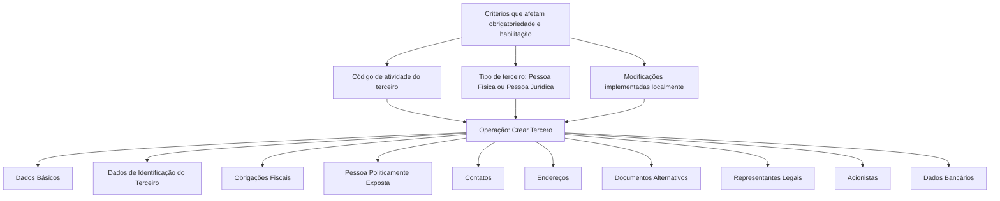

# Operação “Criar Tercero” — Registro Inicial de Informações de Terceiros

## 1. Metadados do Documento
- **Arquivo de Origem:** Não identificado no conteúdo fornecido
- **Tipo de Documento:** Procedimento
- **Domínio / Sistema:** Operação “Crear Tercero” / DOCUMENTACIÓN Reef
- **Público-Alvo:** Operação, Negócio e usuários do sistema
- **Data/Versão Identificada:** Não identificada

---

## 2. Resumo Executivo & Contexto de Negócio

O documento descreve a operação **“Crear Tercero”**, cujo objetivo é registrar, pela primeira vez, as informações de um terceiro nas diferentes estruturas ou blocos de dados que armazenam essas informações.

A obrigatoriedade e a habilitação dos campos dependem do **código de atividade do terceiro**. O comportamento de preenchimento também pode variar conforme o tipo de terceiro seja uma **Pessoa Física** ou uma **Pessoa Jurídica**.

Modificações implementadas localmente podem alterar o comportamento da aplicação, especialmente em relação à obrigatoriedade de registrar dados do terceiro. Portanto, o procedimento não define uma matriz fixa de campos obrigatórios aplicável a todos os casos.

A captura das informações não possui uma ordem única obrigatória: a sequência de preenchimento entre os blocos pode variar conforme o critério adotado pelo usuário no sistema. Além disso, nem todas as atividades permitem registrar dados em todas as estruturas apresentadas.

---

## 3. Arquitetura, Componentes & Tecnologias Envolvidas

O conteúdo não apresenta uma arquitetura técnica de software, integrações, APIs, tecnologias, servidores ou ambientes. O fluxo apresentado é funcional e representa estruturas de informação relacionadas ao cadastro inicial de terceiros.

Componentes e estruturas citados:

- Operação **Crear Tercero**
- Dados Básicos
- Dados de Identificação
- Obrigações Fiscais
- Pessoa Politicamente Exposta
- Contatos
- Endereços
- Documentos Alternativos
- Representantes Legais
- Acionistas
- Dados Bancários
- DOCUMENTACIÓN Reef
- Mapfredocument
- Zeus
- Reef



> **Nota de Análise:** O documento apresenta os blocos de informação do processo, mas não detalha telas, campos individuais, contratos de integração, métodos HTTP, bancos de dados, tecnologias ou regras de persistência.

---

## 4. Regras de Negócio, Especificações Funcionais & Processos

### Objetivo da operação

A operação **Crear Tercero** consiste em registrar, pela primeira vez, a informação de um terceiro nas diferentes estruturas de dados que a contêm.

### Regras de obrigatoriedade e habilitação

1. A obrigatoriedade e/ou a habilitação dos campos registrados em cada bloco ou estrutura de informação podem variar conforme o **código de atividade do terceiro**.
2. A obrigatoriedade e/ou a habilitação dos campos também podem variar quando o tipo de terceiro for:
   - Pessoa Física; ou
   - Pessoa Jurídica.
3. Modificações implementadas localmente podem afetar o comportamento da aplicação quanto à obrigatoriedade do registro dos dados do terceiro.
4. Não existe, no conteúdo fornecido, uma definição detalhada dos campos obrigatórios por código de atividade ou por tipo de terceiro.

### Regras de sequência de captura

1. A ordem de captura dos dados nos diferentes blocos de informação pode variar.
2. A sequência utilizada depende do critério adotado pelo usuário no sistema.
3. O documento não impõe uma ordem fixa para a execução dos blocos.

### Restrições de disponibilidade dos blocos

1. Nem todas as atividades de terceiros permitem registrar informações em todas as estruturas apresentadas no fluxo.
2. Os blocos afetados devem indicar e detalhar expressamente essa limitação.
3. O conteúdo fornecido não especifica quais atividades habilitam ou restringem cada bloco.

### Blocos de informação apresentados

- Dados Básicos
- Dados de Identificação do Terceiro
- Obrigações Fiscais
- Pessoa Politicamente Exposta
- Contatos
- Endereços
- Documentos Alternativos
- Representantes Legais
- Acionistas
- Dados Bancários

> **Nota de Análise:** A lista textual de “BLOQUES de Información” não inclui “Obligaciones Fiscales”, embora “Obligaciones Fiscales” apareça no desenho do processo. O documento não esclarece se essa diferença é intencional.

---

## 5. Tabelas de Parâmetros, Ambientes e Estruturas de Dados

| Item / Parâmetro | Descrição / Função | Tipo / Valores / Formato | Ambiente / Observações |
| :--- | :--- | :--- | :--- |
| Operação Crear Tercero | Registra pela primeira vez a informação de um terceiro nas estruturas de dados correspondentes. | Operação funcional | Não há ambiente técnico identificado. |
| Código de atividade do terceiro | Pode determinar a obrigatoriedade e/ou habilitação dos campos em cada bloco de informação. | Código de atividade | Valores não detalhados. |
| Tipo de terceiro | Pode determinar a obrigatoriedade e/ou habilitação dos campos. | Pessoa Física ou Pessoa Jurídica | Critérios específicos não detalhados. |
| Modificações locais | Podem afetar o comportamento da aplicação quanto à obrigatoriedade do registro de dados. | Modificações implementadas localmente | Não detalhadas. |
| Ordem de captura | A sequência de preenchimento dos blocos de informação pode variar conforme o critério do usuário. | Sequência variável | Não há ordem obrigatória definida. |
| Dados Básicos | Bloco de informação apresentado no processo de criação de terceiro. | Estrutura de informação | Campos não detalhados. |
| Dados de Identificação do Terceiro | Bloco de informação apresentado no processo de criação de terceiro. | Estrutura de informação | Campos não detalhados. |
| Obrigações Fiscais | Etapa exibida no fluxo do processo. | Estrutura ou etapa funcional | Não aparece na lista textual de blocos. |
| Pessoa Politicamente Exposta | Bloco de informação apresentado no processo. | Estrutura de informação | Campos e critérios não detalhados. |
| Contatos | Bloco de informação apresentado no processo. | Estrutura de informação | Campos não detalhados. |
| Endereços | Bloco de informação apresentado no processo. | Estrutura de informação | Campos não detalhados. |
| Documentos Alternativos | Bloco de informação apresentado no processo. | Estrutura de informação | Campos não detalhados. |
| Representantes Legais | Bloco de informação apresentado no processo. | Estrutura de informação | Campos não detalhados. |
| Acionistas | Bloco de informação apresentado no processo. | Estrutura de informação | Campos não detalhados. |
| Dados Bancários | Bloco de informação apresentado no processo. | Estrutura de informação | Campos não detalhados. |
| DOCUMENTACIÓN Reef | Área ou contexto documental exibido no exemplo. | Documentação | O conteúdo não fornece URL. |
| Owner | Proprietário exibido no exemplo de documentação. | `user:agonzalez_mapfre.com` | Valor reproduzido conforme o conteúdo fornecido. |
| Lifecycle | Situação exibida no exemplo de documentação. | `Approved Source` | O significado operacional não é detalhado. |

---

## 6. Bateria de Perguntas & Respostas para RAG (FAQ Sintético)

### P1: Em que consiste a operação “Crear Tercero”?
**R:** A operação “Crear Tercero” consiste em registrar pela primeira vez a informação de um terceiro nas diferentes estruturas ou blocos de dados que armazenam essa informação.

### P2: O código de atividade do terceiro influencia o cadastro?
**R:** Sim. A obrigatoriedade e/ou a habilitação dos campos em cada bloco ou estrutura de informação podem variar conforme o código de atividade do terceiro.

### P3: O tipo de terceiro altera os campos obrigatórios?
**R:** Sim. O documento informa que a obrigatoriedade e/ou a habilitação dos campos pode variar quando o terceiro for uma Pessoa Física ou uma Pessoa Jurídica. Não são especificados os campos aplicáveis a cada tipo.

### P4: Existe uma ordem obrigatória para preencher os blocos de informação?
**R:** Não. A ordem de captura dos dados nos diferentes blocos pode variar de acordo com o critério seguido pelo usuário no sistema.

### P5: Todas as atividades permitem preencher todos os blocos de informação?
**R:** Não. Nem todas as atividades dos terceiros permitem registrar informações em todas as estruturas exibidas no processo. Os blocos afetados devem indicar e detalhar expressamente essa limitação.

### P6: Quais blocos de informação são apresentados para o registro de um terceiro?
**R:** O processo apresenta Dados Básicos, Dados de Identificação, Obrigações Fiscais, Pessoa Politicamente Exposta, Contatos, Endereços, Documentos Alternativos, Representantes Legais, Acionistas e Dados Bancários.

### P7: Modificações locais podem impactar o comportamento do cadastro de terceiros?
**R:** Sim. Modificações implementadas localmente podem afetar o comportamento da aplicação em relação à obrigatoriedade no registro dos dados do terceiro.

### P8: O documento define quais campos devem ser preenchidos em cada bloco?
**R:** Não. O documento informa que a obrigatoriedade e a habilitação podem variar por código de atividade, tipo de terceiro e modificações locais, mas não detalha os campos de cada bloco.

### P9: O documento descreve APIs, métodos HTTP ou contratos JSON para a operação “Crear Tercero”?
**R:** Não. O conteúdo fornecido descreve o processo funcional e os blocos de informação, mas não apresenta APIs, métodos HTTP, contratos JSON ou detalhes de integração técnica.

### P10: O que significa a divergência entre o diagrama e a lista de blocos?
**R:** “Obrigações Fiscais” aparece no desenho do processo, mas não está presente na lista textual de “BLOQUES de Información”. O documento não explica essa diferença.

---

## 7. Glossário de Termos, Siglas & Conceitos-Chave

- **Crear Tercero:** Operação para registrar inicialmente a informação de um terceiro nas estruturas de dados correspondentes.
- **Terceiro:** Entidade cuja informação é registrada pela operação descrita. O documento não fornece uma definição adicional.
- **Pessoa Física:** Um dos tipos de terceiro citados como critério que pode afetar obrigatoriedade e habilitação de campos.
- **Pessoa Jurídica:** Um dos tipos de terceiro citados como critério que pode afetar obrigatoriedade e habilitação de campos.
- **Pessoa Politicamente Exposta:** Bloco de informação apresentado no processo. O documento não detalha critérios, campos ou significado adicional.
- **DOCUMENTACIÓN Reef:** Referência de documentação exibida no exemplo.
- **Mapfredocument:** Termo exibido na área de documentação do exemplo, sem detalhamento funcional.
- **Zeus:** Item de navegação exibido no exemplo, sem detalhamento funcional.
- **Reef:** Item de navegação e contexto documental exibido no exemplo, sem detalhamento funcional.

---

## 8. Notas Críticas, Riscos & Limitações

- O documento não define uma matriz de obrigatoriedade por código de atividade.
- O documento não detalha os critérios específicos para Pessoa Física e Pessoa Jurídica.
- Modificações locais podem alterar a obrigatoriedade dos dados, criando dependência de configurações ou implementações não documentadas no conteúdo fornecido.
- A disponibilidade dos blocos varia conforme a atividade do terceiro, mas as atividades e respectivos bloqueios não são especificados.
- A sequência de preenchimento é variável e depende do usuário, sem um fluxo obrigatório descrito.
- Não há detalhes sobre campos, formatos, validações, integrações, APIs, URLs, ambientes, servidores ou logs.
- Existe uma divergência documental: “Obrigações Fiscais” aparece no fluxo visual, mas não na lista textual de blocos.

---

## 9. Conteúdo Bruto Estruturado (Referência Fiel)

```text
--- [PÁGINA 1 DE 2] ---

OPERACIÓN CREAR Tercero
¿En que consiste?
Esta operación consiste en registrar por primera vez la Información del Tercero en los distintos bloques o estructuras de datos que la
contienen.
Premisas
La obligatoriedad y/o la habilitación de los campos en el registro de los datos de cada uno de los bloques o estructuras de información
puede variar de acuerdo con el código de actividad del Tercero.
La obligatoriedad y/o la habilitación de los campos en el registro de los datos de cada uno de los bloques o estructuras de información
también pueden variar si el Tipo de Tercero es una Persona Física o una Persona Jurídica.
Las modicaciones que se hubieran podido implementar localmente a su vez pueden afectar el comportamiento de la aplicación en
relación con la obligatoriedad en el registro de los Datos del Tercero.
Por último, el orden de captura de los datos en los distintos bloques de Información puede variar de acuerdo con el criterio seguido por el
Usuario en el Sistema.
Proceso
Datos
Básicos
Datos
Identificación
Obligaciones
Fiscales
Persona
Políticamente
Expuesta
Contactos Direcciones Documentos
Alternativos
Representantes
Legales Accionistas Datos
Bancarios
No todas las Actividades de los Terceros permiten registrar la información en todas y cada una de las estructuras de Información que se
muestran en el Proceso dibujado, lo que indicará y detallará expresamente en los Bloques de Datos afectados.
BLOQUES de Información
 Datos Básicos ( )
 Datos Identicación del Tercero ( )
 Persona Políticamente Expuesta ( )  Contactos ( )  Direcciones ( )  Documentos Alternativos ( )  Representantes Legales (
)  Accionistas ( )  Datos Bancarios ( )
Ejemplo:
Documentation / DOCUMENTACIÓN Reef
DOCUMENTACIÓN Reef
Mapfredocument
DOCUMENTACIÓN Reef
Owner
user:agonzalez_mapfre.com
Lifecycle
Approved Source
 / 
 VL
Buscar Inicio Soluciones Arquitecturas APIs Componentes Cloud Documentación Zeus Reef Ayuda
ES


--- [PÁGINA 2 DE 2] ---

Checking links...
```
