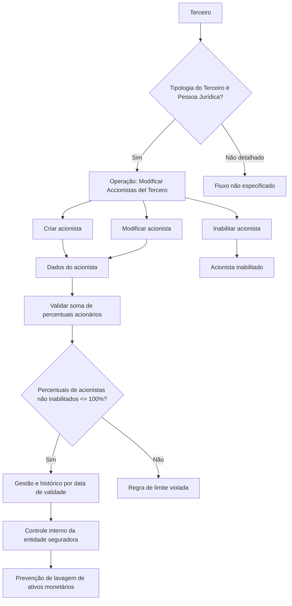

# Modificar Accionistas del Tercero — Gestão de Acionistas de Pessoa Jurídica

## 1. Metadados do Documento
- **Arquivo de Origem:** Não identificado no conteúdo extraído
- **Tipo de Documento:** Especificação Funcional
- **Domínio / Sistema:** DOCUMENTACIÓN Reef / Mapfre
- **Público-Alvo:** Negócio, analistas funcionais, desenvolvedores e operação
- **Data/Versão Identificada:** Não identificada

---

## 2. Resumo Executivo & Contexto de Negócio

O documento descreve a operação **“MODIFICAR Accionistas del Tercero”**, destinada à gestão dos acionistas previamente associados a um terceiro. A operação se aplica quando a tipologia do terceiro corresponde a uma **Pessoa Jurídica**.

No contexto apresentado, uma ação é um título emitido por uma Sociedade Anônima ou Sociedade Comanditária por Ações e representa uma fração igual do capital social. A identificação dos acionistas do terceiro oferece suporte aos processos internos da entidade seguradora.

O objetivo regulatório declarado é apoiar o cumprimento da normativa de prevenção de lavagem de ativos monetários. Para isso, o sistema permite à entidade seguradora gerir e controlar informações de acionistas vinculados a terceiros jurídicos.

A operação suporta o registro de novos acionistas, a alteração de acionistas existentes e a inabilitação de acionistas registrados. Os dados administrados incluem identificação documental, nacionalidade, dados nominais, participação acionária, cargo, vigências e marcação de Pessoa Politicamente Exposta.

Uma regra central estabelece que a soma dos percentuais acionários dos acionistas não inabilitados não pode ultrapassar 100%. O documento não detalha métodos HTTP, contratos JSON, persistência, integrações externas, perfis de acesso ou mensagens de validação.

---

## 3. Arquitetura, Componentes & Tecnologias Envolvidas

Os componentes e contextos explicitamente citados são:

| Componente / Termo | Papel identificado no documento |
| :--- | :--- |
| DOCUMENTACIÓN Reef | Repositório ou contexto documental exibido no conteúdo extraído. |
| Mapfre | Contexto corporativo identificado na interface/documentação extraída. |
| Terceiro | Entidade à qual os acionistas são associados. |
| Pessoa Jurídica | Tipologia de terceiro para a qual se aplica a identificação de acionistas. |
| Catálogo de Cargos | Catálogo existente no sistema que contém os valores possíveis de cargo acionário. |
| Entidade seguradora | Organização que utiliza os dados para gerir processos internos e prevenção de lavagem de ativos monetários. |



**Nota de Análise:** O documento não descreve arquitetura de software, protocolos de integração, tecnologias de implementação, banco de dados, endpoints, serviços ou contratos de API.

---

## 4. Regras de Negócio, Especificações Funcionais & Processos

### 4.1 Escopo de aplicação

1. A identificação de acionistas do terceiro é aplicável quando a tipologia do terceiro corresponde a uma **Pessoa Jurídica**.
2. A operação permite registrar, modificar ou inabilitar informações de acionistas previamente registrados no terceiro.
3. A operação também permite registrar novos acionistas do terceiro.

### 4.2 Ações suportadas

| Ação | Descrição |
| :--- | :--- |
| CREAR | Registrar um novo acionista associado ao terceiro. |
| MODIFICAR | Alterar informações de um acionista previamente registrado no terceiro. |
| INHABILITAR | Estabelecer que um acionista está inabilitado no sistema. |

### 4.3 Sequência de captura ou modificação

O documento informa que os campos são apresentados na sequência de captura ou modificação do terceiro, lida da esquerda para a direita e de cima para baixo.

1. Tipo Documento Accionista  
2. Clave del Documento Accionista  
3. Nacionalidad del Accionista  
4. Nombre  
5. Apellidos  
6. Fecha de Alta  
7. Fecha de Baja  
8. Porcentaje Accionarial  
9. Cargo  
10. Fecha de Validez  
11. Marca Persona Políticamente Expuesta  
12. Inhabilitación  

### 4.4 Regras de participação acionária

- O campo **Porcentaje Accionarial** identifica o percentual acionário do acionista em relação ao número de ações emitidas pelo terceiro.
- A soma dos percentuais acionários dos acionistas que **não estejam inabilitados** não pode superar **100%**.
- O documento não especifica o formato numérico do percentual, a precisão decimal permitida, o comportamento da validação nem a ação do sistema quando a soma excede 100%.

### 4.5 Regras de vigência e histórico

- **Fecha de Alta** identifica a data em que o acionista passa a ter direitos acionários no terceiro.
- **Fecha de Baja** identifica a data em que o acionista deixa de ter direitos acionários em relação ao terceiro associado.
- **Fecha de Validez** indica a data a partir da qual o acionista do terceiro estará plenamente operativo no sistema.
- O uso correto da data de validade permite manter um histórico das alterações efetuadas nas informações do acionista.

### 4.6 Regras de controle regulatório

- A identificação de acionistas de terceiros jurídicos permite à entidade seguradora cumprir a normativa de prevenção de lavagem de ativos monetários.
- A marca **Persona Políticamente Expuesta** permite identificar um acionista como Pessoa Politicamente Exposta.
- A identificação de Pessoa Politicamente Exposta possibilita à entidade seguradora gerir e controlar esse fato em seus processos internos.

---

## 5. Tabelas de Parâmetros, Ambientes e Estruturas de Dados

| Item / Parâmetro | Descrição / Função | Tipo / Valores / Formato | Ambiente / Observações |
| :--- | :--- | :--- | :--- |
| Tipo Documento Accionista | Mostra ou registra o tipo de documento usado para identificar o acionista, pessoa física ou jurídica. | Tipos de documento previamente configurados no sistema. | Campo de colapsador. |
| Clave del Documento Accionista | Mostra a chave do documento do acionista. | Não especificado. | Campo de painel. |
| Nacionalidad del Accionista | Mostra o país de nacionalidade do acionista. | País. | Campo de painel. |
| Nombre | Contém o nome do acionista. | Não especificado. | Campo de colapsador. |
| Apellidos | Permite mostrar e modificar sobrenomes ou razão social do acionista. | Não especificado. | Dois atributos no colapsador. |
| Fecha de Alta | Identifica a data em que o acionista possui direitos acionários do terceiro. | Data; formato não especificado. | Relacionada à vigência dos direitos acionários. |
| Fecha de Baja | Identifica a data em que o acionista deixa de possuir direitos acionários no terceiro associado. | Data; formato não especificado. | Relacionada ao encerramento dos direitos acionários. |
| Porcentaje Accionarial | Identifica o percentual acionário do acionista relativo ao número de ações emitidas pelo terceiro. | Percentual; formato e precisão não especificados. | A soma de acionistas não inabilitados não pode superar 100%. |
| Cargo | Identifica o cargo acionário desempenhado pelo acionista. | Valores possíveis definidos no catálogo de cargos existente no sistema. | Não são listados valores concretos de cargo. |
| Fecha de Validez | Informa a data a partir da qual o acionista estará plenamente operativo no sistema. | Data; formato não especificado. | Permite histórico das alterações de informação. |
| Marca Persona Políticamente Expuesta | Identifica o acionista como Pessoa Politicamente Exposta. | Marca; valores não especificados. | Suporta gestão e controle interno pela entidade seguradora. |
| Inhabilitación | Estabelece que o acionista está inabilitado no sistema. | Propriedade; valores não especificados. | Acionistas inabilitados não entram na regra de soma máxima de percentuais. |
| Ação CREAR | Registra um novo acionista do terceiro. | Ação operacional. | Listada como ação possível. |
| Ação MODIFICAR | Altera um acionista previamente registrado. | Ação operacional. | Tema central do documento. |
| Ação INHABILITAR | Inabilita um acionista no sistema. | Ação operacional. | Listada como ação possível. |

---

## 6. Bateria de Perguntas & Respostas para RAG (FAQ Sintético)

### P1: Qual é o objetivo da operação “Modificar Accionistas del Tercero”?
**R:** A operação permite registrar novos acionistas, modificar informações de acionistas previamente registrados e inabilitar acionistas associados a um terceiro. A identificação é aplicável quando a tipologia do terceiro corresponde a uma Pessoa Jurídica.

### P2: Por que a entidade seguradora precisa identificar os acionistas de um terceiro?
**R:** A identificação dos acionistas permite à entidade seguradora cumprir a normativa de prevenção de lavagem de ativos monetários, gerindo e controlando esse cenário em seus processos internos.

### P3: Quais ações podem ser executadas sobre os acionistas do terceiro?
**R:** O documento lista três ações possíveis: **CREAR**, para registrar um acionista; **MODIFICAR**, para alterar informações de um acionista já registrado; e **INHABILITAR**, para estabelecer que o acionista está inabilitado no sistema.

### P4: Quando a gestão de acionistas é aplicável a um terceiro?
**R:** A gestão e identificação de acionistas descrita no documento é aplicável sempre que a tipologia do terceiro corresponda a uma Pessoa Jurídica.

### P5: Qual é a regra para a soma dos percentuais acionários?
**R:** A soma dos percentuais acionários dos acionistas que não estejam inabilitados não pode superar 100%. O documento não define o tratamento do sistema quando essa regra é violada.

### P6: O que representa a data de alta de um acionista?
**R:** A **Fecha de Alta** identifica a data em que o acionista passa a possuir os direitos acionários do terceiro.

### P7: O que representa a data de baixa de um acionista?
**R:** A **Fecha de Baja** identifica a data em que o acionista deixa de ter direitos acionários em relação ao terceiro ao qual está associado.

### P8: Qual é a finalidade da data de validade do acionista?
**R:** A **Fecha de Validez** informa a data a partir da qual o acionista do terceiro estará plenamente operativo no sistema. Seu uso correto permite manter um histórico das mudanças realizadas nas informações do acionista.

### P9: Como o sistema identifica o cargo de um acionista?
**R:** O campo **Cargo** identifica o cargo acionário do acionista de acordo com os valores possíveis definidos no catálogo de cargos existente no sistema. O documento não relaciona os valores desse catálogo.

### P10: Para que serve a marca de Pessoa Politicamente Exposta?
**R:** A marca **Persona Políticamente Expuesta** permite identificar o acionista como Pessoa Politicamente Exposta. Essa identificação permite à entidade seguradora gerir e controlar esse fato em seus processos internos.

### P11: O que acontece conceitualmente quando um acionista é inabilitado?
**R:** A propriedade **Inhabilitación** estabelece que o acionista está inabilitado no sistema. Além disso, a regra de soma máxima de 100% considera somente os acionistas que não estejam inabilitados.

### P12: Quais documentos podem identificar um acionista?
**R:** O atributo **Tipo Documento Accionista** mostra ou registra o tipo de documento usado para identificar uma pessoa física ou jurídica acionista, segundo os tipos de documento previamente configurados no sistema. O documento não lista esses tipos.

---

## 7. Glossário de Termos, Siglas & Conceitos-Chave

- **Accionista:** Pessoa física ou jurídica titular de participação acionária em um terceiro.
- **Accionistas del Tercero:** Acionistas associados a um terceiro registrado no sistema.
- **Cargo Accionarial:** Cargo desempenhado pelo acionista, conforme valores definidos no catálogo de cargos do sistema.
- **Clave del Documento Accionista:** Chave do documento que identifica o acionista.
- **Fecha de Alta:** Data em que o acionista possui direitos acionários do terceiro.
- **Fecha de Baja:** Data em que o acionista deixa de possuir direitos acionários no terceiro associado.
- **Fecha de Validez:** Data a partir da qual o acionista estará plenamente operativo no sistema.
- **Inhabilitación:** Propriedade que estabelece que o acionista está inabilitado no sistema.
- **Persona Jurídica:** Tipologia de terceiro à qual se aplica a identificação de acionistas.
- **Persona Políticamente Expuesta:** Marcação para identificar um acionista como Pessoa Politicamente Exposta.
- **Porcentaje Accionarial:** Percentual de participação do acionista relativo ao número de ações emitidas pelo terceiro.
- **Tercero:** Entidade registrada no sistema à qual acionistas podem estar associados.

---

## 8. Notas Críticas, Riscos & Limitações

- O conteúdo não identifica o nome do arquivo de origem, data, versão ou autor formal do documento.
- Não há detalhamento de arquitetura técnica, microsserviços, APIs, métodos HTTP, contratos JSON, banco de dados ou mecanismos de integração.
- O documento não especifica perfis de acesso, matriz de permissões, trilha de auditoria, regras de exclusão, mensagens de erro ou comportamento de validação.
- A regra de percentual acionário informa somente que acionistas não inabilitados não podem superar 100% em conjunto; não há indicação de arredondamento, precisão decimal ou comportamento diante de violação.
- O catálogo de cargos é citado, mas seus valores, responsáveis e mecanismo de configuração não são detalhados.
- Os tipos de documento são configurados previamente no sistema, mas não são enumerados.
- **Nota de Análise:** O documento lista campos e regras funcionais para a gestão de acionistas, porém não detalha fluxos de persistência, contratos de serviço nem integrações com processos de prevenção de lavagem de ativos monetários.

---

## 9. Conteúdo Bruto Estruturado (Referência Fiel)

```text
--- [PÁGINA 1 DE 2] ---

MODIFICAR Accionistas del Tercero
Objetivo
Una acción  en el mercado nanciero es un título emitido por una Sociedad Anónima o Sociedad comanditaria por acciones que representa el
valor de una de las fracciones iguales en que se divide su capital social.
La identicación de los Accionistas del Tercero, siempre y cuando la tipología del Tercero corresponda a una Persona Jurídica, permite a la
entidad aseguradora cumplir con la normativa de prevención de lavado de activos monetarios gestionando y controlando en sus procesos
internos dicho supuesto.
Esta Operación permite Registrar, Modicar ó Inhabilitar la información de los accionistas que se encontraran registrados previamente en el
Tercero además de Registrar nuevos Accionistas del Tercero.
Posibles Acciones
 CREAR ( )
 MODIFICAR ( )
 INHABILITAR ( )
Accionistas
De Izquierda a Derecha y de Arriba hacia Abajo, los siguientes campos marcan la secuencia de captura o modicación del Tercero en el
sistema.
Tipo Documento Accionista (  )
Este Atributo del colapsador muestra o registrará el tipo de documento con el que se va a identicar a la persona física o jurídica accionista
de acuerdo con los tipos de documentos que hayan sido congurados en el sistema previamente.
Clave del Documento Accionista (  )
Este Atributo del panel muestra la clave del documento del Accionista.
Nacionalidad del Accionista (   )
Documentation / DOCUMENTACIÓN Reef
DOCUMENTACIÓN Reef
Mapfredocument
DOCUMENTACIÓN Reef
Owner
user:agonzalez_mapfre.com
Lifecycle
Approved Source
 / 
 VL
Buscar Inicio Soluciones Arquitecturas APIs Componentes Cloud Documentación Zeus Reef Ayuda
ES


--- [PÁGINA 2 DE 2] ---

Este Atributo del panel mostrará el país de nacionalidad del Accionista.
Nombre (  )
Este Atributo del colapsador contendrá el nombre del Accionista.
Apellidos (  )
Estos dos Atributos del colapsador permiten mostrar y modicar los Apellidos o la Razón Social del accionista.
Fecha de Alta (  )
Este Campo identica la fecha en la que el Accionista tiene los derechos accionariales del Tercero.
Fecha de Baja (  )
Este Campo identica la fecha en la que el Accionista causa baja en relación con los derechos accionariales del Tercero al que está asociado.
Porcentaje Accionarial (  )
Este Campo identica el Porcentaje accionarial del Accionista en relación al número de acciones emitidas por el Tercero.
La Suma de los porcentajes accionariales de los Accionistas que no estén inhabilitados no puede superar el 100%.
Cargo (  )
Este Campo identica el Cargo Accionarial que sustenta el Accionista de acuerdo con los posibles valores en los cargos denidos en el
catálogo de Cargos existente en el Sistema.
Fecha de Validez ( )
Esta propiedad le indica al sistema la fecha a partir de la cual el Accionista del Tercero estará plenamente operativo en el sistema por lo que
su correcto uso permite tener un histórico de los cambios efectuados con su información.
Marca Persona Políticamente Expuesta (  )
Este Atributo permite identicar al Accionista como Persona Políticamente Expuesta, marca que permitiría a la entidad aseguradora gestionar
y controlar en sus procesos internos este hecho.
Inhabilitación (  )
Esta propiedad establece que el Accionista está inhabilitado en el sistema.
```
