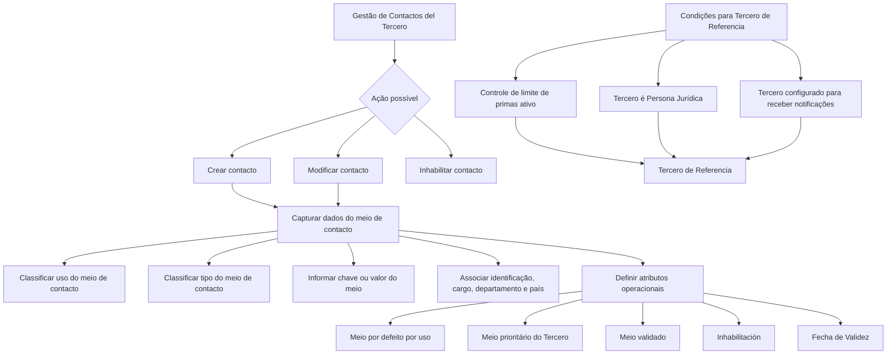

# Gestão de Contactos do Tercero — Especificação Funcional para Registro, Alteração e Inativação

## 1. Metadados do Documento
- **Arquivo de Origem:** Não identificado no conteúdo extraído
- **Tipo de Documento:** Especificação Técnica / Manual Funcional
- **Domínio / Sistema:** Reef / Mapfre — gestão de contactos de Terceros
- **Público-Alvo:** Desenvolvedores, analistas funcionais, operação e entidade seguradora
- **Data/Versão Identificada:** Não identificada

---

## 2. Resumo Executivo & Contexto de Negócio

O documento descreve a tela **“MODIFICAR Contactos del Tercero”**, destinada à gestão dos meios de contacto associados a um Tercero. A funcionalidade permite registrar novos contactos, complementar dados existentes, modificar contactos preexistentes e inabilitar contactos que deixaram de estar vigentes.

A especificação diferencia o contexto de captura conforme a natureza do Tercero: os dados solicitados para contactos de uma **Persona Física** variam em relação aos dados solicitados para uma **Persona Jurídica**. Contudo, o conteúdo extraído não detalha quais campos são exclusivos, obrigatórios ou condicionais para cada tipo de pessoa.

A gestão do contacto é estruturada por classificações, catálogos e atributos de qualidade. O sistema utiliza classificações de uso e tipo de meio de contacto, catálogos de cargos, departamentos, países e documentos previamente configurados. A entidade seguradora deve revisar essas classificações para garantir o emprego adequado nos processos internos.

O documento também estabelece regras operacionais relevantes para seleção de contactos. Um meio de contacto pode ser definido como padrão por uso, prioritário para o Tercero, validado para qualidade de dados ou inabilitado quando não está mais em vigor. Além disso, existe uma regra específica para identificar um contacto como **Tercero de Referencia** em cenários relacionados ao controle de limite de primas para prevenção de lavagem de dinheiro.

---

## 3. Arquitetura, Componentes & Tecnologias Envolvidas

O conteúdo não apresenta arquitetura técnica de software, microsserviços, APIs, métodos HTTP, contratos JSON, servidores, URLs de ambiente, tecnologias de infraestrutura ou mecanismos de integração.

Os componentes funcionais identificados são:

- Tela **MODIFICAR Contactos del Tercero**.
- Cadastro de meios de contacto de Terceros.
- Classificação de **Uso del Medio de Contacto**.
- Classificação de **Tipo del Medio de Contacto**.
- Catálogo de tipos de documento configurados no sistema.
- Catálogo de cargos.
- Catálogo de departamentos de empresa.
- Catálogo de países.
- Configuração da companhia para controle de limite de primas voltado à prevenção de lavagem de dinheiro.
- Informação do Tercero relativa ao recebimento de notificações.



> **Nota de Análise:** O documento descreve funcionalidades e atributos de uma tela, mas não detalha arquitetura de camadas, persistência de dados, integrações, serviços técnicos, permissões, métodos HTTP ou contratos de interface.

---

## 4. Regras de Negócio, Especificações Funcionais & Processos

### 4.1 Ações disponíveis

A tela permite as seguintes ações sobre contactos do Tercero:

1. **CREAR:** registrar novos contactos do Tercero.
2. **MODIFICAR:** alterar ou complementar dados de contactos preexistentes.
3. **INHABILITAR:** indicar que o meio de contacto deixou de estar em vigor e não deve ser considerado nos processos da entidade.

### 4.2 Sequência e classificação dos contactos

- A captura ou modificação dos dados segue a sequência visual de esquerda para direita e de cima para baixo.
- O campo **Secuencia del Medio de Contacto** recebe automaticamente do sistema o número de sequência da captura dos meios de contacto do Tercero.
- O campo **Uso del Medio de Contacto** registra uma classificação de uso para o contacto. Essa classificação deve ser revisada pela entidade seguradora para uso e exploração adequados nos processos internos.
- O campo **Tipo del Medio de Contacto** registra uma classificação de tipo de meio de contacto. Essa classificação também deve ser revisada pela entidade seguradora para posterior consideração e emprego nos processos internos.

### 4.3 Regras para a chave ou valor do meio de contacto

O campo **Clave/valor del Medio de Contacto** contém o valor real conforme o tipo de meio de contacto associado:

- Para o tipo **Correo electrónico**, o valor deve conter formato e conteúdo de endereço de e-mail, conforme o exemplo `xxxxxx@zzzzzz.zzz`.
- Para o tipo **Teléfono**, o valor deve conter formato e conteúdo correspondentes a telefone, conforme o exemplo `<+99 99 9999 9999>`.
- O formato de telefone deve respeitar as regras dos planos nacionais de numeração telefônica dos países.

### 4.4 Identificação e informações organizacionais do contacto

- **Nombre del Medio de Contacto** contém o nome ou os nomes da pessoa que atua como meio de contacto.
- **Primer y Segundo Apellido del Contacto** contém o sobrenome ou os sobrenomes da pessoa que atua como contacto.
- **Tipo Documento** contém o tipo de documento utilizado para identificar a pessoa física ou jurídica que atua como contacto, de acordo com tipos previamente configurados no sistema.
- **Clave del Documento** contém a chave do documento que identifica a pessoa do contacto.
- **Tipo de Cargo en la Empresa** contém o valor da classificação de cargos de pessoas nas empresas, associado ao contacto.
- **Cargo/Actividad del Contacto** contém o código do posto que identifica o contacto, de acordo com o catálogo de cargos existente no sistema.
- **Departamento del Contacto** contém o código do departamento ou seção que identifica o contacto, de acordo com o catálogo de departamentos de empresa existente no sistema.
- **Clave del País** contém o código do primeiro nível da estrutura geográfica, países, que identifica o meio de contacto do Tercero, conforme o catálogo de países existente no sistema.
- **Relación** é texto livre utilizado para detalhar ou ampliar informações sobre o departamento do contacto ou sobre a relação do contacto com o Tercero.
- **Observaciones** permite capturar texto plano para ampliar ou detalhar informações do meio de contacto do Tercero.

### 4.5 Regra para Tercero de Referencia

O campo **Tercero de Referencia** indica que o contacto é a pessoa de referência para o envio das notificações correspondentes quando as seguintes condições forem atendidas:

1. O controle no limite de primas para prevenção de lavagem de dinheiro está ativado na configuração da companhia.
2. O Tercero em captura é uma **Persona Jurídica**.
3. Na informação do Tercero, foi indicado que devem ser enviadas notificações.

### 4.6 Regras de seleção, prioridade, qualidade e vigência

- **Medio de Contacto por Defecto:** para Terceros com mais de um meio de contacto, identifica qual meio deve ser considerado por padrão nos processos operacionais e/ou aplicações da entidade.
  - Só pode existir um meio marcado como padrão para cada **Uso del Medio de Contacto** atribuído.
- **Medio de Contacto Prioritario:** para Terceros com mais de um meio de contacto, identifica qual meio deve ser considerado preferencialmente nos processos operacionais da entidade.
  - Só pode existir um meio marcado como prioritário para o Tercero.
- **Medio de Contacto Validado:** indica que o meio de contacto foi efetivamente validado pela entidade seguradora para efeitos de qualidade de dados.
- **Inhabilitación:** indica que o meio de contacto associado ao Tercero deixou de estar vigente e não deve ser considerado em nenhum processo da entidade.
- **Fecha de Validez:** indica a data a partir da qual o meio de contacto passa a ser plenamente operacional. O uso correto da data permite manter histórico das alterações efetuadas nas informações do meio de contacto do Tercero.

---

## 5. Tabelas de Parâmetros, Ambientes e Estruturas de Dados

| Item / Parâmetro | Descrição / Função | Tipo / Valores / Formato | Ambiente / Observações |
| :--- | :--- | :--- | :--- |
| Acción | Define a operação sobre o contacto do Tercero | CREAR, MODIFICAR, INHABILITAR | O documento não detalha permissões nem transições entre ações |
| Uso del Medio de Contacto | Classifica o uso atribuído ao contacto do Tercero | Valor de classificação de usos | Deve ser revisado pela entidade seguradora |
| Secuencia del Medio de Contacto | Identifica a sequência de captura dos meios de contacto | Número atribuído automaticamente pelo sistema | Não é detalhada regra de numeração |
| Tipo del Medio de Contacto | Classifica o tipo do meio de contacto | Valor de classificação de tipos | Deve ser revisado pela entidade seguradora |
| Clave/valor del Medio de Contacto | Armazena o valor real do meio de contacto | E-mail, telefone ou outro valor correspondente ao tipo | E-mail: `xxxxxx@zzzzzz.zzz`; telefone: `<+99 99 9999 9999>` |
| Nombre del Medio de Contacto | Registra o nome ou nomes da pessoa que atua como contacto | Texto | Aplicável à pessoa que atua como meio de contacto |
| Primer y Segundo Apellido del Contacto | Registra sobrenome ou sobrenomes da pessoa que atua como contacto | Texto | O documento menciona primeiro e segundo sobrenome |
| Tipo Documento | Identifica o tipo de documento do contacto | Tipo configurado previamente no sistema | Pode identificar pessoa física ou jurídica |
| Clave del Documento | Registra a chave do documento de identificação do contacto | Chave documental | O formato não é especificado |
| Tipo de Cargo en la Empresa | Classifica o cargo da pessoa na empresa | Valor de classificação de cargos | Associado ao contacto |
| Cargo/Actividad del Contacto | Identifica o código do posto do contacto | Código do catálogo de cargos | Conforme catálogo existente no sistema |
| Departamento del Contacto | Identifica código do departamento ou seção do contacto | Código do catálogo de departamentos | Conforme catálogo de departamentos de empresa |
| Clave del País | Identifica o país associado ao meio de contacto | Código do primeiro nível da estrutura geográfica | Conforme catálogo de países |
| Relación | Amplia informações do departamento ou da relação com o Tercero | Texto livre | Não há formato adicional especificado |
| Tercero de Referencia | Indica que o contacto é pessoa de referência para notificações | Indicador | Depende das três condições descritas na seção 4.5 |
| Medio de Contacto por Defecto | Define o meio considerado por padrão | Indicador | Máximo de um por Uso del Medio de Contacto |
| Medio de Contacto Prioritario | Define o meio considerado preferencialmente | Indicador | Máximo de um para o Tercero |
| Medio de Contacto Validado | Registra validação do meio para qualidade de dados | Indicador | Validado pela entidade seguradora |
| Inhabilitación | Registra que o meio deixou de estar vigente | Indicador | O meio não deve ser considerado nos processos da entidade |
| Fecha de Validez | Define a partir de quando o meio é plenamente operacional | Data | Permite histórico de alterações |
| Observaciones | Amplia ou detalha informações do meio de contacto | Texto plano | Não há limite ou formato detalhado |

---

## 6. Bateria de Perguntas & Respostas para RAG (FAQ Sintético)

### P1: Quais ações a tela “MODIFICAR Contactos del Tercero” permite realizar?
**R:** A tela permite criar novos contactos do Tercero, modificar ou complementar informações de contactos preexistentes e inabilitar meios de contacto que deixaram de estar vigentes.

### P2: Como é definida a sequência de um meio de contacto do Tercero?
**R:** A sequência é registrada no campo **Secuencia del Medio de Contacto**. O documento estabelece que esse número é atribuído automaticamente pelo sistema durante a captura dos meios de contacto do Tercero.

### P3: Qual formato deve ser utilizado para o campo Clave/valor del Medio de Contacto quando o tipo é correio eletrônico?
**R:** Quando o tipo de meio de contacto é **Correo electrónico**, o campo deve conter formato e conteúdo de e-mail. O documento apresenta como exemplo `xxxxxx@zzzzzz.zzz`.

### P4: Qual formato deve ser utilizado para um meio de contacto do tipo telefone?
**R:** Quando o tipo associado é **Teléfono**, o campo Clave/valor del Medio de Contacto deve conter formato e conteúdo correspondentes a telefone, como no exemplo `<+99 99 9999 9999>`, respeitando as regras dos planos nacionais de numeração telefônica dos países.

### P5: Quando um contacto pode ser marcado como Tercero de Referencia?
**R:** Um contacto pode ser indicado como **Tercero de Referencia**, isto é, pessoa de referência para notificações, quando o controle de limite de primas para prevenção de lavagem de dinheiro estiver ativado na configuração da companhia, o Tercero em captura for uma Persona Jurídica e estiver indicado na informação do Tercero que devem ser enviadas notificações.

### P6: Quantos meios de contacto podem ser marcados como padrão?
**R:** Para cada **Uso del Medio de Contacto** atribuído, somente um meio pode ser identificado e marcado como **Medio de Contacto por Defecto**.

### P7: Quantos meios de contacto prioritários podem existir para um Tercero?
**R:** Somente um meio de contacto pode ser identificado e marcado como **Medio de Contacto Prioritario** para cada Tercero.

### P8: Qual é a diferença entre meio de contacto padrão e meio de contacto prioritário?
**R:** O **Medio de Contacto por Defecto** é o meio considerado por padrão nos processos operacionais e/ou aplicações da entidade, sendo único por uso de meio de contacto. O **Medio de Contacto Prioritario** é o meio considerado preferencialmente nos processos operacionais da entidade, sendo único para o Tercero.

### P9: O que significa Medio de Contacto Validado?
**R:** O indicador **Medio de Contacto Validado** registra que o meio de contacto foi efetivamente validado pela entidade seguradora para fins de qualidade dos dados.

### P10: Qual é o efeito da Inhabilitación de um meio de contacto?
**R:** A **Inhabilitación** estabelece que o meio de contacto associado ao Tercero deixou de estar vigente. Portanto, esse meio não deve ser considerado em nenhum dos processos da entidade.

### P11: Para que serve a Fecha de Validez do meio de contacto?
**R:** A **Fecha de Validez** informa a data a partir da qual o meio de contacto é plenamente operacional. Seu uso correto permite manter um histórico das alterações feitas nas informações do meio de contacto do Tercero.

### P12: De onde vêm os valores de cargo, departamento e país?
**R:** O código de cargo vem do catálogo de cargos existente no sistema; o código de departamento ou seção vem do catálogo de departamentos de empresa; e a chave de país vem do catálogo de países, correspondente ao primeiro nível da estrutura geográfica.

---

## 7. Glossário de Termos, Siglas & Conceitos-Chave

- **Tercero:** entidade ou pessoa para a qual são geridos os contactos no sistema.
- **Contacto:** pessoa ou meio associado ao Tercero para comunicação e identificação.
- **Medio de Contacto:** canal ou dado de contacto associado ao Tercero, como correio eletrônico ou telefone.
- **Persona Física:** pessoa física; o documento informa que os dados solicitados podem variar em relação aos de uma Persona Jurídica.
- **Persona Jurídica:** pessoa jurídica; é condição para a regra de Tercero de Referencia.
- **Uso del Medio de Contacto:** classificação que determina o uso atribuído a um contacto do Tercero.
- **Tipo del Medio de Contacto:** classificação que determina o tipo do meio de contacto, como correio eletrônico ou telefone.
- **Tercero de Referencia:** contacto que atua como pessoa de referência para notificações quando as condições documentadas são atendidas.
- **Medio de Contacto por Defecto:** meio de contacto utilizado por padrão em processos operacionais e/ou aplicações da entidade.
- **Medio de Contacto Prioritario:** meio de contacto utilizado preferencialmente em processos operacionais da entidade.
- **Medio de Contacto Validado:** meio de contacto validado pela entidade seguradora para qualidade de dados.
- **Inhabilitación:** condição que informa que um meio de contacto não está mais vigente.
- **Fecha de Validez:** data a partir da qual um meio de contacto passa a ser plenamente operacional.
- **Prevención del Lavado de Dinero:** contexto mencionado para o controle de limite de primas configurado pela companhia.

---

## 8. Notas Críticas, Riscos & Limitações

- O documento não identifica o arquivo original, data, versão, autor, sistema técnico responsável ou ambiente de execução.
- Não há detalhamento de obrigatoriedade de campos, regras de preenchimento, validações técnicas, mensagens de erro, comportamento de persistência ou permissões por perfil.
- O documento informa que os dados de Persona Física variam em relação aos de Persona Jurídica, mas não descreve os campos específicos para cada categoria.
- As classificações de uso e tipo de meio de contacto devem ser revisadas pela entidade seguradora; o conteúdo não fornece os valores possíveis dessas classificações.
- Os catálogos de documentos, cargos, departamentos e países são citados, mas seus códigos e valores não foram incluídos.
- A regra de Tercero de Referencia menciona controle de limite de primas para prevenção de lavagem de dinheiro, mas não detalha o mecanismo de configuração nem o processo de notificação.
- Não há descrição de integrações, APIs, banco de dados, trilha de auditoria, retenção histórica, fluxos de aprovação ou mecanismos técnicos para garantir a unicidade de contacto padrão e prioritário.

---

## 9. Conteúdo Bruto Estruturado (Referência Fiel)

```text
--- [PÁGINA 1 DE 3] ---

MODIFICAR Contactos del Tercero
Objetivo
El propósito de esta pantalla es proporcionar la funcionalidad para que el Sistema pueda Registrar Nuevos Contactos del Tercero además de
Complementar, Modicar ó Inhabilitar la información de alguno de sus Contactos Preexistentes.
Los datos que se solicitan para registrar los posibles Contactos de una Persona Física varían respecto de la información solicitada para
una Persona Jurídica.
Posibles Acciones
 CREAR ( )
 MODIFICAR ( )
 INHABILITAR ( )
Contactos
De Izquierda a Derecha y de Arriba hacia Abajo, los siguientes campos marcan la secuencia de captura o modicación del Tercero en el
sistema.
Uso del Medio de Contacto (   )
Este atributo contiene el valor de uno de los Usos en los que se clasican los Contactos de los Terceros, clasicación de valores que ha de
ser revisada por parte de la entidad aseguradora para su correcto empleo y explotación en los procesos internos de la entidad.
Consejo:
Documentation / DOCUMENTACIÓN Reef
DOCUMENTACIÓN Reef
Mapfredocument
DOCUMENTACIÓN Reef
Owner
user:agonzalez_mapfre.com
Lifecycle
Approved Source
 / 
 VL
Buscar Inicio Soluciones Arquitecturas APIs Componentes Cloud Documentación Zeus Reef Ayuda
ES


--- [PÁGINA 2 DE 3] ---

Secuencia del Medio de Contacto
Este dato contiene el Número de Secuencia en la Captura de los Medios de Contacto del Tercero siendo un valor que el Sistema asigna
automáticamente
Tipo del Medio de Contacto (   )
Este atributo contiene uno de los posibles valores de la clasicación de Tipos de los Medios de Contacto del Tercero, clasicación que ha de
ser revisada por parte de la entidad aseguradora para su posterior consideración y empleo en los procesos internos de la entidad.
Clave/valor del Medio de Contacto (  )
Este Atributo contiene el valor real del Tipo del Medio de Contacto. Así pues, si se ha asociado en el contacto del Tercero el tipo 'Correo
electrónico' el valor de este Dato tiene que tener el formato y contenido de un correo electrónico: xxxxxx@zzzzzz.zzz, en cambio, si se ha
asociado al Tercero un tipo como 'Teléfono' el valor de este Dato tiene que tener el formato y contenido que correspondan a un Teléfono: <
+99 99 9999 9999> (de acuerdo con las reglas de los Planes Nacionales de Numeración Telefónica de los Países).
Nombre del Medio de Contacto (  )
Este Atributo contiene el Nombre o los Nombres de la Persona que actúa como Medio de Contacto.
Primer y Segundo Apellido del Contacto (  )
Este Atributo contiene el Apellido o los Apellidos de la Persona que actúa como Medio de Contacto.
Tipo Documento (   )
Este Atributo del colapsador contiene el tipo de documento con el que se va a identicar a la persona física o jurídica como Contacto de
acuerdo con los tipos de documentos que hayan sido congurados en el sistema previamente.
Clave del Documento (  )
Este Atributo del panel contiene la clave del documento que identica a la Persona del Contacto.
Tipo de Cargo en la Empresa (   )
Este atributo contiene el valor de la clasicación de los cargos de las Personas en las Empresas, asociado al Contacto.
Cargo/Actividad del Contacto (   )
Este Campo contiene el código del Puesto con el que se estará identicando el Contacto del Tercero, de acuerdo con la relación de posibles
valores existentes en el catálogo de Cargos existente en el Sistema.
Departamento del Contacto (   )
Este Campo contiene el código del departamento o sección con el que se estará identicando el Contacto del Tercero, de acuerdo con la
relación de posibles valores existentes en el catálogo de Departamentos de Empresa existente en el Sistema.
Clave del País (   )
Este Campo contiene el código del primer nivel de la estructura Geográca (países) en el que se estará identicando el Medio de Contacto del
Tercero, de acuerdo con la relación de posibles valores existentes en el catálogo de Países existente en el Sistema.
Relación (  )
Esta cualidad se utiliza como texto libre para detallar o ampliar la información relativa al Departamento del Contacto o la relación del
Contacto con el Tercero.
Tercero de Referencia (  )
Este Dato indica que el Contacto es la Persona de Referencia (a la que se deben las noticaciones correspondientes) en el caso que se
cumplan:
El Control en el Límite de Primas para la Prevención del Lavado de Dinero esté activado en la Conguración de la Compañía.


--- [PÁGINA 3 DE 3] ---

El Tercero que se esté capturando sea una Persona Jurídica y además se haya indicado en la Información del Tercero que se le han de
enviar noticaciones.
Medio de Contacto por Defecto (  )
Este Campo, en aquellos Terceros que tienen más de un medio de Contacto asociado, indicará cual de ellos es el que se debe considerar por
defecto en los Procesos Operativos y/o Aplicaciones de la Entidad. Solamente puede haber uno identicado y marcado como tal por cada
Uso del Medio de Contacto asignado.
Medio de Contacto Prioritario (  )
Este Campo, en aquellos Terceros que tienen más de un medio de Contacto asociado, va a indicar cual de ellos es el que se ha de considerar
preferentemente en los Procesos Operativos de la Entidad. Solamente puede haber uno identicado y marcado como tal para el Tercero.
Medio de Contacto Validado (  )
Este Dato indica si el Medio de Contacto ha sido efectivamente validado, a efectos de calidad del dato, por la entidad aseguradora.
Inhabilitación (  )
Esta propiedad establece si el Medio de Contacto asociado al Tercero ha dejado de estar en vigor por lo que no debería ser considerado en
ninguno de los procesos de la entidad.
Fecha de Validez ( )
Esta propiedad le indica al sistema la fecha a partir de la cual el Medio de Contacto va a ser plenamente operativo por lo que su correcto uso
permite tener un histórico de los cambios efectuados en la Información del Medio de Contacto del Tercero
Observaciones (  )
Este Atributo permite capturar texto plano para ampliar o detallar la información del Medio de Contacto del Tercero.
```
