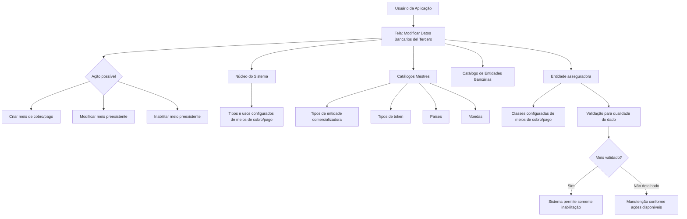
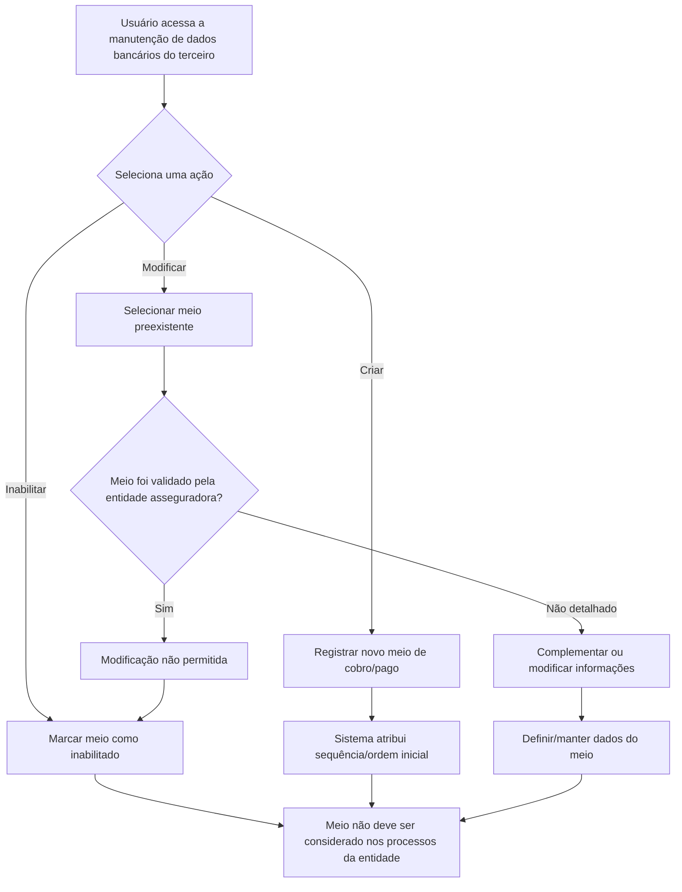

# Gestão de Dados Bancários de Terceiros — Criação, Alteração e Inabilitação de Meios de Cobro/Pago

## 1. Metadados do Documento
- **Arquivo de Origem:** Não identificado no conteúdo extraído
- **Tipo de Documento:** Especificação Funcional
- **Domínio / Sistema:** Reef / Mapfre / Gestão de Dados Bancários de Terceiros
- **Público-Alvo:** Usuários da Aplicação, Analistas Funcionais, Desenvolvedores e Operação
- **Data/Versão Identificada:** Não identificada
- **Lifecycle identificado:** Approved
- **Owner identificado:** `user:agonzalez_mapfre.com`

---

## 2. Resumo Executivo & Contexto de Negócio

O documento descreve a tela **“Modificar Datos Bancarios del Tercero”**, destinada à gestão dos meios de cobro/pago associados a um terceiro. A funcionalidade permite registrar novos meios de cobro/pago, além de complementar, modificar ou inabilitar dados de meios já existentes.

Os meios de cobro/pago abrangem, conforme os exemplos fornecidos, contas e cartões. A tela coleta e mantém informações de identificação, relacionamento com catálogos mestres, localização bancária, titularidade, tokenização, mascaramento, criptografia, moeda, validade e prioridade operacional.

A gestão funcional inclui as ações possíveis de **CRIAR**, **MODIFICAR** e **INABILITAR**. O documento também estabelece restrições relevantes: após a validação de um meio de cobro/pago pela entidade asseguradora, o sistema permite somente a sua inabilitação, não sendo permitida a modificação dos seus dados.

O documento define regras para identificação de meios padrão e prioritários. Um terceiro pode ter apenas um meio de cobro/pago marcado como padrão entre todos os seus meios associados. Já a marcação de meio prioritário é limitada a um registro por tipo de meio de cobro/pago associado ao terceiro.

A **Fecha de Validez** permite estabelecer a data a partir da qual o meio de cobro/pago estará plenamente operativo no sistema e possibilita a manutenção de histórico das alterações efetuadas em suas informações. O documento não detalha contratos de API, persistência, métodos HTTP, permissões, validações de formato ou fluxos técnicos de integração.

---

## 3. Arquitetura, Componentes & Tecnologias Envolvidas

### Componentes e elementos identificados

| Componente / Conceito | Papel identificado no documento |
| :--- | :--- |
| Aplicação | Disponibiliza a tela para registro, complementação, modificação e inabilitação de meios de cobro/pago de terceiros. |
| Tela “Modificar Datos Bancarios del Tercero” | Interface funcional para manutenção de dados bancários e meios de cobro/pago. |
| Terceiro | Entidade à qual os meios de cobro/pago estão associados. |
| Núcleo do Sistema | Fornece tipos e usos configurados de meios de cobro/pago. |
| Entidade asseguradora | Configura valores possíveis para classes de meios de cobro/pago e valida os meios para fins de qualidade de dados. |
| Catálogo mestre do Sistema | Fonte de valores possíveis para tipo de entidade comercializadora e tipo de token. |
| Catálogo de Entidades Bancárias | Fonte de códigos de entidades bancárias. |
| Catálogo mestre de Países | Fonte de códigos de países para localização da entidade bancária. |
| Catálogo mestre de Moedas | Fonte de códigos de moeda do meio de cobro/pago. |
| Gestão e Controle na Operativa de Tesouraria | Contexto de configuração do tipo de uso do movimento. |
| Reef / Mapfre | Contexto documental identificado no cabeçalho extraído. |



> **Nota de Análise:** O documento descreve a arquitetura funcional baseada em tela, núcleo do sistema, entidade asseguradora e catálogos, mas não informa tecnologias de implementação, banco de dados, APIs, microsserviços, URLs, ambientes, protocolos ou mecanismos de autenticação.

---

## 4. Regras de Negócio, Especificações Funcionais & Processos

### 4.1 Objetivo da tela

A tela fornece funcionalidade para que usuários da aplicação possam:

1. Registrar novos meios de cobro/pago de um terceiro.
2. Complementar informações de meios de cobro/pago preexistentes.
3. Modificar informações de meios de cobro/pago preexistentes.
4. Inabilitar informações de meios de cobro/pago preexistentes.

### 4.2 Ações possíveis

| Ação | Descrição sustentada pelo documento |
| :--- | :--- |
| CRIAR | Registrar um novo meio de cobro/pago para o terceiro. |
| MODIFICAR | Alterar ou complementar informações de um meio de cobro/pago preexistente, sujeito à regra de validação. |
| INABILITAR | Indicar que o meio de cobro/pago deixou de estar em vigor e não deve ser considerado nos processos da entidade. |

### 4.3 Sequência de captura ou modificação

Os campos apresentados seguem a sequência de captura ou modificação indicada no documento, da esquerda para a direita e de cima para baixo. A sequência detalhada é:

1. Medio Cobro/Pago  
2. Clase del Medio de Cobro/Pago  
3. Tipo de Entidad Comercializadora  
4. Entidad Bancaria  
5. Clave del País  
6. Titular  
7. Valor Enmascarado  
8. Tipo de Token  
9. Token Medio Cobro/Pago  
10. Valor del Medio Cobro/Pago  
11. Valor Encriptado del Medio Cobro/Pago  
12. Tipo de Movimiento  
13. Tipo Uso del Movimiento  
14. Moneda  
15. Secuencia/Orden  
16. Mes Vencimiento  
17. Año Vencimiento  
18. Medio Cobro/Pago Validado  
19. Medio Cobro/Pago por Defecto  
20. Inhabilitación  
21. Medio Cobro/Pago Prioritario  
22. Fecha de Validez  

### 4.4 Regras de validação e restrições

| Regra | Descrição |
| :--- | :--- |
| Validação pela entidade asseguradora | O campo **Medio Cobro/Pago Validado** indica se o meio foi validado pela entidade asseguradora para fins de qualidade do dado. |
| Restrição após validação | Após a comprovação e validação do meio de cobro/pago, o sistema permite somente a inabilitação; a modificação dos dados deixa de ser permitida. |
| Unicidade do meio padrão | Para terceiros com mais de um meio de cobro/pago associado, somente um meio pode estar identificado e marcado como meio de cobro/pago por defeito. |
| Escopo do meio padrão | A unicidade do meio padrão aplica-se a todos os meios de cobro/pago associados ao terceiro. |
| Unicidade do meio prioritário | Somente um meio pode estar identificado e marcado como prioritário para cada tipo de meio de cobro/pago associado ao terceiro. |
| Escopo do meio prioritário | A unicidade do meio prioritário aplica-se por tipo de meio de cobro/pago associado ao terceiro. |
| Inabilitação | Um meio inabilitado é um meio que deixou de estar em vigor e não deve ser considerado em nenhum processo da entidade. |
| Sequência/ordem | O número de sequência do meio associado ao terceiro é atribuído automaticamente pelo sistema quando o meio é registrado inicialmente. |
| Data de validade | A data de validade define quando o meio de cobro/pago estará plenamente operativo no sistema e permite manter histórico das alterações de informação. |

### 4.5 Processo funcional representado



> **Nota de Análise:** O documento não detalha quais campos são obrigatórios, quais formatos devem ser usados, quais regras determinam o mascaramento, como são gerados tokens, como é realizada a criptografia, nem como ocorre a validação pela entidade asseguradora.

---

## 5. Tabelas de Parâmetros, Ambientes e Estruturas de Dados

### 5.1 Campos de dados bancários e meios de cobro/pago

| Item / Parâmetro | Descrição / Função | Tipo / Valores / Formato | Ambiente / Observações |
| :--- | :--- | :--- | :--- |
| Medio Cobro/Pago | Contém o valor de um dos tipos de meios de cobro/pago fornecidos pelo núcleo do sistema. | Tipo de meio de cobro/pago. | Exemplos mencionados: contas e cartões. |
| Clase del Medio de Cobro/Pago | Contém a subdivisão dos meios de cobro/pago do terceiro. | Valor configurado. | Valores configurados pela entidade asseguradora. |
| Tipo de Entidad Comercializadora | Contém o código do tipo de entidade comercializadora do meio associado ao terceiro. | Código. | Valores existentes no catálogo mestre do sistema. |
| Entidad Bancaria | Contém o código da entidade bancária à qual pertence o meio de cobro/pago do terceiro. | Código. | Valores existentes no catálogo de entidades bancárias do sistema. |
| Clave del País | Contém o código do primeiro nível da estrutura geográfica, correspondente a países, para identificar a localização da entidade bancária. | Código de país. | Valores existentes no catálogo mestre de países do sistema. |
| Titular | Identifica a pessoa titular do meio de cobro/pago. | Atributo de identificação. | O documento não especifica formato ou regras de validação. |
| Valor Enmascarado | Visualiza o valor do meio de cobro/pago conforme o tipo de mascaramento aplicável ao meio. | Valor mascarado. | A regra ou algoritmo de mascaramento não é detalhado. |
| Tipo de Token | Contém o código do tipo de token do meio de cobro/pago associado ao terceiro. | Código. | Valores existentes no catálogo mestre. |
| Token Medio Cobro/Pago | Contém o código do token do meio de cobro/pago conforme o tipo de token associado. | Código de token. | Depende do tipo de token associado. |
| Valor del Medio Cobro/Pago | Identifica o valor real do meio de cobro/pago. | Valor real. | Para cartão: número do cartão. Para conta corrente: número da conta. |
| Valor Encriptado del Medio Cobro/Pago | Identifica o valor criptografado do meio de cobro/pago. | Valor criptografado. | O mecanismo de criptografia não é detalhado. |
| Tipo de Movimiento | Identifica se o meio pode ser utilizado para cobros ou pagos. | Cobros ou Pagos. | O documento não define outros valores possíveis. |
| Tipo Uso del Movimiento | Contém um dos usos configurados e fornecidos pelo núcleo do sistema para emprego do meio sem restrição. | Uso configurado. | Contexto de gestão e controle na operativa de tesouraria da entidade. |
| Moneda | Contém o código da moeda do meio de cobro/pago. | Código de moeda. | Valores existentes no catálogo mestre de moedas do sistema. |
| Secuencia/Orden | Contém o número de sequência do meio associado ao terceiro. | Número de sequência. | Atribuído automaticamente pelo sistema no registro inicial. |
| Mes Vencimiento | Contém o mês de vencimento do meio de cobro/pago do terceiro. | Mês de vencimento. | O formato não é especificado. |
| Año Vencimiento | Contém o ano de vencimento do meio de cobro/pago do terceiro. | Ano de vencimento. | O formato não é especificado. |
| Medio Cobro/Pago Validado | Indica se o meio foi validado ou não pela entidade asseguradora para fins de qualidade do dado. | Indicador de validação. | Após validado, o meio só pode ser inabilitado. |
| Medio Cobro/Pago por Defecto | Indica o meio exibido por padrão nos processos operativos da entidade quando o terceiro possui mais de um meio associado. | Indicador. | Somente um meio pode ser marcado como padrão entre todos os meios do terceiro. |
| Inhabilitación | Define se o meio associado ao terceiro deixou de estar em vigor. | Indicador. | Meio inabilitado não deve ser considerado em processos da entidade. |
| Medio Cobro/Pago Prioritario | Indica o meio que deve ser considerado preferencialmente nos processos operativos da entidade. | Indicador. | Somente um meio prioritário por tipo de meio de cobro/pago associado ao terceiro. |
| Fecha de Validez | Indica a data a partir da qual o meio estará plenamente operativo no sistema. | Data. | Permite manter histórico das alterações de informação. |

### 5.2 Fontes de valores e configurações

| Item / Parâmetro | Descrição / Função | Tipo / Valores / Formato | Ambiente / Observações |
| :--- | :--- | :--- | :--- |
| Núcleo do Sistema | Fornece os tipos de meios de cobro/pago. | Tipos configurados. | Referenciado para o campo Medio Cobro/Pago. |
| Núcleo do Sistema | Fornece usos configurados para o meio de cobro/pago. | Usos configurados. | Referenciado para o campo Tipo Uso del Movimiento. |
| Entidade asseguradora | Configura possíveis valores de classe de meio de cobro/pago. | Valores configurados. | Referenciado para o campo Clase del Medio de Cobro/Pago. |
| Catálogo mestre do Sistema | Mantém possíveis valores de tipo de entidade comercializadora. | Códigos. | Referenciado para Tipo de Entidad Comercializadora. |
| Catálogo de Entidades Bancárias | Mantém possíveis valores de entidades bancárias. | Códigos. | Referenciado para Entidad Bancaria. |
| Catálogo mestre de Países | Mantém possíveis valores de países. | Códigos de país. | Referenciado para Clave del País. |
| Catálogo mestre | Mantém possíveis valores de tipos de token. | Códigos de tipo de token. | Referenciado para Tipo de Token. |
| Catálogo mestre de Moedas | Mantém possíveis valores de moedas. | Códigos de moeda. | Referenciado para Moneda. |

### 5.3 Ambientes, servidores, URLs e logs

| Item / Parâmetro | Descrição / Função | Tipo / Valores / Formato | Ambiente / Observações |
| :--- | :--- | :--- | :--- |
| Ambientes | Não detalhados. | Não identificado. | O documento não apresenta URLs ou mapeamento de ambientes. |
| Servidores | Não detalhados. | Não identificado. | O documento não apresenta servidores, endereços ou portas. |
| Logs | Não detalhados. | Não identificado. | O documento não informa rotas, níveis ou ferramentas de log. |

---

## 6. Bateria de Perguntas & Respostas para RAG (FAQ Sintético)

### P1: Qual é o objetivo da tela “Modificar Datos Bancarios del Tercero”?
**R:** A tela permite que usuários da aplicação registrem novos meios de cobro/pago para um terceiro e complementem, modifiquem ou inabilitem informações de meios de cobro/pago já existentes.

### P2: Quais ações estão disponíveis para a gestão de meios de cobro/pago de um terceiro?
**R:** O documento lista três ações possíveis: **CRIAR**, para registrar um novo meio; **MODIFICAR**, para alterar ou complementar dados de um meio preexistente; e **INABILITAR**, para indicar que um meio deixou de estar em vigor.

### P3: O que ocorre quando um meio de cobro/pago é validado pela entidade asseguradora?
**R:** Quando um meio de cobro/pago é comprovado e validado pela entidade asseguradora para fins de qualidade de dados, o sistema permite somente sua inabilitação. A modificação dos dados desse meio deixa de ser permitida.

### P4: O que representa o campo “Medio Cobro/Pago por Defecto”?
**R:** O campo indica qual meio de cobro/pago deve aparecer por padrão nos processos operativos da entidade quando o terceiro possui mais de um meio associado. Somente um meio pode ser identificado como padrão entre todos os meios de cobro/pago do terceiro.

### P5: Qual é a diferença entre um meio de cobro/pago padrão e um meio prioritário?
**R:** O meio padrão é o que aparece por defeito nos processos operativos da entidade e deve ser único entre todos os meios associados ao terceiro. O meio prioritário é o que deve ser considerado preferencialmente nos processos operativos e deve ser único para cada tipo de meio de cobro/pago associado ao terceiro.

### P6: Como o sistema trata a sequência ou ordem de um meio de cobro/pago?
**R:** O campo **Secuencia/Orden** contém o número de sequência do meio associado ao terceiro. Esse valor é atribuído automaticamente pelo sistema quando o meio de cobro/pago é registrado inicialmente.

### P7: O que significa inabilitar um meio de cobro/pago?
**R:** A inabilitação estabelece que o meio de cobro/pago associado ao terceiro deixou de estar em vigor. Um meio inabilitado não deve ser considerado em nenhum processo da entidade.

### P8: Quais informações identificam o valor de um meio de cobro/pago?
**R:** O campo **Valor del Medio Cobro/Pago** identifica o valor real do meio. Para uma tarjeta, corresponde ao número do cartão; para uma cuenta corriente, corresponde ao número da conta. O documento também prevê **Valor Enmascarado** e **Valor Encriptado del Medio Cobro/Pago**.

### P9: Para que servem o tipo de token e o token do meio de cobro/pago?
**R:** O **Tipo de Token** contém o código do tipo de token associado ao meio de cobro/pago, conforme valores existentes no catálogo mestre. O **Token Medio Cobro/Pago** contém o código do token do meio de cobro/pago de acordo com o tipo de token associado.

### P10: Qual é a finalidade da “Fecha de Validez”?
**R:** A **Fecha de Validez** indica a data a partir da qual o meio de cobro/pago estará plenamente operativo no sistema. O uso correto dessa data permite manter um histórico das alterações efetuadas nas informações do meio.

### P11: De onde vêm os valores possíveis para moeda, país e entidade bancária?
**R:** O código de moeda é obtido a partir do catálogo mestre de moedas do sistema. O código de país é obtido do catálogo mestre de países. O código da entidade bancária é obtido do catálogo de entidades bancárias do sistema.

### P12: O documento informa como são implementados o mascaramento, a criptografia e a tokenização?
**R:** Não. O documento informa a existência dos campos **Valor Enmascarado**, **Valor Encriptado del Medio Cobro/Pago**, **Tipo de Token** e **Token Medio Cobro/Pago**, mas não detalha algoritmos, formatos, chaves, serviços ou fluxos técnicos de mascaramento, criptografia e tokenização.

---

## 7. Glossário de Termos, Siglas & Conceitos-Chave

- **Cobro:** Uso do meio de cobro/pago para realizar cobranças.
- **Pago:** Uso do meio de cobro/pago para realizar pagamentos.
- **Entidad Bancaria:** Entidade bancária à qual pertence o meio de cobro/pago do terceiro.
- **Entidad Comercializadora:** Tipo de entidade comercializadora associado ao meio de cobro/pago.
- **Entidad aseguradora:** Entidade que configura valores de classe de meio de cobro/pago e realiza validação para fins de qualidade do dado.
- **Fecha de Validez:** Data a partir da qual o meio de cobro/pago estará plenamente operativo no sistema.
- **Inhabilitación:** Propriedade que indica que um meio de cobro/pago deixou de estar em vigor e não deve ser considerado nos processos da entidade.
- **Medio Cobro/Pago:** Meio associado a um terceiro para uso em cobros ou pagos; exemplos citados incluem contas e cartões.
- **Medio Cobro/Pago por Defecto:** Meio associado que será exibido por padrão nos processos operativos da entidade.
- **Medio Cobro/Pago Prioritario:** Meio associado que deve ser considerado preferencialmente nos processos operativos da entidade.
- **Medio Cobro/Pago Validado:** Indicador de que o meio foi validado pela entidade asseguradora para fins de qualidade de dados.
- **Moneda:** Código da moeda do meio de cobro/pago.
- **Núcleo do Sistema:** Componente referido como fornecedor de tipos de meios de cobro/pago e usos configurados.
- **Secuencia/Orden:** Número de sequência atribuído automaticamente pelo sistema quando um meio de cobro/pago é registrado inicialmente.
- **Tercero:** Entidade titular ou associada aos meios de cobro/pago mantidos na tela.
- **Tesorería:** Contexto de gestão e controle operacional usado para configurar o tipo de uso do movimento.
- **Token:** Código associado ao meio de cobro/pago segundo seu tipo de token.
- **Valor Encriptado:** Valor do meio de cobro/pago em formato criptografado.
- **Valor Enmascarado:** Visualização do valor do meio de cobro/pago conforme o tipo de mascaramento aplicável.

---

## 8. Notas Críticas, Riscos & Limitações

- O documento é funcional e não apresenta detalhes de arquitetura técnica, APIs, contratos JSON, microsserviços, banco de dados, integrações, protocolos, autenticação, autorização ou estratégias de auditoria.
- Não foram identificadas URLs, ambientes, servidores, portas, rotas de logs, pipelines de CI/CD ou informações de observabilidade.
- Não são detalhados os formatos, tamanhos, obrigatoriedade ou validações de conteúdo para campos como conta, cartão, titular, token, mês, ano e data de validade.
- O documento não especifica como o sistema evita tecnicamente a duplicidade de meios padrão ou prioritários, apenas estabelece as regras de unicidade.
- O mascaramento, a criptografia e a tokenização são citados como atributos, mas seus mecanismos técnicos não são descritos.
- A validação realizada pela entidade asseguradora é uma dependência funcional crítica: após validado, o meio não pode mais ser modificado, somente inabilitado.
- A regra de **Medio Cobro/Pago por Defecto** possui escopo global para todos os meios do terceiro; a regra de **Medio Cobro/Pago Prioritario** possui escopo por tipo de meio de cobro/pago.
- O conteúdo extraído contém caracteres corrompidos em alguns trechos, como `Modicar`, `congurados` e `Geográca`. A interpretação adotada preserva o sentido contextual aparente sem acrescentar fatos não presentes.

---

## 9. Conteúdo Bruto Estruturado (Referência Fiel)

```text
--- [PÁGINA 1 DE 3] ---

MODIFICAR Datos Bancarios del Tercero
Objetivo
Esta pantalla proporciona la funcionalidad para que los Usuarios de la Aplicación puedan Registrar Nuevos Medios de Cobro/Pago (Cuentas,
Tarjetas,...) del Tercero además de Complementar, Modicar ó Inhabilitar la información de alguno de sus Medios de Cobro/Pago
Preexistentes.
Posibles Acciones
 CREAR ( )
 MODIFICAR ( )
 INHABILITAR ( )
Datos Bancarios
De Izquierda a Derecha y de Arriba hacia Abajo, los siguientes campos marcan la secuencia de captura o modicación de la información del
Tercero en el sistema.
Medio Cobro/Pago (   )
Este dato contendrá el valor de uno de los tipos de los Medios de Cobro/Pago proporcionados por el núcleo del Sistema.
Clase del Medio de Cobro/Pago (   )
Este Campo contiene el valor de la Subdivisión de los Medios de Cobro/Pago del Tercero, de acuerdo con la relación de posibles valores
congurados por la entidad aseguradora.
Tipo de Entidad Comercializadora (   )
Documentation / DOCUMENTACIÓN Reef
DOCUMENTACIÓN Reef
Mapfredocument
DOCUMENTACIÓN Reef
Owner
user:agonzalez_mapfre.com
Lifecycle
Approved Source
 / 
 VL
Buscar Inicio Soluciones Arquitecturas APIs Componentes Cloud Documentación Zeus Reef Ayuda
ES


--- [PÁGINA 2 DE 3] ---

Este Campo contiene el código del Tipo de Entidad Comercializadora del Medio de Cobro/Pago asociado al Medio de Cobro/Pago del
Tercero, de acuerdo con la relación de posibles valores existentes en el catálogo maestro del Sistema.
Entidad Bancaria (   )
Este Campo contiene el código de la Entidad Bancaria a la que pertenece el Medio de Cobro/Pago del Tercero, de acuerdo con la relación de
posibles valores existentes en el catálogo de Entidades Bancarias del Sistema.
Clave del País (   )
Este Campo contiene el código del primer nivel de la estructura Geográca (países) en el que se estará identicando la ubicación de la
Entidad Bancaria del Medio de Cobro y Pago asociado al Tercero, de acuerdo con la relación de posibles valores existentes en el catálogo
maestro de Países existente en el Sistema.
Titular (  )
Este Atributo identica la persona Titular del Medio de Cobro/Pago.
Valor Enmascarado
Este Atributo visualiza el Valor del Medio de Cobro/Pago de acuerdo con el tipo de enmascaramiento contemplado para el Medio de
Cobro/Pago.
Tipo de Token (   )
Este Campo contiene el código del tipo de token del Medio de Cobro y Pago asociado al Tercero, de acuerdo con la relación de posibles
valores existentes en el Catálogo Maestro.
Token Medio Cobro Cobro/Pago (  )
Este Campo contiene el código del Token del Medio de Cobro y Pago asociado al Tercero de acuerdo con su tipo de Token asociado.
Valor del Medio Cobro/Pago (  )
Este Atributo identica el Valor 'Real' del Medio de Cobro/Pago, es decir, si el Medio de Cobro/Pago es una Tarjeta el número de la tarjeta, si
es una Cuenta Corriente el número de la cuenta, etcétera.
Valor Encriptado del Medio Cobro/Pago
Este Atributo identica el Valor encriptado del Medio de Cobro/Pago.
Tipo de Movimiento (   )
Este Atributo identica si el Medio de Cobro/Pago se puede utilizar para realizar Cobros o Pagos.
Tipo Uso del Movimiento (   )
De acuerdo con la Gestión y Control en la Operativa de Tesorería de la Entidad, este dato contendrá el valor de uno de los usos congurados y
proporcionados por el núcleo del Sistema en el que el Medio de Cobro/Pago podrá ser empleado sin restricción.
Moneda (   )
Este Campo contendrá el código de la Moneda del Medio de Cobro/Pago de acuerdo con la relación de posibles valores existentes en el
catálogo maestro de Monedas existente en el Sistema.
Secuencia/Orden
Este dato contiene el Número de Secuencia del Medio de Cobro/Pago asociado al Tercero. Es un valor que se asigna automáticamente por
parte del Sistema cuando el Medio de Cobro/Pago se registra inicialmente.
Mes Vencimiento (  )
Este Atributo contiene el Mes de Vencimiento del Medio de Cobro/Pago del Tercero.


--- [PÁGINA 3 DE 3] ---

Año Vencimiento (  )
Este Atributo contiene el Año de Vencimiento del Medio de Cobro/Pago del Tercero.
Medio Cobro/Pago Validado (  )
Este Dato indica si el Medio de Cobro/Pago ha sido o no validado por la entidad aseguradora a efectos de calidad del dato. Una vez se haya
efectuado la comprobación y validación del Medio de Cobro/Pago, el sistema solamente permitirá su inhabilitación pero no la modicación
de sus datos.
Medio Cobro/Pago por Defecto (  )
Este Campo, en aquellos Terceros que tienen más de un medio de Cobro/Pago asociado, indicará cual de ellos es el que aparecerá por
defecto en los Procesos Operativos de la Entidad.
Solamente puede haber uno identicado y marcado como tal entre todos los Medios de Cobro/Pago del Tercero
Inhabilitación (  )
Esta propiedad establece si el Medio de Cobro/Pago asociado al Tercero ha dejado de estar en vigor por lo que no debería ser considerado en
ninguno de los procesos de la entidad.
Medio Cobro/Pago Prioritario (  )
Este Campo, en aquellos Terceros que tienen más de un medio de Cobro/Pago asociado, indicará cual de ellos es el que se ha de considerar
preferentemente en los Procesos Operativos de la Entidad.
Solamente puede haber uno identicado y marcado como tal por cada uno de los Tipos de Medio de Cobro/Pago asociados al Tercero.
Fecha de Validez ( )
Esta propiedad le indica al sistema la fecha a partir de la cual el Medio de Cobro/Pago estará plenamente operativo en el sistema por lo que
su correcto uso permite tener un histórico de los cambios efectuados en su información.
```
