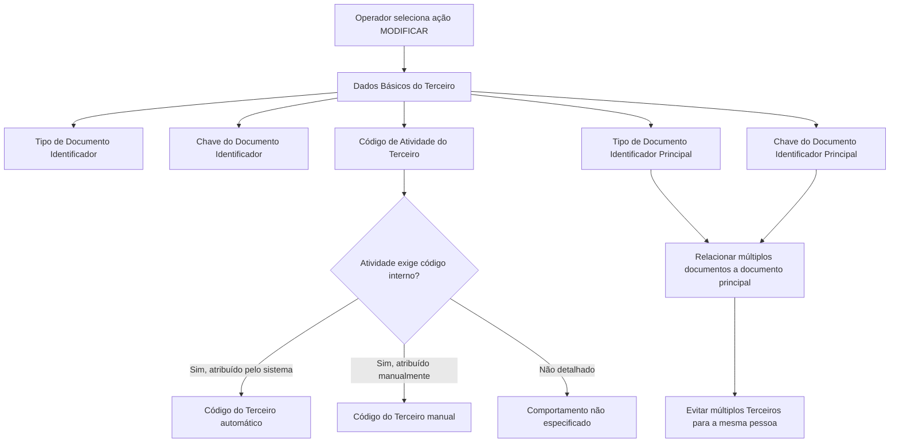

# Procedimento de Modificação de Dados Básicos do Terceiro Assegurado no Sistema Reef

## 1. Metadados do Documento
- **Arquivo de Origem:** `Não informado — conteúdo bruto fornecido na solicitação`
- **Tipo de Documento:** `Manual Operacional`
- **Domínio / Sistema:** `Reef / Gestão de Terceiros Assegurados`
- **Público-Alvo:** `Operação, analistas funcionais e administradores do sistema`
- **Data/Versão Identificada:** `Não identificada`

---

## 2. Resumo Executivo & Contexto de Negócio

O documento descreve a ação **MODIFICAR Dados Básicos do Terceiro**, utilizada para complementar ou alterar dados de identificação de um Terceiro Assegurado no sistema. O foco funcional é a manutenção dos atributos que identificam pessoas físicas ou jurídicas e a relação entre documentos de identificação.

A identificação do Terceiro é composta por tipo de documento, chave do documento, código de atividade e, quando aplicável, código interno do Terceiro. O documento cita como exemplos o Banco de Santander, identificado na Espanha por NIF com a chave `A-39000013`, e Juan Pérez Pérez, identificado por DNI com a chave `50818772`.

O procedimento também permite definir um **documento identificador principal**. Essa funcionalidade relaciona diversos documentos de um mesmo Terceiro a um único documento principal, evitando que o sistema trate documentos distintos — como NIF, passaporte e DNI — como Terceiros independentes.

O comportamento do código interno do Terceiro depende de configuração prévia associada à atividade do Terceiro. O sistema pode atribuir o código automaticamente ou exigir atribuição manual, conforme a atividade determine a obrigatoriedade de um código de Terceiro.

---

## 3. Arquitetura, Componentes & Tecnologias Envolvidas

O conteúdo fornecido menciona o sistema **Reef** e o módulo ou ação funcional de modificação de dados básicos de um Terceiro Assegurado. Não são detalhados componentes técnicos, APIs, microsserviços, bancos de dados, contratos JSON, protocolos, ambientes ou tecnologias de implementação.

Os elementos funcionais identificados são:

| Componente / Elemento | Função identificada |
| :--- | :--- |
| Sistema Reef | Sistema no qual são mantidos os dados de identificação do Terceiro. |
| Ação MODIFICAR | Ação que permite complementar ou modificar os dados de identificação do Terceiro Assegurado. |
| Estrutura de dados básicos | Estrutura que contém atributos de identificação e atributos de documento principal. |
| Catálogo de Terceiros | Origem do atributo de chave do documento identificador do Terceiro. |
| Colapsador | Elemento que apresenta o tipo de documento identificador. |
| Painel de dados básicos | Elemento que permite modificar a chave do documento identificador principal. |
| Configuração de atividade | Configuração que determina se o Terceiro deve possuir código interno e se a atribuição é automática ou manual. |



> **Nota de Análise:** O conteúdo não descreve arquitetura de software, integrações, APIs, persistência de dados ou mecanismos de autenticação do sistema Reef.

---

## 4. Regras de Negócio, Especificações Funcionais & Processos

### 4.1 Objetivo da ação

A ação **MODIFICAR Dados Básicos do Terceiro** permite complementar ou modificar os dados de identificação do Terceiro Assegurado no sistema.

### 4.2 Sequência de modificação

O documento determina que, da esquerda para a direita e de cima para baixo, os campos seguem a sequência de modificação do Terceiro no sistema.

### 4.3 Tipo de Documento Identificador

O atributo **Tipo Documento Identificador** é apresentado pelo colapsador e indica o tipo de documento usado para identificar uma pessoa física ou jurídica.

Os tipos de documento disponíveis dependem de configuração prévia no sistema. O documento não informa a lista completa dos tipos configuráveis.

### 4.4 Chave do Documento Identificador

O atributo **Clave del Documento Identificador** pertence ao catálogo e contém a chave do Terceiro.

Exemplos apresentados:

1. O Banco de Santander, como pessoa jurídica, é identificado no Reino da Espanha pelo tipo de documento **NIF** e pela chave documental `A-39000013`.
2. Juan Pérez Pérez, como pessoa física, é identificado no sistema pelo tipo de documento **DNI** e pela chave `50818772`.

### 4.5 Código de Atividade do Terceiro

A propriedade **Código de Actividad del Tercero** apresenta o código da atividade pela qual o Terceiro foi identificado.

O conteúdo não informa formatos, catálogo de atividades, regras de validação ou valores possíveis para esse código.

### 4.6 Código do Terceiro

O **Código do Terceiro** é o código interno do sistema atribuído ao Terceiro.

A atribuição do código depende da configuração da atividade do Terceiro:

| Condição configurada para a atividade do Terceiro | Regra para o Código do Terceiro |
| :--- | :--- |
| A atividade exige código interno e o sistema deve atribuí-lo | O sistema atribui o código interno automaticamente. |
| A atividade exige código de Terceiro | O código de Terceiro é atribuído manualmente. |

### 4.7 Tipo de Documento Identificador Principal

O atributo **Tipo Documento Identificador Principal** faz parte da estrutura de informação de dados básicos. O atributo permite modificar o tipo de documento principal ao qual serão relacionados o tipo e a chave de documento do Terceiro.

A finalidade é relacionar diversos documentos a um documento único principal.

### 4.8 Chave do Documento Identificador Principal

O atributo **Clave del Documento Identificador Principal** pertence ao painel de dados básicos. O atributo permite modificar a chave do documento principal ao qual serão relacionados o tipo e a chave de documento do Terceiro.

A finalidade é conectar diversos documentos a um único documento principal.

### 4.9 Regra de consolidação de documentos

O documento usa o contexto espanhol para demonstrar a consolidação de documentos de uma pessoa física:

1. Pessoas físicas na Espanha possuem um Número de Identificação Fiscal.
2. O tipo documental desse número é o **NIF**.
3. O NIF pode ser considerado o tipo de documento principal.
4. O código de passaporte, do tipo **PAS**, e o Documento Nacional de Identidade, do tipo **DNI**, podem ser relacionados ao NIF.
5. Essa relação evita que o sistema considere NIF, PAS e DNI como três Terceiros distintos.
6. O resultado esperado é a existência de um único Terceiro associado aos diversos documentos.

---

## 5. Tabelas de Parâmetros, Ambientes e Estruturas de Dados

| Item / Parâmetro | Descrição / Função | Tipo / Valores / Formato | Ambiente / Observações |
| :--- | :--- | :--- | :--- |
| Ação | Permite complementar ou modificar dados de identificação do Terceiro Assegurado. | `MODIFICAR` | Executada no sistema Reef. |
| Tipo Documento Identificador | Mostra o tipo de documento que identifica pessoa física ou jurídica. | Tipos configurados previamente no sistema. Exemplos: `NIF`, `DNI`. | Apresentado pelo colapsador. |
| Chave do Documento Identificador | Contém a chave documental do Terceiro. | Exemplos: `A-39000013`, `50818772`. | Atributo do catálogo. |
| Código de Atividade do Terceiro | Mostra o código da atividade pela qual o Terceiro foi identificado. | Formato e valores não detalhados. | Propriedade de identificação do Terceiro. |
| Código do Terceiro | Código interno atribuído ao Terceiro. | Automático ou manual, conforme configuração da atividade. | A atividade pode exigir código interno ou código de Terceiro. |
| Tipo Documento Identificador Principal | Define o tipo documental principal ao qual documentos do Terceiro serão relacionados. | Exemplo: `NIF`. | Atributo da estrutura de informação de dados básicos. |
| Chave do Documento Identificador Principal | Define a chave do documento principal para relacionamento de documentos. | Valor documental não especificado no exemplo de consolidação. | Atributo do painel de dados básicos. |
| NIF | Tipo de documento utilizado nos exemplos de identificação e como documento principal possível. | Exemplo de chave jurídica: `A-39000013`. | Referência ao Reino da Espanha. |
| DNI | Tipo de documento usado para identificar pessoa física. | Exemplo de chave: `50818772`. | Pode ser relacionado ao NIF principal. |
| PAS | Tipo documental referente a passaporte. | Código de passaporte não informado. | Pode ser relacionado ao NIF principal. |
| Ambiente | Não identificado. | Não aplicável. | O documento não apresenta URLs, servidores ou ambientes. |
| Rotas de log | Não identificadas. | Não aplicável. | O documento não apresenta logs ou caminhos de arquivos. |

---

## 6. Bateria de Perguntas & Respostas para RAG (FAQ Sintético)

### P1: Qual é o objetivo da ação MODIFICAR Dados Básicos do Terceiro no sistema Reef?
**R:** A ação MODIFICAR Dados Básicos do Terceiro permite complementar ou modificar os dados de identificação do Terceiro Assegurado no sistema Reef.

### P2: Como o sistema identifica uma pessoa física ou jurídica?
**R:** O sistema utiliza o atributo Tipo Documento Identificador, que apresenta o tipo de documento configurado previamente para identificar uma pessoa física ou jurídica, e a Chave do Documento Identificador, que contém a chave documental do Terceiro.

### P3: Quais exemplos de identificação documental são apresentados para pessoas jurídica e física?
**R:** Para pessoa jurídica, o documento apresenta o Banco de Santander, identificado no Reino da Espanha pelo tipo NIF e pela chave `A-39000013`. Para pessoa física, apresenta Juan Pérez Pérez, identificado pelo tipo DNI e pela chave `50818772`.

### P4: O que é o Código de Atividade do Terceiro?
**R:** O Código de Atividade do Terceiro é uma propriedade que mostra o código da atividade pela qual o Terceiro foi identificado. O conteúdo não detalha o catálogo, o formato ou os valores possíveis para esse código.

### P5: Quando o Código do Terceiro é atribuído automaticamente?
**R:** O Código do Terceiro é atribuído automaticamente pelo sistema quando a atividade do Terceiro está configurada para obrigar um código interno e para que esse código seja atribuído pelo sistema.

### P6: Quando o Código do Terceiro precisa ser informado manualmente?
**R:** O Código do Terceiro é atribuído manualmente quando a atividade do Terceiro obriga a existência de um código de Terceiro. O documento não detalha a interface, validação ou formato desse preenchimento manual.

### P7: Para que serve o Tipo Documento Identificador Principal?
**R:** O Tipo Documento Identificador Principal permite modificar o tipo de documento principal com o qual serão relacionados o tipo e a chave do documento do Terceiro. O objetivo é relacionar vários documentos a um único documento principal.

### P8: Qual é a função da Chave do Documento Identificador Principal?
**R:** A Chave do Documento Identificador Principal permite modificar a chave do documento principal à qual serão conectados o tipo e a chave de documento do Terceiro, consolidando vários documentos sob uma referência principal.

### P9: Como o NIF pode evitar a duplicidade de Terceiros no sistema?
**R:** O NIF pode ser definido como documento principal de uma pessoa física na Espanha. Dessa forma, documentos como passaporte, do tipo PAS, e Documento Nacional de Identidade, do tipo DNI, podem ser relacionados ao NIF, evitando que o sistema registre três Terceiros distintos para a mesma pessoa.

### P10: O documento informa APIs ou métodos HTTP para modificar dados de Terceiros?
**R:** Não. O documento descreve a ação funcional MODIFICAR e os atributos de dados básicos, mas não detalha APIs, métodos HTTP, contratos JSON, microsserviços ou integrações técnicas.

### P11: Em que ordem os campos devem ser modificados?
**R:** O documento informa que, da esquerda para a direita e de cima para baixo, os campos representam a sequência de modificação do Terceiro no sistema. A fonte não apresenta uma ordenação visual completa além dessa orientação.

### P12: Quais ambientes, URLs ou rotas de log são fornecidos?
**R:** Nenhum ambiente, URL, servidor, porta, variável de log ou rota de arquivo é fornecido no conteúdo analisado.

---

## 7. Glossário de Termos, Siglas & Conceitos-Chave

- **Reef:** Sistema mencionado como o ambiente em que os dados de identificação do Terceiro são mantidos e modificados.
- **Terceiro Assegurado:** Entidade cuja identificação é complementada ou modificada no sistema; pode ser pessoa física ou jurídica.
- **NIF:** Tipo de documento citado para identificação no Reino da Espanha e como possível documento principal de pessoa física.
- **DNI:** Tipo de documento citado para identificação de pessoa física; no exemplo, associado a Juan Pérez Pérez.
- **PAS:** Tipo documental citado como passaporte, que pode ser relacionado a um NIF principal.
- **Tipo Documento Identificador:** Atributo que mostra o tipo de documento usado para identificar uma pessoa física ou jurídica.
- **Chave do Documento Identificador:** Atributo que contém a chave documental do Terceiro.
- **Código de Atividade do Terceiro:** Código que identifica a atividade pela qual o Terceiro foi identificado.
- **Código do Terceiro:** Código interno do sistema associado ao Terceiro, atribuído automaticamente ou manualmente conforme a configuração da atividade.
- **Documento Identificador Principal:** Documento que funciona como referência para relacionar múltiplos documentos de um mesmo Terceiro.
- **Colapsador:** Elemento mencionado como o componente que apresenta o Tipo Documento Identificador.
- **Catálogo:** Elemento que contém a Chave do Documento Identificador.
- **Painel de dados básicos:** Elemento que permite modificar a Chave do Documento Identificador Principal.

---

## 8. Notas Críticas, Riscos & Limitações

- O conteúdo não informa a versão, data, autor formal ou nome do arquivo de origem.
- O conteúdo não apresenta especificações de APIs, métodos HTTP, contratos de integração, schemas JSON, bancos de dados, eventos ou microsserviços.
- Não há descrição de mecanismos de validação para tipos de documento, chaves documentais, códigos de atividade ou códigos de Terceiro.
- Não são informados fluxos de aprovação, perfis de acesso, matriz de permissões ou trilha de auditoria para a ação MODIFICAR.
- Não são apresentados ambientes, URLs, servidores, portas, configurações de deploy, rotas de logs ou procedimentos de suporte operacional.
- A lista completa de tipos de documento configuráveis não é fornecida.
- A regra para atividades que não exigem código interno ou código de Terceiro não está detalhada.
- **Nota de Análise:** O documento descreve a relação funcional entre documentos de identificação, mas não detalha como o sistema detecta, impede ou resolve registros duplicados além do uso de documento principal.
- **Nota de Análise:** O documento usa exemplos do Reino da Espanha para NIF, DNI e PAS, sem afirmar que essas regras ou documentos sejam aplicáveis a outros países.

---

## 9. Conteúdo Bruto Estruturado (Referência Fiel)

```text
--- [PÁGINA 1 DE 2] ---

MODIFICAR Datos Básicos del Tercero
Objetivo
Esta acción permite complementar ó modicar los datos de identicación del Tercero Asegurado en el sistema.
Posibles Acciones
 MODIFICAR ( )
Datos Básicos
De Izquierda a Derecha y de Arriba hacia Abajo, los siguientes campos marcan la secuencia de modicación del Tercero en el sistema.
Tipo Documento Identicador
Este Atributo del colapsador muestra el tipo de documento con el que se identica a la persona física o jurídica de acuerdo con los tipos de
documentos que hayan sido congurados en el sistema previamente.
Clave del Documento Identicador
Este Atributo del catálogo contiene la clave del Tercero.
A modo de ejemplos:
El Banco de Santander como persona jurídica se identica en el Reino de España con el Tipo de Documento NIF con clave de documento
A-39000013
Juan Pérez Pérez como persona física se identicará en el sistema con el Tipo de Documento DNI cuya clave es 50818772
Código de Actividad del Tercero
Esta propiedad muestra el código de la Actividad con la que se identicó al Tercero.
Código del Tercero
Documentation / DOCUMENTACIÓN Reef
DOCUMENTACIÓN Reef
Mapfredocument
DOCUMENTACIÓN Reef
Owner
user:agonzalez_mapfre.com
Lifecycle
Approved Source
 / 
 VL
Buscar Inicio Soluciones Arquitecturas APIs Componentes Cloud Documentación Zeus Reef Ayuda
ES


--- [PÁGINA 2 DE 2] ---

Este dato será el código interno del sistema que se asignará al Tercero automáticamente caso que se haya congurado que la actividad del
tercero obligue a tener un código interno y este sea asignado por el Sistema, o manualmente caso que la actividad del Tercero obligue a tener
un código de Tercero.
Tipo Documento Identicador Principal (  )
Este Atributo de la estructura de información de datos básicos permite modicar el tipo de documento principal con el que se va a relacionar
el tipo y la clave del documento del Tercero pudiendo de esta manera relacionar diversos documentos con uno único.
Clave del Documento Identicador Principal ( )
Por último, este Atributo del panel de datos básicos permite modicar la clave del documento principal con el que se va a relacionar el tipo y
la clave del documento del Tercero pudiendo de esta manera conectar diversos documentos con un documento principal.
A modo de ejemplo: Puesto que en España todas las personas físicas tienen asignada un Número de Identicación Fiscal cuyo tipo de
documento es el NIF, es factible considerarlo como Tipo de Documento Principal y relacionar así tanto el código del pasaporte (PAS) como el
Documento Nacional de Identidad (DNI) del Tercero con el NIF, evitando de esta manera considerar que el Sistema contiene tres Terceros
distintos frente a tener uno único.
```
