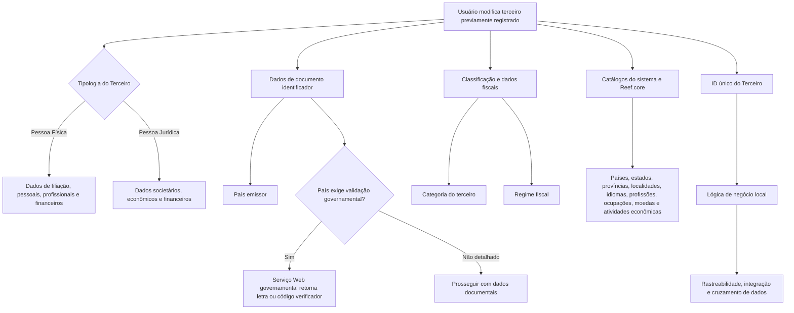

# Gestão e Modificação de Dados de Pessoa Física/Jurídica de Terceiros no Reef.core

## 1. Metadados do Documento
- **Arquivo de Origem:** Não identificado no conteúdo fornecido
- **Tipo de Documento:** Manual Operacional
- **Domínio / Sistema:** Reef.core / MAPFRE / Gestão de Terceiros
- **Público-Alvo:** Analistas funcionais, operação, desenvolvedores e equipes de negócio
- **Data/Versão Identificada:** Não identificada

---

## 2. Resumo Executivo & Contexto de Negócio

O documento descreve a tela **“MODIFICAR Datos Persona Física/Jurídica del Tercero”**, destinada a complementar ou alterar informações previamente registradas de um terceiro no sistema Reef.core. O terceiro pode ser classificado como **Pessoa Física** ou **Pessoa Jurídica**, e diversos atributos são condicionados à tipologia selecionada.

A finalidade funcional inclui identificar Pessoas Politicamente Expostas, completar dados de documentos identificadores, classificar terceiros, registrar dados econômicos, fiscais, societários, profissionais e de filiação. Os atributos sem indicação expressa de restrição são aplicáveis tanto a Pessoas Físicas quanto a Pessoas Jurídicas.

O documento destaca o papel do **ID único do Terceiro** para rastreabilidade, integração e cruzamento de dados entre sistemas. Esse identificador é atribuído automaticamente por uma lógica de negócio local quando a configuração corporativa exigir identificação inequívoca em aplicações que gerenciam informações de terceiros. O ID único não substitui o código interno do terceiro utilizado pelo Reef.core.

A tela também suporta controles de qualidade de dados documentais, incluindo indicador de comprovação, data de comprovação e observações sobre o método usado para validação. Alguns atributos dependem de catálogos mestres ou catálogos locais do sistema, como países, estados, províncias, localidades, idiomas, profissões, ocupações, moedas, regimes fiscais e atividades econômicas.

---

## 3. Arquitetura, Componentes & Tecnologias Envolvidas

O conteúdo fornecido não descreve uma arquitetura técnica de infraestrutura, APIs, microsserviços, protocolos, bancos de dados, URLs, ambientes ou integrações detalhadas. A arquitetura identificável é funcional: uma tela de modificação de dados de terceiros no **Reef.core**, apoiada por catálogos mestres e configuração de parâmetros da companhia.

### Componentes e entidades citados

| Componente / Entidade | Papel identificado |
| :--- | :--- |
| Reef.core | Sistema que mantém o código interno do terceiro e disponibiliza catálogos mestres utilizados pelos atributos da tela. |
| Tela “MODIFICAR Datos Persona Física/Jurídica del Tercero” | Interface para complementar ou modificar dados de terceiros previamente registrados. |
| Terceiro | Entidade de negócio tratada pela tela; pode ser Pessoa Física ou Pessoa Jurídica. |
| Pessoa Física | Tipologia aplicável a atributos pessoais, familiares, profissionais, financeiros e de residência. |
| Pessoa Jurídica | Tipologia aplicável a atributos societários, econômicos, de constituição e perfis financeiros. |
| Catálogo de Países | Fonte de valores possíveis para país emissor e país de nascimento/constituição. |
| Catálogo de Estados | Fonte de valores possíveis para estado de nascimento/constituição. |
| Catálogo de Províncias | Fonte de valores possíveis para província de nascimento/constituição. |
| Catálogo de Localidades | Fonte de valores possíveis para localidade de nascimento/constituição. |
| Catálogo Mestre de Idiomas | Fonte de valores possíveis para preferência de idioma. |
| Catálogo Mestre de Profissões | Catálogo Reef.core para profissão associada a Pessoa Física. |
| Catálogo Mestre de Ocupações | Catálogo Reef.core para ocupação associada a Pessoa Física. |
| Catálogo de Moedas | Fonte de valores possíveis para a moeda de rendimentos mensais estimados. |
| Catálogo Mestre de Atividades Econômicas | Fonte de valores para tipo de atividade econômica. |
| Configuração de parâmetros da companhia | Define, entre outras condições, a necessidade de identificar terceiros de forma inequívoca. |
| Serviço Web governamental | Serviço citado para determinados países, utilizado para devolver letra ou código verificador de documento identificador. |



> **Nota de Análise:** O documento menciona um Serviço Web provido por governos de determinados países, mas não detalha protocolo, URL, métodos HTTP, contratos de integração, tratamento de erro ou países participantes.

---

## 4. Regras de Negócio, Especificações Funcionais & Processos

### 4.1 Escopo da operação de modificação

1. A tela permite complementar ou modificar informações já registradas de uma Pessoa Física ou Pessoa Jurídica.
2. A tela pode ser utilizada para:
   - identificar ou não um terceiro como Pessoa Politicamente Exposta;
   - complementar dados específicos do documento identificador;
   - classificar o terceiro.
3. Quando não houver indicação expressa em contrário, um atributo pode ser utilizado tanto para Pessoas Físicas quanto para Pessoas Jurídicas.
4. A sequência de modificação é apresentada no documento como leitura da esquerda para a direita e de cima para baixo.

### 4.2 Tipologia do terceiro

1. A marca de verificação **Pessoa Física ou Pessoa Jurídica** indica a tipologia do terceiro.
2. A marca é relevante em atividades configuradas para associação tanto com pessoas físicas quanto com entidades jurídicas.
3. Diversos campos possuem regras condicionais explícitas à tipologia:
   - atributos pessoais, familiares, profissionais e de renda são direcionados à Pessoa Física;
   - atributos societários, de constituição, atividade econômica e perfil financeiro são direcionados à Pessoa Jurídica;
   - alguns atributos são aplicáveis às duas tipologias.

### 4.3 Identificador único do terceiro

1. O atributo **ID único do Terceiro** contém o código de identificador único atribuído automaticamente ao terceiro.
2. A atribuição depende de a configuração dos parâmetros da companhia definir a necessidade de identificar inequivocamente terceiros em todas as aplicações que gerenciam suas informações.
3. A atribuição ocorre por execução de uma lógica de negócio local.
4. O objetivo do ID único é suportar:
   - rastreabilidade;
   - integração;
   - cruzamento de dados entre sistemas.
5. O ID único não substitui o atributo que identifica o código interno do terceiro no Reef.core.

### 4.4 Dados de documento identificador e validação

1. **Pessoa Politicamente Exposta:** a ativação da marca altera o comportamento do sistema para permitir o registro dos dados específicos da pessoa no painel correspondente.
2. **Data de Emissão:** registra a data de emissão do documento do terceiro.
3. **Data de Caducidade:** registra a data de validade do documento do terceiro.
4. **País Emissor:** recebe o código do país emissor do documento de acordo com o catálogo de países existente no sistema.
5. **Verificador do Documento Identificador:**
   - em determinados países, o documento do terceiro requer chamada a um Serviço Web provido pelo governo;
   - o Serviço Web devolve uma letra ou código verificador;
   - a letra ou código verificador deve ser considerada e usada posteriormente nas operações com o terceiro.
6. **Marca de Comprovação:** permite considerar, nos processos da entidade, se o documento foi revisado e verificado, em relação à qualidade dos dados do terceiro.
7. **Data de Comprovação:** quando a marca de comprovação indicar que o documento foi revisado e comprovado, registra a data da ação.
8. **Observações:** quando o documento tiver sido revisado e validado, permite registrar texto aclaratório ou observações sobre o método empregado na comprovação.

### 4.5 Classificação, tributação e condição profissional

1. **Categoria do Terceiro:** contém o código da categoria atribuída ao terceiro, conforme catálogo do sistema.
2. **Regime Fiscal:** contém o código do regime fiscal do terceiro, conforme catálogo mestre do Reef.core.
3. **Por Conta Própria:** identifica um terceiro como trabalhador autônomo quando:
   - o terceiro é Pessoa Física;
   - exerce atividade econômica de forma independente e direta;
   - não está sujeito a contrato de trabalho;
   - pode utilizar serviço remunerado de outras pessoas para realizar a atividade, atuando como empregador.

### 4.6 Dados econômicos e societários

1. **Alias do Terceiro:** permite registrar apelido ou sobrenome, independentemente de o terceiro ser Pessoa Física ou Pessoa Jurídica.
2. **Sociedade para Consolidação em Grupo MAPFRE - GL:** permite registrar o código societário do terceiro jurídico para consolidação em processos do Grupo MAPFRE; o documento declara aplicabilidade tanto para Pessoas Físicas quanto Jurídicas.
3. **Atividade Econômica:** contém classificação de atividades econômicas de terceiros jurídicos configurada pela entidade seguradora.
4. **Tipo de Atividade Econômica:** contém código do tipo de atividade econômica conforme catálogo mestre de Atividades Econômicas.
5. **Folio Registral:** identifica e diferencia cada Pessoa Jurídica em relação a documentos similares.
6. **Data de Constituição:** registra a data em que o terceiro jurídico foi constituído como sociedade.

### 4.7 Dados de filiação e identificação nominal

1. O bloco **Persona** identifica dados de filiação do segurado conforme a tipologia do terceiro.
2. **Tratamento:** contém tratamento de respeito anteposto ao nome do terceiro.
3. **Posposto:** contém código posterior ao nome próprio para indicar uma condição:
   - para Pessoas Físicas, pode indicar que alguém é mais jovem ou mais velho que familiar de mesmo nome;
   - para Pessoas Jurídicas, pode representar forma societária.
4. **Nome:** contém o nome para Pessoa Física ou a razão social para Pessoa Jurídica.
5. **Segundo Nome:** aplicável à Pessoa Física, contém segundo e nomes sucessivos.
6. **Primeiro Apelido:** aplicável à Pessoa Física.
7. **Segundo Apelido:** aplicável à Pessoa Física.
8. **Apelido de Casado/a:** aplicável à Pessoa Física nos países em que a prática seja comum.
9. **Estado Civil:** aplicável à Pessoa Física e contém o código de estado civil.
10. **Nome e Apelidos do Cônjuge:** aplicável quando o terceiro for Pessoa Física e o estado civil for coerente com o uso desse campo.

### 4.8 Dados pessoais, geográficos e de comunicação

1. **Data de Nascimento:** aplicável à Pessoa Física.
2. **Data de Falecimento:** aplicável à Pessoa Física.
3. **Data de Início de Residência:** aplicável à Pessoa Física.
4. **Nacionalidade:** aplicável à Pessoa Física.
5. **Tipo de Nacionalidade:** aplicável à Pessoa Física, segundo codificação local da entidade seguradora para uso nos processos internos.
6. **País de Nascimento/Constituição:** código de país de nascimento da pessoa ou constituição da Pessoa Jurídica, conforme catálogo de países.
7. **Estado de Nascimento/Constituição:** código de estado correspondente, conforme catálogo de estados.
8. **Província de Nascimento/Constituição:** código de província correspondente, conforme catálogo de províncias.
9. **Localidade de Nascimento/Constituição:** código de localidade correspondente, conforme catálogo de localidades.
10. **Idioma:** preferência de idioma para comunicações da entidade seguradora com o terceiro, conforme catálogo mestre de Idiomas.

### 4.9 Dados profissionais, educacionais e financeiros da Pessoa Física

1. **Gênero:** aplicável à Pessoa Física.
2. **Porcentagem de Deficiência:** aplicável à Pessoa Física, devendo indicar o percentual de deficiência conforme tabelas de baremos e graus de incapacidade do país.
3. **Profissão:** código da profissão da Pessoa Física conforme catálogo mestre de Profissões do Reef.core.
4. **Ocupação:** código da ocupação da Pessoa Física conforme catálogo mestre de Ocupações do Reef.core.
5. **Nome da Empresa:** permite informar o nome da empresa em que a Pessoa Física está ocupada.
6. **Tipo de Empresa:** permite informar o tipo de empresa conforme uma das tipologias definidas.
7. **Tipo de Emprego:** permite distinguir assalariado de autônomo.
8. O autônomo é descrito como pessoa física que exerce habitual, pessoal, direta e independentemente atividade econômica ou profissional com finalidade lucrativa, fora da direção e organização de outra pessoa, podendo ou não empregar trabalhadores.
9. **Rendimentos Mensais Estimados:** registra o valor dos rendimentos mensais da Pessoa Física.
10. **Moeda:** contém o código da moeda na qual os rendimentos mensais estimados foram expressos, conforme catálogo de moedas.
11. **Nível de Estudos:** contém código do nível de estudos da Pessoa Física.
12. **Titulação:** contém código da titulação da Pessoa Física.

### 4.10 Perfis financeiros e obrigações da Pessoa Jurídica

1. **Perfil Financeiro Atividade Principal:** aplicável à Pessoa Jurídica; contém código de perfil financeiro relativo à atividade econômica principal, conforme catálogo mestre.
2. **Perfil Financeiro Atividades Secundárias:** aplicável à Pessoa Jurídica; contém código de perfil financeiro relativo a atividades econômicas secundárias, conforme catálogo mestre.
3. **Código Tipo Sociedade:** aplicável à Pessoa Jurídica; contém tipo de código societário conforme catálogo mestre do sistema.
4. **Obrigações Fiscais em outros Países:** quando a marca está ativada, o sistema permite inserir dados dos países em que o terceiro possa ter obrigações fiscais.
5. **Número de Filhos:** aplicável à Pessoa Física e contém o número de descendentes do terceiro.

---

## 5. Tabelas de Parâmetros, Ambientes e Estruturas de Dados

### 5.1 Atributos gerais, documentais e fiscais

| Item / Parâmetro | Descrição / Função | Tipo / Valores / Formato | Ambiente / Observações |
| :--- | :--- | :--- | :--- |
| Pessoa Física ou Pessoa Jurídica | Indica a tipologia do terceiro. | Marca de verificação. | Aplicável quando a atividade permite associação a ambas as tipologias. |
| ID único do Terceiro | Código de identificador único atribuído automaticamente. | Código. | Depende da configuração de parâmetros da companhia e lógica de negócio local. Não substitui o código interno Reef.core. |
| Pessoa Politicamente Exposta | Habilita a inserção de dados específicos da pessoa no painel correspondente. | Marca de verificação. | Comportamento do sistema é modulado pela ativação. |
| Data de Emissão | Data de emissão do documento do terceiro. | Data. | Documento identificador. |
| Data de Caducidade | Data de validade do documento do terceiro. | Data. | Documento identificador. |
| País Emissor | Código do país emissor do documento identificador. | Código de país. | Valores do catálogo de Países do sistema. |
| Verificador do Documento Identificador | Letra ou código verificador retornado por serviço governamental em determinados países. | Letra ou código. | Deve ser usado posteriormente nas operações com o terceiro. |
| Marca de Comprovação | Indica se o documento foi revisado e verificado. | Marca de verificação. | Relacionado à qualidade dos dados. |
| Data de Comprovação | Data em que a revisão e comprovação foram realizadas. | Data. | Aplicável quando a marca de comprovação indicar documento revisado e comprovado. |
| Observações | Texto sobre o método empregado para comprovação do documento. | Texto. | Aplicável quando o documento foi revisado e validado. |
| Categoria do Terceiro | Código da categoria atribuída ao terceiro. | Código. | Valores do catálogo do sistema. |
| Regime Fiscal | Código do regime fiscal do terceiro. | Código. | Valores do catálogo mestre do Reef.core. |
| Por Conta Própria | Identifica trabalhador autônomo. | Dado / marca de identificação. | Aplicável a Pessoa Física em atividade independente e direta. |

### 5.2 Atributos econômicos e societários

| Item / Parâmetro | Descrição / Função | Tipo / Valores / Formato | Ambiente / Observações |
| :--- | :--- | :--- | :--- |
| Alias do Terceiro | Apelido ou sobrenome do terceiro. | Texto. | Pessoa Física ou Pessoa Jurídica. |
| Sociedade para Consolidação em Grupo MAPFRE - GL | Código societário para consolidação nos processos do Grupo MAPFRE. | Código societário. | O documento declara aplicação para Pessoas Físicas e Jurídicas. |
| Atividade Econômica | Classificação das atividades econômicas de terceiros jurídicos. | Classificação. | Configurada pela entidade seguradora. |
| Tipo de Atividade Econômica | Código do tipo de atividade econômica. | Código. | Catálogo mestre de Atividades Econômicas. |
| Folio Registral | Número que identifica e diferencia Pessoa Jurídica de documentos similares. | Número / identificador. | Pessoa Jurídica. |
| Data de Constituição | Data de constituição da sociedade. | Data. | Pessoa Jurídica. |
| Perfil Financeiro Atividade Principal | Perfil financeiro relativo à atividade econômica principal. | Código. | Pessoa Jurídica; valores do catálogo mestre. |
| Perfil Financeiro Atividades Secundárias | Perfil financeiro relativo às atividades econômicas secundárias. | Código. | Pessoa Jurídica; valores do catálogo mestre. |
| Código Tipo Sociedade | Tipo de código societário. | Código. | Pessoa Jurídica; valores do catálogo mestre. |
| Obrigações Fiscais em outros Países | Habilita inserção de países onde existam obrigações fiscais. | Marca de verificação. | Ao ser ativada, adapta o comportamento do sistema. |

### 5.3 Atributos de identificação e filiação

| Item / Parâmetro | Descrição / Função | Tipo / Valores / Formato | Ambiente / Observações |
| :--- | :--- | :--- | :--- |
| Tratamento | Tratamento de respeito anteposto ao nome. | Código. | Exemplos: 001 Don, 002 Doña, 003 Señor, 004 Señora, 005 Ilmo., 006 Excmo. |
| Posposto | Código posterior ao nome para indicar determinada condição. | Código. | Pessoa Física: 001 Junior, 002 Senior. Pessoa Jurídica: 003 U.T.E., 004 S.A., 005 Ltd., 006 G.M.B.H. |
| Nome | Nome da Pessoa Física ou razão social da Pessoa Jurídica. | Texto. | Conforme a tipologia do terceiro. |
| Segundo Nome | Segundo e sucessivos nomes do terceiro. | Texto. | Pessoa Física. |
| Primeiro Apelido | Primeiro sobrenome do terceiro. | Texto. | Pessoa Física. |
| Segundo Apelido | Segundo sobrenome do terceiro. | Texto. | Pessoa Física. |
| Apelido de Casado/a | Sobrenome de casado/a do terceiro. | Texto. | Pessoa Física; aplicável em países onde a prática é difundida. |
| Estado Civil | Código do estado civil. | Código. | Pessoa Física. |
| Nome e Apelidos do Cônjuge | Nome e sobrenomes do cônjuge. | Texto. | Pessoa Física; exige coerência com o estado civil. |
| Número de Filhos | Número de descendentes do terceiro. | Número. | Pessoa Física. |

### 5.4 Atributos pessoais, geográficos e de comunicação

| Item / Parâmetro | Descrição / Função | Tipo / Valores / Formato | Ambiente / Observações |
| :--- | :--- | :--- | :--- |
| Data de Nascimento | Data de nascimento. | Data. | Pessoa Física. |
| Data de Falecimento | Data de falecimento. | Data. | Pessoa Física. |
| Data de Início de Residência | Data inicial de residência. | Data. | Pessoa Física. |
| Nacionalidade | Nacionalidade do terceiro. | Código / valor de catálogo. | Pessoa Física. |
| Tipo de Nacionalidade | Código local do tipo de nacionalidade. | Código. | Pessoa Física; codificação local da entidade seguradora. |
| País de Nascimento/Constituição | Código do país de nascimento ou de constituição. | Código de país. | Pessoa Física ou Pessoa Jurídica; catálogo de países. |
| Estado de Nascimento/Constituição | Código do estado de nascimento ou constituição. | Código de estado. | Pessoa Física ou Pessoa Jurídica; catálogo de estados. |
| Província de Nascimento/Constituição | Código da província de nascimento ou constituição. | Código de província. | Pessoa Física ou Pessoa Jurídica; catálogo de províncias. |
| Localidade de Nascimento/Constituição | Código da localidade de nascimento ou constituição. | Código de localidade. | Pessoa Física ou Pessoa Jurídica; catálogo de localidades. |
| Idioma | Preferência de idioma para comunicação da entidade seguradora. | Código de idioma. | Catálogo mestre de Idiomas do sistema. |
| Gênero | Gênero do terceiro. | Dado de pessoa. | Pessoa Física. |
| Porcentagem de Deficiência | Percentual de deficiência. | Percentual. | Pessoa Física; segundo tabelas de baremos e graus de incapacidade do país. |

### 5.5 Atributos profissionais, educacionais e financeiros

| Item / Parâmetro | Descrição / Função | Tipo / Valores / Formato | Ambiente / Observações |
| :--- | :--- | :--- | :--- |
| Profissão | Profissão associada ao terceiro. | Código. | Pessoa Física; catálogo mestre de Profissões do Reef.core. |
| Ocupação | Ocupação associada ao terceiro. | Código. | Pessoa Física; catálogo mestre de Ocupações do Reef.core. |
| Nome da Empresa | Nome da empresa onde o terceiro está ocupado. | Texto. | Pessoa Física. |
| Tipo de Empresa | Tipo da empresa onde o terceiro está ocupado. | Tipo / código. | Pessoa Física; conforme tipologias definidas. |
| Tipo de Emprego | Distingue assalariado de autônomo. | Tipo / código. | Pessoa Física. |
| Rendimentos Mensais Estimados | Valor mensal de rendimentos do terceiro. | Valor monetário. | Pessoa Física. |
| Moeda | Código da moeda dos rendimentos mensais estimados. | Código de moeda. | Pessoa Física; catálogo de moedas do sistema. |
| Nível de Estudos | Nível educacional do terceiro. | Código. | Pessoa Física. |
| Titulação | Titulação educacional do terceiro. | Código. | Pessoa Física. |

---

## 6. Bateria de Perguntas & Respostas para RAG (FAQ Sintético)

### P1: Qual é o objetivo da tela “MODIFICAR Datos Persona Física/Jurídica del Tercero” no Reef.core?
**R:** A tela permite complementar ou modificar informações de terceiros previamente registrados. O terceiro pode ser Pessoa Física ou Pessoa Jurídica, e a funcionalidade contempla identificação de Pessoa Politicamente Exposta, dados de documento identificador, classificação, dados fiscais, econômicos, societários, pessoais, profissionais e financeiros.

### P2: O ID único do Terceiro substitui o código interno do terceiro no Reef.core?
**R:** Não. O documento estabelece expressamente que o ID único do Terceiro não substitui a funcionalidade do atributo que identifica o código interno do terceiro utilizado no Reef.core. O ID único é atribuído automaticamente por lógica de negócio local para rastreabilidade, integração e cruzamento de dados entre sistemas.

### P3: Em que condição o sistema atribui automaticamente o ID único do Terceiro?
**R:** A atribuição ocorre quando os parâmetros da companhia definirem a necessidade de identificar terceiros de forma inequívoca em todas as aplicações que gerenciam suas informações. O código é atribuído automaticamente por meio de uma lógica de negócio local.

### P4: O que acontece quando a marca de Pessoa Politicamente Exposta é ativada?
**R:** A ativação da marca modula o comportamento do sistema e permite inserir os dados específicos da pessoa no painel de informação correspondente.

### P5: Como funciona o verificador do documento identificador para determinados países?
**R:** Em países onde o documento do terceiro exige validação externa, deve ser realizada uma chamada a um Serviço Web provido pelo governo. Esse Serviço Web devolve uma letra ou código verificador, que deve ser considerado e utilizado posteriormente nas operações realizadas com o terceiro.

### P6: Quais informações são registradas para comprovar a revisão de um documento de terceiro?
**R:** A tela possui Marca de Comprovação para indicar se o documento foi revisado e verificado, Data de Comprovação para registrar quando a ação ocorreu e Observações para registrar texto aclaratório sobre o método empregado, quando o documento foi revisado e validado.

### P7: Quais campos são específicos de Pessoa Jurídica?
**R:** O documento associa à Pessoa Jurídica os campos Atividade Econômica, Folio Registral, Data de Constituição, Perfil Financeiro da Atividade Principal, Perfil Financeiro das Atividades Secundárias e Código Tipo Sociedade. Além disso, os campos de nascimento/constituição atendem tanto à Pessoa Física quanto à Pessoa Jurídica conforme a tipologia.

### P8: Como o sistema trata obrigações fiscais em outros países?
**R:** Quando a marca “Obligaciones Fiscales en otros Países” está ativada, o comportamento do sistema é adaptado para permitir o registro de dados dos países nos quais o terceiro possa ter obrigações fiscais.

### P9: Quais dados profissionais podem ser registrados para uma Pessoa Física?
**R:** Para Pessoa Física, podem ser registrados profissão, ocupação, nome da empresa, tipo de empresa, tipo de emprego, rendimentos mensais estimados, moeda dos rendimentos, nível de estudos e titulação. Profissão e ocupação dependem dos catálogos mestres de Profissões e Ocupações do Reef.core.

### P10: Como o documento define um trabalhador por conta própria ou autônomo?
**R:** O trabalhador por conta própria é uma Pessoa Física que realiza atividade econômica de modo independente e direto, sem estar sujeita a contrato de trabalho. A definição também admite o uso de serviços remunerados de outras pessoas. O tipo de emprego também diferencia autônomos de assalariados.

### P11: Quais catálogos são usados para os dados geográficos do terceiro?
**R:** País de Nascimento/Constituição utiliza o catálogo de países; Estado de Nascimento/Constituição utiliza o catálogo de estados; Província de Nascimento/Constituição utiliza o catálogo de províncias; e Localidade de Nascimento/Constituição utiliza o catálogo de localidades existente no sistema.

### P12: Qual é a finalidade do campo Sociedade para Consolidação em Grupo MAPFRE - GL?
**R:** O campo permite registrar o código societário do terceiro jurídico para consolidação nos processos do Grupo MAPFRE. O conteúdo fornecido afirma que o dado pode ser utilizado tanto para Pessoas Físicas quanto para Pessoas Jurídicas.

---

## 7. Glossário de Termos, Siglas & Conceitos-Chave

- **Reef.core:** Sistema citado como fonte do código interno do terceiro e de catálogos mestres, incluindo regimes fiscais, profissões e ocupações.
- **Terceiro:** Entidade previamente registrada no sistema, que pode ser Pessoa Física ou Pessoa Jurídica.
- **Pessoa Física:** Tipologia de terceiro associada a dados pessoais, familiares, profissionais, financeiros e de residência.
- **Pessoa Jurídica:** Tipologia de terceiro associada a dados societários, econômicos, de constituição e perfil financeiro.
- **Pessoa Politicamente Exposta:** Classificação controlada por marca de verificação que habilita o registro de dados específicos no painel correspondente.
- **ID único do Terceiro:** Identificador automático, atribuído por lógica de negócio local para rastreabilidade, integração e cruzamento de dados entre sistemas.
- **Folio Registral:** Número utilizado para identificar e diferenciar uma Pessoa Jurídica de documentos similares.
- **GL:** Sigla presente em “Sociedad para Consolidación en Grupo MAPFRE - GL”; o significado da sigla não é detalhado no conteúdo fornecido.
- **U.T.E.:** Valor exemplificado como posposto de Pessoa Jurídica; a expansão da sigla não é detalhada no conteúdo fornecido.
- **S.A.:** Valor exemplificado como posposto de Pessoa Jurídica; a expansão não é detalhada no conteúdo fornecido.
- **Ltd.:** Valor exemplificado como posposto de Pessoa Jurídica; a expansão não é detalhada no conteúdo fornecido.
- **G.M.B.H:** Valor exemplificado como posposto de Pessoa Jurídica; a expansão não é detalhada no conteúdo fornecido.
- **Catálogo mestre:** Fonte controlada de valores possíveis utilizada por atributos do sistema.
- **Marca de Comprovação:** Indicador de que o documento do terceiro foi revisado e verificado.
- **Por Conta Própria:** Condição usada para identificar Pessoa Física que realiza atividade econômica de forma independente e direta.

---

## 8. Notas Críticas, Riscos & Limitações

- O documento não identifica o arquivo de origem, data, versão, autor técnico ou histórico de revisões.
- Não há detalhamento de arquitetura física ou lógica, microsserviços, APIs, bancos de dados, mecanismos de autenticação, ambientes, URLs, portas, logs ou contratos de integração.
- O Serviço Web governamental é citado somente de modo funcional. Não há especificação dos países envolvidos, condições de disparo, tecnologia, timeout, segurança, tratamento de erros ou contrato de resposta.
- Diversos atributos dependem de catálogos do sistema ou de codificação local da entidade seguradora. O documento não apresenta os conjuntos completos de valores permitidos.
- O documento apresenta exemplos de códigos para Tratamento e Posposto, mas não fornece as listas completas.
- O campo “Sociedade para Consolidação em Grupo MAPFRE - GL” é descrito como código societário de terceiro jurídico, porém o texto declara aplicação tanto para Pessoas Físicas quanto Jurídicas sem detalhar a regra de consistência.
- O conteúdo não descreve regras de obrigatoriedade, cardinalidade, formato técnico, tamanho máximo, validações de campo, permissões de usuário ou trilha de auditoria.
- **Nota de Análise:** O documento descreve regras funcionais de tela, mas não detalha métodos HTTP, contratos JSON, eventos, persistência ou serviços internos expostos pelo Reef.core.

---

## 9. Conteúdo Bruto Estruturado (Referência Fiel)

```text
--- [PÁGINA 1 DE 7] ---

MODIFICAR Datos Persona Física/Jurídica del Tercero
Objetivo
Esta pantalla permite Complementar o Modicar la información de la Persona Física o Jurídica que se encontrara registrada previamente,
para:
Identicar o no al Tercero como Persona Políticamente Expuesta.
Complementar la información especíca del Documento identicador del Tercero.
Clasicar al Tercero.
Si no se especica o indica expresamente, los Atributos se emplearán tanto en Personas Físicas como en Personas Jurídicas
Posibles Acciones
 MODIFICAR ( )
Datos Persona Persona Física/Jurídica
De Izquierda a Derecha y de Arriba hacia Abajo, los siguientes campos marcan la secuencia de modicación del Tercero en el sistema.
Persona Física o Persona Jurídica
Esta marca de vericación, en aquellas actividades en las que se haya congurado la posibilidad de estar asociada tanto para personas
físicas como para entidades jurídicas, indicará la tipología del Tercero.
ID único del Tercero ( )
Siempre y cuando se haya denido en la conguración de los parámetros de la compañía la necesidad de identicar inequívocamente a los
Terceros en todas las aplicaciones que gestionen su información, este atributo contendrá el código del Identicador único que se asignará
automáticamente al Tercero mediante la ejecución de una lógica de negocio local, permitiendo de esta manera la trazabilidad, integración y
cruce de datos entre los sistemas.
Documentation / DOCUMENTACIÓN Reef
DOCUMENTACIÓN Reef
Mapfredocument
DOCUMENTACIÓN Reef
Owner
user:agonzalez_mapfre.com
Lifecycle
Approved Source
 / 
 VL
Buscar Inicio Soluciones Arquitecturas APIs Componentes Cloud Documentación Zeus Reef Ayuda
ES


--- [PÁGINA 2 DE 7] ---

Este atributo NO SUSTITUYE en ningún caso la funcionalidad soportada por el atributo que identica el código del tercero que es de uso
interno en Reef.core.
Persona Políticamente Expuesta ( )
La activación de esta marca de vericación modula el comportamiento del sistema permitiendo ingresar los datos especícos de la persona
en el panel de información correspondiente.
Fecha de Emisión ( )
Esta propiedad sirve para indicar la Fecha de Emisión del Documento del Tercero.
Fecha de Caducidad ( )
Esta propiedad indicará en cambio la Fecha de Caducidad del Documento del Tercero.
País Emisor (  )
Este Campo contiene el código del país emisor documento identicador del Tercero de acuerdo con la relación de posibles valores existentes
en el catálogo de Países existente en el Sistema.
Vericador del Documento Identicador ( )
Existen países en los que con el documento del Tercero han de realizar una llamada a un Servicio provisto por el gobierno, Servicio Web que
devolverá una letra o un código vericador, código que tendrá que ser considerado y utilizado posteriormente en las operaciones con el
Tercero.
Marca de Comprobación ( )
Este dato permite considerar en los procesos de la entidad si el documento del Tercero ha sido o no revisado y vericado, todo ello en
relación con la calidad de los datos del Tercero en el sistema.
Fecha de Comprobación ( )
En el supuesto que el estado de la marca de comprobación implicara que el documento del Tercero hubiera sido revisado y comprobado, este
campo contendrá la fecha en la que esta acción se realizó.
Observaciones ( )
En el supuesto que el documento del Tercero hubiera sido revisado y validado este campo permite ingresar un texto aclaratorio u
observaciones sobre el método empleado para su comprobación.
Categoría del Tercero (  )
Este Campo contiene el código de la categoría asignada al Tercero de acuerdo con la relación de posibles valores existentes en el catálogo
del Sistema.
Régimen Fiscal (  )
Este Campo contiene el código del régimen scal del Tercero de acuerdo con la relación de posibles valores existentes en el catálogo
maestro de Reef.core.
Por Cuenta Propia ( )
Este dato permite identicar al Tercero como Trabajador por cuenta propia siempre y cuando el Tercero sea persona física y realice una
actividad económica de forma independiente y directa sin estar sujeto a un contrato de trabajo, aunque éste utilice el servicio remunerado de
otras personas para llevar a cabo su actividad (empleador).
Persona Legal


--- [PÁGINA 3 DE 7] ---

El propósito de los datos que aparecen en este panel de información no es otro que ingresar en el sistema determinadas características de
ámbito económico del Tercero.
Alias del Tercero ( )
Este Campo permite capturar el apodo o sobrenombre del Tercero independientemente si este es persona física o jurídica.
Sociedad para Consolidación en Grupo MAPFRE - GL ( )
Este Dato permite capturar el Código Societario del Tercero Jurídico para su consolidación en los procesos del Grupo MAPFRE tanto para
personas físicas como jurídicas.
Actividad Económica (  )
Este atributo contiene una clasicación de las actividades económicas en los Terceros Jurídicos congurada por la entidad aseguradora.
Tipo de Actividad Económica (  )
Este Campo contiene el código del tipo de la actividad económica del Tercero de acuerdo con los posibles valores congurados en el
catálogo maestro de Actividades Económicas.
Folio Registral ( )
Cada Tercero como persona Jurídica debe tener un número que lo identica y diferencia de los documentos similares (esta numeración
individual recibe el nombre de Folio o Folio Registral).
Fecha de Constitución ( )
Puesto que las personas jurídicas nacen como consecuencia de un acto jurídico (acto de constitución) este dato sirve para identicar la
fecha en la que el Tercero Jurídico se ha constituido como sociedad.
Persona
El propósito de los datos que aparecen en este Bloque de información es Identicar los datos de liación del Asegurado de acuerdo con la
tipología del Tercero: Persona Física o bien Persona Jurídica.
Tratamiento ( )
Este Atributo contiene el Tratamiento de respeto que se antepone al nombre del Tercero y que por cortesía o por respeto está reservado a
determinadas personas de elevado rango social.
A modo de ejemplo se podrían considerar:


--- [PÁGINA 4 DE 7] ---

Código TRATAMIENTO Descripción
001 Don
002 Doña
003 Señor
004 Señora
005 Ilmo.
006 Excmo.
... ...
Pospuesto ( )
Este Dato contiene el código del pospuesto al Nombre Propio del Tercero para indicar alguna condición de este, como por ejemplo para
indicar que se es más joven o mayor que otra Persona emparentada con ella, generalmente su padre, y del mismo nombre.
A modo de ejemplo para las Personas Físicas se podrían usar los siguientes valores
Código POSPUESTO Descripción
001 Junior
002 Senior
... ...
Mientras que en el caso de Personas Jurídicas
Código POSPUESTO. Descripción
003 U.T.E.
004 S.A.
005 Ltd.
006 G.M.B.H
... ...
Nombre ( )
Este Atributo contiene el nombre del Tercero en caso que el Tercero sea una Persona Física o la Razón Social en el supuesto que sea una
Persona Jurídica.
Segundo Nombre ( )
Siempre y cuando el Tercero sea una Persona Física, este dato contendrá el segundo y sucesivos nombres del Tercero.
Primer Apellido ( )


--- [PÁGINA 5 DE 7] ---

Siempre y cuando el Tercero sea una Persona Física, este dato contendrá el primer Apellido del Tercero.
Segundo Apellido ( )
Siempre y cuando el Tercero sea una Persona Física, este dato contendrá el segundo Apellido del Tercero.
Apellido de Casado/a ( )
Siempre y cuando el Tercero sea una Persona Física, este dato contendrá el Apellido de casado/a del Tercero (en aquellos países en los que
esta costumbre relacionada con los nombres de soltero en el matrimonio sea de uso extendido).
Estado Civil (  )
Siempre y cuando el Tercero sea una Persona Física, este dato contendrá el código del estado civil del Tercero.
Nombre y Apellidos del Cónyuge ( )
Siempre y cuando el Tercero sea una Persona Física y su estado civil esté en coherencia con el posible valor de este campo, este dato
contendrá el Nombre y los Apellidos del cónyuge del Tercero.
Fecha de Nacimiento ( )
Siempre y cuando el Tercero sea una Persona Física, este dato indicará la Fecha de nacimiento del Tercero.
Fecha de Fallecimiento ( )
Siempre y cuando el Tercero sea una Persona Física este campo indicará la Fecha de fallecimiento del Tercero.
Fecha de Inicio de Residencia ( )
Siempre y cuando el Tercero sea una Persona Física este dato indicará la Fecha de inicio de Residencia del Tercero.
Nacionalidad (  )
Siempre y cuando el Tercero sea una Persona Física, este dato indicará la nacionalidad del Tercero.
Tipo de Nacionalidad (  )
Siempre y cuando el Tercero sea una Persona Física este campo contendrá el código de tipo de nacionalidad del Tercero de acuerdo con la
codicación efectuada localmente por parte de la entidad aseguradora para su posterior uso en los procesos internos de la entidad.
País de Nacimiento/Constitución (  )
Este Campo contiene el código del país en el que haya nacido la Persona o se haya constituido el Tercero Jurídico, de acuerdo con la relación
de posibles valores del catálogo de países existente en el Sistema.
Estado de Nacimiento/Constitución (  )
Este Campo contiene el código del estado en el que haya nacido la Persona o se haya constituido el Tercero Jurídico, de acuerdo con la
relación de posibles valores del catálogo de estados existente en el Sistema.
Provincia de Nacimiento/Constitución (  )
Este Campo contiene el código de la provincia en la que haya nacido la Persona o se haya constituido el Tercero Jurídico, de acuerdo con la
relación de posibles valores del catálogo de provincias existente en el Sistema.
Localidad de Nacimiento/Constitución (  )
Este Campo contiene el código de la localidad en la que haya nacido la Persona o se haya constituido el Tercero Jurídico, de acuerdo con la
relación de posibles valores del catálogo de localidades existente en el Sistema.
Idioma (  )
Este Campo contiene la preferencia del idioma en las comunicaciones de la entidad aseguradora con el Tercero, de acuerdo con la relación de
posibles valores existentes en el catálogo maestro de Idiomas del Sistema.


--- [PÁGINA 6 DE 7] ---

Género ( )
Siempre y cuando el Tercero sea una Persona Física este campo indicará el género del Tercero.
Porcentaje Discapacidad ( )
Siempre y cuando el Tercero sea una Persona Física este dato debería indicar el porcentaje de Discapacidad del Tercero de acuerdo con las
tablas de baremos y grados de minusvalías del país.
Profesión (  )
Siempre y cuando el Tercero sea una Persona Física este Campo contiene el código de la profesión asociada al Tercero de acuerdo con la
relación de posibles valores existentes en el catálogo maestro de Profesiones de Reef.core.
Ocupación (  )
Siempre y cuando el Tercero sea una Persona Física este Campo contiene el código de la ocupación asociada al Tercero de acuerdo con la
relación de posibles valores existentes en el catálogo maestro de Ocupaciones de Reef.core.
Nombre de la Empresa ( )
Siempre y cuando el Tercero que se esté registrando sea una Persona Física este dato permite indicar el nombre de la Empresa en la que el
Tercero está ocupado.
Tipo de Empresa (  )
Siempre y cuando el Tercero que estemos registrando sea una Persona Física este dato permite indicar el tipo de empresa en la que el
Tercero está ocupado de acuerdo con una de las tipologías denidas.
Tipo de Empleo (  )
Siempre y cuando el Tercero sea Persona Física este dato permite indicar el tipo de empleo del Tercero y distinguir si es un Asalariado o un
Autónomo (Personas físicas que realizan de forma habitual, personal, directa, por cuenta propia y fuera del ámbito de dirección y
organización de otra persona, una actividad económica o profesional a título lucrativo, den o no ocupación a trabajadores por cuenta ajena)
Ingresos Mensuales Estimados ( )
Siempre y cuando el Tercero sea una Persona Física este Campo contendrá el importe de los Ingresos Mensuales del Tercero.
Moneda (  )
Siempre y cuando el Tercero sea una Persona Física este dato ha de contener el código de la Moneda en la que se han expresado los
Ingresos Mensuales Estimados del Tercero de acuerdo con la relación de posibles valores existentes en el catálogo de monedas del Sistema.
Nivel de Estudios ( )
Siempre y cuando el Tercero sea una Persona Física este Campo contendrá el código del nivel de estudios del Tercero.
Titulación (  )
Siempre y cuando el Tercero sea una Persona Física este Campo contendrá el código de la titulación del Tercero.
Perl Financiero Act. Principal (  )
Siempre y cuando el Tercero sea una Persona Jurídica este dato contendrá el código del perl nanciero del Tercero de su actividad
económica principal de acuerdo con la relación de posibles valores existentes en el catálogo maestro del Sistema.
Perl Financiero Act. Secundarias (  )
Siempre y cuando el Tercero sea una Persona Jurídica este dato contendrá el código del perl nanciero del Tercero para sus actividades
económicas secundarias de acuerdo con la relación de posibles valores existentes en el catálogo maestro del Sistema.
Código Tipo Sociedad (  )


--- [PÁGINA 7 DE 7] ---

Siempre y cuando el Tercero sea una Persona Jurídica este Dato contendrá el tipo de código societario del Tercero de acuerdo con la relación
de posibles valores existentes en el catálogo maestro existente en el Sistema.
Obligaciones Fiscales en otros Países ( )
Si esta marca de vericación está activada, se adapta el comportamiento del sistema permitiendo ingresar los datos de aquellos países en
los que el Tercero pueda tener Obligaciones Fiscales.
Número de Hijos ( )
Siempre y cuando el Tercero sea una Persona Física este atributo contendrá el número de vástagos del Tercero.
```
