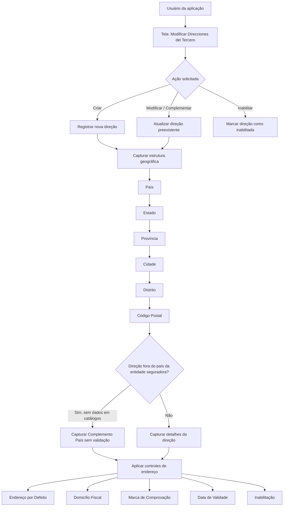

# Documentação Reef — Gestão de Direções do Terceiro

## 1. Metadados do Documento
- **Arquivo de Origem:** `Não informado`
- **Tipo de Documento:** `Manual Operacional`
- **Domínio / Sistema:** `Reef / Gestão de Direções do Terceiro`
- **Público-Alvo:** `Usuários da aplicação, Operação, Negócio e entidades seguradoras`
- **Data/Versão Identificada:** `Não identificada`

---

## 2. Resumo Executivo & Contexto de Negócio

O documento descreve a tela **“Modificar Direcciones del Tercero”**, utilizada para administrar os endereços associados a um Terceiro no sistema Reef. A funcionalidade permite criar um ou mais novos endereços, complementar ou modificar informações de endereços existentes e inabilitar endereços previamente registrados.

A captura e a alteração dos dados de endereço seguem uma sequência configurável de visualização e entrada. A ordem de navegação apresentada é da esquerda para a direita e de cima para baixo, mas a configuração do parâmetro do sistema determina o modo de visualização e captura das informações.

A estrutura territorial do endereço é organizada em cinco níveis geográficos: País, Estado, Província, Cidade e Distrito. Cada nível utiliza códigos provenientes de catálogos existentes no sistema. O Código Postal é associado a essa estrutura geográfica de cinco níveis.

A solução contempla cenários de endereços nacionais e internacionais. Quando a direção não pertence ao país onde está localizada a entidade seguradora e os catálogos territoriais não possuem os dados necessários, o campo **Complemento País** permite registrar livremente as informações de endereço, sem validação. Esse preenchimento é mutuamente exclusivo em relação ao campo **Complemento Dirección**.

O processo também incorpora controles operacionais e de qualidade de dados, incluindo definição de endereço padrão, endereço fiscal, marca de comprovação, inabilitação e data de validade. Para Terceiros com múltiplos endereços, somente um endereço pode ser marcado como padrão e somente um pode ser marcado como endereço fiscal.

---

## 3. Arquitetura, Componentes & Tecnologias Envolvidas

O conteúdo não detalha arquitetura de software, interfaces técnicas, APIs, microsserviços, contratos JSON, métodos HTTP, bancos de dados, URLs, servidores ou ambientes. O documento identifica apenas a aplicação/sistema Reef, a tela de gestão de direções e catálogos territoriais utilizados para validação dos níveis geográficos.

**Componentes e conceitos citados:**

| Componente / Conceito | Função identificada |
| :--- | :--- |
| Reef | Sistema/documentação em que a funcionalidade de gestão de endereços do Terceiro está descrita. |
| Tela “Modificar Direcciones del Tercero” | Tela que permite criar, modificar, complementar ou inabilitar endereços de um Terceiro. |
| Terceiro | Entidade que pode possuir uma ou mais direções associadas. |
| Catálogo de países | Fonte de valores possíveis para o primeiro nível geográfico: País. |
| Catálogo de estados | Fonte de valores possíveis para o segundo nível geográfico: Estado. |
| Catálogo de províncias | Fonte de valores possíveis para o terceiro nível geográfico: Província. |
| Catálogo de localidades | Fonte de valores possíveis para o quarto nível geográfico: Cidade. |
| Catálogo de distritos | Fonte de valores possíveis para o quinto nível geográfico: Distrito. |
| Callejero local | Referência local utilizada para o Tipo de Domicílio e para a composição detalhada da direção. |
| Entidade seguradora | Entidade que realiza codificações locais e utiliza as informações de endereço em processos internos. |



> **Nota de Análise:** O documento não detalha componentes técnicos internos, integrações, persistência de dados, mecanismos de autenticação ou contratos expostos pela funcionalidade.

---

## 4. Regras de Negócio, Especificações Funcionais & Processos

### Ações disponíveis na tela

A tela permite as seguintes ações sobre as direções do Terceiro:

1. **Criar:** registrar uma ou várias direções novas para o Terceiro.
2. **Modificar:** alterar informações de uma direção preexistente do Terceiro.
3. **Complementar:** registrar ou modificar informações complementares de uma direção existente.
4. **Inabilitar:** marcar uma direção associada ao Terceiro como inabilitada para que não seja utilizada nos processos operacionais da entidade.

### Sequência de captura

- A sequência de captura ou modificação é apresentada da esquerda para a direita e de cima para baixo.
- O modo efetivo de visualização e captura depende de um parâmetro de configuração do sistema.
- O documento não informa o nome, valor, localização ou mecanismo técnico desse parâmetro.

### Estrutura geográfica

A direção do Terceiro é estruturada em cinco níveis geográficos codificados:

1. **País:** primeiro nível da estrutura geográfica.
2. **Estado:** segundo nível da estrutura geográfica.
3. **Província:** terceiro nível da estrutura geográfica.
4. **Cidade:** quarto nível da estrutura geográfica.
5. **Distrito:** quinto nível da estrutura geográfica.

Cada campo utiliza a relação de valores existente no catálogo correspondente do sistema.

### Regras para informações complementares

- O campo **Complemento Dirección** permite registrar informação complementar da direção, como urbanização, ponto quilométrico ou andar de um edifício para uma direção comercial.
- O campo **Complemento País** é aplicável quando a direção está fora do país da entidade seguradora e a estrutura territorial não está disponível nos catálogos do sistema.
- O campo **Complemento País** permite capturar os dados da direção sem realizar validação.
- A captura de **Complemento Dirección** é excluinte da captura de **Complemento País**. Portanto, os dois campos não devem ser preenchidos simultaneamente.

### Regras de latitude e longitude

- Latitude e longitude compõem o Sistema de Coordenadas Geográficas.
- As coordenadas são expressas em graus, minutos e segundos, acompanhados de uma indicação cardinal: Norte, Sul, Este ou Oeste.
- A latitude deve ser registrada antes da longitude.
- A latitude identifica a distância angular entre um ponto e o equador.
- A longitude identifica a distância angular entre um ponto e o meridiano de Greenwich.
- O exemplo fornecido no documento é: `(66° 33’ 9’’ N; 11° 04’ 13’’ E)`.
- O campo Latitude deve conter o valor de latitude, como `66° 33’ 9’’ N`.
- O campo Longitude deve conter o valor de longitude, como `11° 04’ 13’’ E`.
- A letra `W` pode aparecer em vez de `O` para indicar Oeste, pois `W` corresponde a *West* em inglês.

### Regras de unicidade para endereços especiais

- Um Terceiro com mais de uma direção associada pode possuir apenas **uma Dirección por Defecto**.
- Um Terceiro com mais de uma direção associada pode possuir apenas **um Domicilio Fiscal**.
- O documento não especifica se a Dirección por Defecto e o Domicilio Fiscal podem apontar para a mesma direção.

### Regras de controle operacional

- A **Marca de Comprobación** indica se a direção foi revisada e verificada, em relação à qualidade dos dados do sistema.
- A marcação de **Inhabilitación** informa ao sistema que a direção não deve ser usada, considerada ou utilizada nos processos operacionais da entidade.
- A **Fecha de Validez** indica a partir de qual data a direção se encontra operacional.
- O campo **Observaciones** permite registrar ou modificar informação complementar para direções novas ou preexistentes.

---

## 5. Tabelas de Parâmetros, Ambientes e Estruturas de Dados

| Item / Parâmetro | Descrição / Função | Tipo / Valores / Formato | Ambiente / Observações |
| :--- | :--- | :--- | :--- |
| Uso de la Dirección | Informa o uso que uma nova direção terá ou o uso já atribuído à direção do Terceiro. | Codificação efetuada localmente pela entidade seguradora. | Utilizado posteriormente nos processos internos da entidade. |
| Secuencia/Orden | Exibe o número de sequência na captura das direções do Terceiro. | Valor atribuído automaticamente. | O documento não detalha o algoritmo de atribuição. |
| País | Código do primeiro nível da estrutura geográfica da direção. | Valor do catálogo de países do sistema. | Primeiro nível geográfico. |
| Estado | Código do segundo nível da estrutura geográfica da direção. | Valor do catálogo de estados do sistema. | Segundo nível geográfico. |
| Provincia | Código do terceiro nível da estrutura geográfica da direção. | Valor do catálogo de províncias do sistema. | Terceiro nível geográfico. |
| Ciudad | Código do quarto nível da estrutura geográfica da direção. | Valor do catálogo de localidades do sistema. | Quarto nível geográfico. |
| Distrito | Código do quinto nível da estrutura geográfica da direção. | Valor do catálogo de distritos do sistema. | Quinto nível geográfico. |
| Código Postal | Chave que identifica o código postal associado aos cinco níveis da estrutura geográfica. | Chave de código postal. | Associado à estrutura geográfica. |
| Tipo de Domicilio | Tipo de via associado à direção do Terceiro. | Codificação do callejero local. | Codificação efetuada localmente pela entidade seguradora. |
| Dirección | Exibe a direção detalhada segundo o callejero e usos locais. | Texto detalhado de direção. | Pode incluir cerrada, urbanização, bloco, escada e apartamento. |
| Número | Número da direção do Terceiro. | Valor conforme o tipo de domicílio. | O documento não define formato ou obrigatoriedade. |
| Complemento Dirección | Registra informações adicionais sobre a direção. | Texto complementar. | Excludente em relação ao campo Complemento País. |
| Complemento País | Registra livremente a direção quando não há informação territorial disponível para endereços fora do país da entidade seguradora. | Texto sem validação. | Excludente em relação ao campo Complemento Dirección. |
| Latitud | Registra a latitude geográfica da direção. | Graus, minutos, segundos e orientação cardinal; exemplo: `66° 33’ 9’’ N`. | Latitude é registrada antes da longitude. |
| Longitud | Registra a longitude geográfica da direção. | Graus, minutos, segundos e orientação cardinal; exemplo: `11° 04’ 13’’ E`. | `W` pode ser usado no lugar de `O` para Oeste. |
| Dirección por Defecto | Define a direção padrão do Terceiro. | Indicador de marcação. | Somente uma direção pode ser marcada como padrão por Terceiro. |
| Marca de Comprobación | Indica se a direção foi revisada e verificada. | Indicador de marcação. | Relacionada à qualidade dos dados. |
| Inhabilitación | Indica que a direção está inabilitada. | Indicador de marcação. | A direção não deve ser utilizada nos processos operacionais. |
| Domicilio Fiscal | Define a direção fiscal do Terceiro. | Indicador de marcação. | Somente uma direção pode ser marcada como fiscal por Terceiro. |
| Fecha de Validez | Indica a data a partir da qual a direção está operacional. | Data. | O documento não define formato de data. |
| Observaciones | Permite registrar ou modificar informações complementares de uma direção. | Texto complementar. | Aplicável a direções novas e preexistentes. |
| Parâmetro de configuração de visualização e captura | Define o modo de visualização e captura das informações. | Não detalhado. | Nome, valores e localização não informados. |

---

## 6. Bateria de Perguntas & Respostas para RAG (FAQ Sintético)

### P1: Quais ações podem ser realizadas na tela “Modificar Direcciones del Tercero”?
**R:** A tela permite criar uma ou várias direções novas para o Terceiro, modificar ou complementar informações de uma direção preexistente e inabilitar uma direção já associada ao Terceiro.

### P2: Como é definida a ordem de captura dos campos de endereço?
**R:** O documento informa que os campos seguem uma sequência da esquerda para a direita e de cima para baixo. Entretanto, a visualização e a captura efetivas dependem de um parâmetro de configuração do sistema, cujo nome e valores não são detalhados.

### P3: Quais são os níveis da estrutura geográfica de uma direção do Terceiro?
**R:** A estrutura geográfica possui cinco níveis: País, Estado, Província, Cidade e Distrito. Cada nível utiliza valores provenientes do respectivo catálogo existente no sistema.

### P4: Como funciona o campo Código Postal?
**R:** O Código Postal é uma propriedade que contém a chave identificadora do código postal associado aos cinco níveis da estrutura geográfica onde a direção do Terceiro está localizada.

### P5: Quando deve ser utilizado o campo Complemento País?
**R:** Complemento País deve ser utilizado quando a direção capturada não pertence ao país onde está a entidade seguradora e os catálogos de definição territorial não possuem as informações necessárias. Nesse cenário, o campo permite capturar os dados da direção sem realizar validação.

### P6: É possível preencher Complemento Dirección e Complemento País ao mesmo tempo?
**R:** Não. A captura de informação no campo Complemento Dirección é excluinte da captura no campo Complemento País. Portanto, os dois campos não podem ser usados simultaneamente para a mesma direção.

### P7: Como devem ser preenchidas latitude e longitude?
**R:** Latitude e longitude devem ser informadas em graus, minutos e segundos, acompanhados da orientação cardinal. A latitude é registrada primeiro e a longitude depois. O exemplo do documento é `(66° 33’ 9’’ N; 11° 04’ 13’’ E)`.

### P8: Quantas direções padrão um Terceiro pode possuir?
**R:** Um Terceiro com mais de uma direção associada pode possuir somente uma direção marcada como Dirección por Defecto, isto é, como direção padrão.

### P9: Quantos domicílios fiscais um Terceiro pode possuir?
**R:** Um Terceiro com mais de uma direção associada pode possuir somente uma direção marcada como Domicilio Fiscal.

### P10: Qual é a função da Marca de Comprobación?
**R:** A Marca de Comprobación permite considerar, nos processos da entidade, se a direção do Terceiro foi revisada e verificada. Esse controle está relacionado à qualidade dos dados existentes no sistema.

### P11: O que acontece quando uma direção é marcada como inabilitada?
**R:** Quando o campo Inhabilitación é marcado, o sistema entende que a direção associada ao Terceiro está inabilitada. A direção não deve ser empregada, considerada ou utilizada nos processos operacionais da entidade.

### P12: Qual é a finalidade da Fecha de Validez?
**R:** A Fecha de Validez indica a partir de que data a direção do Terceiro se encontra operacional.

---

## 7. Glossário de Termos, Siglas & Conceitos-Chave

- **Reef:** Sistema ou contexto documental identificado no conteúdo fornecido.
- **Terceiro:** Entidade que possui uma ou mais direções associadas no sistema.
- **Dirección por Defecto:** Direção padrão do Terceiro; somente uma pode ser marcada dessa forma.
- **Domicilio Fiscal:** Direção fiscal do Terceiro; somente uma pode ser marcada dessa forma.
- **Callejero local:** Referência local usada para classificar o tipo de via e compor a direção detalhada.
- **Complemento Dirección:** Informação adicional sobre uma direção, como urbanização, ponto quilométrico ou andar.
- **Complemento País:** Campo para registrar, sem validação, informações de uma direção internacional não coberta pelos catálogos territoriais.
- **Marca de Comprobación:** Indicador de que a direção foi revisada e verificada em relação à qualidade dos dados.
- **Inhabilitación:** Indicador de que uma direção não deve ser usada nos processos operacionais.
- **Latitud:** Coordenada angular que mede a distância entre um ponto e o equador; simbolizada por `ϕ`.
- **Longitud:** Coordenada angular que mede a distância entre um ponto e o meridiano de Greenwich; simbolizada por `λ`.
- **Sistema de Coordenadas Geográficas:** Sistema de referência que utiliza latitude e longitude para localizar um ponto na superfície terrestre.

---

## 8. Notas Críticas, Riscos & Limitações

- O documento não especifica o nome, os valores permitidos ou a localização do parâmetro que controla o modo de visualização e captura dos campos.
- Não há detalhamento sobre obrigatoriedade, validações de formato, tamanhos máximos, mensagens de erro ou regras de persistência dos campos.
- Não são apresentados métodos de integração, APIs, serviços, banco de dados, logs, servidores, URLs, ambientes ou mecanismos de autorização.
- O preenchimento de **Complemento País** ocorre sem validação, o que pode demandar controles operacionais ou de qualidade de dados não descritos no documento.
- O documento informa unicidade para Dirección por Defecto e Domicilio Fiscal, mas não define o comportamento do sistema diante de tentativa de marcar mais de uma direção para cada papel.
- O documento não esclarece se uma mesma direção pode ser simultaneamente Dirección por Defecto e Domicilio Fiscal.
- Não são apresentados exemplos preenchidos para os campos territoriais, de endereço detalhado, Código Postal, Tipo de Domicilio, Observaciones ou indicadores de controle.

---

## 9. Conteúdo Bruto Estruturado (Referência Fiel)

```text
--- [PÁGINA 1 DE 4] ---

MODIFICAR Direcciones del Tercero
Objetivo
Esta Pantalla permite a los Usuarios de la Aplicación Crear una o varias Direcciones nuevas del Tercero además de Complementar, Modicar
ó Inhabilitar la información de una Dirección Preexistente del Tercero.
Posibles Acciones
 CREAR ( )
 MODIFICAR ( )
 INHABILITAR ( )
Direcciones
La secuencia de captura puede ser..
Documentation / DOCUMENTACIÓN Reef
DOCUMENTACIÓN Reef
Mapfredocument
DOCUMENTACIÓN Reef
Owner
user:agonzalez_mapfre.com
Lifecycle
Approved Source
 / 
 VL
Buscar Inicio Soluciones Arquitecturas APIs Componentes Cloud Documentación Zeus Reef Ayuda
ES


--- [PÁGINA 2 DE 4] ---

... De acuerdo con la conguración del parámetro que le indica al Sistema el modo de visualización y captura de la información.
De Izquierda a Derecha y de Arriba hacia Abajo, los siguientes campos marcan la secuencia de captura o modicación del Tercero en el
sistema.
Uso de la Dirección (   )
Este dato mostrará el uso que va a tener la Dirección en una nueva dirección o el que previamente se le asignó a la Dirección del Tercero de
acuerdo con la codicación efectuada localmente por parte de la entidad aseguradora para su posterior uso en los procesos internos de la
entidad.
Secuencia/Orden
Este dato muestra el Número de Secuencia en la Captura de las Direcciones del Tercero. Es un valor que se asigna automáticamente.
País (   )
Este Campo contiene el código del primer nivel de la estructura Geográca en la que se encuentra ubicada la Dirección del Tercero de
acuerdo con la relación de posibles valores existentes en el catálogo de países existente en el Sistema.
Estado (   )
Este Campo contiene el código del segundo nivel de la estructura Geográca en la que se encuentra ubicada la Dirección del Tercero de
acuerdo con la relación de posibles valores existentes en el catálogo de estados existente en el Sistema.
Provincia (   )
Este Campo contiene el código del tercer nivel de la estructura Geográca en la que se encuentra ubicada la Dirección del Tercero de acuerdo
con la relación de posibles valores existentes en el catálogo de provincias existente en el Sistema.
Ciudad (   )
Este Campo contiene el código del cuarto nivel de la estructura Geográca en la que se encuentra ubicada la Dirección del Tercero de
acuerdo con la relación de posibles valores existentes en el catálogo de localidades existente en el Sistema.
Ejemplo:


--- [PÁGINA 3 DE 4] ---

Distrito (   )
Este Campo contiene el código del quinto nivel de la estructura Geográca en la que se encuentra ubicada la Dirección del Tercero de acuerdo
con la relación de posibles valores existentes en el catálogo de distritos existente en el Sistema.
Código Postal (   )
Esta Propiedad contiene la clave que identica el Código Postal asociado a los cinco niveles de la estructura geográca en la que está
ubicada la Dirección del Tercero.
Tipo de Domicilio (   )
De acuerdo con el callejero local, este dato contendrá el Tipo de Vía que se va a asociar a las Dirección del Tercero de acuerdo con la
codicación efectuada localmente por parte de la entidad aseguradora para su posterior uso en los procesos internos de la entidad.
Dirección (  )
Este Campo muestra la Dirección detallada de acuerdo con el Callejero y los usos locales (Indicación o no de la Cerrada, Urbanización,
Bloque, Escalera, Apartamento,...)
Número (  )
Este Atributo muestra o contendrá el número de la Dirección del Tercero de acuerdo con su tipo de domicilio.
Complemento Dirección (  )
Este Campo permite capturar información complementaria de la Dirección del Tercero como por ejemplo:
1. Para indicar la Urbanización del Domicilio.
2. Para indicar algún punto kilométrico que facilite la ubicación del Domicilio.
3. Para indicar la Planta del Edicio en la que se encuentra la ubicación del Tercero en una Dirección tipicada como Dirección Comercial,
Complemento País (  )
Si la dirección que se está capturando en el sistema no es del país en el que se encuentra la entidad aseguradora es posible que no se cuente
en los catálogos de denición de la estructura territorial la información correspondiente, por lo cual este campo permite capturar 'sin realizar
validación alguna' los datos de la dirección.
La captura de información en el Campo Complemento Dirección es excluyente de la captura de información del Campo Complemento
País
Latitud (  )
La latitud y la longitud son los dos tipos de coordenadas geográcas angulares que conforman el sistema de referencia planetario y que
permiten ubicar un punto cualquiera en la supercie del planeta Tierra.
El sistema de coordenadas que componen la latitud y longitud, conocido como Sistema de Coordenadas Geográcas, tiene como centro
imaginario el centro de la Tierra y expresa sus valores en grados, minutos y segundos, acompañados de una letra que indica la orientación
cardinal dentro del globo: Norte, Sur, Este u Oeste. Esta información suele anotarse entre paréntesis y se escriben primero los datos de la
latitud y luego los de la longitud.
Por ejemplo: Coordenadas del punto X: (66° 33’ 9’’ N; 11° 04’ 13’’ E)
Es decir, el punto X está a 66 grados, 33 minutos, 9 segundos latitud norte, 11 grados, 4 minutos, 13 segundos longitud este. Es posible
encontrar en algunos casos la letra W en vez de O para oeste, ya que se trata del término en inglés (West).
Latitud. Es el ángulo imaginario que determina la distancia entre un punto cualquiera y el ecuador (la línea imaginaria horizontal que divide al
mundo en dos hemisferios: Norte y Sur). En otras palabras, se trata de qué tan lejos o tan cerca está un punto de la referencia del ecuador y
de los trópicos que le son paralelos: el trópico de Cáncer y el de Capricornio. La latitud se simboliza con la letra griega phi, ϕ .
Ejemplo:


--- [PÁGINA 4 DE 4] ---

Longitud. Es el ángulo imaginario que determina la distancia entre un punto y el meridiano de Greenwich o meridiano 0, que atraviesa la
localidad del mismo nombre en Inglaterra. Dicho meridiano es vertical y divide al mundo en dos regiones, la occidental (Oeste) y la oriental
(Este), y sirve para trazar los demás meridianos que cruzan imaginariamente el globo de manera paralela al meridiano de Greenwich. La
longitud se simboliza con la letra griega lambda, λ .
Este Atributo de la dirección del Tercero tiene que contener la información correspondiente a los grados, minutos y segundos que identiquen
su latitud, ... en nuestro ejemplo 66° 33’ 9’’ N
Longitud (  )
Este Atributo de la Dirección del Tercero debe contener la información correspondiente a los grados, minutos y segundos que identican su
longitud, ... con los datos del ejemplo anterior 11° 04’ 13’’ E
Dirección por Defecto (  )
Este Campo, en aquellos Terceros que cuentan con más de una dirección asociada, indicará cual de ellas es la Dirección por Defecto del
Tercero. Solamente puede haber una marcada como tal.
Marca de Comprobación (  )
Esta propiedad permite considerar en los procesos de la entidad si la Dirección del Tercero ha sido o no revisada y vericada, todo ello en
relación con la calidad de los datos en el sistema.
Inhabilitación (  )
El cotejo de este campo le indica al Sistema que la Dirección asociada al Tercero está inhabilitada, por lo que no debería ser empleada,
contemplada o utilizada en los procesos operativos de la entidad.
Domicilio Fiscal (  )
Este Campo, en aquellos Terceros que tienen más de una dirección asociada, indicará cual de ellas es la Dirección Fiscal del Tercero.
Solamente puede haber una marcada como tal.
Fecha de Validez ( )
Esta propiedad indicará la Fecha de Validez de la Dirección del Tercero, es decir, a partir de qué fecha se encuentra operativa.
Observaciones (  )
Este campo permitirá la modicación de la información complementaria de la Dirección para una Dirección del Tercero preexistente además
de permitir su registro para una nueva Dirección del Tercero.
```
