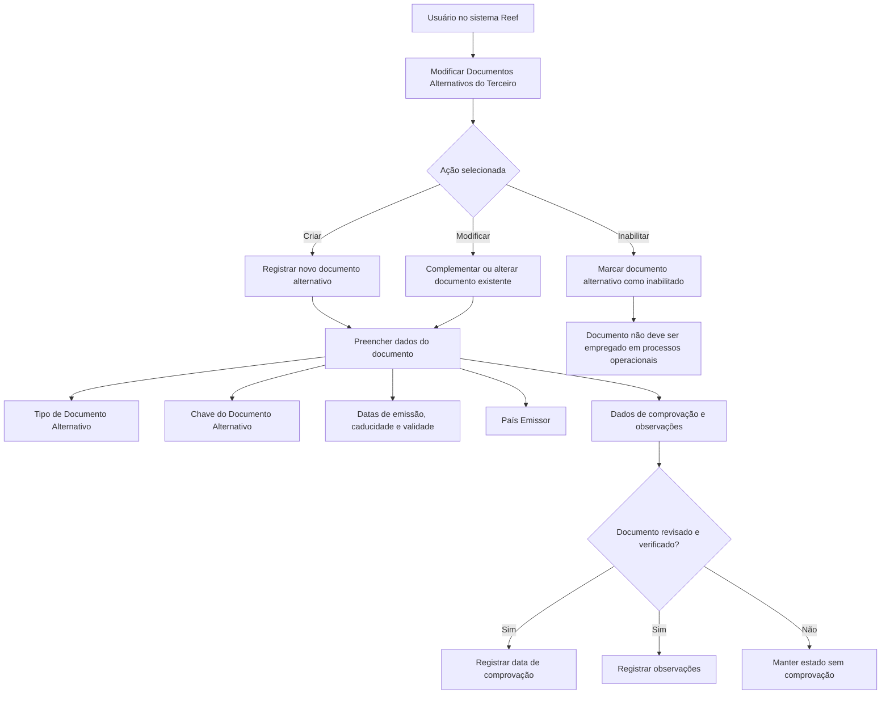

# Gestão de Documentos Alternativos do Terceiro no Sistema Reef

## 1. Metadados do Documento
- **Arquivo de Origem:** Não identificado no conteúdo fornecido
- **Tipo de Documento:** Manual Operacional / Especificação Funcional
- **Domínio / Sistema:** Reef / Mapfre — Documentos Alternativos do Terceiro
- **Público-Alvo:** Operação, analistas funcionais e usuários responsáveis pelo cadastro e validação de Terceiros
- **Data/Versão Identificada:** Não identificada

---

## 2. Resumo Executivo & Contexto de Negócio

O documento descreve a ação **“Modificar Documentos Alternativos del Tercero”**, voltada à administração de documentos alternativos associados a um Terceiro no sistema. A funcionalidade permite criar um ou vários documentos alternativos e também complementar, modificar ou inabilitar informações previamente registradas.

Um documento alternativo identifica o Terceiro de forma alternativa, conforme os tipos de documentos disponíveis no sistema. O processo contempla a captura de informações de identificação, emissão, validade, caducidade, país emissor, verificação e inabilitação.

A qualidade dos dados é tratada por meio da **Marca de Comprobación**, da **Fecha de Comprobación** e do campo de **Observaciones**. Esses dados registram se o documento alternativo foi revisado e verificado e permitem incluir esclarecimentos sobre a validação realizada.

A funcionalidade também suporta histórico de alterações por meio da **Fecha de Validez**, que indica a partir de quando o documento alternativo se torna plenamente operacional no sistema. Quando o campo **Inhabilitación** é marcado, o documento não deve ser empregado, considerado ou utilizado nos processos operacionais da entidade.

---

## 3. Arquitetura, Componentes & Tecnologias Envolvidas

O conteúdo fornecido não descreve arquitetura técnica, integrações, APIs, microsserviços, contratos JSON, tecnologias de infraestrutura ou ambientes de implantação. O documento apresenta exclusivamente um fluxo funcional de manutenção de dados de documentos alternativos de Terceiros no sistema Reef.

Componentes funcionais identificados:

| Componente / Elemento | Descrição |
| :--- | :--- |
| Sistema Reef | Sistema no qual é realizada a captura, modificação, validação e inabilitação de documentos alternativos do Terceiro. |
| Terceiro | Entidade à qual o documento alternativo está associado. |
| Documento Alternativo | Documento utilizado para identificar alternativamente o Terceiro. |
| Catálogo de Países | Relação de valores existentes no sistema utilizada para informar o país emissor do documento alternativo. |
| Marca de Comprobación | Propriedade que indica se o documento alternativo foi revisado e verificado. |
| Inhabilitación | Campo que determina que o documento alternativo não deve ser utilizado nos processos operacionais. |



> **Nota de Análise:** O documento não detalha os métodos de acesso à funcionalidade, regras de obrigatoriedade dos campos, permissões de usuários, persistência de dados, integrações ou comportamento de validações automáticas.

---

## 4. Regras de Negócio, Especificações Funcionais & Processos

### 4.1 Objetivo da ação

A ação permite:

1. Criar um ou vários Documentos Alternativos do Terceiro.
2. Complementar as informações de um Documento Alternativo preexistente do Terceiro.
3. Modificar as informações de um Documento Alternativo preexistente do Terceiro.
4. Inabilitar um Documento Alternativo preexistente do Terceiro.

### 4.2 Ações possíveis

| Ação | Regra funcional descrita |
| :--- | :--- |
| CREAR | Permite criar um ou vários Documentos Alternativos do Terceiro. |
| MODIFICAR | Permite complementar ou modificar informações de um Documento Alternativo preexistente do Terceiro. |
| INHABILITAR | Permite inabilitar um Documento Alternativo do Terceiro. |

### 4.3 Sequência de captura ou modificação

O documento informa que os campos devem ser tratados da esquerda para a direita e de cima para baixo, seguindo a sequência de captura ou modificação do Terceiro no sistema.

### 4.4 Regras funcionais por campo

1. **Tipo Documento Alternativo**
   - O atributo contém o documento alternativo que será utilizado para identificar alternativamente o Terceiro.
   - A identificação ocorre conforme os tipos de documentos existentes no sistema.

2. **Clave del Documento Alternativo**
   - O atributo contém a chave do documento alternativo do Terceiro.

3. **Fecha de Emisión**
   - A propriedade mostra ou contém a data de emissão do Documento Alternativo do Terceiro.

4. **Fecha de Caducidad**
   - A propriedade indica a data de caducidade do Documento Alternativo do Terceiro.
   - A data de caducidade deve ser informada quando for conhecida de forma confiável.

5. **País Emisor**
   - O campo contém o código do país emissor do documento alternativo do Terceiro.
   - O código deve corresponder à relação de valores disponível no catálogo de países existente no sistema.

6. **Marca de Comprobación**
   - A propriedade permite considerar, nos processos da entidade, se o documento alternativo foi ou não revisado e verificado.
   - A finalidade está relacionada à qualidade dos dados no sistema.

7. **Fecha de Comprobación**
   - Quando o estado da Marca de Comprobación indicar que o documento alternativo foi revisado e comprovado, o campo deve registrar a data em que a ação foi realizada.

8. **Observaciones**
   - Caso o documento alternativo tenha sido revisado e validado, o campo permite registrar texto explicativo ou observações relacionadas ao fato da comprovação.

9. **Fecha de Validez**
   - A propriedade indica ao sistema a data a partir da qual o Documento Alternativo do Terceiro estará plenamente operacional.
   - O uso correto da Fecha de Validez permite manter histórico das alterações efetuadas nas informações do documento.

10. **Inhabilitación**
    - Quando marcado, o campo informa ao sistema que o documento alternativo do Terceiro está inabilitado.
    - Um documento alternativo inabilitado não deve ser empregado, considerado ou utilizado nos processos operacionais da entidade.

---

## 5. Tabelas de Parâmetros, Ambientes e Estruturas de Dados

| Item / Parâmetro | Descrição / Função | Tipo / Valores / Formato | Ambiente / Observações |
| :--- | :--- | :--- | :--- |
| Tipo Documento Alternativo | Define o documento utilizado para identificar alternativamente o Terceiro. | Seleção entre tipos de documentos existentes no sistema. | O documento o descreve como atributo de um “colapsador”. |
| Clave del Documento Alternativo | Armazena a chave do documento alternativo do Terceiro. | Chave do documento; formato não detalhado. | O documento o descreve como atributo de um painel. |
| Fecha de Emisión | Registra ou apresenta a data de emissão do Documento Alternativo do Terceiro. | Data; formato não detalhado. | Sem regras adicionais de validação descritas. |
| Fecha de Caducidad | Informa a data de caducidade do Documento Alternativo do Terceiro. | Data; formato não detalhado. | Aplicável quando a data é conhecida de forma confiável. |
| País Emisor | Informa o código do país emissor do documento alternativo. | Código presente no catálogo de países existente no sistema. | O documento não lista os códigos aceitos. |
| Marca de Comprobación | Indica se o documento alternativo foi revisado e verificado. | Marca/campo de comprovação; valores específicos não detalhados. | Relacionado à qualidade dos dados nos processos da entidade. |
| Fecha de Comprobación | Registra a data em que a revisão e comprovação foram realizadas. | Data; formato não detalhado. | Deve ser preenchida quando a Marca de Comprobación indicar revisão e comprovação. |
| Observaciones | Permite registrar texto aclaratório ou observações sobre a comprovação. | Texto livre; tamanho e formato não detalhados. | Aplicável caso o documento tenha sido revisado e validado. |
| Fecha de Validez | Define a data a partir da qual o documento alternativo estará plenamente operacional no sistema. | Data; formato não detalhado. | Permite manter histórico das mudanças efetuadas na informação. |
| Inhabilitación | Indica que o documento alternativo está inabilitado. | Campo de marcação/cotejo; valores específicos não detalhados. | Documento inabilitado não deve ser usado em processos operacionais. |
| CREAR | Cria um ou vários documentos alternativos do Terceiro. | Ação possível. | Não há detalhamento de interface, permissões ou persistência. |
| MODIFICAR | Complementa ou altera um documento alternativo preexistente. | Ação possível. | Não há detalhamento de campos obrigatórios ou trilha de auditoria. |
| INHABILITAR | Inabilita um documento alternativo do Terceiro. | Ação possível. | O documento informa o efeito operacional da inabilitação. |

---

## 6. Bateria de Perguntas & Respostas para RAG (FAQ Sintético)

### P1: Qual é o objetivo da ação “Modificar Documentos Alternativos del Tercero” no sistema Reef?
**R:** A ação permite criar um ou vários Documentos Alternativos do Terceiro, além de complementar, modificar ou inabilitar as informações de um Documento Alternativo preexistente associado ao Terceiro.

### P2: Quais ações estão disponíveis para a gestão de Documentos Alternativos do Terceiro?
**R:** O documento lista três ações possíveis: **CREAR**, para criar documentos alternativos; **MODIFICAR**, para complementar ou modificar documentos existentes; e **INHABILITAR**, para tornar um documento alternativo inabilitado.

### P3: O que representa o campo Tipo Documento Alternativo?
**R:** O campo Tipo Documento Alternativo contém o documento com o qual o Terceiro será identificado alternativamente. A seleção deve considerar os tipos de documentos existentes no sistema.

### P4: Qual informação deve ser registrada em Clave del Documento Alternativo?
**R:** Clave del Documento Alternativo deve conter a chave do documento alternativo associada ao Terceiro. O conteúdo não especifica o formato, o tamanho ou regras de validação dessa chave.

### P5: Quando a Fecha de Caducidad deve ser informada?
**R:** A Fecha de Caducidad indica a data de caducidade do Documento Alternativo do Terceiro e deve ser considerada quando essa data for conhecida de forma confiável.

### P6: Como o País Emisor deve ser informado?
**R:** O País Emisor deve conter o código do país emissor do documento alternativo do Terceiro, de acordo com os valores disponíveis no catálogo de países existente no sistema.

### P7: Qual é a finalidade da Marca de Comprobación?
**R:** A Marca de Comprobación permite que os processos da entidade considerem se o documento alternativo foi revisado e verificado. Essa propriedade está relacionada à qualidade dos dados mantidos no sistema.

### P8: Quando a Fecha de Comprobación deve ser preenchida?
**R:** A Fecha de Comprobación deve contemplar a data em que ocorreu a ação de revisão e comprovação quando o estado da Marca de Comprobación indicar que o documento alternativo foi revisado e comprovado.

### P9: Para que serve o campo Observaciones?
**R:** O campo Observaciones permite inserir texto aclaratório ou observações sobre a comprovação quando o documento alternativo tiver sido revisado e validado.

### P10: Qual é o efeito da Fecha de Validez sobre um Documento Alternativo?
**R:** A Fecha de Validez informa ao sistema a data a partir da qual o Documento Alternativo do Terceiro estará plenamente operacional. O uso correto desse campo permite manter o histórico das alterações efetuadas na informação do documento.

### P11: O que acontece quando o campo Inhabilitación é marcado?
**R:** Quando Inhabilitación é marcado, o sistema deve considerar que o Documento Alternativo do Terceiro está inabilitado. Portanto, esse documento não deve ser empregado, considerado ou utilizado nos processos operacionais da entidade.

### P12: O documento especifica APIs, métodos HTTP ou contratos de integração para Documentos Alternativos?
**R:** Não. O conteúdo fornecido descreve a funcionalidade e os campos de cadastro, mas não detalha APIs, métodos HTTP, contratos JSON, integrações, tecnologias de implementação ou mecanismos de persistência.

---

## 7. Glossário de Termos, Siglas & Conceitos-Chave

- **Reef:** Nome do sistema ou domínio documental mencionado no conteúdo fornecido.
- **Mapfre / Mapfredocument:** Identificação apresentada na navegação e no contexto da documentação.
- **Terceiro:** Entidade para a qual são administrados documentos alternativos.
- **Documento Alternativo:** Documento utilizado para identificar alternativamente um Terceiro no sistema.
- **CREAR:** Ação de criar um ou vários Documentos Alternativos do Terceiro.
- **MODIFICAR:** Ação de complementar ou modificar informações de um Documento Alternativo preexistente.
- **INHABILITAR:** Ação de tornar um Documento Alternativo indisponível para uso operacional.
- **Tipo Documento Alternativo:** Tipo de documento selecionado entre os documentos existentes no sistema para identificação alternativa do Terceiro.
- **Clave del Documento Alternativo:** Chave associada ao Documento Alternativo do Terceiro.
- **Fecha de Emisión:** Data de emissão do Documento Alternativo do Terceiro.
- **Fecha de Caducidad:** Data de caducidade do Documento Alternativo do Terceiro, quando conhecida de forma confiável.
- **País Emisor:** Código do país emissor do Documento Alternativo, selecionado conforme o catálogo de países do sistema.
- **Marca de Comprobación:** Indicador de que um Documento Alternativo foi revisado e verificado.
- **Fecha de Comprobación:** Data em que a revisão e comprovação do documento foram realizadas.
- **Observaciones:** Campo de texto para esclarecimentos ou observações sobre a comprovação.
- **Fecha de Validez:** Data a partir da qual o Documento Alternativo está plenamente operacional no sistema.
- **Inhabilitación:** Indicador de que o documento está inabilitado e não deve ser usado nos processos operacionais.

---

## 8. Notas Críticas, Riscos & Limitações

- O conteúdo não identifica o nome do arquivo de origem, data de publicação, versão documental ou versão do sistema Reef.
- O documento não especifica campos obrigatórios, regras de formato, tamanho, máscara ou validações para a chave do documento, datas, observações ou códigos de país.
- Não há relação explícita entre a ordem visual dos campos e regras técnicas de validação, obrigatoriedade ou dependência entre campos.
- A Fecha de Comprobación possui dependência funcional explícita da Marca de Comprobación: a data é aplicável quando o documento foi revisado e comprovado.
- O campo Observaciones é descrito para casos em que o documento tenha sido revisado e validado, mas o documento não define se o preenchimento é obrigatório.
- A inabilitação possui impacto operacional explícito: documentos inabilitados não devem ser empregados, considerados ou utilizados nos processos operacionais da entidade.
- O documento não detalha permissões, perfis de acesso, auditoria, logs, tratamento de erros, integrações, APIs, bancos de dados ou mecanismos técnicos de histórico.
- **Nota de Análise:** O documento apresenta a funcionalidade de manutenção de documentos alternativos, mas não detalha fluxos de aprovação, regras de reabilitação, exclusão física, critérios de unicidade ou comportamento do sistema diante de datas de validade ou caducidade conflitantes.

---

## 9. Conteúdo Bruto Estruturado (Referência Fiel)

```text
--- [PÁGINA 1 DE 2] ---

MODIFICAR Documentos Alternativos del Tercero
Objetivo
Esta acción permite Crear uno o varios Documentos Alternativos del Tercero además de poder Complementar, Modicar ó Inhabilitar la
información de un Documento Alternativo preexistente del Tercero.
Posibles Acciones
 CREAR ( )
 MODIFICAR ( )
 INHABILITAR ( )
Documentos Alternativos
De Izquierda a Derecha y de Arriba hacia Abajo, los siguientes campos marcan la secuencia de captura o modicación del Tercero en el
sistema.
Tipo Documento Alternativo (  )
Este Atributo del colapsador contiene el documento alternativo con el que se va a identicar alternativamente al Tercero de acuerdo con los
tipos de documentos existentes.
Clave del Documento Alternativo ( )
Este Atributo del panel contiene la clave del documento alternativo del Tercero.
Fecha de Emisión (  )
Esta propiedad mostrará o contendrá la Fecha de Emisión del Documento Alternativo del Tercero.
Fecha de Caducidad (  )
Esta propiedad indica la Fecha de Caducidad del Documento Alternativo del Tercero en el supuesto que la misma se conozca
fehacientemente.
Documentation / DOCUMENTACIÓN Reef
DOCUMENTACIÓN Reef
Mapfredocument
DOCUMENTACIÓN Reef
Owner
user:agonzalez_mapfre.com
Lifecycle
Approved Source
 / 
 VL
Buscar Inicio Soluciones Arquitecturas APIs Componentes Cloud Documentación Zeus Reef Ayuda
ES


--- [PÁGINA 2 DE 2] ---

País Emisor (   )
Este Campo contiene el código del país emisor del documento alternativo del Tercero de acuerdo con la relación de posibles valores
existentes en el catálogo de países existente en el Sistema.
Marca de Comprobación (  )
Esta propiedad permite considerar en los procesos de la entidad si el documento alternativo ha sido o no revisado y vericado, todo ello en
relación con la calidad de los datos en el sistema.
Fecha de Comprobación (  )
En el supuesto que el estado de la marca de comprobación implique que el documento alternativo ha sido revisado y comprobado, este
campo contemplará la fecha en la que esta acción se habrá realizado.
Observaciones (  )
Caso que el documento alternativo haya sido revisado y validado, este Dato permite ingresar un texto aclaratorio u observaciones al hecho de
la comprobación.
Fecha de Validez ( )
Esta propiedad le indica al sistema la fecha a partir de la cual el Documento Alternativo del Tercero estará plenamente operativo en el
sistema por lo que su correcto uso permite tener un histórico de los cambios efectuados en su información.
Inhabilitación (  )
El cotejo de este campo le indica al Sistema que el documento alternativo del Tercero está inhabilitado, por lo que no debería ser empleado,
considerado o utilizado en los procesos operativos de la entidad.
```
