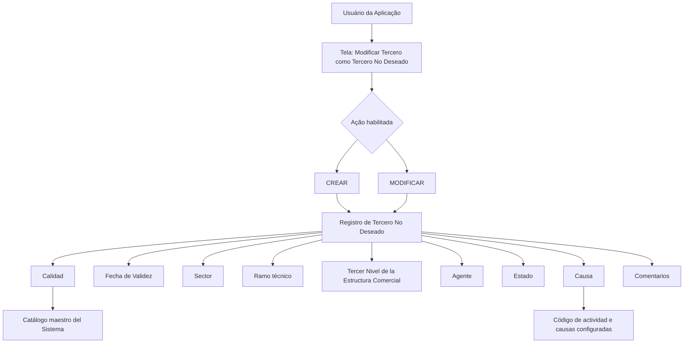

# Especificação Funcional — Modificar Tercero como Tercero No Deseado

## 1. Metadados do Documento
- **Arquivo de Origem:** Não identificado no conteúdo extraído
- **Tipo de Documento:** Especificação Técnica / Especificação Funcional
- **Domínio / Sistema:** Reef / Mapfredocument — gestão de Terceros No Deseados
- **Público-Alvo:** Desenvolvedores, Analistas Funcionais, Operação e Negócio
- **Data/Versão Identificada:** Não identificada; o conteúdo apresenta `Lifecycle: Approved` e a marcação `VL`.

---

## 2. Resumo Executivo & Contexto de Negócio

O documento especifica a tela **“Modificar Tercero como Tercero No Deseado”**, destinada aos usuários da aplicação. A tela permite registrar um terceiro como não desejado ou modificar as informações de um terceiro já identificado nessa condição.

A identificação de um terceiro como não desejado ocorre de acordo com o código de atividade e com valores que identificam inequivocamente o terceiro no sistema. O documento declara duas ações habilitadas: **CREAR** e **MODIFICAR**.

A captura de informações segue uma ordem visual definida: da esquerda para a direita e de cima para baixo. Os atributos cobrem classificação, vigência, segmentação comercial, contexto técnico, agente, estado, causa e justificativa textual.

O processo suporta a classificação de pessoas físicas ou jurídicas como indesejáveis. A causa de inabilitação é determinada por causas ou motivos configurados por código de atividade no sistema.

> *Nota de Análise: O documento descreve atributos funcionais da tela, mas não detalha permissões, regras de obrigatoriedade, formatos de campos, métodos HTTP, contratos JSON, integrações externas ou persistência de dados.*

---

## 3. Arquitetura, Componentes & Tecnologias Envolvidas

Os elementos explicitamente citados no conteúdo são:

| Componente / Termo | Papel identificado no documento |
| :--- | :--- |
| Reef | Área de documentação identificada como `DOCUMENTACIÓN Reef`. |
| Mapfredocument | Identificador exibido no conteúdo de documentação. |
| Aplicação | Sistema utilizado pelos usuários para criar ou modificar o registro de terceiros não desejados. |
| Catálogo mestre do sistema | Fonte de valores previamente codificados para o atributo `Calidad`. |
| Código de atividade | Contexto usado para identificar o terceiro e configurar causas ou motivos de inabilitação. |
| Estrutura Comercial | Estrutura que contém o terceiro nível comercial associado ao terceiro não desejado. |
| Ramo técnico | Contexto técnico para o qual o terceiro é considerado não desejado. |



> *Nota de Análise: O diagrama representa exclusivamente o fluxo funcional de captura e classificação descrito. O conteúdo não apresenta arquitetura de infraestrutura, serviços, bancos de dados, APIs, protocolos ou integrações.*

---

## 4. Regras de Negócio, Especificações Funcionais & Processos

1. A tela permite aos usuários da aplicação registrar um terceiro como **Tercero No Deseado**.
2. A tela também permite modificar as informações de um terceiro classificado como **Tercero No Deseado**.
3. A classificação ocorre segundo:
   - o código de atividade; e
   - os valores que identificam inequivocamente o terceiro no sistema.
4. As ações habilitadas no documento são:
   - `CREAR`;
   - `MODIFICAR`.
5. A sequência de captura dos atributos deve ser interpretada da esquerda para a direita e de cima para baixo.
6. O atributo **Calidad** identifica o código de qualidade associado ao terceiro. Esse código deve corresponder a valores previamente codificados no catálogo mestre do sistema no momento do registro como terceiro não desejado.
7. O atributo **Fecha de Validez** informa a data a partir da qual o terceiro é identificado como terceiro não desejado.
8. O atributo **Sector** contém o código do setor no qual o terceiro é considerado não desejado.
9. O atributo **Ramo** apresenta o código do ramo técnico para o qual o terceiro é considerado não desejado.
10. O atributo **Tercer Nivel de la Estructura Comercial** determina o código do terceiro nível da estrutura comercial no qual o terceiro é considerado não desejado.
11. O atributo **Agente** contém o código do agente para o qual o terceiro é considerado não desejado.
12. O atributo **Estado** determina a classificação das possíveis condições e situações que identificam o terceiro como terceiro não desejado.
13. O atributo **Causa** identifica o motivo de inabilitação e de consideração do terceiro como não desejado. As causas ou motivos de inabilitação devem estar configurados por código de atividade no sistema.
14. O atributo **Comentarios** permite capturar texto plano para ampliar ou detalhar a razão pela qual o terceiro é considerado uma pessoa física ou jurídica indesejável.

---

## 5. Tabelas de Parâmetros, Ambientes e Estruturas de Dados

| Item / Parâmetro | Descrição / Função | Tipo / Valores / Formato | Ambiente / Observações |
| :--- | :--- | :--- | :--- |
| Acción | Define a operação realizada na tela. | `CREAR` ou `MODIFICAR`. | Ambas as ações são explicitamente habilitadas. |
| Calidad | Identifica o código de qualidade associado ao terceiro. | Código de qualidade. | O valor é previamente codificado no catálogo mestre do sistema. |
| Fecha de Validez | Mostra a data a partir da qual o terceiro é identificado como não desejado. | Data. | O formato da data não é detalhado. |
| Sector | Contém o código do setor associado à condição de terceiro não desejado. | Código de setor. | Valores permitidos não detalhados. |
| Ramo | Mostra o código do ramo técnico associado à condição de terceiro não desejado. | Código de ramo técnico. | Valores permitidos não detalhados. |
| Tercer Nivel de la Estructura Comercial | Determina o código do terceiro nível da estrutura comercial aplicável ao terceiro. | Código de estrutura comercial. | O modelo da estrutura comercial não é detalhado. |
| Agente | Contém o código do agente para o qual o terceiro é considerado não desejado. | Código de agente. | Valores permitidos não detalhados. |
| Estado | Determina a classificação das condições e situações que identificam o terceiro como não desejado. | Classificação de estado. | Estados possíveis não detalhados. |
| Causa | Identifica o motivo de inabilitação do terceiro. | Causa ou motivo configurado. | Configurado por código de atividade no sistema. |
| Comentarios | Permite ampliar ou detalhar o motivo da classificação como pessoa física ou jurídica indesejável. | Texto plano. | Tamanho máximo, obrigatoriedade e validações não detalhados. |
| Catálogo maestro del Sistema | Origem dos valores previamente codificados de qualidade. | Catálogo mestre. | Citado especificamente para `Calidad`. |
| Lifecycle | Estado documental exibido no conteúdo. | `Approved`. | Metadado da documentação. |
| Owner | Proprietário exibido no conteúdo. | `user:agonzalez_mapfre.com`. | Metadado da documentação. |

---

## 6. Bateria de Perguntas & Respostas para RAG (FAQ Sintético)

### P1: Qual é o objetivo da tela “Modificar Tercero como Tercero No Deseado”?
**R:** A tela permite aos usuários da aplicação registrar um terceiro como terceiro não desejado ou modificar as informações de um terceiro já identificado como terceiro não desejado, considerando o código de atividade e valores que identificam inequivocamente o terceiro no sistema.

### P2: Quais ações estão habilitadas na funcionalidade de Tercero No Deseado?
**R:** O documento habilita duas ações: `CREAR`, para registrar um terceiro como não desejado, e `MODIFICAR`, para alterar as informações de um terceiro já considerado não desejado.

### P3: De onde vem o código de Calidad do terceiro?
**R:** O atributo `Calidad` identifica o código de qualidade associado ao terceiro. Esse código deve estar previamente codificado no catálogo mestre do sistema no momento em que o terceiro é registrado como não desejado.

### P4: O que representa a Fecha de Validez?
**R:** A `Fecha de Validez` mostra a data a partir da qual o terceiro está identificado como terceiro não desejado.

### P5: Qual é a finalidade dos campos Sector e Ramo?
**R:** `Sector` contém o código do setor no qual o terceiro é considerado não desejado. `Ramo` mostra o código do ramo técnico para o qual o terceiro é considerado não desejado.

### P6: Como a Estrutura Comercial é utilizada na classificação de um terceiro não desejado?
**R:** O campo `Tercer Nivel de la Estructura Comercial` determina o código do terceiro nível da estrutura comercial em que o terceiro está considerado como terceiro não desejado.

### P7: Qual informação o campo Agente armazena?
**R:** O campo `Agente` contém o código do agente para o qual o terceiro está considerado como terceiro não desejado.

### P8: Qual é o papel do campo Estado?
**R:** O atributo `Estado` determina a classificação das possíveis condições e situações que identificam o terceiro como terceiro não desejado. O documento não enumera os estados possíveis.

### P9: Como a causa de inabilitação é definida?
**R:** O campo `Causa` identifica o motivo pelo qual o terceiro está sendo inabilitado e considerado não desejado. As causas ou motivos de inabilitação são configurados por código de atividade no sistema.

### P10: Para que serve o campo Comentarios?
**R:** O campo `Comentarios` permite capturar texto plano para ampliar ou detalhar o motivo pelo qual o terceiro é considerado uma pessoa física ou jurídica indesejável.

### P11: O documento especifica os formatos técnicos, APIs ou contratos de integração da tela?
**R:** Não. O conteúdo descreve a finalidade da tela, as ações habilitadas e os atributos funcionais, mas não apresenta métodos HTTP, contratos JSON, endpoints, tecnologias, banco de dados, formatos de payload ou integrações.

### P12: Em que ordem os dados devem ser capturados na tela?
**R:** O documento informa que os atributos seguem uma sequência de captura da esquerda para a direita e de cima para baixo.

---

## 7. Glossário de Termos, Siglas & Conceitos-Chave

- **Tercero:** Terceiro identificado no sistema; o documento não apresenta definição organizacional adicional.
- **Tercero No Deseado:** Terceiro considerado não desejado ou inabilitado de acordo com o código de atividade e valores de identificação no sistema.
- **Calidad:** Código de qualidade associado ao terceiro e previamente codificado no catálogo mestre do sistema.
- **Fecha de Validez:** Data a partir da qual o terceiro está identificado como não desejado.
- **Sector:** Código do setor no qual o terceiro é considerado não desejado.
- **Ramo:** Código do ramo técnico associado à classificação do terceiro como não desejado.
- **Tercer Nivel de la Estructura Comercial:** Código do terceiro nível da estrutura comercial aplicável ao terceiro não desejado.
- **Agente:** Código do agente associado ao terceiro considerado não desejado.
- **Estado:** Classificação das condições e situações que identificam o terceiro como não desejado.
- **Causa:** Motivo de inabilitação configurado por código de atividade no sistema.
- **Comentarios:** Campo de texto plano para detalhar a classificação de uma pessoa física ou jurídica como indesejável.
- **Reef:** Identificação da área de documentação exibida como `DOCUMENTACIÓN Reef`.
- **Mapfredocument:** Identificador exibido no conteúdo da documentação.

---

## 8. Notas Críticas, Riscos & Limitações

- O documento não especifica quais campos são obrigatórios, opcionais ou condicionais.
- Não são apresentados formatos de data, limites de tamanho, domínios de valores, máscaras ou validações de entrada.
- Não há definição dos valores possíveis para `Estado`, `Sector`, `Ramo`, `Agente` ou níveis da estrutura comercial.
- O documento afirma que as causas são configuradas por código de atividade, mas não descreve a fonte de configuração, governança, responsáveis ou comportamento quando uma causa não estiver disponível.
- Não são descritas regras de autorização para as ações `CREAR` e `MODIFICAR`.
- Não há detalhamento de persistência, auditoria, integrações, APIs, mensagens de erro ou comportamento após criação e modificação.
- A origem do conteúdo apresenta caracteres corrompidos em algumas palavras, como `Modicar`, `clasicación` e `congurado`; a interpretação funcional foi preservada sem alterar o conteúdo bruto de referência.

---

## 9. Conteúdo Bruto Estruturado (Referência Fiel)

```text
--- [PÁGINA 1 DE 2] ---

MODIFICAR TERCERO como Tercero No Deseado
Objetivo
Esta Pantalla permite a los Usuarios de la Aplicación Registrar al Tercero como Tercero no deseado o Modicar la información del Tercero
como Tercero No Deseado de acuerdo con su código de actividad y de los valores que lo identican inequívocamente como Tercero en el
Sistema.
Acciones habilitadas
 CREAR ( )
 MODIFICAR ( )
Datos Terceros No Deseados
De Izquierda a Derecha y de Arriba hacia Abajo, los siguientes atributos marcan la secuencia de captura de la Información en el sistema.
Calidad (   )
Este Campo identica el código de calidad que tenga asociado al Tercero de acuerdo con los valores previamente codicados en el catálogo
maestro del Sistema, en el momento de registrarlo como Tercero No Deseado.
Fecha de Validez ( )
Esta propiedad muestra la fecha a partir de la cual el Tercero está identicado como Tercero No Deseado.
Sector (  )
Este campo contiene el código del sector en el que el Tercero está considerado como Tercero no deseado.
Ramo (  )
Este Campo muestra el código del ramo técnico para el cual el Tercero está considerado como Tercero no deseado.
Documentation / DOCUMENTACIÓN Reef
DOCUMENTACIÓN Reef
Mapfredocument
DOCUMENTACIÓN Reef
Owner
user:agonzalez_mapfre.com
Lifecycle
Approved Source
 / 
 VL
Buscar Inicio Soluciones Arquitecturas APIs Componentes Cloud Documentación Zeus Reef Ayuda
ES


--- [PÁGINA 2 DE 2] ---

Tercer Nivel de la Estructura Comercial (  )
Determina el código del tercer nivel de la Estructura Comercial en el que el Tercero está considerado como Tercero no deseado.
Agente (  )
Este Campo contiene el código del agente para el que el Tercero está considerado como Tercero no deseado.
Estado (   )
Este atributo determina la clasicación de las posibles condiciones y situaciones que identican al Tercero como Tercero No Deseado.
Causa (   )
Identica el motivo por el cual se está "inhabilitando" y considerando al tercero como tercero no deseado, de acuerdo con las causas o
motivos de inhabilitación que se hayan congurado por código de actividad en el Sistema.
Comentarios (  )
Este Atributo permite capturar texto plano para ampliar o detallar el motivo por el que se está considerando al Tercero como una Persona
Física o Jurídica indeseable.
```
