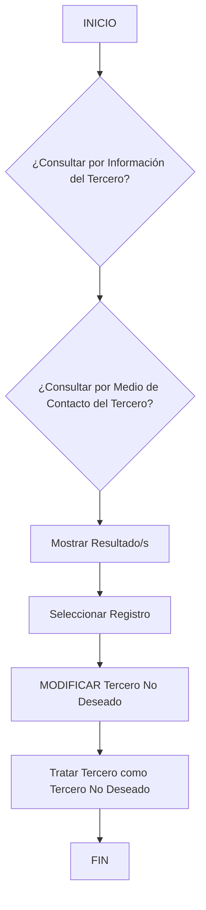

# Operação: Modificar Terceiro como Terceiro Não Desejado — Documentação Reef

## 1. Metadados do Documento
- **Arquivo de Origem:** `Não identificado no conteúdo fornecido`
- **Tipo de Documento:** `Procedimento`
- **Domínio / Sistema:** `Reef / Mapfre (conforme termos presentes no texto)`
- **Público-Alvo:** `Não identificado explicitamente; o conteúdo descreve uma operação sobre Terceiro Não Desejado`
- **Data/Versão Identificada:** `Não identificada`

---

## 2. Resumo Executivo & Contexto de Negócio

O documento descreve a operação **“MODIFICAR Tercero No Deseado”**, relacionada ao tratamento de um terceiro como **Terceiro Não Desejado**. A operação permite registrar um terceiro nessa condição e, adicionalmente, complementar ou modificar informações preexistentes desse terceiro como Terceiro Não Desejado.

O fluxo apresentado inicia com consultas sobre informações do terceiro e sobre meio de contato. O documento também apresenta critérios de busca por dados do terceiro ou por meio de contato, seguidos da exibição de resultados, seleção de registro e execução da operação de modificação.

A documentação está associada aos termos **Reef**, **DOCUMENTACIÓN Reef** e **Mapfredocument**. O conteúdo disponibilizado não descreve integrações, tecnologias, contratos de API, persistência de dados, permissões, validações detalhadas ou campos específicos do cadastro.

A finalidade operacional explicitada é tratar um terceiro como não desejado, preservando a possibilidade de atualizar ou complementar informações já existentes para esse terceiro nessa classificação.

---

## 3. Arquitetura, Componentes & Tecnologias Envolvidas

O conteúdo não apresenta arquitetura de software, tecnologias, módulos técnicos, microsserviços, APIs, bancos de dados ou ambientes identificáveis. Os elementos funcionais explicitamente mencionados são:

| Componente / Elemento | Descrição sustentada pelo conteúdo |
| :--- | :--- |
| Operação “MODIFICAR Tercero No Deseado” | Operação para registrar, complementar ou modificar informações de um Terceiro Não Desejado. |
| Tercero / Terceiro | Entidade consultada e tratada pela operação. |
| Medio de Contacto / Meio de Contato | Critério possível para consulta do terceiro. |
| Criterios de Búsqueda / Critérios de Busca | Área que apresenta consulta por dados do terceiro ou por meio de contato. |
| Mostrar Resultado/s | Etapa de apresentação dos resultados de busca. |
| Seleccionar Registro | Etapa de seleção de um registro retornado. |
| Reef | Termo presente na documentação e na navegação exibida. |
| Mapfredocument | Termo exibido no conteúdo bruto. |



> **Nota de Análise:** O diagrama reconstrói apenas a sequência textual visível no fluxo. As ramificações identificadas como “SI” e “NO” não possuem conexões suficientemente detalhadas no conteúdo fornecido para determinar todos os caminhos condicionais com precisão.

---

## 4. Regras de Negócio, Especificações Funcionais & Processos

### Operação descrita

A operação **“MODIFICAR Tercero No Deseado”** permite:

1. Registrar o terceiro como um **Terceiro Não Desejado**.
2. Complementar informações preexistentes que o terceiro já possuía como Terceiro Não Desejado.
3. Modificar informações preexistentes que o terceiro já possuía como Terceiro Não Desejado.

### Critérios de busca apresentados

O documento apresenta dois critérios de consulta:

1. **Consultar por Dados do Terceiro**.
2. **Consultar por Meio de Contato do Terceiro**.

### Fluxo operacional identificado

1. Iniciar a operação.
2. Consultar informações do terceiro, conforme decisão exibida no fluxo.
3. Consultar por meio de contato do terceiro, conforme decisão exibida no fluxo.
4. Exibir resultado ou resultados.
5. Selecionar um registro.
6. Executar a operação **MODIFICAR Tercero No Deseado**.
7. Tratar o terceiro como Terceiro Não Desejado.
8. Finalizar o processo.

> **Nota de Análise:** O documento não especifica campos obrigatórios, regras de validação, critérios para classificar um terceiro como não desejado, mensagens de erro, perfis autorizados, trilha de auditoria ou comportamento para consultas sem resultados.

---

## 5. Tabelas de Parâmetros, Ambientes e Estruturas de Dados

| Item / Parâmetro | Descrição / Função | Tipo / Valores / Formato | Ambiente / Observações |
| :--- | :--- | :--- | :--- |
| MODIFICAR Tercero No Deseado | Operação para registrar, complementar ou modificar informações de um Terceiro Não Desejado. | Operação funcional | Não informado |
| Tercero / Terceiro | Entidade sobre a qual a operação é executada. | Entidade de negócio | Não informado |
| Tercero No Deseado / Terceiro Não Desejado | Classificação aplicada ao terceiro pela operação. | Classificação de negócio | Não informado |
| Datos del Tercero | Critério de busca disponível. | Critério de consulta | Não informado |
| Medio de Contacto | Critério de busca disponível. | Critério de consulta | Não informado |
| Mostrar Resultado/s | Exibição dos resultados obtidos pela consulta. | Etapa de processo | Não informado |
| Seleccionar Registro | Seleção de um registro antes da modificação. | Etapa de processo | Não informado |
| Reef | Termo associado à documentação. | Sistema, domínio ou área não detalhada | Não informado |
| Mapfredocument | Termo exibido no conteúdo. | Não detalhado | Não informado |
| Owner | Campo exibido na documentação. | `user:agonzalez_mapfre.com` | O significado operacional do campo não é explicado |

---

## 6. Bateria de Perguntas & Respostas para RAG (FAQ Sintético)

### P1: Em que consiste a operação “MODIFICAR Tercero No Deseado”?
**R:** A operação permite registrar um terceiro como Terceiro Não Desejado e também complementar ou modificar informações preexistentes que esse terceiro já possuía nessa condição.

### P2: Quais critérios de busca estão disponíveis para localizar um terceiro?
**R:** O documento apresenta consulta por **Dados do Terceiro** e consulta por **Meio de Contato do Terceiro**.

### P3: O que acontece após a consulta por dados do terceiro ou meio de contato?
**R:** O fluxo indica a etapa **“Mostrar Resultado/s”**, seguida por **“Seleccionar Registro”** antes da execução da operação de modificação.

### P4: É possível alterar informações já existentes de um Terceiro Não Desejado?
**R:** Sim. O texto declara que a operação permite complementar ou modificar a informação preexistente que o terceiro possuía como Terceiro Não Desejado.

### P5: Qual é a entidade de negócio tratada pelo procedimento?
**R:** A entidade tratada é o **Tercero / Terceiro**, que pode ser registrado e tratado como **Tercero No Deseado / Terceiro Não Desejado**.

### P6: O documento descreve quais campos devem ser preenchidos ao modificar um Terceiro Não Desejado?
**R:** Não. O conteúdo fornecido não identifica campos, formatos, obrigatoriedades ou regras de preenchimento.

### P7: O documento especifica métodos HTTP ou contratos de API para a operação?
**R:** Não. Não há métodos HTTP, endpoints, contratos JSON, serviços, APIs ou tecnologias técnicas descritos no conteúdo.

### P8: O processo exige selecionar um registro?
**R:** Sim. O fluxo apresentado contém a etapa **“Seleccionar Registro”** após a exibição de resultados e antes de **“MODIFICAR Tercero No Deseado”**.

### P9: O que significa “Mostrar Resultado/s” no fluxo?
**R:** “Mostrar Resultado/s” representa a etapa em que o processo exibe um ou mais resultados provenientes da consulta realizada sobre o terceiro ou seu meio de contato.

### P10: Qual sistema ou domínio é mencionado na documentação?
**R:** O conteúdo menciona os termos **Reef**, **DOCUMENTACIÓN Reef** e **Mapfredocument**, mas não detalha a relação técnica ou funcional entre esses termos.

---

## 7. Glossário de Termos, Siglas & Conceitos-Chave

- **Tercero / Terceiro:** Entidade consultada e tratada no procedimento.
- **Tercero No Deseado / Terceiro Não Desejado:** Classificação atribuída ao terceiro no contexto da operação documentada.
- **MODIFICAR Tercero No Deseado:** Operação para registrar, complementar ou modificar informações de um Terceiro Não Desejado.
- **Datos del Tercero:** Dados do terceiro usados como critério de busca.
- **Medio de Contacto:** Meio de contato usado como critério de busca.
- **Reef:** Termo presente na documentação; seu significado não é definido no conteúdo fornecido.
- **Mapfredocument:** Termo exibido no conteúdo bruto; seu significado não é definido no conteúdo fornecido.
- **Owner:** Campo exibido com o valor `user:agonzalez_mapfre.com`; seu papel não é explicado.

---

## 8. Notas Críticas, Riscos & Limitações

- O conteúdo não especifica quais atributos compõem os dados do terceiro ou o meio de contato.
- O fluxo contém decisões com rótulos “SI” e “NO”, mas as conexões completas entre as ramificações não são visíveis no texto extraído.
- Não há detalhamento de critérios de elegibilidade para classificar um terceiro como não desejado.
- Não há informações sobre autenticação, autorização, perfis de acesso, auditoria ou responsáveis pela aprovação da alteração.
- Não há definição de mensagens de erro, tratamento de registros duplicados, comportamento sem resultados ou regras de atualização.
- Não há detalhes sobre tecnologias, APIs, URLs, ambientes, servidores, logs, integrações ou contratos de dados.
- O conteúdo apresenta caracteres potencialmente corrompidos na palavra `Modicar`; a interpretação contextual indica “Modificar”, mas a transcrição bruta é preservada na seção de referência.

---

## 9. Conteúdo Bruto Estruturado (Referência Fiel)

```text
--- [PÁGINA 1 DE 1] ---

OPERACIÓN MODIFICAR Tercero como Tercero no Deseado
¿En que consiste?
Esta operación permite Registrar al Tercero como un Tercero No Deseado además de poder Complementar o Modicar la información
preexistente que tuviera el Tercero como Tercero no deseado.
Proceso
SI
NO
SI
NO
INICIO ¿Consultar por **Información**
del Tercero?
¿Consultar por **Medio
de Contacto** del Tercero?
Mostrar Resultado/s Seleccionar
Registro **MODIFICAR** Tercero No Deseado
FIN
Criterios de Búsqueda
 ¿Consultar por Datos del Tercero? ( )
 ¿Consultar por Medio de Contacto del Tercero?( )
Tratar Tercero como Tercero No Deseado
 MODIFICAR Tercero No Deseado (  )
Documentation / DOCUMENTACIÓN Reef
DOCUMENTACIÓN Reef
Mapfredocument
DOCUMENTACIÓN Reef
Owner
user:agonzalez_mapfre.com
Lifecycle
Approved Source
 / 
 VL
Buscar Inicio Soluciones Arquitecturas APIs Componentes Cloud Documentación Zeus Reef Ayuda
ES
```
